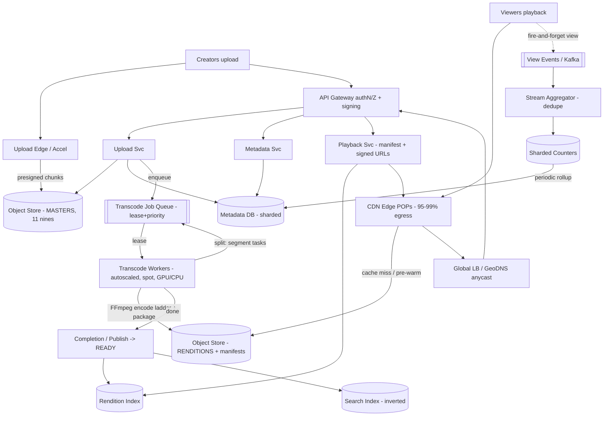

# A01 — Design YouTube / a video streaming service

This tests whether you can take **media to planet scale**: ingest creator uploads, transcode each into a multi-bitrate ladder through a distributed pipeline, store petabytes durably, and deliver to **billions of viewers** at low rebuffer rates via a global CDN with adaptive bitrate streaming — while the metadata, view counts, and search stay fast and consistent enough. Google asks it because it forces every axis at once: heavy async compute (transcoding), exabyte storage economics, edge/CDN delivery, hot-key handling (a viral video), and an explicit consistency model for counts and metadata — the breadth-with-depth that separates Staff from L5.

## 1) Clarify — questions to ask the interviewer

- **Read/write asymmetry:** This is the defining fact — are we optimizing for the **~1 upload : ~thousands-of-views** ratio? I'll assume the system is overwhelmingly read-heavy and design delivery first, ingest second.
- **Functional scope:** Upload + transcode + playback is the core. Are **comments, channels/subscriptions, live streaming, Shorts, monetization/ads, and recommendations** in scope, or can I name them and defer? I'll propose deferring recommendations and live to keep the 60 min focused on the media plane.
- **Scale:** Daily active viewers, hours uploaded per minute, average video length and views-per-video distribution (it's heavy-tailed — a few videos get billions of views). I'll assume **~2B MAU, ~500 hours uploaded/min, ~1B watch-hours/day**.
- **Latency / quality targets:** What's the bar — **startup time (time-to-first-frame) < ~1–2 s**, **rebuffer ratio < ~0.5%**, and "720p ready within minutes of upload"? Playback quality (rebuffering) is the metric users feel.
- **Consistency needs:** Must **view counts** be exact and real-time, or is "eventually accurate, monotonic, slightly delayed" fine (it is — and that unlocks huge throughput)? Must a newly uploaded video be **instantly** searchable/visible, or is seconds-to-minutes acceptable?
- **Geographic distribution + device mix:** Global audience -> multi-region + CDN mandatory. Device range from low-end mobile on 3G to 4K TVs -> **adaptive bitrate** is non-negotiable, not a nice-to-have.
- **Durability + cost:** Source masters must never be lost (everything is recomputable from them); but storing every rendition of every video forever is an exabyte cost problem — is **tiered/cold storage and re-transcode-on-demand for the long tail** acceptable?
- **DRM / content policy:** Do we need DRM, age-gating, copyright (Content ID) matching? I'll flag these as real but adjacent and defer the internals.

**What the interviewer is signaling:** they want to see you **split the problem into an async upload/transcode pipeline and a read-optimized delivery path**, and treat them with different consistency and scaling models. The highest-signal moves: declaring early that **playback is served from CDN edges, not origin**; that **view counts are eventually-consistent on purpose**; and that **transcoding is an embarrassingly-parallel queue+worker pipeline**. The deep dives will be the **transcoding pipeline** and **CDN + adaptive bitrate delivery**.

## 2) Functional Requirements (FR)

**In-scope**

- **Upload** a video (large files, resumable/chunked) and durably persist the **source master**.
- **Transcode** each upload into a **multi-bitrate ABR ladder** (e.g. 144p–4K, H.264 + AV1) packaged as **HLS/DASH** segments + manifest, plus thumbnails.
- **Store** masters and renditions in object storage; serve renditions via **CDN with edge caching**.
- **Playback** with **adaptive bitrate streaming** — the player picks a rendition per segment based on measured bandwidth/buffer.
- **Metadata**: title, description, channel, duration, tags; create/read/update; list a channel's videos.
- **View counts** and basic engagement (likes), eventually-consistent but monotonic and not easily gamed.
- **Search by metadata** (title/keywords) — basic; full ranking deferred.

**Out-of-scope (defer)**

- **Recommendations / home-feed ranking** (huge ML system — name it, defer).
- **Live streaming** (sub-second/low-latency path is a different architecture — call out the difference).
- **Comments, subscriptions, notifications, monetization/ads** (adjacent CRUD + fan-out problems).
- **DRM, Content ID / copyright matching, moderation ML** — acknowledge as required in production, defer internals.

## 3) Non-Functional Requirements (NFR)

| Dimension | Target & rationale |
|---|---|
| Scale | ~2B MAU; ~500 hrs uploaded/min; ~1B watch-hours/day. Read-dominated: **views >> uploads by ~3–4 orders of magnitude**. |
| Latency | **Time-to-first-frame < 1–2 s** (served from nearby CDN edge); **rebuffer ratio < 0.5%**; metadata reads p99 < 100 ms. |
| Availability | **99.95%+** for playback + metadata read (degraded-but-watchable beats down); upload can be slightly lower (async, retriable). |
| Consistency | **Metadata read-your-writes within seconds**; **view counts eventually-consistent + monotonic** (approximate is acceptable, exact is not worth the cost). |
| Durability | **11 nines** for source masters (erasure-coded, geo-replicated) — masters are the source of truth; renditions are recomputable. |
| Throughput (delivery) | Tens of **Tbps** egress globally at peak; the CDN absorbs the vast majority so origin sees a tiny fraction. |
| Cost | First-class: exabyte storage + Tbps egress dominate. Lever via **CDN offload, tiered storage, per-title encoding, cold long-tail**. |
| Security | Signed playback URLs, optional DRM, abuse/bot protection on counts and upload. |

## 4) Back-of-envelope estimation

```
UPLOAD / INGEST
  Upload rate:    500 hours/min uploaded
                  = 500*60 = 30,000 video-seconds per real second
  Say avg video = 10 min => uploads/min = 500/ (10/60)? -> 500 hrs / 10min = 3000 videos/min = 50 videos/s
  Master bitrate ~10 Mbps (1080p source) -> 10 min * 10 Mbps = ~750 MB/master
  Ingest bytes/day:  ~3000 videos/min * 60 *24 * 750 MB = ~3.2e6 videos/day * 750MB
                     = ~2.4 PB/day of MASTERS ingested

STORAGE
  ABR ladder ~5-6 renditions, total ~1.5x master after compression mix
                     ~1.1 GB outputs/video
  Per day (masters + outputs): ~2.4 PB + ~3.5 PB = ~6 PB/day
  Per year: ~2 EB/year added  (=> tiered storage + cold long-tail is mandatory)

DELIVERY (the dominant axis)
  Watch-hours/day ~1e9.  Avg playback bitrate (mixed devices) ~3 Mbps.
  Egress/day = 1e9 hrs * 3600 s * 3 Mbps / 8 = ~1.35e9 * 3600 * 0.375 MB
             ~ 1.8 EB/day delivered  (!!)
  => Average egress ~ (1.8e18 bytes/day) ~ 167 Tbps average, multiples at peak.
  CDN MUST absorb ~95-99% of this; origin serves only cache-fill + cold tail.

CACHE / CDN
  Popularity is heavy-tailed: ~the top ~5-10% of videos drive the large majority of views.
  Cache the hot set at edge: if hot working set ~ a few PB, distribute across
  many edge POPs; each POP caches its region's hot set in SSD/RAM tiers.

VIEW COUNTS
  Views/day ~ tens of billions of view-events.
  ~ 1e10 / 86400 ~ 1.2e5 view-events/s avg, multiples at peak.
  => cannot hit a single counter row; must shard + aggregate (see deep dive).

METADATA QPS
  Each watch => ~1 metadata read + several segment requests.
  Metadata reads ~ 1e5-1e6 QPS -> KV with heavy cache; writes (uploads) ~tens/s only.
```

The decisive numbers: **delivery egress (~hundreds of Tbps) dwarfs everything**, so the entire design is "push bytes to the edge and serve almost nothing from origin." Storage grows at **~exabytes/year**, forcing tiered/cold storage and per-title encoding. View-events at **~10^5/s** can't touch a single row, forcing sharded counters.

## 5) API design

```
# Upload (resumable, bytes bypass app servers)
POST /videos                        -> {videoId, uploadId, multipartUrls[]}   # presigned
PUT  <presigned-part-url>           (client uploads chunks directly to blob store)
POST /videos/{id}/complete  {parts[]} -> {status: PROCESSING}                 # finalize master, enqueue transcode

# Metadata
PATCH /videos/{id}        {title, description, tags, visibility}
GET   /videos/{id}        -> {meta, status, availableRenditions[], manifestUrl}
GET   /channels/{id}/videos?cursor=...  -> {videos[], nextCursor}

# Playback (manifest from API/edge, segments from CDN)
GET  /videos/{id}/manifest.mpd      -> DASH manifest (or .m3u8 HLS)  [signed]
GET  <cdn>/{id}/{rendition}/seg_{n}.m4s  -> media segment            [signed, cacheable]

# Engagement
POST /videos/{id}/view              {sessionId, position}   -> 204   # fire-and-forget, deduped
POST /videos/{id}/like              -> 204

# Search (basic)
GET  /search?q=...&cursor=...       -> {results[], nextCursor}
```

Two design tells in the API: **upload bytes go directly to blob storage via presigned URLs** (never through app servers), and **segments are static, signed, cacheable CDN URLs** while only the small manifest touches our edge logic. View is **fire-and-forget + deduped**, not a synchronous increment.

## 6) Architecture — request & data flow

THE centerpiece. ASCII layered flow first, then a tailored Mermaid flowchart.

### (a) ASCII layered block diagram

```
        Creators (upload)                                 Viewers (playback, billions)
              |                                                   |
              |  presigned chunks (bytes bypass app)              |  HTTP range / segment GETs
              v                                                   v
      [ Upload Edge / Accel ]                            [ CDN Edge POPs ]  <- 95-99% of egress
              |                                            |   (SSD/RAM tiers, signed URLs)
              v                                            |  miss (cache-fill only)
      [ Global LB / GeoDNS (anycast) ] <------------------+----------------+
              |                                            ^                |
              v                                            | manifest       |
      [ API Gateway ]  authN/Z, rate-limit, signing        | (small)        |
        /        |          \                              |                |
       v         v           v                             |                |
 [ Upload Svc ][ Metadata Svc ][ Playback Svc ]------------+                |
   finalize      CRUD + read    issues manifest + signed URLs               |
   master        |   ^             |                                        |
       |         |   | cache       |  reads rendition list                  |
  put  v         v   |             v                                        |
 [ Object Store: MASTERS ]   [ Metadata DB ]   [ Rendition Index ]          |
  (immutable, 11 nines)       (sharded KV/SQL)  (which renditions exist)    |
       |                          ^                                         |
       | enqueue transcode        | view-count rollups (async)             |
       v                          |                                        |
 [ Transcode Job Queue ] (durable, lease+heartbeat, priority)              |
       |  lease                   |                                        |
       v                          |                                        |
 [ Transcode Worker Pool ] (autoscaled, spot, GPU/CPU)                     |
   PROBE -> SPLIT into segments -> ENCODE ladder (FFmpeg) ->               |
   PACKAGE HLS/DASH -> THUMBS                                              |
       |  write outputs (idempotent, deterministic keys)                  |
       v                                                                  |
 [ Object Store: RENDITIONS + manifests ] ----origin pull / pre-warm------+
       |
       | completion event                  VIEW PATH (async):
       v                          view event -> [ Ingest/Kafka ] -> [ Stream aggregator ]
 [ Completion / Publish ] ->                    -> sharded counters -> periodic rollup -> Metadata
   flip status=READY, index for search                       (eventually consistent, monotonic)
       |
       v
 [ Search Index (inverted, by metadata) ]
```

**Write / upload path.** A creator calls Upload Svc, gets **presigned multipart URLs**, and uploads chunks **directly to object storage** (bytes never transit our services — critical at PB/day). On `complete`, Upload Svc finalizes the **master**, writes a metadata row with `status=PROCESSING`, and enqueues a job on the **durable transcode queue**. A worker leases the job, **probes** it, **splits** the source into segments, **fans those segment-encode tasks back onto the queue** so the pool encodes one video's chunks in parallel, runs **FFmpeg** per rendition, **packages** HLS/DASH, writes outputs to object storage at **deterministic idempotent keys**, and emits a completion event. The **Publish** step flips `status=READY`, registers available renditions in the **Rendition Index**, and indexes metadata into the **Search Index**. Now the video is watchable.

**Read / playback path.** A viewer's request resolves via **anycast GeoDNS** to the nearest POP. The player fetches a small **manifest** (from Playback Svc / edge), which lists rendition + segment URLs. Then it streams **media segments as static, signed, cacheable GETs from the CDN edge** — **95–99% are cache hits**, served from edge SSD/RAM; only cold/long-tail misses pull from origin object storage (and we pre-warm hot content). The **player runs adaptive bitrate**: it measures throughput + buffer occupancy and picks the next segment's rendition (steps down on congestion to avoid rebuffer, up when headroom exists). Metadata (title, etc.) is a cached KV read.

**View-count path (deliberately async).** Each play emits a **fire-and-forget view event** to a stream (Kafka). A **stream aggregator** dedupes (by session) and increments **sharded counters**; a periodic **rollup** sums shards into the displayed count in metadata. The count is **eventually consistent and monotonic** — never blocks playback, never hits a single hot row.

### (b) Mermaid flowchart



## 7) Data model & storage choices

**Object storage (erasure-coded blob) — the bulk plane.** Two namespaces: **masters** (immutable, 11 nines, the recomputable source of truth) and **renditions + manifests** (segments at deterministic keys `…/{videoId}/{rendition}/seg_{n}.m4s`). *First-principles:* video bytes are large, immutable-after-write, sequentially read in ranges, and need cheap-per-GB durable storage — exactly what an erasure-coded object store is for; a database would be the wrong tool. Tier renditions: hot in fast storage near CDNs, **long-tail in cold storage** (re-transcode or re-warm on demand).

**Metadata DB — sharded KV (or sharded relational), partitioned by `videoId`.** Stores `{videoId, channelId, title, description, tags, duration, status, visibility, createdAt, viewCount}`. *Why:* point reads by id at **10^5–10^6 QPS** with **read-your-writes within seconds** — a horizontally partitioned KV with heavy caching fits; relational is fine too since write volume (uploads) is tiny. Reads are cache-first; the long tail of cold metadata falls through to the store.

**Rendition Index — small KV** mapping `videoId -> {available renditions, manifest pointer, packaging}`. Read on every playback start; tiny and highly cacheable. Kept separate so "what can I play" is independent of bulky metadata and of transcode internals.

**View counters — sharded counters + stream aggregation, NOT a row you increment.** Write path is a stream; counts live as **N shard-counters per video** summed by rollup. *First-principles:* a single counter row for a viral video is a textbook **hot key** (10^5 writes/s to one row) — sharding the counter and accepting eventual+monotonic consistency trades exactness (which nobody needs to the unit) for throughput.

**Search Index — inverted index over metadata** (title/description/tags -> postings of videoIds), updated at publish. Basic keyword retrieval; full ranking/recs deferred. Separate store because text retrieval wants an inverted index, not a KV.

**Transcode Job + Segment state — strongly-consistent transactional store** (small): one row per job + per segment task, with CAS state transitions (`PROCESSING -> READY` only when all segment outputs exist). Coordination data, not bulk data.

## 8) Deep dive

The two cruxes are **(A) the transcoding pipeline** (turning one upload into a watchable ABR ladder, correctly, cheaply, in parallel) and **(B) CDN + adaptive bitrate delivery** (serving hundreds of Tbps at <0.5% rebuffer). Spend the most time here.

**A. Transcoding pipeline (async, parallel, idempotent).**

- **Why a queue + worker pool, not synchronous:** encoding a 10-min video is minutes of CPU; blocking the upload request is a non-starter. The **durable priority queue** is also the shock absorber for bursty uploads (everyone uploads at peak hours) and the substrate for crash-safe **at-least-once + lease** redelivery.
- **Segment-first parallelism (the key move):** the first worker **probes** then **splits** the source into ~2–6 s segments and **fans segment-encode tasks back onto the queue**. Now one video is encoded **across the whole pool in parallel** — wall-clock drops from ~50 core-minutes serial to a few minutes — and a crash loses *seconds* of redo, not the whole encode.
- **The ABR ladder:** each segment is encoded into multiple **renditions** (144p…4K) and **codecs** (H.264 for compatibility, **AV1/VP9** for bitrate savings on hot content), then **packaged** into HLS/DASH with a manifest. **Per-title / content-aware encoding** analyzes scene complexity so a simple talking-head video doesn't burn bits at 4K — big compute *and* storage savings at our scale.
- **Exactly-once *effect* under at-least-once delivery:** segment outputs are written at **deterministic keys** derived from `(videoId, segmentIdx, rendition)`, so a redelivered task **overwrites identical bytes** — no duplicates. Completion = "all expected output keys exist," verified with a **CAS** on job state; a **fencing/attempt token** stops a zombie worker (woke after lease expiry) from clobbering. After the manifest is durably written, flip `READY` and emit completion.
- **Cost levers:** **spot/preemptible** workers (reclamation is just another lease expiry — perfect fit), **GPU encode** for heavy codecs, **autoscale on queue depth/age** (not CPU), **first-playable fast lane** (encode 720p before the full ladder so the video is watchable in minutes).

**B. CDN + adaptive bitrate delivery (the read plane that dominates everything).**

- **Hierarchical caching:** edge POPs (closest to users) -> regional mid-tier caches -> origin object storage. The popularity curve is heavy-tailed, so a **small hot working set serves most views**; we keep it in edge **SSD/RAM tiers** and **pre-warm** new-but-likely-hot uploads. Origin only sees **cache-fill + cold tail** — that's how ~Tbps becomes a manageable origin load.
- **Why segments + manifest (not one file):** chunking the video into independent, individually-cacheable segments is what makes both **edge caching** and **adaptive switching** possible — each segment is a static, signed, immutable URL with a long TTL.
- **Adaptive Bitrate (ABR) on the client:** the player picks each next segment's rendition from **measured throughput and buffer occupancy** (e.g. a buffer-based / hybrid rule). It **steps down** when the network degrades (protect against rebuffer — the metric users feel) and **steps up** when there's headroom. Startup uses a low rendition for **fast time-to-first-frame**, then ramps. This is why we transcode a *ladder*: the client needs choices per segment.
- **Cache efficiency + correctness:** consistent-hash segment keys across edge servers to spread load and dedupe fills; **request coalescing** at the edge so a thundering herd on a just-viral video triggers **one** origin fill, not millions; signed URLs + token TTLs for access control without per-request origin calls.
- **Multi-region origin:** renditions geo-replicated so each region's CDN fills from a nearby origin; viewers always hit the nearest edge via anycast.

## 9) Key tradeoffs

| Decision | Choice & why |
|---|---|
| Upload vs delivery | **Two separate planes** — async upload/transcode (write-rare, compute-heavy) vs read-optimized delivery (read-billions). Different consistency, scaling, cost models. |
| Sync vs async transcode | **Async pipeline** behind a durable queue — encoding is minutes-long; queue absorbs upload bursts and gives crash-safe redelivery. |
| Delivery semantics | **Static, immutable, signed segment URLs from CDN** — 95–99% cache hit; origin serves only fill + cold tail. The single biggest scale lever. |
| ABR location | **Client-side adaptive bitrate** — the client has ground truth (its own buffer + throughput); server-side can't react per-segment as well. |
| Encode unit | **Segment-level** over whole-file — parallelizes one video across the pool, smaller crash blast radius; cost is a stitch/package step. |
| View-count consistency | **Eventually consistent + monotonic, sharded counters** — exact real-time counts on a viral video = hot-key death; nobody needs unit-exactness. |
| Metadata store | **Sharded KV + heavy cache**, read-your-writes in seconds — point reads at 10^5–10^6 QPS; writes are rare. |
| Storage tiering | **Hot near CDN, long-tail cold** (+ per-title encoding) — exabyte/yr growth makes "store every rendition hot forever" economically impossible. |
| Worker instances | **Spot/preemptible + GPU** — pipeline tolerates worker loss already; large cost win. |

## 10) Bottlenecks & failure modes

- **Viral video (signature hot key):** one video gets billions of views. *Mitigation:* CDN edge caching makes it a non-event for delivery; **request coalescing** so one origin fill serves the herd; **sharded view counters** so the count write doesn't hit one row.
- **Thundering herd on cache miss (new viral upload):** many edges + clients miss simultaneously. *Mitigation:* request coalescing / single-flight at each cache tier; **pre-warm** likely-hot content at publish.
- **Transcode worker crash mid-encode:** *Mitigation:* lease expiry + redelivery + **idempotent segment writes at deterministic keys** -> only seconds of redo, exactly-once output; fencing tokens stop zombies.
- **Upload spike (everyone uploads at peak):** *Mitigation:* the **queue absorbs it** (backpressure); autoscale workers on queue depth; bytes go straight to blob (Upload Svc only enqueues, stays available); per-creator concurrency caps.
- **Poison input (corrupt/unsupported media):** retry loop. *Mitigation:* validate at probe, bounded retries + backoff -> **dead-letter** + alert; master retained so reprocessing is always possible.
- **Origin / object-store throttling under burst fills:** *Mitigation:* key-prefix sharding, multi-region origin, mid-tier caches to collapse fills.
- **Metadata hot partition (a mega-channel):** *Mitigation:* shard by videoId not channelId; cache channel listings; paginate.
- **Cost blowout (egress + storage):** *Mitigation:* maximize CDN offload, per-title encoding, cold-tier the long tail, AV1 for hot content.

## 11) Scale 10x / evolution

- **First thing that breaks: delivery egress + CDN economics** at 10× views. *Evolve:* push deeper edge presence / ISP-embedded caches (bring bytes even closer), aggressive **AV1/per-title encoding** to cut bytes-per-view, smarter pre-warming from popularity prediction.
- **Storage growth (~exabytes/yr -> 10×).** *Evolve:* don't store every rendition forever — keep masters + popular renditions; **re-transcode cold long-tail on demand**; tier hard to cold/archival; dedupe identical re-uploads (content hashing).
- **Transcode compute + cost.** *Evolve:* more GPU/hardware encode, content-aware bit allocation, regional pipelines near upload origin, predictive autoscaling off the daily upload curve.
- **View-event firehose (10× -> ~10^6/s).** *Evolve:* more counter shards, hierarchical pre-aggregation in the stream, regional rollups merged centrally.
- **Multi-region everything:** pipelines + origins per region, async master replication, search index replicated; viewers always nearest edge.
- **New surfaces (Shorts/live):** live needs a **low-latency path** (chunked-transfer/LL-HLS, smaller segments, edge transcode) — a separate pipeline reusing the same storage/CDN substrate.

## 12) Interviewer probes & follow-ups

- **"A video goes viral — billions of views in a day. What happens?"** Delivery is fine: it's served from CDN edges (hot set caches instantly), with **request coalescing** so origin sees ~one fill. The **view count** uses sharded counters + stream aggregation, so the write doesn't hit a single hot row; the displayed count is eventually consistent + monotonic.
- **"Why adaptive bitrate, and where does the decision live?"** Devices/networks vary enormously; we transcode a **ladder** so the **client** can pick each segment's rendition from its own measured throughput + buffer — stepping down to avoid rebuffer, up when there's headroom. The client has the ground truth, so the decision lives there.
- **"How is transcoding crash-safe and not duplicating output?"** At-least-once queue + **idempotent writes at deterministic keys** + completion = "all output keys exist" + CAS on final state. A redelivered segment overwrites identical bytes; fencing tokens stop zombie workers.
- **"How fast is a video watchable after upload, and how do you speed it up?"** Minutes, via **segment-level parallelism** (one video across the whole pool) and a **first-playable fast lane** that encodes 720p before the full ladder.
- **"How don't you fall over when everyone uploads at peak?"** Bytes go straight to blob via presigned URLs; Upload Svc only enqueues so it stays up; the **durable queue absorbs the spike** (backpressure); workers autoscale on queue depth; per-creator caps keep it fair.
- **"Do you store every rendition forever?"** No — masters always (recomputable source), popular renditions hot, and the **cold long tail is tiered/archived or re-transcoded on demand**. At exabyte/yr, this is mandatory.
- **"Strong or eventual consistency for view counts, and why is that OK?"** Eventual + monotonic. Exact real-time counts on a viral video is a hot-key throughput killer, and no product requirement needs unit-exact counts — approximate-but-monotonic is the right trade.
- **"How do you keep newly uploaded videos searchable quickly?"** Publish step indexes metadata into the inverted index at `READY`; visibility within seconds. Full ranking/recs are a separate deferred system.

## 13) 60-minute flow cheat-sheet

| Time | What to do |
|---|---|
| 0–3 min | Frame the problem: **read-dominated** (views >> uploads), split into **async upload/transcode** and **read-optimized delivery** planes. State that early. |
| 3–9 min | **Clarify:** scope (defer recs/live/ads), scale (MAU, hrs/min, watch-hrs), latency (TTFF, rebuffer), consistency (counts eventual? metadata read-your-writes?), durability, cost. |
| 9–14 min | **FR + NFR + estimation:** surface the two big numbers — **delivery egress ~hundreds of Tbps** (CDN must absorb ~all) and **~exabytes/yr storage** (tiering + per-title encoding). |
| 14–20 min | **API + high-level architecture:** draw the ASCII flow — presigned upload (bytes bypass app), transcode queue+workers, object store, CDN delivery, async view counts. |
| 20–24 min | Walk the **upload/transcode path** and the **playback path** (manifest + signed CDN segments + client ABR), and the **view-count path** (async). |
| 24–44 min | **Deep dive (the crux):** (A) transcoding — segment-first parallelism, ABR ladder, per-title encoding, idempotent exactly-once-effect, spot/GPU; (B) CDN + adaptive bitrate — hierarchical cache, coalescing, client ABR, pre-warm. Most time here. |
| 44–50 min | **Consistency + counts + metadata:** sharded counters, eventual+monotonic, read-your-writes metadata; why exact counts aren't worth it. |
| 50–55 min | **Tradeoffs + bottlenecks:** viral hot key, thundering herd, poison input -> dead-letter, storage/egress cost. |
| 55–60 min | **10× evolution + wrap:** deeper edge caches, AV1/per-title, re-transcode cold tail, predictive autoscale. Restate the big idea: **two planes — absorb writes in a parallel idempotent pipeline, serve reads almost entirely from the edge, and make counts eventually-consistent on purpose.** |
