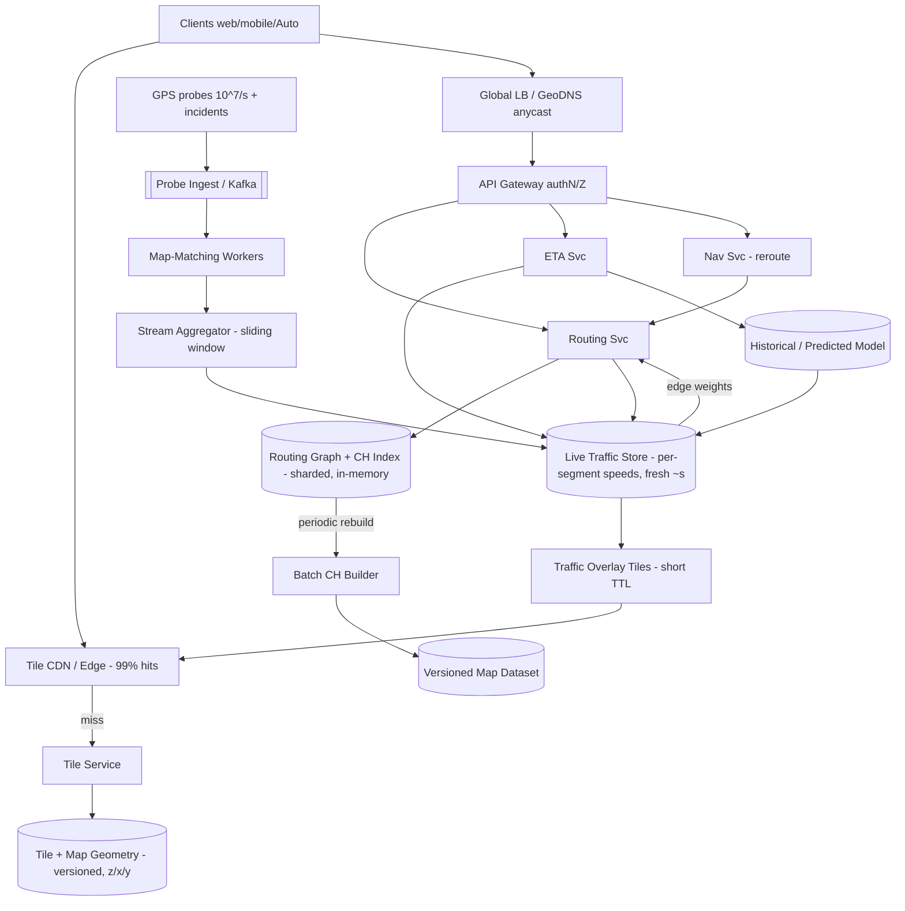

# A02 — Design Google Maps / a routing service

This tests whether you can fuse **a massive static geospatial dataset, a graph algorithm, and a real-time data stream** into a single low-latency product: serve map tiles to billions, model the road network as a graph, compute shortest paths in **milliseconds**, and fold **live traffic** into both ETAs and route choice — all while reasoning about **freshness vs consistency** (a road closed 30 seconds ago should re-route you; a tile rendered yesterday is fine). Google asks it because it forces spatial indexing, graph preprocessing (you cannot run vanilla Dijkstra over a continent per request), a streaming ingestion plane, and explicit precompute-vs-query tradeoffs — the kind of layered system Staff engineers own.

## 1) Clarify — questions to ask the interviewer

- **Functional scope:** Which surfaces — **map display (tiles), routing/directions, ETA, live traffic**? Are **search/geocoding, places/reviews, Street View, turn-by-turn navigation re-routing** in scope or deferrable? I'll propose the core = tiles + routing + ETA + traffic, and defer geocoding/places internals.
- **Routing modes + objective:** Driving only, or also walking/transit/cycling? Optimize for **fastest time** (traffic-aware) vs shortest distance? Multi-stop? I'll assume **driving, traffic-aware fastest path** as the primary.
- **Scale + read/write mix:** Tile + route QPS, and the asymmetry — **tiles and routes are read-massive; map data updates are rare; traffic updates are a high-volume stream**. I'll assume **~1B MAU, ~10^5–10^6 route QPS, tile QPS higher, ~10^7+ GPS probes/s** feeding traffic.
- **Latency target:** What's the bar — **route response p99 < ~100–200 ms**, tile fetch < a few tens of ms (from CDN)? This rules out per-request graph search over a continent and forces preprocessing.
- **Freshness requirements:** How fresh must traffic be in a route — **seconds to a minute**? How fresh must the map graph be — **a road closure should reflect in minutes**, a new road in hours/days? This is the central tradeoff.
- **Consistency model:** Is it acceptable that two users querying the same route a second apart get slightly different ETAs (yes — traffic is inherently eventually-consistent and approximate)? Tiles can be served stale; routing reads a recent traffic snapshot.
- **Accuracy bar:** ETA error tolerance? Do we need historical/time-of-day traffic models (rush hour) in addition to live? I'll assume yes — ETA blends **live + historical + predicted**.
- **Coverage + geography:** Global, all road classes? Offline maps? I'll keep online + global, mention offline as an extension.

**What the interviewer is signaling:** they want you to recognize that **you cannot run Dijkstra over a planet-scale graph per request** — so the headline move is **graph preprocessing** (contraction hierarchies / hierarchical routing) to turn a continental shortest-path into a millisecond query, plus **map tiling / spatial indexing** for display, plus a **streaming traffic plane** that updates edge weights. Calling out **precompute-vs-query** and **freshness-vs-consistency** early is the Staff signal. Deep dives: **routing (graph model + CH/A* + traffic-aware weights)** and **traffic ingestion + ETA**.

## 2) Functional Requirements (FR)

**In-scope**

- **Map tiles:** serve raster/vector tiles for a viewport at multiple **zoom levels**, panned/zoomed by the client; cached at the edge.
- **Routing:** given origin + destination (+ optional waypoints), return the **best route(s)** with geometry and turn-by-turn steps.
- **ETA:** compute estimated travel time using **live + historical + predicted** traffic.
- **Live traffic ingestion:** consume **GPS probe data** (and incident reports) at high volume; derive per-segment speeds; update routing edge weights and a traffic overlay.
- **Traffic-aware re-routing:** if conditions change materially, support re-computing a better route mid-trip (navigation).
- **Freshness:** road closures/incidents reflected in routing within minutes; live speeds within seconds.

**Out-of-scope (defer)**

- **Geocoding / search / autocomplete of places** (its own retrieval system — name it, defer).
- **Places/POI metadata, reviews, photos, Street View imagery** (adjacent content systems).
- **Transit schedules / multimodal** internals (mention as a mode, defer the data pipeline).
- **Map data production** (how the base map is built from satellite/sensor/contributions) — consume it as a versioned dataset.

## 3) Non-Functional Requirements (NFR)

| Dimension | Target & rationale |
|---|---|
| Scale | ~1B MAU; route QPS ~10^5–10^6; tile QPS higher; **~10^7+ GPS probes/s** feeding traffic. Read-massive; map writes rare. |
| Latency | **Route p99 < 100–200 ms**; tile p99 < tens of ms (CDN). Forces graph preprocessing — no per-request continental Dijkstra. |
| Availability | **99.95%+** for tiles + routing reads. Degrade gracefully: if live traffic is stale, fall back to historical/free-flow rather than fail. |
| Consistency / freshness | **Tiles eventually consistent** (stale OK); **traffic eventually consistent**, live speeds fresh within **seconds**, closures within **minutes**. Approximate ETAs accepted. |
| Durability | Base map graph + tiles durably stored + versioned; traffic is **derived + ephemeral** (recomputable from the probe stream). |
| Accuracy | ETA within a reasonable error band; blend live + historical + prediction; honor closures/turn restrictions. |
| Cost | Tile CDN egress + continuous probe ingestion + periodic CH preprocessing are the cost centers. |
| Security/privacy | GPS probes **anonymized/aggregated**; signed tile/route URLs; abuse protection. |

## 4) Back-of-envelope estimation

```
GRAPH SIZE
  Global road network: ~ O(10^8) nodes (intersections) and ~ O(10^8-10^9) edges (road segments).
  Per-edge data (geometry ptr, length, base speed, class, restrictions) ~ tens of bytes.
  Graph core ~ tens to low-hundreds of GB -> shardable, mostly in memory across a fleet.

ROUTING COST (why we precompute)
  Vanilla Dijkstra over 10^8 nodes ~ hundreds of millions of ops per query.
  At 10^5-10^6 route QPS that is impossible at <200ms.
  Contraction Hierarchies / hierarchical routing turn a continental query into
  ~ thousands of edge relaxations (settle only "important" shortcut edges)
  => sub-millisecond to low-ms graph search per query. THIS is the unlock.

  Preprocessing cost (build CH shortcuts): hours of batch compute over the whole graph,
  re-run on map updates (rare) -> amortized; partial re-contraction on local edits.

TILES
  Zoom levels ~0..~20. Tile = 256x256.
  Number of tiles explodes ~4^zoom; only populated/visited regions matter.
  Each session loads ~10s of tiles per view; vector tiles ~ few KB-tens KB each.
  Tile QPS very high but ~99% served from CDN/edge cache (tiles change rarely).

TRAFFIC INGESTION
  ~1e7 probes/s (anonymized GPS points: segmentId, speed, ts).
  Map-match each probe to a road segment, aggregate per-segment speed over a window.
  Per-segment live-speed table ~ O(10^8) segments, updated every few seconds
  for active segments -> a fast in-memory speed store (KV/TSDB), feeding edge weights.

  Traffic edge-weight updates/s ~ up to millions of active segments refreshed per window.

CACHE / STORAGE
  Route cache: popular OD pairs / corridors cache well (commute routes repeat).
  ETA cache short-TTL (traffic moves) -> seconds-level TTL.
```

The decisive insight: **you precompute your way out of the latency problem.** A planet-scale shortest path is infeasible per request, so **Contraction Hierarchies / hierarchical routing** reduce it to a few thousand relaxations — a millisecond query. The other axis is the **traffic stream**: ~10^7 probes/s map-matched and aggregated into per-segment speeds that **adjust edge weights**, kept fresh within seconds.

## 5) API design

```
# Tiles (static-ish, signed, CDN-cacheable)
GET  /tiles/{z}/{x}/{y}.{fmt}        -> vector/raster tile         [signed, cacheable]
GET  /tiles/traffic/{z}/{x}/{y}      -> traffic overlay tile       [short TTL]

# Routing
POST /route   { origin:{lat,lng}, dest:{lat,lng}, waypoints[],
                mode:DRIVING, depart_at|now, alternatives:true }
      -> { routes:[ { geometry, distance_m, eta_s, steps[], traffic_aware:true } ], ... }

GET  /eta?route_id=...               -> { eta_s }  # refresh ETA on an active route

# Live navigation (re-route)
POST /navigate/update  { trip_id, current:{lat,lng,heading}, ts }
      -> { reroute?:bool, new_route?:{...}, next_step }

# Traffic ingestion (internal, high-volume, async)
POST /probes  (batched)  { probes:[ {seg_or_point, speed, ts, anon_id} ] } -> 202
POST /incidents          { type:CLOSURE|CRASH|..., location, ttl } -> {incidentId}
```

Two tells: routing is a **single POST that returns alternatives with traffic-aware ETAs** (the graph search + traffic blend happen server-side over preprocessed structures), and **probes are a high-volume async batch ingest** (202, fire-and-forget) — never on the user-facing latency path.

## 6) Architecture — request & data flow

THE centerpiece. ASCII layered flow first, then a tailored Mermaid flowchart.

### (a) ASCII layered block diagram

```
        Clients (web / mobile / Auto)
          |                 |                       \
   tile GETs           route POST                navigation updates
          |                 |                          |
          v                 v                          v
   [ Tile CDN / Edge ] [ Global LB / GeoDNS (anycast) ] ----------------+
     99% cache hits          |                                          |
          | miss             v                                          |
          v          [ API Gateway ]  authN/Z, rate-limit, signing      |
   [ Tile Service ]         /        |          \                       |
     render/serve          v         v           v                      |
     vector tiles   [ Routing Svc ] [ ETA Svc ] [ Nav Svc ]             |
          |               |   ^         |            |                  |
          v               |   |reads    |            | reroute decision |
   [ Tile Store + ]       |   |traffic  |            |                  |
   [ Map Geometry ]       v   |         v            v                  |
   (versioned, by         |  [ Live Traffic Store ] (per-segment speeds,|
    z/x/y + spatial idx)   \  |  fast KV / TSDB, fresh ~seconds )        |
                            \ |   ^                                     |
              graph reads ->  v|   | speeds feed edge weights           |
            [ Routing Graph + CH Index ]  (sharded, in-memory:          |
              nodes, edges, shortcut hierarchy, turn restrictions)      |
                            ^   |                                       |
        periodic rebuild    |   | base graph from versioned dataset     |
            (batch) --------+   |                                       |
                                |                                       |
   ==================  TRAFFIC INGESTION PLANE (async)  =================
   GPS probes (10^7/s) + incidents
          |
          v
   [ Probe Ingest / Kafka ]  --> [ Map-Matching Workers ] (snap point->segment)
          |                              |
          v                              v
   [ Stream Aggregator ] (per-segment speed over sliding window)
          |                              |
          v                              v
   [ Live Traffic Store ]  <----  [ Historical/Predicted Traffic Model ]
          ^                              (time-of-day, ML; offline trained)
          |
   feeds edge weights for Routing + traffic overlay tiles
```

**Tile (display) path.** Client requests `/tiles/{z}/{x}/{y}`. The **Tile CDN** serves ~99% from edge cache (tiles change rarely). On a miss, **Tile Service** returns the tile from the **versioned tile/geometry store** (indexed by z/x/y, built from the base map dataset). **Traffic overlay tiles** are a separate short-TTL layer rendered from live speeds.

**Routing path.** A `/route` request hits **Routing Svc**, which runs the graph search over the **in-memory Routing Graph + Contraction Hierarchies index** (bidirectional CH or A*-with-landmarks), reading **current per-segment speeds from the Live Traffic Store** to compute **traffic-aware edge weights**. It returns the best route(s) with geometry, steps, and an **ETA** (live + historical + predicted blend via **ETA Svc**). Popular corridors/OD pairs are cached short-TTL. **Nav Svc** handles in-trip updates: as the client streams position, it decides whether changed conditions warrant a **re-route** and returns a new path.

**Traffic ingestion path (async, separate plane).** ~10^7 GPS **probes/s** (anonymized) and **incident reports** land on a stream. **Map-matching workers** snap each probe to a road segment. A **stream aggregator** computes per-segment speed over a sliding window and writes the **Live Traffic Store** (fast in-memory KV/TSDB, fresh within seconds). A **historical/predicted model** (trained offline on time-of-day patterns) fills gaps and powers depart-later ETAs. These derived speeds **feed routing edge weights** and the **traffic overlay tiles**. The base **Routing Graph + CH index** is **rebuilt in batch** from the versioned map dataset on (rare) map changes, with local re-contraction for small edits.

### (b) Mermaid flowchart



## 7) Data model & storage choices

**Routing Graph + Contraction Hierarchies index — sharded, in-memory graph.** Nodes = intersections; edges = road segments with `{length, base/free-flow speed, road class, turn restrictions, geometry ptr}`; plus the **CH shortcut hierarchy** (precomputed). *First-principles:* shortest-path queries touch many nodes/edges with tight latency, so the graph must be **in RAM** and laid out for cache-friendly traversal; a disk DB per hop is fatal. Partition geographically (with boundary/overlay handling), replicate shards for availability. The **CH index is the core asset** — it's what makes queries millisecond-fast.

**Tile + Map Geometry store — versioned blob/KV keyed by `{z, x, y}` + a spatial index.** Pre-rendered vector/raster tiles and the underlying geometry. *Why:* tiles are large-ish, immutable per version, read by exact key from a viewport, and cache beautifully -> object/KV store fronted by CDN. **Versioned** so a map update publishes a new tile set without breaking in-flight clients. Spatial indexing (**quadtree / S2 cells / geohash**) underlies both tiling and "what's near here" lookups.

**Live Traffic Store — fast in-memory KV / TSDB, keyed by `segmentId`.** `{segmentId -> {liveSpeed, sampleCount, windowTs}}`, updated every few seconds for active segments. *First-principles:* this is **hot, high-write, short-lived, recomputable** data read on every route — a write-optimized in-memory store (with a time-series flavor for windows) fits; it does **not** belong in the durable graph store (different write rate and lifetime). Eventually consistent by design.

**Historical / Predicted Traffic Model — offline-built, served as lookups.** Per-segment speed profiles by time-of-day/day-of-week (and short-horizon prediction), trained in batch from the probe history. Read to fill gaps and for depart-later ETAs.

**Spatial index choice (why quadtree/S2 over a naive grid):** roads cluster (dense cities, sparse rural). A **quadtree / hierarchical S2 cell** index adapts resolution to density — fine cells downtown, coarse cells in the desert — giving balanced tiles and efficient range/nearest queries; a uniform grid wastes cells in sparse areas and overflows in dense ones. **Geohash** is the string-prefix cousin, handy for KV range scans.

## 8) Deep dive

The two cruxes are **(A) routing** (graph model + how CH/A\* make planet-scale shortest paths millisecond-fast, traffic-aware) and **(B) traffic ingestion + ETA** (turning a probe firehose into fresh edge weights and accurate ETAs). Spend the most time here.

**A. Routing — graph model + Contraction Hierarchies + traffic-aware weights.**

- **Why not vanilla Dijkstra/A\* per request:** a continental graph has ~10^8 nodes; a single Dijkstra settles a huge frontier — hundreds of millions of ops — impossible at 10^5–10^6 QPS under 200 ms. **A\*** with a good heuristic helps for point-to-point but still explores too much over long routes.
- **Contraction Hierarchies (the unlock):** **preprocess** the graph by "contracting" nodes in order of importance, adding **shortcut edges** that preserve shortest distances. At query time, a **bidirectional search** only ever moves "upward" to more-important shortcuts, settling a few **thousand** edges instead of millions -> **sub-ms to low-ms** graph search. Preprocessing is hours of batch compute, re-run on (rare) map changes; small edits use **local re-contraction**.
- **Traffic-aware weights:** edge cost = `length / effective_speed`, where `effective_speed` blends **live (from the traffic store)**, **historical (time-of-day)**, and **predicted** speed, plus penalties for turns/restrictions. Live speeds change continuously, so we keep the **CH topology** fixed and overlay **dynamic edge weights**; **Customizable Route Planning (CRP)**-style separation (preprocess topology once, recompute weights cheaply) is the principled way to support frequently-changing traffic without re-contracting the whole graph.
- **Alternatives + waypoints:** generate plausible **alternative routes** (penalize overlap with the best route) so users have choices; multi-stop = sequence of point-to-point queries (or via a small TSP-ish ordering for few stops).
- **Sharding a continental graph:** partition by region; handle cross-boundary routes via **overlay/boundary nodes** (a higher level of the hierarchy that stitches regions). Replicate shards for availability and read scale.

**B. Traffic ingestion + ETA (the streaming plane that keeps routes honest).**

- **Probe firehose -> map-matching:** ~10^7 anonymized GPS points/s arrive on a stream. Each must be **map-matched** — snapped to the most likely road **segment** given position, heading, and recent trajectory (a noisy GPS point near a junction is ambiguous; use an HMM/Viterbi-style match over the road graph). This is the heavy compute of the plane and is horizontally sharded by region.
- **Aggregation into live speeds:** a **stream aggregator** maintains a **sliding window** per segment -> a robust live speed (median/trimmed mean to resist outliers), with sample counts for confidence. Writes land in the **Live Traffic Store** every few seconds. Low-sample segments fall back to **historical** speed so we always have a value.
- **ETA = blend, not just live:** ETA along a route sums per-segment `length/effective_speed` using **live where confident, historical by time-of-day otherwise, and short-horizon prediction** for the parts of the trip you'll reach later (the speed *now* on a road 40 min away is the wrong input — predict what it'll be when you arrive). This is why depart-time and predicted profiles matter.
- **Incidents + closures (freshness):** an incident report (closure/crash) sets a high penalty or removes an edge; routing must reflect it within **minutes**, so incidents write straight to the live overlay and (for closures) into the dynamic weights, triggering re-route for affected trips.
- **Re-routing during navigation:** as the client streams position, **Nav Svc** periodically re-evaluates: if the live ETA of a materially better path beats the current one by a threshold (with hysteresis to avoid flapping), it issues a re-route. This is a continuous, traffic-aware loop, not a one-shot query.

## 9) Key tradeoffs

| Decision | Choice & why |
|---|---|
| Precompute vs per-request | **Heavy preprocessing (CH/CRP)** — turns infeasible continental Dijkstra into a ms query. Cost: batch build + re-build on map edits. The defining trade. |
| Topology vs weights | **Fix CH topology, overlay dynamic edge weights** (CRP-style) — supports constantly-changing traffic without re-contracting; clean separation. |
| Tiles consistency | **Eventually consistent, versioned, CDN-served** — tiles change rarely; staleness is fine; CDN absorbs ~all reads. |
| Traffic consistency | **Eventually consistent, fresh within seconds** — approximate by nature; durability not needed (recomputable from the stream). |
| ETA inputs | **Blend live + historical + predicted**, not live-only — the road you reach later should use predicted, not current, speed. |
| Spatial index | **Quadtree / S2 cells** over uniform grid — adapts to road density (dense city vs sparse rural); balanced tiles + efficient nearest/range. |
| Graph store | **In-memory, sharded by region** — shortest-path traversal can't tolerate per-hop disk; boundary nodes stitch regions. |
| Probe ingestion | **Async stream + map-matching workers** — high-volume, never on the user latency path; 202 fire-and-forget. |
| Re-route policy | **Threshold + hysteresis** — avoid flapping between near-equal routes on noisy traffic. |

## 10) Bottlenecks & failure modes

- **CH preprocessing on map updates:** a full re-contraction is hours. *Mitigation:* **CRP-style** topology/weight separation + **local re-contraction** for small edits; publish new graph versions atomically; serve the old version until the new is ready.
- **Hot region / commute spike (rush hour in a metro):** route QPS + traffic writes concentrate. *Mitigation:* replicate that region's graph shards, scale Routing Svc, **cache popular corridors** short-TTL, scale map-matching for that region.
- **Map-matching ambiguity (noisy GPS at junctions):** wrong segment -> wrong speeds/ETA. *Mitigation:* HMM/trajectory-based matching, sample-count confidence, fall back to historical when low-confidence.
- **Stale/missing live traffic (sensor gap or store outage):** *Mitigation:* **graceful degradation** — fall back to historical, then free-flow speeds; never fail the route. ETAs widen but routing still works.
- **Tile CDN miss storm (new map version):** mass invalidation. *Mitigation:* versioned URLs (new version = new keys, old stays cached), **pre-warm** popular tiles, request coalescing at edges.
- **Cross-region route correctness:** boundary stitching bugs. *Mitigation:* explicit overlay/boundary node layer with tests; treat inter-region as a higher hierarchy level.
- **Probe firehose overload / backpressure:** *Mitigation:* the stream is the shock absorber; shard by region; sample probes under extreme load (traffic estimate degrades gracefully with fewer samples).
- **Incident propagation lag:** a closure not reflected fast enough routes users into a blocked road. *Mitigation:* incidents bypass the slow aggregation path and write directly to the dynamic weight overlay; minute-level freshness SLA + re-route trigger.

## 11) Scale 10x / evolution

- **First thing that breaks: routing graph + CH preprocessing cost** at 10× edges / more frequent edits. *Evolve:* finer geographic sharding, **CRP** so weight changes don't trigger re-contraction, incremental/parallel contraction, more aggressive hierarchy levels.
- **Traffic stream (10× probes -> ~10^8/s).** *Evolve:* shard map-matching by S2 cell, pre-aggregate at the edge/regionally, adaptive sampling, TSDB scale-out for live speeds.
- **Tile egress (10× views).** *Evolve:* deeper edge caching, vector tiles (smaller, client-rendered), better pre-warming from popularity.
- **More modes / multimodal:** add transit/walking/cycling graphs and a multimodal layer (mode-switch edges); ETA models per mode.
- **Prediction quality:** richer ML traffic prediction (weather, events, seasonality) for depart-later ETAs; per-driver personalization (speed profiles) carefully and privately.
- **Multi-region + offline:** region-local routing fleets; **offline maps** (ship a region's graph + tiles to device for connectivity-poor routing) as a major extension.

## 12) Interviewer probes & follow-ups

- **"You can't run Dijkstra over the whole planet per request — what do you do?"** Preprocess with **Contraction Hierarchies** (or CRP): contract nodes by importance, add shortcut edges, then a bidirectional query settles a few thousand edges -> ms latency. Topology is built in batch; traffic rides as dynamic weights.
- **"Traffic changes every few seconds — do you re-run preprocessing each time?"** No — **CRP-style separation**: the CH/topology is fixed, and **edge weights** (from live speeds) are overlaid and recomputed cheaply. Only map edits trigger (local) re-contraction.
- **"How does live traffic actually get into the graph?"** ~10^7 GPS probes/s are **map-matched** to segments, aggregated over a **sliding window** into per-segment speeds in a fast store; routing reads those as **effective edge weights** (`length/speed`). Closures/incidents write directly for minute-level freshness.
- **"How do you compute ETA for a road you'll reach in 40 minutes?"** **Predicted** speed for that arrival time (from the historical/ML model), not the current speed. ETA is a blend: live where confident, historical/predicted otherwise.
- **"Why quadtree/S2 instead of a uniform grid for tiling/indexing?"** Road density varies hugely; a quadtree/S2 adapts cell size to density -> balanced tiles and efficient nearest/range queries; a uniform grid wastes or overflows cells.
- **"What if live traffic data is missing or the store is down?"** Degrade gracefully: historical -> free-flow speeds; routing never fails, ETA just widens. Traffic is recomputable from the stream, so no durability concern.
- **"How do you route across shard/region boundaries?"** A higher hierarchy level of **boundary/overlay nodes** stitches regional graphs; long routes hop up to the overlay, cross, and descend.
- **"How do you avoid the navigation re-routing flapping between two similar routes?"** Re-route only when a candidate beats the current ETA by a **threshold**, with **hysteresis/cooldown** so noisy traffic doesn't cause oscillation.

## 13) 60-minute flow cheat-sheet

| Time | What to do |
|---|---|
| 0–3 min | Frame it: three fused subsystems — **tiles (spatial), routing (graph), traffic (stream)** — with different freshness/consistency. State the headline: **you precompute routing**. |
| 3–9 min | **Clarify:** scope (tiles+routing+ETA+traffic; defer geocoding/places), modes/objective, scale (route QPS, probe rate), latency (route p99 <200ms), freshness (live ~s, closures ~min), consistency. |
| 9–14 min | **FR + NFR + estimation:** show why per-request Dijkstra over 10^8 nodes is impossible, motivating **CH preprocessing**; size the **10^7 probes/s** traffic plane. |
| 14–20 min | **API + high-level architecture:** draw the ASCII flow — tile CDN, routing svc over in-memory CH graph, live traffic store, and the async probe -> map-match -> aggregate -> speeds plane. |
| 20–24 min | Walk the **tile path**, **route path** (CH + traffic-aware weights), and **traffic ingestion path** (probes -> map-match -> live speeds -> edge weights). |
| 24–44 min | **Deep dive (the crux):** (A) routing — graph model, CH/CRP, bidirectional search, dynamic weights, sharding + boundary nodes; (B) traffic + ETA — map-matching, sliding-window aggregation, live+historical+predicted blend, incidents, re-route. Most time here. |
| 44–50 min | **Freshness vs consistency:** tiles stale-OK + versioned; traffic eventual + seconds-fresh; closures minute-fresh; graceful degradation to historical/free-flow. |
| 50–55 min | **Tradeoffs + bottlenecks:** precompute cost on map edits, hot regions at rush hour, map-matching ambiguity, stale-traffic fallback, tile version invalidation. |
| 55–60 min | **10× evolution + wrap:** CRP at scale, sharded map-matching, richer prediction, multimodal, offline maps. Restate the big idea: **precompute the graph so queries are milliseconds, overlay a fresh streaming traffic layer as dynamic weights, and serve tiles from the edge — trading staleness for speed everywhere it's safe.** |
