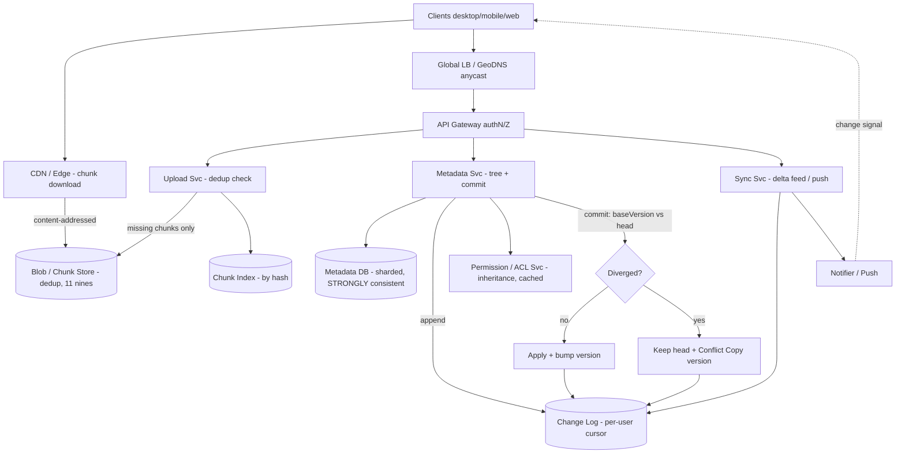

# A03 — Design Google Drive / a file storage & sync service

This tests whether you can build **large-scale durable file storage with multi-device sync**: chunk and deduplicate uploads by content hash, store bytes in object storage while keeping a **strongly-consistent metadata plane**, and keep many devices in sync via **delta sync** with sane **conflict handling, versioning, sharing, and permissions**. Google asks it because it forces the classic split between a **bulk blob plane** and a **consistent metadata plane**, plus the genuinely hard distributed-systems parts — sync protocol, conflict resolution, and a permission model that's both correct and fast — the layered ownership Staff is expected to lead.

## 1) Clarify — questions to ask the interviewer

- **Functional scope:** Core = upload/download, **sync across devices**, **sharing + permissions**, **versioning/conflict handling**. Are **real-time collaborative editing of file contents** (that's Docs/OT-CRDT), **full-text search**, **comments**, and **trash/retention policy** in scope or deferrable? I'll keep file-granularity sync and defer in-document collaboration.
- **File characteristics:** Max file size, typical mix (many small files vs few huge ones), total per-user quota. I'll assume files from KB to multi-GB, **per-user quota ~GBs–TBs**, billions of files overall.
- **Scale + read/write mix:** Users, files/user, and the asymmetry — Drive is **metadata-read-heavy** (listing folders, checking changes) with **bursty large blob writes** on upload/sync. I'll assume **~1B users**, **read:write on metadata ~100:1**, blob writes bursty.
- **Sync model:** Continuous background sync (file appears on all devices within seconds) vs manual? Online-only or **offline edits that reconcile** on reconnect? I'll assume continuous background sync **with offline support** (the hard, interesting case).
- **Consistency needs:** Must **metadata** (the file tree, names, permissions) be **strongly consistent** (yes — two devices must agree on whether a file exists / who can read it)? Blob content can be eventually visible after upload completes. Confirm this split.
- **Conflict semantics:** When two devices edit the same file offline, do we **auto-merge** (only possible for structured content), **keep both versions** (conflict copy), or last-writer-wins? For opaque files, "keep both / version" is the honest answer.
- **Sharing model:** File/folder-level ACLs, link sharing, inheritance through the folder tree, groups/domains? I'll assume per-object ACLs + folder inheritance + link sharing.
- **Latency + durability:** Targets — metadata ops p99 < ~100 ms, change notification within seconds; **11 nines durability** (never lose a user's file). Confirm.

**What the interviewer is signaling:** they want the **blob plane vs metadata plane split**, **content-hash chunking + dedup** (don't re-upload bytes you already have), and a **delta-sync protocol driven by a per-user change log/version vector**. The deepest signal is reasoning crisply about **conflict resolution + versioning** and a **correct, fast permission model with inheritance**. Calling out **strong consistency on metadata, eventual on blob** early is the Staff move. Deep dives: **sync protocol + conflict resolution** and **chunking/dedup + permission model**.

## 2) Functional Requirements (FR)

**In-scope**

- **Upload/download** files of arbitrary size via **chunked, resumable** transfer; **content-hash dedup** so identical chunks/files aren't re-stored or re-uploaded.
- **Metadata**: a per-user **file/folder tree** (names, sizes, hashes, timestamps, parent links); list a folder; rename/move/delete.
- **Sync across devices**: a device learns of changes and applies them via **delta sync** (transfer only changed chunks); near-real-time propagation.
- **Offline edits + reconcile**: edit while disconnected; on reconnect, push local changes and **resolve conflicts**.
- **Versioning + conflict handling**: keep prior versions; on a true conflict, **preserve both** (conflict copy) rather than silently lose data.
- **Sharing + permissions**: per-file/folder **ACLs** (owner/editor/viewer), **folder inheritance**, **link sharing**; fast permission checks on every access.

**Out-of-scope (defer)**

- **Real-time collaborative editing of contents** (OT/CRDT — that's Docs; here sync is file-granular).
- **Full-text search / OCR / content indexing** (adjacent retrieval system).
- **Comments, activity feed, fine-grained audit** (adjacent).
- **Client-side encryption / DLP / retention-policy engine** internals — acknowledge, defer.

## 3) Non-Functional Requirements (NFR)

| Dimension | Target & rationale |
|---|---|
| Scale | ~1B users; billions of files; **metadata read:write ~100:1**; blob writes bursty (uploads/sync). |
| Latency | Metadata ops (list/stat/check changes) p99 < ~100 ms; **change propagation to devices within seconds**; blob throughput limited by client bandwidth. |
| Availability | **99.95%+** for metadata + download; uploads retriable (resumable) so brief unavailability is recoverable, not data-losing. |
| Consistency | **Metadata strongly consistent** (file tree + permissions must agree across devices, read-your-writes); **blob content eventually visible** after upload commit. |
| Durability | **11 nines** for file content (erasure-coded, geo-replicated). A user's file must never be lost — durability is the product. |
| Conflict safety | **Never silently lose data** — true conflicts produce a conflict copy / version, not an overwrite. |
| Security | Per-object ACLs enforced on every access; permission checks fast (cached); encryption at rest + in transit. |
| Cost | Storage dominated by blob; **dedup + compression** materially cut it; metadata is small but high-QPS. |

## 4) Back-of-envelope estimation

```
USERS / FILES
  ~1e9 users. Say avg ~10^3-10^4 files/user (mix of tiny + large)
  -> O(10^12-10^13) file/metadata rows total -> metadata store must shard hard.

BLOB STORAGE
  Avg stored bytes/user ~ a few GB (free tier) to TB (paid). Take ~5 GB avg.
  Total ~ 1e9 * 5 GB = ~5 EB raw before dedup/compression.
  Dedup (cross-user identical files: installers, shared docs, photos) +
  compression often saves a large fraction on common corpora -> effective < raw.
  Chunk size ~4 MB (tradeoff below) -> O(10^12+) chunks; chunk index is huge -> shard by hash.

METADATA QPS
  Sync clients poll/stream for changes constantly. Listing + change-checks dominate.
  Reads ~10^6+ QPS aggregate; writes (uploads/renames/moves) ~ 100x fewer.
  Each metadata row ~ hundreds of bytes (name, parent, hash list, perms ptr, version).

SYNC / CHANGE FEED
  Each user has a monotonic change cursor. Devices fetch deltas since cursor.
  Active devices ~ several per user; change-notification fanout via long-poll/push.
  Change events/s ~ proportional to writes (~10^4/s) fanned to that user's devices.

DELTA SYNC SAVINGS
  Editing a 100 MB file changing 1 chunk => transfer ~4 MB, not 100 MB.
  This is the whole point of chunk-level sync: bandwidth ~ changed bytes, not file size.

CACHE
  Hot metadata (recently-listed folders, permission lookups) cached -> KV/Redis.
  Chunk existence checks (dedup) cached -> avoid re-uploading known chunks.
```

The decisive insight: **separate the tiny-but-hot metadata plane from the huge-but-cold blob plane**, and make sync transfer **only changed chunks** (delta sync), so bandwidth scales with *edits*, not file size. **Content-hash dedup** turns identical files/chunks across users into a single stored copy — a major storage win on common corpora.

## 5) API design

```
# Chunked upload with dedup (bytes bypass app servers)
POST /files/upload/init  { path, size, chunkHashes[] }
      -> { uploadId, missingChunks:[hashes the server does NOT already have] }   # dedup check
PUT  <presigned-url-for-chunk>   (client uploads ONLY missing chunks to blob store)
POST /files/upload/commit { uploadId, fileMeta } -> { fileId, version }          # metadata commit

# Download
GET  /files/{id}            -> { meta, chunkList[] }      # then fetch chunks (CDN/blob, cacheable)
GET  <blob-url>/chunk/{hash} -> chunk bytes               [content-addressed, cacheable]

# Metadata / tree
GET  /folders/{id}/list     -> { entries[] }
POST /files/{id}/move       { newParentId }
POST /files/{id}/rename     { name }
DELETE /files/{id}          -> { trashed:true }

# Sync (delta, cursor-based)
GET  /changes?cursor=...    -> { changes:[ {fileId, op, version, hashList} ], nextCursor }
GET  /changes/longpoll?cursor=...  -> blocks until new changes (or push via WebSocket)

# Sharing / permissions
POST /files/{id}/share      { principal, role:VIEWER|EDITOR|OWNER }  -> { aclVersion }
GET  /files/{id}/permissions -> { acl[], inheritedFrom }
POST /files/{id}/sharelink  { role } -> { token }
```

Two tells: upload is **dedup-aware** — `init` returns only the `missingChunks` so identical content is never re-sent — and sync is a **cursor-based delta feed** (`/changes?cursor=...`), the backbone that lets each device pull exactly what changed since it last synced. Chunk URLs are **content-addressed** (keyed by hash), so they cache and dedupe naturally.

## 6) Architecture — request & data flow

THE centerpiece. ASCII layered flow first, then a tailored Mermaid flowchart.

### (a) ASCII layered block diagram

```
        Clients (desktop sync / mobile / web)
          |                 |                      \
   chunk PUT/GET      metadata ops            long-poll / WebSocket (changes)
          |                 |                          |
          v                 v                          v
   [ CDN / Edge ]    [ Global LB / GeoDNS (anycast) ] --------------------+
   (download chunks)        |                                             |
          | content-        v                                             |
          | addressed [ API Gateway ]  authN/Z, rate-limit                |
          |                /        |             \                       |
          |               v         v              v                      |
          |      [ Upload Svc ] [ Metadata Svc ] [ Sync Svc ]            |
          |       dedup check    tree + perms      change feed / push    |
          |        (missing       |     ^            |    ^               |
          |         chunks)       |     |            |    |               |
   put    v   bytes               v     | reads      v    | tails         |
   [ Blob / Chunk Store ]   [ Metadata DB ]      [ Change Log ]           |
    content-addressed,       (sharded, STRONGLY    (per-user, monotonic   |
    erasure-coded, 11 nines   consistent: tree,     version cursor;       |
    keyed by chunkHash )      file->chunklist,      append on every       |
          ^                   ACLs, versions )      metadata write )      |
          |                        |     ^               |                |
          | dedup: store           |     | permission    | notify         |
          | each chunk once        |     | checks (cache)|                |
          |                        v     |               v                |
          |                 [ Permission / ACL Svc ]  [ Notifier / Push ] -+
          |                  (object ACL + folder       fan-out change
          |                   inheritance, cached)      to user's devices
          |
   == VERSIONING / CONFLICT (on commit & on offline reconcile) ==
   commit -> compare client baseVersion vs server head:
       same    -> apply, bump version, append change log
       diverged-> CONFLICT: keep server head + create "conflict copy" version
                  (never overwrite); both surface to all devices via change log
```

**Upload (with dedup) path.** The client chunks the file and hashes each chunk, then calls Upload Svc `init` with the **chunk hashes**. The service checks the **chunk index** and returns only the **missing chunks**; the client uploads just those **directly to the content-addressed Blob/Chunk Store** (bytes bypass app servers; identical content stored once). On `commit`, **Metadata Svc** writes the file's `{path, parent, chunkList, size, version, aclPtr}` into the **strongly-consistent Metadata DB** and **appends an event to the per-user Change Log** (bumping the user's cursor). The **Notifier** pushes a change signal to the user's other devices.

**Download path.** Read file metadata from Metadata Svc (`chunkList`), then fetch chunks by **content-addressed hash** from the **CDN/Blob store** (cacheable, dedup-friendly). Permission is checked first via the **ACL Svc** (cached).

**Sync (delta) path.** Each device holds a **cursor**. It calls `/changes?cursor` (or holds a WebSocket/long-poll) and gets the **delta** of metadata changes since its cursor. For each changed file it fetches **only the changed chunks** (diff its local chunk list vs the new one) — bandwidth scales with edits, not file size. It then advances its cursor. The **Change Log** is the ordered source of truth that makes this convergent.

**Conflict / versioning path.** On `commit` (or offline reconcile), the server compares the client's **baseVersion** to the server's **head**. If unchanged, apply and bump version. If **diverged** (someone else changed it first), it's a **conflict**: keep the server head and create a **conflict copy / new version** — **never silently overwrite**. Both versions flow to all devices via the change log. Structured/text content *may* auto-merge; opaque files keep both.

### (b) Mermaid flowchart



## 7) Data model & storage choices

**Metadata DB — sharded, strongly-consistent store** (a horizontally-partitioned transactional database; conceptually a Spanner-class system or sharded SQL with consensus). Core tables:

```
File:   { fileId(PK), ownerId, parentId, name, size, version,
          chunkList:[chunkHash...], aclId, createdAt, updatedAt, trashed }
Folder: { folderId(PK), ownerId, parentId, name, aclId, ... }
ACL:    { aclId(PK), entries:[ {principal, role} ], inheritParent:bool }
Change: { userId, seq(monotonic), fileId, op, version, ts }   # the change log
Chunk:  { chunkHash(PK), refCount, size, storageLoc }          # dedup / GC
```

*First-principles:* the **file tree + permissions** must be **strongly consistent** — two devices cannot disagree on whether a file exists, where it lives, or who can read it; moves/renames/permission changes are transactional. So this plane uses **consensus-backed replication** (R+W>N quorum / Paxos-Raft groups) and is **sharded by user/owner** so each user's tree lives together for cheap listing and a coherent change cursor. It's small per row but huge in count -> shard hard.

**Blob / Chunk Store — content-addressed, erasure-coded object store.** Each unique chunk stored **once**, keyed by its **content hash**; `refCount` tracks how many files reference it (for garbage collection). *Why:* file bytes are large, immutable-once-written, and benefit from **dedup + cheap durable storage** — exactly an erasure-coded object store. Content addressing gives **dedup, integrity verification (hash = name), and natural CDN cacheability** for free. Eventual visibility after commit is fine.

**Change Log — append-only, per-user, monotonic sequence.** The ordered record of every metadata mutation, with a per-user **cursor**. *First-principles:* sync correctness comes from a **single authoritative order of changes per user**; devices converge by replaying the log from their cursor. Storing it per-user keeps fan-out and cursoring cheap and bounds the scan.

**Permission / ACL store — per-object ACL + folder inheritance, heavily cached.** Resolved permission = object ACL combined up the **folder ancestry**. *Why cached:* checked on **every** access (read-massive), so resolved decisions are cached (with invalidation on ACL change); the source of truth lives transactionally with metadata so a permission revoke is strongly consistent.

**Chunk size choice (~4 MB):** smaller chunks -> better dedup + cheaper delta sync (transfer less on small edits) but a **bigger chunk index** and more per-chunk overhead; larger chunks -> smaller index but coarser dedup and bigger deltas. **~4 MB** is the usual sweet spot balancing index size against delta granularity.

## 8) Deep dive

The two cruxes are **(A) sync protocol + conflict resolution** (keep many devices convergent, handle offline edits, never lose data) and **(B) chunking/dedup + the permission model** (store bytes once, check access fast and correctly). Spend the most time here.

**A. Sync protocol + conflict resolution.**

- **Cursor/version-vector delta sync:** each user has a **monotonic change log**; each device tracks a **cursor** (last applied seq). To sync, a device pulls `changes since cursor`, applies them, and advances the cursor — guaranteeing **convergence** because everyone replays the same ordered log. Pushed via WebSocket/long-poll for **seconds-level** propagation; falls back to periodic poll.
- **Chunk-level delta transfer:** when a file changes, the device diffs its **local chunk list** against the new chunk list and fetches **only the differing chunks** — editing one 4 MB chunk of a 100 MB file transfers ~4 MB. This is the bandwidth win that makes continuous sync practical.
- **Offline edits + reconcile:** while offline, the device queues local mutations against a **baseVersion**. On reconnect it replays them; for each, the server compares `baseVersion` to the current **head**.
  - **No divergence** -> apply, bump version, append to log.
  - **Divergence (someone changed it first)** -> **conflict**. Policy: **never silently overwrite**. For opaque files, **keep both** as a "conflict copy" (and/or a new version) so no data is lost; for structured/text content, optionally **auto-merge** (line/3-way merge) — but the honest default for arbitrary files is keep-both.
- **Why not last-writer-wins for content:** LWW silently destroys the loser's edits — unacceptable for user files. Versioning + conflict copies make conflicts **visible and recoverable**. (Real-time *character-level* merge is OT/CRDT territory — Docs — explicitly out of scope here; Drive is file-granular.)
- **Idempotency + ordering:** mutations carry client-generated ids so retries are idempotent; the per-user log gives a total order so all devices converge to the same tree even with concurrent writers.
- **Move/rename correctness:** these are **metadata-only, transactional** ops (no byte movement) — cheap and strongly consistent, which is why metadata is its own plane.

**B. Chunking/dedup + permission model.**

- **Content-hash chunking + dedup:** the client splits files into chunks and hashes each (content-defined chunking with rolling hashes helps deltas survive insertions). Upload `init` sends the hashes; the server replies with **only the chunks it doesn't already have**. Identical chunks **across users** (installers, shared media, common docs) are stored **once**, with a **refCount**. Result: storage and upload bandwidth both drop on common corpora; integrity is free (the hash *is* the name).
- **Garbage collection:** deleting a file decrements chunk `refCount`s; chunks hit zero are GC'd (carefully, to avoid races with concurrent uploads referencing the same chunk — use grace periods / mark-and-sweep).
- **Permission model + inheritance:** every object has an **ACL**; effective permission resolves the object's ACL **combined with its folder ancestry** (inheritance). A share grants a `{principal, role}`; **link sharing** mints a capability token. Checks happen on **every** access, so resolved decisions are **cached** with invalidation on ACL change; the authoritative ACL is **strongly consistent** with metadata so a **revoke takes effect immediately** (you must not be able to read a file the instant after access is revoked).
- **Inheritance cost vs correctness:** walking ancestry per check is expensive at QPS, so cache resolved ACLs and **invalidate the subtree** on a permission change. For deep trees and groups, precompute/expand carefully — this is the classic "fast authorization at scale" problem (a Zanzibar-style relationship model is the principled large-scale answer; mention it).
- **Sharing across the tree:** a folder shared with a user grants access to descendants via inheritance; moves re-evaluate effective permissions. Keep the **owner** distinct from editors/viewers for quota and deletion semantics.

## 9) Key tradeoffs

| Decision | Choice & why |
|---|---|
| Metadata vs blob | **Two planes** — strongly-consistent metadata, eventually-visible blob. Different consistency, scale, and cost; the foundational split. |
| Metadata consistency | **Strong (consensus / R+W>N)** — devices must agree on tree + permissions; moves/renames/revokes are transactional. |
| Blob consistency | **Eventual visibility after commit** — bytes are immutable, content-addressed; staleness window is fine. |
| Dedup | **Content-hash chunk dedup** — store identical chunks once; big storage + upload-bandwidth win; cost is a large chunk index + GC complexity. |
| Sync model | **Cursor/version-vector delta sync over a per-user change log** — guarantees convergence; pushed for low latency. |
| Conflict policy | **Versioning + conflict copies, never silent LWW** for opaque files — never lose user data; auto-merge only for structured content. |
| Chunk size | **~4 MB** — balances dedup/delta granularity against chunk-index size + per-chunk overhead. |
| Permission checks | **Strongly-consistent ACL source + cached resolved decisions** — correct revokes, fast checks; invalidate subtree on change. |
| Move/rename | **Metadata-only transactional ops** — no byte movement; cheap and consistent. |

## 10) Bottlenecks & failure modes

- **Hot user / shared folder (a huge team drive):** metadata + permission checks concentrate. *Mitigation:* shard metadata by owner with hot-spot splitting; **cache resolved ACLs**; paginate listings; consider a relationship-based authz service for big shares.
- **Chunk index hot shard (popular chunk, e.g. a viral installer):** dedup check + refCount contention. *Mitigation:* shard chunk index by hash (uniform), cache existence checks, batch refCount updates.
- **Conflict storms (two devices editing offline repeatedly):** *Mitigation:* version-vector divergence detection + conflict copies; idempotent client mutation ids; converge via the ordered log.
- **GC race (deleting a chunk another upload is referencing):** *Mitigation:* refCount with **grace periods / mark-and-sweep**, never delete a chunk an in-flight upload referenced.
- **Change-feed fan-out spike (mass share / bulk move):** many devices need many changes. *Mitigation:* per-user change log + batched delta pulls; coalesce notifications; backpressure the notifier.
- **Permission revoke lag (security-critical):** stale cached ACL lets a revoked user read. *Mitigation:* strongly-consistent ACL writes + **immediate cache invalidation** of the affected subtree; short TTLs as a backstop.
- **Metadata store as SPOF for a shard:** *Mitigation:* consensus replication (quorum), multi-replica per shard, failover; the change log is durable so devices recover by re-syncing.
- **Large-file upload interrupted:** *Mitigation:* **resumable chunked upload** — only missing chunks re-sent; commit is the atomic point.

## 11) Scale 10x / evolution

- **First thing that breaks: metadata QPS + shard hot spots** at 10× users/files. *Evolve:* finer sharding (by user, then by subtree), more aggressive ACL/list caching, a dedicated **relationship-based authorization** service (Zanzibar-style) for sharing at scale.
- **Chunk index size (10× chunks).** *Evolve:* tiered/sharded index by hash prefix, bloom filters for existence checks, region-local chunk indices.
- **Blob storage cost.** *Evolve:* better dedup (content-defined chunking), compression, cold-tier rarely-accessed files, region-aware placement near the user.
- **Change-feed throughput.** *Evolve:* partition the log per user/region, push via scalable pub/sub, coalesce bursts (a bulk move = one logical change set).
- **Multi-region:** place each user's data + metadata near them; async geo-replicate blobs for durability; keep the user's metadata shard authoritative in one region (or use a globally-consistent metadata system for cross-region sharing).
- **Selective sync / streaming:** for huge drives, don't sync everything — **stream-on-demand** (placeholder files materialized on open) so a device with 2 TB drive doesn't need 2 TB local.

## 12) Interviewer probes & follow-ups

- **"Two devices edit the same file offline — what happens on reconnect?"** Each replays local mutations against a **baseVersion**; the server compares to head. No divergence -> apply + version bump. Divergence -> **conflict**: keep both as a **conflict copy / new version**, never silently overwrite. All devices learn both via the change log.
- **"Why not last-writer-wins?"** It silently destroys the loser's edits — unacceptable for user files. Versioning + conflict copies make conflicts visible and recoverable. Character-level real-time merge is OT/CRDT (Docs), out of scope here.
- **"How do you avoid re-uploading a file someone already uploaded?"** **Content-hash dedup**: the client sends chunk hashes; the server replies with only **missing chunks**. Identical chunks across users are stored once with a refCount.
- **"How does a device sync efficiently — does it re-download whole files?"** No — **delta sync**: pull metadata changes since its **cursor** from the per-user change log, then fetch **only the changed chunks** (diff chunk lists). Bandwidth scales with edits, not file size.
- **"Strong or eventual consistency — where?"** **Strong** on the metadata plane (tree + permissions: devices must agree, revokes must be immediate). **Eventual** on blob visibility after commit (immutable, content-addressed bytes).
- **"How do permission checks stay fast at QPS but still correct on revoke?"** Source-of-truth ACL is strongly consistent with metadata; resolved decisions are **cached** and **invalidated subtree-wide** on change, so a revoke takes effect immediately while reads stay fast.
- **"How does folder inheritance work, and what's the cost?"** Effective ACL = object ACL combined up the ancestry; walking ancestry per check is costly, so cache resolved ACLs and invalidate on change. At scale, a **relationship-based authz** (Zanzibar-style) model handles big shares.
- **"What chunk size and why?"** ~4 MB — smaller improves dedup/delta granularity but bloats the chunk index and per-chunk overhead; ~4 MB balances both.

## 13) 60-minute flow cheat-sheet

| Time | What to do |
|---|---|
| 0–3 min | Frame it: **two planes** — strongly-consistent **metadata** (tree + permissions) and huge eventually-visible **blob** (content-addressed). State that split up front. |
| 3–9 min | **Clarify:** scope (file-granular sync; defer in-doc collab/search), file sizes, scale + read:write, sync model (continuous + **offline**), consistency split, conflict semantics, sharing model. |
| 9–14 min | **FR + NFR + estimation:** surface **dedup** (store chunks once) and **delta sync** (bandwidth ~ edits, not file size); size metadata QPS + blob EB. |
| 14–20 min | **API + high-level architecture:** draw the ASCII flow — dedup-aware chunked upload, content-addressed blob, strongly-consistent metadata + per-user change log, sync/notifier. |
| 20–24 min | Walk the **upload (dedup) path**, **delta-sync path** (cursor -> changes -> changed chunks), and the **conflict/versioning path** (baseVersion vs head). |
| 24–44 min | **Deep dive (the crux):** (A) sync protocol + conflict resolution — change log/version vectors, offline reconcile, conflict copies, no silent LWW; (B) chunking/dedup + permission model — content hashing, refCount/GC, ACL inheritance + cached fast checks + immediate revoke. Most time here. |
| 44–50 min | **Consistency model:** strong metadata (consensus/quorum), eventual blob; transactional moves/renames/revokes; why each. |
| 50–55 min | **Tradeoffs + bottlenecks:** hot shared folders, chunk-index hot keys, conflict storms, GC races, revoke lag, resumable uploads. |
| 55–60 min | **10× evolution + wrap:** relationship-based authz at scale, selective/stream-on-demand sync, multi-region placement. Restate the big idea: **split metadata (strong) from blob (content-addressed, deduped), drive sync off a per-user ordered change log with delta transfer, and resolve conflicts by versioning — never by silently losing bytes.** |
