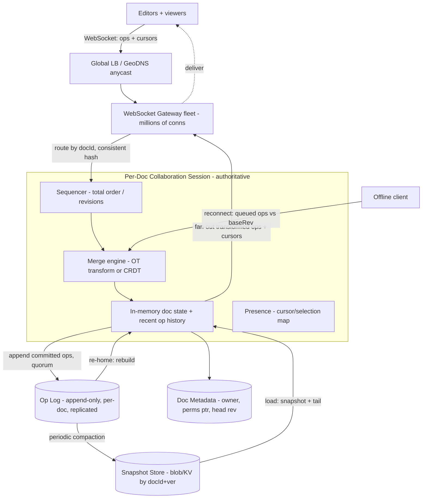

# A04 — Design Google Docs / a real-time collaborative editor

This tests whether you can reason about **distributed consistency under genuine concurrency**: many users editing the same document character-by-character at the same time, edits merging without corruption, **offline edits** reconciling on reconnect, live **presence/cursors**, and durable persistence — with **websocket fan-out** at the document level. Google asks it because it is the deepest **consistency** question in the catalog: the crux is **Operational Transformation vs CRDTs**, and articulating that tradeoff crisply (plus convergence, intention-preservation, and per-doc sharding) is a pure Staff signal — there is no off-the-shelf "use a DB" answer.

## 1) Clarify — questions to ask the interviewer

- **Functional scope:** Core = **concurrent rich-ish text editing with live merge, presence/cursors, offline edits, persistence**. Are **comments/suggestions, full revision history UI, rich media embeds, access control, full-text search** in scope or deferrable? I'll keep the real-time text-collaboration engine and defer comments/ACL internals.
- **Document model + size:** Plain text, or rich text (formatting, structure)? Max doc size and max **concurrent editors per doc** (10? 100? thousands in a read-mostly doc)? I'll assume rich-ish text, docs up to ~MBs, and **up to ~tens-to-100 concurrent editors** with many more viewers.
- **Consistency requirement:** This is the heart — all editors must **converge to the same document** and edits must **preserve user intent** (your inserted word lands where you meant even though others edited concurrently). Confirm **strong convergence + intention preservation** is the bar.
- **Latency target:** What's "real-time" — local echo **instant**, remote edits visible within **~50–200 ms**? Cursor/presence within similar. This forces optimistic local apply + async reconcile, not request/response per keystroke.
- **Offline support:** Edit fully offline and reconcile on reconnect (the hard case), or online-only? I'll assume **offline edits that reconcile** — which strongly influences OT vs CRDT.
- **Scale:** Total docs, concurrently-active docs, edits/sec on a hot doc. I'll assume **billions of docs**, hot docs seeing **bursts of edits/sec**, and a **long tail of idle docs**.
- **Persistence + history:** Durable enough to never lose edits; do we need **point-in-time revision history / undo across sessions**? I'll assume yes — snapshots + an operation log enable both.
- **Sharding:** Confirm we can treat each **document as an independent unit** (its own collaboration session / shard) — this is what makes the problem tractable at scale.

**What the interviewer is signaling:** they want you to go **straight at the concurrency-merge problem** and state the **OT vs CRDT** tradeoff with conviction — not hand-wave "resolve conflicts." The highest-value moves: a **per-document authoritative sequencer/session** that orders ops, **optimistic local apply + transform-against-concurrent-ops**, an **offline op queue that reconciles**, **websocket fan-out per doc**, and **snapshots + op log** for persistence. Naming **convergence, causality, and intention preservation** as the correctness properties is the Staff tell. Deep dives: **the OT/CRDT merge engine** and **websocket fan-out + offline reconcile**.

## 2) Functional Requirements (FR)

**In-scope**

- **Concurrent editing:** multiple users edit the same doc simultaneously; edits **merge** without corruption and all clients **converge** to identical content.
- **Intention preservation:** an edit applies at the position the user meant, even after concurrent edits shifted offsets.
- **Local echo + real-time propagation:** keystrokes apply **instantly** locally (optimistic) and propagate to others within ~tens-to-hundreds of ms via **websocket fan-out**.
- **Offline editing + reconcile:** edit while disconnected; on reconnect, the queued ops **merge** with everything that happened.
- **Presence / cursors / selections:** show who's in the doc and where their cursor/selection is, live.
- **Persistence + history:** durably persist the document; **snapshots + an operation log** enable recovery, undo, and revision history.

**Out-of-scope (defer)**

- **Comments / suggestions / track-changes** (a related but separate annotation layer — name it, defer).
- **Access control / sharing internals** (assume a permission service exists — that's the Drive problem).
- **Rich media embeds, import/export fidelity, print layout** (adjacent).
- **Full-text search over docs** (adjacent retrieval system).

## 3) Non-Functional Requirements (NFR)

| Dimension | Target & rationale |
|---|---|
| Scale | Billions of docs; hot docs see bursts of **edits/sec**; long tail mostly idle. Concurrency per doc up to ~tens-to-100 editors + many viewers. |
| Latency | Local echo **instant**; remote edits + cursors visible within **~50–200 ms**; persistence async off the keystroke path. |
| Availability | **99.95%+** for editing sessions; a session-server failure should **re-home** the doc to another server without data loss. |
| Consistency | **Strong eventual convergence + intention preservation** — all clients reach the identical document; no lost or corrupted edits. (Causal consistency on ops.) |
| Durability | **Never lose an acknowledged edit** — op log persisted (quorum) before/at ack; periodic snapshots; 11 nines on stored docs. |
| Throughput | Fan-out scales with editors-per-doc; op application is cheap; the system is **chatty, small-message** (per-keystroke ops), not bulk. |
| Security | Per-doc auth on connect; ops authorized; presence respects visibility. |
| Cost | Dominated by holding live websocket sessions + op log; idle docs cost ~nothing (sessionless until opened). |

## 4) Back-of-envelope estimation

```
EDIT GRANULARITY
  Ops are tiny: insert(char/run, pos), delete(range), formatRun.
  An op ~ tens of bytes. A fast typist ~ 5-10 ops/s. 100 editors -> ~1000 ops/s on a hot doc.
  => the system is HIGH-FREQUENCY, SMALL-MESSAGE, not high-bandwidth.

FAN-OUT
  Each op must reach all other participants on that doc.
  100 participants, 1000 ops/s -> ~1e5 op-deliveries/s on ONE hot doc (fan-out heavy).
  Most docs have 1-3 editors; the heavy case is rare but must not fall over.

SESSIONS / CONNECTIONS
  Concurrently-active docs (say) ~1e6-1e7; avg ~2-3 live websockets each
  -> tens of millions of concurrent websocket connections across the gateway fleet.
  Each connection is cheap (idle), but the count is large -> many gateway nodes,
  each holding ~1e5 connections.

PERSISTENCE
  Op log: ~edits/s system-wide. Even 1e7 active docs * a few ops/s sustained
     -> ~1e7-1e8 ops/s aggregate at the extreme -> append-optimized log, sharded by docId.
  Snapshots: compact the op log periodically (e.g. every N ops or T minutes) so
     load = latest snapshot + tail of ops, not replay-from-genesis.
  Doc size ~ KB-MB; snapshot store ~ blob/KV by docId + version.

STORAGE
  Billions of docs * ~tens of KB-MB each -> PB-scale doc/snapshot store.
  Op log retained for history/undo window, then compacted into snapshots.

MEMORY (hot doc)
  A live doc session holds the current document state + recent op history in memory
  on its session server -> tens of KB-MB per active doc; pack many per server.
```

The decisive insight: collaborative editing is **high-frequency, tiny-message** (per-keystroke ops), not high-bandwidth — so the architecture is about **ordering, transforming, and fanning out small ops with low latency**, plus **snapshot+log persistence** so loading a doc is `snapshot + tail`, not a genesis replay. Each **document is an independent unit**, so we scale by **sharding docs across session servers**.

## 5) API design

```
# Open a collaboration session (websocket)
WS   /docs/{docId}/connect            -> { snapshotVersion, snapshot, baseRev }   # initial load

# Client -> server: submit ops (optimistic; client already applied locally)
SEND op   { docId, clientId, baseRev, ops:[ insert|delete|format ], seq }
RECV ack  { acceptedRev }                                   # server's assigned revision
RECV op   { fromClientId, ops:[...transformed...], rev }    # others' ops, already transformed
RECV cursor { clientId, range }                             # presence/cursor updates
SEND cursor { range }                                       # my cursor/selection

# Presence
RECV presence { participants:[ {clientId, name, color, cursor} ] }

# Persistence / history (mostly internal)
GET  /docs/{id}/snapshot?at=rev      -> { snapshot }        # point-in-time
GET  /docs/{id}/revisions            -> { revs[] }          # history list
POST /docs/{id}/checkpoint           -> { snapshotVersion } # force a snapshot (internal)
```

The defining tell: ops carry a **`baseRev`** (the revision the client edited against) and the server returns an **`acceptedRev`**; this is the hook for the merge engine to **transform** a client's op against any ops that were committed after its `baseRev`. Clients **apply locally first** (instant echo) and reconcile when the ack/remote-ops arrive — request/response per keystroke would feel awful.

## 6) Architecture — request & data flow

THE centerpiece. ASCII layered flow first, then a tailored Mermaid flowchart.

### (a) ASCII layered block diagram

```
        Clients (editors + viewers, browser/mobile)
          |  persistent WebSocket (tiny ops + cursors, bidirectional)
          v
   [ Global LB / GeoDNS (anycast) ]
          |
          v
   [ WebSocket Gateway fleet ]  authN/Z on connect, holds millions of conns
          |   routes by docId (consistent hashing) ->
          v
   [ Per-Doc Collaboration Session ]   (one authoritative owner per active doc)
   +-----------------------------------------------------------+
   |  Sequencer:  assigns a TOTAL ORDER (revisions) to ops      |
   |  Merge engine (OT or CRDT):                                |
   |    - transform incoming op against ops committed after     |
   |      its baseRev  (OT)   OR  merge commutatively (CRDT)    |
   |  In-memory: current doc state + recent op history          |
   |  Presence: cursor/selection map for participants           |
   +-----------------------------------------------------------+
        |  fan-out transformed ops + cursors to all participants
        |  (via the gateway, to each WebSocket)        ^
        v                                              |  re-home on failure
   [ Participants' WebSockets ] <----------------------+  (replay log -> rebuild session)
        |
        | append committed ops (durably, quorum) BEFORE/AT ack
        v
   [ Op Log (append-only, per-doc, quorum-replicated) ]
        |                         |
        | periodic compaction     | load: snapshot + tail-of-ops
        v                         v
   [ Snapshot Store (blob/KV by docId+version) ]   [ Doc Metadata (owner, perms ptr, head rev) ]

   == OFFLINE PATH ==
   Client offline: queue local ops against last-known baseRev.
   On reconnect: send queued ops -> server transforms them against all ops
   committed while offline -> integrates -> client converges (intention preserved).
```

**Connect / load path.** A client opens a **WebSocket** to a **Gateway**, which authenticates and routes by `docId` (**consistent hashing**) to the **per-doc Collaboration Session** — the single authoritative owner for that active doc. The session returns the **latest snapshot + baseRev** (load = snapshot + tail of ops, not a genesis replay). The client renders and starts editing.

**Edit path (the core loop).** The user types -> the client **applies the op locally immediately** (instant echo) and **sends** it with its `baseRev`. The session's **sequencer assigns a revision** (a total order). The **merge engine transforms** that op against any ops committed after its `baseRev` (OT) — or relies on **commutative merge** (CRDT) — so the result preserves intention and converges. The op is **appended to the durable, quorum-replicated op log** (so an acked edit is never lost), then **fanned out (already transformed) to all other participants** via their gateways, and an **ack(acceptedRev)** returns to the author. Each client applies remote ops, transforming any of its own in-flight (unacked) ops against them.

**Presence path.** Cursor/selection updates are **lightweight, ephemeral** messages fanned out the same way but **not persisted** (presence is transient; if you disconnect, your cursor vanishes).

**Persistence path.** The **op log** is the durable source of truth. Periodically it's **compacted into a snapshot** (current doc state at a revision) so loads and recovery are fast and the log stays bounded; snapshots + retained ops power **revision history / undo**.

**Failure / re-home path.** If a session server dies, the doc is **re-homed** to another server (consistent hashing reassigns ownership), which **rebuilds the session from `latest snapshot + op-log tail`** — no acked edit is lost because the log is durable. Clients reconnect transparently.

**Offline path.** Offline, the client **queues ops against its last `baseRev`**. On reconnect it sends them; the server **transforms them against everything committed while it was away** and integrates — the client converges with intention preserved (your offline paragraph lands coherently, not interleaved into garbage).

### (b) Mermaid flowchart



## 7) Data model & storage choices

**Document model — an ordered sequence of characters/runs with formatting** (rich text as a tree/rope of styled runs; plain text as the simple case). Edits are **operations**, not full-document writes:

```
Op:       { docId, rev, clientId, baseRev, kind: INSERT|DELETE|FORMAT,
            pos|rangeStart|rangeEnd, content?, attrs?, ts }
Snapshot: { docId, atRev, contentBlob (current state), createdAt }
DocMeta:  { docId, ownerId, aclPtr, headRev, lastSnapshotRev, participants[] }
Presence: { docId, clientId, cursorRange, color }   # in-memory only, not persisted
```

*First-principles:* representing edits as **fine-grained ops** (not whole-doc saves) is what makes concurrent merge, history, and delta fan-out possible — you transform/merge ops, not blobs.

**Op Log — append-only, per-doc, quorum-replicated.** The **durable source of truth**: every committed op in revision order. *Why:* the system's correctness rests on a **single authoritative total order of ops per doc**, and durability requires an acked op survive crashes -> a replicated append-only log (consensus/quorum for the order). Sharded by `docId` (each doc is independent). It enables recovery, undo, and revision history.

**Snapshot Store — blob/KV keyed by `docId + version`.** Periodically materialized current state so **load = snapshot + tail-of-ops** instead of replaying from genesis, and so the op log can be **compacted** (bounded). PB-scale across billions of docs; cheap object/KV storage.

**Doc Metadata — small consistent KV** (`owner, aclPtr, headRev, lastSnapshotRev`). Read on open; permission pointer resolves against the (external) permission service.

**Presence — in-memory only, ephemeral.** Cursors/selections live in the session server's memory and are **never persisted** — transient by nature; a disconnect simply drops the cursor. (Deliberately *not* in the durable store — persisting per-keystroke cursor moves would be wasteful and pointless.)

**Why per-doc sharding is the natural partition:** a document is a **self-contained consistency domain** — all its ops must be ordered together, but it shares nothing with other docs. So we assign **one authoritative session per active doc** (consistent hashing over `docId`), which localizes ordering + merge + fan-out and scales horizontally by spreading docs across the fleet.

## 8) Deep dive

The two cruxes are **(A) the concurrency-merge engine — OT vs CRDT** (the intellectual heart) and **(B) websocket fan-out + offline reconcile + per-doc session lifecycle** (the systems heart). Spend the most time on A; do justice to B.

**A. The merge engine — Operational Transformation vs CRDT (state the tradeoff).**

The problem: two users edit concurrently from the same base. User X does `insert("cat", pos=5)`; User Y simultaneously does `insert("dog", pos=2)`. Applied naively in different orders on different clients, they **diverge** or land at the wrong offsets. We need **convergence** (all replicas end identical) **and intention preservation** (each insert lands where the user meant after accounting for concurrent shifts).

- **Operational Transformation (OT):** keep ops as `insert/delete(pos)`; when an op arrives that was generated against an older `baseRev`, **transform** it against each op committed in between so its position is adjusted (X's `pos=5` shifts to `pos=8` after Y's 3-char insert at `pos=2`). A **central sequencer** (the per-doc session) assigns a total order and transforms incoming ops against the gap — this is the classic Google Docs approach.
  - *Pros:* compact ops (just positions), efficient, well-suited to a **central authority per doc** (which we already have), small memory footprint.
  - *Cons:* the **transformation functions are subtle and hard to get provably correct** (the literature is littered with buggy transform sets); generally **requires a central server** to order/transform — true peer-to-peer OT is very hard.
- **CRDTs (Conflict-free Replicated Data Types, e.g. RGA/Logoot/Yjs-style):** give every character a **unique, immutable, globally-ordered identity** (e.g. a fractional/position id between neighbors) so inserts/deletes **commute** — apply in any order, converge automatically, **no transform needed**.
  - *Pros:* **commutative merge** -> excellent for **offline and P2P** (no central sequencer required), conceptually clean convergence.
  - *Cons:* **per-character metadata overhead** (ids/tombstones) inflates memory/storage; deletes leave **tombstones** needing GC; large docs / long histories get heavy; intention preservation for rich-text structure is fiddly.
- **The decision for *this* design:** we already have a **per-doc authoritative session**, which makes **OT a natural, memory-efficient fit** (central ordering + transform) — the proven Docs choice. But I'd **call out CRDTs explicitly** as the better fit if requirements emphasize **strong offline/P2P or serverless sync** (no single authority), accepting the metadata overhead. **Stating this tradeoff with conviction is the point** — both achieve convergence; they differ in *where the complexity lives* (subtle transform functions vs per-element metadata) and *whether you need a central server*.
- **Correctness properties to name:** **convergence** (CCI: Convergence, Causality, Intention preservation), **causal ordering** of ops, and **idempotent/exactly-once** application of each op (ops carry ids; replays are no-ops).

**B. WebSocket fan-out, offline reconcile, and session lifecycle.**

- **Websocket fan-out per doc:** editing is **high-frequency, tiny-message**, so we hold a **persistent WebSocket** per participant and the per-doc session **fans each committed (transformed) op out to all others** in ~tens of ms. Gateways hold millions of cheap idle connections; consistent hashing routes a doc's connections to its **single authoritative session** so ordering/transform happen in one place.
- **Optimistic local apply + in-flight reconciliation:** the client applies its op locally **immediately** (instant echo) and tracks it as **in-flight (unacked)**. When remote ops arrive, the client **transforms its in-flight ops against them** (and vice versa) so its local view stays consistent with what the server will commit. On ack, the in-flight op is confirmed at `acceptedRev`.
- **Offline edit queue + reconcile:** offline, ops queue against the last `baseRev`. On reconnect, the client streams them; the server **transforms each against every op committed while the client was away** (OT) or merges commutatively (CRDT). This is exactly where the OT/CRDT choice bites: **long offline divergence** stresses OT's transform chains and is where **CRDTs shine** (commutativity makes reconvergence trivial). Either way, **no edit is lost and intention is preserved**.
- **Session lifecycle + re-home (availability):** an active doc has **one owner session**; if that server fails, consistent hashing **re-homes** the doc to another node, which **rebuilds state from `latest snapshot + op-log tail`** — safe because the log is durable (acked ops survived). Clients auto-reconnect. Idle docs have **no session** (cost ~zero) and spin one up on first open.
- **Persistence cadence:** ops are appended durably (quorum) at/around ack so acks are honest; snapshots compact periodically so load and recovery are `snapshot + small tail`, and the op log stays bounded while still backing **revision history/undo**.

## 9) Key tradeoffs

| Decision | Choice & why |
|---|---|
| Merge algorithm | **OT (central per-doc sequencer)** as primary — compact ops, memory-efficient, proven for server-authoritative docs; **CRDT** if offline/P2P/serverless dominates. The defining tradeoff. |
| Where complexity lives | **OT:** subtle transform functions but tiny per-op data. **CRDT:** trivial merge but per-element ids/tombstones. Pick by offline/P2P needs vs memory budget. |
| Apply model | **Optimistic local apply + reconcile** over request/response per keystroke — instant echo; the network round-trip can't be on the typing path. |
| Ordering authority | **One authoritative session per doc** (consistent hashing) — localizes ordering/transform/fan-out; the doc is a self-contained consistency domain. |
| Transport | **Persistent WebSockets** over polling — high-frequency tiny messages need a push channel and low overhead. |
| Persistence | **Op log (durable, quorum) + periodic snapshots** over whole-doc saves — enables fan-out deltas, history/undo, fast load, crash recovery. |
| Presence | **In-memory, ephemeral, unpersisted** — cursors are transient; persisting them is wasteful and meaningless. |
| Sharding | **Per-document** — natural partition; scales by spreading docs across session servers. |
| Consistency | **Strong eventual convergence + intention preservation (CCI)**, causal op ordering — the real correctness bar, not "strong consistency" in the DB sense. |

## 10) Bottlenecks & failure modes

- **Hot doc (100+ editors, fan-out heavy):** ~10^5 op-deliveries/s on one doc. *Mitigation:* the single owner session does ordering/transform once, then fans out; cap editors-per-doc, **degrade extra participants to viewers** (apply periodic snapshots instead of every op); batch/coalesce ops in short windows.
- **Session server failure (SPOF for that doc):** *Mitigation:* **re-home** via consistent hashing; rebuild from **durable op log + snapshot**; clients auto-reconnect — **no acked edit lost**.
- **Long offline divergence -> transform blowup (OT):** reconciling a big offline batch against many committed ops is expensive/fragile. *Mitigation:* bound offline window, snapshot-based reconcile, or use **CRDT** semantics for the offline path (commutative merge avoids transform chains).
- **OT transform bugs (correctness landmine):** a wrong transform corrupts the doc silently. *Mitigation:* a **small, exhaustively-tested transform set** + property/fuzz tests asserting convergence; consider CRDTs to sidestep the class entirely.
- **CRDT tombstone/metadata growth:** memory/storage bloat on long-lived docs. *Mitigation:* tombstone **GC** once all replicas have seen the delete; periodic snapshot/compaction.
- **WebSocket connection storms (mass reconnect after a gateway flap):** *Mitigation:* gateways hold connections cheaply; jittered reconnect/backoff; re-home docs gradually; sticky routing by docId.
- **Op log write throughput on a viral doc:** *Mitigation:* per-doc log sharding, batch appends, snapshot to bound replay; the log is the only thing that must be durable on the hot path.
- **Causality violation (op applied before its dependency):** divergence. *Mitigation:* version/`baseRev` tagging + causal ordering; the sequencer enforces a total order; clients buffer out-of-order ops.

## 11) Scale 10x / evolution

- **First thing that breaks: fan-out + session load on the hottest docs** at 10×. *Evolve:* tiered fan-out (a session -> relay nodes -> participants) for huge audiences, demote most users to **read replicas applying snapshots**, op batching, and edge relays close to users.
- **Connection count (10× -> 100s of millions of websockets).** *Evolve:* more gateway nodes, regional gateways near users, efficient connection multiplexing, idle-doc sessions stay un-spun.
- **Op log throughput + storage.** *Evolve:* shard logs per doc/region, more aggressive snapshot compaction, tier old revisions to cold storage (keep the history window hot).
- **Merge engine at scale:** if offline/mobile/P2P grows, **shift the offline path to CRDT** (commutative reconcile) while keeping OT for the central online path — or adopt a CRDT end-to-end and invest in tombstone GC.
- **Multi-region collaboration:** keep a doc's **authoritative session in one region** (single ordering authority) but place gateways/relays globally; or, for cross-region low latency, a CRDT model that tolerates multi-master without a single sequencer.
- **Richer content:** structured docs (tables, embeds) need the op/transform (or CRDT) model extended to **tree edits**, not just linear text — a real complexity step.

## 12) Interviewer probes & follow-ups

- **"Two users insert text at overlapping positions at the same instant — how do you not corrupt or diverge?"** Either **OT** (a per-doc sequencer assigns a total order and **transforms** each op against the ops committed after its baseRev, shifting positions so both land where intended) or **CRDT** (each character has a unique ordered id so inserts **commute** and converge with no transform). Both guarantee **convergence + intention preservation**.
- **"OT or CRDT — pick one and defend it."** With a **per-doc authoritative session**, **OT** is the efficient, proven fit (compact ops, low memory) — Google Docs' choice. I'd switch to **CRDT** if strong **offline/P2P/serverless** is required, accepting per-element id/tombstone overhead. The tradeoff is *where complexity lives*: subtle transform functions (OT) vs per-character metadata + GC (CRDT).
- **"User edits offline for an hour, then reconnects — what happens?"** Queued ops replay against the last baseRev; the server **transforms them against everything committed while offline** (OT) or merges commutatively (CRDT). No edits lost, intention preserved. Long divergence stresses OT transform chains — a point in CRDT's favor.
- **"How is an acknowledged edit never lost if a server crashes mid-session?"** Ops are appended to a **durable, quorum-replicated op log** at/around ack; on failure the doc is **re-homed** and rebuilt from **snapshot + log tail**. The ack is only honest because the op is already durable.
- **"How do you load a doc with a million edits quickly?"** **Snapshot + tail-of-ops**, not a genesis replay; periodic compaction keeps the tail short.
- **"How do cursors/presence work, and do you persist them?"** Lightweight ephemeral messages fanned out over the same WebSockets; **not persisted** — a disconnect drops the cursor. Persisting per-keystroke cursors would be wasteful.
- **"How do you shard this?"** **Per document** — a doc is a self-contained consistency domain; consistent-hash `docId` to **one authoritative session**, spreading docs across the fleet.
- **"A doc has 500 simultaneous editors — does it fall over?"** Ordering/transform happen once at the owner session, then fan-out; we **cap active editors**, demote the rest to **viewers applying snapshots**, and **batch ops** — protecting the hot doc.

## 13) 60-minute flow cheat-sheet

| Time | What to do |
|---|---|
| 0–3 min | Frame it as **the consistency problem**: concurrent character edits must **converge + preserve intention**; the crux is **OT vs CRDT**. Say that up front. |
| 3–9 min | **Clarify:** scope (real-time text engine; defer comments/ACL), doc model + max concurrent editors, **convergence + intention** as the bar, latency (instant echo), **offline** support, per-doc sharding. |
| 9–14 min | **FR + NFR + estimation:** establish it's **high-frequency, tiny-message** (per-keystroke ops), fan-out heavy on hot docs, persisted via **snapshot + op log**. |
| 14–20 min | **API + high-level architecture:** draw the ASCII flow — WebSocket gateways, **one authoritative session per doc** (sequencer + merge engine), op log, snapshots, fan-out. |
| 20–24 min | Walk the **edit loop** (optimistic local apply -> send with baseRev -> sequence + transform -> append durably -> fan-out -> ack) and the **offline reconcile** path. |
| 24–46 min | **Deep dive (the crux):** (A) **OT vs CRDT** — the concurrent-insert example, transform vs commutative merge, where complexity lives, which I pick and why (central session -> OT, offline/P2P -> CRDT), CCI properties; (B) websocket fan-out + offline reconcile + **re-home from log+snapshot**. Most time here. |
| 46–51 min | **Persistence + availability:** op log (durable/quorum) + snapshots, revision history/undo, session re-home with no acked-edit loss. |
| 51–56 min | **Tradeoffs + bottlenecks:** hot-doc fan-out, OT transform bugs, CRDT tombstone GC, long-offline divergence, connection storms. |
| 56–60 min | **10× evolution + wrap:** tiered fan-out, CRDT for the offline/P2P path, multi-region single-authority vs multi-master. Restate the big idea: **model edits as ops, give each doc one authoritative ordering session, choose OT vs CRDT by where you want the complexity (central transform vs per-element metadata), apply optimistically and reconcile, and persist as op-log + snapshots so nothing acked is ever lost.** |
