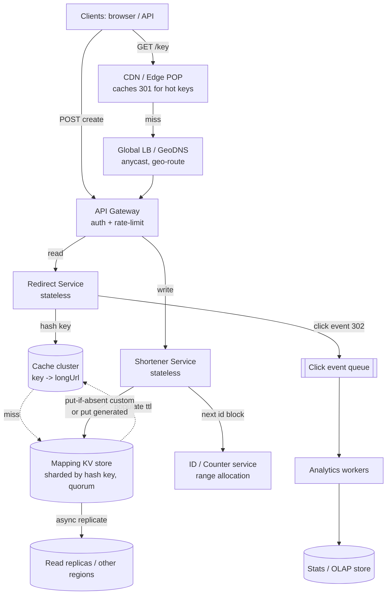

# A05 — Design a URL shortener (TinyURL / bit.ly)

Design a service that takes a long URL and returns a short alias (e.g. `https://g.co/aZ4k9p`) which, when fetched, redirects the user to the original URL. It looks deceptively simple, which is exactly why Google asks it: the crux is **key generation that is unique, short, and collision-free at billions of URLs**, plus a **read-heavy (100:1+) system** that must redirect in tens of milliseconds globally. A strong answer separates the write path (mint a key, store mapping) from the read path (look up + 301/302) and reasons first-principles about the key space, caching, and the KV store rather than naming a product.

## 1) Clarify — questions to ask the interviewer

- **Functional scope:** just `shorten(url) -> short` and `resolve(short) -> 301`? Or also **custom/vanity aliases** (`g.co/my-brand`), **expiry/TTL**, **link analytics** (click counts, geo, referrer), user accounts, and **deletion/editing**? Each adds a subsystem — I'll scope the core first and layer the rest.
- **Scale:** how many new URLs/day and how many redirects/day? This sizes the key length and the read tier. A common framing is ~100M new links/day and ~10B redirects/day (100:1 read:write).
- **Read/write mix:** I'll assume strongly read-heavy (redirects dominate writes by 100x+) — confirm, because it pushes the whole design toward aggressive caching and read replicas.
- **Latency target:** the redirect is on the user's critical path before they see the destination — what's the p99 budget? I'll target single-digit-to-low-double-digit ms globally (a cache hit + a 301).
- **Consistency needs:** is read-after-write required (does a freshly created short link need to work the instant it's returned)? Usually yes for the creator; cross-region propagation can be eventual. Uniqueness of keys, however, must be **strongly** guaranteed.
- **Key constraints:** allowed alias length/charset? Should keys be **non-sequential / unguessable** (so people can't enumerate links and scrape private content)? Should the same long URL always map to the same short (dedupe) or can it mint a new one each time?
- **Lifetime:** do links live forever, or expire (and can the key be **reclaimed** after expiry)? Permanent links change the storage-growth math dramatically.
- **Abuse / safety:** do we need malware/phishing checks on the destination, and rate limiting on creation? Google cares about this for any public redirector.

**What the interviewer is signaling:** they want to see you (1) nail **key generation** with an explicit collision story, (2) recognize and design for **read-heavy** scale with caching and a KV store, and (3) make **clean tradeoffs** (301 vs 302, counter vs hash, SQL vs KV) out loud. The standout move is to compute the key space from the charset+length *before* drawing boxes, and to call out that uniqueness is the one place you need strong consistency while everything else can be eventual.

## 2) Functional Requirements (FR)

**In-scope**
- `shorten(longUrl, [customAlias], [ttl]) -> shortUrl` — mint a unique short key, store the mapping.
- `resolve(shortKey) -> longUrl` — return an HTTP redirect (301/302) to the original.
- **Custom / vanity aliases** with uniqueness checks (`g.co/my-brand`).
- **Expiry / TTL** — links can expire; expired links return 404/410.
- **Basic analytics** — per-link click count, and ideally timestamp/geo/referrer aggregates.
- Non-guessable keys (avoid trivial sequential enumeration of others' links).
- Idempotent dedupe option: same long URL → same short (configurable).

**Out-of-scope (defer)**
- Full user-management/auth surface (mention API keys + ownership, defer UI).
- Rich analytics dashboards / funnels (offer an async pipeline that feeds them, defer the BI layer).
- Editing a link's destination after creation (mutable mappings complicate caching — defer or treat as new key).
- Malware scanning pipeline internals (acknowledge as a safety hook, defer details).

## 3) Non-Functional Requirements (NFR)

| Dimension | Target & rationale |
|---|---|
| Scale | ~100M writes/day (~1.2K/s avg, ~5K/s peak); ~10B reads/day (~115K/s avg, ~400K/s peak); 100:1 read:write. |
| Latency | Redirect p99 < 20 ms globally (CDN/edge + cache hit + 301). Creation p99 < 100 ms. |
| Availability | 99.99% for redirects (a broken redirect is a broken link on someone else's page); 99.9% for creation is acceptable. Reads must outlive write-path outages. |
| Consistency | **Strong for key uniqueness** (no two long URLs ever collide on one key). **Read-after-write** for the creator. Eventual for analytics and cross-region replication of the mapping. |
| Durability | Mappings are effectively permanent and must never be lost — 11 nines durability on the KV store; analytics can tolerate minor loss. |
| Security | Unguessable keys, creation rate-limits, optional destination safety checks, HTTPS only, no open redirect to internal hosts. |

## 4) Back-of-envelope estimation

```
Write (new links)
  100M/day  = 100e6 / 86,400  ~ 1,160 writes/sec average
  Peak (5x)                    ~ 5,800 writes/sec
Read (redirects), 100:1
  10B/day   = 10e9 / 86,400    ~ 115,000 reads/sec average
  Peak (3-4x)                  ~ 400,000 reads/sec   -> CDN + cache dominate

Key space (does base62 length suffice?)
  charset = [A-Za-z0-9] = 62 symbols
  6 chars -> 62^6  ~ 56.8 billion  keys
  7 chars -> 62^7  ~ 3.5 trillion  keys
  At 100M/day, 56.8e9 / 100e6 = ~568 days before 6 chars exhausts
  -> use 7 chars (3.5T) for decades of headroom; 6 if links expire & reclaim

Storage (mapping)
  Per row: shortKey(7B) + longUrl(~500B avg) + meta(creator, ts, ttl ~100B) ~ 600 B
  100M/day * 600 B          ~ 60 GB/day  ~ 21 TB/year
  5-year permanent corpus   ~ 100+ TB    -> sharded KV store, not one box

Cache memory (hot set)
  Redirects are heavily skewed (a few % of links get most clicks).
  Cache top ~20% of active links: say 1B hot mappings * ~120 B (key+url+meta packed)
     ~ 120 GB hot set -> a modest cache cluster absorbs the 400K/s read peak.
  Hit rate 95% -> KV store sees only 5% * 115K = ~5.8K reads/sec (20x offload)

Bandwidth
  Redirect response is tiny (~few hundred bytes of headers).
  400K/s * ~500 B ~ 200 MB/s egress at peak -> trivial; CDN absorbs most.
```

## 5) API design

```
# Public
POST /v1/urls
  body: { longUrl, customAlias?, ttlSeconds?, dedupe? }
  -> 201 { shortUrl, shortKey, expiresAt }
  -> 409 if customAlias already taken

GET  /{shortKey}
  -> 301 Moved Permanently, Location: <longUrl>      # permanent links (cacheable)
  -> 302 Found, Location: <longUrl>                  # if we need to count every hit
  -> 404 / 410 if missing or expired

DELETE /v1/urls/{shortKey}          -> 204           # owner only
GET    /v1/urls/{shortKey}/stats    -> { clicks, byDay[], byGeo[], byReferrer[] }

# Internal
allocateKeyRange(host) -> [start,end)   # counter/ID service hands a block to each host
publishClick(shortKey, ts, ip, ua, ref) # fire-and-forget to analytics queue
```

Design note: prefer **301 (permanent)** so browsers and CDNs cache the redirect and offload us — but a 301 means we *won't* see most repeat clicks. If analytics on every hit matters, use **302 (temporary)** so each click comes back to us (trading cacheability for measurability). State this tradeoff explicitly.

## 6) Architecture — request & data flow

**(a) ASCII layered flow**

```
                 Clients (browser / mobile / API caller)
                          |
              redirect GET /{key}   |   POST /v1/urls (create)
                          v
                  [ CDN / Edge POP ]            caches 301 responses for hot keys;
                          |                      most redirects never reach origin
                          v
              [ Global LB / GeoDNS ]            anycast, health-checked, geo-routes
                          |                      to nearest region
                          v
              [ API Gateway ]                   authN/Z for create, rate-limit
                  /                 \
        (read) GET /{key}        (write) POST /v1/urls
                v                          v
        [ Redirect Service ]        [ Shortener Service ]   stateless, autoscaled
          (stateless)                 |        |
                |                      |        | get next id block
                | hash(key)           |        v
                v                      |   [ ID / Counter service ]  hands 64-bit
        [ Cache cluster ]<----------+  |    ranges to each host (no per-write
          (consistent-hash,         |  |    coordination); -> base62 encode
           key -> longUrl)          |  v
                | miss              [ Mapping KV store ]  sharded by hash(shortKey),
                v                    replicated (quorum), source of truth
        [ Mapping KV store ] <------ write {shortKey -> longUrl, meta}
          (read replicas)              |
                                       v
        every click ----async----> [ Click event queue (Kafka) ]
                                       |
                                       v
                                [ Analytics workers ] --> [ Stats store / OLAP ]
                                                          (counts, geo, referrer)
```

**Read path (the 100:1 common case):** a browser fetches `g.co/{key}`. The **CDN/edge** may already hold the cached 301 for that hot key and respond without ever touching origin. On a CDN miss, **GeoDNS/anycast LB** routes to the nearest region's **Redirect Service** (stateless). It hashes the key and reads the **cache cluster**; on a **hit** it returns a `301/302 Location: longUrl` in single-digit ms. On a **cache miss** it reads the **Mapping KV store** (a read replica), populates the cache with a TTL, and redirects. If a 302 is used, the redirect service (or a sidecar) emits a click event to the **queue** so analytics can count it without blocking the user.

**Write path (create):** `POST /v1/urls` hits the **Shortener Service**. For a **generated key** it consumes the next ID from its pre-allocated range (from the **ID/Counter service**), **base62-encodes** it into a 7-char key — guaranteeing uniqueness with zero collisions and no read-before-write. For a **custom alias**, it does a conditional `put-if-absent` into the KV store (strong uniqueness check) and returns `409` on conflict. It writes `{shortKey -> longUrl, creator, createdAt, ttl}` to the **KV store** with quorum so the creator gets read-after-write, then returns the short URL. Analytics, safety scanning, and cross-region replication are all **asynchronous** off the write path.

**(b) Mermaid flowchart**



## 7) Data model & storage choices

- **Primary mapping — a key-value store**, partitioned by `hash(shortKey)`: `shortKey (PK) -> { longUrl, creatorId, createdAt, expiresAt, flags }`. First-principles: the only access pattern is **point lookup by short key** (and put-if-absent on create). That's the textbook KV profile — O(1) get by primary key, trivially shardable by key hash, no joins, no range scans. A relational DB would work at small scale but adds join/secondary-index machinery we don't need and is harder to shard to 100+ TB. We want a store built on an **LSM-tree** (write-optimized, since creation is append-mostly) with **range or hash partitioning** and **quorum replication (R+W>N)** so uniqueness/read-after-write is strong while staying available.
- **Why not store the full URL in the cache only?** The cache is volatile; the KV store is the durable source of truth. Cache holds the hot subset; KV holds everything, replicated for 11-nines durability.
- **Custom-alias uniqueness:** enforced by a conditional write (`put-if-absent`) on the same `shortKey` primary key — no separate table, the PK *is* the uniqueness constraint, and the store's per-key linearizability gives us a clean 409 on conflict.
- **Analytics — a separate columnar / OLAP store** (or time-series store), fed asynchronously from the click queue. First-principles: analytics is **append-heavy, aggregate-read** (counts, group-by geo/day), which is the opposite profile from the point-lookup redirect path. Mixing them on one store would let analytics writes contend with redirect reads — so we physically separate them.
- **ID/Counter service:** a sharded 64-bit counter that hands **ranges** (e.g. 1,000 IDs) to each Shortener host. Each host then mints keys from its block with no per-write coordination — eliminating the hot single-counter bottleneck while preserving global uniqueness.

## 8) Deep dive

**Deep dive A — key generation (the crux).** Two families, with an explicit collision story:

1. **Counter + base62 (recommended).** A monotone 64-bit ID is base62-encoded into a short string. *Uniqueness is guaranteed by construction* — distinct integers map to distinct strings — so **there are zero collisions and no read-before-write**. The single-counter would be a write bottleneck and SPOF, so we **shard it / hand out ranges**: a central ID service (or a few of them) allocates blocks of IDs to each Shortener host; the host mints locally from its block. This is essentially the Twitter-Snowflake idea (or Flickr's ticket servers). The one drawback is that raw sequential IDs are **guessable** — `aaaab` follows `aaaaa` — letting someone enumerate others' links. Fix by base62-encoding a **bijective scramble** of the counter (e.g. multiply by a large coprime mod 62^7, or run the integer through a Feistel/format-preserving permutation) so the output looks random but remains collision-free and reversible. This keeps zero-collision guarantees *and* non-guessability.

2. **Hash of the URL (e.g. MD5/SHA, take leading N base62 chars).** Deterministic (same URL → same key gives free dedupe), but **truncating a hash reintroduces collisions** by the birthday bound — at 7 base62 chars (~3.5T space), collisions become likely well before we exhaust the space. So we must **detect-and-resolve**: on insert, `put-if-absent`; on collision (different URL, same key) **rehash with a salt / append a counter** and retry. This costs a read-before-write and a retry loop, and a partial-hash leaks nothing useful but is still somewhat predictable. Use hashing only when **dedupe of identical URLs** is a first-class requirement; otherwise the counter+base62 approach is cleaner because it sidesteps collisions entirely.

**Decision:** default to **counter + base62 with a bijective scramble** for unguessable, collision-free 7-char keys; offer hash-based dedupe as an option when "same URL → same short" is required. Custom aliases always go through `put-if-absent` and live in the same key space (reserve them to avoid clashing with generated keys, e.g. a separate prefix or a pre-check against the generated space).

**Deep dive B — read-heavy scaling & the redirect path.** Redirects are 100x writes and latency-critical, so we attack them in layers. (1) **CDN/edge caching of 301s:** because a permanent link's destination is immutable, the edge can cache the redirect response for hot keys, and a large fraction of redirects terminate at the POP — the single biggest lever. (2) **Distributed cache (consistent-hash ring)** in each region holds the hot mapping subset; at ~95% hit rate the KV store sees only ~5% of read traffic (a 20x offload). (3) **Read replicas** of the KV store soak up cache misses without touching the write primary. (4) Keep the redirect **service stateless** so it autoscales horizontally behind the LB. The tradeoff to surface: caching/CDN-ing 301s maximizes offload but **hides repeat clicks from analytics**; if every click must be counted, drop to 302 (no edge caching) and accept that each click returns to origin — or keep 301 and accept **sampled/approximate** analytics. I'd default to 301 + approximate analytics and switch to 302 only if exact per-click counting is a hard requirement.

## 9) Key tradeoffs

| Decision | Choice & why | Tradeoff accepted |
|---|---|---|
| Key generation | Counter + base62 + bijective scramble | Needs an ID/range service; gains zero collisions + unguessable keys |
| (alt) Hashing | Only when dedupe required | Birthday-bound collisions → must detect+resolve, read-before-write |
| Redirect code | 301 default (cacheable) | Repeat clicks invisible to analytics → use 302 if exact counts needed |
| Storage | Sharded KV (LSM), not SQL | Lose joins/secondary indexes we don't need; gain easy 100TB+ scale |
| Consistency | Strong for uniqueness + creator read-after-write; eventual elsewhere | Analytics & cross-region are eventually consistent |
| Analytics path | Async via queue → OLAP store | Click counts lag real time; redirect path stays fast |
| Cache invalidation | TTL + delete-on-edit (links rarely change) | Edited/deleted links may briefly serve stale until TTL/expiry |
| CAP | AP for reads (serve possibly-stale redirect), CP for key allocation | A partition may serve a slightly stale mapping but never a duplicate key |

## 10) Bottlenecks & failure modes

- **Single global counter is a write SPOF/bottleneck.** *Mitigation:* shard the ID space / hand out ranges per host (Snowflake/ticket-server pattern); each host mints locally, so no per-write coordination.
- **Hot key (a viral link) melts one cache shard / KV partition.** *Mitigation:* CDN caches the 301 at the edge (most traffic never reaches us), replicate the hot key across several cache nodes with client-side fan-out, and add a tiny in-process L1 micro-cache on the redirect service.
- **Cache stampede when a popular key's cache entry expires.** *Mitigation:* request coalescing / single-flight (one reader repopulates while others wait) and probabilistic early refresh before TTL.
- **Thundering herd of redirects if the cache tier dies.** *Mitigation:* the KV read replicas plus the CDN must be sized to survive a cache outage as latency degradation, not an outage; circuit-break and load-shed to protect the KV primary.
- **Custom-alias race (two creators grab the same alias).** *Mitigation:* `put-if-absent` on the linearizable key — exactly one wins, the other gets 409.
- **Storage growth (permanent links → 100s of TB).** *Mitigation:* shard by key hash from day one; tier cold mappings to cheaper storage; if expiry is allowed, run a TTL sweeper and **reclaim** keys.
- **Open-redirect / abuse (phishers shorten malicious links).** *Mitigation:* async safety scan of destinations, block redirects to internal/metadata hosts, creation rate-limits per API key, and a takedown path.
- **Analytics queue backlog under a traffic spike.** *Mitigation:* the queue absorbs the burst (the redirect path never blocks on it); workers scale out and counts catch up — analytics is intentionally eventual.

## 11) Scale 10x / evolution

- **First to break: the read tier and the cache hit rate.** At 10x redirects (~4M/s peak) the answer is *more edge*: push as many 301s to the CDN as possible so origin sees a trickle, add regional cache tiers (L1 in-process → L2 distributed → CDN), and add KV read replicas per region.
- **ID allocation at 10x writes:** widen the ranges handed to each host and run multiple ID-service shards; the range-allocation design already scales near-linearly because minting is host-local.
- **Storage:** as the permanent corpus crosses petabytes, split hot vs cold mappings, compress cold rows, and (if product allows) introduce expiry + key reclamation to bound growth — otherwise size for unbounded append.
- **Multi-region:** make the mapping **replicated to every region** (eventually consistent across regions, strongly consistent within the home region for creation) so a redirect is always served locally; resolve the rare cross-region create race via the linearizable per-key write in a home region.
- **Analytics at 10x:** move from per-click rows to **pre-aggregated rollups** (count-min sketches / HyperLogLog for unique visitors) so the stats store doesn't grow with raw click volume.
- **Key length:** if 7 chars ever gets tight (decades out, or with reclamation churn), extend to 8 (62^8 ≈ 218T) — a backward-compatible change since shorter keys remain valid.

## 12) Interviewer probes & follow-ups

- **"Counter or hashing for keys — defend your choice."** Counter+base62 is collision-free by construction (distinct ints → distinct strings) with no read-before-write; I scramble it bijectively so keys aren't guessable. Hashing only earns its keep when I need same-URL→same-short dedupe, and then I must detect+resolve birthday-bound collisions.
- **"301 or 302?"** 301 is permanent and cacheable by browsers/CDNs → maximum offload, but I won't see repeat clicks. 302 routes every click back to me (good for exact analytics) at the cost of cacheability. Default 301 + approximate analytics; switch to 302 only if exact per-click counts are required.
- **"How do you guarantee key uniqueness across a distributed system?"** Either by construction (a sharded monotonic counter → base62, ranges handed to hosts so no two hosts ever mint the same int) or, for custom aliases, a linearizable `put-if-absent` on the key.
- **"A link goes viral — 1M redirects/sec on one key."** The CDN caches its 301 so most never reach origin; I also replicate the hot key across cache nodes and add an in-process L1. One key on one shard is the classic hot-key, and the edge is the cure.
- **"How do creators get read-after-write but readers tolerate staleness?"** Create writes with quorum (R+W>N) in the home region so the creator immediately resolves; cross-region replicas and the cache are eventually consistent — a different reader in another region may see it a moment later, which is fine.
- **"What's your storage and why not SQL?"** A sharded KV/LSM store: the access pattern is pure point-lookup-by-key plus put-if-absent, which shards cleanly to 100s of TB; SQL's joins/secondary indexes are machinery I don't need and would complicate sharding.
- **"How do you do analytics without slowing redirects?"** Fire a click event to a queue asynchronously; OLAP workers aggregate it. The redirect path never blocks on analytics; counts are eventually consistent.
- **"How do you stop enumeration of others' links?"** Non-sequential keys via a bijective scramble of the counter, plus rate-limiting and not exposing private content purely behind obscurity (the redirect itself shouldn't leak whether a key exists for sensitive use cases).
- **"Expiry and key reuse?"** A TTL field + a background sweeper deletes expired mappings; if the product wants it, expired keys can be reclaimed into the mint pool, which also bounds storage growth.

## 13) 60-minute flow cheat-sheet

| Time | Phase | What to do |
|---|---|---|
| 0–6 min | Clarify | Scope (custom/expiry/analytics), scale (100M/day, 100:1), latency, uniqueness=strong |
| 6–9 min | FR/NFR | Lock read-heavy, strong uniqueness, read-after-write for creator, eventual analytics |
| 9–15 min | Estimation | QPS read/write, **key space math (62^7)**, storage/yr, cache hot-set, hit-rate offload |
| 15–20 min | API + high-level arch | shorten/resolve, 301 vs 302 call, draw both diagrams, stateless redirect tier |
| 20–25 min | Walk read & write paths | CDN→cache→KV read; create via ID range→base62→put; async analytics |
| 25–40 min | Deep dive | (A) key generation: counter+base62+scramble vs hash+collision-resolve; (B) read-heavy caching/CDN |
| 40–48 min | Tradeoffs + failures | 301/302, counter SPOF→ranges, hot key→CDN, custom-alias race→put-if-absent |
| 48–55 min | Scale 10x | More edge, regional cache tiers, replicated mapping, pre-aggregated analytics, 8-char keys |
| 55–60 min | Probes | Uniqueness guarantee, viral hot key, read-after-write vs eventual, why KV not SQL |
