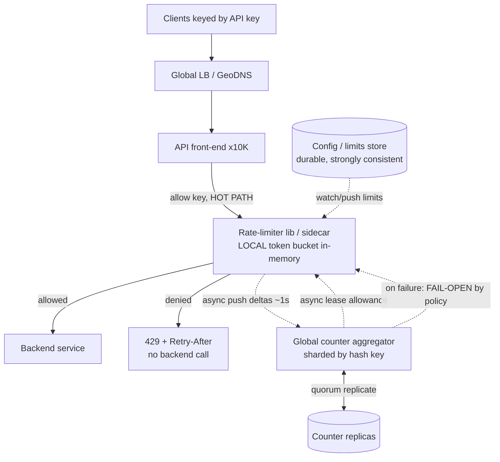

# A06 — Design a distributed rate limiter for Google APIs

Design a service that decides, for every incoming API request, whether to **allow** or **reject** it so that no client (API key, user, or IP) exceeds its configured quota — e.g. "10,000 requests/minute per key" — enforced consistently across **thousands of API front-ends in many regions**. It tests whether you can build **distributed counters that are correct and fair under load** while adding almost no latency to the request path. The crux is that the rate-limit decision is itself on the hot path of every request, so the hard part is not the algorithm but making a *shared, distributed count* fast, fair, and resilient to clock skew and partial failure.

## 1) Clarify — questions to ask the interviewer

- **What are we limiting and at what granularity?** Per API key, per user, per IP, per (key, endpoint) tuple, or a **global** ceiling for a whole service? Tiered (free vs paid) limits? This decides the key space and whether limits are per-key or global.
- **Algorithm expectations:** is a smooth/precise limit required (sliding window) or is some burst at window edges acceptable (fixed window)? Do we need **bursting** (token bucket lets a client save up and spike)? Different algorithms make different fairness/accuracy tradeoffs.
- **Scale:** total request rate across all front-ends, number of distinct limited keys, and number of regions. I'll assume O(10M) req/s globally across O(10K) front-ends and O(100M) distinct keys — confirm, because it decides whether counters can live in memory or need a shared store.
- **Latency budget:** how much latency may the limiter add per request? This must be tiny (sub-ms ideally) — it gates whether we do a network round-trip per request or amortize with local counters.
- **Accuracy vs cost:** is a small overshoot tolerable (e.g. allow up to ~1% over the limit) in exchange for far less coordination? Strict global accuracy is expensive; most production limiters accept bounded slack.
- **Fail-open or fail-closed?** If the limiter (or its backing store) is unavailable, do we **allow** traffic (protect availability, risk overload) or **reject** (protect the backend, risk an outage from the limiter itself)? This is a core product/risk decision I'll surface explicitly.
- **Consistency / clock model:** are front-ends in multiple regions, and do we trust their clocks? Window math depends on time, so **clock skew** is a real correctness issue.
- **What happens on reject?** `429 Too Many Requests` with a `Retry-After`, or queue/throttle? Any quota for retries?

**What the interviewer is signaling:** they want to see you handle **distributed counters** (not a single in-memory counter), reason explicitly about **fairness under load** and **clock skew**, and make the **fail-open vs fail-closed** call deliberately — all while keeping **added latency near zero**. The standout move is to separate "the algorithm" (token bucket / sliding window — easy) from "the distributed-state problem" (how 10K hosts share one count cheaply) and lead with the latter, plus naming the accuracy-vs-coordination tradeoff before anyone asks.

## 2) Functional Requirements (FR)

**In-scope**
- `allow(key) -> {allowed, remaining, retryAfter}` decision per request, on the hot path.
- Configurable limits per key / per (key, endpoint), with tiers (free/paid).
- Multiple algorithms: **token bucket** (bursting) and **sliding window** (smoothness/accuracy).
- **Distributed** enforcement: one logical limit shared across all front-ends and regions.
- Per-key and **global** limits (protect a backend from aggregate overload).
- Graceful behavior under store/limiter failure (fail-open or fail-closed, configurable).
- Return standard `429 + Retry-After` semantics.

**Out-of-scope (defer)**
- Full quota *billing/metering* and monthly usage accounting (related but a separate system).
- Sophisticated abuse/bot detection and dynamic limit learning (mention as an extension).
- Per-request *cost weighting* beyond a simple "this endpoint costs N tokens" (acknowledge, defer richer pricing).
- Admission control / load-shedding policy of the backend itself (the limiter feeds it, defer details).

## 3) Non-Functional Requirements (NFR)

| Dimension | Target & rationale |
|---|---|
| Scale | O(10M) req/s globally across ~10K API front-ends; ~100M distinct limited keys; many regions. |
| Added latency | p99 added by limiter < 1 ms (local decision); a shared-store round-trip only off the hot path / amortized. |
| Availability | 99.999% for the *decision* — the limiter must not become the thing that takes the API down. Hence fail-open as default. |
| Accuracy | Bounded overshoot acceptable (e.g. ≤ ~1% over limit globally) in exchange for cheap coordination; configurable to stricter where needed. |
| Fairness | No front-end or region may starve others; a key's allowance is shared proportionally, not first-come monopolized. |
| Consistency | Eventual on the global count (counters sync periodically); per-key linearizable only where strict limits demand it. |
| Clock | Tolerate bounded skew (NTP, ~tens of ms); window boundaries must not double-count or leak due to skew. |
| Durability | Counters are ephemeral (loss = reset to allow, tolerable); config (limits) must be durable and consistent. |

## 4) Back-of-envelope estimation

```
Decision rate
  10M req/s globally -> every request needs an allow() decision
  Across 10K front-ends -> ~1,000 decisions/sec/front-end (trivial locally)

Why not a round-trip per request?
  10M req/s to a central counter store = 10M ops/s of read-modify-write
  At even 0.5 ms RTT that's 5,000 sec of latency-seconds/sec of work -> needs
    huge fan-out AND adds 0.5 ms to EVERY API call. Reject this default.
  -> Local token buckets + periodic sync is the scalable shape.

Counter state (if centralized)
  100M keys * (counter 8B + window meta ~24B) ~ 3.2 GB -> fits in a sharded
    in-memory store easily; the bottleneck is OPS, not memory.

Local-bucket memory (per front-end)
  Each front-end caches buckets only for keys it currently sees.
  Say 100K active keys/front-end * ~40 B ~ 4 MB -> negligible.

Sync traffic (local -> global aggregator)
  If each front-end flushes per-key deltas every 1 s:
    100K keys * 10K front-ends = up to 1e9 key-deltas/s worst case
    -> shard the aggregator by hash(key); batch+compress deltas; most keys
       are cold so real volume is far lower. Sync is async, off the hot path.

Overshoot from local allowance
  If each of N front-ends is granted a slice and they don't re-sync instantly,
    worst-case overshoot ~ N * (per-slice burst). Bound it by granting small
    slices to active front-ends and syncing sub-second for hot keys.
```

## 5) API design

```
# Hot path (called by every API front-end, in-process or sidecar)
allow(key, cost=1) -> { allowed: bool, remaining: int, retryAfter: ms }

# Control plane
PUT  /limits/{key}        { algo, ratePerSec, burst, scope }   # set/update a limit
GET  /limits/{key}        -> current config
DELETE /limits/{key}

# Internal (local <-> global)
syncDeltas(frontendId, [{key, consumed, windowTs}])   # push local usage up
leaseAllowance(key, frontendId) -> { tokens, leaseTtl } # pull a slice down
gossip(shard topology, aggregator health)

# Response contract on reject
HTTP 429 Too Many Requests
  Retry-After: <seconds>
  X-RateLimit-Limit / X-RateLimit-Remaining / X-RateLimit-Reset
```

## 6) Architecture — request & data flow

**(a) ASCII layered flow**

```
                 Clients (apps calling Google APIs, keyed by API key)
                          |
                          v
              [ Global LB / GeoDNS ]            anycast, routes to nearest region
                          |
                          v
         ============ API front-end fleet (per region) ============
         |   [ API server ]  ... x10K, each with:                 |
         |        |                                                |
         |        v                                                |
         |   [ Rate-limiter library / sidecar ]  <-- HOT PATH      |
         |        |   allow(key): check LOCAL token bucket         |
         |        |   (in-memory) -> allow/deny in microseconds    |
         |        |                                                |
         |        | async, off hot path:                          |
         |        |   - push consumed deltas up (every ~1s)        |
         |        |   - pull refreshed allowance / global count    |
         |        v                                                |
         =========|================================================
                  | syncDeltas / leaseAllowance (async, batched)
                  v
        [ Global counter aggregator ]   sharded by hash(key);
          (in-memory KV, e.g. a        merges deltas from all front-ends,
           sharded counter store)      computes global usage per key,
            |        ^                  hands back per-front-end allowances
            |        |
            v        |  replicate (quorum) for the counter shard
        [ Counter replicas ]           survive a shard-node loss
                  |
                  v
        [ Config / limits store ]      durable, strongly-consistent
          (replicated SQL/KV)          limit definitions; pushed to
                                       front-ends via watch/poll

        On reject: front-end returns 429 + Retry-After (no backend call)
        On limiter/store failure: FAIL-OPEN (allow) by policy, with alarms
```

**Decision (hot) path:** every request hits an **API front-end**, which calls its **in-process rate-limiter** with `allow(key)`. The limiter consults a **local token bucket** held in memory and returns allow/deny in **microseconds with zero network hops** — this is what keeps added latency sub-ms. If denied, the front-end immediately returns `429 + Retry-After` *without* ever touching the backend (so the limiter actually sheds load).

**State-sync (off-hot) path:** asynchronously (every ~1s, batched), each front-end **pushes the deltas it consumed** to the **global counter aggregator** (sharded by `hash(key)`) and **pulls back a refreshed allowance** (a lease of tokens) for the keys it's actively serving. The aggregator merges deltas from all front-ends into a global per-key count and divides the remaining global allowance among the front-ends that are currently using that key. Counter shards are **quorum-replicated** so losing a node doesn't lose (much) count. **Limit configs** live in a separate **durable, strongly-consistent store** and are pushed/watched into the front-ends. Because the global count is *eventually* consistent, a key can briefly overshoot by the sum of outstanding local leases — a tradeoff we bound by leasing small slices and syncing sub-second for hot keys.

**(b) Mermaid flowchart**



## 7) Data model & storage choices

- **Local bucket state — in-process hash map** on each front-end: `key -> { tokens, lastRefillTs, leaseExpiry }`. First-principles: the decision is the hottest operation in the entire API, so its state must be **local memory** (no network, no lock contention). This is the single most important storage choice — it's what makes added latency microseconds instead of milliseconds.
- **Global counters — a sharded in-memory KV store**, partitioned by `hash(key)`: `key -> { consumed, windowStart }` (and per-front-end lease accounting). First-principles: the workload is a high-rate **read-modify-write on a numeric counter per key**; an in-memory store with atomic increment is the right primitive, and we shard by key so no single node is a global bottleneck. We do **not** put this on the hot path — it's reconciled asynchronously. The bottleneck here is **ops/sec, not bytes**, which is why batching deltas and sharding by key both matter.
- **Replication for counters:** quorum (R+W>N) within a shard so a node loss doesn't reset a key's count to zero (which would briefly let it overshoot). Counters are still *ephemeral* — total loss just means "reset to allow," which is acceptable because the config (the real source of truth for the *limit*) is durable.
- **Config / limit definitions — durable, strongly-consistent store** (replicated SQL or a consistent KV like a Paxos/Raft-backed store): `key -> { algo, ratePerSec, burst, scope, tier }`. First-principles: limits change rarely but must be **globally agreed and never lost** — the opposite profile from counters — so it gets strong consistency and durability, and is *watched* by front-ends rather than read per request.
- **Why not Redis-INCR-per-request as the whole design?** A single shared `INCR` per request is the naive answer: it adds a network RTT to every API call and makes the limiter store a throughput bottleneck and SPOF at 10M req/s. We use the same atomic-counter idea but **only for periodic reconciliation**, keeping the hot decision local.

## 8) Deep dive

**Deep dive A — the algorithms and why fairness/accuracy differ.**

- **Fixed window counter:** count requests in the current wall-clock window (e.g. per minute); reset at the boundary. Cheap (one counter + timestamp) but allows a **2x burst at the boundary** — a client can send a full window's worth at 11:59:59 and again at 12:00:00. Fairness/accuracy is the weakest.
- **Sliding window log:** store the timestamp of each request and count those within the last 60s — exact and smooth, but **memory grows with request volume** (a log per key), too costly at our scale.
- **Sliding window counter (recommended for accuracy):** keep the current and previous fixed-window counts and interpolate by how far into the current window we are — gives near-sliding accuracy at O(1) memory, killing the boundary-burst problem cheaply. This is the usual production choice when smoothness matters.
- **Token bucket (recommended for bursting):** a bucket of capacity `B` refills at `r` tokens/sec; each request takes a token, rejected if empty. Allows **controlled bursts** (save up to `B`) while bounding the long-run rate to `r`. It's O(1) state (`tokens`, `lastRefillTs`), trivial to compute lazily on each `allow()`, and is the most flexible — so it's my default, with sliding-window-counter where strict smoothness is required.

**Deep dive B — distributed counting, fairness, and clock skew (the real crux).** The algorithm is easy; sharing the count across 10K hosts cheaply is the hard part.

- **Why not a central counter per request:** an RTT on every API call (latency) and a throughput SPOF at 10M req/s. Rejected.
- **Local buckets + periodic sync (chosen):** each front-end is **leased a slice** of the global allowance for the keys it actively serves (e.g. if a key allows 10K/min and 10 front-ends serve it, each gets ~1K, dynamically re-divided by recent demand). Decisions are local; front-ends push consumed deltas and pull fresh leases every ~1s. This bounds added latency to microseconds and bounds **overshoot** to roughly the sum of outstanding leases. **Fairness** is enforced by the aggregator dividing the global allowance in proportion to each front-end's recent demand (weighted-fair), and by re-leasing sub-second for hot keys so no front-end hoards tokens it isn't using while others starve. For very strict limits, fall back to a per-key **linearizable** check on the shared store (slower, used only where exactness > latency).
- **Clock skew:** windows and token refills are time-based, so skewed clocks across regions can double-count or leak allowance at boundaries. Mitigations: (1) compute token refill from **elapsed local monotonic time**, not absolute wall clock, so a wrong absolute clock doesn't corrupt the rate; (2) have the **aggregator** stamp the authoritative window using its own clock so all front-ends agree on boundaries; (3) tolerate bounded skew (NTP keeps it to tens of ms) by treating window edges fuzzily / slightly under-granting near a boundary. State that we accept a small, bounded inaccuracy from skew rather than pretending clocks are perfect.

## 9) Key tradeoffs

| Decision | Choice & why | Tradeoff accepted |
|---|---|---|
| Where the decision runs | **Local** in-process bucket, not a per-request RTT | Global count is eventually consistent → bounded overshoot |
| Algorithm | Token bucket default (bursting); sliding-window-counter for smoothness | Token bucket allows bursts; fixed-window would allow 2x edge burst |
| Counting model | Local buckets + ~1s async sync + leasing | Up to ~sum-of-leases overshoot vs a strict (slow) central counter |
| Fairness | Aggregator weighted-fair re-leasing by recent demand | Slight reaction lag when demand shifts between front-ends |
| Accuracy vs cost | Accept ≤ ~1% overshoot for cheap coordination | Not exact; configurable to strict-linearizable where needed |
| Failure mode | **Fail-open** by default (don't let the limiter cause an outage) | A limiter outage can briefly let the backend be overloaded → protect with backend admission control |
| Clock | Monotonic-time refill + aggregator-stamped windows; tolerate NTP skew | Fuzzy window edges; tiny over/under-count near boundaries |
| Config consistency | Strong + durable for limits; ephemeral for counters | Limit changes propagate via watch (seconds), not instantly |
| CAP | AP for the decision (always decide, possibly slightly stale) | During partition, counts diverge → bounded overshoot |

## 10) Bottlenecks & failure modes

- **Per-request central counter (the naive design) is a latency + throughput SPOF.** *Mitigation:* the whole architecture — local buckets, async sync — exists to avoid this; never put the shared store on the hot path.
- **Hot key (one API key sending a huge share of traffic) overloads one counter shard.** *Mitigation:* the decision is local so the *hot path* never hits the shard; sync traffic for that key is batched/coalesced, and the shard is replicated. If a single key's sync is still hot, split its counter across sub-shards and sum.
- **Overshoot under partition / sync lag.** *Mitigation:* lease **small** slices to active front-ends and sync sub-second for hot keys, bounding worst-case overshoot to the sum of outstanding leases; tighten leases for strict limits.
- **Fairness failure (one front-end hoards a key's allowance, starving others).** *Mitigation:* aggregator re-leases by **recent demand** (weighted-fair) and expires unused leases quickly so idle allowance returns to the pool.
- **Clock skew double-counts or leaks at window edges.** *Mitigation:* monotonic-time refills + aggregator-authoritative window stamps; tolerate bounded NTP skew with fuzzy edges.
- **Limiter / counter store outage.** *Mitigation:* **fail-open** by default (the API stays up; better to briefly over-serve than to take an outage caused by the safety system), with loud alarms and a **fail-closed** option for backends that genuinely cannot tolerate overload. Back the decision with **backend-side admission control** so even a fully-failed-open limiter can't melt the backend.
- **Thundering retries after a 429 storm.** *Mitigation:* return `Retry-After` with jitter guidance; encourage exponential backoff so rejected clients don't synchronize.
- **Config rollout error (a bad limit pushed globally).** *Mitigation:* strongly-consistent, versioned config with staged rollout and instant rollback; front-ends watch and can fall back to last-known-good.

## 11) Scale 10x / evolution

- **First to break: the sync/aggregation tier** as keys and front-ends grow. Evolve by sharding the aggregator finer by `hash(key)`, coalescing/compressing deltas harder, and pushing more decisions fully local (longer leases for stable, low-risk keys).
- **More front-ends, more regions:** keep counters **region-local** with a lightweight cross-region reconciliation for truly global limits; accept that a *global* ceiling is eventually consistent across regions (per-region sub-limits keep overshoot bounded).
- **Hotter keys:** add **hierarchical counters** (front-end → rack → region → global) so a hot key's deltas aggregate in a tree instead of all hitting one shard — the classic fan-in pattern.
- **Stricter accuracy where it's worth it:** offer a per-limit "strict mode" that does a linearizable check on a consistent counter for the few keys that need exactness, accepting the extra latency only there.
- **Smarter fairness:** move from static slices to **demand-weighted, predictive** allocation (allocate based on a short rolling forecast) so reaction lag shrinks as load shifts.
- **Cost-weighted limits:** generalize `allow(key, cost)` so expensive endpoints consume more tokens, letting one limiter protect heterogeneous backends.

## 12) Interviewer probes & follow-ups

- **"Why not just `INCR` a shared Redis key per request?"** That adds a network RTT to *every* API call and makes the store a throughput SPOF at 10M req/s. I use the same atomic-counter idea, but only for **periodic reconciliation**; the per-request decision is a local in-memory token bucket — microseconds, zero hops.
- **"Token bucket vs sliding window — which and why?"** Token bucket for **bursting** with a bounded long-run rate (default, O(1) state). Sliding-window-counter when I need **smoothness** without the fixed-window 2x-boundary burst, also O(1) via current+previous window interpolation. Avoid the sliding-window *log* at scale (memory grows with traffic).
- **"How do you keep the limit accurate across 10K front-ends?"** I don't keep it perfectly accurate — I lease slices of the global allowance to active front-ends and sync deltas ~1s. Overshoot is bounded by the sum of outstanding leases (≤ ~1%); I lease smaller and sync faster for hot keys, and fall back to a linearizable check only where exactness beats latency.
- **"Fail-open or fail-closed?"** Default **fail-open**: a safety system must not become the cause of an outage, so if the limiter/store is down I allow and alarm. I back this with backend admission control so fail-open can't melt the backend, and I offer **fail-closed** for backends that truly cannot tolerate overload.
- **"How do you ensure fairness so one greedy client doesn't starve others?"** Limits are per-key, so one key can't consume another's quota. Within a key shared across front-ends, the aggregator re-leases the allowance **weighted by recent demand** and expires idle leases, so allowance flows to where it's needed instead of being hoarded.
- **"Clock skew across regions — doesn't that break the windows?"** I refill tokens from **monotonic elapsed time** (immune to absolute-clock errors) and let the aggregator stamp authoritative window boundaries; bounded NTP skew (tens of ms) is absorbed by fuzzy edges and slight under-granting near boundaries.
- **"Per-key vs global limits?"** Both: per-key protects fairness between clients; a global limit protects a backend from aggregate overload. The global one is enforced the same way (a special key) and is eventually consistent across regions with per-region sub-limits to bound overshoot.
- **"What latency does this add?"** Microseconds on the hot path — it's an in-memory token-bucket check with no network call. The network work (delta sync, lease refresh) is entirely off the request path.

## 13) 60-minute flow cheat-sheet

| Time | Phase | What to do |
|---|---|---|
| 0–6 min | Clarify | Granularity (key/user/IP/global), algo expectations, scale, **fail-open vs closed**, accuracy slack |
| 6–9 min | FR/NFR | Lock sub-ms added latency, 99.999% decision availability, bounded overshoot, fairness |
| 9–15 min | Estimation | Decision rate/front-end, **why per-request RTT is rejected**, counter ops vs memory, sync volume |
| 15–20 min | API + high-level arch | allow(key), local bucket + async sync, draw both diagrams, separate config store |
| 20–25 min | Walk decision & sync paths | Local allow in µs → 429 no backend call; async delta push + lease pull |
| 25–40 min | Deep dive | (A) token bucket vs sliding-window-counter; (B) distributed counting, leasing, fairness, clock skew |
| 40–48 min | Tradeoffs + failures | Local vs central, overshoot bound, fail-open default, hot-key fan-in, retry storms |
| 48–55 min | Scale 10x | Finer aggregator shards, region-local counters, hierarchical fan-in, strict-mode keys |
| 55–60 min | Probes | Why not shared INCR, accuracy bound, fail-open justification, fairness/leasing, clock skew |
