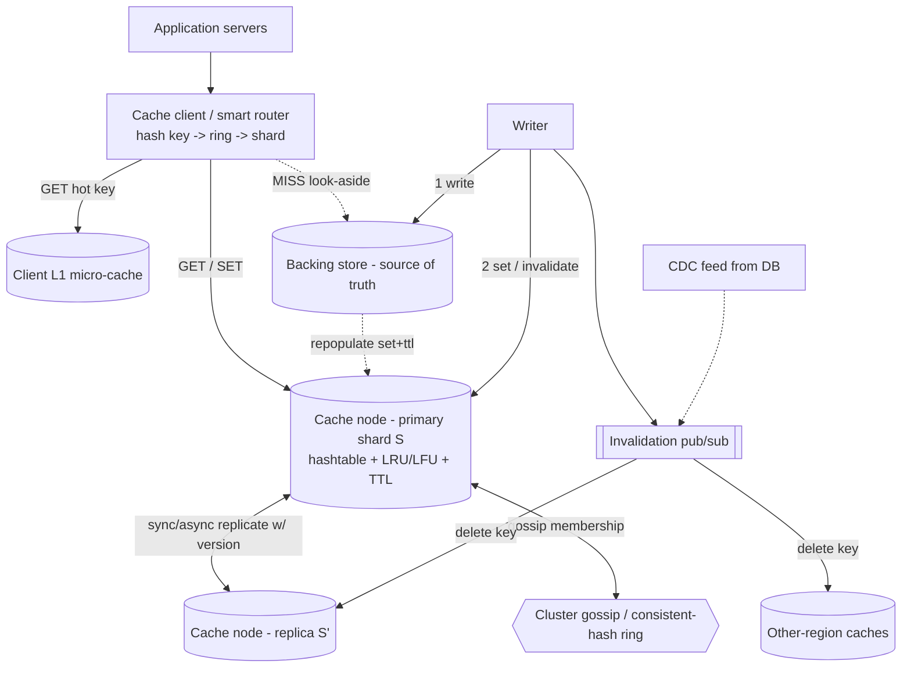

# A07 — Design a distributed cache

Design an in-memory, horizontally-scalable cache (a self-built Memcached/Redis-class system) that sits in front of a slower source of truth and serves millions of reads/sec at sub-millisecond latency. The interviewer **forbids "just use Redis"** precisely because the goal is to see the internals: **consistent hashing** for placement, **replication** for availability, **eviction** (LRU/LFU) when memory fills, a coherent **invalidation/consistency** contract with the backing store, and **hot-key** survival. It's the smallest system that still forces you to confront partitioning, replication, and consistency all at once — which is why it's a foundational Google building-block question.

## 1) Clarify — questions to ask the interviewer

- **Cache role / topology:** **look-aside** (the app reads the cache, falls back to the DB on a miss, and populates it) or **read-through / write-through** (the cache is inline and itself owns DB access)? This decides who handles misses and invalidation.
- **Consistency contract:** is stale data acceptable, and for how long (a TTL-bounded eventual window), or does the **writer need read-after-write**? Most caches are best-effort eventual versus the source of truth — I want this pinned down because it drives the whole write/invalidation design.
- **Workload shape:** read/write ratio, value sizes (bytes vs MB), and key cardinality. A 100:1 read:write blob cache is a very different system from a write-heavy counter cache.
- **Scale & latency:** target QPS and the p99 budget (sub-ms for in-datacenter; single-digit ms cross-AZ?). This sizes nodes and the replication strategy.
- **Durability expectation:** is the cache purely a **performance layer** (loss = a cold start, tolerable) or must it survive restarts (then we need persistence/AOF)? Usually the former — I'll confirm we can treat it as ephemeral.
- **Eviction signal:** is there a natural **recency** pattern (LRU — sessions, recent items) or a **frequency** pattern (LFU — a small set of perennially hot keys)? Any hard per-tenant memory quotas?
- **Hot keys:** are there known skewed keys (a viral item, a global config blob)? This decides whether we need hot-key replication / client-side caching.
- **Multi-region:** is the cache **per-region** (local to the DB region) or **global**? Global coherence is a much harder ask and I'd push back on needing it.
- **Backing store:** what is the source of truth (SQL / KV / search index), and does it emit **change events** we can subscribe to for invalidation?

**What the interviewer is signaling:** they want proof you treat the cache as **subordinate to a source of truth**, can state the **consistency window** precisely (not hand-wave "we cache it"), and know the **internals** that "use Redis" would have skipped. The standout move is to name the **write policy** (write-through / write-back / write-around) and the **invalidation strategy** *before* drawing boxes, and to raise **hot keys** proactively — that's the line between "knows Redis" and "can design a cache."

## 2) Functional Requirements (FR)

**In-scope**
- `get(key)`, `set(key, value, ttl)`, `delete(key)`; optional `mget`/`mset` for batching.
- **Horizontal scale-out:** add/remove nodes with minimal key movement.
- **Replication** so a node loss doesn't drop the hot working set or availability.
- **Eviction** when memory is full (LRU and LFU options).
- **TTL-based expiry.**
- **Invalidation** coherent with the backing store on writes.
- **Hot-key mitigation.**
- Atomic counters / increment (a common cache primitive) — cheap to include.

**Out-of-scope (defer)**
- Full database-grade persistence/durability (cache is a performance layer; mention AOF/snapshot as an option).
- Rich data types beyond opaque blobs + counters (lists, sorted sets) unless asked.
- Cross-region strong coherence (offer region-local caches + an invalidation broadcast instead).
- Multi-key transactions / atomicity across shards (hard; defer).

## 3) Non-Functional Requirements (NFR)

| Dimension | Target & rationale |
|---|---|
| Scale | 10M reads/sec, 200K writes/sec; ~1 TB hot working set; hundreds of nodes. |
| Latency | p99 < 1 ms in-DC GET (memory + one network hop); p99 < 5 ms with a replica fallback. |
| Availability | 99.99% — a single node loss must not cause a visible outage (a replica takes over). |
| Consistency | Eventual vs the backing store; bounded staleness = TTL + invalidation propagation. Read-after-write for the writer via write-through + invalidate. |
| Durability | Ephemeral by default (loss tolerable, repopulate from source). Optional AOF for a warm restart. |
| Elasticity | Adding/removing a node moves O(1/N) of keys (consistent hashing), not the whole keyspace. |
| Security | Network isolation (private subnet), per-tenant namespaces/quotas, optional auth token. |

## 4) Back-of-envelope estimation

```
Throughput
  10,000,000 GET/sec, 200,000 SET/sec
  Avg value 1 KB -> read bandwidth = 10 GB/sec aggregate
    -> spread across ~200 nodes = 50K GET/sec/node, ~50 MB/sec/node (fine for a NIC)

Memory sizing (hot working set)
  Target hot set = 1 TB of values
  Overhead: key + metadata (LRU links, TTL, hash) ~ 60-100 bytes/entry
  At 1 KB values: overhead ~6-10% -> provision ~1.1 TB usable
  With replication factor 2: ~2.2 TB raw across the cluster
  Node = 64 GB usable RAM -> 2.2 TB / 64 GB = ~35 data nodes (x2 for replicas ~70);
    run ~200 for headroom + hot-key replication + per-node QPS limits

Consistent-hashing ring
  Virtual nodes: ~150 vnodes/physical node -> smooth load, low variance
  200 nodes * 150 = 30,000 points on the ring

Hit-rate economics (the whole point of the cache)
  Hit rate 95% -> backing store sees only 5% * 10M = 500K reads/sec (vs 10M) -> 20x offload
  A 1% hit-rate DROP adds 100K reads/sec to the DB -> motivates careful eviction + hot-key handling
```

## 5) API design

```
# Client-facing (look-aside or read-through)
GET    /cache/{key}                 -> 200 {value, ttl_remaining} | 404 miss
PUT    /cache/{key}  {value, ttl}   -> 200            # set / overwrite
DELETE /cache/{key}                 -> 200            # invalidate
POST   /cache/mget   {keys:[...]}   -> {key:value,...}
POST   /cache/incr/{key} {by:1}     -> {value}        # atomic counter

# Internal (node-to-node)
replicate(key, value, ttl, version) # primary -> replica, async or sync
gossip(membership, ring_version)    # cluster topology, failure detection (SWIM-style)
handoff(key_range)                  # on node join/leave, move owned slots

# Write-through wrapper (cache owns DB access)
writeThrough(key, value):
  db.write(key, value)              # source of truth FIRST
  cache.set(key, value)             # then cache (or delete to invalidate)
  publish_invalidation(key)         # to replicas / other regions
```

## 6) Architecture — request & data flow

**(a) ASCII layered flow**

```
            Application servers (clients of the cache)
                  |  get(k) / set(k,v)
                  v
         [ Cache client library / smart router ]   knows the ring, hashes the key,
                  |                                  picks the owning shard, and may keep a
                  |                                  tiny client-side L1 micro-cache for hot keys
                  |  hash(key) -> ring -> shard S
                  v
         [ Cache node S (primary) ] <---- gossip ----> [ other cache nodes ]  membership +
            |        ^   in-memory hashtable + LRU/LFU + TTL                    failure detection
            |        |   sync or async replicate
            |        v
            |   [ Cache node S' (replica) ]   serves reads if the primary fails
            |
            |  MISS (look-aside)
            v
         Application falls back to:
         [ Backing store / source of truth ]   (SQL / KV / search index)
            ^                |
            |  write-through |  on write: DB FIRST, then cache set + invalidate
            +----------------+
                     |
                     v
         [ Invalidation bus (pub/sub) ] --> fan-out delete(key) to replicas
                                            and to other-region caches
         (optional) [ CDC feed from DB ] --> authoritative invalidations
```

**Read path (look-aside, the common case):** the app calls the cache client with `get(key)`. The client optionally checks a tiny **client-side L1** for ultra-hot keys, then hashes the key onto the **consistent-hash ring** to find the owning shard's primary and issues the GET. On a **hit**, it returns in sub-ms. On a **miss**, the app reads the **backing store**, then `set`s the value with a TTL so subsequent reads hit. If the primary is unreachable, the client retries the shard's **replica** (still serves reads) while the failure detector promotes it.

**Write path:** with **write-through**, the writer goes to the **backing store first** (the source of truth), then either `set`s the new value or `delete`s the key (invalidate) and publishes an invalidation on the bus so replicas and other-region caches drop the stale copy. With **write-around**, the writer only updates the DB and lets the key be re-populated on the next read (good for write-heavy, rarely-read keys). With **write-back**, the cache absorbs the write and flushes to the DB asynchronously (lowest write latency, risk of loss — only for tolerant data like counters/metrics). Each entry carries a **version/timestamp** so a late replicate can't overwrite a newer value (last-writer-wins by version).

**(b) Mermaid flowchart**



## 7) Data model & storage choices

- **Core store: an in-memory hash table per node**, value = opaque bytes + metadata `{ttl, version, lru_ptr / lfu_count}`. First-principles: O(1) average get/set is what buys sub-ms latency; everything else (eviction, expiry) is bookkeeping hung off this table. Memory layout matters — slab allocation (Memcached-style) avoids fragmentation for fixed-ish value sizes.
- **Eviction index:** an intrusive **doubly-linked list for LRU** (move-to-front on access, evict the tail) or a **frequency structure for LFU** (approximate counters + min-heap / O(1) LFU buckets). Pick LRU for recency-dominated workloads (sessions, recent items); pick LFU (or a TinyLFU admission filter) for skewed-popularity workloads where a one-off scan would otherwise evict a perennially-hot key.
- **Placement: consistent hashing with virtual nodes.** First-principles: with modulo-N hashing, adding/removing a node remaps **~all** keys (a cluster-wide miss storm); consistent hashing remaps only **~1/N**, and ~150 vnodes/node flatten the otherwise-lumpy ring so load variance stays low. The ring maps `hash(key) -> next vnode clockwise -> physical node`.
- **Membership / topology:** gossip-based (SWIM-style) failure detection + a **versioned ring** so clients learn topology changes; **no central coordinator on the hot path** (which would be a SPOF and a latency tax).
- **Backing store:** whatever the source of truth is (SQL/KV/blob/index) — the cache is deliberately agnostic; it only needs (a) a way to read on miss and (b) ideally a change-event feed for invalidation.
- **Optional persistence:** an append-only log (AOF) or periodic snapshot per node so a *planned* restart warm-starts instead of cold — **off by default** because the cache is a performance layer, not a database.

## 8) Deep dive

**Deep dive A — consistent hashing, replication, and rebalancing (the placement crux).** Keys map to the ring by `hash(key)`; the owning physical node is the next clockwise vnode's owner. **Replication:** a key's primary is its owning vnode; replicas are the next R **distinct physical** nodes clockwise (skip vnodes of the same machine so a replica isn't co-located with its primary). On a **node join**, only the key ranges immediately counter-clockwise of its new vnodes move to it — O(total/N) keys, streamed via handoff while the old owner keeps serving (no downtime). On a **node leave/failure**, its replica is promoted and a new replica is rebuilt on the next node; again only that node's ranges move. **Replication consistency:** *synchronous* replicate gives a replica that's never behind (safer failover, higher write latency); *asynchronous* gives lower latency but a tiny window where a freshly-promoted replica is stale. For a cache, **async + version stamps** is usually right because the backing store is the real source of truth, and **last-writer-wins by version** resolves a primary/replica race after failover.

**Deep dive B — invalidation & consistency with the source of truth (the correctness crux).** A cache is only useful if its staleness is *bounded and explained*. The fundamental hazard: a write to the DB must not leave the cache serving the old value indefinitely. Strategies weakest-to-strongest: (1) **TTL only** — staleness bounded by the TTL, simplest, zero coordination; fine when slightly-stale is acceptable. (2) **Write-through + explicit invalidate** — on write, update the DB then `delete`/`set` the key and publish an invalidation to replicas/other regions; gives read-after-write for the writer when reads route through the same path. The dangerous race is **read-populates-stale**: a reader misses, reads the old DB value, and *before it sets the cache* a writer updates the DB and invalidates — now the reader writes a stale value that sticks. Mitigations: a **versioned set** (only overwrite if the incoming version > stored version, so the stale set is rejected), or **delete-on-write rather than set-on-write** combined with a short "populate only if still absent." (3) **CDC-driven invalidation** — subscribe to the DB's change log and invalidate keys as authoritative events, decoupling correctness from app discipline. For multi-region, an **invalidation bus broadcasts deletes** so regional caches converge; coherence is eventual, bounded by bus propagation. The honest framing: a cache trades a **bounded staleness window** for a **20x read offload** — name the window (TTL + propagation) explicitly rather than claiming strong consistency.

## 9) Key tradeoffs

| Decision | Choice & why | Tradeoff accepted |
|---|---|---|
| Placement | Consistent hashing + vnodes | Slightly more complex than mod-N; gain O(1/N) movement on churn |
| Write policy | Write-through default; write-back for tolerant data | Write-through adds DB-write latency; write-back risks loss on a node crash |
| Replication sync | Async + version stamps | Tiny stale-failover window; gain write latency, OK since the DB is truth |
| Eviction | LRU default; LFU/TinyLFU for skewed popularity | LRU is scan-sensitive (a big scan can evict hot keys); LFU costs counters |
| Consistency model | Eventual, staleness ≤ TTL + propagation | Not strongly consistent vs the DB; correct for a perf layer |
| Coordination | Gossip, no central master on the hot path | Eventual topology view; a client may briefly route to a moved key (retry) |
| Hot keys | Replicate hot keys + client L1 | Extra memory + brief L1 staleness; gain to survive a single-shard meltdown |
| CAP | AP (serve possibly-stale on partition) | Reads may be stale during a partition; availability preserved |

## 10) Bottlenecks & failure modes

- **Hot key melts one shard:** all traffic for a viral key hits a single node. *Mitigation:* detect via per-key counters, **replicate the hot key across several nodes** and have the client fan reads across them, plus a tiny **client-side L1** micro-cache; for extremes, key-splitting (`key#shard`).
- **Thundering herd / cache stampede on miss:** a popular key expires and thousands of readers simultaneously miss and hammer the DB. *Mitigation:* **request coalescing / single-flight** (one reader recomputes, others wait), **probabilistic early expiration** (refresh slightly before TTL), and a short populate lock.
- **Cold start / mass eviction:** a node restart or a flush empties the working set, dumping load on the DB. *Mitigation:* warm-start from AOF/snapshot or a replica; ramp traffic gradually; the 20x offload disappearing is the risk to size for.
- **Hot partition on rebalance:** a node join causes a handoff storm. *Mitigation:* throttle handoff bandwidth; keep serving from the old owner until handoff completes.
- **Stale-write race (read-populates-stale):** *Mitigation:* versioned set / delete-on-write (deep dive B).
- **Cascading failure when the cache dies:** the DB suddenly takes 20x load and falls over — the real SPOF of "caching." *Mitigation:* protect the DB with admission control / load shedding and circuit breakers so a cache outage degrades *latency*, not *availability*.
- **Replica co-located with its primary:** correlated failure. *Mitigation:* placement skips same-physical-node and ideally same-rack/AZ for replicas.

## 11) Scale 10x / evolution

- **First to break: per-node QPS and NIC** for ultra-hot keys, and the **DB behind the cache** if hit rate dips. Evolve by adding hot-key replication tiers and a client-side L1 to absorb the hottest keys before they ever reach a shard.
- **Tiered caching:** L1 (in-process app cache, micro-TTL) → L2 (this distributed cache) → L3 (regional shared cache), so each tier absorbs a fraction and the backing store sees a trickle.
- **Working set larger than RAM economics allow:** add a memory-tier + SSD-tier (RocksDB-backed) for the long tail, keeping the hottest keys in RAM.
- **Multi-region:** run a cache **per region** next to the DB region; broadcast invalidations on a global bus; accept eventual cross-region coherence. For globally-shared keys (config), use a very short TTL + CDC invalidation.
- **Smarter eviction:** adopt admission control (TinyLFU) so a one-hit scan can't evict a frequently-used key — directly improving hit rate and thus DB offload at 10x.
- **Observability of hit rate:** since a 1% hit-rate drop = 100K extra DB reads/sec at 10M QPS, treat hit rate as a **first-class SLO** with alerting.

## 12) Interviewer probes & follow-ups

- **"Why consistent hashing over mod-N?"** Mod-N remaps nearly every key when N changes (a cache-wide miss storm); consistent hashing moves only ~1/N. Virtual nodes flatten load skew so no single node owns a disproportionate range.
- **"How do you keep the cache consistent with the DB?"** It's eventual, bounded by TTL + invalidation propagation. I write the DB first (source of truth), then invalidate/set the key and publish to replicas; I guard the read-populates-stale race with versioned sets or delete-on-write. I state the staleness window explicitly rather than claim strong consistency.
- **"A single key gets 1M req/sec — what happens?"** Without help, one shard melts. I detect the hot key, replicate it across several nodes, fan client reads across them, and add a client L1 micro-cache; key-splitting for the extreme case.
- **"A popular key expires and the DB gets hammered — fix it."** Cache stampede: single-flight coalescing so one reader recomputes while others wait, plus probabilistic early refresh so it never fully cold-expires under load.
- **"LRU vs LFU — which and why?"** LRU for recency workloads (sessions); LFU or a TinyLFU admission filter for skewed-popularity workloads where a scan would otherwise evict perennially-hot keys. I default LRU and switch on observed scan sensitivity.
- **"Write-through vs write-back?"** Write-through keeps cache and DB coherent at the cost of write latency (default); write-back gives the lowest write latency but risks loss on a crash, so only for tolerant data like counters/metrics with async batched flush.
- **"What happens when the whole cache dies?"** The DB takes the full 20x load — the real danger. I protect it with admission control, circuit breakers, and a gradual warm-up, so a cache outage degrades latency, not availability.
- **"How does a node join without downtime?"** It claims its vnode ranges; only counter-clockwise ranges hand off to it, streamed while the old owner keeps serving; clients pick up the new ring via gossip and retry on the rare in-flight move.

## 13) 60-minute flow cheat-sheet

| Time | Phase | What to do |
|---|---|---|
| 0–6 min | Clarify | Look-aside vs write-through; staleness tolerance; read/write ratio; hot keys; ephemeral vs persistent |
| 6–9 min | FR/NFR | Lock eventual consistency (≤ TTL + propagation), 99.99% availability, sub-ms p99 |
| 9–14 min | Estimation | QPS/node, memory sizing with overhead + replication, hit-rate offload (20x) |
| 14–20 min | API + high-level arch | get/set/delete, consistent-hash router, primary/replica; draw both diagrams |
| 20–25 min | Walk read & write paths | Miss → populate; write-through DB-first-then-invalidate; version stamps |
| 25–40 min | Deep dive | (A) consistent hashing + replication + rebalance; (B) invalidation & the stale-write race |
| 40–48 min | Tradeoffs + failures | Eviction choice, hot keys, stampede, cache-death cascading load |
| 48–55 min | Scale 10x | Tiered L1/L2/L3, SSD tier, multi-region invalidation bus, TinyLFU |
| 55–60 min | Probes | Consistency-window honesty, hot-key fan-out, stampede single-flight |
