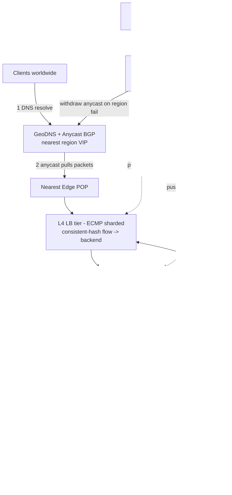

# A08 — Design a global / distributed load balancer

Design the system that sits between the public internet and a fleet of backend servers spread across many regions, and steers every connection to a **healthy, nearby, not-overloaded** backend — Google-scale, meaning tens of millions of QPS, multiple continents, and zero tolerance for a single point of failure. It tests **traffic management, health checking, and geo-routing** under real failure conditions: how do you route a user to the closest region (anycast / geo-DNS), spread load **within** a region without creating hotspots (L4/L7 balancing + consistent hashing for stickiness), detect and eject dead backends (health checks), drain connections gracefully on deploy, and fail over a whole region without dropping users. The hard part is that the load balancer is itself the most critical SPOF in the stack, so every layer must be redundant and self-healing.

## 1) Clarify — questions to ask the interviewer

- **Scope:** are we designing the **global** tier (which region does a user hit — anycast/DNS), the **regional** tier (which backend within a region — L4/L7), or both end-to-end? I'll design the full path and call out the layers, since "global LB" usually means the whole stack.
- **Traffic type:** HTTP(S) only, or also raw TCP/UDP (gRPC, QUIC, custom protocols)? This decides whether we can rely on **L7** (HTTP-aware) routing or must stay at **L4** (connection-level). Do we terminate TLS at the edge?
- **Stickiness / session affinity:** do backends hold per-connection or per-session state that requires the same client to land on the same backend (sticky sessions), or are backends stateless (any backend works)? Affinity drives whether we need **consistent hashing**.
- **Scale & latency:** total QPS, connections/sec, number of regions and backends, and the **added-latency budget** the LB may impose. At Google scale the LB must add near-zero latency and survive an order of magnitude more connections than any single box can hold.
- **Health & failover targets:** how fast must we detect a dead backend and stop sending it traffic (seconds)? How fast must we fail an entire region over (and is the data tier multi-region to allow it)?
- **Routing policy:** purely geographic (closest region), or also capacity-aware / latency-aware / cost-aware (route away from a hot or expensive region)? Any **weighted** or canary routing (send 1% to a new version)?
- **Deploys:** how do backends enter/leave rotation — do we need **connection draining** so in-flight requests finish on a server that's being removed?
- **Observability needs:** what must we see in real time (per-backend QPS, errors, latency, health), and what SLOs are we defending?

**What the interviewer is signaling:** they want to see you (1) distinguish **L4 vs L7** and place each correctly, (2) design **health checking + failover** that's fast and avoids false positives, (3) use **anycast/geo-DNS** for global routing and **consistent hashing** for stable in-region distribution, and (4) treat the LB itself as a redundant, **hotspot-avoiding**, observable system rather than a magic box. The standout move is to lay out the **multi-tier** path (DNS/anycast → edge L4 → L7 → backends) up front and to be explicit that the LB is the critical SPOF, so every tier is N+ redundant and health-driven.

## 2) Functional Requirements (FR)

**In-scope**
- Route each request/connection to a **healthy, nearby, non-overloaded** backend.
- **Global routing:** direct users to the best region (anycast + geo/latency DNS).
- **Regional balancing:** distribute within a region (L4 connection spreading, L7 request routing).
- **Health checking:** active + passive detection; eject unhealthy backends fast, re-admit on recovery.
- **Session affinity / stickiness** via consistent hashing when backends are stateful.
- **Connection draining** on planned backend removal (deploys, scale-down).
- **Failover:** single-backend, single-LB-node, and whole-region.
- **Hotspot avoidance:** even load distribution, no single backend or region overwhelmed.
- **Observability:** per-backend/region QPS, latency, error rate, health state.
- Weighted / canary routing (send X% to a target pool).

**Out-of-scope (defer)**
- Full WAF / DDoS scrubbing internals (mention as an edge concern, defer).
- TLS certificate lifecycle management (acknowledge termination point, defer PKI).
- Application-level routing logic beyond path/host/header (defer API-gateway concerns).
- The backends' own business logic and data tier (the LB is agnostic; assume a multi-region data tier exists for region failover).

## 3) Non-Functional Requirements (NFR)

| Dimension | Target & rationale |
|---|---|
| Scale | Tens of millions of QPS globally; millions of concurrent connections; many regions, 10K+ backends. |
| Added latency | LB adds < 1 ms at L4, < a few ms at L7 (TLS + parse). Global routing adds one DNS/anycast hop, not per-request. |
| Availability | 99.999% — the LB must be more available than anything it fronts; no single LB node or region is a SPOF. |
| Failover speed | Eject a dead backend in < a few seconds; fail a region over in < tens of seconds (DNS TTL / anycast withdrawal bound). |
| Distribution | Even load; no backend > its capacity; consistent hashing keeps affinity stable under churn (≤ 1/N keys move when a backend leaves). |
| Consistency | Routing/health state is eventually consistent (gossiped); affinity is best-effort (a small fraction remap on backend churn). |
| Durability | LB state (config, backend pools) is durable + versioned; live health is ephemeral and re-derived. |
| Security | TLS termination/passthrough, basic L3/L4 DDoS absorption at the edge, isolation of the control plane. |

## 4) Back-of-envelope estimation

```
Scale of connections
  20M QPS, avg connection handles ~10 req before close -> ~2M new conns/sec
  No single box holds millions of conns -> MUST spread the L4 tier horizontally
    across many edge nodes; ECMP/anycast splits flows across them.

Why DNS/anycast for global (not per-request routing)
  Per-request global routing would add a cross-continent hop to EVERY request.
  Instead, resolve the user to the nearest region ONCE (DNS, ~cached for TTL)
    and let anycast BGP pull packets to the closest edge POP automatically.
  -> Global decision amortized over a DNS TTL; per-request cost stays local.

Health-check load
  10K backends, active health check every 1s from each regional LB
  -> 10K checks/sec/region (trivial); keep checks cheap (TCP/HTTP 200) so they
     don't themselves load backends. Use passive signals (real request errors)
     to react FASTER than the active interval between probes.

Backend capacity / hotspot math
  If one region has 1,000 backends at 5K QPS each = 5M QPS capacity.
  At 5.5M offered QPS that region is over capacity -> must shed ~0.5M QPS to
    a neighbor region (capacity-aware routing), or it browns out.
  Consistent hashing with ~150 vnodes/backend keeps per-backend variance low
    so "even" distribution is actually even, not lumpy.

LB control-plane state
  10K backends * (addr + health + weight + load ~64 B) ~ 640 KB -> tiny;
    the challenge is PROPAGATION speed & freshness, not size.
```

## 5) API design

```
# Data plane (implicit - packets/requests flow through; no app API)
#   L4: forward TCP/UDP flow -> chosen backend (NAT or DSR)
#   L7: terminate TLS, parse HTTP, route by host/path/header -> backend pool

# Control plane (operators + automation)
PUT  /pools/{pool}            { backends:[...], algo, healthCheck, weights }
POST /pools/{pool}/backends   { addr, weight, zone }     # add to rotation
DELETE /pools/{pool}/backends/{addr}?drain=true          # graceful remove (drain)
PUT  /routing                 { geoRules, weightedSplits, failoverOrder }
GET  /health/{pool}           -> per-backend {state, lastProbe, ewmaLatency, load}
GET  /metrics                 -> qps, errorRate, p99, conns per backend/region

# Internal
healthProbe(backend) -> {ok, latencyMs}        # active check
gossip(backendHealth, lbMembership)            # spread health/topology
withdrawAnycast(region)                         # BGP withdraw to fail a region out
drain(backend): stop NEW conns, let in-flight finish, then remove
```

## 6) Architecture — request & data flow

**(a) ASCII layered flow**

```
                 Clients (browser / mobile / API, worldwide)
                          |
                          | 1) DNS resolve  ->  GeoDNS returns nearest region VIP
                          v
              [ GeoDNS + Anycast (BGP) ]      one anycast IP advertised from many
                          |                    POPs; routers pull packets to the
                          |                    CLOSEST POP automatically (no per-req hop)
                          v
         ============ Edge POP (nearest region) ============
         |                                                  |
         |   [ L4 load balancer tier ]  (ECMP-sharded)      |
         |     - terminates nothing; forwards TCP/UDP flows |
         |     - consistent-hash flow -> healthy backend    |
         |     - DSR or NAT; survives node loss via ECMP    |
         |        |                                         |
         |        v                                         |
         |   [ L7 load balancer tier ]  (optional, HTTP)    |
         |     - terminates TLS, parses HTTP                |
         |     - routes by host/path/header, weighted/canary|
         |     - retries, timeouts, circuit-break           |
         |        |                                         |
         |        v                                         |
         |   [ Backend pool ]  app servers (stateless or    |
         |     sticky via consistent hashing)               |
         |        ^                                         |
         |        | active health probes (every ~1s)       |
         |   [ Health checker ] --gossip--> other LB nodes  |
         |        |                                         |
         ====================|==============================
                             |  passive signals (5xx, timeouts) eject faster
                             v
              [ Control plane ]   pools, weights, routing rules (durable,
                                  versioned); pushes config; aggregates
                                  health/load; can WITHDRAW a region's anycast
                                  on regional failure -> traffic shifts to next
                                  nearest POP automatically

              [ Observability ]   per-backend/region QPS, p99, errors, health
                                  -> drives autoscaling + capacity-aware routing
```

**Request path (read it top to bottom):** (1) The client **resolves DNS**; **GeoDNS** returns the VIP/anycast address closest to the user (latency- or geo-based), cached for the record's TTL. (2) Packets to that **anycast** IP are pulled by BGP to the **nearest edge POP** — the global routing decision costs no per-request hop. (3) At the POP, the **L4 tier** (sharded across many nodes via **ECMP** so no single node is a SPOF or bottleneck) maps the connection's flow tuple via **consistent hashing** to a healthy backend and forwards it (DSR or NAT). (4) If the service is HTTP and needs content-aware routing, the **L7 tier** terminates TLS, parses the request, and routes by host/path/header — applying weighted/canary splits, retries, timeouts, and circuit-breaking. (5) The request lands on a **backend**; if backends are stateful, consistent hashing keeps a given client/session pinned to the same backend across reconnects.

**Health & failover path (the control loop):** a **health checker** actively probes each backend (~1s, cheap TCP/HTTP probe) and *also* consumes **passive signals** (real 5xx/timeouts) to react faster than the probe interval. Unhealthy backends are removed from the consistent-hash ring (their share redistributes to neighbors — only ~1/N flows move). Health/topology is **gossiped** between LB nodes so every node has a fresh view without a central bottleneck. On a **planned removal/deploy**, the backend is **drained**: it stops receiving *new* connections while in-flight requests finish, then it's removed. On a **whole-region failure**, the control plane **withdraws that region's anycast advertisement** (and/or pulls its DNS record), so the internet reroutes users to the next-nearest POP within the BGP/TTL window. The **observability** layer feeds per-backend/region load back into **capacity-aware routing** so traffic shifts off a hot region *before* it browns out.

**(b) Mermaid flowchart**



## 7) Data model & storage choices

- **Backend pool / config — a durable, strongly-consistent, versioned store** (a Paxos/Raft-backed KV or replicated SQL): `pool -> { backends:[{addr, zone, weight, capacity}], algo, healthCheckSpec, routingRules }`. First-principles: config is read constantly but written rarely, and **must be globally agreed and never lost** — a split-brain on which backends exist would route traffic into the void. So it gets strong consistency + durability and is **pushed/watched** into the data-plane nodes rather than read per request.
- **Live health & load — ephemeral, gossiped in-memory state**: `backend -> { state, lastProbeTs, ewmaLatency, currentLoad }`. First-principles: health changes by the second and must propagate fast without a central bottleneck, so it's distributed via **gossip** (SWIM-style) and re-derived after a restart — never durably stored (stale health is worse than no health).
- **The consistent-hash ring** (in memory on each L4 node): `hash(flow-tuple or session-key) -> next vnode clockwise -> backend`, ~150 vnodes/backend to flatten variance. First-principles: this is what makes distribution *stable under churn* — removing a backend remaps only ~1/N flows instead of reshuffling everyone (which would break every sticky session at once).
- **Routing rules (geo / weighted / failover)** live with the config in the control plane and are compiled into fast lookup tables at the edge. First-principles: per-request routing must be a table lookup, not a coordination call.
- **Metrics / observability — a time-series store** fed asynchronously: per-backend/region QPS, p99, error rate, health transitions. First-principles: this is append-heavy aggregate-read (the opposite of the data-plane lookup), so it's physically separate and never on the hot path; it *closes the loop* by driving autoscaling and capacity-aware routing.
- **Why no single LB box / central router:** any single node holding all connections or making every routing decision is both a throughput ceiling and a SPOF. ECMP + anycast spread flows across many stateless L4 nodes; gossip avoids a central health authority; config is replicated. Redundancy is the entire point.

## 8) Deep dive

**Deep dive A — L4 vs L7, and global routing via anycast/geo-DNS (the routing crux).**

- **L4 (transport) load balancing** operates on the connection/flow tuple (src/dst IP+port, protocol). It's **fast and cheap** (no payload parsing), protocol-agnostic (works for gRPC/QUIC/raw TCP), and scales to enormous connection rates; with **Direct Server Return (DSR)** the response bypasses the LB entirely, so the LB only sees inbound. The cost: it can't make content-aware decisions (can't route by URL/header). Use L4 as the **high-throughput front edge** and for non-HTTP traffic.
- **L7 (application) load balancing** terminates TLS and parses HTTP, so it can route by **host/path/header**, do **weighted/canary** splits, retries, per-request timeouts, and circuit-breaking. The cost: TLS + parsing adds latency and CPU and ties it to HTTP. Use L7 **behind** L4 for HTTP services that need smart routing. The standard Google-scale pattern is **L4 at the very edge (Maglev-style, ECMP-sharded, consistent-hash) → L7 for HTTP routing → backends**.
- **Global routing** is *not* per-request. **GeoDNS** resolves a user to the nearest region's VIP (geo/latency-based) once per TTL, and **anycast** advertises one IP from many POPs so BGP physically pulls packets to the closest POP — automatically rerouting if a POP withdraws. This makes the global decision **amortized over a DNS TTL / handled by routing fabric**, keeping per-request cost local. The subtlety to mention: DNS caching makes failover only as fast as the TTL, which is why **anycast withdrawal** (BGP) is the faster regional-failover lever than DNS changes.

**Deep dive B — health checking, failover, and avoiding hotspots (the resilience crux).** A load balancer is only as good as its model of which backends are healthy and how loaded they are. **Health checking:** combine **active probes** (cheap TCP/HTTP every ~1s — but keep them light so probing doesn't itself load backends) with **passive signals** (observed 5xx/timeouts/connection resets) which react *faster* than the probe interval and catch failures probes miss. To avoid **false positives** (ejecting a healthy backend over a transient blip) require N consecutive failures and use **outlier detection** (eject only if a backend is anomalously bad versus peers); to avoid **flapping**, re-admit gradually (slow-start ramp) rather than slamming full traffic back. **Failover** is layered: a dead *backend* is removed from the ring (≤1/N flows remap); a dead *LB node* is bypassed by ECMP/anycast (its flows rehash to peers); a dead *region* has its anycast withdrawn so users shift to the next-nearest POP. **Avoiding hotspots:** consistent hashing with many vnodes keeps per-backend variance low so "balanced" is actually balanced; but pure hashing ignores *load*, so layer in **capacity-aware / least-load routing** (route to the backend with the lowest EWMA load among the hash candidates — "power of two choices") and **capacity-aware geo-routing** that sheds traffic to a neighbor region *before* the home region saturates. **Connection draining** ensures deploys and scale-downs don't drop in-flight requests: a draining backend stops accepting *new* connections, lets existing ones finish (bounded by a drain timeout), then leaves the ring — so a rolling deploy is invisible to users.

## 9) Key tradeoffs

| Decision | Choice & why | Tradeoff accepted |
|---|---|---|
| L4 vs L7 | L4 at the edge (throughput, any protocol) + L7 behind it for HTTP routing | L4 can't route by content; L7 adds TLS/parse latency → use both in tiers |
| Global routing | GeoDNS + anycast (decide once / via BGP) | DNS-cache TTL slows DNS-based failover → use anycast withdrawal for fast region failover |
| In-region distribution | Consistent hashing + vnodes | Pure hashing ignores load → add least-load / power-of-two on top |
| Health detection | Active probes + passive signals | Passive reacts faster but is noisier; require N failures + outlier detection to avoid false ejects |
| Response path | DSR at L4 where possible | Asymmetric routing complexity; gain: LB sees only inbound, scales further |
| Stickiness | Consistent-hash affinity for stateful backends | A backend leaving remaps ~1/N sessions; far better than mod-N (remap all) |
| Failover scope | Backend → ring removal; region → anycast withdraw | Region failover needs a multi-region data tier to be safe |
| Consistency | Eventual (gossiped) health/topology | Brief disagreement between LB nodes on a backend's state during propagation |
| CAP | AP for routing (always route somewhere healthy) | May briefly send a few flows to a just-failed backend until detection → retries cover it |

## 10) Bottlenecks & failure modes

- **The LB itself as the SPOF.** *Mitigation:* no single node holds all flows or makes every decision — ECMP/anycast spread flows across many stateless L4 nodes; lose one and its flows rehash to peers; the control plane and config are replicated.
- **Hotspot: one backend or region overloaded** while others idle. *Mitigation:* consistent hashing for even base distribution **plus** least-load / power-of-two-choices routing, and capacity-aware geo-routing that sheds to a neighbor region before saturation.
- **Health-check false positives eject healthy backends** (a transient blip cascades into capacity loss). *Mitigation:* require N consecutive failures, use **outlier detection** (eject only vs-peer anomalies), and **slow-start** re-admission to prevent flapping.
- **Thundering herd on failover:** when a backend/region drops, its load lands on neighbors all at once and can topple them. *Mitigation:* spread remapped load via vnodes (it diffuses across many neighbors, not one), pre-provision headroom, and shed load gracefully rather than cascading.
- **DNS-cache-induced slow failover:** clients keep hitting a dead region because they cached the DNS record. *Mitigation:* short TTLs on critical records *and* rely on **anycast withdrawal** (BGP) for fast regional failover independent of DNS caches.
- **Deploy drops in-flight requests** when a backend is yanked mid-request. *Mitigation:* **connection draining** — stop new connections, finish in-flight within a drain timeout, then remove.
- **Sticky-session imbalance:** a few heavy sessions pin to a few backends and overload them. *Mitigation:* bounded-load consistent hashing (cap per-backend share, overflow to the next node) so affinity can't create an unbounded hotspot.
- **Split-brain in the control plane** (two views of which backends exist). *Mitigation:* strongly-consistent, versioned config (Raft/Paxos) so there's one authoritative pool definition; data-plane falls back to last-known-good on control-plane unavailability (fail-static).
- **Health-probe load harming backends.** *Mitigation:* keep probes cheap and infrequent; lean on passive signals for fast reaction so you don't need aggressive active probing.

## 11) Scale 10x / evolution

- **First to break: edge connection capacity and the L7 TLS/CPU cost.** Evolve by adding more ECMP-sharded L4 nodes (scales near-linearly), offloading TLS to dedicated terminators / hardware, and pushing static/cacheable responses to a CDN so the LB sees fewer requests.
- **More regions / POPs:** anycast scales naturally — advertise from more POPs and BGP shortens paths automatically; refine GeoDNS with real-time latency maps (RUM-driven) instead of static geo tables.
- **Hotter, more skewed traffic:** move from static weights to **closed-loop, load-aware** routing (continuously rebalance on EWMA load) and bounded-load consistent hashing to keep affinity without hotspots.
- **Faster failover at 10x:** tighten the health loop (more passive-signal weighting), and make region failover anycast-driven (sub-TTL) with pre-warmed capacity in failover regions so shifted load doesn't cold-start.
- **Cross-region capacity planning:** add a global traffic controller that views all regions' load and proactively shifts DNS/anycast weights to balance globally (route away from a saturating or expensive region) — turning reactive shedding into proactive balancing.
- **Observability at 10x:** per-flow tracing becomes too expensive — move to sampled tracing + aggregate SLO dashboards, and treat per-region error budget as the signal that triggers automated traffic shifts.

## 12) Interviewer probes & follow-ups

- **"L4 or L7 — when each?"** L4 at the edge for throughput and any protocol (gRPC/QUIC/TCP), with DSR so the LB only sees inbound; L7 behind it for HTTP services that need host/path/header routing, canary splits, retries, and circuit-breaking. The pattern is L4 → L7 → backends, not one or the other.
- **"How does a user get routed to the nearest region?"** GeoDNS resolves them to the closest region's VIP once per TTL, and anycast advertises one IP from many POPs so BGP physically pulls their packets to the nearest POP — the global decision costs no per-request hop.
- **"Why consistent hashing in the LB?"** To keep distribution and **stickiness stable under churn**: when a backend leaves, only ~1/N flows remap instead of (with mod-N) reshuffling every session at once. Vnodes flatten per-backend variance so it's actually even.
- **"How do you detect and eject a dead backend fast without false positives?"** Active probes (~1s, cheap) plus passive signals (real 5xx/timeouts) that react faster than the probe interval; I require N consecutive failures + outlier detection to avoid ejecting on a blip, and slow-start re-admission to avoid flapping.
- **"How do you fail over an entire region?"** Withdraw that region's anycast advertisement (BGP) — faster than DNS because it doesn't wait on cached TTLs — so users shift to the next-nearest POP. This requires a multi-region data tier so the target region can actually serve them.
- **"How do you avoid hotspots if hashing is load-blind?"** Layer least-load / power-of-two-choices on top of the hash candidates, use bounded-load consistent hashing to cap any backend's share, and shed traffic to a neighbor region before the home region saturates (capacity-aware geo-routing).
- **"How do deploys not drop requests?"** Connection draining: the backend stops taking new connections, finishes in-flight requests within a drain timeout, then leaves the ring — so rolling deploys are invisible to users.
- **"What's the LB's own failure story?"** It's the critical SPOF, so it isn't single: ECMP/anycast spread flows across many stateless L4 nodes (lose one, flows rehash), health/topology is gossiped (no central authority), and config is strongly-consistent + replicated with fail-static fallback to last-known-good.
- **"What do you watch?"** Per-backend and per-region QPS, p99 latency, error rate, and health transitions in a time-series store — and I close the loop by feeding load back into capacity-aware routing and autoscaling.

## 13) 60-minute flow cheat-sheet

| Time | Phase | What to do |
|---|---|---|
| 0–6 min | Clarify | Global vs regional scope; HTTP vs raw TCP; stickiness; failover speed; capacity-aware? |
| 6–9 min | FR/NFR | Lock 99.999% (LB is the critical SPOF), near-zero added latency, fast eject + region failover |
| 9–15 min | Estimation | Conns/sec (must spread L4), why DNS/anycast not per-request, health-check load, hotspot math |
| 15–21 min | Architecture | Lay out tiers: GeoDNS/anycast → L4 (ECMP) → L7 → backends; draw both diagrams |
| 21–27 min | Walk request + health paths | Resolve→anycast→L4 hash→L7 route→backend; active+passive health; gossip; drain |
| 27–42 min | Deep dive | (A) L4 vs L7 + anycast/GeoDNS; (B) health/failover + hotspot avoidance + draining |
| 42–50 min | Tradeoffs + failures | L4/L7 tiers, DNS-TTL vs anycast failover, false-positive ejects, sticky imbalance, LB SPOF |
| 50–56 min | Scale 10x | More L4 nodes + TLS offload, RUM-driven GeoDNS, load-aware routing, global traffic controller |
| 56–60 min | Probes | L4/L7 choice, anycast failover, consistent-hash stickiness, hotspot avoidance, drain |
