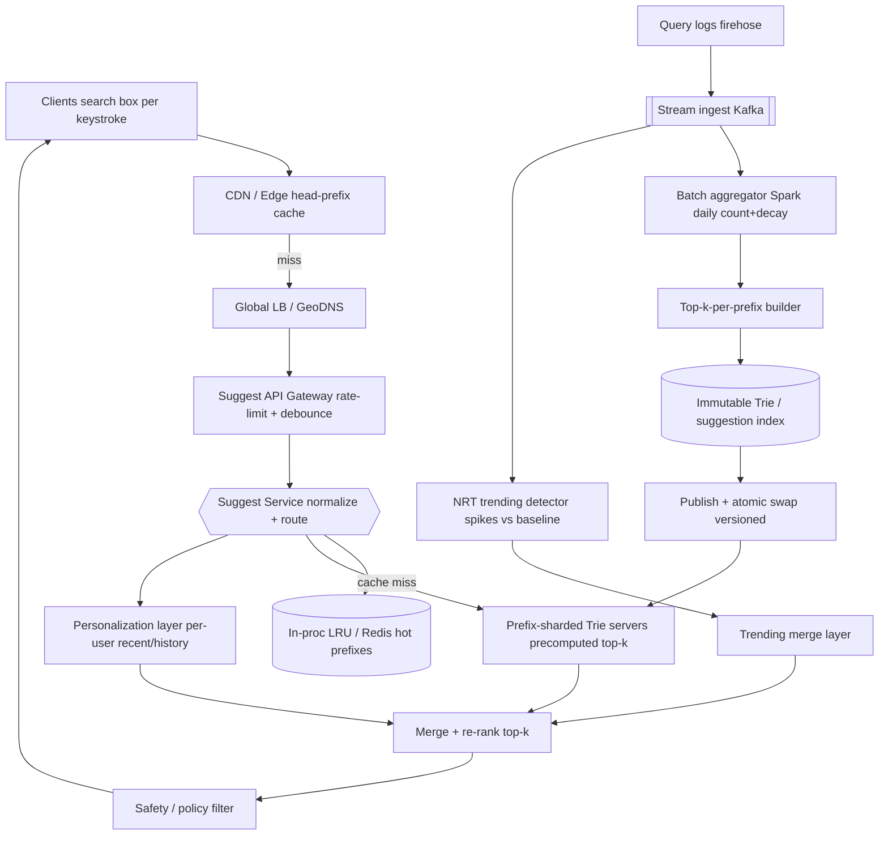

# A10 — Design autocomplete / typeahead at scale

This is the canonical search-adjacent Google prompt: as a user types each keystroke, return the top few completions for the current prefix in single-digit milliseconds, ranked by popularity and recency, tolerant of typos, and personalized. It tests the prefix-tree data structures (Trie / ternary search tree), top-k-per-prefix computation, precompute-and-cache strategy, prefix sharding, and the offline pipeline that turns a firehose of queries into ranked suggestions. Google asks it because autocomplete fronts every search box (Web, Maps, YouTube, Play) and a Staff engineer must own both the ultra-low-latency serving tier and the data pipeline that feeds it.

## 1) Clarify — questions to ask the interviewer

- **What are we completing?** Search queries, place names, product names, usernames, or general text? The *vocabulary size* and *update rate* differ enormously (a 100M-query head vs a bounded 10M-place gazetteer). I'll assume **web search queries** unless told otherwise.
- **Scale:** How many suggestion requests/sec at peak? Note that autocomplete QPS is **multiples of search QPS** — one search is ~5–10 keystrokes, each firing a request. I'll assume search is ~50K QPS → autocomplete ~200K–500K QPS.
- **Latency target:** This is the defining constraint. Suggestions must feel instant *as you type* — I'll target **p99 < 50 ms end-to-end**, ideally < 20 ms server-side, because anything slower lags behind the next keystroke.
- **How many suggestions and how ranked?** Top-k (usually k=5–10) per prefix. Ranked by what — raw popularity, time-decayed popularity, personalization, geo? I'll assume **popularity + recency + light personalization**.
- **Freshness of suggestions:** Must a trending query (breaking news) appear in minutes, or is daily rebuild acceptable? This forks the architecture (batch vs near-real-time merge). I'll assume **a daily batch baseline + an NRT layer for trending terms**.
- **Typo tolerance:** Should "teh wether" complete to "the weather"? Fuzzy matching is expensive at this latency — I'll clarify whether it's required or a stretch.
- **Personalization:** Per-user history blended in, or global only? Per-user changes caching and storage substantially.
- **Internationalization:** Multiple languages/scripts, prefix semantics for CJK (no spaces), right-to-left? Affects tokenization and the Trie's character model.
- **Privacy/safety:** Filter offensive, unsafe, or rare-and-identifying suggestions? (Google heavily filters autocomplete — a real requirement, not an afterthought.)

**What the interviewer is signaling:** Autocomplete looks trivial ("just a Trie") but the Staff-level depth is in the *system around the Trie*: how do you serve 500K QPS at p99 < 50 ms, how do you compute **top-k per prefix** without walking the whole subtree on every keystroke, how does the offline pipeline rank from raw logs, and how do you keep it fresh and *safe*. The questions that separate L6 from L5 are **precompute-vs-traverse** (precomputing top-k per node is the key insight), **freshness pipeline** (trending terms), and **safety filtering**. Raising those unprompted signals you've operated typeahead, not just coded a Trie.

## 2) Functional Requirements (FR)

**In scope:**
- Given a prefix (the text typed so far), return the **top-k completions** ranked by relevance.
- Update results on **every keystroke** with sub-50 ms latency.
- Ranking by **popularity + recency** (time-decayed), with light **personalization** (user/geo context).
- **Typo tolerance** (fuzzy prefix match) for near-miss prefixes.
- A **data pipeline** that aggregates query logs into ranked suggestions (the source of the rankings).
- **Freshness**: a path for trending/new terms to appear quickly, on top of a daily baseline.
- **Safety filtering**: suppress offensive, unsafe, or privacy-violating suggestions.

**Out of scope (defer):**
- Executing the actual search after a suggestion is picked (separate search system — see A11).
- Spell-correction of the *final* submitted query ("did you mean").
- Full per-user personalization model training (we consume features / a small personal index).
- Voice / handwriting input (separate front-ends; we take text prefixes).
- The query-log collection infrastructure itself (we consume an aggregated stream).

## 3) Non-Functional Requirements (NFR)

| Dimension | Target & rationale |
|---|---|
| Scale | Autocomplete QPS = multiple of search QPS. ~200K–500K req/sec peak (each search ≈ 5–10 keystroke requests). Vocabulary: ~100M+ distinct queries (heavy long tail). |
| p99 latency | **< 50 ms end-to-end**, < 20 ms server-side. This is the product requirement — suggestions must keep up with typing. |
| Availability | 99.99% for the serving path. Degrading gracefully (return fewer/stale suggestions) beats erroring. |
| Consistency | **Eventual.** Suggestion rankings are derived from logs and refreshed periodically; a few minutes' staleness is invisible to users. |
| Durability | Source query logs durable (11 nines). The Trie/suggestion index is a *derived, rebuildable* artifact. |
| Freshness | Baseline rankings rebuilt daily; trending terms surfaced within minutes via an NRT merge layer. |
| Read/write mix | Extremely read-heavy at serve time; the "write" is the periodic offline rebuild, not per-request. |
| Safety | Offensive/unsafe/PII suggestions filtered before they can ever be served. A hard requirement. |

## 4) Back-of-envelope estimation

```
QPS
  Search QPS (assume):        50,000 /sec
  Keystrokes per search:      ~5-10  -> autocomplete fires per keystroke
  Autocomplete QPS:           ~300,000 /sec  (size for ~500K peak)

Vocabulary / index size
  Distinct queries to index:  ~100e6  (cut the ultra-rare long tail)
  Avg query length:           ~20 chars
  Raw query text:             100e6 * 20 B ~ 2 GB
  Trie nodes: shared prefixes compress, but with top-k cached per node:
     ~ tens of millions of nodes, each storing k=10 (query_id, score)
     10 * (8B id + 4B score) = 120 B per node
     ~50e6 nodes * 120 B ~ 6 GB precomputed top-k payload
  Whole serving index fits in RAM on a sharded fleet -> latency win

Cache
  Head prefixes are wildly skewed (1-3 char prefixes dominate traffic):
  Cache top ~1e6 prefixes -> ~1e6 * (k=10 * ~50B suggestion) ~ 500 MB
  Edge/CDN + in-process LRU absorb the bulk of QPS

Latency budget (server-side ~20 ms)
  Network in/out:    ~5 ms
  Cache lookup:      ~1 ms (hot path: most requests stop here)
  Trie/shard lookup: ~2-5 ms on miss
  Rank/merge top-k:  ~2 ms (precomputed -> mostly just merge personal layer)

Offline pipeline
  Daily query volume: 50K QPS * 86,400 ~ 4.3e9 queries/day
  Aggregate (count + decay) by query string -> top-k per prefix
  MapReduce/Spark over ~4e9 rows -> rebuild Trie -> ship to serving fleet

Bandwidth (serving)
  300K QPS * ~1 KB response (10 suggestions) ~ 300 MB/s egress
```

## 5) API design

```
# Serving (called on every keystroke)
GET /v1/suggest?q=<prefix>&k=10&lang=en&ctx=<geo|session>
  -> { suggestions: [ {text, score, type: "query|trending|personal"} ],
       prefix, latency_ms }
  # k defaults to 10; ctx carries geo + opaque session for personalization

# Feedback signal (fire-and-forget; feeds ranking)
POST /v1/suggest/select
  body: { prefix, chosen_text, position, session }   # which suggestion was picked
  -> 202 Accepted

# Offline / control plane (pipeline -> serving)
POST /v1/index:publish
  body: { trie_version, shard_manifest[], built_at }   # atomic swap to new index
  -> { activated_version }

GET  /v1/suggest/stats
  -> { qps, cache_hit_rate, p99_ms, trie_version, freshness_lag_min }
```

## 6) Architecture — request & data flow

### (a) ASCII layered diagram

```
                      Clients (search box — fires per keystroke)
                                     |
                                     v
                       [ CDN / Edge cache ]        cache top suggestions for HEAD prefixes
                                     |  miss (debounced keystrokes only reach here)
                                     v
                       [ Global LB / GeoDNS ]      anycast, nearest region, health-checked
                                     |
                                     v
                       [ Suggest API Gateway ]     rate-limit, lang/geo routing, debounce hints
                                     |
                                     v
                  +========= Suggest Service (stateless) =========+
                  |  1. normalize prefix   2. check local cache    |
                  |  3. route to prefix shard  4. merge layers      |
                  |  5. apply safety filter  6. return top-k        |
                  +================================================+
                     |               |                      |
                     v               v                      v
            [ In-proc LRU /    [ Prefix-sharded         [ Personalization
              Redis cache ]      Trie servers ]           layer (per-user) ]
              hot prefixes       sharded by prefix         small personal Trie /
              top-k cached       (e.g. first 1-2 chars)    recent-history KV
                     | miss            |                          |
                     +--------+--------+--------------------------+
                              v
                   [ Merge + re-rank top-k ]   global popularity  + recency
                              |                + personal boost   + trending boost
                              v
                   [ Safety / policy filter ]  drop offensive / unsafe / PII
                              |
                              v
                       top-k suggestions -> client


OFFLINE  RANKING  PIPELINE  (builds the Trie that the serving tier loads)
  Query logs (firehose) --> [ Stream ingest (Kafka) ]
                                     |
                +--------------------+----------------------+
                v                                           v
       [ Batch aggregator ]                       [ NRT trending detector ]
       (Spark/MapReduce, daily)                   (streaming, minutes)
       count + time-decay by query                spikes vs baseline -> trending set
                |                                           |
                v                                           v
       [ Top-k-per-prefix builder ]               [ Trending merge layer ]
       walk aggregated queries ->                 inject hot terms into
       precompute top-k at each Trie node         serving without full rebuild
                |                                           |
                v                                           |
       [ Immutable Trie / suggestion index ] <-------------+
                |
                v
       [ Publish + atomic swap ] --> prefix-sharded Trie servers (versioned, hot-reload)
```

**Read path (per keystroke, latency-critical):** The client debounces keystrokes and hits the **CDN**; for the wildly popular 1–3 character head prefixes, the answer returns straight from the edge. On miss, GeoDNS routes to the nearest region, the gateway rate-limits, and the **Suggest Service** normalizes the prefix and checks its **in-process / Redis cache**. On a cache miss it routes to the **prefix shard** owning that prefix, reads the node's **precomputed top-k** (no subtree walk — that's the whole trick), merges in the **personalization layer** (the user's recent/history suggestions) and any **trending** terms, applies the **safety filter**, and returns. The hot path (cache hit) is ~1 ms; even the miss path is a single shard lookup of a precomputed list plus a light merge.

**Write / pipeline path (offline + NRT, decoupled):** Query logs stream into Kafka. A **daily batch aggregator** (Spark) counts and time-decays each query, then the **top-k builder** computes, for every Trie node (prefix), the k best completions in its subtree and stores them *at that node* — so serving never traverses. The immutable Trie is **published and atomically swapped** onto the versioned prefix-shard servers. In parallel, an **NRT trending detector** watches the stream for query spikes versus baseline and injects hot terms into a lightweight **trending merge layer** the serving tier overlays — so breaking-news queries appear in minutes without waiting for the daily rebuild.

### (b) Mermaid flowchart



## 7) Data model & storage choices

- **Serving index — Trie with precomputed top-k per node:** the core structure. A prefix tree where **each node stores the top-k completions of its subtree** (`node -> [(query_id, score)] × k`), not just child pointers. Justification: the naive Trie requires a subtree DFS on every keystroke to find the best completions — fatal at p99 < 20 ms. Precomputing top-k *at* each node turns every lookup into "walk to the prefix node, read its cached list" — O(prefix length), no traversal. This is the single most important design decision. Stored **in RAM** (the whole index is only single-digit GB) for latency.
- **Ternary Search Tree (alternative to array-Trie):** for large/sparse alphabets (Unicode, CJK), a **TST** is more memory-efficient than a 256-way (or wider) array Trie — each node has lo/eq/hi pointers instead of a full child array. Worth raising as the right structure when the character set is large; for ASCII-heavy English a compressed (radix) Trie is fine.
- **Suggestion metadata:** `query_id -> {text, popularity, last_seen, language, safety_flags}` in a KV store, joined at build time. Keeps the in-RAM Trie payload small (IDs + scores) while the full text lives in a side table fetched only for the final top-k.
- **Personalization store:** a small **per-user** structure — recent queries / a tiny personal Trie — in a low-latency KV (Redis), keyed by user/session. Justification: must be merged in within the latency budget, so it's a tiny, user-local index, not a query against a giant store.
- **Query-log aggregation (offline):** raw logs in a columnar warehouse / blob store, aggregated by the batch job. This is the durable source of truth from which the Trie is rebuilt — the Trie itself is disposable.
- **Trending store:** a small, fast-updating KV of currently-hot terms with scores, refreshed by the NRT detector, overlaid at serve time.
- **Sharding:** the Trie is **sharded by prefix** (e.g., by the first 1–2 characters, or by a hash of a short prefix), so a given prefix's data lives on one shard. Hot head-prefix shards are replicated more heavily (see deep dive).

## 8) Deep dive

**Top-k-per-prefix: precompute vs traverse (the crux).** The defining problem is returning the best 10 completions for a prefix in milliseconds when that prefix's subtree might contain millions of queries. Traversing the subtree on each keystroke is O(subtree) — impossible. The fix is to **precompute and store the top-k at every node** during the offline build: process queries from most to least popular and, as you insert each into the Trie, push it into the bounded top-k heap of *every node along its path*. After the build, every node already knows its k best completions, so serving is just "navigate to the prefix node (O(len)) and read the list." The cost moves entirely offline and the memory cost is bounded (k entries × number of nodes ≈ a few GB). The tradeoff: the precomputed lists are only as fresh as the last build, which is exactly why we add the NRT trending overlay rather than rebuilding constantly.

**The freshness pipeline (batch baseline + NRT trending).** Rankings come from logs, so there are two clocks. The **batch clock** (daily Spark job) does the heavy lifting: aggregate ~4B queries/day, apply **time-decay** (a query popular last month but dead now should fall — exponential decay on counts), recompute top-k per node, and ship a new immutable Trie via atomic version swap. The **streaming clock** (NRT detector) handles the head of news: it watches the live query stream, compares short-window rates against the baseline, and flags **spikes** (a name nobody searched yesterday now trending) — injecting them into a small overlay the serving tier merges on top. This two-clock design gives both *stable, well-ranked* completions (batch) and *minutes-fresh trending* (stream) without the cost of continuously rebuilding a global Trie. The merge at serve time is a bounded k-way heap of (global top-k, trending boost, personal boost) — cheap.

**Typo tolerance.** Exact-prefix lookup is O(len); fuzzy is the expensive part. Three layered options, cheapest first: (1) **precompute common misspellings** offline (from logs: prefixes that were corrected to a popular query) and add them as alias entries pointing to the canonical completions — handles the head of typos with zero extra serve-time cost; (2) **edit-distance ≤ 1–2 expansion** at serve time only when the exact prefix yields too few results, generating neighbor prefixes and unioning their top-k — bounded and triggered rarely; (3) a **BK-tree / Levenshtein-automaton** index for the vocabulary as a fallback. I lead with (1) because it's free at serve time and covers most real typos, and reserve (2)/(3) for the tail.

## 9) Key tradeoffs

| Decision | Choice & rationale |
|---|---|
| CAP | **AP** for serving — favor availability and low latency; stale-by-minutes rankings are fine. The source logs are the durable CP store. |
| Consistency model | Eventual. Rankings refresh on the batch + NRT clocks; users never perceive the lag. |
| Precompute vs traverse | **Precompute top-k per node.** Pushes cost offline, makes serving a single read. The cost is build time + freshness lag (mitigated by NRT overlay). Traversing per keystroke is infeasible at p99 < 20 ms. |
| Partitioning | **Prefix-sharded.** A prefix's data is on one shard. Hot head-prefix shards are over-replicated; the long tail is spread evenly. |
| Trie vs TST | Compressed/radix Trie for ASCII; **ternary search tree** for large/sparse Unicode alphabets (memory-efficient). State both; pick by character set. |
| Caching | Multi-layer: CDN/edge for head prefixes, in-process + Redis LRU, OS — most QPS never reaches a Trie server. |
| Freshness: batch vs NRT | **Both.** Batch for stable, decayed rankings; NRT overlay for trending. Pure batch misses breaking news; pure streaming can't do heavy global ranking cheaply. |
| Personalization | A tiny **per-user** index merged at serve time, not a query into a giant store — keeps the latency budget. |
| Typo tolerance | Precomputed misspelling aliases (free at serve) + bounded edit-distance fallback only on sparse results. |

## 10) Bottlenecks & failure modes

- **Hot head-prefix shard:** 1–3 char prefixes ("a", "the", "f") take a hugely disproportionate share of QPS, overloading their shard. *Mitigation:* over-replicate hot-prefix shards; serve head prefixes almost entirely from CDN/edge + in-process cache so the shard barely sees them.
- **Thundering herd on index swap / cache flush:** publishing a new Trie version or a cold cache after deploy stampedes the shards. *Mitigation:* warm the cache before cutover; staggered/rolling version swap; serve-stale-while-revalidate.
- **Keystroke amplification:** an un-debounced client fires a request per character at machine speed, multiplying QPS. *Mitigation:* client-side debounce (e.g., 50–100 ms) + server rate-limit per session; the gateway can coalesce in-flight identical prefixes.
- **Stale / dead rankings:** without decay, last year's hits linger; without NRT, today's news is missing. *Mitigation:* time-decay in the batch job + NRT trending overlay (the two-clock design).
- **Unsafe suggestion served:** an offensive or PII-revealing completion leaks. *Mitigation:* safety filter applied at *build time* (drop from index) **and** at serve time (deny-list check) — defense in depth; never rely on the index alone.
- **Personalization latency blowout:** fetching/merging per-user data exceeds budget. *Mitigation:* keep the personal index tiny and user-local in Redis; time-box the merge and fall back to global-only if it's slow.
- **Long-tail prefix misses:** rare prefixes always miss cache and hit cold shard data. *Mitigation:* they're a small fraction of QPS by definition; ensure the index is RAM-resident so even a miss is a fast in-memory lookup.

## 11) Scale 10x / evolution

- **What breaks first:** the **hot head-prefix shards** and **QPS amplification**. At 3–5M autocomplete QPS, head prefixes overwhelm any single shard and edge-cache pressure spikes.
- **Fix 1 — push harder to the edge:** the head-prefix distribution is so skewed that caching the top few thousand prefixes at the CDN absorbs the majority of traffic; the serving fleet only handles the tail.
- **Fix 2 — replicate by heat, not uniformly:** replicate shards in proportion to prefix traffic (head prefixes 10–100× replicas, tail prefixes 1×), instead of uniform replication that wastes capacity on the cold tail.
- **Fix 3 — multi-region active-active:** the index is read-only and rebuilt centrally, so replicate it to every region; each region serves locally with its own caches — eliminates cross-region latency for a latency-defined product.
- **Vocabulary 10×:** the index grows; move colder branches of the Trie to a second tier or compress more aggressively (TST, succinct tries), keeping the hot head in RAM.
- **Personalization 10×:** per-user serving cost grows; precompute each active user's small personal completion set offline and cache it, rather than computing it per request.
- **Freshness 10×:** the NRT detector becomes the bottleneck for global trending; shard the streaming detector by language/region and merge trending sets hierarchically.

## 12) Interviewer probes & follow-ups

- **"How do you return top-k in milliseconds when the subtree is huge?"** Precompute the top-k *at every Trie node* during the offline build (push each query into the bounded heap of every node on its path). Serving becomes "navigate to the prefix node, read its cached list" — O(prefix length), no subtree traversal.
- **"Where does the ranking come from?"** An offline pipeline aggregates query logs with **time-decay** (popularity that fades), computes top-k per prefix, and ships an immutable Trie. A streaming detector overlays **trending** terms within minutes. Selection signals feed back to tune ranking.
- **"How do trending queries show up without a full rebuild?"** A near-real-time spike detector compares short-window query rates to the baseline and injects hot terms into a small overlay the serving tier merges on top of the precomputed lists — minutes-fresh, no global rebuild.
- **"How do you handle the hot 1-character prefixes?"** They're served almost entirely from CDN/edge + in-process cache, and their shards are heavily over-replicated. The skew is so extreme that edge caching absorbs most of it.
- **"How do you do typo tolerance at this latency?"** Precompute common-misspelling aliases offline (free at serve time), and only fall back to bounded edit-distance ≤1–2 prefix expansion when the exact prefix returns too few results.
- **"Trie vs ternary search tree?"** Compressed/radix Trie for ASCII; TST for large sparse Unicode alphabets (lo/eq/hi pointers save memory vs a wide child array). I'd pick by the character set and measure.
- **"How do you keep unsafe suggestions out?"** Filter at build time (drop from the index) *and* at serve time (policy deny-list) — defense in depth, because a single leaked offensive completion is a serious incident.
- **"How big is the index and where does it live?"** A few GB (100M queries, IDs + scores + k-lists) — small enough to keep entirely in RAM on each shard, which is *why* lookups are single-digit ms.

## 13) 60-minute flow cheat-sheet

| Time | Phase | What to do |
|---|---|---|
| 0–6 min | Clarify | Nail what's completed, scale (QPS = multiple of search), p99 < 50 ms, ranking signals, freshness, typo + safety. |
| 6–10 min | FR/NFR | In/out scope; NFR table; commit to AP / eventual + p99 < 50 ms + build-time safety filtering. |
| 10–16 min | Estimation | QPS amplification → vocabulary → Trie + top-k payload sizing → cache sizing → latency budget breakdown. |
| 16–22 min | API | suggest endpoint + selection feedback + index publish; call out k, geo/session ctx. |
| 22–38 min | Architecture | Draw layered diagram; **walk per-keystroke read path then offline pipeline**; emphasize precomputed top-k + two-clock freshness. |
| 38–50 min | Deep dive | Top-k-per-node precompute AND the batch+NRT freshness pipeline; cover typo tolerance. |
| 50–56 min | Tradeoffs + failures | Prefix sharding, precompute-vs-traverse, hot head-prefix, herd on swap, unsafe suggestion — each with a mitigation. |
| 56–60 min | Scale 10× | Edge-heavy caching + heat-proportional replication + multi-region; what breaks first and why. |
