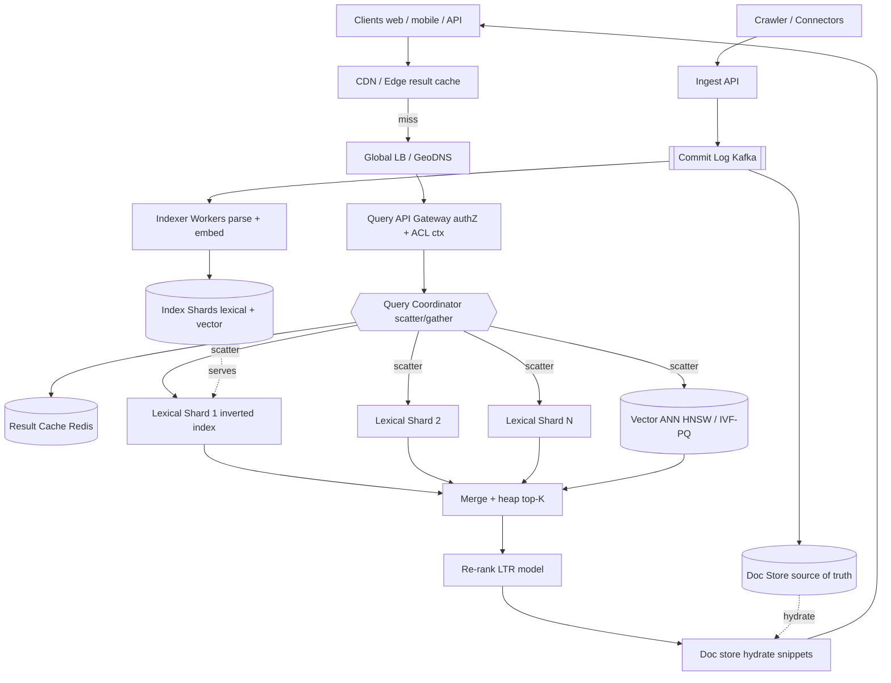

# A11 — Design a large-scale search / indexing system

This is the core Google prompt — the system that takes a crawled corpus and turns typed queries into ranked results under a strict tail-latency budget: crawl/ingest → build an inverted index → shard and replicate it → fan a query out across thousands of shards → rank the merged results → keep it fresh. It tests the inverted-index data structure, index sharding and replication, multi-stage ranking, the scatter/gather query path, a freshness pipeline, caching, and explicit p99 targets. Google asks it because *every* major product (Web, Drive, Photos, Code, Ads, Maps) is a search problem underneath, and a Staff engineer is expected to own the entire ingest-index-serve-rank loop end to end.

## 1) Clarify — questions to ask the interviewer

- **Corpus & scope:** Open web-scale, or a bounded corpus (enterprise Drive, a product catalog)? Roughly how many documents and what average size? This sets shard count, storage, and the whole cost model. I'll assume **web-scale, ~10B+ documents** unless told otherwise.
- **Query types:** Keyword/boolean only, or also phrase, fuzzy, faceted, and **semantic (vector) recall**? Hybrid retrieval reshapes the serving tier. I'll assume **lexical + semantic hybrid**.
- **Read/write mix:** Query QPS vs document ingest/update rate? Search is read-dominated (often ~1000:1), but a news/social corpus inverts the *freshness* pressure even if reads still dominate.
- **Latency target:** The p99 budget end-to-end is the defining constraint. I'll target **p99 ~200 ms** (retrieval ~50–80 ms, rank ~50 ms, fan-out/merge/network the rest) — the threshold where search feels instant.
- **Freshness SLA:** Must a new/updated doc be findable in seconds (news, email), minutes, or is hourly batch acceptable? This is the single biggest architectural fork.
- **Ranking sophistication:** Lexical relevance only, or full multi-stage ranking with a learned model (LTR) and personalization/engagement signals?
- **Consistency:** Is eventual consistency on the index acceptable (almost always yes for search), or are there compliance cases — right-to-be-forgotten, ACL revocation — that need bounded staleness?
- **Access control:** Is the corpus world-readable, or must results be filtered per-user by ACL at query time (Drive/email)? This adds a security dimension juniors miss.
- **Scale of results:** Top-10 with pagination, or deep result sets / export? Top-K-with-pagination is the norm and the fan-out trick depends on it.

**What the interviewer is signaling:** Search has no single "correct" architecture — it's a chain of tradeoffs (freshness vs throughput, recall vs latency, ranking quality vs cost, document- vs term-partitioning). By asking these, you show you know the design *bifurcates* on freshness SLA and hybrid-vs-lexical, and that p99 is a budget you allocate, not a hope. The **freshness** and **ACL** questions in particular separate L6 from L5 — they're the ones juniors forget and that blow up in production. This is a Hard prompt; leading the scoping crisply is how you signal you can drive it.

## 2) Functional Requirements (FR)

**In scope:**
- Ingest documents from crawlers/connectors and build a queryable index.
- Full-text query: keyword, phrase, boolean, with relevance ranking.
- **Hybrid retrieval**: lexical (inverted index) + semantic (vector ANN), merged.
- Top-K retrieval with pagination.
- **Incremental / near-real-time indexing** of new and updated docs; deletes via tombstones.
- **Multi-stage ranking**: cheap retrieval → expensive re-rank.
- Per-user **ACL filtering** (if the corpus is access-controlled).
- Index **sharding + replication** for scale, throughput, and availability.

**Out of scope (defer):**
- The crawler's politeness/scheduling internals (we consume its output — see A09).
- Query autocomplete and "did you mean" (separate services — see A10).
- Ads blending and monetization.
- Cross-lingual query translation.
- Full personalization model *training* (we consume features at serve time).

## 3) Non-Functional Requirements (NFR)

| Dimension | Target & rationale |
|---|---|
| Scale | ~10B docs; ~50K query QPS peak; ~10K doc-update QPS. Read-heavy (~1000:1 reads:writes). |
| p99 latency | **~200 ms** end-to-end query. Budget: retrieval 50–80 ms, rank ~50 ms, fan-out merge + network the remainder. |
| Availability | 99.99% for the query (serving) path. Indexing tolerates brief outages — the commit log absorbs the backlog. |
| Consistency | **Eventual** on the index — a doc becomes searchable seconds-to-minutes after ingest. Query reads are best-effort consistent across replicas. |
| Durability | 11 nines on the source-of-truth document store + commit log. The index is a *derived*, always-rebuildable artifact. |
| Freshness | New doc searchable in < 10 s on the NRT path; bulk re-index hourly. |
| Security | ACL filtering at query time; index encrypted at rest; per-tenant isolation. |
| Throughput | Sustain 50K QPS with each query fanning out to all lexical shards (millions of shard-RPCs/sec) — cache and per-shard top-k keep it tractable. |

## 4) Back-of-envelope estimation

```
Corpus & index size
  Documents:                 10e9 docs
  Avg doc text:              ~10 KB  -> raw text ~ 100 TB
  Inverted index (postings): ~30-40% of text  -> ~30-40 TB
  Vector index: 10e9 * 768 dims * 1 byte (PQ/int8) ~ 7.7 TB
                (full fp32 would be ~30 TB -> we quantize)

Sharding
  Target ~50 GB postings per shard -> ~700 lexical shards
  Replicate x3 (availability + read throughput + hedging) -> ~2,100 index servers
  Vector ANN (HNSW) is RAM-hungry: 7.7 TB / ~64 GB usable per node
                              -> ~120 vector shards x3 -> ~360 vector servers

Query QPS / fan-out
  Peak read:                 50,000 QPS
  Each query fans out to ALL ~700 lexical shards
                              -> 50K * 700 = 35M shard-RPCs/sec
  Per shard replica:         35M / 2,100 ~ 16.7K shard-queries/sec  (heavily cacheable)

Write / ingest QPS
  10,000 doc updates/sec -> commit log append + segment build
  Segment flush every few seconds; background merges compact small segments

Cache
  Result cache (query -> top-K): assume ~20% repeats in a 5-min window
  Cache top ~1e6 query results * ~5 KB ~ 5 GB  (Redis cluster)
  Per-shard OS page cache holds hot postings in RAM

Bandwidth (serving)
  50K QPS * ~10 KB response (10 results + snippets) ~ 500 MB/s egress

Latency budget (p99 ~200 ms)
  Network + gateway:         ~20 ms
  Scatter -> tail shard:     ~60-80 ms  (governed by SLOWEST shard, not avg)
  Merge top-K:               ~10 ms
  LTR re-rank (top ~100):    ~50 ms
  Hydrate snippets:          ~20 ms
```

## 5) API design

```
# Query
POST /v1/search
  body: {
    q: "query string",
    filters: { lang: "en", after: "2026-01-01" },
    top_k: 10,
    page_token: "<opaque>",
    mode: "hybrid" | "lexical" | "semantic",
    user_ctx: { uid, acl_groups[] }     # for ACL filtering + personalization
  }
  -> { results: [ {doc_id, score, title, snippet, highlights[]} ],
       next_page_token, total_estimate, latency_ms }

# Ingest (internal, from connectors/crawler)
POST /v1/documents:batchUpsert
  body: { docs: [ {doc_id, content, metadata, acl[]} ] }
  -> { accepted, indexing_offset }       # offset = position in commit log

DELETE /v1/documents/{doc_id}            # writes a tombstone

# Ops
GET /v1/index/health                     # per-shard freshness lag, segment count, p99
```

## 6) Architecture — request & data flow

### (a) ASCII layered diagram

```
                     Clients (web / mobile / API)
                                  |
                                  v
                          [ CDN / Edge ]          cache popular {query -> results}, static assets
                                  |  miss
                                  v
                      [ Global LB / GeoDNS ]       anycast, health-checked, route to nearest region
                                  |
                                  v
                      [ Query API Gateway ]        authN/Z, rate-limit, parse, attach ACL context
                                  |
                                  v
          +============ Query Coordinator (root) ============+   <-- the scatter/gather brain
          |  1. parse/normalize  2. plan   3. fan-out         |
          |  4. merge top-K      5. re-rank  6. hydrate        |
          +==================================================+
                 |   (sync scatter)              |  (sync)
       +---------+----------+                     v
       v         v          v            [ Result Cache (Redis) ]  query -> topK, 5-min TTL
 [Lexical    [Lexical   [Lexical               | miss -> compute
  Shard 1]    Shard 2].. Shard N]
  (inverted   each: postings walk +       [ Vector ANN shards (HNSW / IVF-PQ) ]
   index)     BM25 + per-shard top-k      semantic recall -> doc_ids + similarity
       \         |         /                     |
        \        v        /                      v
         \ [ per-shard top-k ]            [ candidate union ]
          \________ \ _____/                     |
                     v                           v
            [ Merge + heap top-K ] <----- combine lexical + vector candidates
                     |
                     v
            [ Re-rank service (LTR model) ]  features: BM25, sim, freshness, clicks
                     |
                     v
            [ Doc store hydrate ]  fetch title / snippet / highlight by doc_id
                     |
                     v
                 results -> client


WRITE / INDEXING PATH  (async, decoupled from serving)
  Crawler / Connectors --> [ Ingest API ] --> [ Commit Log (Kafka) ]   durable, ordered
                                                     |
                           +-------------------------+----------------------+
                           v                                                v
                 [ Doc Store (source of truth) ]               [ Indexer Workers ]
                 (sharded KV / blob)                           parse, tokenize, embed
                           |                                                |
                           | (used for hydrate + rebuild)     build inverted segments + vectors
                           v                                                v
                      replicas x3                            [ Index Shards (lexical + vector) ]
                                                             segment flush (NRT) + background merge
```

**Read path (sync, latency-critical):** The client hits the **CDN**; a popular `{query -> results}` may return straight from the edge. On miss, **GeoDNS** routes to the nearest region, the **gateway** authenticates and attaches the user's **ACL context**, and the request lands on a **Query Coordinator**. The coordinator checks the **Redis result cache**; on miss it **scatters** the query to all lexical shards in parallel and, in hybrid mode, simultaneously to the vector ANN shards. Each lexical shard walks its postings lists, scores with BM25, and returns only its **per-shard top-k** (not all matches — the key fan-out trick). The coordinator **gathers**, merges via a bounded heap, unions the vector candidates, runs the merged set through the **LTR re-ranker** (pulling features like freshness and click signals), hydrates the final top-10 with titles/snippets from the doc store, caches, and returns. Every fan-out call carries a hard deadline; a slow shard is bypassed via a **hedged request** to a replica.

**Write path (async, throughput-oriented):** Connectors push documents into the **Ingest API**, which appends to the durable, ordered **commit log (Kafka)** and writes the canonical copy to the **doc store**. **Indexer workers** consume the log, tokenize and embed each doc, and append to in-memory segments on the owning shard. Segments flush to disk every few seconds (the NRT path that makes a doc searchable in < 10 s) and are compacted by background merges. Because the index is a *derived* artifact rebuildable from the log + doc store, indexing can fall behind or crash without data loss — the queue absorbs the backlog.

### (b) Mermaid flowchart



## 7) Data model & storage choices

- **Inverted index (per lexical shard):** the core structure — `term -> postings list` of `(doc_id, term_freq, positions)`. Stored as immutable, compressed segments (**LSM-style**: append new segments, merge in background, never mutate in place). Justification: search is read-dominated with append-heavy writes; immutable segments give lock-free reads and let the OS page-cache hot postings. Positions enable phrase queries. This is exactly the Lucene model — it is the right primitive; don't reinvent it.
- **Vector index:** `doc_id -> embedding`, served by an ANN structure. **HNSW** when RAM allows (best recall/latency, memory-hungry); **IVF-PQ** when the corpus exceeds RAM (quantize to int8/PQ codes, trade a little recall for 4–8× memory savings). At 10B docs we quantize.
- **Document store (source of truth):** sharded KV or blob store keyed by `doc_id`, holding canonical text + metadata + ACL. Justification: needed for hydration (snippets) and to *rebuild the index* after corruption. Durability lives here, not in the index.
- **Commit log:** Kafka, partitioned by `doc_id` hash, retained long enough to replay a full re-index. The durability + ordering backbone.
- **Forward index / metadata (per shard):** `doc_id -> (length, freshness, static rank, ACL groups)`, co-located on each shard for fast scoring and ACL filtering without a network hop.

## 8) Deep dive

**Query fan-out, merge, and the latency budget (the crux).** A single query must touch every lexical shard because any shard can hold a matching doc. With N=700 shards, the coordinator issues 700 parallel RPCs and waits for the *slowest* — so the query's p99 is governed by the p99 of the **tail shard**, not the average. Three techniques tame this:

1. **Per-shard top-k truncation:** each shard returns only its local top-k (say k=100), not all matches. The coordinator merges 700×100 candidates into a global top-K with a heap. This bounds network and merge cost regardless of how many docs match the query.
2. **Hedged / backup requests:** if a shard hasn't responded by, say, the 95th-percentile latency, fire a duplicate to a replica and take whichever returns first. This is the single most effective tail-latency tool — it converts a slow replica from a p99 disaster into a non-event, at a few percent extra load.
3. **Deadline propagation:** the coordinator stamps a hard deadline; shards that can't finish return partial results rather than blowing the budget. Search degrades gracefully (slightly worse recall) instead of timing out.

At 700 shards, a single root coordinator fanning out to all of them is itself a bottleneck, which motivates the **two-level fan-out tree** (root → intermediate → leaf) in the scale section.

**Index sharding, replication, and freshness.** *Sharding* is **document-partitioned** — each shard is a self-contained mini-index over a subset of docs. This scales writes and storage and keeps each shard's postings independent; the cost is that every query fans out to all shards (the alternative, term-partitioning, removes fan-out but creates brutal hot-term skew — a shard owning "the" gets crushed — and hard cross-node multi-term postings joins, so we reject it). *Replication* is ×3 per shard for availability, read throughput, and to enable hedged requests; segments replicate asynchronously. *Freshness* is where the clarify fork lands: the NRT path keeps a small **in-memory segment** per shard that absorbs new docs and is queried *alongside* the on-disk segments — so a doc is searchable seconds after ingest, before it's ever flushed. **Deletes are tombstones** (a deleted-docs bitset) applied at query time and physically purged during the next merge; never an in-place delete in an immutable segment. The tension: frequent flushes give freshness but spawn many tiny segments that slow queries and trigger **merge storms** (I/O spikes that hurt query p99). The levers are the flush interval and a tiered merge policy with merge throttling, tuned so the freshness SLA is met without starving the read path.

## 9) Key tradeoffs

| Decision | Choice & rationale |
|---|---|
| CAP | **AP** for the serving index — favor availability and low latency; accept that a just-ingested doc may be briefly missing. The source-of-truth store is CP. |
| Consistency model | Eventual on the index; bounded staleness via a freshness-lag SLA (< 10 s NRT). |
| Partitioning | **Document-partitioned (shard by doc)** — each shard a self-contained mini-index. Scales writes/storage; cost is fan-out to all shards. Term-partitioning rejected (hot-term skew + cross-node joins). |
| Replication | ×3 per shard for availability + read throughput + hedged requests. Async segment replication. |
| Caching | Multi-layer: edge/CDN for popular queries, Redis result cache (5-min TTL), per-shard OS page cache for hot postings. |
| Sync vs async | Query path fully **sync** (latency-critical). Indexing fully **async** via Kafka (throughput, decoupling, spike absorption). |
| Lexical vs vector | **Hybrid.** Lexical for precision/exact-match + cheap recall; vector for semantic recall; merge then LTR re-rank. Pure-vector loses exact-match; pure-lexical loses synonyms. |
| Ranking | **Multi-stage** (cheap retrieval → bounded candidate set → expensive LTR on top ~100). Keeps cost and latency bounded vs ranking everything. |

## 10) Bottlenecks & failure modes

- **Tail-latency shard (the #1 risk):** one slow shard dominates p99 of the whole query. *Mitigation:* hedged requests to replicas + deadline-based partial results.
- **Hot term / hot query:** a viral query or a term like "the" creates a huge postings scan or stampedes one path. *Mitigation:* result cache absorbs repeats; stop-word handling and term-frequency caps; per-shard top-k bounds the scan.
- **Merge storm / segment explosion:** aggressive NRT flushing → many small segments → query slowdown + I/O spike. *Mitigation:* tiered merge policy, merge throttling, a separate I/O budget from the read path.
- **Thundering herd on cache expiry:** a popular query's cache entry expires and thousands of requests recompute simultaneously. *Mitigation:* request coalescing (single-flight) + jittered TTLs + serve-stale-while-revalidate.
- **Indexer backlog:** an ingest spike outpaces indexers; freshness lag grows. *Mitigation:* Kafka buffers; autoscale indexer workers on consumer lag; freshness is *degraded, not lost*.
- **Coordinator SPOF / fan-out limit:** *Mitigation:* coordinators are stateless and horizontally scaled behind the LB; at extreme shard counts, move to a two-level fan-out tree.
- **Whole-shard loss:** *Mitigation:* replicas serve; a lost replica is rebuilt from commit log + doc store (the index is derived, always rebuildable).
- **ACL leak via stale index:** a user who lost access still sees a doc the index hasn't updated. *Mitigation:* filter ACLs in the shard's forward index (early) **and** re-check against the source-of-truth ACL at hydrate (late).

## 11) Scale 10x / evolution

- **What breaks first:** **query fan-out.** At 7,000 shards, scattering to all of them per query makes the tail-latency problem (slowest of 7,000) and the RPC fan-out cost untenable.
- **Fix 1 — two-level fan-out:** a tree of coordinators (root → mid-tier → leaf shards) so each node fans out to a manageable degree (~tens), bounding the tail and the per-node RPC load.
- **Fix 2 — tiered serving / partial index:** keep a hot tier of high-static-rank docs that answers most queries from a fraction of the shards; fall through to the full tier only when the hot tier is insufficient. Most queries never touch the long tail.
- **Fix 3 — result-cache hit-rate:** at 10× QPS the cheapest win is pushing more traffic to the edge/result cache; even a 30% hit rate slashes shard load by 30%.
- **Storage 10×:** vectors dominate — move from HNSW to IVF-PQ aggressively, or to disk-backed ANN (DiskANN) to keep RAM bounded.
- **Ranking 10×:** re-ranking the merged set with a heavier model becomes the cost driver; cap candidate-set size and use a cheap first-pass model, the expensive model only on the top ~100.
- **Freshness 10×:** at higher ingest, merge pressure dominates; separate hot (frequently-updated) from cold shards so re-index churn is isolated.

## 12) Interviewer probes & follow-ups

- **"Why fan out to every shard — isn't that wasteful?"** Because the index is document-partitioned, any shard may hold a match, so we *must* ask all of them. Term-partitioning removes fan-out but introduces hot-term skew and expensive cross-node multi-term joins — a worse trade at scale. We mitigate fan-out cost with per-shard top-k and a tiered hot index.
- **"How do you hit p99 200 ms with a 700-way scatter?"** The 200 ms is governed by tail-shard p99, so I attack the tail directly: hedged backup requests, deadline propagation with partial results, and keeping hot postings in page cache. Merge and re-rank are bounded by capping candidate count, and at extreme scale a two-level fan-out tree bounds the tail.
- **"How fresh can a document be?"** Under 10 s on the NRT path via in-memory segments queried alongside on-disk segments — the doc is searchable before its first flush. Deletes apply immediately via a tombstone bitset.
- **"How do you rank?"** Multi-stage: cheap per-shard BM25 retrieval → merge → LTR model combining BM25, vector similarity, freshness, and click/engagement features → hydrate. Cheap-then-expensive keeps cost and latency bounded.
- **"How do you enforce ACLs without leaking?"** Each shard stores ACL groups in its forward index and filters during retrieval (early); the hydrate step re-checks against the source-of-truth ACL (late), so a stale index can never serve a doc the user lost access to.
- **"How do you evaluate ranking quality?"** Offline nDCG/MRR on judged query sets, plus online interleaving / A-B on click-through and dwell time. Never ship a ranker on offline metrics alone.
- **"What if the embedding model changes?"** Re-embed is a full re-index of the vector tier — replay the commit log through new embedders into a shadow index, then flip. The lexical index is untouched.
- **"Document- vs term-partitioning — defend your choice."** Document-partitioning: self-contained shards, scales writes/storage, simple to replicate; cost is fan-out. Term-partitioning: no fan-out but hot-term skew and cross-node postings intersection for multi-term queries. At web scale, doc-partitioning + fan-out mitigations wins.

## 13) 60-minute flow cheat-sheet

| Time | Phase | What to do |
|---|---|---|
| 0–6 min | Clarify | Nail freshness SLA, hybrid-vs-lexical, scale, ACLs, p99 target. State the read-heavy ratio. |
| 6–10 min | FR/NFR | List in/out scope; put up the NFR table; commit to ~200 ms p99 + eventual consistency. |
| 10–16 min | Estimation | Corpus → index size → shard count → fan-out RPC math → cache sizing → latency budget. |
| 16–22 min | API | Search + ingest endpoints; call out ACL context + page tokens. |
| 22–38 min | Architecture | Draw the layered diagram; **walk read path then write path**; emphasize scatter/gather + commit log. |
| 38–50 min | Deep dive | Fan-out tail latency (hedging/deadlines) AND sharding/replication/freshness (NRT segments, tombstones, merge). |
| 50–56 min | Tradeoffs + failures | Doc- vs term-partition, hot keys, merge storm, thundering herd, ACL leak — each with a mitigation. |
| 56–60 min | Scale 10× | Two-level fan-out + tiered hot index; what breaks first and why. |
