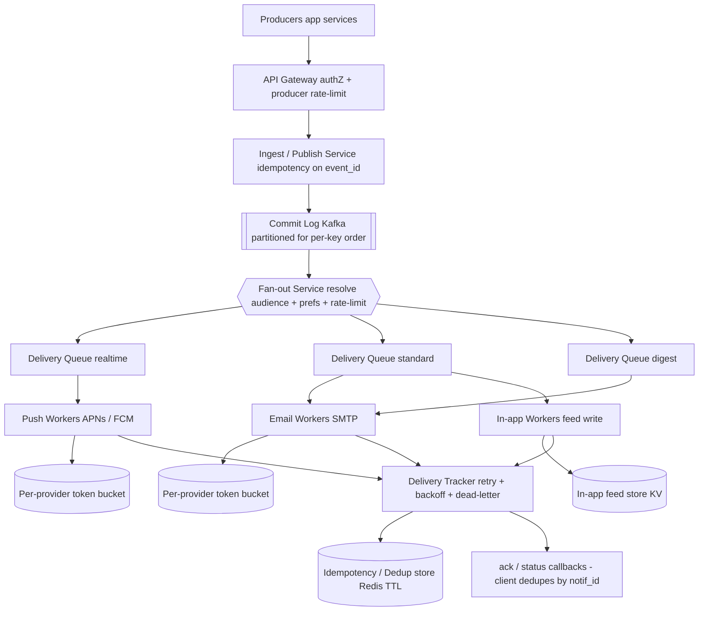

# A12 — Design a notification / pub-sub system

This is the canonical fan-out prompt: a single triggering event (a comment, a price drop, a system alert) must reach the right recipients across multiple channels — push, email, SMS, in-app — reliably, without duplicates, and at scale. It tests the pub-sub fan-out model, multi-channel delivery, deduplication, delivery guarantees (at-least-once plus idempotency), backpressure, retries, ordering, and rate limiting. Google asks it because notifications underpin nearly every product (Gmail, Chat, Calendar, alerts, Search updates), and a Staff engineer must reason about delivery semantics — the gap between "we sent it" and "the user got it exactly once" — not just wire up a queue.

## 1) Clarify — questions to ask the interviewer

- **What triggers a notification, and what's the fan-out shape?** A 1:1 (you got a DM), a 1:few (a comment on your doc), or a 1:millions (a celebrity posts, a global system alert)? The fan-out *fan width* is the central scaling variable — I'll assume we must handle **both narrow and very wide fan-out**.
- **Which channels?** Mobile push (APNs/FCM), email, SMS, in-app/web — each has different latency, cost, deliverability, and provider semantics. I'll assume **push + email + in-app** as the core, with the design extensible to more.
- **Scale:** Events/sec and resulting notifications/sec at peak? Fan-out means notifications ≫ events. I'll assume **~100K events/sec → up to millions of notifications/sec** on wide fan-out.
- **Delivery guarantee:** At-most-once (fire and forget), **at-least-once** (retry until acked, dedupe on the client), or exactly-once (usually impractical end-to-end)? I'll assume **at-least-once + idempotency keys** = effectively-once for the user.
- **Latency target:** Is this real-time (chat message in < 1 s), near-real-time (seconds), or batchable (a daily digest)? Different classes coexist — I'll support a **priority tiering**.
- **Ordering:** Must notifications for a given user/conversation arrive in order, or is per-notification independence fine? Strict global ordering is expensive; **per-key (per-user/conversation) ordering** is the usual ask.
- **User preferences & rate limiting:** Do users control channels, quiet hours, frequency caps? Must we suppress notification floods (don't send 500 emails for 500 likes)? Preference + rate limiting is a hard requirement, not a nicety.
- **Idempotency / dedup window:** If a producer retries an event, or two services emit the "same" notification, how do we suppress the duplicate? Over what window?
- **Compliance:** Unsubscribe/opt-out (legal for email/SMS), do-not-disturb, regional rules (GDPR)? These constrain delivery.

**What the interviewer is signaling:** A notification system looks like "publish to a queue, workers send," but the Staff-level depth is in **delivery semantics** and **fan-out at the tail**. The questions that separate L6 from L5 are: **delivery guarantee** (naming at-least-once + idempotency rather than hand-waving "reliable"), **wide-fan-out backpressure** (a celebrity event must not drown narrow-fan-out users), and **dedup + rate limiting** (the difference between a useful product and a spam cannon). Raising delivery semantics and fan-out skew unprompted signals you've operated a notification platform, not just sketched one.

## 2) Functional Requirements (FR)

**In scope:**
- **Publish** an event and **fan it out** to all subscribed/relevant recipients (pub-sub).
- **Multi-channel delivery**: push (APNs/FCM), email, SMS, in-app/web.
- **Delivery guarantees**: at-least-once with **idempotency** so the user effectively sees each notification once.
- **Deduplication** of duplicate events/notifications within a window.
- **User preferences**: per-channel opt-in/out, quiet hours, frequency caps.
- **Rate limiting**: suppress floods (batch "500 likes" into one), per-user/per-channel caps.
- **Retries** with backoff for transient channel failures; dead-letter for permanent ones.
- **Backpressure** so a huge fan-out (celebrity/broadcast) doesn't overwhelm the system or starve other traffic.
- **Ordering**: per-key (per-user/conversation) ordering where required.

**Out of scope (defer):**
- The application logic that *decides* an event is notification-worthy (we receive the event).
- Building the actual push/email/SMS transport (we integrate APNs/FCM/SMTP/SMS providers as adapters).
- Notification *content* generation / templating internals (we take a rendered or templated payload).
- Full analytics on engagement (open/click) beyond the delivery-tracking we need for retries.
- In-app feed *storage/ranking* (we deliver to it; its ranking is a separate system).

## 3) Non-Functional Requirements (NFR)

| Dimension | Target & rationale |
|---|---|
| Scale | ~100K events/sec; fan-out to **millions of notifications/sec** peak. Subscriber lists up to tens of millions for broadcast. |
| Latency | Tiered: real-time (chat) < 1 s p99; standard < 5 s; digest/batch minutes-to-hours. Priority lanes keep urgent traffic ahead of bulk. |
| Availability | 99.99% for ingest + delivery pipeline. A channel-provider outage degrades *that channel*, not the system. |
| Delivery guarantee | **At-least-once + idempotency key** → effectively-once for the user. The durable log makes "lost" notifications impossible; dedupe makes duplicates invisible. |
| Consistency | **Eventual.** A notification arriving a few seconds late is fine; we never block ingest for global consistency. |
| Durability | 11 nines on the ingest commit log + the dedup/idempotency store. Once accepted, a notification is never silently dropped. |
| Ordering | Per-key (per-user/conversation) ordering; no global total order (too expensive, rarely needed). |
| Rate/abuse | Per-user + per-channel frequency caps; flood collapse (batch). Hard requirement to avoid spamming users and tripping provider abuse limits. |

## 4) Back-of-envelope estimation

```
Event & fan-out volume
  Events/sec (peak):          100,000 /sec
  Avg fan-out (most events narrow): ~10 recipients
                              -> ~1e6 notifications/sec baseline
  Wide fan-out (broadcast):   one event -> 10e6 recipients
                              -> a single such event = 10M deliveries to schedule
  Design target:              sustain a few million deliveries/sec, absorb spikes

Per-channel split (assume)
  Push:  60%  -> ~600K/sec
  In-app:30%  -> ~300K/sec
  Email: 10%  -> ~100K/sec  (provider rate-limited, batched)

Dedup / idempotency store
  Keep idempotency keys for a 24h window:
  1e6 notif/sec * 86,400 s ~ 8.6e10 keys/day  (too many to keep all)
  -> keep per-(user,event) dedup keys with short TTL (minutes-hours)
     hot set sized to in-flight + recent: e.g. last 1h
     1e6/sec * 3,600 ~ 3.6e9 keys * ~32 B ~ 115 GB -> sharded Redis / KV w/ TTL
  -> for at-least-once delivery idempotency, the RECEIVER (device/client) also dedupes by id

Storage (in-app notification feed)
  Store per-user notifications: assume 100M active users * ~100 recent each * ~500 B
                              ~ 5 TB  (sharded KV, TTL'd / capped per user)

Queue / log throughput
  Commit log must absorb 100K events/sec + millions of fan-out deliveries/sec
  Kafka partitions sized so each handles tens of thousands msg/sec
  -> hundreds of partitions, keyed for per-user ordering

Bandwidth / provider limits
  Email/SMS providers cap send rate -> per-provider token-bucket throttles
  Push (APNs/FCM) batched; respect provider connection + rate limits
```

## 5) API design

```
# Publish (producers: app services emit events)
POST /v1/events:publish
  body: {
    event_id: "<producer-supplied, used for dedup>",   # idempotency at ingest
    type: "comment|price_drop|alert|...",
    audience: { user_ids:[...] } | { topic: "doc:123:subscribers" },
    payload: { title, body, data{} },
    priority: "realtime|standard|digest",
    channels: ["push","email","inapp"]   # or "auto" -> resolve from prefs
  }
  -> { accepted, event_offset }          # offset in the commit log

# Subscriptions / topics
POST   /v1/topics/{topic}/subscribe      body: { user_id, channels[] }
DELETE /v1/topics/{topic}/subscribe      body: { user_id }

# User preferences
PUT  /v1/users/{user_id}/preferences
  body: { channels:{push:true,email:false}, quiet_hours:{...}, freq_cap_per_hour:5 }

# In-app feed (client read)
GET  /v1/users/{user_id}/notifications?after=<token>&limit=50
POST /v1/users/{user_id}/notifications/{id}:ack   # client confirms receipt (dedupe + read-state)

# Delivery webhook (from channel providers, for status/retry)
POST /v1/delivery/callback   body: { notification_id, channel, status, provider_ref }
```

## 6) Architecture — request & data flow

### (a) ASCII layered diagram

```
                 Producers (app services emit events)
                                |
                                v
                       [ API Gateway ]            authN/Z, validate, rate-limit producers
                                |
                                v
                    [ Ingest / Publish Service ]  idempotency check on event_id (dedup at source)
                                |
                                v
                   [ Commit Log (Kafka) ]         durable, ordered, partitioned -> never lose an event
                                |
                                v
              +========= Fan-out Service =========+   the 1->N expansion brain
              |  resolve audience (topic -> subs) |
              |  load user prefs + channel routing|   <-- skip opted-out, apply quiet hours
              |  apply RATE LIMIT / flood collapse |
              |  emit per-recipient delivery tasks |
              +===================================+
                                |
                                v
                  [ Delivery Queues (per priority) ]   realtime | standard | digest lanes
                       |              |             |   (priority + per-channel sub-queues)
          +------------+      +-------+------+      +-----------+
          v                   v              v                  v
   [ Push Workers ]    [ Email Workers ] [ In-app Workers ] [ SMS Workers ]
   APNs / FCM          SMTP / provider   write to feed KV   SMS provider
          |                   |              |                  |
   per-provider         per-provider     [ In-app feed     per-provider
   token bucket         token bucket      store (KV) ]     token bucket
          |                   |              |                  |
          +---------+---------+--------------+------------------+
                    v
          [ Delivery Tracker ]  status, idempotency key check, retry w/ backoff,
                    |           dead-letter on permanent failure
                    v
          [ Idempotency / Dedup Store (Redis, TTL) ]  per (user,event,channel) -> "sent"
                    |
                    v
          ack / status callbacks <-- providers + clients  (client also dedupes by notif_id)
```

**Write/ingest path:** A producer calls **publish** with a producer-supplied `event_id`. The **ingest service** checks that `event_id` against the **idempotency store** — a retried publish is collapsed here (dedup at the source) — then appends the event to the durable, ordered **commit log (Kafka)**, partitioned so a given user/conversation's events land on the same partition (per-key ordering). Acceptance is acknowledged the instant the event is in the log; everything after is asynchronous, so ingest stays fast and lossless.

**Fan-out + delivery path:** The **Fan-out Service** consumes the log and performs the 1→N expansion: resolve the audience (for a topic, look up its subscriber list), load each recipient's **preferences** (skip opted-out channels, honor quiet hours), apply **rate limiting / flood collapse** (batch "500 likes" into one summary, enforce per-user frequency caps), and emit one **delivery task** per (recipient, channel) into **priority-tiered delivery queues** (realtime / standard / digest, with per-channel sub-queues). **Channel workers** (push, email, in-app, SMS) pull from their queues, each gated by a **per-provider token bucket** so we never exceed a provider's rate limit. Before sending, each worker checks the **idempotency/dedup store** for `(user, event, channel)`; after a successful send it records "sent." The **Delivery Tracker** watches provider callbacks, **retries with backoff** on transient failures, and **dead-letters** permanent ones. Because delivery is at-least-once, the *client also dedupes* by `notification_id` — so even a duplicate that slips through is invisible to the user.

### (b) Mermaid flowchart



## 7) Data model & storage choices

- **Commit log (Kafka):** the durable ingest backbone — `partition(user/conversation) -> ordered events`. Justification: gives durability (never lose an accepted event), ordering per key (partition), and natural backpressure (consumers lag instead of dropping). Partitioning by user/conversation id delivers per-key ordering without a global lock.
- **Idempotency / dedup store (Redis or sharded KV with TTL):** `key = hash(user, event_id, channel) -> "sent" + timestamp`, short TTL (minutes–hours). Justification: at-least-once retries and duplicate producers are inevitable; a fast TTL'd KV makes "have I already delivered this?" an O(1) check, turning at-least-once into effectively-once. Not durable long-term by design — the window only needs to cover the retry horizon.
- **Subscription / topic store (KV or SQL):** `topic -> [user_ids]` and `user -> [topics]`. For huge subscriber lists (broadcast), store the list in a scalable KV and stream it during fan-out rather than loading it all into memory.
- **User preferences (KV, low-latency):** `user -> {channel opt-ins, quiet_hours, freq_caps}` — read on every fan-out, so it must be fast; cache hot users.
- **In-app feed store (sharded KV, capped/TTL'd per user):** `user -> recent notifications`, write-on-deliver, read by the client feed. Capped per user (e.g., last N) so it doesn't grow unbounded.
- **Rate-limit state (Redis):** per-(user, channel) token buckets / counters with sliding windows for frequency caps and flood collapse; per-provider token buckets for outbound provider limits.
- **Dead-letter store:** failed-after-max-retries notifications, for inspection and manual replay.

## 8) Deep dive

**Delivery guarantees: at-least-once + idempotency = effectively-once (the crux).** True end-to-end exactly-once is generally impractical (the classic two-generals problem: the network between us and the device can drop the ack after delivery), so the right model is **at-least-once delivery plus idempotent processing**. The durable commit log guarantees we never *lose* an accepted notification — a worker crash just means the message is redelivered. To stop the resulting *duplicates*, every delivery is keyed by an **idempotency key** `(user, event_id, channel)`: the worker checks the dedup store before sending and records "sent" after, so a redelivered task is suppressed. Because that check-then-send isn't perfectly atomic across a crash, we add a second line of defense — the **client/device dedupes by `notification_id`** — so even a duplicate that slips past the server is invisible to the user. The net guarantee the user experiences is *effectively-once*, achieved without the cost and fragility of trying to make the whole pipeline transactional.

**Wide fan-out + backpressure (the scaling crux).** Fan-out width is wildly skewed: most events hit ~10 users, but a broadcast or celebrity event hits tens of millions — a single event can generate more delivery tasks than the entire baseline load. If handled naively, that one event monopolizes workers and starves everyone else (the *celebrity problem*). Defenses: (1) **decouple fan-out from delivery** via queues, so the expansion is just enqueuing tasks, not synchronous sends; (2) **chunk the subscriber list** — the fan-out service streams a 10M-subscriber list in batches rather than materializing it, and can parallelize across fan-out workers; (3) **priority lanes** — real-time narrow-fan-out traffic rides a separate queue from bulk broadcast, so a celebrity post can't delay your chat message; (4) **backpressure** — when delivery queues build up, the system slows fan-out consumption (Kafka lag) rather than dropping; the log absorbs the backlog and we catch up. (5) **fair scheduling** across events so one giant fan-out is interleaved with, not blocking, many small ones. This is exactly the "don't let one whale drown the minnows" reasoning that signals Staff.

**Rate limiting & flood collapse.** Two distinct concerns. *Outbound provider limits*: APNs/FCM/SMTP/SMS each cap send rate, so each channel worker pulls through a **per-provider token bucket** — exceeding it gets you throttled or abuse-flagged. *User-facing frequency caps / flood collapse*: 500 people liking your post should be **one** "500 people liked your post," not 500 notifications. The fan-out service maintains per-user, per-type counters in Redis with a short window; when a flood is detected it **coalesces** into a single summary notification and enforces a per-hour cap, deferring or dropping excess per user preference. This is the difference between a notification system users keep on and one they mute.

## 9) Key tradeoffs

| Decision | Choice & rationale |
|---|---|
| Delivery guarantee | **At-least-once + idempotency key** (effectively-once). Exactly-once end-to-end is impractical (ack can be lost post-delivery); dedupe at worker + client makes duplicates invisible. |
| CAP | **AP** — favor availability; a notification arriving seconds late or via a different replica is fine. Never block ingest for consistency. |
| Consistency | Eventual. The commit log gives durability + ordering; delivery is asynchronous. |
| Ordering | **Per-key (per-user/conversation)** via partitioned log. Global total order is rejected — too expensive, rarely needed. |
| Sync vs async | Ingest acks synchronously once in the log; **fan-out and delivery fully async** via queues — this is what enables backpressure and wide fan-out. |
| Fan-out: push vs pull | **Hybrid.** Push (write per-recipient delivery tasks) for normal fan-out; for celebrity/broadcast, lean toward **pull/fan-out-on-read** for the in-app feed (don't materialize 10M writes) while still pushing the urgent channels. |
| Dedup window | Short-TTL idempotency keys (retry horizon), *not* permanent — bounds storage; client dedup covers the long tail. |
| Rate limiting | Per-provider token buckets (outbound) **and** per-user frequency caps / flood collapse (user-facing) — two separate mechanisms. |

## 10) Bottlenecks & failure modes

- **Celebrity / broadcast fan-out (the #1 risk):** one event → tens of millions of deliveries starves all other traffic. *Mitigation:* decouple fan-out from delivery via queues, chunk the subscriber list, priority lanes, fair scheduling, and fan-out-on-read for the in-app feed of huge audiences.
- **Channel-provider outage / throttling:** APNs/FCM/SMTP goes down or rate-limits us. *Mitigation:* per-provider token buckets + retry with backoff; the affected channel degrades while others keep flowing; dead-letter and replay when the provider recovers.
- **Duplicate storm:** producer retries or a redelivered task spams the user. *Mitigation:* idempotency key at worker + `notification_id` dedup at client — effectively-once.
- **Thundering herd on retry:** many failed deliveries all retry at the same instant after an outage. *Mitigation:* exponential backoff + jitter; cap retry attempts → dead-letter.
- **Hot partition / hot user:** a very active user/conversation overloads one log partition. *Mitigation:* monitor partition lag; for extreme cases, sub-partition while preserving per-key ordering semantics where required.
- **Backpressure → unbounded queue growth:** delivery can't keep up; queues grow without bound. *Mitigation:* the durable log absorbs lag (bounded by retention); autoscale workers on queue depth; shed/defer *digest-tier* traffic first, never real-time.
- **Preference/rate-limit store latency:** read on every fan-out; if slow, fan-out stalls. *Mitigation:* cache hot users' prefs; fail-open to a safe default (respect global opt-outs, defer rather than spam).
- **Dead-letter black hole:** permanently-failed notifications pile up unnoticed. *Mitigation:* alert on dead-letter rate; periodic replay tooling; surface as an ops SLO.

## 11) Scale 10x / evolution

- **What breaks first:** the **fan-out stage under broadcast skew** and the **dedup store size**. At 1M events/sec with wide fan-out, materializing per-recipient tasks for every broadcast and keeping all idempotency keys becomes the bottleneck.
- **Fix 1 — fan-out-on-read for huge audiences:** for topics with millions of subscribers, *don't* write a per-user task to the feed; store the event once and have each user's feed query pull it on read (hybrid push/pull) — collapses 10M writes into 1, while urgent channels (push) still fan out.
- **Fix 2 — hierarchical / parallel fan-out:** a tree of fan-out workers that each expand a slice of a giant subscriber list, so no single worker owns a 10M expansion.
- **Fix 3 — shard the dedup store harder + shorten TTL:** scale the idempotency KV horizontally and tighten the window to just the retry horizon; lean more on client-side dedup for the long tail.
- **Multi-region active-active:** ingest and deliver from the region nearest the producer/recipient; replicate the commit log cross-region for durability; per-region delivery workers respect global per-user rate limits via a replicated counter.
- **Channel growth:** new channels (WhatsApp, web push) plug in as new worker pools + token buckets behind the same queues — the core stays unchanged because channels are adapters.
- **Cost 10×:** email/SMS dominate cost; push harder on batching/digest tiers and on collapsing floods, and route low-priority notifications to cheaper channels (in-app over SMS).

## 12) Interviewer probes & follow-ups

- **"Exactly-once or at-least-once?"** At-least-once + idempotency. Exactly-once end-to-end is impractical because the ack can be lost *after* the device received the notification (two-generals). I make it *effectively-once* with an idempotency key at the worker and `notification_id` dedup at the client.
- **"How do you handle a celebrity with 10M followers?"** Decouple fan-out from delivery via queues so expansion is just enqueuing; chunk/stream the subscriber list across parallel fan-out workers; use priority lanes so it can't starve real-time traffic; and use fan-out-on-read for the in-app feed so I don't do 10M writes — pull on read instead.
- **"How do you guarantee a notification isn't lost?"** The durable commit log: once the publish is acked, the event is in the log and survives any worker crash via redelivery. Delivery is retried with backoff until acked or dead-lettered; nothing is silently dropped.
- **"How do you stop sending 500 notifications for 500 likes?"** Flood collapse: per-user, per-type counters in a short window detect the flood and coalesce it into one summary ("500 people liked your post"), plus a per-hour frequency cap from user preferences.
- **"How do you respect APNs/email provider limits?"** Each channel worker pulls through a per-provider token bucket sized to the provider's rate limit; exceeding it just slows that channel (backpressure), never errors the system.
- **"How do you order notifications?"** Per-key ordering via the partitioned commit log — a user's/conversation's events share a partition, so they're processed in order. I deliberately avoid global total ordering (too expensive, rarely needed).
- **"What about user quiet hours / opt-outs?"** Read user preferences during fan-out: skip opted-out channels entirely, defer non-urgent notifications during quiet hours, and honor legal unsubscribe for email/SMS — fail-open to the *safer* (less-spammy) default if the preference store is slow.
- **"What happens when delivery falls behind?"** Backpressure: consumers lag on the durable log (bounded by retention) rather than dropping; autoscale workers on queue depth; shed digest-tier traffic first while protecting real-time. We catch up when load subsides.

## 13) 60-minute flow cheat-sheet

| Time | Phase | What to do |
|---|---|---|
| 0–6 min | Clarify | Nail fan-out shape (narrow vs broadcast), channels, delivery guarantee, latency tiers, ordering, rate limiting. |
| 6–10 min | FR/NFR | In/out scope; NFR table; commit to AP / eventual + at-least-once + idempotency + per-key ordering. |
| 10–16 min | Estimation | Events → fan-out → notifications/sec, per-channel split, dedup store sizing, feed storage, queue throughput. |
| 16–22 min | API | publish (with event_id idempotency) + subscriptions + preferences + feed read/ack + delivery callback. |
| 22–38 min | Architecture | Draw layered diagram; **walk ingest path then fan-out/delivery path**; emphasize commit log + priority queues + token buckets. |
| 38–50 min | Deep dive | At-least-once + idempotency (effectively-once) AND wide-fan-out backpressure; cover rate limiting / flood collapse. |
| 50–56 min | Tradeoffs + failures | Push-vs-pull fan-out, celebrity problem, provider outage, duplicate storm, retry herd — each with a mitigation. |
| 56–60 min | Scale 10× | Fan-out-on-read + hierarchical fan-out + multi-region; what breaks first and why. |
