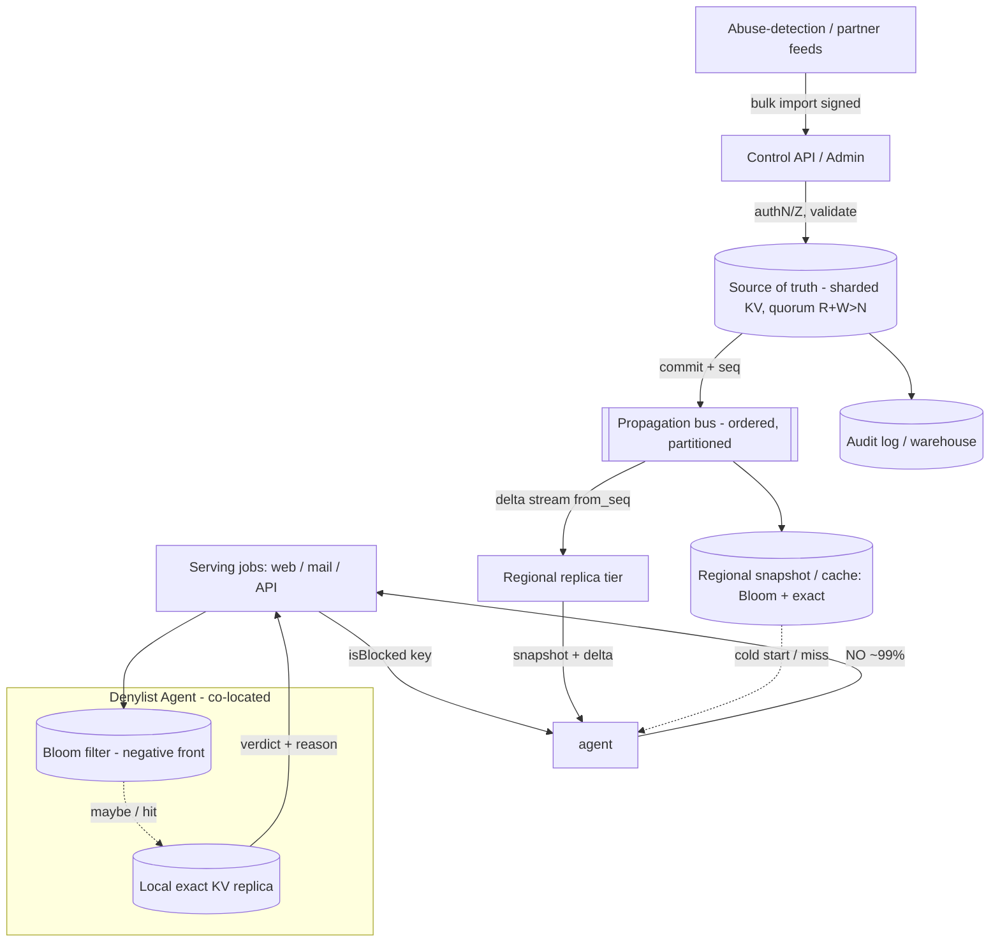

# A13 — Design a distributed denylist / blocking system

A denylist answers one question billions of times a day: **"is this entity (URL, IP, user-id, hash, token) blocked?"** It is a read-dominated, latency-critical lookup with a long-tail correctness requirement — a freshly added malicious entry must propagate globally in seconds, yet a stale "allow" for a known-bad entity is a security incident. Google asks this because it forces you to reason about the **read/write asymmetry**, probabilistic data structures (Bloom filters) as a first-class front layer, and the **consistency-vs-availability** call when a region is partitioned: do you fail open or fail closed?

## 1) Clarify — questions to ask the interviewer

- **What is being blocked, and what is the key?** Phishing/malware URLs, spam sender IPs, abusive account-ids, leaked-credential hashes, or revoked auth tokens? The key shape (short int vs long URL vs 32-byte hash) drives storage and the Bloom-filter sizing.
- **Who reads it, and where from?** Is the lookup on the serving hot path (every web request / every email / every API call) inside our own data centers, or an external API for partners? In-DC means we can colocate a replica; external means edge + auth + rate-limit.
- **Read/write mix and absolute scale?** I'll assume **~10M QPS reads, ~1–10K writes/sec** (additions + a smaller stream of removals/expirations). Reads dominate by ~1000:1 — that asymmetry is the whole design.
- **Propagation SLO for a new entry?** "Newly blocked must be enforced everywhere within **N seconds**." Is N = 1s (security-grade), 10s, or 5min? This sets whether we push via a fan-out bus or rely on short-TTL polling.
- **Latency budget for a lookup?** I'll target **p99 < 1–2 ms** for an in-memory/Bloom answer, because we sit inline on a request that itself has a tight budget.
- **Consistency requirement on each direction?** Adding a block is safety-critical → must be **durable + fast-propagating**. Removing a block (un-blocking) is usually less urgent and can lag. Asymmetric consistency is a real lever.
- **False-positive tolerance?** With a Bloom front, some allowed entities will be flagged. Is a false "blocked" acceptable if we then do a confirming exact lookup, or is even a transient false-block unacceptable (then Bloom is only a negative-cache)?
- **Failure posture — fail open or fail closed?** If the denylist backend is unreachable, do we *allow* traffic (availability-first, e.g. ad serving) or *deny* it (safety-first, e.g. malware gating)? This is the single most important product question.
- **Entry lifecycle?** TTL-based auto-expiry, manual revocation, audit trail / who-added-what for compliance?

**What the interviewer is signaling:** they want to see that you recognize this as a *read-path* problem first (Bloom filter + local replicas), a *propagation* problem second (push bus vs pull), and a *CAP* problem third (fail-open vs fail-closed under partition). Candidates who jump straight to "a Redis cluster" miss that the crux is the 1000:1 read skew and the false-positive tradeoff. Naming the fail-open/fail-closed decision *unprompted* is a strong Staff signal.

## 2) Functional Requirements (FR)

**In scope**

- `isBlocked(key)` — sub-millisecond membership test on the serving path, globally available.
- `block(key, reason, ttl)` — add an entry; must propagate to all regions within the SLO and be durable.
- `unblock(key)` — remove an entry (tombstone), eventually consistent is acceptable.
- TTL / auto-expiry of entries; bulk import (e.g. a feed of 10M known-bad hashes).
- Multi-region, low-latency reads with local replicas.
- Audit log of mutations (who/what/when/why) for review and rollback.

**Out of scope (defer)**

- *Deciding* what should be blocked (the abuse-detection / ML classifier that feeds us) — we are the enforcement substrate, not the policy engine.
- Per-user allow-list overrides / complex policy evaluation (a separate policy service composes on top).
- Rich querying / analytics over the denylist (offline warehouse job).
- Appeals workflow / human review UI.

## 3) Non-Functional Requirements (NFR)

| Dimension | Target & rationale |
|---|---|
| Scale | ~10M read QPS global; 1–10K writes/sec; denylist of 10^8–10^9 entries. |
| Read latency | **p99 < 1–2 ms** — lookup is inline on a hot request; mostly answered from in-process Bloom + local cache, zero cross-region hops on the happy path. |
| Propagation latency | New `block` enforced in **all regions ≤ N s** (target N = 1–5 s) via push bus; falling back to short-TTL pull. |
| Availability (reads) | **99.99%+** — reads must survive control-plane and even regional outages; serving replicas are independently survivable. |
| Consistency model | **Asymmetric.** Adds: read-your-writes within region + bounded-staleness (≤ N s) globally, fail-**closed** for safety. Removes: eventual. |
| Durability | Adds are durable (quorum-written) before ack — losing a block is a security regression. 11 9's on the source-of-truth store. |
| Security | Mutations authN/Z + audited; bulk feeds signed; serving replicas read-only and tamper-evident. |

## 4) Back-of-envelope estimation

```
READS
  10,000,000 QPS reads
  Answered by in-process Bloom filter (negative) or local cache/replica (positive).
  ~99% of real traffic is "not blocked" -> Bloom answers NO with one memory probe, no network.

BLOOM FILTER SIZING (front layer, per serving process)
  n = 1e9 entries, target false-positive p = 1%
  bits m = -n*ln(p) / (ln2)^2 = -1e9 * ln(0.01) / 0.4805
         ≈ 1e9 * 4.605 / 0.4805 ≈ 9.585e9 bits ≈ 1.20 GB
  hash fns k = (m/n)*ln2 ≈ 9.585 * 0.693 ≈ 6.6 -> 7
  -> ~1.2 GB resident per process for p=1% at 1e9 keys (fits in RAM).
  Want p=0.1%? m ≈ 1.8 GB. Tradeoff: bytes vs false-positive rate (see §9).

POSITIVE-PATH CONFIRMATION
  Bloom says "maybe blocked" on ~1% of allowed keys (false positives) + all true positives.
  Confirm against exact local KV replica. If 0.1% of 10M QPS hit confirm = 10K QPS exact lookups.

STORAGE (source of truth, exact set)
  1e9 entries * (32-byte key avg + 64-byte metadata: reason,ttl,source,ts)
    ≈ 1e9 * 96 B ≈ 96 GB raw, ~300 GB with replication factor 3 + index overhead.
  Trivially sharded across a handful of nodes.

WRITE / PROPAGATION BANDWIDTH
  Peak 10K writes/sec * ~100 B/event = 1 MB/s on the propagation bus.
  Fan-out to (say) 10 regions * many subscribers -> still well under 1 GB/s. Bus is not the bottleneck.

DELTA SNAPSHOT (Bloom rebuild / cold start)
  1.2 GB Bloom image; a new serving process pulls it from a regional cache in <1 s on 10 Gbps,
  then applies the live delta stream from the bus to catch up.
```

## 5) API design

```
# Data plane (hot read path) — local, in-process or sidecar
bool   isBlocked(bytes key)                       # Bloom probe; on hit -> confirm()
Verdict confirm(bytes key)                        # {BLOCKED, reason, ttl} | NOT_FOUND, local KV

# Control plane (mutations) — authenticated, audited
PUT  /v1/deny      { key, reason, ttl_s, source } -> { id, propagated_regions, ts }
DELETE /v1/deny/{key}                              -> { tombstoned: true, ts }
POST /v1/deny:bulkImport  (signed feed ref)        -> { accepted, rejected, job_id }
GET  /v1/deny/{key}                                -> { blocked, reason, ttl, added_by, ts }

# Subscription (replica/agent <- source of truth)
GET  /v1/stream?from_seq=<n>  (long-poll / gRPC stream) -> ordered deltas {op, key, meta, seq}
GET  /v1/snapshot?type=bloom|exact                 -> versioned image + base_seq
```

## 6) Architecture — request & data flow

**(a) ASCII layered request/data flow**

```
        Serving jobs (web FE / mail / API gateways)  — the CALLERS of the denylist
                       |
                       |  isBlocked(key)  (in-process / sidecar call, no network on NO path)
                       v
        +======================================================+
        |  DENYLIST AGENT  (library or sidecar, co-located)    |
        |  [1] Bloom filter (negative front, ~1.2 GB, in RAM)  |   probe: ~99% answered here
        |        | "maybe" / true-positive                     |
        |        v                                             |
        |  [2] Local exact KV replica (LSM/RocksDB, read-only) |   confirm reason/ttl
        +======================================================+
                       ^                          ^
        snapshot+delta |                          | miss / cold start
                       |                          v
              [ Regional Replica Tier ]   [ Regional snapshot/cache (Bloom + exact images) ]
               (per-region, multiple        served from object store + warm cache
                replicas, read-only)
                       ^
                       |  ordered delta stream (op,key,seq)  — PUSH, async, bounded-staleness
                       |
        +==============================================================+
        |     PROPAGATION BUS  (partitioned, ordered per shard)        |   sequenced log; fan-out
        |     (pub/sub log: regions + agents subscribe by from_seq)    |   to every region
        +==============================================================+
                       ^                                   |
            commit ack | (write path)                      | replays for new subscribers
                       |                                    v
        +========================================+    [ Audit log / warehouse ]
        |   SOURCE OF TRUTH (control plane)      |
        |   Sharded KV, quorum-replicated        |  block()/unblock() durable here first
        |   (consistent hashing; R+W>N per shard)|  emits monotonically increasing seq
        +========================================+
                       ^
                       |  authN/Z, rate-limit, validation, signing
                       |
        [ Control API / Admin + bulk-import feed ]  <- abuse-detection / ML / partner feeds
```

**Read path (the 99% case).** A serving job asks `isBlocked(key)`. The co-located **Denylist Agent** probes its in-RAM **Bloom filter [1]** — one memory access, no network. For the vast majority of keys the answer is a hard **NO** (Bloom never produces false negatives), so we return in microseconds. If Bloom says "maybe" (a true positive *or* a ~1% false positive), we confirm against the **local exact KV replica [2]** to get the verdict + reason + TTL. The agent never makes a cross-region call on the hot path; it serves entirely from local in-RAM/on-SSD state.

**Write path (the 0.1% case).** A `block(key)` enters the **Control API**, which authenticates, validates, and writes to the **Source-of-Truth** sharded KV with a **quorum (R+W>N)** so the entry is durable before we ack. The write is assigned a **monotonic sequence number** and appended to the **Propagation Bus** (an ordered, partitioned log). Every region's **Replica Tier** and every leaf **Agent** is a subscriber reading `from_seq`; they apply the delta to both their exact replica and their Bloom filter (a `block` only ever *sets* bits). A new or recovering subscriber pulls a **versioned snapshot** (Bloom image + exact image at `base_seq`) then replays deltas from `base_seq` to catch up — bounded-staleness convergence in ≤ N seconds.

**(b) Mermaid flowchart**



## 7) Data model & storage choices

**Source of truth — sharded, quorum-replicated KV (LSM-tree backed).**

```
key   : bytes (normalized: lowercase host, canonical URL, raw 32-byte hash, or user-id)
value : { reason, source, added_by, added_ts, expires_ts, op_version }
shard : consistent-hash(key)  ->  one of N shards, each RF=3, R+W>N for read-your-writes
seq   : global monotonic counter (per partition) stamped on every mutation
```

Why KV + LSM, from first principles: the access pattern is **point read/write by exact key** at extreme volume with a high *write/ingest* burst during bulk feeds — LSM-trees turn random writes into sequential SSTable flushes (cheap ingest), and point reads are fast with a per-SSTable Bloom filter. Consistent hashing spreads 10^9 keys evenly and lets us add shards with minimal rebalancing. Quorum (R+W>N) gives us tunable, *strong-enough* consistency on the control plane without a single primary bottleneck.

**Serving replica — embedded read-only KV (e.g. RocksDB image) + in-RAM Bloom.** The agent never writes; it materializes snapshots and applies deltas. The **Bloom filter** is the negative-cache front; the exact KV is the confirmation layer.

**Propagation bus — partitioned ordered log.** Not a DB: a sequenced, replayable commit log (think a Kafka-shaped partitioned log) so any subscriber can resume from a sequence number. Ordering per partition gives us deterministic convergence.

**Audit — append-only log → warehouse.** Immutable record of every mutation for compliance, rollback, and "why is this blocked?" debugging.

Stores we deliberately reject: a relational DB as source of truth (we need no joins/transactions across keys, and write-ingest bursts favor LSM); a single global cache as the only tier (a regional outage or cache flush would cause a correctness gap — we want *local* survivable replicas).

## 8) Deep dive

### Deep dive A — Bloom filter as the front layer (and what it costs)

The Bloom filter is the reason this system is cheap at 10M QPS. Properties we exploit:

- **No false negatives** — if Bloom says "not present," the key is definitely not blocked. So the 99% NO path is *correct and network-free*. This is exactly why a Bloom front is safe for a denylist: we never wrongly *allow* a blocked entity.
- **Tunable false positives** — ~1% of allowed keys get flagged "maybe," so we pay a confirming local KV read on them (and on all true positives). We size m, k for the p we want (§4); 1% costs ~1.2 GB, 0.1% costs ~1.8 GB. **The tradeoff is RAM vs confirmation traffic** — a lower p means fewer confirm reads but more memory per process. At 10M QPS, dropping p from 1%→0.1% cuts confirm load 10×, often worth the extra 0.6 GB.
- **Deletes break plain Bloom** — you can't unset a bit safely (it may be shared). Options: (1) a **counting Bloom filter** (4-bit counters) to support decrements, at ~4× memory; or (2) keep plain Bloom for the *add* fast-path and handle removals via the exact KV + periodic full **rebuild** of the Bloom from the source of truth (e.g. every few minutes). For a denylist, removals are rare and non-urgent, so **plain Bloom + periodic rebuild** is usually the right call — un-blocking lags by one rebuild cycle, which is acceptable.

**Versioning + warm-up.** Each Bloom image carries `base_seq`; the agent applies live deltas on top. A brand-new process pulls the 1.2 GB image from a regional cache (<1 s) and is immediately useful, then catches up on deltas. We never serve from a half-built filter — we atomically swap a fully materialized image.

### Deep dive B — Fast, ordered propagation + the fail-open/fail-closed decision

**Propagation.** Adds must reach every region in ≤ N s. We **push** via the ordered bus rather than relying on pull TTLs, because push gives single-digit-second global enforcement; pull with a short TTL gives staleness = TTL and hammers the source. Per-partition sequence numbers make convergence deterministic and let any subscriber detect gaps and request a replay. We also keep a **short safety TTL on the pull path** as a backstop if a subscriber falls behind the bus's retention.

**Cache invalidation for removals.** When we `unblock`, we write a **tombstone** (not a silent delete) so the removal itself propagates as an ordered op; replicas apply it, and the Bloom catches up on the next rebuild. Tombstones are garbage-collected after they've been durably applied everywhere (tracked via the min applied `seq` across subscribers).

**The CAP call.** Under a network partition between an agent and its sources, the agent keeps serving from local state (AP for reads — availability preserved). But the *policy* question is: if local state is **stale or missing**, do we fail **open** (allow) or **closed** (deny)?
- **Fail closed** for safety-critical gating (malware/phishing/credential checks): a brief over-block is better than letting a known-bad through. Default for security denylists.
- **Fail open** for availability-critical, low-harm paths (e.g. soft spam scoring): better to serve than to block legitimate traffic on infra failure.
This is configured **per call-site / per category**, and stating it explicitly is the Staff-level move.

## 9) Key tradeoffs

| Decision | Option A | Option B | Choice & why |
|---|---|---|---|
| Front layer | Bloom filter (probabilistic) | Exact in-RAM set | **Bloom** — 1.2 GB vs many GB; no false negatives makes it safe; pay only confirm reads on ~1% FP. |
| FP rate p | 1% (1.2 GB) | 0.1% (1.8 GB) | Tune to confirm-load budget; **0.1%** at 10M QPS to cut confirm traffic 10×. |
| Propagation | Push (ordered bus) | Pull (short TTL) | **Push** for ≤N s enforcement; pull TTL kept as backstop. |
| Consistency (adds) | Strong/quorum + bounded-staleness | Eventual | **Quorum at source, bounded-staleness globally** — safety entries can't be lost or lag arbitrarily. |
| Consistency (removes) | Strong | Eventual via tombstone+rebuild | **Eventual** — un-blocking is non-urgent; cheaper and simpler. |
| Deletes in Bloom | Counting Bloom (4× RAM) | Plain Bloom + periodic rebuild | **Plain + rebuild** — removals rare; avoid 4× memory. |
| Partition posture | Fail open | Fail closed | **Per category** — closed for security, open for low-harm. |
| Source store | Sharded KV (LSM) | Relational | **KV/LSM** — point access, write-burst ingest, no joins. |

## 10) Bottlenecks & failure modes

- **Hot key on the read path.** A single viral URL/IP gets probed millions of times. *Mitigation:* it's served entirely from the local Bloom/replica — no shared backend on the read path, so a hot key has zero contention. The agent is the natural shield.
- **Hot shard on the source of truth (bulk import storm).** A 10M-entry feed can hammer one shard. *Mitigation:* consistent hashing spreads keys; ingest via the LSM write path (sequential); rate-limit and batch bulk imports; backpressure on the control API.
- **Propagation lag / subscriber falls behind.** If an agent can't keep up, it serves stale data → a new block isn't enforced. *Mitigation:* per-partition seq lets us detect lag; alert when an agent's applied-seq trails the head by > threshold; backstop short TTL forces a re-pull; fail-closed for security categories during catch-up.
- **Thundering herd on cold start / mass restart.** A deploy restarts thousands of agents that all pull the 1.2 GB snapshot at once. *Mitigation:* serve snapshots from a regional cache/CDN tier, not the source of truth; stagger rollouts; agents apply delta on top of a slightly old cached image rather than demanding a fresh one.
- **False-positive blow-up.** If the set grows past the Bloom's design n, p degrades and confirm traffic spikes. *Mitigation:* monitor fill ratio; auto-resize/rebuild to a larger m before p crosses threshold; shard the Bloom by key-prefix if it outgrows one process.
- **SPOF in the control plane.** The source-of-truth or bus could be a single point. *Mitigation:* both are partitioned and replicated; crucially, the *read path does not depend on them* — serving survives a full control-plane outage (degrading only freshness).
- **Stale removal (un-block doesn't take).** A tombstone lost → an entity stays blocked forever. *Mitigation:* tombstones are ordered ops with seq; reconciliation job compares replicas to source; periodic full rebuild self-heals.

## 11) Scale 10x / evolution

- **100M QPS reads.** Already mostly local; scale by adding agents (reads need no shared backend). The limit becomes **snapshot distribution** — push Bloom/exact images through a CDN-like tier and a peer-to-peer (BitTorrent-style) fan-out so the source isn't a bottleneck on mass restarts.
- **10^10 entries.** A single 12+ GB Bloom per process gets heavy. **Shard the Bloom by key-prefix** so each agent holds only the partitions it serves, or move to a **blocked/partitioned Bloom** with locality. Exact replica likewise sharded.
- **Tighter propagation SLO (sub-second).** Move from poll-resume to **always-on streaming** with regional bus replicas, and pre-warm agents. Consider edge-pushed deltas.
- **Richer policy (allow-lists, per-tenant rules).** Today we're pure membership; at 10× this becomes a **policy layer** composing denylist + allowlist + context. Keep the membership substrate dumb and fast; push complexity up.
- **Global write rate rises (mass automated blocking).** Partition the bus further; shard the source-of-truth more aggressively; batch deltas. The ordered-log design scales horizontally by partition.
- **What breaks first:** snapshot/cold-start fan-out under mass deploys, then Bloom memory as n grows. Both have clear escapes (CDN/p2p distribution; prefix-sharded Bloom).

## 12) Interviewer probes & follow-ups

- **"Why a Bloom filter and not just a cache?"** Bloom answers the 99% *negative* case in one memory probe with no false negatives, at ~1.2 GB for 10^9 keys — orders of magnitude cheaper than an exact in-RAM set, and it's *safe* precisely because it never wrongly allows a blocked entity.
- **"How do you handle deletes in the Bloom filter?"** Plain Bloom can't unset bits safely. I use plain Bloom + the exact KV as truth and **periodically rebuild** the Bloom from source; removals lag by one rebuild cycle, which is fine because un-blocking isn't urgent. If removals were hot, I'd use a counting Bloom (4-bit counters, ~4× RAM).
- **"A region is partitioned from the control plane — what happens?"** Reads keep working from local state (availability preserved). Freshness degrades; new blocks may not arrive. For security categories I **fail closed** during the gap; for low-harm categories I fail open. I alert on applied-seq lag and use a backstop TTL.
- **"How fast does a new block propagate, and how do you guarantee it?"** Push over an ordered, partitioned bus → ≤ N seconds globally. Each op has a monotonic seq; subscribers detect gaps and replay, so I can *prove* convergence rather than hope for it.
- **"How do you bound false positives as the list grows?"** Monitor fill ratio; resize/rebuild to a larger m before p crosses the budget; shard the Bloom by prefix past ~10^10. p is a knob trading RAM for confirm traffic.
- **"Read-your-writes for an admin who just blocked something?"** Quorum (R+W>N) at the source gives read-your-writes within the region; the admin's confirm read reflects the new entry immediately even though global propagation is bounded-staleness.
- **"How do you stop a bad bulk import from blocking the world?"** Bulk feeds are signed and validated, rate-limited, staged, and reversible via tombstones; an audit log + a kill-switch let us roll back a bad feed by seq range.
- **"Cost of confirm reads at 10M QPS?"** At p=0.1%, ~0.1%×10M + true positives ≈ low-tens-of-thousands QPS of *local* exact reads — cheap because they never leave the box.

## 13) 60-minute flow cheat-sheet

| Time | Focus | What to land |
|---|---|---|
| 0–6 min | Clarify | Key shape; 10M reads vs ~10K writes (1000:1 skew); propagation SLO; **fail-open vs fail-closed** as a product question. |
| 6–10 min | FR / NFR | isBlocked/block/unblock; p99<2ms reads; ≤N s propagation; asymmetric consistency. |
| 10–16 min | Estimation | Bloom sizing math (1.2 GB @ 1% for 10^9); storage ~300 GB; bus bandwidth ~1 MB/s. |
| 16–22 min | API + high-level arch | Data plane (agent) vs control plane; draw the layered diagram. |
| 22–38 min | Deep dive | Bloom front (no false negatives, delete-via-rebuild, FP tradeoff) + ordered push propagation + tombstones. |
| 38–46 min | Tradeoffs / CAP | Fail open vs closed per category; quorum at source; bounded-staleness globally. |
| 46–54 min | Bottlenecks | Snapshot fan-out herd, propagation lag, FP blow-up — each with a mitigation. |
| 54–60 min | Scale 10× | 100M QPS via more agents; prefix-sharded Bloom at 10^10; CDN/p2p snapshot distribution. |
