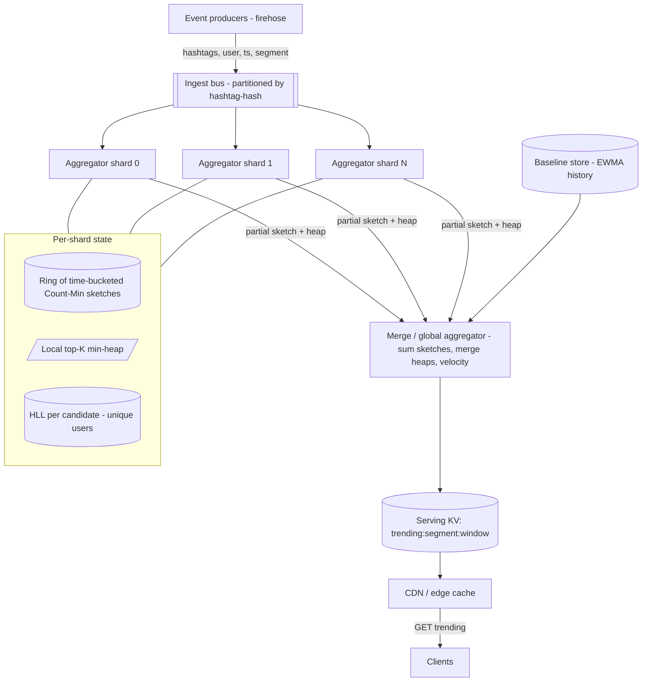

# A14 — Design a trending hashtags / top-K system

A trending system answers **"what are the K most-used hashtags (or terms, or items) right now?"** over a firehose of billions of events per day, with answers that refresh every few seconds and reflect a *sliding time window*, not all-time totals. The hard part isn't the heap — it's that you cannot keep an exact counter per distinct key (there are hundreds of millions), so you lean on **streaming sketches** (Count-Min, heavy-hitters) and accept *approximate* counts to hit memory and latency budgets. Google asks this because it probes streaming aggregation at scale, the **exact-vs-approximate** tradeoff, sliding windows, and **hot-partition / skew** handling — all Staff-defining themes.

## 1) Clarify — questions to ask the interviewer

- **What are we ranking, and what's the "count"?** Hashtags by raw usage? By *unique users* (dedup)? Weighted by engagement (likes/reshares)? Unique-user counting changes the sketch (Count-Min → HyperLogLog) entirely.
- **What window and refresh cadence?** "Trending in the **last 5 / 15 / 60 minutes**, refreshed every **few seconds**"? Or daily top-K? Window size sets memory; refresh sets the serving architecture.
- **How big is K, and at what granularity?** Top-50 global? Top-K *per country / per language / per topic*? Per-segment top-K multiplies the aggregation fan-out.
- **Scale of the firehose?** I'll assume **~1M events/sec average, ~5M/sec peak**, with **~10^8 distinct hashtags** over a day but a heavy long tail (most appear a handful of times).
- **Exact or approximate?** Is a ranking that's *approximately* right (±a few %, occasional rank swap deep in the list) acceptable? For trending, **yes** — and that unlocks sketches. Confirm the tolerance.
- **"Trending" = raw count or rate-of-change?** Is it the highest *absolute* count, or the biggest *spike* vs baseline (velocity / acceleration)? Spike detection needs a baseline model, not just a top-K.
- **Read scale and latency?** The trending list is read by millions of clients but is identical for everyone in a segment → highly cacheable. Target **p99 < 50–100 ms**, served from cache, refreshed every few seconds.
- **Late / out-of-order events?** Stream data arrives late. Do we use event-time windows with a watermark + grace period, or processing-time (simpler, slightly wrong at boundaries)?
- **Abuse / manipulation?** Bots can spam a hashtag to fake-trend it. Do we dedup by user, rate-limit, or apply anomaly filters? (Often a separate trust layer, but worth flagging.)

**What the interviewer is signaling:** they want to hear "I can't count every key exactly" *early*, then a clean path to **Count-Min sketch + a top-K heap of heavy hitters**, **sharded aggregation with a merge step**, and **sliding windows via time-bucketed sketches**. The differentiators are: (1) naming the approximate-vs-exact tradeoff and quantifying the memory it saves, (2) handling **hot partitions** (one celebrity hashtag overwhelming a shard) with key-salting/two-stage aggregation, and (3) getting sliding windows right with ring buffers rather than recomputing. Jumping to "a big heap" without the sketch is an L5 answer.

## 2) Functional Requirements (FR)

**In scope**

- Ingest a high-volume event stream (each event ≈ {hashtag(s), user, ts, segment}).
- Maintain approximate counts over a **sliding window** (e.g. trailing 5/15/60 min).
- Serve **top-K** trending hashtags, globally and per segment (country/language), refreshed every few seconds.
- Support both **raw-count** and **unique-user** counting modes.
- Optionally rank by **velocity** (spike vs baseline), not just absolute count.

**Out of scope (defer)**

- The full social graph / post storage / timeline delivery — we consume the firehose, we don't own it.
- Personalized/ranked trending per individual user (this is segment-level).
- Deep anti-abuse / bot classification (a trust signal we *consume*; flag it, don't build it).
- Historical analytics / arbitrary OLAP over hashtag counts (offline warehouse job).

## 3) Non-Functional Requirements (NFR)

| Dimension | Target & rationale |
|---|---|
| Scale | ~1M events/sec avg, ~5M/sec peak; ~10^8 distinct keys/day; top-K for ~10^2–10^3 segments. |
| Ingest latency | Event reflected in trending within **few seconds** (pipeline + refresh). |
| Read latency | **p99 < 50–100 ms** — served from cache; list is identical per segment, so cache hit rate is ~100%. |
| Availability | **99.9–99.99%** reads (cached, degrade to last-known-good list); ingest can tolerate brief lag. |
| Consistency | **Eventual / approximate** — trending is inherently fuzzy; bounded staleness (≤ refresh interval) is fine. |
| Accuracy | Approximate counts within ~±a few %; top-K membership correct for the genuinely-popular; deep-tail rank swaps acceptable. |
| Durability | Stream is replayable (retained log); sketches are reconstructible, so per-node loss is recoverable, not catastrophic. |
| Cost | Memory-bounded by sketches, not by per-key counters — this is the whole point. |

## 4) Back-of-envelope estimation

```
INGEST
  1,000,000 events/sec avg, 5,000,000/sec peak.
  Each event ~200 B (ids + hashtags + ts) -> 1M*200B = 200 MB/s avg, ~1 GB/s peak on the bus.

WHY NOT EXACT COUNTERS
  10^8 distinct keys * (key ~40 B + 8 B count) ≈ 10^8 * 48 B ≈ 4.8 GB per window per replica,
  and that's PER time bucket if we slide -> tens of GB. Multiply by per-segment -> blows up.
  -> use a sketch with FIXED memory independent of cardinality.

COUNT-MIN SKETCH SIZING (per window bucket, per shard)
  width w = e/eps, depth d = ln(1/delta).
  Target eps = 0.1% of total count N, delta = 0.1%:
    w = e/0.001 ≈ 2718,  d = ln(1000) ≈ 6.9 -> 7
  cells = w*d ≈ 2718*7 ≈ 19,026 counters * 8 B ≈ 152 KB PER SKETCH.
  -> a few hundred KB per (bucket, shard). Compare to 4.8 GB exact: ~30,000x smaller.
  Memory is INDEPENDENT of the 10^8 distinct keys — that's the lever.

SLIDING WINDOW (ring of buckets)
  60-min window, 1-min buckets -> 60 sketches per shard ≈ 60 * 152 KB ≈ 9 MB per shard. Trivial.
  Slide = drop oldest bucket, add new -> O(1), no recompute.

TOP-K HEAP (heavy hitters)
  Track candidate top-K (say K=1000 to be safe, return top-50) per shard:
    1000 * (40 B key + 8 B count) ≈ 48 KB per shard. Negligible.

UNIQUE-USER MODE (HyperLogLog)
  HLL ~12 KB gives ~2% error on cardinality, for ANY number of users. One HLL per (key,bucket)
  is too many; instead HLL per candidate heavy-hitter only -> bounded by K.

READS
  Millions of clients, but list per segment is identical -> serve from cache/CDN.
  ~10^3 segments * one small JSON (top-50) ≈ tiny; refreshed every few seconds.
  Read QPS could be 100K+ but ~100% cache hit -> backend sees only the refresh writes.
```

## 5) API design

```
# Ingest (internal, from the firehose)
publish(event{ hashtags[], user_id, ts, segment })            # onto partitioned stream

# Query (clients / services)
GET /v1/trending?segment={global|country|lang}&window=5m&k=50
    -> { window, as_of_ts, items:[ {tag, approx_count, rank, velocity} ... ] }

GET /v1/trending/{tag}?segment=...&window=15m
    -> { approx_count, rank, first_seen_ts, velocity }

# Admin / ops
GET /v1/debug/sketch?segment=...&window=...   -> sketch fill stats, error bounds
POST /v1/exclude { tag }                       -> suppress (spam/abuse) from results
```

## 6) Architecture — request & data flow

**(a) ASCII layered request/data flow**

```
        Event producers (post/comment/share services)  — the FIREHOSE
                       |
                       |  ~1M-5M events/sec, each {hashtags[], user, ts, segment}
                       v
        +==================================================================+
        |   INGEST BUS  (partitioned log, partition by hashtag-hash)       |  replayable, ordered/part.
        |   key-salt hot tags across sub-partitions (see hot-partition fix)|
        +==================================================================+
             |              |              |            (fan-out by partition)
             v              v              v
        [ Aggregator   [ Aggregator   [ Aggregator  ]   STATELESS-ish stream workers
          shard 0  ]     shard 1  ]     shard N  ]      per shard holds:
             |              |              |              - ring of time-bucketed
             |              |              |                COUNT-MIN sketches (sliding window)
             |              |              |              - local top-K min-heap (heavy hitters)
             |              |              |              - HLL per candidate (unique-user mode)
             |  partial top-K + sketch     |
             +-----------+--+--------------+
                         v
              +=====================================+
              |   MERGE / GLOBAL AGGREGATOR         |  every few seconds:
              |   - sum Count-Min sketches (additive)|  merge partials -> global sketch
              |   - merge per-shard heaps -> top-K   |  per segment (global, per country, ...)
              |   - compute velocity vs baseline     |
              +=====================================+
                         |
                         |  publish materialized top-K lists (small JSON per segment)
                         v
              +=====================================+        +===========================+
              |   SERVING STORE (KV / cache)        |<-------|  Baseline store (EWMA/      |
              |   "trending:{segment}:{window}"     |        |  history for velocity)      |
              +=====================================+        +===========================+
                         ^
        GET trending     |  (~100% cache hit; list identical per segment)
                         |
        [ CDN / Edge cache ]  <----  Clients (web / mobile / API)
```

**Read path.** A client calls `GET /trending?segment&window&k`. Because the answer is **identical for everyone in a segment**, it's served straight from the **CDN/edge cache** or the **serving KV** — essentially 100% cache hit, p99 well under 100 ms. The list is just a small precomputed JSON ("trending:US:5m") refreshed every few seconds by the merge stage. The read path touches no sketch and no stream — all the heavy lifting already happened upstream.

**Write/ingest path.** Producers emit events to the **partitioned ingest bus**, partitioned by `hash(hashtag)` so all events for a tag land on one shard (with **salting for hot tags**, see deep dive). Each **Aggregator shard** maintains a **ring of time-bucketed Count-Min sketches** (one per minute, say) for its slice of keys, plus a **local top-K min-heap** of heavy hitters it has seen. The **sliding window** is just "sum the last W buckets"; advancing the window drops the oldest bucket — O(1). Every few seconds the **Merge/Global aggregator** pulls each shard's **partial sketch + partial heap**, exploits the fact that **Count-Min sketches are additive** (cell-wise sum) and **heaps merge** by union-then-top-K, computes **velocity** against a baseline store, and writes the materialized top-K per segment to the serving store. This two-stage (shard → merge) design is what keeps it horizontally scalable and hot-partition-resistant.

**(b) Mermaid flowchart**



## 7) Data model & storage choices

**In-stream state (the heart) — sketches in worker memory, not a DB.**

```
Count-Min sketch  : int[d][w] counters, per (shard, time-bucket); additive across shards.
Sliding window    : ring buffer of W sketches (e.g. 60 x 1-min); window-sum = elementwise add.
Top-K heap        : min-heap of (count, tag), size ~K..K*10 candidates per shard.
HyperLogLog       : per candidate heavy-hitter, for unique-user counts (~12 KB, ~2% error).
```

These live in worker RAM because access is per-event mutation at millions/sec — a database round-trip per event is impossible. They're *reconstructible* from the replayable bus, so memory loss isn't data loss.

**Serving store — small KV / cache.**

```
key   : trending:{segment}:{window}        e.g. trending:global:5m
value : [ {tag, approx_count, rank, velocity}, ... ]   (top-K JSON, a few KB)
```

A simple KV/cache (Redis-shaped) fronted by a CDN. The entire serving surface is a few thousand tiny keys refreshed every few seconds — trivially cacheable, trivially replicated.

**Baseline store — for velocity.** Per-tag **EWMA** of recent counts (exponentially-weighted moving average) so we can compute spike = current/baseline. Compact time-series in a KV or lightweight TSDB.

**Ingest bus — partitioned, replayable log.** Partitioned by `hash(tag)` for locality; retained so we can replay/rebuild sketches and recover from worker failure.

Why **not** an exact per-key store: §4 shows 10^8 keys × multiple buckets × multiple segments is tens of GB and grows with cardinality. Count-Min gives **fixed memory independent of cardinality** with a provable error bound — the core first-principles trade.

## 8) Deep dive

### Deep dive A — Count-Min sketch + heavy-hitters + sliding windows

**Count-Min, precisely.** A 2-D array of counters `C[d][w]` with d independent hash functions. To **add** a key: for each row i, increment `C[i][ h_i(key) % w ]`. To **estimate** a key's count: take `min over i of C[i][ h_i(key)]`. Collisions only ever *inflate* a counter, so Count-Min **overestimates, never underestimates** — taking the min cancels most of the inflation. Error is bounded: with `w=e/eps, d=ln(1/delta)`, the estimate is within `eps*N` of true with probability `1-delta`. At eps=0.1% that's ~152 KB for the whole sketch (§4) versus 4.8 GB exact — the memory win is ~30,000×.

**Heavy hitters via a paired heap.** A sketch alone can't *enumerate* the top keys (it's not iterable). So each shard keeps a **min-heap of candidate heavy hitters**: when a key's sketch-estimate exceeds the heap's min, insert/update it; evict the smallest. This is the classic "Space-Saving / sketch + heap" combo — the sketch gives O(1) approximate counts, the heap gives O(log K) maintenance of the top set. We keep K*~10 candidates to avoid prematurely evicting a tag that's about to spike.

**Sliding windows without recompute.** Naively recomputing the window every refresh is wasteful. Instead, a **ring buffer of bucketed sketches** (e.g. 60 one-minute Count-Min sketches). The current window count for a key = **sum of its estimates across the active buckets** (sketches are additive). Advancing time = **drop the oldest bucket, allocate a fresh one** — O(1), no historical recompute. This gives a true sliding window cheaply; the granularity (bucket size) trades freshness for memory.

**Unique-user mode.** Raw Count-Min counts *events*, so a bot posting a tag 10^6 times fakes a trend. For *unique users* we attach a **HyperLogLog** to each candidate heavy-hitter (HLL estimates distinct cardinality in ~12 KB at ~2% error, mergeable across shards). We only pay HLL for the bounded candidate set, not for all 10^8 keys.

### Deep dive B — Sharded aggregation, merge, and hot partitions

**Two-stage aggregation.** Partition the firehose by `hash(tag)` so each aggregator owns a disjoint key-space and maintains *local* sketches + heap. Every few seconds a **merge stage** combines partials: **sum the Count-Min sketches cell-wise** (valid because they share dimensions/hash functions) into a global sketch, and **union the per-shard heaps** then take the global top-K. This map-reduce shape scales linearly: add aggregators as the firehose grows.

**The hot-partition problem (the crux).** A single celebrity/breaking-news hashtag can be 10–30% of all events. With pure `hash(tag)` partitioning, *all* of it lands on **one** aggregator → that shard melts while others idle. Fixes:
- **Key salting / fan-out for hot keys:** detect a hot tag (its local rate crosses a threshold) and **split it across S sub-partitions** by appending a salt `(tag, salt∈[0,S))` to the partition key. The S partial counts for that tag are **summed back at the merge stage**. This spreads a single hot key's load across S workers — the standard skew remedy.
- **Two-level pre-aggregation:** a thin **local combiner** at the producer/edge batches and pre-counts within a short window before publishing, so a hot tag arrives at the bus as one "tag×N" message instead of N messages — slashing event volume for the hottest keys (a combiner step, like map-side combine).
- **Adaptive repartitioning:** monitor per-shard load; when a shard is hot, the controller raises its salt factor S; when it cools, lower it. The salt count is dynamic, not fixed.

**Late / out-of-order events.** Stream events arrive late. Use **event-time bucketing with a watermark + small grace period**: an event timestamped for bucket t but arriving slightly late still updates bucket t until the watermark passes t+grace, after which t is sealed. This keeps window boundaries accurate without waiting forever; we accept that very-late events are dropped (they don't matter for "trending now").

## 9) Key tradeoffs

| Decision | Option A | Option B | Choice & why |
|---|---|---|---|
| Counting | Exact per-key map | Count-Min sketch | **Count-Min** — fixed memory independent of 10^8 cardinality; bounded overestimate; ~30,000× smaller. |
| Top-K extraction | Scan sketch (can't) | Sketch + candidate heap | **Sketch + heap** — sketch isn't iterable; heap maintains heavy hitters in O(log K). |
| Window | Recompute each refresh | Ring of bucketed sketches | **Ring buffer** — O(1) slide via drop-oldest/add-new; additive sketches make summing cheap. |
| Aggregation | Single global counter | Sharded + merge (map-reduce) | **Sharded + merge** — linear scale; sketches sum, heaps union. |
| Hot key | Plain hash partition | Salt/fan-out + combiner | **Salt + combiner** — spread a celebrity tag across S sub-partitions; pre-combine at source. |
| Time semantics | Processing-time | Event-time + watermark | **Event-time + grace** — accurate window boundaries; bounded wait. |
| Unique users | HLL per key | HLL per candidate only | **Per candidate** — HLL only for the bounded heavy-hitter set, not 10^8 keys. |
| Consistency | Strong | Eventual/approximate | **Eventual** — trending is inherently fuzzy; staleness ≤ refresh interval is fine. |

## 10) Bottlenecks & failure modes

- **Hot partition (celebrity tag).** One tag dominates → its shard saturates. *Mitigation:* salt/fan-out across S sub-partitions + sum at merge; producer-side combiner pre-aggregates; adaptive salt factor.
- **Sketch saturation / error blow-up.** If total volume N spikes far beyond design, eps*N error grows and the ranking gets noisy. *Mitigation:* size sketches for peak; monitor fill/error bounds; the heap protects top-K membership even when deep-tail counts are noisy.
- **Merge stage as a bottleneck/SPOF.** All partials funnel through merge. *Mitigation:* shard the merge **per segment** (global, per-country independently); merge is cheap (sum small sketches + union small heaps); run replicas with leader election.
- **Thundering herd on reads during a breaking event.** Everyone refreshes trending at once. *Mitigation:* the list is one cached object per segment → CDN absorbs it; serve last-known-good if the refresh stalls.
- **Worker loss → lost in-memory sketches.** *Mitigation:* sketches are reconstructible by **replaying** the retained bus from the window start; checkpoint sketches periodically so replay is short. A lost shard self-heals.
- **Abuse / fake trending (bots).** Coordinated spam fakes a spike. *Mitigation:* unique-user (HLL) mode instead of raw counts; rate-limit per user; velocity model flags implausible acceleration; an exclude-list suppresses confirmed abuse.
- **Stale window at boundaries (late data).** *Mitigation:* watermark + grace period; accept dropping pathologically-late events.

## 11) Scale 10x / evolution

- **10M+ events/sec.** Add aggregator shards (linear), push **more pre-aggregation to the edge** (producer-side combiners) so the bus carries counts, not raw events. The bus partitioning scales horizontally.
- **More segments (per-city, per-topic, per-language × country).** The per-segment merge fan-out is the new cost. **Compute coarse segments from fine ones** (sum city sketches → country, because sketches are additive) instead of independent pipelines — a roll-up hierarchy.
- **Tighter freshness (sub-second trending).** Shrink bucket granularity and refresh cadence; move merge to continuous streaming rather than periodic. Watch the error/memory tradeoff as buckets shrink.
- **Richer ranking (velocity, personalization).** Velocity is already in; personalization breaks the "one list per segment" cache win, so keep it as a *re-rank* over a cached candidate set rather than per-user pipelines.
- **Exact counts demanded for top items.** Keep the sketch for *discovery* of heavy hitters, then maintain **exact counters only for the bounded candidate set** — best of both: approximate to find candidates, exact for the few that matter.
- **What breaks first:** hot partitions for viral tags (handle via salting/combiner) and the per-segment merge fan-out (handle via roll-up hierarchy). Sketch memory stays flat with cardinality — that's the design's durability.

## 12) Interviewer probes & follow-ups

- **"Why can't you just keep a count per hashtag?"** 10^8 distinct keys × multiple time buckets × multiple segments is tens of GB and *grows with cardinality*. Count-Min gives **fixed memory with a provable error bound** (~152 KB/sketch vs 4.8 GB exact) — that's the unlock.
- **"How does Count-Min avoid undercounting?"** Collisions only ever *increment* extra counters, so every cell is an overestimate; taking the **min** across d rows cancels most collisions. It overestimates, never underestimates — bounded by eps*N w.h.p.
- **"The sketch can't list the top keys — how do you get top-K?"** Pair it with a **min-heap of candidate heavy hitters**: promote a key when its estimate beats the heap min, evict the smallest. Sketch for counts, heap for enumeration.
- **"Sliding window without recomputing every second?"** A **ring of time-bucketed sketches**; window = sum of active buckets (additive); slide = drop oldest + add new, O(1).
- **"One hashtag is 20% of all traffic — what happens?"** With plain hashing, one shard melts. I **salt the hot key across S sub-partitions** and sum at merge, and add a **producer-side combiner** so it arrives pre-aggregated. Salt factor adapts to load.
- **"How do you stop bots from faking a trend?"** Switch to **unique-user counting with HyperLogLog** per candidate (a bot's 10^6 posts count as ~1 user), plus rate limits and a velocity/anomaly filter.
- **"A worker dies mid-window — do you lose data?"** No — sketches are **reconstructible by replaying** the retained bus from the window start; periodic checkpoints bound replay time.
- **"Approximate vs exact — when is exact required?"** Trending tolerates approximation. If exact counts are needed for the *displayed* items, keep exact counters only for the bounded candidate set discovered by the sketch.
- **"How fresh is the list, and how do you serve millions of readers?"** Refreshed every few seconds; the list is **identical per segment**, so it's one cached object per segment behind a CDN — ~100% cache hit, p99 < 100 ms.

## 13) 60-minute flow cheat-sheet

| Time | Focus | What to land |
|---|---|---|
| 0–6 min | Clarify | Count of what (raw vs unique-user); window + refresh; K and per-segment; approximate OK. |
| 6–10 min | FR / NFR | top-K per segment over sliding window; eventual/approximate; cached reads. |
| 10–16 min | Estimation | Why exact fails (tens of GB, grows with cardinality); Count-Min ~152 KB; ring = 9 MB/shard. |
| 16–22 min | API + high-level arch | Ingest bus → sharded aggregators → merge → serving cache → CDN; draw it. |
| 22–40 min | Deep dive | Count-Min (overestimate→min), sketch+heap heavy hitters, ring-buffer sliding window, HLL unique-user. |
| 40–48 min | Hot partition | Salting/fan-out + sum at merge, producer-side combiner, adaptive salt. |
| 48–54 min | Tradeoffs / failures | Approximate vs exact; worker loss → replay; merge SPOF → per-segment shard; abuse → HLL+velocity. |
| 54–60 min | Scale 10× | Edge pre-aggregation; segment roll-up hierarchy (sketches sum); exact counters for candidates only. |
