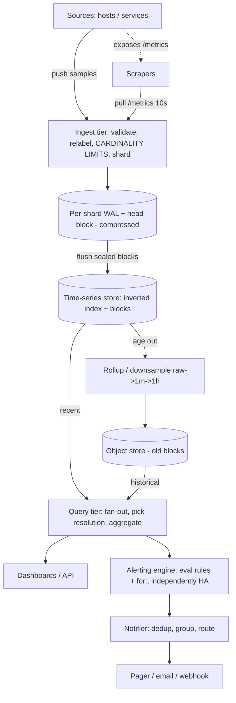

# A15 — Design a server health monitoring / metrics system

A metrics system ingests **time-stamped numeric measurements** (CPU, QPS, latency, error rate, queue depth …) from millions of hosts and services, stores them efficiently, lets engineers **query and graph** them with low latency, and **fires alerts** when rules trip. The defining tensions are **write volume vs query latency** (a relentless firehose of writes against interactive dashboard reads), **cardinality control** (the silent killer of every TSDB), and **resolution vs retention** (you can't keep per-second data forever). Google asks this because observability at scale forces explicit reasoning about time-series storage, downsampling/rollups, push-vs-pull collection, and alert-evaluation correctness — all Staff-level systems concerns.

## 1) Clarify — questions to ask the interviewer

- **What are we monitoring, and what's a metric?** Infra (CPU/mem/disk) + application (QPS, p99 latency, error rate) + business KPIs? Each metric is `(name, {label:value...}, timestamp, float)`. The **label set** is what creates cardinality.
- **Push or pull (scrape)?** Do agents *push* samples to us, or does a central scraper *pull* `/metrics` endpoints on a schedule? This is a foundational architectural fork (see deep dive).
- **Scale of sources and series?** I'll assume **~1M hosts/targets**, **~100–1000 series each** → **~10^8–10^9 active series**, scraped/pushed at **~10 s resolution** → on the order of **10–100M samples/sec** ingest.
- **Query patterns and latency?** Mostly **recent** data (dashboards over last hours) + alert evaluation every ~15–60 s, plus occasional historical drill-downs. Target dashboard **p99 < 1 s** for recent ranges.
- **Retention and resolution policy?** "Raw 10 s for 2 weeks, 1 min for 90 days, 1 hour for 1–2 years"? Retention × resolution drives storage and the downsampling pipeline.
- **Alerting semantics?** Threshold rules, `for: 5m` sustained conditions, rate-of-change, multi-series aggregations? Per-series or per-aggregate? How fast must an alert fire (detection latency budget)?
- **Cardinality limits?** Are users allowed unbounded labels (e.g. `user_id`, `request_id` as a label = explosion)? We must define limits and protection.
- **Consistency / loss tolerance?** Metrics are statistical — is it OK to **drop a few samples** under overload rather than block ingest? (Usually yes — favor availability of ingest over completeness.)
- **Multi-region / global view?** Per-region stores with a global query federation, or one global store? HA of the alerting path specifically (alerts must fire even during an outage — that's *when* you need them most).

**What the interviewer is signaling:** they want a clean separation of **ingest → time-series store → query → alerting**, an explicit stance on **push vs pull**, and — the real differentiator — **cardinality control** and **downsampling/rollups** raised *unprompted*. Strong candidates note that "metrics tolerate sample loss" (so ingest favors availability), that the **alerting path must be independently highly available** (it's most needed during incidents), and that **a columnar/delta-encoded TSDB** beats a generic KV for this access pattern. Treating it as "just write rows to a database" is an L5 miss.

## 2) Functional Requirements (FR)

**In scope**

- Ingest time-series samples `(name, labels, ts, value)` from millions of sources (push and/or pull).
- Durable, compressed **time-series storage** with configurable retention.
- **Downsampling / rollups** to coarser resolutions for long retention.
- **Query API** supporting time-range selection, label filtering, and aggregations (rate, sum, avg, percentiles) over series.
- **Alerting**: rule evaluation (threshold, sustained `for:`, rate-of-change), with notifications and dedup/grouping.
- **Cardinality control**: limits, monitoring, and protection against label explosion.

**Out of scope (defer)**

- Distributed tracing and log storage (sibling pillars; we are metrics).
- Dashboard UI/rendering (we expose the query API; a Grafana-like front consumes it).
- Long-term cold analytics / arbitrary OLAP joins across metrics (warehouse export).
- On-call scheduling / incident management (PagerDuty-style; we *send* to it).

## 3) Non-Functional Requirements (NFR)

| Dimension | Target & rationale |
|---|---|
| Scale | ~1M sources, ~10^8–10^9 active series, ~10–100M samples/sec ingest at 10 s resolution. |
| Ingest | Sustained firehose; **favor availability** — shed/drop samples under overload rather than block. |
| Query latency | Dashboards (recent): **p99 < 1 s**; alert eval: complete each cycle (~15–60 s) well within budget. |
| Availability | **99.9%+** queries; **alerting path 99.99%+** and independently survivable (most needed during outages). |
| Consistency | **Eventual / lossy-tolerant** for samples; alert evaluation must see a *consistent recent* view. |
| Durability | Recent data on replicated nodes; older data on object store (cheap, 11 9's). Per-node loss ≠ data loss. |
| Retention | Tiered: raw 10 s ~2 wk, 1 min ~90 d, 1 h ~1–2 yr (configurable). |
| Cardinality | Hard per-tenant/per-metric series limits; reject/aggregate offenders before they hit storage. |

## 4) Back-of-envelope estimation

```
INGEST
  10^8 active series, scraped every 10 s -> 10^8 / 10 = 10^7 = 10M samples/sec.
  (At 10^9 series -> 100M samples/sec.) Each raw sample ~16 B in memory (ts:8 + value:8) before compression.

WHY TIME-SERIES COMPRESSION MATTERS
  Naive: 10M samples/sec * 16 B = 160 MB/s = ~13.8 TB/day uncompressed. Unsustainable to keep raw.
  Time-series compression (delta-of-delta on timestamps + XOR on float values, Gorilla-style)
  achieves ~1.3–2 bytes/sample on real data -> ~10x reduction.
    10M/s * 1.5 B ≈ 15 MB/s ≈ ~1.3 TB/day compressed for raw tier. Now tractable.

STORAGE WITH ROLLUPS (retention tiers)
  Raw 10 s, 14 d:   10M/s * 1.5B * 86400 * 14 ≈ ~18 TB.
  1-min, 90 d:      downsample 6x fewer points: (10M/6)/s effective... 
                    ≈ raw_points/6 * 1.5B over 90 d ≈ ~28 TB.
  1-hr, 365 d:      ((10M/360))/s * 1.5B * 86400*365 ≈ ~13 TB.
  Total ≈ tens of TB, dominated by mid-tier — rollups are what make long retention affordable.
  Without rollups, keeping raw for a year ≈ 1.3 TB/day * 365 ≈ ~475 TB. ~10-15x worse.

QUERY
  A dashboard panel over "last 6h at 10s" for one series = 6*3600/10 = 2160 points -> trivial.
  A query fanning over 10^4 series for a p99 aggregate must hit only the relevant shards/blocks
  -> index by (metric, labels); read recent blocks from memory/SSD, not object store.

CARDINALITY (the silent killer)
  One label with high cardinality (e.g. user_id, 10^7 values) on a metric MULTIPLIES series count.
  metric{handler, status, instance} with 100 handlers * 10 status * 1000 instances = 10^6 series — fine.
  Add user_id (10^7) -> 10^13 series -> instant blow-up. MUST cap label cardinality.

ALERTING
  Say 10^5 alert rules, evaluated every 30 s -> ~3.3K rule-evals/sec, each a small range query.
  Cheap if rules hit pre-aggregated/recent data; expensive if each scans raw high-card series.
```

## 5) API design

```
# Ingest
POST /v1/ingest            # push: batch of samples
   body: [ {name, labels{...}, ts, value}, ... ]
# (Pull mode) scraper GETs target's exposition endpoint:
GET  http://target/metrics  -> text/exposition: metric{labels} value ts

# Query
GET /v1/query_range?expr=<selector+agg>&start=&end=&step=
   e.g. expr = rate(http_requests_total{handler="/x",status="5xx"}[1m])
   -> { series:[ {labels, points:[[ts,val]...]} ] }
GET /v1/query?expr=...&time=...           # instant query (alert eval)
GET /v1/labels , /v1/series?match=...     # metadata / label discovery

# Alerting
PUT /v1/rules { name, expr, for:"5m", threshold, severity, labels, annotations }
GET /v1/alerts?state=firing|pending
# notifier dedups/groups -> webhook/email/pager
```

## 6) Architecture — request & data flow

**(a) ASCII layered request/data flow**

```
        Sources: hosts / services exposing metrics
            |                                   ^
   PUSH     | samples                  PULL     |  scrape /metrics every 10s
   (agent)  v                          (scraper)|
        +======================================================================+
        |   INGEST TIER  (stateless collectors / scrapers, autoscaled)         |
        |   - validate, relabel, ENFORCE CARDINALITY LIMITS (drop/aggregate)   |  shed under overload
        |   - shard by series-id = hash(metric+labels)                         |
        +======================================================================+
                 |                 |                  |     (route by series shard)
                 v                 v                  v
        +-----------------------------------------------------------+
        |   WRITE BUFFER  (per-shard WAL + in-memory head block)    |  recent ~2h, hot for reads
        |   columnar, delta-of-delta ts + XOR float compression     |  (Gorilla-style)
        +-----------------------------------------------------------+
                 |  flush sealed blocks (every ~2h)                  ^
                 v                                                   |  recent reads (memory/SSD)
        +-----------------------------------------------------------+
        |   TIME-SERIES STORE (sharded)                             |
        |   [ Inverted index: label -> series-ids ]  +  [ blocks ]  |  point/range by (metric,labels,ts)
        +-----------------------------------------------------------+
            |  age out                         ^                ^
            v                                  |                | recent
        +--------------------------+   +-------------------+    |
        |  ROLLUP / DOWNSAMPLE     |   |  OBJECT STORE     |    |
        |  raw->1min->1hr (async)  |-->|  old blocks (cheap)|   |
        +--------------------------+   +-------------------+    |
                                                               |
        +======================================================+======================+
        |   QUERY TIER (fan-out, merge, aggregate)             |                      |
        |   picks resolution by range; reads recent from store,|                      |
        |   old from object store; computes rate/percentile/agg|                      |
        +=============================+========================+======================+
                 ^                    |                                  ^
   GET query     |  dashboards        |  instant queries (every cycle)   |
                 |                    v                                  |
        [ Dashboards / API clients ]  +====================+   reads pre-agg / recent
                                      |  ALERTING ENGINE   |---> [ Notifier: dedup, group,
                                      |  eval rules, `for:`|        route -> pager/email ]
                                      |  (independently HA)|
                                      +====================+
```

**Write/ingest path.** Sources either **push** batches to the ingest tier or expose `/metrics` that **scrapers pull** on a schedule. The stateless **ingest tier** validates, applies relabeling, and — critically — **enforces cardinality limits** (rejecting or aggregating away high-cardinality labels) *before* anything reaches storage. It shards each sample by `series-id = hash(metric+labels)` and routes to the owning store node, which appends to a per-shard **WAL** and an in-memory **head block**. The head block is **columnar and compressed** (delta-of-delta on timestamps, XOR on float values — Gorilla-style ~10×). Every ~2 h the head is **sealed and flushed** as an immutable block; an async **rollup pipeline** downsamples raw→1 min→1 h and ages old blocks out to **object storage**. Under overload we **drop samples** rather than block ingest — metrics are statistical, availability of the pipeline matters more than any single point.

**Read path.** Dashboards and the alerting engine issue **range/instant queries** with a label selector and an aggregation (`rate`, `sum`, percentile). The **query tier** uses the **inverted index** (`label → series-ids`) to find matching series, **chooses the resolution tier** based on the time range (recent short range → raw blocks from memory/SSD; long historical range → rolled-up blocks from object store), reads only the relevant blocks, and **merges + aggregates** across shards. Recent queries are served entirely from hot memory/SSD → p99 < 1 s. The **alerting engine** runs the same query path every cycle to evaluate rules (including sustained `for:` windows), and is deployed **independently and HA** so it keeps firing even if dashboards or part of the store are degraded — alerts are most needed exactly when things are broken.

**(b) Mermaid flowchart**



## 7) Data model & storage choices

**Time-series store — purpose-built TSDB, not a generic KV/SQL.**

```
series-id = hash(metric_name + sorted(labels))      # stable identity for a series
Inverted index:  label_name=value  ->  posting list of series-ids   (for selector queries)
Block (immutable, per ~2h, per shard):
   per series: compressed chunk of (delta-of-delta ts, XOR float values)  -- Gorilla-style
Layout: columnar by series, time-ordered; sealed blocks are read-only and mergeable.
```

Why a TSDB and not Postgres or a KV: the workload is **append-only, time-ordered numeric writes** at tens of millions/sec, with reads that are **range scans over (metric, labels, time)**. Specialized **delta/XOR compression** gets ~1.5 B/sample (vs 16 B raw) — a generic row store can't approach that and would buckle on write volume. The **inverted index** is the key indexing choice: it maps `label=value` to posting lists of series-ids so a selector like `{handler="/x",status="5xx"}` resolves to exactly the series to scan, instead of scanning everything. Sealed blocks being **immutable** makes them trivially cacheable and shippable to object storage.

**Tiered storage by age.** Hot recent blocks live in memory/SSD on store nodes (replicated for the recency that dashboards/alerts need). Old blocks move to **object storage** — cheap, durable (11 9's), and fine for occasional historical drill-downs that tolerate higher latency.

**Rollup store.** Downsampled series (1 min, 1 h) are just more blocks at coarser resolution, indexed the same way, so the query tier picks the right tier transparently.

**Alert rule store.** Small relational/KV store for rule definitions, current alert state (pending/firing), and silences.

Stores deliberately rejected: a generic time-series-in-SQL (write amplification, no XOR/delta compression, index bloat at 10^9 series); an exact KV per-sample (no range-scan efficiency, no compression). Cardinality, not row count, is the real scaling axis — the index design and limits address it directly.

## 8) Deep dive

### Deep dive A — Time-series storage, compression, downsampling, retention

**Compression (why it's the foundation).** Two ideas from Facebook's Gorilla:
- **Timestamps: delta-of-delta.** Samples arrive at a near-fixed interval (every 10 s), so consecutive deltas are nearly identical; encoding the *delta of the delta* makes most timestamps cost a single bit. 
- **Float values: XOR.** Adjacent values are usually close, so `xor(prev, cur)` has many leading/trailing zero bits; we store only the meaningful middle bits.
Together these compress real metrics to **~1.3–2 bytes/sample (~10×)**, turning ~14 TB/day raw into ~1.3 TB/day — this is what makes keeping raw data at all feasible (§4).

**Downsampling / rollups (why long retention is affordable).** Per-second/10 s data is invaluable for the last days but pointless at 1-year zoom. An async pipeline rolls **raw → 1 min → 1 h**, precomputing per-bucket **aggregates** (min/max/avg/count/sum, and percentile-friendly sketches). Storage drops by the downsample ratio; without rollups, a year of raw is ~10–15× more expensive (§4). The query tier **transparently selects** the coarsest tier that still satisfies the requested step, so a "last year" dashboard reads cheap 1 h rollups while "last hour" reads raw.

**Retention enforcement.** Each tier has a TTL (raw 2 wk, 1 min 90 d, 1 h 1–2 yr). Expiry is just dropping aged blocks — cheap because blocks are immutable and time-bounded. Tiering to **object storage** before deletion lets us keep cheap long-tail history.

**Query resolution selection.** Range `> threshold` → use 1 h rollups; medium → 1 min; recent → raw. This bounds the number of points scanned per query regardless of range, keeping dashboards fast.

### Deep dive B — Cardinality control + push-vs-pull + HA alerting

**Cardinality control (the make-or-break).** Active **series count = product of label cardinalities**, and storage/index/query cost all scale with it. A single accidental high-cardinality label (`user_id`, `request_id`, raw URL with IDs) multiplies series by millions and can OOM the store (§4). Defenses, enforced at the **ingest tier** before storage:
- **Hard limits** per tenant/metric on active series; **reject or aggregate** samples that would exceed them.
- **Relabeling** to drop/normalize dangerous labels (e.g. strip IDs from a path → `/users/{id}`).
- **Cardinality monitoring**: track new-series creation rate; alert on explosions; surface the worst offenders.
- **Allowlist label sets** for high-volume metrics so engineers can't accidentally add an unbounded dimension.

**Push vs pull (a real architectural fork).**
| | Pull (scrape) | Push |
|---|---|---|
| Discovery | Central scraper finds targets via service discovery | Sources must know where to send |
| Health signal | Scrape failure *is* a down signal (free liveness) | Need a separate heartbeat for "is it alive?" |
| Firewall/NAT | Scraper must reach targets | Works through NAT / short-lived jobs |
| Backpressure | Scraper controls rate | Sources can overwhelm ingest |
| Ephemeral jobs | Hard (job gone before scrape) | Natural (push then exit, via a gateway) |

**Choice:** **pull as the default** (free liveness, central rate control, easy discovery) for long-lived targets, with a **push gateway** for short-lived/batch jobs and NAT'd sources. Stating this hybrid and *why* is the Staff move; many candidates pick one dogmatically.

**Alert evaluation correctness + HA.** Rules evaluate on a fixed cadence; `for: 5m` means the condition must hold across consecutive evaluations before firing (suppresses flapping). The **alerting engine must be independently highly available and able to read a consistent recent view** — because alerts matter most *during* an outage, when the rest of the system may be degraded. So: run alert evaluators **redundantly** (multiple replicas evaluating the same rules, with **dedup at the notifier** so we don't page twice), keep their data dependency on the **hot recent tier** (not object store), and ensure an outage of dashboards or historical storage doesn't stop alert firing. The **notifier** dedups, **groups** related alerts (one page for "50 hosts down," not 50), applies silences, and routes by severity.

## 9) Key tradeoffs

| Decision | Option A | Option B | Choice & why |
|---|---|---|---|
| Storage engine | Generic SQL/KV | Purpose-built TSDB (columnar, delta/XOR) | **TSDB** — ~10× compression, range-scan layout, inverted index for selectors. |
| Collection | Pull (scrape) | Push | **Pull default + push gateway** — free liveness & rate control; push for ephemeral/NAT. |
| Retention | Keep raw forever | Tiered rollups + object store | **Rollups** — long retention affordable; pick resolution by query range. |
| Ingest under load | Block/queue (no loss) | Shed samples | **Shed** — metrics are statistical; pipeline availability > completeness. |
| Cardinality | Allow any labels | Hard limits + relabel | **Limit + relabel** — cardinality is the real scaling axis; cap it at ingest. |
| Consistency | Strong | Eventual / lossy-tolerant | **Eventual** for samples; alert eval reads a consistent *recent* view. |
| Alerting HA | Single evaluator | Redundant + notifier dedup | **Redundant** — alerts must fire during outages; dedup avoids double-paging. |
| Hot recent reads | Object store | Memory/SSD hot tier | **Hot tier** — dashboards/alerts need recent data fast; archive cold to object store. |

## 10) Bottlenecks & failure modes

- **Cardinality explosion.** A bad label (`user_id`) multiplies series → store OOM, index bloat, slow queries. *Mitigation:* ingest-time hard limits, relabel/drop, cardinality monitoring + alerts on new-series rate, allowlisted label sets.
- **Ingest overload / thundering herd.** Mass restart → every target reconnects/pushes at once. *Mitigation:* stateless autoscaled ingest, **shed samples** under pressure, jittered scrape intervals, per-source rate limits, backpressure to push gateway.
- **Hot shard (a noisy metric/host).** One series-id range gets disproportionate writes/reads. *Mitigation:* shard by `hash(metric+labels)` for even spread; split hot shards; cap per-series sample rate.
- **Query fan-out blow-up.** A selector matching 10^6 series scans the world. *Mitigation:* inverted index restricts to matching series; **resolution selection** bounds points per query; reject/limit unbounded queries; per-query time/series budgets.
- **Object-store latency on historical queries.** Cold blocks are slow. *Mitigation:* serve recent from hot tier; cache frequently-read old blocks; accept higher latency for deep history (set expectations).
- **Alerting path down during an incident.** The one time you need alerts, they're gone. *Mitigation:* **independent HA alert evaluators**, dependency only on the hot tier, notifier dedup/grouping, and an external dead-man's-switch ("alerting is alive") so silence-of-alerts itself pages.
- **Clock skew / late samples.** Out-of-order or future timestamps corrupt windows. *Mitigation:* bound accepted timestamp drift; reject far-future samples; align on scrape/ingest time where appropriate.

## 11) Scale 10x / evolution

- **10^9–10^10 series / 100M+ samples/sec.** Scale the store **horizontally by series shard**; the inverted index and blocks shard cleanly. The binding constraint becomes **cardinality**, so invest harder in ingest-time limits and per-tenant quotas.
- **Global / multi-region.** Run **per-region stores**; a **global query federation** layer fans queries to regions and merges, instead of one global store (which would be a write/latency bottleneck). Alerting stays regional (fire close to the data) with a global rollup for cross-region views.
- **Longer retention / cheaper history.** Push more aggressively to **object storage** with a query-time fetch+cache; add coarser rollup tiers (6 h, 1 d). Consider a separate cold analytical export for ad-hoc OLAP.
- **Richer queries (histograms, percentiles at scale).** Store **percentile-friendly sketches** (e.g. t-digest/DDSketch) in rollups so `p99` over long ranges is mergeable and exact-enough without keeping raw.
- **More alert rules (10^6+).** Co-locate rule evaluation with the relevant shard (push the predicate down), pre-aggregate common alert inputs, and group rules to amortize range queries.
- **What breaks first:** cardinality (always) and query fan-out on broad selectors. Both are contained by ingest-time limits and index+resolution selection; storage volume is handled by rollups + object tiering.

## 12) Interviewer probes & follow-ups

- **"Push or pull — which and why?"** Pull (scrape) by default: scrape success is a free liveness signal, the scraper controls rate, and service discovery makes targets self-registering. I add a **push gateway** for short-lived/batch jobs and NAT'd sources — a hybrid, chosen per source type.
- **"Why not store metrics in a relational DB?"** Write volume (tens of M/sec) and the **range-scan-by-(metric,labels,time)** pattern don't fit row stores. A TSDB with **delta-of-delta + XOR compression** hits ~1.5 B/sample (~10×) and an **inverted index** resolves selectors without full scans.
- **"What's the single biggest scaling risk?"** **Cardinality.** Series count is the product of label cardinalities; one unbounded label (user_id) explodes it. I enforce **hard limits + relabeling at ingest** and monitor new-series rate.
- **"How do you keep a year of data affordably?"** **Downsampling/rollups** (raw→1 min→1 h) + tiering old blocks to object storage. Query tier picks the coarsest resolution that satisfies the range, so long-range dashboards read cheap rollups.
- **"How does `for: 5m` alerting work and how is it HA?"** The condition must hold across consecutive evaluation cycles before firing (anti-flap). Evaluators run **redundantly** reading the **hot recent tier**, with **dedup/grouping at the notifier**, so alerts fire even when the rest of the system is degraded — which is exactly when they matter.
- **"Is it OK to lose samples?"** Yes — metrics are statistical, so under overload I **shed samples** to keep the pipeline available rather than block ingest. Alert evaluation tolerates a missed sample but reads a consistent recent view.
- **"How do you make a dashboard query fast?"** Inverted index → only matching series; resolution selection bounds points; recent data served from memory/SSD. p99 < 1 s for recent ranges; deep history is slower by design (object store).
- **"What if someone runs a query over a million series?"** Per-query series/time budgets, forced aggregation, and resolution downshift; reject pathological selectors. The index + budgets protect the system.
- **"How do you detect that monitoring itself is down?"** An external **dead-man's-switch**: a heartbeat alert that fires if the pipeline *stops* producing — so silence is itself a signal.

## 13) 60-minute flow cheat-sheet

| Time | Focus | What to land |
|---|---|---|
| 0–6 min | Clarify | What's a metric (name+labels+ts+value); **push vs pull**; scale (10^8 series, 10M samples/s); retention/resolution. |
| 6–10 min | FR / NFR | ingest→store→query→alert; lossy-tolerant ingest; alerting independently HA; cardinality limits. |
| 10–16 min | Estimation | 10M samples/s; compression ~1.5 B (~10×); rollups make 1-yr retention ~10× cheaper; cardinality math. |
| 16–22 min | API + high-level arch | ingest tier (cardinality enforce) → WAL/head → TSDB+index → rollup/object → query → alerting; draw it. |
| 22–38 min | Deep dive | Delta-of-delta+XOR compression; rollups + resolution selection; **cardinality control**; pull+push hybrid; HA alerting. |
| 38–46 min | Tradeoffs | TSDB vs SQL; shed vs block; tiered retention; redundant alert eval + notifier dedup. |
| 46–54 min | Bottlenecks | Cardinality explosion, query fan-out, alerting-down-during-incident — each with mitigation + dead-man's-switch. |
| 54–60 min | Scale 10× | Shard by series; per-region store + global query federation; sketches for percentiles; predicate pushdown for rules. |
