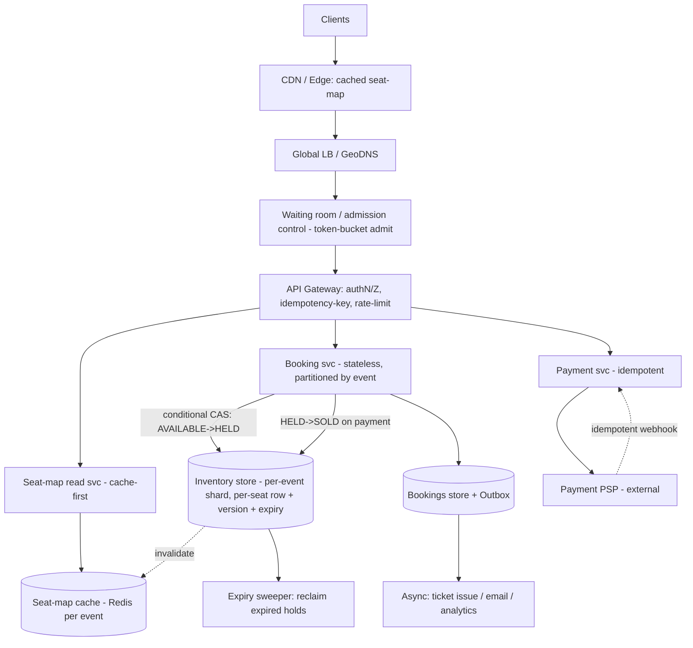

# A16 — Design a ticket booking system

A ticket booking system (movies, flights, concerts, trains) sells a **finite inventory of specific seats** to many concurrent buyers, and its defining requirement is brutally simple to state and hard to satisfy: **no double-booking** — one seat, one buyer, ever — while still feeling fast and available under a flash crowd. The crux is **concurrency and consistency under contention**: thousands of people stampede the same popular event the instant tickets drop, and the system must serialize the claim on each seat without melting. Google asks this because it forces a precise stance on **locking (optimistic vs pessimistic), reservation holds with TTL, idempotent payments, oversell prevention, and the exact consistency model** — strong-consistency systems design, not eventual-consistency hand-waving.

## 1) Clarify — questions to ask the interviewer

- **Assigned seats or general admission?** Pick-your-seat (seat-map, per-seat state) vs a pool of N identical GA tickets (decrement a counter). The data model and locking differ — seat-map is the harder, more interesting case; I'll design for it and note the GA simplification.
- **Single venue/event or marketplace?** One booking engine per event vs a platform across many events/venues. Affects partitioning (partition by event is natural) and the inventory store.
- **What's the consistency requirement, exactly?** I'll assume **strong consistency on inventory — never sell the same seat twice, never oversell** — even at the cost of some availability/latency under partition. This is a CP problem by nature.
- **Flash-crowd scale?** A hot concert: maybe **10^5–10^6 users** hit the on-sale at t=0 for **~10^4–10^5 seats**. Steady state is tiny; the spike is the whole problem. Read (browse seat-map) vastly outnumbers write (book).
- **Hold/reservation semantics?** When a user selects seats, do we **hold** them while they pay? For how long (TTL, e.g. 5–10 min)? What happens on timeout — auto-release? This is central.
- **Payment flow and failure handling?** Synchronous card auth in the hold window, or async? Must be **idempotent** (retries/double-clicks/webhook redelivery must not double-charge or double-book).
- **Latency target?** Browsing seat-map **p99 < 200 ms**; the **book/confirm** action can be a bit slower (it's a transaction) but should feel responsive (< 1 s).
- **Oversell tolerance?** Usually **zero** for seat selection. (Airlines deliberately oversell GA-style cabins — a different policy; confirm whether overbooking is wanted.)
- **Fairness under contention?** First-come-first-served, or a **virtual waiting room / queue** that admits users in order to protect the backend? For flash sales the waiting room is often the real answer.
- **Refunds/cancellations and resale?** In scope or deferred?

**What the interviewer is signaling:** they want to see that you treat this as a **strong-consistency, high-contention transactional** problem — the opposite of the "eventually consistent at scale" reflex. The differentiators: (1) a crisp **hold-with-TTL** model so a user can pay without others grabbing the seat, *and* the seat isn't lost forever if they abandon; (2) the **optimistic-vs-pessimistic locking** call with a clear justification; (3) **idempotent payments** keyed so retries are safe; (4) **partitioning by event** so one hot event doesn't take down others, and handling that hot partition. Jumping to "just put it in a database" without addressing the hold lifecycle, idempotency, and the flash-crowd hot partition is an L5 answer.

## 2) Functional Requirements (FR)

**In scope**

- Browse events and view a **live seat-map** (which seats are available/held/sold).
- **Hold** selected seats for a TTL while the user checks out (others can't grab them).
- **Book/confirm**: take payment and convert a hold into a confirmed sale — **idempotently**, with **no double-booking and no oversell**.
- **Auto-release** held seats whose TTL expires (returned to inventory).
- Handle the **flash crowd / on-sale spike** (admission control / waiting room).
- View bookings; cancel/refund (basic) returning seats to inventory.

**Out of scope (defer)**

- Dynamic pricing / surge pricing engine.
- Secondary marketplace / resale and anti-scalping ML (flag it; bot/fraud is a real adjacent concern).
- Recommendations, seating-preference optimization.
- Full ledger/accounting and tax (a payments/finance service owns this).

## 3) Non-Functional Requirements (NFR)

| Dimension | Target & rationale |
|---|---|
| Scale | Steady tiny; **on-sale spike 10^5–10^6 concurrent users** for ~10^4–10^5 seats per hot event. Reads >> writes. |
| Seat-map read | **p99 < 200 ms** — browse is the high-volume path; cache aggressively, tolerate slight staleness. |
| Book/confirm | **p99 < 1 s** — a transaction with payment; correctness over raw speed. |
| Availability | High for browse; **booking favors consistency (CP)** — refuse rather than double-sell under partition. |
| Consistency | **Strong / linearizable on inventory** — a seat transitions AVAILABLE→HELD→SOLD exactly once. Idempotent writes. |
| Durability | Confirmed bookings + payments durably committed (quorum/transaction) before ack; never lose a paid booking. |
| Hold semantics | TTL hold (e.g. 5–10 min), auto-released on expiry; bounded, fair. |
| Security | AuthN/Z; payment via tokenized PSP; idempotency keys; audit of state transitions. |

## 4) Back-of-envelope estimation

```
THE SPIKE (the only number that matters)
  Hot on-sale: ~1,000,000 users arrive within the first minute for ~50,000 seats.
  -> If all browse the seat-map: 10^6 seat-map reads in ~60 s ≈ ~17K read QPS just for one event,
     plus polling for live updates. Reads dominate massively.
  -> But only ~50,000 successful WRITES exist total (one per seat). The write set is TINY and BOUNDED.
  Insight: contention is extreme (10^6 users : 5*10^4 seats = ~20:1 chase per seat early on),
  but total successful writes <= seat count. We must serialize claims, not scale writes infinitely.

SEAT-MAP READ LOAD
  17K QPS * a few KB seat-map = tens of MB/s. Cache the seat-map per event; invalidate on state change.
  Most reads served from cache/CDN; "is THIS seat free" confirmed transactionally only at hold time.

WRITE / CONTENTION
  Per popular seat, maybe 100s of users try to hold it near-simultaneously -> 1 wins, rest get
  "taken." The DB must serialize per-seat: a conditional update on one row. Throughput needed =
  (seats) * (a few attempts) over the spike, easily handled by a per-event shard — it's bounded.

HOLD STATE
  50,000 seats * (state + holder + expiry) ~100 B = ~5 MB per event in a fast store. Trivial.
  Holds expire via TTL; a sweeper or lazy check reclaims. Hold churn (select->abandon) may be 2-3x
  the seat count over the sale -> ~150K hold ops; still small and bounded.

STORAGE (confirmed)
  Per event 50K bookings * ~1 KB (seats, user, payment ref, ts) = ~50 MB/event.
  10^4 events/yr -> ~500 GB/yr. Modest; partition by event.

PAYMENTS
  Each confirm = 1 idempotent PSP auth in the hold window. 50K successful payments/event over the
  sale; idempotency keys dedup retries/webhook redeliveries so we never double-charge.
```

## 5) API design

```
# Browse (cacheable, high volume)
GET  /v1/events/{eventId}                         -> event + summary availability
GET  /v1/events/{eventId}/seatmap                 -> [ {seatId, section, state:AVAILABLE|HELD|SOLD} ]
                                                     (served from cache; slightly stale OK)

# Hold (strongly consistent; the contended write)
POST /v1/holds                                    # atomically claim seats if all AVAILABLE
   body: { eventId, seatIds[], userId, Idempotency-Key }
   -> 201 { holdId, seatIds, expiresAt }  | 409 { conflictSeats:[...] }

DELETE /v1/holds/{holdId}                          # voluntary release (else TTL auto-releases)

# Confirm / pay (idempotent transaction)
POST /v1/bookings                                  # convert hold -> sale after payment
   body: { holdId, paymentToken, Idempotency-Key }
   -> 201 { bookingId, seatIds, status:CONFIRMED } | 410 hold expired | 402 payment failed

GET  /v1/bookings/{bookingId}
POST /v1/bookings/{bookingId}:cancel               -> refund + release seats
```

All mutating calls carry an **Idempotency-Key**; the server records `key -> result` so a retried request returns the original outcome instead of acting twice.

## 6) Architecture — request & data flow

**(a) ASCII layered request/data flow**

```
        Clients (web / mobile / API)
                 |
                 v
        [ CDN / Edge ]  ----  static assets + CACHED seat-map snapshots (slightly stale)
                 |
                 v
        [ Global LB / GeoDNS ]   anycast, health-checked
                 |
                 v
        +===========================================================+
        |   WAITING ROOM / ADMISSION CONTROL  (flash-crowd shield)  |  token-bucket admit;
        |   queue users for hot events; admit at backend's capacity |  fair, throttled entry
        +===========================================================+
                 |  admitted requests only
                 v
        [ API Gateway ]   authN/Z, rate-limit, idempotency-key check, routing
            /              |                       \
           v               v                        v
   [ Seat-map / Read svc ] [ Booking svc (stateless) ]   [ Payment svc ]
        | (cache-first)        |  strongly-consistent      |  idempotent
        v                      |  ops, PARTITIONED BY EVENT|  PSP auth
   [ Seat-map cache ]          v                           v
   (Redis, per event) <--inval--+                    [ Payment PSP ]  (external)
        ^                       |                           |
        | invalidate on         |  conditional writes       | webhook (idempotent)
        | state change          v                           |
        |          +======================================+ |
        +----------|  INVENTORY STORE (source of truth)   |<+
                   |  per-event SHARD; per-seat row:      |
                   |  state + holder + version + expiry   |
                   |  atomic CAS / row-lock; quorum commit|
                   +======================================+
                        |                 |
                        | hold TTL         | confirmed booking
                        v                 v
                 [ Expiry sweeper ]   [ Bookings store + Outbox ]
                 reclaim expired      durable sale; outbox -> async
                 holds -> AVAILABLE   (email/ticket issue, analytics)
```

**Read path (browse — the 99%).** Clients hit the **CDN/edge** for static assets and a **cached seat-map snapshot** that is *intentionally slightly stale* (refreshed every second or two, or on invalidation). The **Seat-map read service** is cache-first (Redis per event), so a million browsers don't hammer the source of truth. Staleness here is fine — the *authoritative* check on "is this seat actually free" happens transactionally at **hold** time, not at browse time. This split (cheap stale reads, strict writes) is what keeps the read path fast under the spike.

**Write path (hold → pay → confirm — the contended core).** For a hot on-sale, requests first pass the **waiting room / admission control**, which queues users and admits them at the rate the backend can safely absorb (token bucket), turning a stampede into a manageable stream. An admitted **hold** request goes through the gateway (which checks the **idempotency key**) to the **Booking service**, which is **stateless but partitioned by event**, and performs a **conditional write** on each seat row in the **Inventory store** (the source of truth): *set state HELD and holder=me and expiry=now+TTL only if the seat is currently AVAILABLE* — an atomic compare-and-set / row lock. If all requested seats flip, we return a `holdId` + `expiresAt`; if any seat was already taken, we fail with the conflicting seats (and roll back any partial holds). The seat-map cache is **invalidated** so others see the change. The user then **pays**: the **Payment service** calls the external **PSP idempotently** (keyed by the idempotency key), and on success the **Booking service** atomically transitions the held seats **HELD→SOLD** and writes a durable **booking** (quorum-committed), using an **outbox** to fire async side-effects (ticket issuance, email, analytics). If the user abandons, the **expiry sweeper** (and/or a lazy check at next access) returns expired holds to AVAILABLE — so no seat is lost forever.

**(b) Mermaid flowchart**



## 7) Data model & storage choices

**Inventory — strongly-consistent store, partitioned by event.** Per-seat row is the unit of contention:

```
Seat (PK = (eventId, seatId)):
  state    : AVAILABLE | HELD | SOLD
  holder   : holdId / userId (null if AVAILABLE)
  version  : monotonically increasing  -- for optimistic CAS
  expiry   : hold expiry timestamp (null unless HELD)
Partitioning: shard by eventId  -> all contention for an event lives in one shard/partition.
Transition: conditional update guarded by state (and version) -> the seat changes hands exactly once.
```

Why a **strongly-consistent transactional store** (relational with row locks / SERIALIZABLE, or a strongly-consistent KV with per-key linearizable CAS — first-principles: I need **linearizable single-row read-modify-write** with durability): the whole problem is serializing the claim on a single seat. A row lock or a compare-and-set on `version`/`state` gives me exactly "this seat moves AVAILABLE→HELD→SOLD once, no double-booking." **Partitioning by event** means a hot concert's contention is isolated to its own shard and can't starve other events; within the event, **per-seat** rows mean contention is only between users chasing the *same* seat, not the whole event.

**Bookings — durable record + outbox.** Confirmed sales are an append-mostly store (relational or KV), quorum-committed before we ack the user. An **outbox** table written in the same transaction guarantees async side-effects (ticket/email) fire exactly-once-ish without losing them.

**Idempotency store — key → result.** Small fast KV mapping `Idempotency-Key -> {status, response}` with a TTL, so retries and webhook redeliveries are deduped.

**Seat-map cache — Redis per event.** Holds the rendered availability snapshot for fast browse; invalidated on state changes; tolerates brief staleness.

**For general admission** (the simpler variant): replace per-seat rows with a single **atomic counter** `available` per ticket-class, decremented under a conditional check (`available > 0`) — same CAS idea, one row. Oversell prevention = the atomic decrement.

Stores deliberately rejected as source of truth: an **eventually-consistent** store (would allow two buyers to both "win" a seat during convergence — a correctness violation); a pure cache (no durability/linearizability). Eventual consistency is fine for the *seat-map display* but never for the *claim*.

## 8) Deep dive

### Deep dive A — Locking, holds with TTL, and oversell prevention

**The claim must be serialized per seat.** Two strategies:

- **Optimistic concurrency control (OCC):** read the seat's `version`, then `UPDATE ... SET state=HELD, version=version+1 WHERE seatId=? AND version=?` — the update succeeds for exactly one racer; everyone else's `version` is stale and their update affects 0 rows → they retry or get "taken." No lock is held across user think-time. **Best when contention per row is moderate** and transactions are short.
- **Pessimistic locking:** `SELECT ... FOR UPDATE` to lock the seat row for the duration of the transaction, then update. Guarantees the winner but **holds a lock**, risking contention/deadlocks under a stampede if transactions are long.

**Choice:** **optimistic CAS for the hold** (transactions are short — just flip the row; holding a DB lock across the user's multi-minute checkout is a non-starter), and the **hold itself acts as an application-level lock with a TTL** rather than a database lock. This is the key idea: we do **not** keep a DB row lock while the user pays — instead, the row's state=HELD + expiry *is* the lock, enforced by the next CAS. So:

- **Hold = soft lock with TTL.** AVAILABLE→HELD via CAS sets `expiry = now + TTL` (e.g. 7 min). While HELD, other holds' CAS guards (`WHERE state=AVAILABLE`) fail, so the seat is protected. The user can pay at leisure within the window.
- **Auto-release on expiry.** A **sweeper** periodically flips HELD→AVAILABLE where `expiry < now` (and a **lazy check**: any access treats an expired hold as available, CAS-reclaiming it). So an abandoned cart never strands a seat. Belt-and-suspenders: lazy + sweeper.
- **Confirm = HELD→SOLD via CAS** guarded by `WHERE state=HELD AND holder=me AND expiry>now`. If the hold expired mid-payment, the confirm fails (state no longer HELD) and we refund the (idempotent) charge — better than double-selling.
- **Oversell prevention** falls out naturally: every transition is a guarded conditional update on a single linearizable row (or atomic counter for GA), so a seat can be SOLD by exactly one booking. There is **no path** where two transactions both observe AVAILABLE and both win — the CAS/version guard serializes them.

**Multi-seat holds (atomicity).** Holding seats {A,B,C} must be all-or-nothing. Either wrap them in one transaction (acquire all in a canonical order to avoid deadlock, or CAS each and roll back on first failure), returning the conflicting seats so the user can adjust. Canonical ordering of seat acquisition prevents the classic deadlock.

### Deep dive B — Idempotent payments + flash-crowd admission control

**Idempotent payments (no double-charge, no double-book).** Payment + confirmation is where retries are most dangerous: a user double-clicks, a network blip retries, or the PSP redelivers a webhook. Defenses:

- **Idempotency-Key on every mutating call.** The gateway/booking service records `key -> {state, result}`. A repeat of the same key returns the **stored result** (or, if in-flight, blocks/returns "processing") instead of executing again. So a retried `POST /bookings` never creates a second booking or a second charge.
- **Idempotent PSP call.** Pass the same idempotency key to the payment provider so the *provider* dedups the charge — a retry authorizes once.
- **Exactly-once-ish side effects via outbox.** The booking row and an outbox entry are written in **one transaction**; a relay publishes the outbox event to issue tickets/emails. Consumers are idempotent (keyed by bookingId), so redelivery is safe. This avoids the dual-write problem (DB committed but message lost, or vice versa).
- **Saga for the cross-service flow.** hold → charge → confirm spans services; model it as a **saga with compensation**: if confirm fails after a successful charge, **refund** (compensating action) and release the hold; if charge fails, release the hold. No distributed 2PC needed — compensations keep it eventually consistent *and* correct on money/seats.

**Flash-crowd admission control (the real-world necessity).** A million users at t=0 will overwhelm any backend if let in raw. The **waiting room** turns a stampede into a stream:

- Users hitting a hot on-sale get a **queue token** and a position; the system **admits at the rate the booking shard can safely sustain** (a token bucket sized to inventory + DB capacity). Once inventory is exhausted, late arrivals are told "sold out" without ever touching the inventory store.
- This **protects the strongly-consistent core** (which can't scale infinitely) by bounding concurrency, and gives **fairness** (FCFS by queue position) — far better UX than random failures.
- Combined with **per-event partitioning**, a hot event's waiting room and shard absorb the spike in isolation; other events are unaffected.

## 9) Key tradeoffs

| Decision | Option A | Option B | Choice & why |
|---|---|---|---|
| Locking | Pessimistic `SELECT FOR UPDATE` | Optimistic CAS (version) | **Optimistic CAS** for short hold txn; never hold a DB lock across user checkout. |
| Hold mechanism | DB lock for hold duration | App-level HELD state + TTL | **HELD + TTL soft lock** — user pays without blocking the DB; sweeper/lazy reclaim. |
| Consistency | Eventual | Strong / linearizable | **Strong on inventory (CP)** — eventual would double-sell during convergence. |
| Seat-map reads | Strong read each time | Cache, slightly stale | **Cache (stale OK)** — authoritative check is at hold time; keeps browse fast. |
| Cross-service txn | 2PC distributed transaction | Saga + compensation | **Saga** — refund/release as compensations; avoids fragile distributed locks. |
| Payment safety | Hope retries are rare | Idempotency keys end-to-end | **Idempotency keys** (+ idempotent PSP, outbox) — retries/webhooks never double-act. |
| Flash crowd | Let everyone in, autoscale | Waiting room / admission | **Waiting room** — bounds concurrency on the CP core; fair FCFS. |
| Partitioning | Global inventory table | Partition by event | **By event** — isolate a hot event; contention only per-seat within it. |
| Confirm-after-expiry | Allow (risk double-sell) | Fail + refund | **Fail + refund** — never sell a seat twice; money is reversible, a double-book isn't. |

## 10) Bottlenecks & failure modes

- **Hot partition (one viral on-sale).** All contention concentrates on one event's shard. *Mitigation:* **partition by event** so it's isolated; **waiting room** caps the admitted rate to what the shard handles; per-seat rows mean intra-event contention is fine-grained, not table-wide.
- **Hot row (everyone wants seat 1A / front row).** Many CAS attempts on one row. *Mitigation:* CAS is cheap and serializes correctly (one winner); failed racers get instant "taken" and move on; for GA the single counter is the hot row — shard the counter into N sub-counters and sum, decrementing a random shard (reduces contention while preserving the total).
- **Thundering herd on seat-map reads.** A million browsers polling. *Mitigation:* cache the seat-map at CDN/Redis, push updates or short-TTL poll, serve slightly stale — the authoritative check is deferred to hold time.
- **Abandoned holds stranding inventory.** Users select then vanish, seats look sold but aren't. *Mitigation:* **TTL auto-release** via sweeper + lazy reclaim on access; bounded hold count per user.
- **Payment succeeds but confirm/booking fails (or vice versa).** Dual-write / partial failure → charged but no seat, or seat but no record. *Mitigation:* **saga with compensation** (refund on confirm-failure) + **outbox** for exactly-once side-effects + **idempotency keys** so retries converge.
- **Double-charge on retry/webhook redelivery.** *Mitigation:* idempotency keys at gateway and PSP; idempotent webhook consumers keyed by bookingId.
- **Inventory store as SPOF / partition.** It's the linearizable core. *Mitigation:* quorum replication (R+W>N) for HA *without* sacrificing the per-row linearizability; on partition, **fail closed** (refuse the booking) rather than risk a split-brain double-sell — CP by design.
- **Clock skew affecting TTL.** Expiry compared across nodes. *Mitigation:* evaluate expiry at the inventory store's authoritative clock; treat borderline as expired (safe direction is releasing, then re-CAS).

## 11) Scale 10x / evolution

- **More concurrent hot events.** Partition-by-event already isolates them; add booking-service capacity and shard the inventory store across more nodes. The waiting room scales horizontally (it's stateless queueing).
- **A single mega-event (10^7 users, 10^5 seats).** One event's shard is the limit. **Sub-shard by section/block** (rows of seats) so different sections live on different partitions; the waiting room meters admission; GA counters are split into sharded sub-counters. Pre-warm caches and pre-generate the seat-map.
- **Global audience.** Place inventory **near the venue/region** (an event is inherently regional), with the waiting room and read caches global. Cross-region reads are cached/stale; the authoritative claim stays in the home region (strong consistency is local to the shard, which is fine — an event lives in one place).
- **Resale / secondary market.** Adds a transfer transaction (atomic seat ownership change) and anti-scalping (bot detection, purchase limits) — composed on top of the same inventory primitives.
- **Tighter fairness / anti-bot.** Strengthen the waiting room (proof-of-work, account verification, per-user limits) to keep scalpers from monopolizing the admitted stream.
- **What breaks first:** the single-event inventory shard under a mega-on-sale (escape: sub-shard by section + waiting-room metering) and the GA counter hot row (escape: sharded counters). The per-event partitioning means the *platform* never goes down for one hot event.

## 12) Interviewer probes & follow-ups

- **"How do you guarantee no double-booking?"** Every seat transition is a **conditional CAS on a single linearizable row** (`...WHERE state=AVAILABLE`/`version=?`). Exactly one racer's update succeeds; there is no interleaving where two both observe AVAILABLE and both win. The store is strongly consistent (CP).
- **"Optimistic or pessimistic locking?"** **Optimistic CAS** for the hold — the transaction is short (flip a row), and I refuse to hold a DB lock across the user's multi-minute checkout. The **HELD state + TTL is the lock** during payment, not a database lock.
- **"How does the hold work and what if the user abandons?"** AVAILABLE→HELD via CAS sets `expiry=now+TTL`; the seat is protected because others' CAS guards fail. On abandon, a **sweeper + lazy check** reclaim expired holds back to AVAILABLE — no seat lost forever.
- **"Payment fails after you marked the seat held — or succeeds but confirm fails?"** Modeled as a **saga**: charge then confirm; if confirm fails after charge, **refund (compensation)** and release the hold; if charge fails, release the hold. Money is reversible; a double-book isn't, so I never confirm a seat twice.
- **"How do you make payments idempotent?"** **Idempotency keys** end-to-end: gateway stores `key→result`, the PSP dedups the charge by the same key, and webhook consumers are idempotent by bookingId. Retries and redeliveries act once.
- **"A million people hit on-sale at once — what happens?"** A **waiting room** issues queue tokens and admits at the rate the booking shard sustains (token bucket); once inventory's gone, late arrivals get "sold out" without touching the core. Plus **partition-by-event** isolates the spike.
- **"Isn't a strongly-consistent inventory store a scaling bottleneck?"** It's bounded: total successful writes ≤ seat count, and contention is **per-seat** within a **per-event shard**. I scale by partitioning by event (and by section for mega-events) and by metering admission — not by making inventory eventually consistent.
- **"General admission instead of seats?"** Replace per-seat rows with an **atomic counter** decremented under `available>0`; oversell prevention is the atomic decrement. Shard the counter into sub-counters if the single row gets too hot.
- **"What about the seat-map showing stale availability?"** That's intentional — browse reads are cached and slightly stale; the **authoritative check happens at hold time** via CAS, so a stale map never causes a double-book, only an occasional "that seat was just taken."

## 13) 60-minute flow cheat-sheet

| Time | Focus | What to land |
|---|---|---|
| 0–6 min | Clarify | Assigned-seat vs GA; **strong consistency / no double-book**; flash-crowd scale; hold TTL; idempotent payment. |
| 6–10 min | FR / NFR | browse / hold / confirm / auto-release; CP on inventory; idempotency; oversell = zero. |
| 10–16 min | Estimation | The spike (10^6 users : 5*10^4 seats); writes bounded by seat count; cache the seat-map; per-event shard. |
| 16–22 min | API + high-level arch | hold (CAS) → pay (idempotent) → confirm (CAS); waiting room → gateway → booking/payment → inventory; draw it. |
| 22–40 min | Deep dive | Optimistic CAS + **HELD-state-as-soft-lock with TTL** + sweeper/lazy reclaim; idempotency keys; saga+outbox; waiting room. |
| 40–48 min | Tradeoffs | Optimistic vs pessimistic; HELD+TTL vs DB lock; saga vs 2PC; fail-closed on partition. |
| 48–54 min | Bottlenecks | Hot event (partition+waiting room), hot row (sharded GA counter), abandoned holds (TTL), dual-write (saga+outbox). |
| 54–60 min | Scale 10× | Sub-shard mega-events by section; regional inventory near venue; sharded GA counters; anti-bot in waiting room. |
