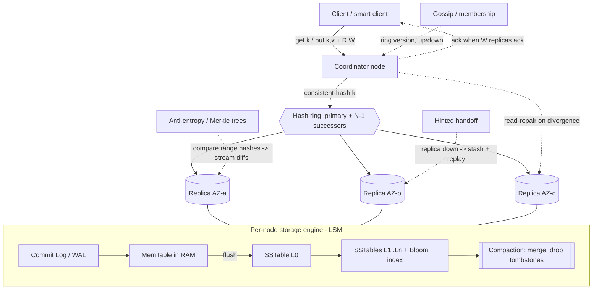

# A17 — Design a Key-Value Store / Distributed Database

This is the canonical distributed-systems interview: build a horizontally-scalable, highly-available key-value store (think Dynamo / Cassandra / Bigtable lineage) that survives node, rack, and datacenter failure. Google asks it because it is the cleanest possible probe of first-principles distributed storage — there is nowhere to hide. The interviewer will push directly on CAP, partitioning, quorum (R + W > N), replication, conflict resolution, and the storage engine. If you can reason these from scratch, you signal Staff; if you name-drop products, you signal L4.

## 1) Clarify — questions to ask the interviewer

- **Data model:** Pure opaque-blob KV (`get(key) -> bytes`), or do we need a column-family / wide-row model (sorted columns per key, range scans) like Bigtable/Cassandra? This single answer changes the storage engine and the API.
- **Access pattern:** Point lookups only, or range scans over ordered keys? Range scans force order-preserving partitioning (or a Bigtable-style tablet model) instead of pure consistent hashing.
- **Consistency requirement:** Is the caller OK with eventual consistency + read-repair (AP, Dynamo-style), or do they need linearizable/strongly-consistent reads (CP, Spanner/Bigtable-style with a consensus group)? This is THE fork in the design.
- **Read/write mix and value size:** Read-heavy (caching layer) vs write-heavy (telemetry/event store)? Average and p99 value size (1 KB vs 1 MB) drives storage-engine and compaction choices.
- **Scale:** How many keys, total bytes, and peak QPS? Single-region or multi-region (and if multi-region, is cross-region a hard latency budget or async replication)?
- **Durability / RPO:** Can we lose the last few milliseconds of acknowledged writes on a crash, or must every ack survive (commit log fsync vs batched)?
- **Multi-tenancy & isolation:** One logical store or many namespaces with per-tenant quotas and noisy-neighbor isolation?
- **Transactions:** Single-key atomicity only, or multi-key / cross-partition transactions (which pulls in 2PC or Spanner-style TrueTime)?

**What the interviewer is signaling:** Whether you understand that "key-value store" is not one design but a *family* selected by two axes — (1) AP vs CP, and (2) hash-partitioned point lookups vs range-partitioned scans. A Staff candidate surfaces these axes in the first three minutes and *picks a point in the space on purpose*, stating the tradeoff out loud. I'll default to a Dynamo-style AP store with tunable consistency, because it most directly exercises quorum, vector clocks, hinted handoff, and Merkle trees — and I'll show the CP variant as an explicit alternative.

## 2) Functional Requirements (FR)

**In scope:**
- `put(key, value)` and `get(key)` with configurable per-request consistency level (ONE / QUORUM / ALL).
- `delete(key)` implemented as a tombstone (deletes must replicate like writes).
- Automatic data partitioning across nodes; the cluster rebalances when nodes are added/removed.
- Replication factor N (default 3) with replicas spread across failure domains (racks/AZs).
- Tunable read/write quorum (R, W) with the R + W > N option for read-your-writes.
- Conflict detection and resolution for concurrent writes (vector clocks; last-write-wins as a fallback).
- Failure handling: detect down nodes, keep serving (hinted handoff), and repair divergent replicas (read-repair + anti-entropy via Merkle trees).
- Background compaction of the on-disk storage engine.

**Out of scope (defer, state explicitly):**
- Secondary indexes / rich query language (we are KV, not SQL).
- Multi-key ACID transactions and cross-partition 2PC (mention as the CP-variant extension).
- Authn/Authz, billing, and full multi-tenancy quotas (assume a trusted internal mesh; add a gateway later).
- Geo-replication conflict semantics beyond per-key vector clocks.

## 3) Non-Functional Requirements (NFR)

| Dimension | Target & rationale |
|---|---|
| Scale | 10 B keys, ~100 TB logical data, 1 M QPS aggregate (e.g., 700 K reads / 300 K writes). Must scale linearly by adding nodes. |
| Latency | p99 `get` < 10 ms intra-region at QUORUM; p99 `put` < 15 ms. Sub-ms is unrealistic once you cross the network for a quorum. |
| Availability | 99.99% for writes even during single-node and single-rack failure. AP default: stay writable under partition (Dynamo's "always writable" goal). |
| Consistency | Tunable. Default eventual with read-repair; R + W > N gives strong-ish read-your-writes. CP mode available per-namespace via a consensus group. |
| Durability | 11 nines effective via N=3 across AZs + per-node commit log fsync (or group-commit). RPO ≈ 0 with synchronous W≥2. |
| Partition tolerance | Mandatory — it is a distributed store; CAP forces us to trade C or A under partition, and we choose A by default. |
| Elasticity | Adding a node moves only ~K/N of the keyspace (consistent hashing), not a full reshuffle. |

## 4) Back-of-envelope estimation

```
Scale assumptions
  keys                 = 10 billion
  avg value            = 10 KB (incl. key + metadata overhead)
  logical data         = 10e9 * 10 KB        = 100 TB
  replication N        = 3
  physical data        = 100 TB * 3          = 300 TB
  + compaction headroom (~2x worst case LSM) => provision ~600 TB

QPS
  peak aggregate       = 1,000,000 QPS
  reads (70%)          = 700,000 QPS
  writes (30%)         = 300,000 QPS
  each QUORUM read     touches R=2 replicas  => ~1.4 M internal read ops/s
  each QUORUM write    touches W=2 (+N=3 send) => ~0.9 M internal write ops/s

Per-node sizing (target ~10 TB usable + NVMe)
  nodes for storage    = 600 TB / 10 TB      = 60 nodes (storage-bound)
  nodes for QPS        = 1.4M+0.9M internal / ~50k ops/node ≈ 46 nodes
  => ~64 nodes, round to 96 for headroom + AZ balance (32 per AZ x 3)

Write throughput / commit log
  300k writes/s * 10 KB                       = 3 GB/s ingest (logical)
  * N=3 replication                            = 9 GB/s across cluster
  per node (96)                                ≈ 94 MB/s sustained write — fine for NVMe

Bandwidth
  read egress  700k * 10 KB                    = 7 GB/s to clients
  cross-AZ replication (W path)                ≈ 6 GB/s internal

Cache / memtable memory
  memtable per node ~2 GB before flush
  bloom filters: 10b keys, ~10 bits/key       ≈ 12.5 GB total, ~130 MB/node
  block cache (hot 1%): 1 TB / 96 nodes        ≈ 10 GB/node RAM
```

## 5) API design

```
# Client-facing (any coordinator node can serve any key)
put(key: bytes, value: bytes, opts{ W=QUORUM, vclock?=context }) -> {version: vclock}
get(key: bytes, opts{ R=QUORUM })                                -> {value | [siblings], vclock}
delete(key: bytes, opts{ W=QUORUM })                             -> {version: vclock}  # writes a tombstone

# get() may return SIBLINGS (multiple concurrent values) — caller resolves and writes back
# with the merged vclock as context, the standard Dynamo shopping-cart pattern.

# Internal node-to-node (gossip + replication mesh)
coordinatorForward(key, op, value, vclock) -> ack
hintedHandoff(targetNode, key, value, vclock)            # store-and-forward when replica is down
merkleTreeExchange(range) -> rootHash                    # anti-entropy
streamRange(range)                                       # bootstrap / repair a new replica
gossip(heartbeat, ring-version, node-status)             # membership + failure detection
```

## 6) Architecture — request & data flow

THE CENTERPIECE. A KV store has no CDN or transcoding tier; the interesting layers are the *ring*, the *coordinator/replica fan-out*, and the *per-node storage engine (LSM)*. Both diagrams below are tailored to that.

### (a) ASCII layered diagram

```
                Clients / app servers (smart client OR thin client)
                                |
                                |  get(k)/put(k,v) + desired R/W
                                v
                   [ Request Router / Coordinator ]   any node; locates owners on the ring
                                |
                                |  consistent-hash(k) -> primary + N-1 successors
                                |  (replicas chosen across distinct AZs/racks)
            +-------------------+--------------------+
            |                   |                    |
            v                   v                    v
     [ Replica node 1 ]   [ Replica node 2 ]   [ Replica node 3 ]     N = 3, one per AZ
      (AZ-a)               (AZ-b)               (AZ-c)
            |  WRITE: append commit log -> memtable; ack when W replicas ack
            |  READ : serve from memtable/block-cache/SSTable; return value+vclock
            v
   ----------------- inside ONE node: the storage engine (LSM-tree) -----------------
        write -> [ Commit Log (WAL, fsync/group-commit) ]  durability first
                          |
                          v
                    [ MemTable (sorted, in-RAM) ]  fast writes, recent data
                          |  flush when full
                          v
            [ SSTable L0 ] [ SSTable L1 ] ... [ SSTable Ln ]   immutable, sorted on disk
                  ^   each SSTable has a Bloom filter + sparse index
                  |
            [ Compaction ]  merges SSTables, drops tombstones/old versions, reclaims space
   ---------------------------------------------------------------------------------

   Cross-cutting control plane (no client traffic):
     [ Gossip / Membership ] --- heartbeats, ring version, node up/down
     [ Hinted Handoff ]       --- replica down? coordinator stashes a hint, replays on recovery
     [ Anti-entropy ]         --- Merkle-tree range hashes compared between replicas -> stream diffs
     [ Read-repair ]          --- on a QUORUM read, if replicas disagree, push newest to stale ones
```

**Write path (W = QUORUM, N = 3):** Client sends `put(k, v)` to any node, which becomes the **coordinator**. It hashes `k` on the consistent-hash ring to find the primary owner and the next N−1 distinct-AZ successors. It forwards the write (with an incremented **vector clock**) to all N replicas in parallel. Each replica appends to its **commit log** (WAL, durably) and updates its in-memory **memtable**, then acks. The coordinator returns success as soon as **W = 2** replicas ack — the 3rd completes asynchronously. If a target replica is down, the coordinator writes a **hinted handoff** to a substitute node and acks anyway (this is why the store stays writable under failure).

**Read path (R = QUORUM):** The coordinator fans the read to N replicas (or the R fastest), each serving from memtable → block cache → SSTables (Bloom filter avoids touching SSTables that can't contain the key). It waits for **R = 2** responses, compares their vector clocks: if one strictly dominates, it returns that value and fires **read-repair** to update the stale replica; if the clocks are **concurrent**, it returns **siblings** for the client to merge. Because R + W = 4 > N = 3, the read and write quorums overlap on ≥1 node, guaranteeing a quorum read sees the latest quorum write.

### (b) Mermaid flowchart



## 7) Data model & storage choices

**Logical model:** `key (bytes) -> { value (bytes), vector_clock, timestamp, tombstone? }`. Optionally a wide-row/column-family variant: `key -> sorted map<column, {value, ts}>` to support range scans (Bigtable/Cassandra style).

**Storage engine — LSM-tree (log-structured merge), justified from first principles:**
- The workload is **write-heavy and append-friendly**. A B-tree does in-place random writes (read-modify-write a page) — expensive on every update. An **LSM** turns every write into a sequential commit-log append + an in-RAM memtable insert, then flushes sorted **SSTables** sequentially. Sequential I/O is ~100× faster than random on disk and far kinder to SSDs (less write amplification per op, better endurance).
- **Reads** check memtable → block cache → SSTables newest-to-oldest; a per-SSTable **Bloom filter** lets us skip SSTables that definitely don't hold the key, so a point read usually touches one SSTable + one disk seek.
- **Cost:** read amplification (a key may live across several SSTables) and space amplification — both bounded by **compaction**.

**Why not a single SQL primary:** it doesn't shard or stay available under partition without bolting on the exact machinery (consistent hashing, quorum, gossip) we're building here. For pure KV at this scale, that machinery *is* the design.

**Metadata / ring state:** the membership ring and token assignments are small and must be consistent — store them via gossip with a versioned ring, or in a small CP coordination service (ZooKeeper/etcd-class) if we want strong membership.

## 8) Deep dive

### 8a) Partitioning — consistent hashing with virtual nodes

Naive `hash(key) % N` remaps almost every key when N changes — catastrophic rebalancing. **Consistent hashing** maps both keys and nodes onto a ring (hash space, e.g., 0..2^64); a key is owned by the first node clockwise. Adding/removing a node moves only ~1/N of keys (the arc between neighbors), not the whole space.

Problem: random placement creates **uneven load** and, when a node leaves, its entire load lands on one neighbor (hotspot). Fix with **virtual nodes (vnodes)** — each physical node owns many small tokens scattered around the ring. Benefits: (1) load smooths out (law of large numbers), (2) when a node dies its load spreads across *many* nodes, and (3) heterogeneous hardware is handled by giving beefier nodes more vnodes. Replicas for a key are the next N **distinct physical nodes** (skip vnodes of the same machine, and prefer distinct AZs) — this is the "preference list."

### 8b) Quorum, consistency, and conflict resolution

- **Quorum math:** with N replicas, choose R and W. **R + W > N** guarantees the read set and write set overlap on at least one replica, so a quorum read observes the latest quorum-acknowledged write. Tuning: `W=N, R=1` = fast reads, slow/fragile writes; `W=1, R=N` = fast writes, must read all; `R=W=2, N=3` = balanced default.
- **Consistency model:** even with R + W > N, this is *not* linearizable (concurrent writers, no global order) — it's "strong enough" read-your-writes plus eventual convergence. For true linearizability you need a **consensus group (Raft/Paxos)** per partition (the CP variant): every write goes through a leader and a majority log — stronger guarantee, higher latency, unavailable when a majority is partitioned away.
- **Conflict resolution — vector clocks:** each value carries a vector clock `{nodeId -> counter}`. On write the coordinating replica increments its entry. Comparing two clocks: if every component of A ≤ B (and one <), A *happened-before* B → keep B. If neither dominates, the writes are **concurrent** → keep both as **siblings** and let the application merge (e.g., set-union a shopping cart) or fall back to **last-write-wins** by timestamp (simple but can silently drop a write). Vector clocks can grow; cap them by pruning the oldest (node, counter) pairs with a timestamp.

### 8c) Failure detection & repair — hinted handoff + Merkle anti-entropy

- **Detection:** nodes **gossip** heartbeats; a node not heard from within a φ-accrual threshold is marked down. Membership and ring version propagate via the same gossip.
- **Hinted handoff (transient failure):** if replica X is down during a write, the coordinator stores the write plus a *hint* ("this belongs to X") on a stand-in node and still acks. When X recovers, the stand-in replays the hint to it. Keeps writes available and bounds the divergence window.
- **Read-repair (cheap, on the hot path):** during a quorum read, if responding replicas disagree, push the newest version to the stale ones — repairs frequently-read keys for free.
- **Anti-entropy with Merkle trees (cold data):** read-repair never touches keys nobody reads. Each replica builds a **Merkle tree** over its key-range (leaves = hashes of key blocks, parents = hashes of children). Two replicas compare **root hashes**; if equal, the whole range is in sync — done in one message. If not, they recurse only down the differing subtrees, so they exchange O(differences) data, not the whole dataset, and stream just the diverged keys. This is what heals replicas after long outages or bootstraps a replacement node.

### 8d) Compaction

SSTables accumulate; the same key may appear in many of them with old versions and tombstones. **Compaction** merges SSTables, keeps the newest version per key, and physically drops tombstones once they're past the GC grace period (must outlive hinted-handoff/anti-entropy windows, else a delete could resurrect). Strategies: **size-tiered** (merge similarly-sized SSTables — write-optimized, higher space amp, good for write-heavy) vs **leveled** (non-overlapping levels — read- and space-optimized, higher write amp, good for read-heavy). Choose per workload; it's the main knob trading write amp vs read amp vs space amp.

## 9) Key tradeoffs

| Decision | Option A | Option B | Choice & why |
|---|---|---|---|
| CAP under partition | AP — always writable, eventual | CP — linearizable, may reject writes | **AP default** (Dynamo lineage); CP per-namespace via consensus group when correctness > availability |
| Partitioning | Consistent hashing (point lookups) | Range/tablet (ordered scans) | **Consistent hashing + vnodes**; switch to range-partitioned tablets if scans are required |
| Consistency tuning | Strong (R+W>N) | Eventual (R=W=1) | **Tunable per request**; default R=W=2,N=3 |
| Conflict resolution | Vector clocks (keep siblings) | Last-write-wins (timestamp) | **Vector clocks** for correctness; LWW as a simple fallback per-namespace |
| Storage engine | LSM-tree | B-tree | **LSM** — sequential writes, SSD-friendly, write-heavy workload |
| Replication | Sync to W, async to rest | Fully sync to N | **Sync W, async remainder** — latency vs durability balance |
| Compaction | Size-tiered | Leveled | Workload-dependent; **leveled for read-heavy, size-tiered for write-heavy** |

## 10) Bottlenecks & failure modes

- **Hot key / hot partition:** a single celebrity key overloads its N replicas. Mitigate: add a per-coordinator **request cache / read-through cache** for hot keys; for hot *writes*, append-and-merge (split the key into shards client-side) or increase that key's replica count. Vnodes prevent hot *partitions* but not a single hot *key*.
- **Coordinator overload / SPOF:** any node can coordinate, so there's no single SPOF, but a hot coordinator can saturate — mitigate with client-side ring awareness (smart client routes straight to a replica) and load-aware routing.
- **Thundering herd on recovery:** a recovered node gets slammed by replayed hints + anti-entropy streams at once. Mitigate: throttle hint replay and bound concurrent Merkle repairs (stream-rate limits).
- **Compaction stall (write stall):** if writes outrun flush+compaction, memtables back up and writes block. Mitigate: rate-limit/backpressure ingest, provision compaction I/O headroom, and alert on L0 SSTable count.
- **Tombstone resurrection:** delete a key, an offline replica misses it, anti-entropy later "repairs" the live copy back. Mitigate: GC grace period > max outage/repair window before purging tombstones.
- **Gossip convergence lag / split membership:** slow gossip → coordinators route to wrong owners during topology change. Mitigate: versioned ring, hand off + retry on the new owner, and a short stabilization window when rebalancing.
- **Quorum unavailability under partition (CP mode):** if a majority is unreachable, CP writes stall by design — surface clearly and let AP namespaces stay up.

## 11) Scale 10x / evolution

- **From 1 M to 10 M QPS / 1 PB:** add nodes; consistent hashing makes this near-linear and only ~1/N of keys move per node added. Watch for **gossip O(n²) chatter** at thousands of nodes — move to a hierarchical/seed-based gossip or a separate membership service.
- **Multi-region:** run a ring per region; replicate **asynchronously** across regions (region-local quorums for latency). Cross-region conflicts resolve via the same vector clocks. Offer a per-key choice of region-local (low latency, eventual) vs global quorum (high latency, stronger).
- **Read amplification at scale:** if SSTable counts and read amp creep up, shift hot tables to leveled compaction and grow block cache; consider tiered storage (hot NVMe / warm SSD / cold object storage) for old SSTables.
- **CP demand grows:** as more workloads need transactions, introduce per-partition **Raft groups** and, for cross-partition transactions, a Spanner-style approach (2PC over Paxos groups + TrueTime-style bounded-clock timestamps for external consistency).
- **Hot-key escalation:** add an automatic hot-key detector that promotes runaway keys into a dedicated cache tier or auto-splits them.

## 12) Interviewer probes & follow-ups

- **"Why R + W > N — prove it gives consistency."** Pigeonhole: a write commits to ≥W replicas, a read contacts ≥R; if R + W > N the two sets must intersect on ≥1 replica that has the latest write, so the read sees it. (Caveat: not linearizable under concurrent writers — only guarantees you observe the latest *acknowledged quorum* write.)
- **"Vector clocks vs last-write-wins?"** LWW is simple but silently drops concurrent writes (clock skew can pick the wrong winner). Vector clocks detect causality and preserve concurrent updates as siblings for app-level merge — correctness over simplicity. Cost: metadata growth (prune old entries).
- **"How do you avoid rebalancing the whole ring when a node joins?"** Consistent hashing: only the arc between the new token and its predecessor moves (~1/N). Vnodes spread even that across many sources, smoothing the transfer.
- **"What does compaction cost and when does it bite?"** Write/space amplification; it competes with foreground I/O. Under write bursts it can stall writes (L0 pileup) — needs I/O headroom and backpressure. Tombstone GC grace must exceed repair windows.
- **"Make it strongly consistent."** Per-partition Raft/Paxos: writes go through a leader + majority log, reads from the leader (or a lease/read-index). Gains linearizability; loses availability when a majority is partitioned away, and adds a round trip.
- **"How do Merkle trees save bandwidth?"** Compare root hashes first — equal means in-sync in one message. On mismatch, recurse only into differing subtrees, so you transfer O(diff) keys instead of the entire range.
- **"A node was offline for an hour — how does it catch up?"** Hinted handoff replays writes buffered during the outage; anti-entropy (Merkle) reconciles anything the hints missed; read-repair fixes hot keys on the fly.
- **"Single-region or multi — and the consistency implication?"** Multi-region uses async cross-region replication with region-local quorums; cross-region reads are eventually consistent unless you pay for a global quorum. State the latency/consistency trade explicitly.

## 13) 60-minute flow cheat-sheet

| Time | Phase | What to do |
|---|---|---|
| 0–6 min | Clarify | Pin the two axes: AP vs CP, hash vs range. State you'll build AP/tunable Dynamo-style, note CP variant. Lock N=3, R=W=2 default. |
| 6–10 min | FR / NFR | put/get/delete + tunable consistency; targets: 1 M QPS, p99<10 ms, 99.99%, 100 TB. |
| 10–14 min | Estimation | QPS read/write, 300 TB physical + compaction headroom, ~96 nodes, commit-log throughput. |
| 14–20 min | High-level + API | Draw the ring → coordinator → N replicas → per-node LSM. Walk read & write quorum paths. |
| 20–38 min | Deep dives | (1) Consistent hashing + vnodes, (2) quorum R+W>N + vector clocks + siblings, (3) hinted handoff + Merkle anti-entropy, (4) LSM + compaction. |
| 38–46 min | Tradeoffs | CAP choice, vector clocks vs LWW, sync-W/async-rest, leveled vs size-tiered. |
| 46–54 min | Failure & bottlenecks | Hot keys, compaction stall, tombstone resurrection, thundering herd on recovery — each with a fix. |
| 54–60 min | 10x / wrap | Multi-region async + region-local quorum, Raft per-partition for CP, tiered storage. Restate the AP/CP fork as the headline decision. |
