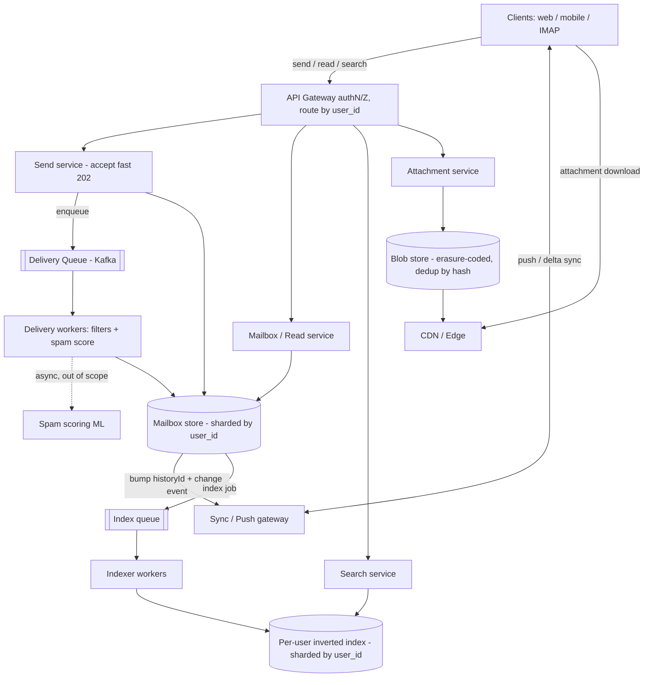

# A18 — Design Gmail / a Large-Scale Email System

Build a web-scale email service: store billions of mailboxes durably, let users send/receive/search/thread messages with low latency, and sync across devices in near-real-time. Google asks this because it fuses three hard subsystems — **distributed storage** (mailbox data), **full-text search/indexing** (per-user inverted index), and **user-facing latency** (interactive inbox + push) — so it tests whether you can decompose a sprawling product into clean, independently-scaled services rather than one monolith.

## 1) Clarify — questions to ask the interviewer

- **Scope of "email":** Just send/receive/store/read/search/thread an interactive inbox, or also the SMTP edge (MX, relay, deliverability), spam/anti-abuse, labels/filters, and calendar? I'd propose: core mailbox + search + threading + sync in scope; SMTP-edge details and the spam ML pipeline scoped *out* (acknowledge as a pipeline, don't design the model).
- **Scale:** How many users (I'll assume ~1.5 B), messages/user, and average + p99 message size (text vs large attachments)?
- **Read/write mix:** Email is **read-heavy and search-heavy** — users open/scroll/search far more than they send. Confirm so I optimize the read and index paths hardest.
- **Latency targets:** Inbox open and search should feel instant (p99 < 200 ms). Send can be async (accept fast, deliver in background). Confirm send is "accept-then-deliver."
- **Consistency:** Is read-your-writes within a mailbox required (you must see a message you just sent/read-flagged immediately) while cross-user delivery can be eventually consistent (seconds)? I'll assume yes — strong *per-mailbox*, eventual *cross-mailbox*.
- **Sync protocol:** Native IMAP/POP compatibility required, or our own push/sync protocol (delta sync) for first-party clients, with an IMAP gateway bolted on?
- **Attachments:** Max size, dedup expectations (the same 10 MB deck mailed to 500 people — store once?), retention.
- **Compliance/retention:** Hard-delete vs trash-with-grace, legal hold, per-region data residency.

**What the interviewer is signaling:** Whether you can **decompose** a giant product into separable services (storage, index, threading, delivery, sync, attachments) each with its own data model and scaling story, AND pick the right partition key. The single most important early statement: **shard everything by user_id** so a mailbox + its index + its sync state are co-located and a query never fans out across the fleet. A Staff candidate says that in minute two and defends it.

## 2) Functional Requirements (FR)

**In scope:**
- Send a message (accept fast, deliver asynchronously to recipients).
- Receive/deliver into recipient mailboxes; apply user filters/labels on delivery.
- Read a message; list/scroll the inbox and folders/labels; mark read/star/archive/trash.
- **Full-text search** over a user's mail (from/to/subject/body, with operators) returning ranked results fast.
- **Threading** (group a conversation; reply chains collapse into one thread).
- **Sync/push** to multiple devices in near-real-time (new mail appears, flags converge).
- **Attachments**: upload, store, dedup, download/preview.

**Out of scope (defer, state explicitly):**
- SMTP-edge mechanics: MX records, greylisting, SPF/DKIM/DMARC, outbound deliverability/IP-reputation.
- The **spam / phishing ML model** itself — we wire in a scoring service as an async stage; we don't design the classifier.
- Rich features: calendar, chat, smart-compose, ads targeting.
- E2E encryption semantics (mention as a constraint that would break server-side search).

## 3) Non-Functional Requirements (NFR)

| Dimension | Target & rationale |
|---|---|
| Scale | ~1.5 B users; assume 20 K messages/user avg ⇒ ~3×10^13 messages; tens of PB of mail + attachments. |
| Latency | Inbox open p99 < 200 ms; search p99 < 300 ms; send *accept* < 100 ms (delivery async, seconds). |
| Availability | 99.99% for read/inbox; sending degrades gracefully (queue + retry) rather than failing the user. |
| Consistency | **Strong/read-your-writes per mailbox** (your own reads, flags, sends are immediately visible); **eventual cross-mailbox** delivery (seconds). |
| Durability | 11 nines — *never lose a delivered email*. Replicated storage + WAL; attachments in replicated/erasure-coded blob store. |
| Read/write mix | Heavily read- and search-skewed; optimize index + read path; writes (sends) are comparatively rare and async. |
| Security/privacy | Per-user isolation, encryption at rest/in transit, strict authz; per-region residency where required. |

## 4) Back-of-envelope estimation

```
Users / volume
  users                 = 1.5 B
  msgs/user (avg)       = 20,000
  total messages        = 1.5e9 * 2e4        = 3e13 messages
  avg msg size (text)   = 50 KB (headers+body, attachments separate)
  mail text storage     = 3e13 * 50 KB       = 1.5 EB logical
    (most is cold; tiered storage + compression ~3x => ~0.5 EB hot+warm physical/replica-adjusted)
  attachments           = ~75% of bytes; dedup'd in blob store, erasure-coded (1.4x not 3x)

Throughput
  emails sent/day       = 1.5e9 users * ~30 sent/day ≈ 4.5e10/day ≈ 520k sends/s avg, ~1.5M peak
  reads/opens           ~ 10x sends            ≈ 5–15 M read ops/s peak
  search queries        ~ 1–2 per active user/day; assume 300k–800k QPS peak

Index
  index ~ 30% of text size (postings + terms) ≈ hundreds of TB of per-user inverted indexes
  built async on delivery; near-real-time (seconds) visibility

Connections / sync (push)
  concurrent connected devices (long-poll/WS): assume 200 M peak
  per gateway ~1 M conns  => ~200 gateway nodes for push/sync fan-in

Bandwidth
  attachment egress dominates; CDN-front previews/downloads
  delivery write path: 1.5M sends/s * (fan-out avg ~2 recipients) * 50 KB ≈ 150 GB/s internal peak
```

## 5) API design

```
# Client (first-party push/sync client; IMAP gateway translates to these)
sendMessage(from, [to,cc,bcc], subject, body, [attachmentIds]) -> {messageId, threadId}   # 202 accept
getMessage(messageId)                                          -> {message, threadId, labels}
listMailbox(folder|label, cursor, limit)                       -> {threadHeaders[], nextCursor}
search(query, cursor, limit)                                   -> {rankedThreadHeaders[], nextCursor}
modifyMessage(messageId, addLabels[], removeLabels[], read?)   -> {ok}     # star/archive/trash/read
getThread(threadId)                                            -> {messages[] in order}

# Attachments (separate blob path)
initAttachmentUpload(size, contentType)  -> {uploadUrl, attachmentId}   # client PUTs to blob/CDN
getAttachment(attachmentId)              -> {downloadUrl}               # signed URL

# Sync / push (delta)
syncStream(deviceId, sinceHistoryId)     -> stream of {changes...}      # long-poll / WebSocket
# server assigns a monotonically increasing historyId per mailbox; client says "give me >= X"

# Internal
deliver(recipientUserId, message)        # async worker writes to mailbox + enqueues index
enqueueIndex(userId, messageId)          # async indexer builds inverted index
scoreSpam(message) -> {score}            # async stage; out-of-scope model behind this call
```

## 6) Architecture — request & data flow

THE CENTERPIECE. Email's distinctive layers are the **async delivery pipeline**, the **per-user inverted index**, the **attachment/blob+CDN path**, and a **push/sync gateway** holding device connections. Both diagrams are tailored to that — note send is async, read/search are synchronous and latency-critical.

### (a) ASCII layered diagram

```
                 Clients (web / mobile / IMAP & POP clients)
                          |                          ^
            send/read/search (HTTPS)        push/sync (WebSocket / long-poll)
                          v                          |
                    [ CDN / Edge ]  attachment downloads + static assets cached at edge
                          |
                          v
                 [ Global LB / GeoDNS ]  route to nearest region holding the user's shard
                          |
                          v
                 [ API Gateway ]  authN/Z (OAuth), rate-limit, route by user_id
            /            |              |               \            \
           v             v              v                v            v
   [ Send svc ]   [ Mailbox/Read ]  [ Search svc ]  [ Sync/Push   ]  [ Attachment ]
   (accept fast)  (list/get/flags)  (query index)   gateway (conns)  svc (blob)
        |               |                |                ^                |
        | enqueue       | read           | read           | notify         | put/get
        v               v                v                |                v
   [ Delivery Queue ]   |          [ Per-user INVERTED   ]|         [ Blob store ]
   (Kafka)              |          [ INDEX shards        ]|         (erasure-coded,
        |               |           (sharded by user)    |          dedup by hash)
        v               |                ^                |
   [ Delivery workers ] |                | async build   |
     - run filters      |                |               |
     - call spam score -+--(out of scope ML)             |
     - write to mailbox v                |               |
        +-----> [ MAILBOX STORE ] -------+               |
                 (per-user, sharded by user_id;          |
                  LSM/wide-row: messages, threads,        |
                  labels, flags, historyId)               |
                      |  on new write: bump historyId,     |
                      |  emit change event ----------------+--> Sync gateway pushes delta to devices
                      v
                 [ Index queue ] --> [ Indexer workers ] --> per-user inverted index
```

**Send path (async, accept-then-deliver):** Client calls `sendMessage`; the **Send service** validates, writes the message to the sender's "Sent" mailbox (so they see it immediately — read-your-writes), enqueues a delivery job on **Kafka**, and returns **202** in < 100 ms. **Delivery workers** consume the queue, run the recipient's **filters/labels**, call the (out-of-scope) **spam-scoring** stage, and write the message into each recipient's **mailbox store** (sharded by `user_id`). Each mailbox write **bumps a per-mailbox `historyId`** and emits a change event, which (a) enqueues an **index** job and (b) signals the **sync gateway** to push the new mail to that user's connected devices. Decoupling send from delivery is what keeps the user-facing send fast and absorbs spikes.

**Read / list / search path (synchronous, latency-critical):** `listMailbox`/`getMessage` hit the **Mailbox/Read service**, which reads the user's shard (recent mail is in cache/memtable). `search` hits the **Search service**, which queries that user's **inverted-index shard** (co-located by `user_id`, so no fleet-wide fan-out), ranks results, and returns thread headers. Attachment bodies are served from the **blob store via CDN** with signed URLs, never inline through the API tier. Everything for one user lives in one shard ⇒ p99 stays low.

**Sync/push path:** Devices hold a long-lived connection to a **sync gateway** and remember the last `historyId` they saw. On any mailbox change, the gateway streams the **delta** (changes since that `historyId`) so devices converge in near-real-time; on reconnect, the device replays from its stored `historyId` (resumable, idempotent).

### (b) Mermaid flowchart



## 7) Data model & storage choices

- **Mailbox store (per-user, sharded by `user_id`) — wide-row / LSM KV (Bigtable/Cassandra-class).** Row key `user_id`; columns/sub-rows for messages, thread membership, labels, flags, and a monotonically increasing `historyId`. Why: email is append-heavy on delivery and read-heavy on access; an LSM gives cheap sequential writes and good scans of recent mail, and co-locating everything for a user under one key kills cross-shard fan-out. SQL doesn't shard to EB cleanly and would force joins across the fleet.
  - `messages`: `{messageId, threadId, headers(from,to,subject,date), bodyRef, size, flags, labels[], spamScore}`
  - `threads`: `{threadId -> ordered messageId[]}`
  - `mailbox_meta`: `{historyId, quota, counters}`
- **Inverted index (per-user, sharded by `user_id`) — search engine shards (Lucene-class).** `term -> postings(messageId, positions, field)` *scoped to one user*. Built **async** off the delivery event; near-real-time visibility (seconds). Per-user scoping means each search touches a single small index, not a global one — the key to fast, isolated search. Ranking: recency + field weighting (subject/from > body) + relevance.
- **Attachments — blob/object store, erasure-coded, content-addressed.** Store by `hash(content)` so the same file mailed to many recipients is **stored once (dedup)** and each mailbox holds a reference + ACL. Erasure coding (~1.4× overhead) instead of 3× replication since blobs are immutable and huge. Served via CDN with signed, expiring URLs.
- **Why not store bodies in the mailbox row:** large/variable bodies bloat the row store and hurt scans; keep small text inline, large bodies/attachments as `bodyRef` into blob storage.

## 8) Deep dive

### 8a) Search indexing — per-user inverted index, built asynchronously

The crux of "Gmail-fast search." A global inverted index over all mail would make every query a massive fan-out + relevance merge across thousands of shards — too slow and impossible to isolate per user. Instead, **partition the index by `user_id`**: each user's mail has its own inverted index living on the same shard as their mailbox. A search then hits **one shard**, so p99 is bounded by a single index lookup, and one heavy user can't slow another.

- **Pipeline:** on delivery, the mailbox write emits an index job → **indexer workers** tokenize/normalize (lowercase, stem, strip stopwords selectively — but keep enough for phrase/operator search), then update that user's postings. This is **async**, so it never blocks delivery; visibility lag is seconds (acceptable — you rarely search for an email the instant it lands).
- **Index structure:** `term -> [postings]` where a posting is `{messageId, field, positions}`; positions enable phrase queries; per-field postings enable `from:`/`subject:` operators. Segments are immutable and **merged** in the background (LSM-like compaction for the index).
- **Ranking:** combine recency (email is time-dominant), field weights, and term frequency; default sort is usually reverse-chronological with relevance as a tiebreaker.
- **Consistency note:** index is eventually consistent vs the mailbox; the mailbox itself is the source of truth, so a just-arrived message is *readable* immediately even if not yet *searchable*.

### 8b) Threading — grouping a conversation correctly

Email threading is non-trivial because clients are inconsistent. Use a layered approach:
- **Primary signal:** RFC `Message-ID`, `In-Reply-To`, and `References` headers form a reply DAG — link a new message to its parent thread by walking `References`.
- **Fallback heuristics** (for clients that drop headers): normalized subject (strip `Re:`/`Fwd:` and locale prefixes) + participant set + time proximity.
- **Storage:** maintain `threadId -> ordered messageId[]` in the mailbox row; on delivery, resolve the thread (header lookup, then heuristic) and append. Threading is **per-mailbox** (your view of the thread), so it's computed on the recipient's shard — another win from sharding by user.

### 8c) Push / sync — the historyId delta model (IMAP-like, modernized)

Polling billions of mailboxes is wasteful; instead each mailbox has a **monotonic `historyId`** bumped on every change (new message, flag change, label, delete). Devices hold a connection to a **sync gateway** and remember the last `historyId` they applied. On change, the gateway pushes only the **delta since that id**; on reconnect, the device requests `changes >= storedHistoryId` and replays — **idempotent and resumable**, so flaky mobile networks converge correctly. This is the same contract IMAP's `MODSEQ`/`CONDSTORE` provides; an **IMAP gateway** translates legacy clients onto it. For devices that are offline, changes are simply the gap they replay on next connect (the mailbox store *is* the durable offline queue).

## 9) Key tradeoffs

| Decision | Option A | Option B | Choice & why |
|---|---|---|---|
| Partition key | By `user_id` (mailbox + index co-located) | By message / global index | **By `user_id`** — single-shard reads & search, perfect isolation; cross-user delivery handled async |
| Send semantics | Async accept-then-deliver | Synchronous end-to-end | **Async** — fast accept, absorbs spikes, retries; per-mailbox read-your-writes preserved |
| Search index scope | Per-user index | Global inverted index | **Per-user** — bounded query cost, no fleet fan-out, tenant isolation |
| Index freshness | Async (eventual, seconds) | Sync on write | **Async** — never block delivery; mailbox is source of truth for immediate reads |
| Attachment storage | Blob + dedup + erasure coding | Inline in mailbox row | **Blob, content-addressed** — dedup the same file across recipients, 1.4× not 3× |
| Consistency | Strong per-mailbox / eventual cross-mailbox | Globally strong | **Mixed** — correctness where the user notices, eventual where they don't |
| Sync | historyId delta push | Full periodic poll | **Delta push** — scales to billions of mailboxes, resumable on reconnect |

## 10) Bottlenecks & failure modes

- **Hot mailbox (mailing list / celebrity):** a list address receiving millions/day overloads one shard. Mitigate: split high-volume addresses into sub-shards, or treat list traffic via a fan-out service; cache hot reads.
- **Indexer lag / backlog:** a delivery burst backs up the index queue → search shows stale results. Mitigate: autoscale indexers off queue depth, prioritize recent mail, surface "search may be a few seconds behind." Mailbox stays correct regardless.
- **Delivery queue backpressure:** spam storms or a downstream-store slowdown back up Kafka. Mitigate: partitioned topics by recipient shard, dead-letter + retry with backoff, shed/deprioritize bulk senders.
- **Attachment thundering herd:** a viral attachment (everyone opens it at once) hammers the blob store. Mitigate: CDN caching of the content-addressed blob (one cache fill serves all), signed URLs.
- **Sync gateway connection storm:** a regional reconnect (deploy/restart) reconnects millions of devices at once. Mitigate: connection draining, jittered reconnect backoff, gateways stateless behind a registry so any node can resume from `historyId`.
- **Mailbox-store hot partition on writes:** delivery write amplification (filters + index + sync events). Mitigate: batch writes, async the index/sync emission, provision LSM compaction headroom.
- **Spam stage as a soft SPOF:** if the (out-of-scope) scorer is down, don't block mail. Mitigate: time-box the call, fail-open to "unscored/deliver-to-spam-later," reconcile asynchronously.
- **Cross-region failover & residency:** user's home region down. Mitigate: async-replicate mailboxes to a secondary region; honor data-residency by pinning the home region and replicating only where allowed.

## 11) Scale 10x / evolution

- **Volume 10×:** sharding by `user_id` scales horizontally — add shards and rebalance via consistent hashing; the per-user model means no query gets more expensive as the fleet grows.
- **Cold storage tiering:** most mail is never reopened — tier old messages/attachments to cheaper, colder, more-compressed storage (hot NVMe → warm SSD → cold object/erasure-coded archive), keeping only recent mail hot. This is where the EB-scale cost is actually controlled.
- **Index cost:** per-user indexes grow with mail; merge/compact aggressively, tier cold-segment indexes, and consider lazy/partial indexing of very old mail (index-on-first-search).
- **Multi-region active-active:** as users go global, replicate mailboxes across regions with async cross-region sync and region-local reads; resolve cross-region flag conflicts via `historyId`/timestamps.
- **Smarter features:** smart-compose, priority inbox, and semantic search bolt on as additional async consumers of the same delivery event — they don't touch the core read path (clean extension point).
- **What breaks first:** the **index pipeline** under bursty load and **cold-storage cost** — both addressed by async autoscaling + tiering rather than re-architecting the core.

## 12) Interviewer probes & follow-ups

- **"Why shard by user_id and not by message?"** A mailbox, its index, its threads, and its sync state are always accessed *together for one user*; co-locating them makes every read/search a single-shard op with perfect tenant isolation. Message-level sharding would scatter a user's mail and force fan-out on every list/search.
- **"How is send fast if delivery is heavy?"** Accept-then-deliver: write to Sent (read-your-writes), enqueue, return 202; workers do filters/spam/fan-out off the hot path with retries. The user never waits on delivery.
- **"How does search stay fast over 20 K messages?"** The query hits one per-user inverted index, not a global one; recency-weighted ranking; immutable segments merged in the background. Bounded by a single index lookup.
- **"Real-time sync across devices — how, exactly?"** Per-mailbox monotonic `historyId`; gateway pushes deltas since the device's last id; reconnect replays from the stored id — idempotent, resumable, no polling.
- **"How do you thread reliably when headers are missing?"** Primary on `References`/`In-Reply-To`; fallback to normalized-subject + participants + time window; thread state stored per-mailbox.
- **"Same 10 MB attachment to 500 people — storage?"** Content-addressed blob: store once by `hash(content)`, each mailbox holds a reference + ACL; erasure-coded, served via CDN.
- **"What if the spam service is down?"** Time-box and fail-open — never block legitimate mail; score asynchronously and reclassify later. Spam pipeline is explicitly out of scope as a model.
- **"Consistency model?"** Strong/read-your-writes *within a mailbox* (your sends, reads, flags); eventual *across mailboxes* (delivery in seconds) and for the search index. Mailbox store is the source of truth for immediate reads.
- **"How do you keep p99 inbox-open low?"** Single-shard read, recent mail in cache/memtable, headers separated from bodies, attachments off-path via CDN.

## 13) 60-minute flow cheat-sheet

| Time | Phase | What to do |
|---|---|---|
| 0–6 min | Clarify | Scope core mailbox+search+threading+sync; defer SMTP edge & spam model. State **shard by user_id**, async send, strong-per-mailbox consistency. |
| 6–10 min | FR / NFR | send/receive/read/list/search/thread/sync/attachments; p99<200 ms read, send-accept<100 ms, 11 nines durability. |
| 10–14 min | Estimation | 1.5 B users, ~3e13 msgs, EB-scale tiered, ~520 K sends/s avg, search QPS, push connections. |
| 14–20 min | High-level + API | Draw async delivery pipeline + per-user mailbox + per-user index + sync gateway + blob/CDN. Walk send vs read/search vs sync. |
| 20–38 min | Deep dives | (1) Per-user inverted index built async, (2) threading via headers+heuristics, (3) historyId delta push/sync (IMAP-like). |
| 38–46 min | Tradeoffs | Shard key, async send, per-user vs global index, attachment dedup/erasure coding, mixed consistency. |
| 46–54 min | Failure & bottlenecks | Hot mailbox, indexer lag, queue backpressure, attachment herd, sync reconnect storm — each with a fix. |
| 54–60 min | 10x / wrap | Cold-storage tiering (the cost lever), multi-region async, index compaction. Restate **shard-by-user_id** as the headline. |
