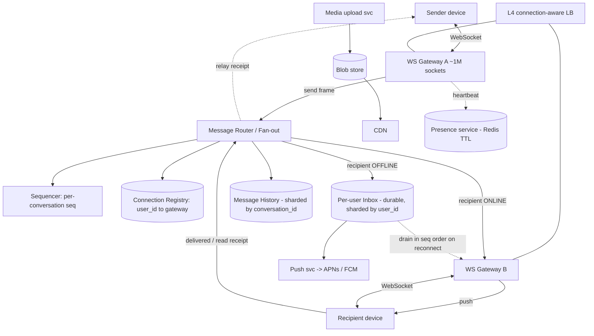

# A19 — Design a Chat / Messenger System (WhatsApp / Messenger)

Build a real-time messaging platform: 1 M+ concurrent persistent connections, sub-second delivery, ordering, read receipts, offline delivery, group chat, and presence — across mobile networks that constantly drop. Google asks this because it is the canonical **stateful-connection-at-scale** problem: unlike a request/response service, the server must hold millions of live sockets, know *which gateway* every user is on, and **push** to them. It tests connection management, fan-out, ordering, and delivery guarantees over an unreliable network.

## 1) Clarify — questions to ask the interviewer

- **1:1 only, or group chat too — and group size?** Small groups (≤256) fan out on write; "broadcast/channel" scale (100 K+ members) needs fan-out-on-read. This changes the fan-out design fundamentally.
- **Delivery guarantee:** At-least-once with client dedup (the practical default), or exactly-once? And which receipts — sent / delivered / read (the WhatsApp ticks)?
- **Ordering:** Per-conversation ordering (messages within a chat in a consistent order for all participants) — required. Global ordering across chats — not needed. Confirm.
- **Persistence:** Store-and-forward only until delivered (then drop, WhatsApp-style), or full searchable history forever (Messenger-style)? Hugely changes storage size and the data model.
- **Scale:** Peak **concurrent connections** (I'll assume ~1 M+ for the prompt, design for 100 M+), messages/day, average message size, group fan-out distribution.
- **Latency:** p99 end-to-end delivery target (I'll target < 500 ms when both online); presence freshness (seconds is fine).
- **Media:** Images/video/voice — sent inline or via a separate blob/CDN upload path (yes, separate)?
- **Encryption:** E2E (Signal protocol) required? If so, the server is a blind relay — it can't read/search content, which constrains server-side features. Assume metadata-only server.
- **Multi-device:** One device per user or many (phone + web + tablet) with sync across all?

**What the interviewer is signaling:** Whether you grasp that the hard part is **statefulness** — you can't load-balance a push the way you load-balance a GET. The make-or-break early insight: a **connection registry** mapping `user_id -> {gateway, connection}` so any sender's message can be routed to the exact gateway holding the recipient's live socket, plus a **durable per-user inbox** so offline users still receive. A Staff candidate draws the gateway + registry + inbox triangle in the first few minutes and reasons about ordering and delivery guarantees explicitly.

## 2) Functional Requirements (FR)

**In scope:**
- Establish a persistent connection (WebSocket) and authenticate; maintain presence (online/last-seen/typing).
- Send/receive **1:1** messages in real-time with **sent / delivered / read** receipts.
- **Per-conversation ordering** consistent across participants.
- **Offline delivery:** messages for a disconnected user are queued durably and delivered on reconnect (+ push notification to wake the app).
- **Group chat** (fan-out to all members; receipts per member).
- **Message history** (sharded), retrievable with pagination.
- **Multi-device** sync (a message reaches all of a user's devices; read state converges).

**Out of scope (defer, state explicitly):**
- The cryptographic internals of **E2E encryption** (assume Signal-style; server is a relay of ciphertext + metadata).
- Voice/video **calling** (WebRTC signaling could reuse the connection layer — mention, don't design).
- Rich media transcoding (handled by a separate blob/CDN upload path; we reference it).
- Spam/abuse ML, full-text search over history (especially impossible under E2E).

## 3) Non-Functional Requirements (NFR)

| Dimension | Target & rationale |
|---|---|
| Scale | 100 M+ concurrent connections target (prompt says 1 M+); 100 B messages/day class; design for horizontal connection scaling. |
| Latency | p99 end-to-end delivery < 500 ms when both online; send-ack < 100 ms; presence/typing freshness ~ seconds. |
| Availability | 99.99%; a gateway crash must not lose messages (durable inbox) — reconnect to another gateway transparently. |
| Delivery guarantee | **At-least-once** with client-side dedup by `messageId`; ordered per conversation. Exactly-once is impractical over flaky networks. |
| Consistency | Eventual across devices; **ordering strong per conversation**; receipts eventually converge. |
| Durability | Messages durable until acked-delivered (store-and-forward); history durable if persistence is on. |
| Connection efficiency | ~1 M sockets per gateway node; minimal per-connection memory/heartbeat overhead. |

## 4) Back-of-envelope estimation

```
Connections
  target concurrent conns   = 100,000,000 (design); prompt floor 1,000,000
  conns per gateway         = ~1,000,000 (tuned epoll/event-loop node, ~few KB/conn)
  gateways for 100M         = 100M / 1M           = 100 gateway nodes (+headroom -> ~150)
  per-conn heartbeat        = 1 ping / 30 s -> 100M/30 = ~3.3 M pings/s spread across 100 nodes

Message volume
  messages/day              = 100 B                = 1.15 M msg/s avg, ~3-5 M peak
  avg message size          = 200 bytes (text + metadata)
  fan-out: 1:1 doubles deliveries; groups multiply by member count
  group factor (avg)        ~ 5x deliveries        => ~6 M deliveries/s avg peak ~20-30 M

Storage (if persisting history)
  100B msgs/day * 200 B     = 20 TB/day raw text
  * replication 3           = 60 TB/day
  /year                     ≈ 22 PB/yr (text); media in blob/CDN separately (dominant bytes)
  store-and-forward only    => store ~undelivered backlog (orders of magnitude smaller)

Inbox / queue
  offline backlog: assume 20% users offline holding ~100 msgs each undelivered
  = 20M users * 100 * 200 B  ≈ 400 GB resident undelivered (cheap, sharded by user)

Bandwidth
  delivery: 6 M deliveries/s * 200 B ≈ 1.2 GB/s text (peak several GB/s)
  media handled out-of-band via CDN (the heavy bytes never traverse chat gateways)
```

## 5) API design

```
# Connection (persistent, WebSocket)
CONNECT  ws://chat  Authorization: <token>, deviceId   -> {sessionId}   # registry records user->gateway
HEARTBEAT (ping/pong every ~30s)                                          # liveness + NAT keepalive

# Over the socket (bidirectional frames)
-> send      {clientMsgId, conversationId, [recipients|groupId], payload, ts}
<- ack       {clientMsgId, serverMsgId, seq}             # server assigns ordered seq + durable id
<- message   {serverMsgId, conversationId, sender, payload, seq, ts}
-> receipt   {serverMsgId, type: delivered|read}
<- receipt   {serverMsgId, type, byUserId}               # relayed to original sender
-> presence  {status: online|typing|away}
<- presence  {userId, status, lastSeen}

# History / media (plain HTTPS, not over the socket)
GET  /history/{conversationId}?cursor=&limit=            -> {messages[], nextCursor}
POST /media/initUpload {size, type}                      -> {uploadUrl, mediaId}   # PUT to blob/CDN
GET  /media/{mediaId}                                    -> {signedUrl}

# Internal
route(serverMsgId, recipientUserId)   # look up registry; push to recipient's gateway OR write inbox
pushNotify(userId, msg)               # APNs/FCM when user offline (wake the app)
```

## 6) Architecture — request & data flow

THE CENTERPIECE. A chat system's distinctive layers are the **WebSocket gateways** (holding live sockets), the **connection registry** (user → gateway), a **router/fan-out** service, durable **per-user inboxes** (offline queue), a **sequencer** (ordering), and a **push** path (APNs/FCM). Both diagrams are tailored to that — note delivery is server-push, not pull.

### (a) ASCII layered diagram

```
        Sender (mobile/web)                              Recipient (mobile/web)
              |  persistent WebSocket                            ^  persistent WebSocket
              v                                                  |
     [ L4 LB / connection-aware ]  sticky to a gateway; resumable on reconnect
              |                                                  |
              v                                                  |
   ======== WebSocket Gateway A ========          ======== WebSocket Gateway B ========
   holds ~1M live sockets; auth on connect         holds recipient's live socket
              |  on send frame                                  ^  push frame
              v                                                  |
        [ Message Router / Fan-out service ] <-----------------+
              |        |                 \                       (deliver to recipient's gateway)
              |        |                  \-- group? expand members (fan-out-on-write small groups)
              |        v
              |  [ Connection Registry ]   user_id -> {gatewayId, connId, deviceIds}
              |  (Redis / gossip; TTL + heartbeat refresh)
              v
        [ Sequencer ]  assign per-conversation monotonic seq (ordering)
              |
              +--> recipient ONLINE  -> route to their gateway -> push -> device acks "delivered"
              |
              +--> recipient OFFLINE -> write [ Per-user INBOX ] (durable queue, sharded by user_id)
              |                              |
              |                              +--> [ Push svc ] -> APNs / FCM (wake app)
              |                              on reconnect: drain inbox in seq order
              v
        [ Message History store ]  sharded by conversation_id (LSM/wide-row; pagination)
              ^
              | media references only; bytes go out-of-band:
        [ Media upload svc ] -> [ Blob store ] -> [ CDN ]  (images/video/voice never cross gateways)

   Presence: gateways heartbeat -> [ Presence service ] (Redis, TTL); fan presence to subscribers.
```

**Send path (1:1, both online):** Sender's frame arrives on **Gateway A**. The **Router** assigns a durable `serverMsgId` and asks the **Sequencer** for the next per-conversation `seq` (ordering). It acks the sender (single-tick `sent`). It looks up the recipient in the **Connection Registry** (`user_id -> {gatewayId, connId}`), finds them on **Gateway B**, and forwards the message; Gateway B pushes it down the recipient's socket. The recipient's device sends a **delivered** receipt back up, which the router relays to the original sender (double-tick `delivered`). When the recipient *opens* the chat, a **read** receipt flows the same way (blue double-tick `read`). The message is also persisted to the **history store** (sharded by `conversation_id`).

**Send path (recipient offline):** Registry lookup misses (no live socket) → the router writes the message to the recipient's **durable per-user inbox** (offline queue, sharded by `user_id`) and triggers a **push notification** via APNs/FCM to wake the app. On reconnect, the recipient's new gateway **drains the inbox in `seq` order**, delivering everything missed, then the device acks delivered for each. This store-and-forward inbox is what makes delivery reliable across flaky mobile networks.

**Group send:** The router expands the group membership. For **small groups** (≤ a few hundred) it **fans out on write** — replicate the message into each member's delivery path (online → their gateway; offline → their inbox). For **huge groups/broadcast**, it switches to **fan-out on read** (write once to a group log; members pull on open) to avoid write amplification. Receipts are tracked per member.

**Reconnect / resilience:** Sockets die constantly. The client reconnects (LB may land it on a *different* gateway), re-registers in the registry, and resumes from its last-seen `seq`; the inbox covers the gap. Gateways are stateless beyond the live socket — the registry + inbox hold the truth — so a gateway crash loses no messages.

### (b) Mermaid flowchart



## 7) Data model & storage choices

- **Connection registry — in-memory KV (Redis/hash ring or gossip), ephemeral.** `user_id -> {gatewayId, connId, deviceIds[], lastHeartbeat}` with a short TTL refreshed by heartbeats; on disconnect the entry expires. Must be **fast (sub-ms)** because every single message does a registry lookup. Not durable — it's live state, rebuilt on reconnect.
- **Per-user inbox (offline queue) — durable KV / log, sharded by `user_id`.** `user_id -> ordered [undelivered messages]`. Append on send-while-offline, drain on reconnect, delete on delivered-ack (store-and-forward). Sharding by `user_id` makes "drain my inbox" a single-shard scan.
- **Message history — wide-row / LSM store, sharded by `conversation_id`.** Row key `conversation_id`, clustering key `seq` (ascending) → messages ordered and paginated within a chat by a single-shard range scan. LSM because writes are append-heavy and reads are recent-skewed. Choose `conversation_id` (not `user_id`) so a group's messages live together and load a chat in one place.
- **Presence — in-memory KV with TTL (Redis).** `user_id -> {status, lastSeen}`; TTL expiry = went offline. Cheap, approximate, fanned to subscribers.
- **Media — blob/object store + CDN, content-addressed.** Images/video/voice uploaded directly to blob via signed URL, referenced by `mediaId` in the message; bytes never traverse the chat gateways (which must stay lean to hold millions of sockets).
- **Why not SQL for messages:** the access pattern is append + ordered range-scan per conversation at enormous write rate — exactly what an LSM wide-row store does well and a single SQL primary does not.

## 8) Deep dive

### 8a) Connection management at 1M+ — gateways, registry, reconnect

A persistent-connection service is fundamentally different from request/response: the server **holds state** (a live socket per user) and must **push**. Design points:
- **Gateways** are event-loop nodes (epoll/`kqueue`) tuned to hold ~1 M sockets each (a few KB/conn: buffers + heartbeat timer). They do auth on connect, frame parsing, and heartbeat; they keep almost no business logic so they stay lean and crash-cheap.
- **Connection registry** is the linchpin: every message routes via `user_id -> gateway` lookup, so it must be sub-ms and horizontally scaled (sharded Redis or a gossip map). Entries carry a **TTL refreshed by heartbeat**, so a dead gateway's entries self-expire and stale routes don't persist.
- **Reconnect handling:** the LB may place a reconnecting client on a *different* gateway; it re-registers, and the **inbox** replays anything missed since its last acked `seq`. Because gateways hold no durable state, a gateway crash just triggers mass reconnects to survivors — no message loss (the inbox + history are the durable truth).
- **Heartbeats** double as NAT/firewall keepalive (mobile carriers reap idle connections) and liveness detection; miss N pings → mark offline → expire registry entry → presence flips.

### 8b) Ordering and delivery guarantees

- **Per-conversation ordering:** assign a **monotonic `seq` per `conversation_id`** at the sequencer (a single owner per conversation, e.g., hashed to a shard, hands out increasing sequence numbers). All participants render by `seq`, so everyone sees the same order even if network delivery reorders. Global cross-chat order is unnecessary and would be a needless bottleneck.
- **At-least-once + idempotent dedup:** the client attaches a `clientMsgId`; the server maps it to a durable `serverMsgId` and returns it in the ack. Retries (client resends on missing ack, or inbox redelivers on reconnect) are **deduped by `serverMsgId`** on the receiver — so the user never sees a duplicate even though the wire is at-least-once. Exactly-once on the wire is impractical over mobile; at-least-once + dedup gives the same *user-visible* guarantee cheaply.
- **Receipts as messages:** `delivered`/`read` are just small control messages routed back to the sender via the same registry path; they converge eventually and tolerate reordering (read implies delivered).

### 8c) Fan-out strategy — write vs read, by group size

The fan-out decision mirrors the news-feed problem:
- **Small groups (fan-out on write):** on send, replicate the message into each member's delivery path immediately (online members → their gateway; offline → their inbox). Read is then trivial (already in your inbox/history). Cost: write amplification = group size — fine up to a few hundred.
- **Large groups / broadcast channels (fan-out on read):** write the message **once** to a shared group log; members **pull** it when they open the chat (or get a lightweight "new in group X" nudge). Avoids multiplying a single send into 100 K writes. Cost: read-time work + a notification mechanism.
- **Hybrid:** pick per-group by member count threshold; "celebrity"/broadcast groups always use read fan-out. Receipts in huge groups are aggregated/sampled rather than per-member to avoid a receipt storm.

## 9) Key tradeoffs

| Decision | Option A | Option B | Choice & why |
|---|---|---|---|
| Transport | WebSocket (persistent) | HTTP long-poll | **WebSocket** — true bidirectional push, low overhead at 1M+ conns; long-poll fallback for restrictive networks |
| Delivery guarantee | At-least-once + dedup | Exactly-once | **At-least-once + client dedup** — same user-visible result, practical over flaky mobile |
| Group fan-out | On write | On read | **Hybrid by size** — write for small groups, read for broadcast scale |
| History shard key | conversation_id | user_id | **conversation_id** — a chat's messages co-located, paginate in one shard |
| Offline handling | Durable per-user inbox | Drop if offline | **Durable inbox** + push — reliability over flaky networks |
| Ordering | Per-conversation seq | Global order | **Per-conversation** — sufficient + avoids a global bottleneck |
| Presence | Redis TTL (approximate) | Strong/real-time | **Approximate TTL** — presence is best-effort; not worth strong consistency |
| Registry durability | Ephemeral + heartbeat TTL | Durable | **Ephemeral** — it's live state; inbox/history are the durable truth |

## 10) Bottlenecks & failure modes

- **Gateway crash (holds ~1 M sockets):** all those users disconnect at once. Mitigate: stateless gateways (no durable state on them), fast reconnect to survivors, registry TTL self-heals routes, inbox replays the gap → zero message loss, just a reconnect blip.
- **Celebrity / huge-group fan-out (write amplification):** one send → millions of deliveries. Mitigate: switch that group to **fan-out-on-read**, aggregate receipts, rate-limit broadcast sends.
- **Thundering herd on reconnect (regional drop / deploy):** millions reconnect simultaneously, hammering the registry + inboxes. Mitigate: jittered/backoff reconnect, connection draining on deploy, autoscale registry shards, accept-then-backfill.
- **Registry hot shard:** a viral user/group concentrates lookups. Mitigate: consistent-hash the registry with vnodes, replicate hot entries, local gateway caches with short TTL.
- **Push provider (APNs/FCM) throttling/outage:** offline users miss the wake-up. Mitigate: queue + retry with backoff, and the inbox still delivers on the *next* natural reconnect even if push fails (push is an optimization, not the delivery guarantee).
- **Sequencer hotspot for a busy conversation:** the single seq owner for a hot group is a write hotspot. Mitigate: per-conversation owner spreads load across conversations; for extreme groups, batch seq assignment or use read fan-out so ordering is by arrival in the group log.
- **Out-of-order / duplicate delivery on the wire:** Mitigate: render by `seq`, dedup by `serverMsgId` — user-visible order and uniqueness preserved regardless of network behavior.
- **Inbox unbounded growth (user offline for months):** Mitigate: cap/TTL undelivered messages, or transition very old undelivered to history with a "you were away" summary.

## 11) Scale 10x / evolution

- **Connections 10× (1 B concurrent):** add gateways (each ~1 M sockets) — connection capacity scales linearly with nodes; the real pressure moves to the **registry** (lookup QPS) and **push fan-out**. Shard/replicate the registry harder; regionalize gateways so users connect to the nearest one.
- **Multi-region:** users connect to their nearest regional gateway cluster; route cross-region messages over a backbone; keep the registry regional with a global directory for "which region is user X in." Presence and inbox are region-local with async cross-region replication.
- **Group size explosion (broadcast/communities):** make fan-out-on-read the default above a threshold; introduce a dedicated broadcast/log service so a single post doesn't generate millions of per-user writes; sample/aggregate receipts.
- **History volume (PB/yr):** tier cold history to cheaper storage; for store-and-forward (WhatsApp) mode, history is tiny — the lever is whether you persist at all.
- **Media dominates bytes:** keep media fully out-of-band on blob+CDN; the chat plane only ever carries small text + references, so the gateway fleet scales on *connections*, not media bandwidth.
- **What breaks first:** the **connection registry** under lookup load and **fan-out** for large groups — both addressed by sharding the registry and flipping to read-fan-out, not by re-architecting the gateways.

## 12) Interviewer probes & follow-ups

- **"How do you route a message to a user on one of 100 gateways?"** Connection registry: `user_id -> {gatewayId, connId}`, sub-ms lookup; router forwards to that gateway, which pushes down the socket. If absent → user offline → durable inbox + push.
- **"WebSocket vs long-polling — why?"** WebSocket gives real bidirectional push with minimal per-message and per-connection overhead, essential at 1M+ live connections; long-poll is a fallback for networks that block WS.
- **"Guarantee ordering when the network reorders?"** Monotonic per-`conversation_id` `seq` from a sequencer; clients render by `seq`. Same order for everyone regardless of delivery jitter.
- **"Exactly-once delivery?"** Impractical over mobile; we do at-least-once + idempotent dedup by `serverMsgId` (client retries and inbox redelivery are deduped) — identical user-visible result, far cheaper.
- **"User is offline — what happens to messages?"** Written to a durable per-user inbox (sharded by user_id) + a push notification; drained in `seq` order on reconnect; deleted on delivered-ack.
- **"A gateway with a million sockets crashes — do we lose messages?"** No. Gateways are stateless beyond the live socket; the inbox + history are durable; clients reconnect to other gateways and replay from last acked `seq`; registry TTL self-heals routes.
- **"Group of 200 K — how do you fan out?"** Fan-out-on-read: write once to a group log, members pull on open; aggregate receipts. Small groups use fan-out-on-write.
- **"How do read receipts work?"** They're small control messages routed back to the sender via the same registry path; converge eventually; read implies delivered.
- **"Presence for a billion users — strongly consistent?"** No — approximate Redis-with-TTL; heartbeats refresh, expiry = offline. Best-effort is the right call.
- **"E2E encryption impact?"** Server becomes a blind relay of ciphertext + metadata: ordering, fan-out, receipts, and offline inbox all still work on the envelope; server-side search/spam over content does not.

## 13) 60-minute flow cheat-sheet

| Time | Phase | What to do |
|---|---|---|
| 0–6 min | Clarify | 1:1 + group (size?), at-least-once + dedup, per-conversation order, store-and-forward vs full history, ~1M+ concurrent. |
| 6–10 min | FR / NFR | connect/send/receive/receipts/offline/group/presence; p99<500 ms delivery, 99.99%, at-least-once + ordered. |
| 10–14 min | Estimation | 100 M conns ⇒ ~100 gateways at 1M each; 100 B msgs/day ⇒ ~1.15 M/s; inbox + history sizing; media out-of-band. |
| 14–22 min | High-level + API | Draw gateways + registry + router + sequencer + inbox + push + history. Walk online send, offline send, reconnect. |
| 22–40 min | Deep dives | (1) Connection mgmt + registry + reconnect, (2) ordering (per-conv seq) + at-least-once dedup, (3) fan-out write vs read by group size. |
| 40–48 min | Tradeoffs | WebSocket, at-least-once, hybrid fan-out, conversation_id history, ephemeral registry, approximate presence. |
| 48–55 min | Failure & bottlenecks | Gateway crash, celebrity fan-out, reconnect herd, registry hot shard, push outage — each with a fix. |
| 55–60 min | 10x / wrap | Regionalize gateways, shard registry harder, fan-out-on-read default for huge groups. Restate gateway+registry+inbox as the core. |
