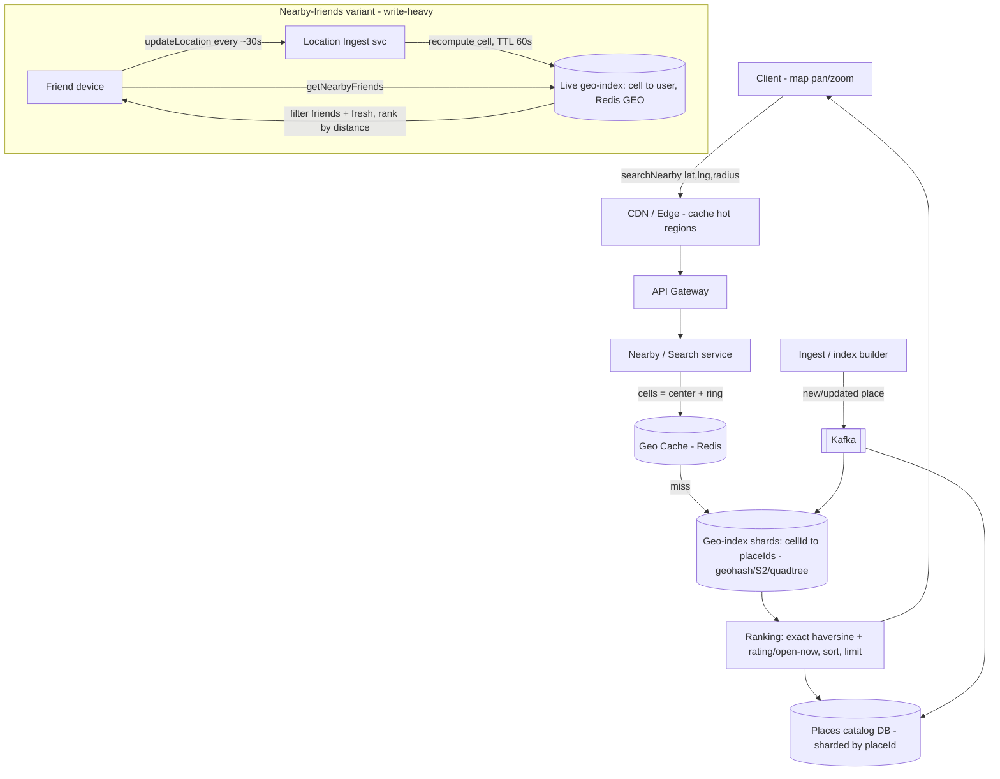

# A20 — Design a Proximity Service / Nearby Places (Yelp, Nearby Friends)

Build a service that answers "what's near me?" — given a lat/long and a radius, return the nearby places (Yelp) or nearby friends, ranked by distance, at scale. Google asks this because it isolates **geospatial indexing + range queries** as a pure problem (distinct from Maps *routing*, which is graph search): the crux is how you index 2-D points so a radius query touches a handful of cells instead of scanning the planet, and how you shard that index when some regions (downtown SF) are 10,000× denser than others (the ocean).

## 1) Clarify — questions to ask the interviewer

- **Static places or moving entities?** Nearby *businesses* (Yelp) are mostly static — index can be precomputed and read-heavy. Nearby *friends* are continuously moving — high-write location updates with TTL/freshness needs. These are different systems; I'll cover both but optimize the static read-heavy case as the default and treat live-location as the variant.
- **Query shape:** Fixed radius ("within 2 km"), top-K nearest ("10 closest"), or both? And max radius? This bounds how many index cells a query fans across.
- **Scale:** How many places/users (I'll assume ~200 M places, or 100 M+ users for friends), and peak **search QPS** (I'll assume ~10 K–100 K QPS, heavily read-skewed for places)?
- **Latency:** p99 for a nearby query (I'll target < 100 ms — it's interactive, on a map pan/zoom).
- **Freshness / consistency:** For places, eventual is fine (a new restaurant appearing minutes later is OK). For live friends, how fresh must a location be — seconds? This sets the update rate and whether we can cache.
- **Ranking:** Pure distance, or distance + rating + relevance + open-now (Yelp-style multi-factor)? Affects whether the geo-index returns candidates that a ranker then re-scores.
- **Filtering:** Combined with category/keyword ("coffee within 1 km")? That means geo-filter then attribute-filter (or an index that supports both).
- **Read/write mix:** Places = read-heavy (cache aggressively). Friends = write-heavy (optimize ingest). Confirm which dominates.

**What the interviewer is signaling:** Whether you know that a naive 2-D range scan (`WHERE lat BETWEEN ... AND lng BETWEEN ...`) doesn't scale — you need a **spatial index that maps 2-D space to a 1-D sortable key** (geohash / S2 cells) or a tree (quadtree) so a radius query reads a bounded set of cells. The other make-or-break insight is **uneven density**: fixed grids fail (one cell holds a whole city), so you need **adaptive cells** (quadtree subdivides hot regions; S2 levels do similar). A Staff candidate raises both — 1-D mapping AND density-adaptive sharding — in the first few minutes.

## 2) Functional Requirements (FR)

**In scope:**
- `searchNearby(lat, lng, radius | K)` → places/users within radius (or K nearest), **ranked by distance**.
- Optional **category/attribute filter** ("coffee", "open now").
- **Add/update/remove** a place (admin/ingest) — for the static case.
- **Live location updates** for moving entities (nearby-friends variant) with freshness/TTL.
- **Ranking** by distance (and, for Yelp, blend in rating/relevance/open-now).
- Read-heavy serving with caching for hot regions.

**Out of scope (defer, state explicitly):**
- **Routing / ETA / turn-by-turn** — that's graph search on a road network, a different problem.
- Full place metadata management (reviews, photos, hours editing) — assume a places service owns that; we index its geo + key attributes.
- Personalized recommendation ML beyond simple ranking signals.
- Privacy/consent UX for friend location sharing (mention as a hard constraint; don't design the consent flows).

## 3) Non-Functional Requirements (NFR)

| Dimension | Target & rationale |
|---|---|
| Scale | ~200 M places (or 100 M+ live users); 10 K–100 K search QPS, heavily read-skewed (places) or write-skewed (friends). |
| Latency | p99 nearby query < 100 ms — interactive map UX; cached hot regions << 50 ms. |
| Availability | 99.9–99.99%; a stale-but-served result beats a failed query (serve cached on partial failure). |
| Consistency | **Eventual** for places (new place visible in minutes is fine); **near-real-time** (seconds) for live-friend locations. |
| Durability | Place catalog durable (source of truth in a DB); the geo-index is a derived, rebuildable structure. |
| Freshness | Live locations: TTL ~30–60 s; stale entries expire so you never show a friend who's long gone. |
| Read-heaviness | Places: cache aggressively (CDN/Redis) since the same dense regions are queried constantly. |

## 4) Back-of-envelope estimation

```
Catalog
  places                 = 200,000,000
  per place              ~ 1 KB (id, lat/lng, geohash/cellId, category, rating, name)
  catalog size           = 200M * 1 KB        = 200 GB (+replication ~600 GB) — small, fits sharded

Geo-index
  index entry            ~ 50 bytes (cellId -> placeId postings)
  index size             = 200M * 50 B        = ~10 GB — easily fits in memory across shards
  hot working set        = dense urban cells; very cacheable

Search QPS
  peak search            = 100,000 QPS (read-heavy places)
  each query reads       ~ 4-9 neighbor cells (the cell + ring around it for radius)
  internal cell reads    = 100k * ~9          = ~900k cell lookups/s -> served from memory/cache

Cache
  hot regions ~ a few thousand dense cells hold most traffic
  cache them fully in Redis: a few GB; hit rate > 90% for places
  => DB/index sees a fraction of 100k QPS

Live-friends variant (write-heavy)
  users                  = 100,000,000
  update every           ~ 30 s  -> 100M/30   = ~3.3 M location writes/s
  each write             updates user's cell membership (move between cells)
  => sharded in-memory geo-index (Redis GEO / cell buckets), TTL 60s; writes dominate, not reads

Bandwidth
  result payload         ~ 20 places * 1 KB   = 20 KB/query
  100k QPS * 20 KB                              = 2 GB/s egress (CDN-cacheable for places)
```

## 5) API design

```
# Read (the hot path)
searchNearby(lat, lng, radiusMeters, [category], [openNow], limit=20)
    -> { results: [ {placeId, name, lat, lng, distanceMeters, rating, category} ], (ranked by distance) }
searchNearbyTopK(lat, lng, K, [filters])
    -> { results: [...K nearest...] }

# Write — static places (ingest/admin)
addPlace(placeId, lat, lng, category, attrs)   # computes cellId/geohash, inserts into index
updatePlace(placeId, {...})
removePlace(placeId)

# Write — live locations (nearby-friends variant)
updateLocation(userId, lat, lng)               # 202; recompute cell, set TTL ~60s
    # internally: if cell changed, move user from old cell bucket to new
getNearbyFriends(userId, radiusMeters)         # filter to friends + within radius + fresh

# Internal
cellsForQuery(lat, lng, radius) -> [cellId...]  # the cell + neighboring ring to cover the radius
rebuildIndex(region)                            # geo-index is derived/rebuildable from catalog
```

## 6) Architecture — request & data flow

THE CENTERPIECE. A proximity service's distinctive layers are the **geo-index shards** (cells → place/user postings), an aggressive **read cache** for hot regions, a **ranking** step, and — for the live variant — a **location-ingest pipeline** with TTL. Both diagrams are tailored to that. Note the read path is cache-first and the write path differs sharply between static places and moving users.

### (a) ASCII layered diagram

```
                 Clients (map view: pan / zoom / "near me")
                          |
              searchNearby(lat,lng,radius)   |   updateLocation(userId,lat,lng) [friends]
                          v                   |
                    [ CDN / Edge ]  cache nearby-results for hot/popular regions (places are static-ish)
                          |                   |
                          v                   |
                 [ Global LB / GeoDNS ]  route to nearest region                       (write path)
                          |                   |                                              |
                          v                   |                                              v
                 [ API Gateway ]  authN/Z, rate-limit                            [ Location Ingest svc ]
                          |                   |                                    (validate, recompute cell)
                          v                   |                                              |
              [ Nearby/Search service ]  compute query cells = center cell + ring            v
                          |                   |                                  [ Live Geo-Index (in-mem) ]
            +-------------+-------------+      |                                   cellId -> { userId: {pos,TTL} }
            | 1. cache lookup           |      |                                   (Redis GEO / cell buckets,
            v                           |      |                                    TTL ~60s expiry)
   [ Geo Cache (Redis) ]  hit -> return |      |                                              ^
            |  miss                     |      |                                              | (friends read)
            v                           |      +----------------------------------------------+
   [ GEO-INDEX SHARDS ]  cellId -> [placeId...]   sharded by region/cell prefix
   (geohash / S2 cells / quadtree; in-memory postings)
            |  candidate placeIds in query cells
            v
   [ Ranking ]  compute exact haversine distance; blend rating/open-now; sort; take limit
            |  hydrate place details
            v
   [ Places catalog DB ]  placeId -> {name, lat/lng, category, rating, hours}
   (sharded by placeId; source of truth)            ^
            ^                                        |
            |  rebuild / update (async)             |
   [ Ingest / index builder ] <-- new/updated places (Kafka) --> recompute cellId, update GEO-INDEX
```

**Read path (nearby places — cache-first):** Client (a map pan/"near me") calls `searchNearby(lat, lng, radius)`. The **Nearby service** computes the set of **query cells** = the cell containing the point **plus the neighboring ring** needed to cover the radius (a radius can spill across cell borders, so you must include neighbors — see deep dive). It checks the **geo cache** (hot dense regions are cached, > 90% hit for places); on miss it queries the **geo-index shards** for `cellId -> [placeId]` postings in those cells, collecting candidate place IDs. The candidates go to **ranking**, which computes the **exact haversine distance** (cells are coarse; you must re-rank by true distance), optionally blends rating/open-now, sorts, applies `limit`, and **hydrates** details from the **places catalog**. Result is returned and cached. Because the query touches only a handful of cells, latency is bounded regardless of catalog size.

**Write path — static places (async, read-optimized):** Place add/update flows through an **ingest** pipeline (Kafka): compute the place's **cellId/geohash**, write it to the **catalog** (source of truth), and update the **geo-index postings** (move it between cells if its location changed). Async + eventual — a new place becoming searchable in minutes is fine, which lets us optimize the read side hard.

**Write path — live friends (high-write, TTL):** `updateLocation` hits the **Location Ingest service**, which recomputes the user's **cellId** and updates the **live geo-index** (Redis GEO / cell buckets) with a **short TTL (~60 s)**. If the user crossed a cell boundary, they're moved from the old cell bucket to the new one. A `getNearbyFriends` query reads the relevant cells, filters to the requester's friend set and to **non-expired** entries, and ranks by distance. TTL guarantees you never show a friend who stopped updating long ago.

### (b) Mermaid flowchart



## 7) Data model & storage choices

- **Geo-index — spatial index over cells (geohash / S2 / quadtree), in-memory postings.** Core structure: `cellId -> [placeId | userId postings]`. Because a cell is a 1-D sortable key (geohash) or a tree node (quadtree), a radius query reads a bounded set of cells instead of scanning all points. The index is **derived and rebuildable** from the catalog — it can live in memory (it's small, ~10 GB) and be sharded by cell prefix / region.
- **Places catalog — KV/document store, sharded by `placeId`.** `placeId -> {name, lat, lng, cellId, category, rating, hours}` — source of truth, durable. KV/doc because lookups are by `placeId` (hydration after ranking) and it doesn't need joins. Geo lives in the index, not in a `WHERE lat BETWEEN` scan.
- **Live locations — in-memory geo store with TTL (Redis GEO / cell buckets).** `cellId -> {userId -> {lat, lng, lastSeen}}` with ~60 s TTL. In-memory + TTL because writes are huge (millions/s) and freshness matters; durability is unnecessary (a missed location update just expires).
- **Read cache — Redis / CDN for hot regions.** Dense urban cells are queried constantly; cache `searchNearby(cell)` results. Places change slowly, so a short TTL (seconds–minutes) gives > 90% hit rate and shields the index.
- **Why not PostGIS/`WHERE lat BETWEEN ... AND lng BETWEEN ...` as the primary path:** a 2-D bounding-box scan over 200 M rows is slow and doesn't shard by locality; a relational geo-index (R-tree) works at small scale but the cell-postings + 1-D-key approach shards cleanly by region and caches trivially at our scale. (R-tree is a fine answer to *mention* as the single-DB alternative.)

## 8) Deep dive

### 8a) Spatial indexing — geohash vs quadtree vs S2 (the crux)

The whole problem is: index 2-D points so a radius query reads O(few cells), not O(all points). Three standard approaches:

- **Geohash:** interleave the bits of latitude and longitude and Base32-encode → a string where a **shared prefix = spatial proximity** (`9q8yy` and `9q8yz` are adjacent). This maps 2-D to a **1-D sortable key**, so you can store it in any ordered KV/B-tree and a range scan on a prefix returns a cell. Precision = prefix length (more chars = smaller cell). **Strength:** trivial to store and shard (prefix), human-debuggable. **Gotchas:** (1) a query radius can straddle cell boundaries, so you must also read the **8 neighboring cells** (the ring) and filter by exact distance; (2) fixed-precision cells are uniform-size, so dense areas get one overstuffed cell while sparse areas waste cells — mitigate by **choosing precision per query/region** or layering.
- **Quadtree:** recursively subdivide space into 4 quadrants, splitting a node only when it holds more than a threshold of points. **Strength:** **density-adaptive** — downtown SF subdivides deep (small cells), the ocean stays one big cell — so each leaf holds a bounded number of points and load is balanced. A radius query descends to the leaves intersecting the circle. **Cost:** it's a tree (pointer-chasing, rebalancing on heavy writes) rather than a flat key; harder to shard than a prefix.
- **S2 (Hilbert-curve cells):** Google's library — projects the sphere onto a cube and orders cells along a **Hilbert space-filling curve**, giving 1-D sortable cell IDs (like geohash) but with **better locality** (Hilbert curve keeps neighbors closer than geohash's Z-order) and a clean **multi-level hierarchy** (a region = a set of cells at mixed levels). Best of both: 1-D sortable like geohash, adaptive coverage like a tree.

**My pick:** geohash (or S2 if available) for the **static, shardable, cacheable** places index because the prefix shards and caches beautifully; **quadtree** for **highly skewed density** if hotspots are severe. For the query, always: compute center cell + neighbor ring → gather candidates → **re-rank by exact haversine distance** (cells are approximate; the ranking must use true distance).

### 8b) Index sharding and hot regions (uneven density)

The killer problem: load is wildly non-uniform — Times Square gets millions of queries, the Sahara gets none. Naive equal-sized geographic shards put a whole metro on one machine (hot shard) while others idle.
- **Shard by cell prefix / region**, but **size shards by load, not area:** split hot regions (a single dense city) across multiple shards; merge cold ones. This is exactly what a quadtree gives for free (subdivide where dense).
- **Cache the hot cells aggressively** — a few thousand dense cells absorb most traffic; cache their results in Redis/CDN with a short TTL so the index barely sees the read storm (places are static-ish, so cache hit rate is high).
- **Replicate hot shards** for read throughput (places are read-mostly, so read replicas scale cleanly).
- **Live-friends hot region** (a stadium with 50 K people sharing location): the cell holds a huge bucket → split that cell deeper (finer S2/geohash level) so each sub-bucket is bounded, and shard the buckets across nodes.

### 8c) Ranking and the radius-boundary problem

Cells are coarse approximations, so two refinements are mandatory:
1. **Neighbor ring:** because a circle of radius r centered near a cell edge spills into adjacent cells, the query must gather the center cell **plus the surrounding cells** that the circle intersects (for geohash, the 8 neighbors; for quadtree/S2, the leaves intersecting the circle). Skipping this drops places that are genuinely nearby but on the other side of a cell border — a classic bug to call out.
2. **Exact distance re-rank:** the index returns *candidates in cells*, which is an over-approximation of "within radius." Compute the **haversine (great-circle) distance** for each candidate, discard those beyond r, and **sort by true distance** (then blend rating/open-now for Yelp). For top-K, expand outward ring-by-ring until you have K within the smallest enclosing cells, then re-rank — avoids reading more cells than necessary.

## 9) Key tradeoffs

| Decision | Option A | Option B | Choice & why |
|---|---|---|---|
| Spatial index | Geohash / S2 (1-D sortable key) | Quadtree (tree) | **Geohash/S2** for static, shardable, cacheable places; **quadtree** when density is extreme |
| Cell sizing | Fixed precision | Adaptive (subdivide hot) | **Adaptive** — uneven density (city vs ocean) breaks fixed grids |
| Shard sizing | By area | By load | **By load** — Times Square ≠ Sahara; split hot, merge cold |
| Read serving | Cache-first (hot regions) | Hit index every query | **Cache-first** — places are static-ish, > 90% hit, shields the index |
| Places freshness | Eventual (async ingest) | Strong | **Eventual** — a new place visible in minutes is fine; optimizes reads |
| Live location | In-memory + TTL | Durable store | **In-memory + TTL** — millions of writes/s, freshness > durability |
| Ranking | Re-rank by exact haversine | Trust cell order | **Re-rank exact** — cells are approximate; must sort by true distance |
| Query coverage | Center cell + neighbor ring | Center cell only | **Center + ring** — radius straddles boundaries; ring avoids missed results |

## 10) Bottlenecks & failure modes

- **Hot region / hot cell (downtown, stadium):** one cell's shard gets crushed. Mitigate: **subdivide** the hot cell to finer precision so buckets stay bounded, **shard by load** (split the metro across machines), **cache** the hot cells, and **replicate** read replicas for places.
- **Radius-boundary misses:** querying only the center cell silently drops nearby points across a border. Mitigate: always include the **neighbor ring** and re-rank by exact distance.
- **Thundering herd on a viral place / event:** everyone queries the same area at once (concert, disaster). Mitigate: CDN/Redis caching of that region's results (one fill serves all), request coalescing, short TTL.
- **Live-location write storm:** millions of `updateLocation/s` overwhelm the index. Mitigate: in-memory cell buckets, batch/debounce updates client-side (only send if moved > X meters), TTL expiry instead of explicit deletes, shard buckets across nodes.
- **Stale results (places) / expired locations (friends):** showing a closed restaurant or a friend who left. Mitigate: short cache TTL for places; hard TTL on live locations so expired entries vanish; filter `lastSeen` at query time.
- **Index/catalog skew under rebalancing:** moving cells between shards as density shifts. Mitigate: consistent-hash cell prefixes, rebuild the index incrementally (it's derived/rebuildable), serve from the old shard until the new one is warm.
- **Cache stampede on TTL expiry of a hot region:** all requests miss simultaneously. Mitigate: stale-while-revalidate, jittered TTLs, single-flight refresh per cell.
- **Cross-cell top-K incompleteness:** K nearest may all be in a neighbor, not the center cell. Mitigate: expand rings outward until K found within the smallest enclosing radius, then re-rank.

## 11) Scale 10x / evolution

- **QPS 10× (places):** it's read-heavy and cacheable — add cache capacity, read replicas of hot shards, and push more to the CDN/edge. The geo-index is small (fits in memory), so the lever is caching + replication, not re-sharding the catalog.
- **Writes 10× (live friends):** the bottleneck is location ingest. Scale by sharding cell buckets further, debouncing client updates (movement threshold), and regionalizing ingest so a user's updates stay local. TTL keeps the working set bounded.
- **Density shifts / new hotspots:** make the index **adaptive at runtime** — auto-subdivide cells that exceed a load/occupancy threshold and auto-merge cold ones (quadtree-style), continuously rebalancing shards by load.
- **Multi-region:** geo-shard by region with region-local indexes and caches; a query is served from the nearest region holding the relevant cells. Cross-region is rare (you query where you are).
- **Richer queries (geo + attribute + relevance):** layer the geo-candidate set into a search/ranking service (inverted index on category/keyword intersected with geo cells) — keep the geo-index as the spatial filter and let a ranker handle "best coffee near me," not just "nearest."
- **What breaks first:** **hot cells** (dense regions) for places and **write throughput** for live friends — both addressed by adaptive subdivision + load-based sharding + caching, not by abandoning the cell model.

## 12) Interviewer probes & follow-ups

- **"Why not `WHERE lat BETWEEN ... AND lng BETWEEN ...`?"** A 2-D bounding-box scan over 200 M rows is slow, can't use a single ordered index efficiently, and doesn't shard by locality. Map 2-D to a 1-D cell key (geohash/S2) or a quadtree so a query reads a bounded set of cells.
- **"Geohash vs quadtree vs S2 — when each?"** Geohash/S2: 1-D sortable key, shards by prefix, caches great → best for static read-heavy places. Quadtree: density-adaptive (bounded points per leaf) → best for severe skew/hotspots. S2 adds Hilbert-curve locality + multi-level hierarchy, getting both.
- **"A query radius crosses a cell boundary — bug?"** Yes if you read only the center cell. Read the center **plus the neighbor ring** the circle intersects, then re-rank by exact haversine and drop points beyond r.
- **"How do you handle Times Square being 10,000× denser than the desert?"** Adaptive cells (subdivide hot regions so each cell holds a bounded count) + shard **by load not area** (split the metro across machines) + cache + replicate hot cells.
- **"Nearby friends at millions of updates/sec — how?"** In-memory cell buckets (Redis GEO) keyed by cell with ~60 s TTL; recompute cell on update, move between buckets on boundary crossing; debounce client updates by movement threshold; expiry instead of deletes.
- **"How is the geo-index kept consistent with the catalog?"** It's a **derived, rebuildable** structure updated async off an ingest pipeline; eventual consistency (new place searchable in minutes) is acceptable and lets us optimize reads.
- **"Top-K nearest vs fixed radius?"** Top-K: expand rings outward until K candidates fall within the smallest enclosing radius, then re-rank by exact distance — avoids over-reading cells.
- **"How do you keep p99 < 100 ms?"** Bounded cell fan-out (center + ring), in-memory index, > 90% cache hit on hot regions, exact-distance re-rank on a small candidate set, details hydrated after ranking.
- **"Why is this different from Maps routing?"** Routing is graph/shortest-path search over a road network; this is spatial **range** indexing of points. Different data structures (cells/trees vs road graph), different algorithms.

## 13) 60-minute flow cheat-sheet

| Time | Phase | What to do |
|---|---|---|
| 0–6 min | Clarify | Static places vs moving friends; radius vs top-K; scale + QPS; freshness; ranking (distance vs Yelp-blend). Default: read-heavy places, live-friends as variant. |
| 6–10 min | FR / NFR | searchNearby + filter + add/update + live-location; p99<100 ms, eventual (places) / seconds-fresh (friends), read-heavy. |
| 10–14 min | Estimation | 200 M places ⇒ ~10 GB index (in memory), 100 K QPS, > 90% cache hit; friends ⇒ ~3.3 M writes/s, TTL 60 s. |
| 14–20 min | High-level + API | Draw CDN → nearby svc → cache → geo-index shards → ranking → catalog; live-location ingest path. Walk read (cache-first) + both write paths. |
| 20–38 min | Deep dives | (1) Geohash vs quadtree vs S2 (1-D key + adaptive), (2) shard by load + hot-region handling, (3) neighbor ring + exact-haversine re-rank. |
| 38–46 min | Tradeoffs | Index choice, adaptive cells, shard by load, cache-first, in-memory+TTL for live, exact re-rank, center+ring. |
| 46–54 min | Failure & bottlenecks | Hot cell, boundary misses, write storm, cache stampede, top-K incompleteness — each with a fix. |
| 54–60 min | 10x / wrap | Adaptive runtime subdivision, regionalize, geo+attribute ranking layer. Restate 1-D-cell-mapping + density-adaptive sharding as the core. |
