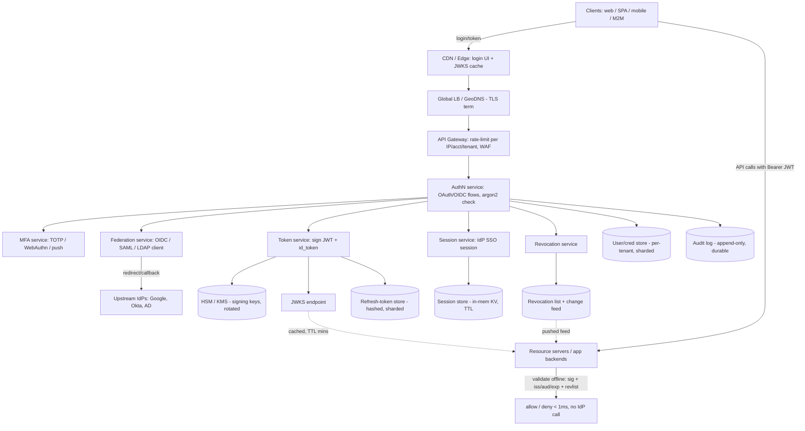

# A21 — Design an authentication / SSO platform (Auth0-style)

Design a multi-tenant **identity provider (IdP)** that lets applications delegate "who is this user, and what may they do?" — issuing and validating **tokens**, running **OAuth2 / OIDC** login flows, supporting **single sign-on** across many apps and **federation** to external IdPs, with **MFA**, **refresh + revocation**, and **rate limiting** — for thousands of tenant organizations. It tests whether you understand **identity, tokens, and federation** from first principles: the difference between authentication and authorization, why a signed **JWT** lets you validate without a database round-trip, and how SSO sessions, refresh tokens, and revocation interact. The crux is that auth is on the critical path of *every* request to *every* app, so it must be **fast and offline-verifiable**, yet a leaked or un-revoked token is a security incident — fast vs. revocable is the central tension.

## 1) Clarify — questions to ask the interviewer

- **Who are the actors and what flows?** Are we serving **first-party** apps (our own), **third-party** apps (consent-based OAuth like "Sign in with X"), machine-to-machine (client-credentials), or all three? This decides which OAuth2 grant types we implement (auth-code + PKCE, client-credentials, device code) and whether a **consent screen** is in scope.
- **Multi-tenant model:** is each customer org a **tenant** with its own users, branding, password policy, and connections? Shared user pool or fully isolated per tenant? This drives the data partitioning key (`tenant_id`) and the token `iss`/`aud` design.
- **Federation scope:** must we federate to **enterprise IdPs** (SAML, OIDC, Active Directory / LDAP) and **social** providers (Google, GitHub)? Federation means we are both an **OAuth client** (to the upstream) and an **OAuth server** (to our apps) — confirm both directions.
- **Token model:** stateless **JWT access tokens** (fast, offline-verifiable, hard to revoke) vs **opaque** tokens (introspected per request, instantly revocable, but a round-trip)? Or a hybrid (short JWT + revocation list)? This is the single most consequential decision — I'll surface the tradeoff explicitly.
- **Scale & latency:** how many tenants, MAU, and **logins/sec** at peak? What's the **token-validation** rate (every API call) vs the **login** rate (rare per user)? I'll assume O(50K) tenants, O(500M) users, ~50K logins/sec peak, and **millions of token validations/sec** — validation, not login, is the hot path. Confirm.
- **Session semantics:** what's the **SSO session** lifetime, idle vs absolute timeout, "remember me," and does logging out of one app log you out of all (single logout)? This shapes the session store and cookie design.
- **Revocation SLA:** when an admin disables a user or a token leaks, how fast must access actually stop — **seconds** (forces introspection or a fast revocation channel) or **minutes** (short-lived JWT expiry is enough)? This directly gates the token model.
- **MFA & security posture:** TOTP, WebAuthn/passkeys, SMS, push? Step-up auth for sensitive actions? Compliance (SOC2, GDPR data residency)? Brute-force / credential-stuffing protection expectations?

**What the interviewer is signaling:** they want to see you reason about **tokens as the core primitive** — specifically the **stateless-JWT-vs-opaque** and **fast-vs-revocable** tradeoffs — not just name "OAuth." Strong candidates separate **authentication** (login flows, sessions, MFA, federation) from **authorization** (what a validated token is allowed to do), lead with the **token-validation hot path** (offline JWT verify via published JWKS) and treat login as the rarer, heavier path, and proactively address **revocation, key rotation, and multi-tenant isolation** before being asked.

## 2) Functional Requirements (FR)

**In-scope**
- **OAuth2 / OIDC flows:** authorization-code + **PKCE** (web/SPA/mobile), client-credentials (M2M), refresh-token grant, device-code; OIDC `id_token` + `/userinfo`.
- **Token issuance & validation:** issue signed **JWT** access tokens + `id_token`; publish a **JWKS** endpoint so resource servers validate offline; introspection for opaque/strict mode.
- **Session management & SSO:** a central **IdP session** (cookie) so a logged-in user gets tokens for additional apps without re-entering credentials; idle + absolute timeouts.
- **Federation:** act as an OAuth/OIDC **client** to upstream IdPs (Google, GitHub) and a **SAML** SP/IdP for enterprise; map external identities to internal users.
- **Refresh + revocation:** refresh-token rotation; revoke a single token, all of a user's tokens, or a client's tokens; admin "disable user" stops access promptly.
- **MFA:** TOTP, WebAuthn/passkeys, push/SMS; **step-up** auth for sensitive scopes.
- **Rate limiting / abuse protection:** per-IP, per-account, per-tenant limits on login + token endpoints; lockout / credential-stuffing defense.
- **Multi-tenancy:** per-tenant users, connections, branding, password policy, and isolation.

**Out-of-scope (defer)**
- Fine-grained **authorization** / policy engine (RBAC/ABAC, Zanzibar-style relationship auth) — we issue scopes/claims; the *decision* engine is a separate system (acknowledge, hand off).
- Full **user-management UI**, self-service org admin console, and billing.
- **Fraud/risk ML** scoring beyond basic velocity/anomaly rules (mention as extension).
- Legacy protocols beyond SAML/OIDC/LDAP (e.g. WS-Fed) — note, defer.

## 3) Non-Functional Requirements (NFR)

| Dimension | Target & rationale |
|---|---|
| Scale | O(50K) tenants, O(500M) users; ~50K logins/sec peak; **millions of token validations/sec** (validation is the hot path, mostly offline at resource servers). |
| p99 latency | Token **validation** < 1 ms (offline JWT verify, no IdP call). **Login** p99 < 300 ms; token endpoint p99 < 50 ms. |
| Availability | **99.99%+** for issue/validate — auth down = every app down. JWKS + JWT design lets resource servers keep validating even if the IdP control plane blips. |
| Consistency | **Strong** for credential checks, MFA enrollment, and revocation writes (security-critical). **Eventual** acceptable for session-metadata replication and JWKS propagation (bounded, seconds). |
| Durability | Credentials, MFA secrets, refresh tokens, audit log: durable + replicated, **never lost**. Access-token state is ephemeral (tokens self-expire). |
| Security | Passwords hashed with **bcrypt/argon2** (per-user salt); signing keys in **HSM/KMS**, rotated; TLS everywhere; refresh-token rotation + reuse detection; full audit trail; PII encrypted at rest. |
| Revocation SLA | Disabled user / leaked token loses access within **seconds** via a fast revocation channel layered on short-lived JWTs. |

## 4) Back-of-envelope estimation

```
Users / tenants
  500M users, 50K tenants -> ~10K users/tenant average (skewed: a few huge)

Login rate (the rare path)
  Say each active user logs in ~1x/day, 200M DAU -> 200M/86400 ~ 2,300 logins/s avg
  Peak ~10x average (morning login surge) -> ~25-50K logins/s peak

Token-validation rate (the HOT path)
  Each logged-in user makes many API calls; say 200M DAU * 100 API calls/day
    = 20B validations/day / 86400 ~ 230K/s avg, peak ~2-3M/s
  CRUCIAL: validations are OFFLINE at resource servers (verify JWT signature
    with cached JWKS) -> they do NOT hit the IdP. So the IdP's QPS is driven by
    LOGIN + token-refresh, not validation. This is why JWT is chosen.

Token-refresh rate
  Access token TTL ~15 min -> a user active for hours refreshes ~4x/hour
  200M DAU, ~2h active -> ~200M * 8 refreshes/day / 86400 ~ 18K refresh/s avg

Storage
  Users: 500M * ~1 KB (profile, hash, MFA secret, metadata) ~ 500 GB -> sharded
  Refresh tokens: assume 2 active/user * 500M * ~200 B ~ 200 GB
  Sessions: 200M concurrent * ~300 B ~ 60 GB -> in-memory KV (Redis-like), TTL'd
  Audit log: 20B+ validations not logged at IdP; log logins/refreshes/admin =
    ~ (50K logins + 18K refresh)/s * ~500 B ~ 34 MB/s -> ~3 TB/day -> cold store

JWKS / signing keys
  A handful of active signing keys per region, rotated; JWKS payload ~ few KB,
  cached aggressively at every resource server (TTL minutes). Negligible traffic.

Cache memory (session + revocation list)
  Sessions ~60 GB (above). Revocation list: even 10M revoked-token IDs * 40 B
    = 400 MB -> trivially fits in memory, pushed to resource servers.
```

## 5) API design

```
# OAuth2 / OIDC (standard endpoints)
GET  /authorize?response_type=code&client_id&redirect_uri&scope&state
       &code_challenge&code_challenge_method=S256   # auth-code + PKCE; may
                                                     # redirect to login/MFA/consent
POST /token            grant_type=authorization_code | refresh_token
                       | client_credentials | urn:...:device_code
       -> { access_token (JWT), id_token (JWT), refresh_token, expires_in, token_type }
GET  /userinfo         Authorization: Bearer <access_token>  -> OIDC claims
POST /introspect       { token }  -> { active, sub, scope, exp, ... }  # opaque/strict
POST /revoke           { token, token_type_hint }            # RFC 7009
GET  /.well-known/openid-configuration                       # OIDC discovery
GET  /.well-known/jwks.json                                  # public keys (rotate-aware)

# Session / SSO
POST /login            { tenant, username, password } -> sets IdP session cookie
                         -> may return mfa_required + mfa_session
POST /mfa/verify       { mfa_session, method, code|assertion }
POST /logout           # single logout: clears IdP session + notifies clients

# Federation (we are the client to upstream IdPs)
GET  /connections/{conn}/login  -> redirect to upstream (Google/SAML/...)
GET  /connections/{conn}/callback ?code|SAMLResponse  # map external -> internal user

# Admin / control plane (per tenant)
POST /tenants/{t}/users           POST /tenants/{t}/users/{u}:disable   # -> revoke
POST /tenants/{t}/clients         { redirect_uris, grant_types, scopes }
PUT  /tenants/{t}/connections/{c} { type: oidc|saml|ldap, config }
PUT  /tenants/{t}/policy          { password_rules, mfa_required, session_ttl }
```

## 6) Architecture — request & data flow

**(a) ASCII layered flow**

```
              Clients (web app / SPA / mobile / M2M service)
                       |                         |
                       | (login / token)         | (API calls carry Bearer JWT)
                       v                         v
                 [ CDN / Edge ]            [ Resource servers / app backends ]
                 (static login UI,            |  validate JWT OFFLINE:
                  JWKS cached)                |   - check signature vs cached JWKS
                       |                       |   - check iss/aud/exp/scope
                       v                       |   - check fast revocation list
              [ Global LB / GeoDNS ]           |  -> allow/deny in <1ms, NO IdP call
                 anycast, TLS term             |
                       |                       v
                       v                  (only on miss/expiry: pull JWKS,
        ============ Auth / IdP control plane ==========   refresh revocation feed)
        |                                                |
        |  [ API Gateway ]  rate-limit (per IP/acct/    |
        |        |          tenant), routing, WAF        |
        |        |                                       |
        |        +--> [ AuthN service ]  login flows,    |  <-- LOGIN path (rare)
        |        |        password check (argon2),       |
        |        |        OIDC/OAuth state machine       |
        |        |          |            |               |
        |        |          v            v               |
        |        |   [ MFA service ]  [ Federation svc ] ---> upstream IdPs
        |        |   TOTP/WebAuthn/   (OIDC/SAML/LDAP       (Google, GitHub,
        |        |   push             client side)          Okta, AD)
        |        |          |                              |
        |        +--> [ Token service ]  issue JWT/id_token,
        |        |        sign with key from [ HSM / KMS ] (rotated)
        |        |        publish [ JWKS endpoint ]
        |        |          |
        |        +--> [ Session service ] create/lookup IdP SSO session
        |        |          |
        |        +--> [ Revocation service ] write tombstone, fan out feed
        |                   |
        ====================|============================================
                            v
        [ User/cred store ]   [ Refresh-token store ]   [ Session store ]
         (sharded SQL/KV,      (sharded KV, hashed,      (in-mem KV, TTL,
          per-tenant,          rotation lineage)          per IdP session)
          argon2 hashes)            |
                            [ Revocation list / feed ]  -> pushed to resource
                            (in-mem KV + change stream)    servers + gateway
                                    |
                            [ Audit log ]  (append-only, durable, cold store)
```

**Login (write) path:** a client redirects the user to `/authorize`. The **API Gateway** rate-limits and routes to the **AuthN service**, which renders the (CDN-served) login UI, verifies the password against the **user/cred store** (argon2 compare), and — if policy requires — hands off to the **MFA service** (TOTP/WebAuthn). For **federated** logins, the **Federation service** redirects to the upstream IdP, consumes the OIDC/SAML callback, and maps the external identity to an internal user (just-in-time provisioning if new). On success, the **Session service** creates an **IdP SSO session** (cookie) and the **AuthN service** mints an authorization `code`; the client exchanges it at `/token`. The **Token service** signs a short-lived **JWT** access token + `id_token` using a key from **HSM/KMS** and issues a rotating **refresh token** stored (hashed) in the refresh store. Everything security-relevant is appended to the **audit log**.

**Token-validation (read / hot) path:** the client sends the JWT as `Authorization: Bearer` on every API call. The **resource server validates it entirely offline**: verify the signature against the **JWKS** public keys (cached locally, TTL minutes), then check `iss`/`aud`/`exp`/`scope`, then consult a **fast revocation list** (a small in-memory bloom/set of revoked `jti`s pushed from the revocation service). This is **sub-millisecond and never touches the IdP** — which is exactly why the IdP's QPS is driven by *logins and refreshes*, not validations, and why the whole platform can be far smaller than the validation rate suggests.

**SSO path:** when the same logged-in user visits a *second* app, `/authorize` finds the existing **IdP session** cookie, skips credential entry (and MFA if still satisfied), and issues fresh tokens for the new app — that's single sign-on.

**Revocation path:** disabling a user or revoking a token writes a **tombstone** in the revocation service and fans out a **change feed** to resource servers/gateways, so short-lived JWTs are rejected within seconds even before they expire.

**(b) Mermaid flowchart**



## 7) Data model & storage choices

- **User / credential store — sharded SQL or strongly-consistent KV, partitioned by `tenant_id`** (then by `user_id`): `{tenant_id, user_id, email, password_hash (argon2 + per-user salt), mfa_enrollments[], status, created_at}`. First-principles: credential checks and "disable user" must be **strongly consistent** and durable (a stale read could let a fired employee in), and multi-tenancy demands isolation, so we shard by tenant and keep per-tenant policy local. SQL gives transactional enrollment/disable; a Paxos/Raft-backed KV is equally valid.
- **Access tokens — NOT stored (stateless JWT).** First-principles: the validation rate (millions/sec) dwarfs everything; storing+looking-up each token would put the IdP on the hot path of every API call. A **signed JWT** carries its claims so resource servers verify **offline** against published **JWKS** — trading instant revocation for massive read scalability (recovered via the revocation list + short TTL).
- **Refresh-token store — sharded KV, store only a hash**, with **rotation lineage**: `{token_hash, user_id, client_id, parent_id, issued_at, status}`. First-principles: refresh tokens are long-lived bearer secrets, so we (a) never store them in clear, (b) **rotate** on each use and detect **reuse** of a retired token as a theft signal (revoke the whole lineage). Durable because losing them logs everyone out.
- **Session store — in-memory KV with TTL** (Redis-like, replicated), keyed by session id: `{session_id, user_id, tenant_id, auth_methods, mfa_satisfied, idle_exp, absolute_exp}`. First-principles: sessions are ephemeral, latency-sensitive (checked on every SSO `/authorize`), and self-expiring — exactly the in-memory-with-TTL profile.
- **Signing keys — HSM / KMS**, never in the app DB; multiple **active** keys (overlapping validity) so rotation is seamless — new tokens signed with the new `kid`, old tokens still verify against the still-published old public key until they expire. First-principles: key compromise is catastrophic, so private keys never leave the HSM and rotation must not invalidate live tokens.
- **Revocation list / feed — in-memory set + change stream**: revoked `jti`s and "all-tokens-before-T for user U" markers, pushed to resource servers. First-principles: this is the *patch* that restores revocability to stateless JWTs; it must be tiny, fast, and fan-out-able, so an in-memory set with a streaming feed (and a bloom filter at the edge) fits.
- **Audit log — append-only, durable, cold store** (e.g. partitioned log → object storage): every login, token issue, refresh, revoke, admin change. First-principles: security and compliance require an immutable trail; it's write-heavy and rarely read, so append-only + cheap cold storage.

## 8) Deep dive

**Deep dive A — the token model: stateless JWT vs opaque, and how we get revocation back.** This is the heart of the problem.

- **Stateless JWT (chosen for access tokens):** a signed token `{iss, sub, aud, exp, scope, tenant, jti}` that any resource server validates **offline** by checking the signature against the public **JWKS** — no IdP round-trip. *Pro:* validation scales to millions/sec independently of the IdP, survives IdP blips, sub-ms latency. *Con:* you **can't un-issue** a JWT before `exp` — it's valid by construction.
- **Opaque token (used for strict mode / introspection):** a random string that means nothing without calling **`/introspect`** on the IdP. *Pro:* **instantly revocable** (the IdP just stops saying `active:true`). *Con:* a network round-trip on **every** API call → latency + the IdP becomes a throughput bottleneck and SPOF. Untenable as the default at our validation rate.
- **The hybrid we actually ship:** **short-lived JWT** (e.g. 15 min) + **long-lived rotating refresh token** + a **fast revocation feed**. Short TTL bounds the blast radius of a leaked access token to minutes; the **revocation list** (pushed to resource servers as a small in-memory set / bloom filter keyed by `jti` or "user-tokens-before-T") cuts that to **seconds** for the cases that matter (disabled user, detected theft). Refresh tokens are where real revocation bites: revoke the refresh token and the user can't mint new access tokens, so within one TTL they're fully out. This deliberately trades a few seconds of revocation latency for the enormous win of offline validation — and I'd say so out loud.
- **Key rotation:** sign with a current `kid`, publish current + previous public keys in JWKS with overlap; rotate keys regularly and on suspicion of compromise. Resource servers pick the verifying key by `kid`, so rotation never breaks in-flight tokens. Private keys live only in the **HSM/KMS**.

**Deep dive B — SSO, sessions, federation, and refresh-token theft detection.**

- **SSO via a central IdP session:** the first login creates an **IdP session cookie** on the auth domain. When the user hits a second app's `/authorize`, the AuthN service sees that cookie, confirms the session still satisfies the app's auth/MFA requirements, and issues tokens **without re-prompting** — that's SSO. **Single logout** clears the IdP session and notifies registered clients (front- or back-channel logout) so one logout ends them all.
- **Federation (we are both client and server):** to our apps we are an OAuth/OIDC **server**; to **upstream** IdPs we are a **client**. For social/enterprise OIDC we run an auth-code flow against the upstream, validate *its* `id_token`, and **map** the external identity (`provider + subject`) to an internal user (just-in-time provision on first sight, merge by verified email per tenant policy). For **SAML** enterprise IdPs we act as an SP, validate the signed assertion, and map attributes. This lets a tenant "bring your own IdP" while our apps only ever speak one protocol to us.
- **Refresh-token rotation + reuse detection:** every refresh issues a **new** refresh token and retires the old one (lineage chain). If a **retired** token is ever presented, that's a strong theft signal (the legit client already rotated past it) → we **revoke the entire lineage** and force re-auth. This catches stolen refresh tokens that the JWT model otherwise can't, and is a Staff-level detail worth volunteering.
- **MFA & step-up:** MFA is enrolled per user (TOTP secret / WebAuthn credential, stored encrypted). Sensitive scopes trigger **step-up**: even with a valid session, the app demands a fresh MFA assertion, recorded on the session so it isn't re-prompted needlessly.

## 9) Key tradeoffs

| Decision | Choice & why | Tradeoff accepted |
|---|---|---|
| Token type (access) | **Stateless JWT** validated offline via JWKS | Cannot revoke before `exp` → patched with short TTL + revocation feed |
| Revocation strategy | Short TTL + pushed revocation list; revoke refresh on theft | A few seconds of revocation latency, not instant |
| Validation location | **At the resource server**, offline (no IdP call) | Resource servers must cache JWKS + revocation feed and handle rotation |
| Session model | Central IdP session cookie (enables SSO) | Session store is stateful, latency-sensitive, must be HA |
| Refresh tokens | **Rotate** on use + reuse detection | Extra write per refresh; lineage tracking complexity |
| Key management | Private keys in **HSM/KMS**, multi-key JWKS overlap | Rotation orchestration; brief dual-key window |
| Multi-tenancy | Shard by `tenant_id`, per-tenant policy/isolation | Cross-tenant features (shared SSO) need explicit federation |
| Consistency | **Strong** for creds/MFA/revocation writes; eventual for JWKS/session replication | Slightly stale JWKS/session reads (bounded seconds) tolerated |
| CAP | **CP** for credential/revocation writes (correctness > availability there); **AP** for offline validation (always validates, possibly seconds-stale on revocation) | During partition, revocation may lag; logins to an unreachable shard fail rather than admit wrongly |

## 10) Bottlenecks & failure modes

- **IdP becomes the per-request hot path (the opaque-token trap).** *Mitigation:* default to **offline JWT validation** so resource servers never call the IdP per request; introspection is reserved for explicit strict-mode clients.
- **Signing-key compromise (catastrophic — forge any token).** *Mitigation:* keys in **HSM/KMS** (never exported), regular + emergency **rotation**, multi-key JWKS so rotation is instant and non-breaking; short token TTL bounds exposure of already-issued tokens.
- **Revocation lag lets a fired/compromised user keep access.** *Mitigation:* short access-token TTL + a **pushed revocation feed** (seconds), and revoke the **refresh token** so no new access tokens can be minted.
- **Stolen refresh token (long-lived bearer secret).** *Mitigation:* **rotation + reuse detection** — presenting a retired token revokes the whole lineage; bind tokens to client where possible (DPoP / mTLS).
- **Credential-stuffing / brute force / login DDoS.** *Mitigation:* **rate limiting** per IP/account/tenant at the gateway, progressive **lockout** + CAPTCHA, breached-password checks, and MFA; keep the login path isolated so it can be throttled without affecting validation.
- **Session store outage (SSO can't function).** *Mitigation:* replicate the in-memory session store (multi-replica, multi-AZ); on partial loss, users re-login (degraded, not down); access-token validation is unaffected because it's stateless.
- **JWKS unavailable / rotation race (resource servers can't fetch new public keys).** *Mitigation:* cache JWKS with sane TTL + serve-stale-on-error; overlap old/new keys so a delayed fetch still verifies recent tokens; CDN-front the JWKS endpoint.
- **Thundering herd of refreshes when many tokens expire together.** *Mitigation:* **jitter** token TTLs, support sliding/rolling refresh, and rate-limit the `/token` endpoint per client.
- **Hot tenant (one huge org) overloads its shard.** *Mitigation:* shard within a tenant by `user_id`; isolate noisy tenants; per-tenant rate limits.

## 11) Scale 10x / evolution

- **First to break: the login + token-refresh tier and its stores**, because validation is already offline and doesn't grow the IdP. Evolve by sharding the user/refresh stores finer by `tenant_id`/`user_id` and adding more stateless AuthN/Token replicas (they autoscale).
- **Global / multi-region:** run the IdP **regionally** with users homed to a region (data-residency friendly), replicate JWKS globally (read-only, cacheable), and replicate the **revocation feed** cross-region. Tokens carry `iss` so a token issued in one region still validates anywhere via global JWKS.
- **Revocation at higher scale:** move from a flat revocation set to a **hierarchical / bloom-filtered** feed (per-tenant shards, "revoke-before-T" epoch markers instead of per-`jti` entries) so the list stays small as revocations grow.
- **Hotter validation:** push JWKS + revocation to the **edge/CDN** and into sidecars so even more validation happens close to apps; consider **token-bound** schemes (DPoP/mTLS) to harden bearer tokens without adding IdP calls.
- **Federation sprawl:** as tenants bring hundreds of upstream IdPs, make the Federation service connection-config-driven and cache upstream metadata; isolate a flaky upstream so it can't stall other tenants' logins.
- **Stronger auth:** roll out **passkeys/WebAuthn** as default (phishing-resistant), and risk-based step-up driven by signals (new device/geo) — a clean extension point on the login path.

## 12) Interviewer probes & follow-ups

- **"JWT vs opaque tokens — which and why?"** **JWT** for access tokens so resource servers validate **offline** (millions/sec, sub-ms, IdP off the hot path). Opaque only for explicit strict-mode clients via introspection. I recover JWT's weakness — no instant revoke — with **short TTL + a pushed revocation feed** and refresh-token revocation.
- **"A user is fired — how fast do they lose access?"** Disable the user → write a revocation tombstone fanned out to resource servers (**seconds**), and revoke their **refresh token** so no new access tokens mint. Their current short-lived JWT also self-expires within minutes regardless.
- **"How do you revoke a stateless JWT at all?"** I don't revoke the JWT itself — I keep it short-lived and ship a **revocation list** (per-`jti` or "all tokens for user U before time T") that resource servers check from a local in-memory set, plus killing the refresh token to stop renewal.
- **"How does SSO actually work across apps?"** A central **IdP session cookie** from the first login; subsequent apps' `/authorize` calls reuse that session (and satisfied MFA) and mint fresh per-app tokens without re-prompting. Single logout clears it everywhere.
- **"Explain the auth-code + PKCE flow and why PKCE."** Client redirects to `/authorize` with a `code_challenge`; user authenticates; IdP returns a one-time `code`; client exchanges `code` + `code_verifier` at `/token`. **PKCE** binds the code to the client that started the flow so an intercepted code is useless — essential for public clients (SPA/mobile) that can't hold a secret.
- **"How do you rotate signing keys without breaking live tokens?"** Sign with a new `kid` while **publishing both old and new public keys** in JWKS; old tokens verify against the old key until they expire, then it's dropped. Private keys live in the HSM and are never exported.
- **"How is federation different from issuing your own tokens?"** In federation we're the **client** to an upstream IdP: we run its flow, validate *its* assertion/`id_token`, and **map** the external identity to an internal user — then issue **our** tokens. Our apps only ever speak one protocol to us.
- **"Protect the login endpoint from credential stuffing?"** Rate-limit per IP/account/tenant, progressive lockout + CAPTCHA, breached-password screening, MFA, and isolation so login throttling never affects token validation.
- **"How do you keep tenants isolated?"** Shard and scope everything by `tenant_id`; tokens carry tenant in `aud`/claims; per-tenant policy, connections, and keys (optionally per-tenant signing keys) so one tenant's data or config never bleeds into another's.

## 13) 60-minute flow cheat-sheet

| Time | Phase | What to do |
|---|---|---|
| 0–6 min | Clarify | Actors/flows, multi-tenant model, **token model (JWT vs opaque)**, revocation SLA, scale (validate vs login), MFA/federation scope |
| 6–9 min | FR/NFR | Lock offline validation < 1 ms, login < 300 ms, 99.99% availability, strong consistency for creds/revocation |
| 9–15 min | Estimation | **Validation rate vs IdP QPS** (why JWT keeps IdP off the hot path), storage for users/refresh/sessions, revocation-list size |
| 15–20 min | API + high-level arch | `/authorize` `/token` `/jwks` `/introspect` `/revoke`; draw both diagrams; separate control plane vs offline validation |
| 20–25 min | Walk login + validation paths | Login → MFA/federation → mint JWT + rotating refresh; API call → offline JWT verify + revocation check |
| 25–40 min | Deep dive | (A) JWT vs opaque + how revocation is recovered + key rotation; (B) SSO sessions, federation, refresh rotation + reuse detection |
| 40–48 min | Tradeoffs + failures | Fast-vs-revocable, key compromise, refresh-token theft, credential stuffing, JWKS/session outages |
| 48–55 min | Scale 10x | Multi-region homing + global JWKS, hierarchical revocation feed, edge validation, passkeys/risk-based step-up |
| 55–60 min | Probes | JWT-vs-opaque justification, fired-user revocation, PKCE, key rotation, federation vs issuance, tenant isolation |
