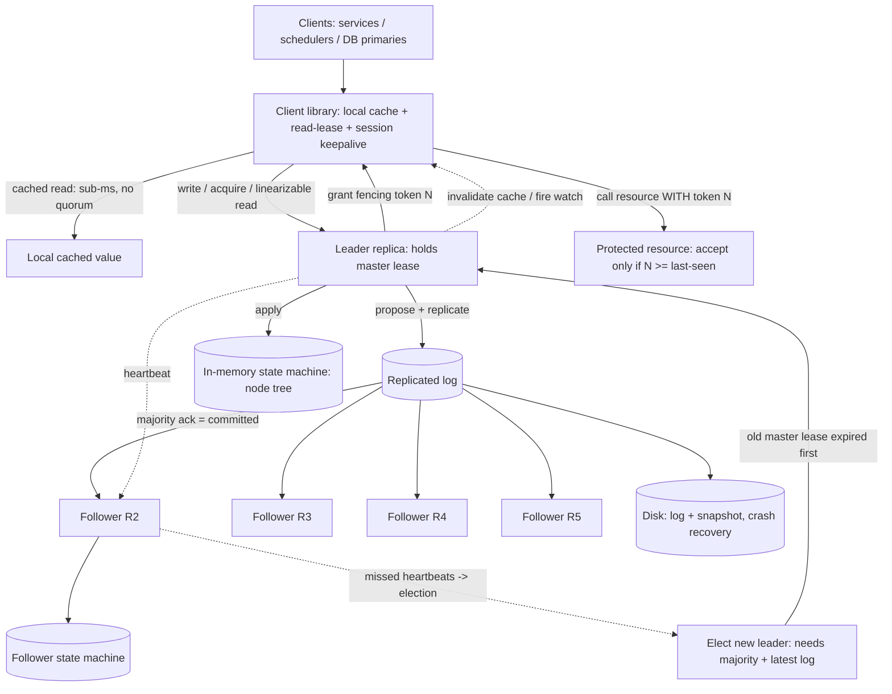

# A22 — Design a distributed locking / coordination service (Chubby, ZooKeeper)

Design a highly-available **coordination service** that lets many distributed processes agree on shared state — acquire **locks**, **elect a leader**, store small bits of metadata, and **watch** for changes — with strong correctness guarantees even when nodes crash and networks partition. It tests the thing Google cares about most here: **consensus and coordination** — **Chubby is Google's own system**, so they expect crisp **Paxos/Raft** and **lease** intuition, not hand-waving. The crux is that a lock service is only useful if it is *correct under failure*: a process that *believes* it holds a lock when it no longer does must be prevented from corrupting shared state, which forces **leases, fencing tokens, and split-brain prevention** to the center of the design.

## 1) Clarify — questions to ask the interviewer

- **What is this used for?** Coarse-grained **leader election** and infrequent locks (the Chubby model), or high-throughput fine-grained mutual exclusion? Chubby explicitly targets **coarse-grained** locks (held for hours, low rate) — confirm, because it completely changes the throughput target and whether locks live in a consensus log.
- **Lock semantics:** advisory or mandatory? Are locks **exclusive** only, or also **shared/read** locks? Must a lock be **automatically released** if the holder crashes (i.e. lease-based with TTL)? This decides the lease + failure-detection design.
- **Correctness vs availability under partition:** if the service can't reach a quorum, do we **block** (refuse to grant, preserve correctness — CP) or degrade to allow (AP)? For a *lock* service the answer is almost always **CP** — I'll state that a lock service that ever grants two holders is worthless, so we choose consistency over availability.
- **Consistency of reads:** must reads be **linearizable** (see the latest committed value) or is bounded staleness fine for watches/metadata? This decides whether reads go through the leader/quorum or can be served from a local replica cache.
- **Scale & shape:** how many **clients**, how many lock/metadata nodes, and what op rate? Chubby intentionally serves **tens of thousands of clients** from a **single small replica group (5)** with low write rate but heavy *read/keepalive* traffic via client caches. I'll assume O(10K–100K) clients per cell, ~5 replicas, low write QPS, high keepalive/read QPS — confirm.
- **Watch / notification needs:** do clients need to be **notified** when a key changes or a lock is released (event-driven), or is polling acceptable? Watches are central to "elect a new leader the moment the old one dies."
- **Data size:** are we storing **small** metadata (config, pointers, locks — KBs), or large blobs? Chubby/ZooKeeper store **small** files only (everything fits in memory, replicated via the log) — confirm we are *not* building a database.
- **Fencing expectations:** when a lock is granted, do downstream services accept a **monotonic fencing token** so a delayed/zombie old holder is rejected? This is the detail that makes locks *actually safe* — I'll surface it early.
- **Geography:** single region/cell or global? Consensus latency is dominated by the slowest quorum member, so cross-region replicas are costly — confirm we can keep a cell regional and federate.

**What the interviewer is signaling:** this is a **distributed-systems-fundamentals** interview disguised as a design. They want to hear **Paxos/Raft** (a replicated log via quorum, leader election, why an odd number of replicas), **leases** (time-bounded locks so a crashed holder is reclaimed without consensus on every read), **fencing tokens** (so a process pausing past its lease can't corrupt state — the famous failure mode), and **split-brain prevention** (why you can't have two leaders, why a majority is required). The standout move is to lead with "a lock service is only valuable if it's correct under failure," pick **CP** deliberately, and explain the **lease + fencing** combination as the answer to the GC-pause/clock-skew problem before being asked.

## 2) Functional Requirements (FR)

**In-scope**
- **Locks:** acquire/release **exclusive** (and shared/read) locks on named resources; locks are **lease-based** with a TTL and **auto-release** on holder failure.
- **Leader election:** a primitive (or recipe) so a set of processes elects exactly **one** leader, with prompt failover when the leader dies.
- **Small metadata store:** a hierarchical namespace of small **nodes/files** (config, pointers, membership) with linearizable reads/writes.
- **Watches / notifications:** clients subscribe to a node and are **notified** on change/delete (e.g. lock released, config updated) — event-driven, no busy-poll.
- **Sessions + keepalive:** each client holds a **session** kept alive by heartbeats; session expiry releases the client's locks and ephemeral nodes.
- **Fencing tokens:** every lock grant returns a **monotonically increasing token** that resource servers use to reject stale holders.
- **Consensus-backed durability:** all mutations go through a **replicated log** (Paxos/Raft) so a committed write survives a minority failure.

**Out-of-scope (defer)**
- A general-purpose **database / large-object store** — we store small coordination data only (acknowledge, hand off to a real DB).
- **High-throughput, fine-grained** locking (millions of locks/sec) — Chubby is coarse-grained by design; mention sharding/partitioned consensus as the evolution.
- **Cross-region linearizable** consensus as the default (expensive); keep a cell regional, federate (note).
- The **application logic** that uses the lock (e.g. the actual primary-replica failover) — we provide the primitive.

## 3) Non-Functional Requirements (NFR)

| Dimension | Target & rationale |
|---|---|
| Correctness | **Linearizable** mutations; **at most one** holder of an exclusive lock at any time — this is the whole point; we never trade it away. |
| Consistency model | **CP** (consistent + partition-tolerant): on loss of quorum the service **refuses to grant/commit** rather than risk two holders. |
| Availability | As high as CP allows: tolerate **f failures with 2f+1 replicas** (5 replicas → survive 2). Not 99.999% during a quorum-losing partition — by design. |
| Scale | O(10K–100K) clients per cell; **low write QPS** (locks are coarse), **high keepalive/read QPS** absorbed by client caches + leader read-leases. |
| Latency | Write/lock-acquire p99 ~ a few ms (one consensus round to a regional quorum). Cached reads: sub-ms locally. |
| Durability | Every committed mutation is on a **majority** of replicas' logs + persisted; survives minority crash with **zero data loss**. |
| Failure detection | Lease/session expiry within **seconds** (heartbeat interval) so a dead holder's lock is reclaimed promptly. |
| Security | ACLs per node; authenticated sessions; only authorized clients mutate or watch sensitive nodes. |

## 4) Back-of-envelope estimation

```
Cluster shape (the Chubby model: small, not sharded)
  1 consensus group = 5 replicas (survive 2 failures). NOT scaled by adding
    replicas (more replicas = slower quorum); scaled by client-side caching.

Write / lock rate (LOW by design)
  Coarse-grained: a lock held for minutes-to-hours, leader elections rare.
  Even 100K clients doing a lock op every few minutes -> O(100s) writes/s.
  Each write = 1 Paxos/Raft round (1 RTT to a majority) -> trivially served
    by a single small group. Writes are NOT the scaling problem.

Keepalive / read traffic (HIGH -> this is what we engineer for)
  100K clients each heartbeating every ~10s -> 100K/10 = 10K keepalives/s.
  Reads: clients CACHE node data and the leader grants a read LEASE; a cached
    read is local (sub-ms, zero quorum cost). Only cache-miss / invalidation
    touches the leader. So effective read QPS at the leader << raw read QPS.

Data size (small, fits in RAM)
  Say 1M nodes * ~1 KB avg (config/locks/pointers) ~ 1 GB -> entire dataset in
    memory on every replica, replicated via the log. We are NOT a database.

Consensus latency
  Dominated by the slowest of the majority. Same-region quorum: ~1-5 ms RTT.
  Cross-region quorum: ~50-150 ms -> why we keep a cell regional and federate.

Watch fan-out
  A popular node (e.g. "current leader") may have 10K watchers. On change,
    notify all -> 10K messages, batched/coalesced from the leader. Bounded;
    watches are edge-triggered, not streamed continuously.

Lease / session math
  Session TTL ~ tens of seconds; client renews at ~1/3 TTL. A crashed client's
    locks free within ~1 TTL. Trade shorter TTL (faster reclaim) vs more
    keepalive traffic + false expiries under GC pause / network blip.
```

## 5) API design

```
# Sessions (every client first opens a session; keepalives sustain it)
open_session()              -> { session_id, lease_ttl }
keepalive(session_id)       -> { lease_ttl }    # renews session + read leases
close_session(session_id)

# Namespace (small hierarchical nodes/files; like ZK znodes / Chubby files)
create(path, data, flags)   # flags: EPHEMERAL (auto-delete on session end),
                            #        SEQUENTIAL (append monotonic suffix)
get(path)                   -> { data, version, stat }   # may serve from cache+lease
set(path, data, expected_version)   # CAS by version; goes through consensus
delete(path, expected_version)
list(path)                  -> [children]

# Locks (built on nodes; exclusive + shared)
acquire(path, mode=EXCLUSIVE|SHARED, session_id)
   -> { granted: bool, fencing_token: int }     # token is MONOTONIC
release(path, session_id)

# Watches (edge-triggered notifications)
watch(path, type=DATA|CHILDREN|EXISTS)  -> fires once on next change; re-arm to continue

# Leader election (recipe, built from SEQUENTIAL + EPHEMERAL + watch)
#   create EPHEMERAL|SEQUENTIAL child under /election; lowest sequence wins;
#   each loser watches the next-lower node; on its delete, re-check -> new leader.
```

## 6) Architecture — request & data flow

**(a) ASCII layered flow**

```
        Clients (distributed processes: services, schedulers, DB primaries)
          |  each holds a SESSION + a LOCAL CACHE of watched nodes
          |
          v
     [ Client library ]   caches node data under a read-LEASE from leader;
       |   serves cached reads LOCALLY (sub-ms); sends writes/acquires to leader;
       |   sends KEEPALIVE heartbeats; receives WATCH notifications / cache invalidations
       |
       v
   ====================  Consensus group (one cell, e.g. 5 replicas) =====================
   |                                                                                     |
   |        connect to any replica; writes are routed to the LEADER                      |
   |                                                                                     |
   |     [ Replica 1 (LEADER) ] <---- Paxos/Raft: leader proposes, needs MAJORITY ack -->|
   |        |  - serializes all mutations into the REPLICATED LOG                        |
   |        |  - holds the master LEASE (only the leader with a valid lease may serve     |
   |        |    linearizable reads / grant locks) -> split-brain prevention             |
   |        |  - grants client read-leases + fires watches                               |
   |        v                                                                            |
   |     [ replicated log ] --append+fsync--> committed once on a MAJORITY               |
   |        |              \                 \                                            |
   |        v               v                 v                                          |
   |   [ Replica 2 ]   [ Replica 3 ]   [ Replica 4 ]   [ Replica 5 ]   (followers)       |
   |     each applies committed log entries to its in-memory state machine               |
   |     (the node/namespace tree); any can become leader via election                   |
   |        |                                                                            |
   ===========================================================================|==========
                                                                              |
                              persistent log + periodic snapshot on each replica
                              (disk) -> recover state after crash / catch up via log

   Lock acquire path:  client -> leader -> propose "lock X by session S, token=N"
        -> majority commit -> reply {granted, fencing_token=N}.  Holder then calls
        the protected resource WITH token N; resource accepts only if N >= last-seen.

   Leader death:  followers miss heartbeats -> run election -> new leader once it has
        a majority and the latest committed log -> old leader's master lease EXPIRES
        before new one is granted (no two valid leaders) -> SPLIT-BRAIN PREVENTED.
```

**Write / lock-acquire path:** a client sends a mutation (`set`, `create`, `acquire`) to whichever replica it's connected to; the request is forwarded to the **leader**. The leader appends the operation to the **replicated log** and runs one **consensus round** (Paxos/Raft): it's **committed only once a majority** of replicas have persisted it. The leader then applies it to its in-memory **state machine** (the node tree), replies to the client, and (for `acquire`) returns a **monotonically increasing fencing token**. Because every mutation is serialized through one leader's log and committed by majority, the order is **linearizable** and survives any minority failure with no data loss.

**Read path:** reads are the high-volume traffic, so we don't pay consensus per read. The **client library caches** node data under a **read-lease** granted by the leader; a cached read is served **locally, sub-millisecond, with zero quorum cost**. When a node changes, the leader **invalidates** the relevant clients' caches (and fires **watches**) before/at commit, so cached reads never go stale beyond the lease. Linearizable reads that must bypass the cache go to the leader, which serves them only while it holds a valid **master lease** (so a partitioned ex-leader can't serve a stale read).

**Leader-failure / split-brain path:** the leader holds a time-bounded **master lease**; followers expect heartbeats. If the leader crashes or is partitioned away, followers time out and run an **election**; a new leader is chosen only if it can assemble a **majority** and has the **latest committed log**. Critically, the **old leader's master lease expires before a new one is granted**, so there is never a window with two leaders serving writes — that's how split-brain is prevented. The same majority requirement means a **minority** partition can elect *nothing* and correctly refuses to serve (CP).

**Lock-safety / fencing path:** when a holder is granted lock `X` with token `N`, it must present `N` to the protected resource on every write; the resource tracks the highest token it has seen and **rejects any write with a lower token**. So even if the original holder pauses (GC, VM stall) past its lease and a *new* holder gets token `N+1`, the old holder's late write (token `N`) is fenced out — correctness holds despite clock/pause uncertainty.

**(b) Mermaid flowchart**



## 7) Data model & storage choices

- **Replicated log (the core) — a consensus-backed append-only log via Paxos/Raft.** First-principles: the *only* way to get multiple machines to agree on an order of operations despite crashes is to commit each operation to a **majority** and replay it deterministically. Every mutation (`create/set/delete/acquire/release`) is a log entry; "committed" means "on a majority's durable log." This is what gives linearizability and zero-data-loss on minority failure — and it's why we explain Paxos/Raft instead of naming a database.
- **In-memory state machine (the node tree) — a hierarchical namespace** of small nodes: `path -> { data (small, KBs), version, acl, ephemeral?, sequential?, owner_session, watchers[] }`. First-principles: the dataset is **small and read-hot**, so keeping the whole tree in RAM on every replica makes reads cheap and lets any replica take over as leader instantly; durability comes from the *log*, not from a disk-resident DB.
- **Persistent log + periodic snapshots — on local disk per replica.** First-principles: the in-memory state is reconstructable by replaying the log, but replaying from the beginning is slow, so we **snapshot** the state machine periodically and truncate the log behind it; a recovering/lagging replica loads the latest snapshot then tails the log. fsync on the log before acking a commit is what makes "committed" actually durable.
- **Sessions & leases — in-memory, tied to the log.** Sessions and their lease expirations are coordinated through the leader (and logged when locks/ephemeral nodes are created) so that **session expiry → release of locks + deletion of ephemeral nodes** is itself a consistent, replicated event, not a local guess.
- **Fencing tokens — a monotonic counter in the state machine.** First-principles: safety against zombie holders requires a value that **strictly increases** and is handed to the protected resource; the consensus log naturally provides a monotonic sequence (e.g. the lock node's version or a global counter), so the token is "free" and globally ordered.
- **Why NOT a regular database or KV store for this?** A normal DB gives durability but not the *agreement* primitive we need (single-leader, majority-committed order, lease-bounded leadership). And we must **block** rather than serve under quorum loss — most databases prefer availability. The consensus log + small in-memory state machine is precisely the minimal structure that delivers linearizable coordination, which is why Chubby/ZooKeeper are built this way rather than on top of a DB.

## 8) Deep dive

**Deep dive A — consensus, leadership, and split-brain (Paxos/Raft).** This is the crux Google is probing.

- **Why a majority (quorum):** any two majorities of `N` nodes overlap in at least one node, so two conflicting decisions can't both be committed — that single shared node would have to vote for both. This is the bedrock of both **log commit** (a value is committed when a majority has it) and **leader election** (a leader needs majority votes). With **2f+1** replicas you tolerate **f** failures; an **odd** count maximizes fault tolerance per node (4 replicas tolerate the same 1 failure as 3, just costs more).
- **Leader (the optimization Paxos/Raft add):** naive Paxos can dueling-propose forever; electing a stable **leader** lets one node sequence all proposals (one round-trip per commit) and serve reads. Raft makes this explicit (terms, log matching, leader completeness); Multi-Paxos is the same idea. I'd describe Raft for clarity: leader appends to followers, commits on majority ack, steps down if it can't reach a majority.
- **Split-brain prevention via master lease:** a network partition could leave an old leader on one side and a freshly elected leader on the other. We prevent two *active* leaders by giving the leader a **time-bounded master lease**: it may only serve linearizable reads / grant locks while the lease is valid, and a **new leader's lease is not granted until the old one is guaranteed expired** (waiting out the lease, with a safety margin for clock skew). A partitioned-away ex-leader's lease lapses, so it stops serving before a new leader starts — never two valid leaders at once. The minority side, unable to reach a majority, elects nobody and correctly refuses service (CP).
- **Membership changes:** adding/removing replicas is done as a special committed log entry (joint consensus / single-server changes) so the quorum definition itself changes safely — a classic gotcha worth naming.

**Deep dive B — leases, failure detection, and fencing (why locks are actually safe).** A lock that can be silently lost is dangerous; this is the part most candidates miss.

- **Leases instead of perpetual locks:** a lock/session is granted for a **TTL**; the holder must **renew** (keepalive at ~1/3 TTL). If the holder crashes or is partitioned, the lease **expires** and the service reclaims the lock **without needing to reach the dead holder** — failure detection is just "missed enough heartbeats." This avoids the impossible task of distinguishing "crashed" from "slow" perfectly; we simply bound it by time.
- **The fundamental danger — the GC-pause / clock-skew problem:** suppose holder A acquires the lock, then its process **freezes** (a multi-second GC or VM pause) past the lease. The service, seeing no renewal, grants the lock to B. A then **wakes up still believing it holds the lock** and writes to the shared resource — now A and B both "hold" it. No tightening of timeouts fully closes this, because pauses and clock skew are unbounded in the general case.
- **Fencing tokens — the real fix:** each grant carries a **strictly increasing token** (A gets `N`, B gets `N+1`). Every write to the **protected resource** must include the token, and the resource **rejects any token lower than the highest it has seen**. So A's late write (token `N`) is refused after B has written with `N+1`. This converts an impossible-to-avoid timing problem into a trivially-enforced **monotonicity check at the resource** — and it's the detail that makes a lock service genuinely correct. I'd emphasize that **the lock service alone can't guarantee mutual exclusion of side effects; the protected resource must participate via fencing.**
- **Tuning leases:** shorter TTL → faster reclaim on real failure but more keepalive traffic and more **false expirations** under transient pauses/blips; longer TTL → fewer false positives but slower failover. Add jitter and a safety margin for clock skew; never assume synchronized clocks for *correctness* (only for liveness).

## 9) Key tradeoffs

| Decision | Choice & why | Tradeoff accepted |
|---|---|---|
| CAP | **CP** — refuse service on quorum loss rather than risk two lock holders | Unavailable to a minority partition (by design; correctness > availability) |
| Consensus algorithm | **Leader-based Paxos/Raft** (one round-trip per commit) | Leader is a temporary write bottleneck/SPOF; mitigated by fast re-election |
| Cluster size | Small **5-replica** group; scale by client caching, not more replicas | More replicas would *slow* quorum; capacity comes from caches + leases |
| Lock model | **Lease-based** with TTL + auto-release | False expirations under GC/network pauses; tune TTL + jitter |
| Lock safety | **Fencing tokens** enforced at the resource | Requires the protected resource to check tokens (not transparent) |
| Reads | **Client cache + read-lease**, served locally | Cache must be invalidated on write; linearizable reads still hit leader |
| Read consistency | Linearizable via leader+master-lease; cached reads bounded-stale within lease | A linearizable read costs a leader round-trip / lease check |
| Data scope | **Small** in-memory node tree, durable via log+snapshot | Not a database; large data must live elsewhere |
| Failover speed vs stability | Master lease must expire before new leader serves | A brief unavailability window (~lease) during leader change |

## 10) Bottlenecks & failure modes

- **Split-brain (two leaders grant the same lock).** *Mitigation:* **majority-quorum** election (two leaders can't both hold majority) + **master lease** (old lease expires before new leader serves) + **fencing tokens** as the last line at the resource. This is the headline correctness guarantee.
- **The zombie/GC-pause holder writing after lease loss.** *Mitigation:* **fencing tokens** rejected by the resource if stale — the only robust fix, because timeouts alone can't bound pauses.
- **Leader is a write/throughput bottleneck or SPOF.** *Mitigation:* it's a *temporary* role with **fast automatic re-election**; writes are low by design (coarse-grained locks); for higher write scale, **shard the namespace across multiple consensus groups**.
- **Quorum loss (≥ f+1 replicas down or partitioned) → unavailable.** *Mitigation:* accept it (CP); place the 5 replicas in **independent failure domains** (racks/AZs) so simultaneous loss of a majority is rare; restore by recovering replicas from snapshot+log.
- **Thundering-herd watch fan-out (10K clients all watching "current leader" wake at once).** *Mitigation:* **coalesce/batch** notifications from the leader; in election recipes have each contender watch only the **next-lower** sequential node (a chain), so one death wakes one watcher, not all.
- **Keepalive storm / false session expiries under a network blip.** *Mitigation:* generous session TTL with jitter, renew at 1/3 TTL, and a **grace period** so a brief blip doesn't mass-expire sessions (which would release many locks at once).
- **Clock skew corrupting lease math.** *Mitigation:* use leases for **liveness only**, never trust absolute clocks for **correctness** (fencing handles that); add a skew safety margin when waiting out the old master lease.
- **Cross-region latency inflating every commit.** *Mitigation:* keep a cell **regional** (quorum among nearby replicas); **federate** cells and let clients use the nearest cell; replicate only summaries cross-region.
- **Snapshot/log-disk failure on a replica.** *Mitigation:* it's just one of `N`; it recovers by re-fetching the latest snapshot + tailing the log from peers; the majority keeps serving meanwhile.

## 11) Scale 10x / evolution

- **First to break: the single leader's write throughput** if locks become finer-grained/higher-rate. Evolve by **partitioning the namespace across many consensus groups** (each subtree owned by its own 5-replica Paxos/Raft group), so writes scale horizontally while each lock is still strongly consistent within its group. This is the standard move from "one Chubby cell" to "many cells."
- **More clients (caches are the real scaling lever):** push **longer read-leases** and richer client caching so the leader sees even less read traffic; coalesce keepalives (proxy/aggregator tier batching heartbeats from many clients into fewer leader contacts).
- **Geo / multi-region:** keep each **cell regional** for fast quorum; run **multiple cells** and let applications pick the nearest; for truly global coordination, layer a higher-level protocol on top of regional cells rather than stretching one quorum across continents (which would make every commit cross-region-slow).
- **Hot node (one key with huge watch fan-out or contention):** convert busy-poll/contended access to **sequential-node + watch-the-predecessor** recipes (no herd), and if one node is a write hotspot, model it as a queue/lease handoff rather than a contended lock.
- **Stronger failure independence:** spread the 5 replicas across **separate power/network/AZ domains**; add **witness/learner** replicas (vote but hold no data, or hold data but don't vote) to tune availability vs cost without slowing the quorum.
- **Observability for correctness:** export lease/fencing metrics and alert on any **token regression** or split-brain indicator — at scale, the rare correctness bug is the one that matters most.

## 12) Interviewer probes & follow-ups

- **"Why do you need consensus at all — why not just a database row with a lock flag?"** A single DB is a SPOF and doesn't give **agreement under partition**: two clients on either side of a partition could both read "unlocked." Consensus commits each decision to a **majority** so conflicting grants can't both succeed, and it survives minority failure with no data loss.
- **"Walk me through Raft/Paxos committing a lock."** Client → leader; leader appends "lock X by S, token N" to its log and replicates; once a **majority** persist it, it's **committed**; leader applies it and replies with token N. If the leader dies mid-flight, the new leader (with the latest committed log) re-establishes state; uncommitted entries are safely discarded.
- **"How do you prevent two leaders (split-brain)?"** Election needs a **majority**, and two leaders can't both have a majority. Plus a **master lease**: a new leader won't serve until the old lease is guaranteed **expired**, so there's never an overlap of two serving leaders. The minority side serves nothing.
- **"A lock holder GC-pauses past its lease, then writes — how is that safe?"** It isn't, from the lock service alone — that's the classic trap. The fix is **fencing tokens**: the holder presents its monotonic token to the resource, which **rejects any token lower than the max seen**, so the paused holder's late write (older token) is fenced out.
- **"Why leases instead of holding the lock until release?"** Because the holder can crash silently; a **TTL + keepalive** lets the service reclaim the lock by **timeout** without ever reaching the dead holder. We can't perfectly distinguish slow from dead, so we bound it with time and make correctness independent of that guess via fencing.
- **"How are reads so cheap if every write is a consensus round?"** Reads aren't writes — clients **cache** node data under a **read-lease** and serve reads **locally**; the leader **invalidates** caches on change. Only cache misses / linearizable reads touch the leader. That's why one small group serves 100K clients.
- **"Why 5 replicas, not 3 or 7? Why odd?"** 5 tolerates **2** failures (2f+1). Odd counts are optimal: 4 tolerates the same 1 as 3 but costs more; more replicas also **slow** the quorum, so we stay small and scale via caching/sharding.
- **"How do clients elect a leader using this?"** Each creates an **ephemeral + sequential** node under `/election`; the **lowest sequence** wins; each loser **watches the next-lower** node and, on its deletion (holder died → ephemeral auto-removed), re-checks. This gives prompt, herd-free failover.
- **"What happens during a network partition?"** The majority side keeps serving (it has quorum); the minority side **refuses** all mutations and linearizable reads (can't reach quorum) — we deliberately sacrifice availability there to never grant a conflicting lock (**CP**).
- **"How would you scale to millions of locks?"** **Partition the namespace** across many independent consensus groups; each lock stays linearizable within its group, and total write throughput scales with the number of groups.

## 13) 60-minute flow cheat-sheet

| Time | Phase | What to do |
|---|---|---|
| 0–6 min | Clarify | Coarse vs fine-grained, lock semantics + auto-release, **CP vs AP (pick CP)**, read consistency, scale (clients vs writes), fencing expectation |
| 6–9 min | FR/NFR | Lock at-most-one-holder, linearizable mutations, 2f+1 fault tolerance, refuse-on-quorum-loss |
| 9–15 min | Estimation | **Low write QPS vs high keepalive/read** (cache + lease), small in-RAM dataset, quorum latency, watch fan-out |
| 15–20 min | API + high-level arch | Sessions/keepalive, node tree, acquire→fencing token, watches; draw both diagrams; 5-replica consensus group |
| 20–25 min | Walk write + read + failover paths | Leader → log → majority commit → token; cached read + invalidation; leader death → election + lease expiry |
| 25–40 min | Deep dive | (A) Paxos/Raft, quorum/majority, master-lease split-brain prevention; (B) leases, GC-pause danger, **fencing tokens** |
| 40–48 min | Tradeoffs + failures | CP choice, leader bottleneck, zombie holder, watch herd, false expirations, clock skew |
| 48–55 min | Scale 10x | Partition namespace into many groups, longer read-leases, regional cells + federation, herd-free election recipe |
| 55–60 min | Probes | Why consensus not a DB row, split-brain prevention, GC-pause + fencing, why 5/odd replicas, partition behavior |
