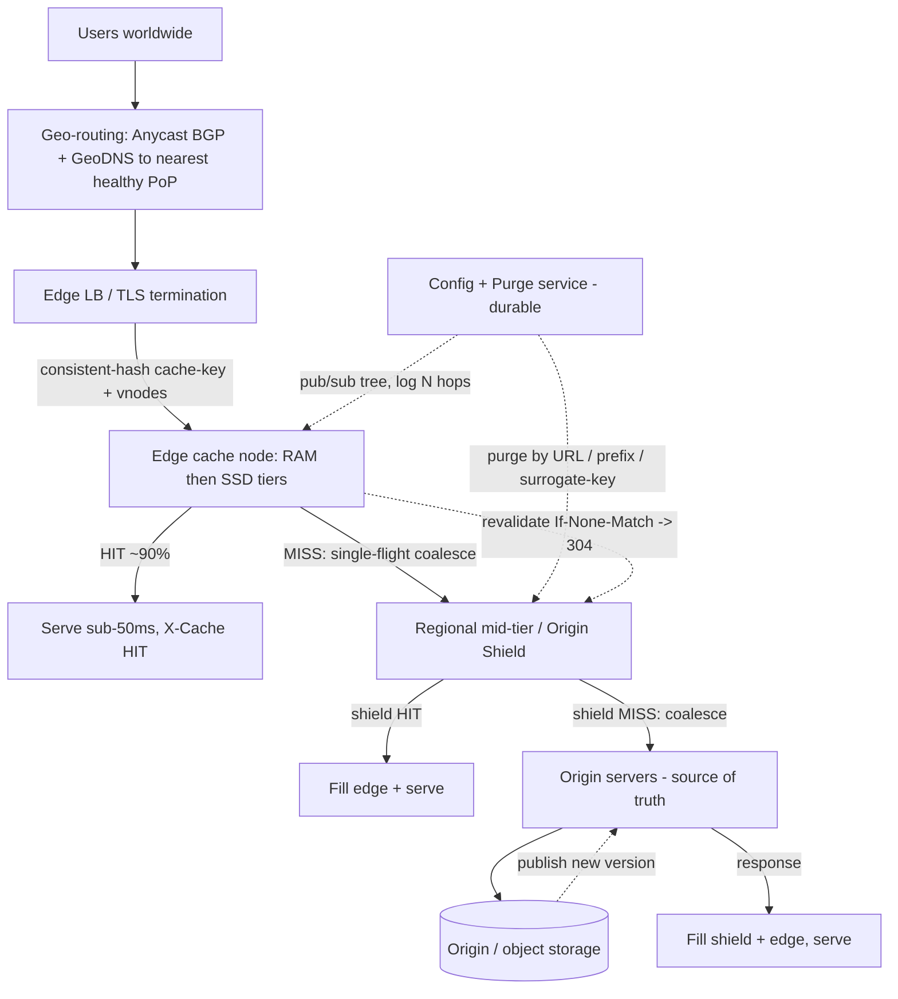

# A23 — Design a CDN (content delivery network)

Design a globally-distributed network of **edge caches** that serves content (static assets, video segments, API responses) to users from a **point of presence (PoP) near them**, dramatically cutting latency and offloading origin servers. It tests whether you understand **edge caching and content distribution as a distinct discipline** — not just "a cache" or "a load balancer," but the interplay of **geo-routing**, a **multi-tier cache hierarchy with origin shielding**, **consistent hashing** across edge nodes, **cache-fill**, **invalidation/TTL**, and the central tension of **hit-ratio vs freshness**. The crux is that the CDN must serve the vast majority of requests *without touching the origin*, while still being able to push out a fresh version (or purge stale/poisoned content) **fast and globally**.

## 1) Clarify — questions to ask the interviewer

- **What content are we serving?** Mostly **static immutable** assets (images, JS/CSS, fonts — cache forever), **large media** (video/HLS segments — huge, segment-cacheable), **dynamic but cacheable** API/HTML (short TTL), or all? This decides TTL strategy, the dominant object size, and whether we need range/segment handling.
- **Read/write mix & traffic shape:** CDNs are overwhelmingly **read**; "writes" are really **origin publishes + invalidations**. What's the request rate, average object size, and is traffic **long-tail** (many cold objects) or **hot-head** (a few viral objects)? I'll assume read:write ≈ 1000:1, trillions of requests/day globally, mixed object sizes — confirm.
- **Latency & coverage target:** what p99 do we promise (e.g. < 50 ms to first byte), and what geographies must we cover? This sizes the **number and placement of PoPs** and the routing strategy.
- **Freshness / consistency needs:** how stale may content be — is **eventual** (TTL-based) fine, or are there assets that must update **near-instantly** worldwide (e.g. a security patch, a wrong/illegal asset to purge)? This is the **hit-ratio vs freshness** decision and gates the **invalidation** design.
- **Invalidation expectations:** purge a single URL, a path prefix, or by **tag/surrogate-key** (e.g. "everything for product 123")? How fast must a global purge complete — seconds or minutes? Determines the invalidation fan-out mechanism.
- **Cacheability control:** who decides TTL — origin `Cache-Control` headers, CDN config, or both? Are there **personalized / non-cacheable** responses (cookies, auth) we must pass through? Cache-key design hinges on this.
- **Origin protection:** how fragile is the origin — must we **shield** it so a cache-miss storm or a viral cold object doesn't melt it? This drives the **mid-tier / origin-shield** layer and request coalescing.
- **Security & correctness:** TLS termination at edge, signed URLs / token auth for premium content, **cache-poisoning** defenses, and handling of `Vary`? Worth scoping early.
- **Build vs serve:** are we serving **third-party** customers' origins (a commercial CDN) or our **own** properties? Multi-tenant config, per-tenant purge, and isolation matter for the former.

**What the interviewer is signaling:** they want to see you treat a CDN as **distinct from a plain cache or LB** — i.e. **geo-routing to the nearest of many PoPs**, a **cache hierarchy with origin shielding**, **consistent hashing** to spread objects across edge nodes without mass remaps when nodes change, **cache-fill with request coalescing** to protect the origin, and an explicit **TTL + invalidation** story. The standout move is to lead with **hit-ratio as the primary objective** (every miss is latency + origin load + cost), quantify it, and frame every design choice — hierarchy, coalescing, consistent hashing, TTL — as serving hit-ratio *without* sacrificing the ability to push fresh content globally on demand.

## 2) Functional Requirements (FR)

**In-scope**
- **Edge PoPs:** serve content from a cache at the **nearest PoP**; terminate TLS at the edge.
- **Geo-routing:** direct each user to a healthy nearby PoP via **anycast** and/or **DNS-based** geo steering.
- **Cache hierarchy + origin shielding:** edge → **regional mid-tier / origin shield** → origin, so misses are absorbed before hitting the origin.
- **Cache-fill:** on a miss, fetch from the next tier / origin, store, and serve — with **request coalescing** so concurrent misses for the same object cause **one** upstream fetch.
- **TTL / freshness:** honor `Cache-Control`/`Expires`, support **stale-while-revalidate** and **stale-if-error**, and **revalidation** (ETag / If-None-Match).
- **Invalidation / purge:** purge by **URL**, **path prefix**, or **surrogate-key/tag**, propagated globally within seconds.
- **Consistent hashing:** distribute objects across the cache nodes within a PoP so adding/removing a node remaps only a small fraction of keys.
- **Range / segment support** for large media (byte ranges, video segments).

**Out-of-scope (defer)**
- Building the **origin application** itself (we cache in front of it).
- A full **DDoS/WAF** product (mention edge filtering as an extension).
- **Edge compute** / serverless-at-edge (acknowledge as a natural evolution).
- **Video transcoding/packaging** (separate system; the CDN caches its output).

## 3) Non-Functional Requirements (NFR)

| Dimension | Target & rationale |
|---|---|
| Scale | Trillions of requests/day; petabytes of egress; tens-to-hundreds of PoPs; objects from KBs (assets) to GBs (media). |
| p99 latency | < 50 ms TTFB for an edge **hit** (user→nearest PoP); a miss adds the fill round-trip (mitigated by shield + coalescing). |
| Availability | 99.99%+ globally; a PoP/node failure must **fail over** (anycast reroute) without user-visible outage. |
| Hit ratio | **Primary objective:** 90%+ edge hit ratio (95%+ with mid-tier) — directly drives latency, origin load, and cost. |
| Consistency / freshness | **Eventual** by default (TTL); **fast global purge** (seconds) for correctness-critical updates. Hit-ratio vs freshness traded explicitly. |
| Durability | Cache is **non-authoritative** (loss = re-fill from origin, tolerable); the **origin** is the source of truth. Config/purge state is durable. |
| Origin protection | Origin must survive cache-miss storms / cold-object virality: shielding + coalescing cap concurrent origin fetches per object at ~1. |
| Security | TLS at edge; signed URLs/tokens for premium content; cache-poisoning defenses; correct `Vary`/cache-key handling. |

## 4) Back-of-envelope estimation

```
Request volume
  Say 10T requests/day -> 10e12 / 86400 ~ 116M requests/s globally (avg);
    peak 2-3x. Spread across ~100 PoPs -> ~1-3M req/s/PoP -> many edge nodes/PoP.

Why hit ratio dominates everything
  At 90% hit ratio, 10% = ~11.6M req/s reach the NEXT tier.
  At 95% (add mid-tier), only ~5.8M/s do. Each +1% hit ratio removes ~1.16M
    req/s of origin/transit load AND egress cost. -> hit ratio is THE lever.

Egress bandwidth
  Avg object ~100 KB (blend of small assets + segmented media):
    116M req/s * 100 KB ~ 11.6 TB/s egress at the edge globally. (Media-heavy
    blends push this far higher.) -> PoPs need huge NIC/peering capacity.

Origin/transit bandwidth (what shielding saves)
  Without shield, 10% miss * 11.6 TB/s = ~1.16 TB/s to origins.
  With mid-tier raising effective hit ratio to 95%+: ~0.58 TB/s -> halved.
  Coalescing further caps it: N concurrent misses for one hot-cold object -> 1 fetch.

Edge cache capacity (per node) and the long tail
  Working set is huge; we can't cache everything. Suppose a PoP holds the hot
    "head" that yields 90% of hits in, say, 50 TB across its nodes.
  Per node: 50 TB / (say 20 nodes) = 2.5 TB SSD/node -> SSD tier + RAM tier
    (hot-hot objects in RAM). Eviction: LRU/LFU; admission control (TinyLFU) to
    stop one-hit-wonders from evicting valuable objects.

Consistent-hashing remap on node change
  K objects across N nodes; lose 1 node -> only ~K/N keys remap (the failed
    node's share) instead of nearly all keys (naive hash mod N). With virtual
    nodes, load redistributes evenly to the survivors.

Invalidation fan-out
  A purge must reach ~100 PoPs * ~20 nodes = ~2000 cache processes.
  Via a pub/sub tree: log(N) hops, completes in ~hundreds of ms to a few sec.
  By surrogate-key, one purge may invalidate millions of URLs cheaply (tag map).
```

## 5) API design

```
# End-user request (HTTP/S to the nearest PoP via anycast/DNS)
GET /<path>            Host: customer.example.com
   Headers honored: Range, If-None-Match (ETag), Accept-Encoding, Cookie/Auth (Vary)
   -> 200 (HIT, X-Cache: HIT) | 200/206 after fill (X-Cache: MISS) | 304 (revalidated)
   Response sets: Cache-Control / Age / ETag / Surrogate-Key (internal)

# Origin contract (origin -> CDN: how to cache)
   Cache-Control: public, max-age=600, stale-while-revalidate=60, stale-if-error=86400
   Surrogate-Key: "product-123 catalog"      # tags for tag-based purge
   ETag / Last-Modified                       # for conditional revalidation

# Cache-fill (edge -> mid-tier -> origin), with coalescing
fill(object_key) -> single upstream fetch per key per node even under N concurrent misses

# Control plane (customer / operator)
PUT  /config/{tenant}            { domains, cache_rules, ttls, geo_rules, signed_url_key }
POST /purge/url        { tenant, url }                     # single object
POST /purge/prefix     { tenant, prefix: "/images/*" }     # path prefix
POST /purge/tag        { tenant, surrogate_key: "product-123" }  # tag-based, fan-out
POST /preload          { tenant, urls[] }                  # warm the edge before a launch

# Signed/token access for premium content
GET /<path>?token=<signed>     # edge validates HMAC/expiry before serving
```

## 6) Architecture — request & data flow

**(a) ASCII layered flow**

```
                 Users worldwide (browsers, apps, players)
                          |
                          v
            [ Geo-routing: Anycast BGP + GeoDNS ]   send user to NEAREST healthy PoP;
                          |                          health-checked, withdraw on failure
        ==================|=========================================================
        |                 v               EDGE PoP (one of ~100, near the user)     |
        |        [ Edge LB / TLS term ]   terminates TLS, picks an edge cache node  |
        |                 |                                                          |
        |                 v   key = hash(cache-key); CONSISTENT HASH ring + vnodes   |
        |        [ Edge cache nodes ]  RAM (hot-hot) -> SSD (hot) tiers              |
        |          |  HIT  -> serve immediately (X-Cache: HIT), sub-50ms            |
        |          |  MISS -> coalesce concurrent misses for same key (single-flight)|
        |          |          then fetch from the next tier ------------------+      |
        ==================|===============================================|====|======
                          | (miss only)                                  |    |
                          v                                              |    | (purge feed
            [ Regional mid-tier / ORIGIN SHIELD ]  one logical cache    |    |  invalidates
              in front of the origin for a region; absorbs edge misses; |    |  here too)
              its own coalescing -> at most ~1 origin fetch per object  |    |
                          |  shield MISS                                 |    |
                          v                                              |    |
                  [ Origin servers ]  source of truth (app / object store / S3-like)
                          |                                              ^    ^
                          v                                              |    |
                  [ Origin / object storage ]  <--- publish new versions |    |
                                                                          |    |
        Control plane (out of band):                                     |    |
          [ Config + Purge service ] --pub/sub tree--> all PoPs/nodes ----+    |
            (durable config, TTL rules, geo rules, surrogate-key -> URL map)    |
          purge by URL / prefix / TAG fans out in log(N) hops -------------------+

   Read (hit):  user -> nearest PoP -> edge node (consistent-hash) -> HIT -> serve.
   Read (miss): edge MISS -> coalesce -> shield -> (shield MISS) -> origin -> fill
                both shield & edge, serve; future requests HIT.
   Write/publish: origin publishes new version; freshness via TTL expiry OR an
                explicit PURGE (URL/prefix/tag) propagated to every PoP in seconds.
```

**Read path — the common case (a hit):** a user's request is steered by **anycast/GeoDNS** to the **nearest healthy PoP**. The PoP's **edge LB terminates TLS** and routes to a specific **edge cache node** chosen by **consistent hashing** of the cache-key (so each object lives on a deterministic node and the same object isn't duplicated across all nodes, wasting capacity). If the node has the object (a **HIT**), it serves it in **sub-50 ms** with `X-Cache: HIT` — no upstream traffic at all. This is ~90% of requests and is the entire point of the system.

**Read path — a miss (cache-fill with coalescing and shielding):** on a **MISS**, the edge node first **coalesces** — if 10,000 users request the same not-yet-cached object simultaneously, **single-flight** ensures only **one** upstream fetch happens and the rest wait for it (this is what stops a viral cold object from stampeding the origin). The fetch goes to the **regional mid-tier / origin shield**, *not* directly to the origin: the shield is a smaller set of caches that **all edges in a region funnel through**, so even if many PoPs miss the same object, the origin sees roughly **one** request. The shield (also coalescing) fetches from the **origin** only on its own miss, then the object is stored at the shield **and** the edge and served. Subsequent requests are hits. The hierarchy + coalescing is precisely what turns a 10% edge-miss rate into a tiny trickle of origin traffic.

**Write / publish / freshness path:** there is no "write" in the user sense — content changes when the **origin publishes a new version**. Freshness is reconciled two ways: (1) **TTL** — objects carry `max-age`; when expired, the edge **revalidates** (conditional `If-None-Match`; a `304` refreshes the TTL cheaply) — eventual consistency, great for hit-ratio; and (2) **explicit purge** — for correctness-critical or fast updates, the **control plane** fans a **purge** (by URL, prefix, or **surrogate-key tag**) out through a **pub/sub tree** to every PoP/node within seconds, evicting the stale object so the next request re-fills the new version. **stale-while-revalidate** lets the edge serve the old copy instantly while refreshing in the background (latency win), and **stale-if-error** serves stale content if the origin is down (availability win).

**(b) Mermaid flowchart**



## 7) Data model & storage choices

- **Cached object — keyed blob in a tiered cache (RAM → SSD), per edge node.** Cache-key = function of `(host, path, normalized query, Vary headers like Accept-Encoding)`; value = `{ bytes, content-type, ETag, fetched_at, ttl, surrogate_keys[] }`. First-principles: the workload is **read-mostly, latency-critical, and the dataset far exceeds RAM**, so we use a **two-tier** store — the hottest objects in **RAM** (microsecond serve) and the broader hot set on **SSD** (fast, high-capacity) — with the origin as the durable backstop. The cache is **non-authoritative**: losing it just forces re-fills, so we optimize for speed and hit-ratio, not durability.
- **Placement — consistent-hash ring with virtual nodes (within a PoP).** First-principles: we must (a) put each object on a **deterministic node** so requests find it and we don't waste capacity caching the same object on every node, and (b) **avoid mass remaps** when a node is added/removed. Plain `hash(key) mod N` remaps nearly **all** keys on any change (cache-wiping). **Consistent hashing** remaps only ~`1/N` of keys (the leaving node's share), and **virtual nodes** spread that share evenly across survivors so no single node is overwhelmed by the redistribution.
- **Eviction & admission — LRU/LFU + admission control (TinyLFU-style).** First-principles: with a long-tail workload, naive LRU lets **one-hit-wonders** evict genuinely hot objects. An **admission filter** only caches an object if it's likely to be reused, protecting hit-ratio; size-aware eviction prevents a few huge media objects from flushing many small valuable ones.
- **TTL / freshness metadata — per object.** `max-age`, `stale-while-revalidate`, `stale-if-error`, `ETag`/`Last-Modified` drive revalidation. First-principles: freshness is a **per-object policy** set by the origin (it knows what's immutable vs volatile), so we honor `Cache-Control` and only override via config where needed.
- **Surrogate-key → URL/tag map (control plane).** First-principles: purging by URL doesn't scale to "invalidate everything for product 123" (which may be thousands of URLs). A **tag (surrogate-key)** attached at fill time lets one purge invalidate an entire logical group cheaply; the map lives in the **durable control plane** and the tags travel with each cached object so edges can evict by tag locally.
- **Config & purge log — durable, replicated, globally distributed.** First-principles: config (cache rules, TTLs, geo rules, signed-URL keys) and purges must be **durable and globally agreed** (the opposite profile from the ephemeral cache), so they live in a strongly-consistent store and propagate via a **pub/sub fan-out tree** to every PoP.
- **Why not a database for cached content?** A DB gives durability and queries we don't need and adds latency we can't afford; the access pattern is **GET by key, serve bytes, evict under pressure** — exactly an in-process tiered KV cache. The authoritative copy already lives at the **origin/object store**, so the CDN tier optimizes purely for **fast reads + high hit-ratio**.

## 8) Deep dive

**Deep dive A — geo-routing, the cache hierarchy, and origin shielding (getting requests to the right place and protecting the origin).**

- **Geo-routing — anycast vs DNS:** with **anycast**, every PoP advertises the *same* IP via BGP and the internet routes the user to the **topologically nearest** PoP automatically; failover is "withdraw the route" (fast, no client change), but you have limited control over *which* PoP and can suffer mid-session rerouting. With **GeoDNS**, the DNS resolver returns a PoP IP based on the resolver's geo/latency tables — more control and per-PoP health steering, but bounded by **DNS TTL** (stale during failover) and resolver-location inaccuracy. Production CDNs use **both**: anycast for coarse, instant proximity + DNS/latency steering for finer control and load balancing. I'd state the tradeoff and pick the hybrid.
- **Cache hierarchy:** **edge** (many PoPs, close to users, smaller per-node capacity) → **regional mid-tier / origin shield** (fewer, larger, funnels a whole region) → **origin**. Why a mid-tier? Edges are numerous and each has a limited working set, so the **same object missing at many edges** would hit the origin many times. Funneling all of a region's edges through **one logical shield** means the **origin sees ~one request per object per region**, and the shield's larger cache also raises the effective hit-ratio for long-tail objects an individual edge couldn't hold.
- **Origin shielding + request coalescing (the origin's survival):** the headline origin threat is a **cache-miss storm** — a popular object expires or a viral cold object appears, and millions of requests miss simultaneously. **Single-flight coalescing** at each node ensures only **one** upstream fetch per object while the rest **wait** on it; combined with the shield, the origin sees roughly **one** fetch globally per object even under a flash crowd. This is the difference between a CDN that protects the origin and one that amplifies load onto it.
- **stale-while-revalidate / stale-if-error:** serve the **stale** copy instantly while refreshing in the background (no user waits on the fill), and serve **stale on origin error** (the CDN keeps the site up even when the origin is down). Both trade a little freshness for big latency/availability wins — explicitly.

**Deep dive B — invalidation, TTL, and the hit-ratio vs freshness tradeoff (the heart of caching correctness).**

- **The fundamental tension:** **longer TTLs → higher hit-ratio** (fewer origin fetches, lower latency/cost) but **staler content**; **shorter TTLs → fresher** but more misses and origin load. There's no free lunch, so we **separate content by volatility**: immutable, fingerprinted assets (`app.a1b2c3.js`) get **near-infinite TTL** (change = new URL, so cache-busting is automatic and hit-ratio is maximal), while volatile content gets **short TTL + revalidation**.
- **Invalidation strategies (in order of power/cost):**
  - **TTL expiry (passive):** cheapest, no fan-out, but you wait out the TTL — fine for most content.
  - **Revalidation (conditional GET):** on expiry, send `If-None-Match`; a `304` refreshes TTL **without re-transferring bytes** — cheap freshness for large objects that rarely change.
  - **Explicit purge (active):** for "this must be gone **now** everywhere" (wrong price, legal takedown, security fix). Purge by **URL** (one object), **prefix** (`/images/*`), or **surrogate-key/tag** (one purge → all URLs tagged `product-123`, even millions). Propagated via a **pub/sub tree** to all PoPs/nodes in **log(N) hops** → seconds globally.
  - **Versioning / cache-busting:** change the URL on publish so old and new coexist and clients fetch the new path — zero purge needed, perfect for static assets.
- **Why tag-based purge matters at scale:** real invalidations are **logical** ("everything about product 123"), not per-URL. Attaching **surrogate-keys** at fill time turns an unbounded URL enumeration into a **single tag purge**, which is the only practical way to invalidate large related sets quickly.
- **Cache-key & `Vary` correctness:** the cache-key must include everything that changes the response (encoding, device, auth where applicable) or you serve the **wrong variant**; mishandling `Vary`/cookies is a top cause of cache **poisoning** and incorrect responses — so we normalize the key carefully and refuse to cache truly personalized responses.

## 9) Key tradeoffs

| Decision | Choice & why | Tradeoff accepted |
|---|---|---|
| Consistency model | **Eventual** (TTL) by default; fast purge for correctness-critical | Content can be briefly stale until TTL expiry / purge lands |
| Hit-ratio vs freshness | Long TTL for immutable (versioned URLs), short TTL + revalidate for volatile | Tuning per content class; some staleness window |
| Geo-routing | **Hybrid anycast + GeoDNS** | Anycast mid-session reroute risk; DNS TTL staleness on failover |
| Hierarchy | Edge → **mid-tier/shield** → origin | Extra hop on a full miss; mid-tier infra cost |
| Origin protection | **Coalescing (single-flight) + shield** | Concurrent misses wait on one fetch (slight latency) to spare the origin |
| Placement | **Consistent hashing + vnodes** | Slightly more complex than mod-N; needed to avoid cache-wiping remaps |
| Eviction | LRU/LFU + **admission control** | Admission filter complexity; protects hit-ratio from one-hit-wonders |
| Invalidation | TTL + revalidation + **tag-based purge** | Purge fan-out infra; tags must be set correctly at fill |
| Stale serving | **stale-while-revalidate / stale-if-error** | Serves slightly stale bytes to win latency/availability |
| CAP | **AP** for serving (always serve, possibly stale); CP for config/purge log | During origin/partition trouble, prefer serving stale over erroring |

## 10) Bottlenecks & failure modes

- **Cache-miss storm / thundering herd on a hot object (TTL expiry or viral cold object).** *Mitigation:* **request coalescing (single-flight)** per node + **origin shielding** so the origin sees ~one fetch; **stale-while-revalidate** so users aren't blocked during the refill; small TTL **jitter** so many objects don't expire in lockstep.
- **Hot object / hot node imbalance (one viral asset overwhelms its consistent-hash node).** *Mitigation:* **replicate** very-hot objects across multiple nodes (or to RAM on all nodes) rather than pinning to one; **virtual nodes** spread load; a hot-object detector can promote and fan out the top-K objects.
- **PoP or edge-node failure.** *Mitigation:* **anycast withdraws** the failed PoP's route (users reroute to the next-nearest automatically); within a PoP, the **consistent-hash ring** remaps the failed node's ~`1/N` share to survivors (cold for a moment, then re-filled) instead of wiping the whole cache.
- **Origin outage.** *Mitigation:* **stale-if-error** serves cached (even expired) content so the site stays up; the shield absorbs retries; alarms on origin health.
- **Mass purge / cache-wipe (a bad global purge or config push flushes everything → origin meltdown).** *Mitigation:* **staged/canary** purges and config rollouts, rate-limited purge fan-out, and re-warming from the shield (not the origin) so the origin isn't hit by the full long tail at once.
- **Cache poisoning / wrong-variant serving (`Vary`/cookie/cache-key mistakes).** *Mitigation:* strict **cache-key normalization**, correct `Vary` handling, never cache responses keyed on un-normalized untrusted headers, and don't cache personalized/auth responses.
- **Consistent-hash skew / churn.** *Mitigation:* **virtual nodes** for even distribution; treat transient node flaps with a **grace period** so a brief blip doesn't trigger churn-storms of remaps and re-fills.
- **Cold-start after a flush / new PoP.** *Mitigation:* **preload/warm** critical objects before a launch; fill new edges from the **mid-tier** rather than the origin.
- **Egress/peering saturation at a PoP under a flash crowd.** *Mitigation:* capacity headroom + per-PoP load steering (shift some users to a neighboring PoP via DNS); tiered serving (RAM for the very hottest to cut SSD/NIC pressure).

## 11) Scale 10x / evolution

- **First to break: origin/transit bandwidth and the long tail**, because edge capacity can't grow as fast as the catalog. Evolve by **adding mid-tier levels** (a deeper hierarchy: edge → metro → regional shield → origin) so each level absorbs more of the long tail and the origin's effective request rate stays ~flat — the hierarchy is the primary scaling lever.
- **More PoPs / finer geo:** push PoPs closer (metro-level, ISP-embedded caches) and improve **latency-based routing** (RUM-driven steering) so users hit the truly fastest PoP, not just the geographically nearest.
- **Hotter content / live events (flash crowds):** strengthen **hot-object detection + replication** (fan a viral object to RAM on all nodes), and pre-position content via **predictive preloading** ahead of known launches/premieres.
- **Tighter freshness at scale:** make **tag-based purge** hierarchical and faster (regional purge brokers, dedup of overlapping purges) so global invalidation stays in the seconds range even as objects and tags grow.
- **Edge compute:** move beyond static caching to **compute at the edge** (request rewriting, A/B, personalization, auth, even API assembly) so more dynamic responses become cacheable/served at the edge — the natural CDN evolution.
- **Cost/efficiency:** size-aware admission and **tiered storage** (RAM/SSD/HDD) tuned per PoP; offload more to **peering** and ISP caches to cut transit cost as egress 10×'s.

## 12) Interviewer probes & follow-ups

- **"How is this different from just putting a cache in front of the origin?"** A CDN adds **geo-distribution** (many PoPs + geo-routing to the nearest), a **cache hierarchy with origin shielding**, **consistent hashing** across edge nodes, **global invalidation/purge**, and explicit **TTL/freshness** policy — it's about serving the *world* close to the user and protecting the origin at planetary scale, not a single local cache.
- **"What's your hit ratio target and why does it matter so much?"** 90%+ at the edge, 95%+ with the mid-tier. Every 1% of misses is ~1M+ req/s of origin/transit load and egress cost at our scale, plus a latency penalty — so **hit-ratio is the primary objective** and every design choice serves it.
- **"How do you protect the origin from a viral cold object or a TTL stampede?"** **Single-flight coalescing** (one upstream fetch per object while others wait) + **origin shielding** (a region's edges funnel through one shield, so the origin sees ~one fetch) + **stale-while-revalidate** and **TTL jitter** so refreshes don't synchronize.
- **"Why consistent hashing inside a PoP?"** So each object lives on a **deterministic node** (requests find it; we don't waste capacity duplicating it everywhere) **and** adding/removing a node remaps only ~`1/N` of keys instead of wiping the whole cache like `mod N` would. **Virtual nodes** keep the redistribution even.
- **"How do you invalidate content globally and how fast?"** TTL for the common case; **revalidation** (`If-None-Match` → `304`) for cheap freshness; and **explicit purge** by URL/prefix/**surrogate-key tag** fanned out via a pub/sub tree to all PoPs in **log(N) hops → seconds**. Tags let one purge kill millions of related URLs.
- **"Anycast or DNS for routing?"** Both. **Anycast** for instant topological proximity and route-withdrawal failover; **GeoDNS/latency steering** for finer control and load balancing. Anycast risks mid-session reroutes; DNS is bounded by TTL during failover — the hybrid covers each other's gaps.
- **"How do you handle the long tail you can't fully cache?"** Tier the cache (RAM→SSD), use **admission control** so one-hit-wonders don't evict hot objects, and rely on the **mid-tier** to hold a broader hot set; truly cold objects fill from the shield/origin and that's acceptable since they're rare per object.
- **"Hit-ratio vs freshness — how do you decide TTLs?"** Separate by **volatility**: immutable, **fingerprinted** assets get near-infinite TTL (new content = new URL), volatile content gets short TTL + revalidation, and correctness-critical changes use **explicit purge**. That maximizes hit-ratio while keeping the ability to be fresh on demand.
- **"What happens when the origin is down?"** **stale-if-error** keeps serving cached (even expired) content so users see no outage; the shield absorbs retries; we alarm and avoid hammering the origin.
- **"How do you avoid serving the wrong cached variant?"** Careful **cache-key normalization** + correct **`Vary`** handling (encoding/device/auth), and never caching personalized/auth responses — this also prevents **cache poisoning**.

## 13) 60-minute flow cheat-sheet

| Time | Phase | What to do |
|---|---|---|
| 0–6 min | Clarify | Content type/size, read:write shape, latency+coverage, **freshness/invalidation needs**, origin fragility, multi-tenant? |
| 6–9 min | FR/NFR | Lock edge-hit < 50 ms, **90%+ hit ratio as primary goal**, eventual + fast purge, origin protection |
| 9–15 min | Estimation | Requests/s/PoP, **why hit-ratio dominates** (origin load + cost), egress BW, edge capacity + long tail, purge fan-out |
| 15–20 min | API + high-level arch | GET + `Cache-Control`/`Surrogate-Key`, purge by URL/prefix/tag; draw both diagrams; edge→shield→origin |
| 20–25 min | Walk read (hit/miss) + publish paths | Geo-route → edge HIT; MISS → coalesce → shield → origin → fill; publish → TTL/revalidate or purge |
| 25–40 min | Deep dive | (A) geo-routing, hierarchy, **origin shielding + coalescing**; (B) **TTL + invalidation + hit-ratio-vs-freshness** |
| 40–48 min | Tradeoffs + failures | Eventual vs purge, anycast vs DNS, miss-storm, hot object/node, cache poisoning, mass-purge meltdown |
| 48–55 min | Scale 10x | Deeper hierarchy for the long tail, more/closer PoPs, hot-object replication, hierarchical purge, edge compute |
| 55–60 min | Probes | CDN-vs-cache distinction, hit-ratio justification, origin protection, consistent hashing, global purge speed |
