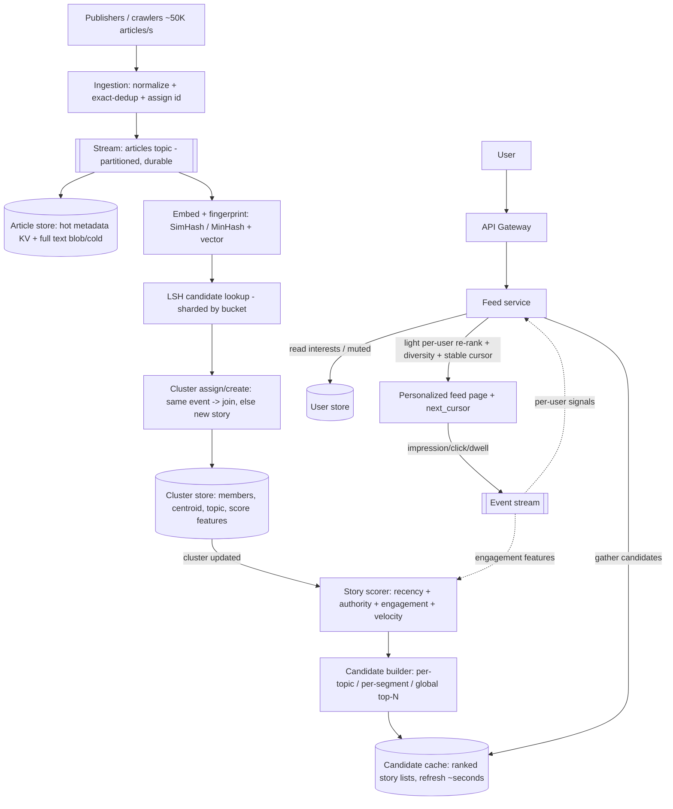

# A24 — Design a news feed / Google News (story clustering + ranking)

Design a system that **ingests a continuous stream** of articles from thousands of publishers, **clusters near-duplicate coverage** of the same event into a single "story," and serves each user a **personalized, ranked, fresh feed** of those stories. It tests whether you can compose **three hard subsystems in one pipeline** — high-throughput **streaming ingestion**, **near-duplicate detection / clustering** of unstructured text, and **personalized ranking** that balances recency, relevance, and per-user interest — and reason about **fan-out (read vs write)**, **freshness**, and **feed pagination**. The crux is that news is **write-heavy and time-critical** (breaking stories must appear in seconds) *and* read-heavy (every user pulls a personalized feed), so the design must reconcile fast global clustering with cheap personalized reads.

## 1) Clarify — questions to ask the interviewer

- **Is this Google-News-style (publisher articles → clustered stories) or social (friends' posts)?** It matters enormously: a **content/news** feed clusters *the same event* from many publishers and ranks by topicality/quality, while a **social** feed fans out *your connections'* posts. I'll assume the **news** model (clustering + ranking of publisher content) — confirm, because it makes **clustering** central and changes the fan-out story.
- **Personalization depth:** is the feed the **same for everyone** (a global ranked edition), **lightly personalized** (by topics/locale the user follows), or **fully personalized** (per-user ML ranking from behavior)? This decides whether ranking is global+cached or per-user, and how heavy the read path is.
- **Scale:** how many **publishers / articles ingested per second**, how many **users / feed requests per second**? I'll assume O(100K) publishers, ~10K–50K new articles/sec at peak (breaking news), O(500M) users, and high feed-read QPS — confirm, since ingestion rate drives the clustering pipeline and read QPS drives the serving tier.
- **Freshness SLA:** how fast must a **breaking story** appear in feeds after publication — **seconds**, or minutes? Must a story's cluster **update live** as more outlets cover it? This is the hardest constraint and gates the streaming/clustering latency budget.
- **Read/write mix & fan-out:** since stories are **shared across users** (unlike per-author social posts), can we rank **once globally** and personalize cheaply at read time, rather than fan-out-on-write per user? I'll propose that and confirm it fits the product.
- **Ranking signals:** recency, source authority, click/engagement, topical match to user interests, diversity (don't show 10 versions of one story)? Any **editorial / policy** constraints (misinformation suppression, source quality)? This shapes the ranking model and features.
- **Feed semantics:** infinite scroll with **stable pagination** (no dupes/skips as new stories arrive)? Per-session ordering, or a fresh rank each request? Determines the pagination/cursor design.
- **Dedup granularity:** cluster only **near-identical** wire-copy reprints, or also **same-event different-angle** coverage? "Near-dup" vs "same-story" are different thresholds — confirm what counts as one story.

**What the interviewer is signaling:** they want to see you **decompose a pipeline** (ingest → cluster → rank → serve) and pick the right tool for each stage, *and* handle the classic news-feed tradeoffs: **fan-out read vs write**, **freshness vs cost**, and **stable pagination**. The standout move is to recognize that **stories are shared, not per-user**, so you cluster + rank **once globally** (write-side) and apply **cheap per-user personalization at read time** — avoiding the per-user fan-out that dominates social-feed designs — and to treat **near-dup clustering** as a streaming, incremental problem (not a batch re-cluster), because new coverage of a story arrives continuously.

## 2) Functional Requirements (FR)

**In-scope**
- **Ingestion stream:** continuously pull/receive articles from many publishers (RSS, APIs, crawlers), normalize, and emit onto a durable stream within seconds.
- **Near-dup detection / clustering:** group articles covering the **same event** into one **story cluster**; update clusters **incrementally** as new coverage arrives.
- **Ranking:** order stories per request by **recency + relevance/quality + personalization**, with **diversity** (no near-dup stories adjacent, topic spread).
- **Personalized feed:** serve each user a ranked feed reflecting their topics/locale/behavior; same underlying stories, per-user ordering.
- **Freshness:** breaking stories appear within **seconds**; clusters and ranks refresh as the event develops.
- **Feed pagination:** infinite scroll with **stable** cursoring (no duplicates or gaps as new stories arrive mid-scroll).

**Out-of-scope (defer)**
- **Article hosting / full-text storage** and the publisher relationship/billing (we index + link).
- **Comment/social graph** features (likes, follows of *people*) — this is content, not social (acknowledge).
- **Crawling/fetching infrastructure** internals (assume an ingestion feed exists; mention crawler at the edge).
- Deep **content-moderation ML** beyond source-quality + policy signals (note as extension).

## 3) Non-Functional Requirements (NFR)

| Dimension | Target & rationale |
|---|---|
| Scale | O(100K) publishers; ~10K–50K articles/sec ingested at peak; O(500M) users; high feed-read QPS (hundreds of K/s). |
| p99 latency | Feed read p99 < 200 ms (mostly precomputed candidates + light per-user re-rank). Ingestion→clustered→eligible for feed: **< 10–30 s** for breaking news. |
| Availability | 99.95%+ for feed reads (degrade to a slightly stale/global feed rather than error). |
| Consistency | **Eventual** is fine for feed contents (a story appearing a few seconds late is acceptable); clustering must **converge** (an article lands in exactly one story). |
| Freshness | Breaking story visible within **seconds**; cluster membership + rank update continuously as coverage grows. |
| Durability | Ingested articles + cluster assignments durable; user interaction log durable (feeds the ranker). Serving caches ephemeral. |
| Diversity/quality | No two near-dup stories adjacent; source-quality + policy filters applied; bounded repetition across pages. |
| Cost | Cluster + rank stories **once globally**; avoid per-user fan-out-on-write — stories are shared, so write-side work is amortized over all readers. |

## 4) Back-of-envelope estimation

```
Ingestion
  Peak ~50K articles/s (breaking-news surge). Steady-state maybe ~5-10K/s.
  Each article ~ a few KB text + metadata -> ~50K * 5 KB = 250 MB/s peak into
    the stream -> a partitioned log (Kafka-like) handles this easily.

Clustering work (the hard, write-side part)
  Each new article must be compared to EXISTING recent clusters (not all articles).
  Naive all-pairs is O(N^2) -> impossible. Use LSH/MinHash to fetch only
    candidate-similar clusters (a handful) per article:
    50K articles/s * (hash + ~tens of candidate comparisons) -> tractable,
    sharded by LSH bucket. Clusters are kept only for a recent window (news ages
    out), so the active cluster set is bounded (say millions of live stories,
    most cold) -> index only the hot recent window.

Storage
  Articles: 50K/s * 86400 = ~4.3B/day * 5 KB ~ 21 TB/day raw -> but we keep
    metadata + embedding + cluster ref hot (~1 KB) and push full text to cheap
    blob/cold store. Hot metadata: 4.3B * 1 KB = ~4.3 TB/day -> age out fast
    (news relevance window ~days) so live hot set is bounded.
  Clusters: store {cluster_id, member_article_ids, centroid/embedding, topic,
    first_seen, last_updated, score_features} -> millions live * ~few KB = GBs.

Read / feed-serving
  Say 100M DAU * ~20 feed loads/day = 2B reads/day / 86400 ~ 23K/s avg,
    peak ~5x -> ~100K+ feed reads/s. Each read = fetch top candidate stories
    (precomputed, cached) + a LIGHT per-user re-rank over ~hundreds of candidates.

Why fan-out-on-READ, not write
  If we fanned out each new story to every interested user's feed (write):
    1 breaking story interesting to 100M users = 100M feed writes -> absurd.
  Stories are SHARED -> rank once globally into topic/segment candidate sets,
    then personalize cheaply at read time. Write-side cost ~ #stories, not
    #stories * #users. This is THE key scaling decision.

Candidate cache
  Global + per-topic + per-segment ranked candidate lists: say 100K topics/segments
    * top 500 stories * ~200 B ref = ~10 GB -> fits in an in-memory cache,
    refreshed every few seconds as ranks change.
```

## 5) API design

```
# Ingestion (publishers / crawler -> system)
ingest(article)   # {url, publisher, title, body, published_at, lang, region}
   -> normalize -> emit to stream topic "articles"; assign article_id

# Internal pipeline (stream consumers)
cluster(article)  -> {cluster_id}              # LSH candidate lookup -> assign/create
rankStory(cluster_id) -> score_features        # recompute story score on update
indexCandidates(topic|segment) -> top-N ranked story list (cached)

# Feed read (user-facing)
GET /feed?user_id=&cursor=&limit=20
   -> { stories: [ {cluster_id, headline, top_sources[], topic, published_at,
                    score} ], next_cursor }
   # cursor encodes (rank snapshot id + position) for STABLE pagination
GET /story/{cluster_id}
   -> { headline, summary, sources: [{publisher, url, title}], timeline, related }

# Interaction logging (feeds the personalization model)
POST /event   { user_id, cluster_id, action: impression|click|dwell|hide, ts }

# Control / personalization
PUT /users/{u}/interests   { topics[], regions[], muted_sources[] }
```

## 6) Architecture — request & data flow

**(a) ASCII layered flow**

```
   Publishers / crawlers (RSS, APIs, news sites)  ~50K articles/s at peak
            |
            v
     [ Ingestion service ]  normalize (extract title/body/lang/region/time),
            |               dedup exact reprints, assign article_id
            v
     [ Stream / log: "articles" topic ]  (Kafka-like, partitioned, durable)
            |                         \
            | (consumer group)         \ (tee)
            v                           v
   ===== CLUSTERING pipeline =====   [ Article store ]  metadata hot (KV) +
   |  [ Embed + fingerprint ]    |     full text -> blob/cold; embedding cached
   |    SimHash/MinHash + vector |
   |        |                    |
   |        v                    |
   |  [ LSH candidate lookup ]  -+--> fetch only similar RECENT clusters
   |    (sharded by LSH bucket)  |     (avoids O(N^2) all-pairs)
   |        |                    |
   |        v                    |
   |  [ Cluster assign/create ] -+--> [ Cluster store ]  {cluster_id, members,
   |    same-event? -> join;     |       centroid, topic, first_seen, last_upd,
   |    else new story           |       score_features}  (KV + secondary index)
   ================|==============
                  | cluster created/updated event
                  v
   ===== RANKING pipeline =====
   |  [ Story scorer ]  features: recency, source authority/quality,
   |    engagement (from event stream), cluster size/velocity, topic
   |        |
   |        v
   |  [ Candidate builder ]  per TOPIC / per SEGMENT / global top-N lists
   |        |  (ranked once GLOBALLY -> shared by all users)
   ================|==============
                  v
        [ Candidate cache ]  in-memory ranked story lists per topic/segment/global,
            |                refreshed every few seconds (freshness)
            |
   <<<<<<<< READ PATH (per user) >>>>>>>>
            |
   user -> [ API Gateway ] -> [ Feed service ]
                                  |  1. gather candidates from the user's
                                  |     topics/segments (from candidate cache)
                                  |  2. LIGHT per-user re-rank (interests, recency,
                                  |     muted sources) + DIVERSITY (dedup near-dup
                                  |     stories, topic spread)
                                  |  3. apply stable CURSOR (rank-snapshot + pos)
                                  v
                          ranked personalized feed page + next_cursor

   [ User store ]   interests, muted sources, region (read at feed time)
   [ Event stream ] impressions/clicks/dwell -> feeds engagement features + ranker
```

**Write path (ingest → cluster → rank — done once, globally):** publishers/crawlers feed the **Ingestion service**, which **normalizes** each article (extract title/body, detect language/region/time, drop exact reprints) and emits it to a durable, partitioned **"articles" stream**. One branch **tees** the article to the **Article store** (hot metadata + embedding in a KV; full text to cheap blob/cold storage). The **Clustering pipeline** consumes the stream: it computes a **fingerprint/embedding** (SimHash/MinHash for near-dup text, plus a semantic vector), does an **LSH candidate lookup** to retrieve only the **handful of recent clusters** that might match (avoiding an impossible O(N²) all-pairs comparison), and either **joins** the article to an existing **story cluster** (same event) or **creates a new** one. A cluster create/update event triggers the **Ranking pipeline**: the **Story scorer** computes features (recency, source authority/quality, engagement velocity from the event stream, cluster size/growth) and the **Candidate builder** produces **per-topic / per-segment / global** ranked story lists. Crucially this ranking is **global and shared** — done **once per story**, not per user — and pushed into the **Candidate cache**, refreshed every few seconds so breaking stories surface quickly.

**Read path (per-user feed — cheap personalization on shared candidates):** a feed request hits the **Feed service**, which (1) **gathers candidate stories** from the **Candidate cache** for the user's topics/segments (read from the **User store**), (2) applies a **light per-user re-rank** — boost followed topics, demote **muted sources**, weight recency to taste — plus a **diversity pass** (collapse near-dup stories so the user never sees ten versions of one event, and spread topics), and (3) applies a **stable cursor** so infinite scroll doesn't duplicate or skip stories as new ones arrive. Because the heavy lifting (clustering, global ranking) already happened on the write side and is **shared across all users**, each read is cheap (fetch precomputed candidates + a small re-rank over a few hundred items) — which is exactly why we choose **fan-out-on-read**: a single breaking story interesting to 100M users costs **one** global rank update, not 100M feed writes.

**Engagement loop:** impressions/clicks/dwell/hide flow to the **Event stream**, feeding **engagement features** back into the Story scorer (popular stories rise) and the per-user personalization model — closing the loop so ranking improves continuously.

**(b) Mermaid flowchart**



## 7) Data model & storage choices

- **Articles — partitioned stream + KV (hot) + blob (cold).** The **stream** ("articles" topic, Kafka-like) is the durable backbone: it decouples bursty ingestion from clustering, lets multiple consumers (cluster, index, archive) read independently, and replays on failure. First-principles: ingestion is **write-heavy and bursty** (breaking news), and several stages need the same data, so a **durable partitioned log** is the right ingestion primitive. Hot **metadata + embedding** live in a **KV** (`article_id -> {url, publisher, title, lang, region, published_at, embedding, cluster_id}`) for fast lookup; **full text** goes to cheap **blob/cold storage** (large, rarely re-read).
- **Clusters (stories) — KV + secondary indexes.** `cluster_id -> {member_article_ids[], centroid_embedding, simhash, topic, region, first_seen, last_updated, score_features}`. First-principles: clustering is fundamentally **"find the nearest existing story for this article,"** so we need (a) fast point lookup of a cluster and (b) a **similarity index** to find candidates — hence a KV for the cluster record plus an **LSH/vector index** over recent clusters. News **ages out**, so we index only a **recent window**, keeping the active set bounded.
- **LSH / similarity index — sharded by LSH bucket (near-dup) + ANN vector index (semantic).** First-principles: the dedup/clustering step must avoid **O(N²)** comparisons; **LSH (MinHash for Jaccard of shingles, SimHash for cosine)** maps similar documents to the same bucket so each new article only compares against a **handful** of candidates in its bucket, and an **approximate-nearest-neighbor (ANN)** vector index catches same-event-different-wording coverage. This index is the heart of "near-dup detection at streaming scale."
- **Candidate lists — in-memory cache (Redis-like).** `topic|segment|global -> [ranked cluster_ids]`. First-principles: feed reads are high-QPS and latency-critical, and the *expensive* ranking is **shared across users**, so we precompute **ranked candidate lists once** and cache them, refreshed every few seconds. This is what makes per-user reads cheap and **fan-out-on-read** viable.
- **User profile — KV.** `user_id -> {interests[], regions, muted_sources[], recent_seen_cursor}`. First-principles: read on every feed request for personalization; small, point-lookup, latency-sensitive → KV.
- **Interaction log — append-only stream → feature store / warehouse.** Impressions/clicks/dwell/hide. First-principles: high-volume, write-heavy, consumed by the ranker for **engagement features** and offline model training → an append-only event stream into a feature store, not a transactional DB.
- **Why not rank per-user and store per-user feeds (fan-out-on-write)?** Because **stories are shared**: a breaking story relevant to 100M users would require 100M feed writes per update, and stories update continuously as coverage grows. Ranking **once globally** into shared candidate lists and personalizing at read time makes write cost scale with **#stories**, not **#stories × #users** — the decisive efficiency choice for a *content* (vs social) feed.

## 8) Deep dive

**Deep dive A — near-dup detection & incremental clustering at streaming scale (the crux).**

- **The problem:** thousands of outlets publish overlapping coverage of the same event continuously; we must collapse them into **one story** in near-real-time, and keep updating the cluster as new coverage lands — all without O(N²) comparisons.
- **Two notions of "same":** (1) **near-duplicate** wire-copy / lightly-edited reprints → catch with **shingling + MinHash (Jaccard)** or **SimHash (cosine on token hashes)**; (2) **same event, different wording/angle** → catch with **semantic embeddings** + **ANN** similarity. We use both: SimHash/MinHash for cheap near-dup, embeddings for semantic same-event.
- **LSH to avoid all-pairs:** each new article is hashed into **LSH buckets**; we only compare it to the **few existing recent clusters** that share a bucket (candidates), not the whole corpus. This turns clustering into roughly **O(N × small-candidate-set)** — tractable at 50K articles/s when sharded by bucket.
- **Incremental online clustering (not batch):** maintain each cluster's **centroid** (embedding) + representative SimHash. For a new article: find candidate clusters via LSH/ANN; if its similarity to a candidate's centroid exceeds a **threshold**, **join** it (and update the centroid incrementally); else **create a new** cluster. This is **single-pass/online** so breaking stories form in seconds, unlike a periodic batch re-cluster. Periodically run a **background reconciliation** to merge clusters that drifted together or split ones that conflate two events.
- **Thresholds & quality:** the **join threshold** trades **precision vs recall** — too loose merges distinct events (one giant blob), too tight fragments one story into many. Tune per content type/language; use a **two-stage** check (cheap SimHash gate → embedding confirmation) to keep both fast and accurate. Pick a **canonical headline/source** per cluster (highest-authority or earliest) for display.
- **Why this is hard at scale:** the candidate index must be **sharded** (by LSH bucket) and **windowed** (only recent clusters, since news ages out), embeddings must be computed at ingest rate, and updates must be **idempotent** (an article lands in exactly one cluster even with retries/replays). I'd call out idempotency + windowing explicitly.

**Deep dive B — ranking, fan-out (read vs write), freshness, and stable pagination.**

- **Ranking signals & model:** combine **recency** (news decays fast — a freshness/time-decay term), **source authority/quality** (trusted outlets up, low-quality down), **engagement velocity** (clicks/dwell per impression, *rate* not just count, to catch rising stories), **cluster size/velocity** (many outlets covering = bigger event), **topical match** to the user, and **diversity**. Start with a transparent weighted score (defensible, debuggable) and layer a learned ranker (gradient-boosted / neural) trained on the interaction log; serve the heavy model on the **global candidate set**, keep the **per-user** layer light.
- **Fan-out read vs write — the decisive call:** **social** feeds often fan out on **write** (push a post to followers' feeds) because posts are per-author and graphs are bounded. **News stories are shared by everyone**, and they update continuously, so fan-out-on-write would mean re-writing hundreds of millions of feeds per breaking update — absurd. We therefore **fan-out-on-read**: rank stories **once globally** into shared **topic/segment candidate lists**, and assemble+personalize each user's feed **at read time** from those lists. Write cost ∝ #stories; read cost is a cheap merge + re-rank. (For a *small* set of ultra-engaged or notification cases, a hybrid push is possible — mention it.)
- **Freshness vs cost:** breaking stories must appear in **seconds**, so candidate lists refresh every few seconds and a **"breaking/just-in" lane** can bypass slower ranking to inject high-velocity new stories immediately, reconciled into the full rank shortly after. The tradeoff: refreshing more often costs more compute — we refresh hot topics aggressively and cold ones lazily.
- **Stable pagination (a classic trap):** new stories arrive **while** a user scrolls, so a naive offset/score cursor causes **duplicates and skips**. Fix: the cursor encodes a **rank-snapshot id + position** (or a stable sort key like `(score_bucket, cluster_id)` frozen for the session/window), so a session pages through a **consistent ordering**; brand-new stories appear at the **top on refresh**, not injected mid-scroll. Also dedupe against the **recent-seen** set so a user isn't shown a story they already scrolled past as its rank changes.

## 9) Key tradeoffs

| Decision | Choice & why | Tradeoff accepted |
|---|---|---|
| Fan-out | **Read** (rank once globally, personalize at read) — stories are shared | Read does a per-request merge + re-rank (kept light) |
| Clustering | **Incremental online** (LSH/ANN candidate + centroid) | Approximate; needs background reconciliation to fix drift/merges |
| Dedup method | SimHash/MinHash (near-dup) + **embeddings** (same-event) | Two-stage cost; threshold tuning for precision/recall |
| Avoiding O(N²) | **LSH bucketing**, windowed to recent clusters | Misses across buckets possible; tuned bands trade recall/cost |
| Ranking model | Transparent weighted score → learned ranker on global set; light per-user layer | Heavy model only global; per-user is approximate but cheap |
| Freshness | Few-second candidate refresh + breaking lane | More compute for hot topics; cold topics lag slightly |
| Consistency | **Eventual** feed contents; clustering must **converge** + be idempotent | A story may appear seconds late; brief cluster instability |
| Pagination | **Stable cursor** (rank-snapshot/sort-key) + recent-seen dedup | New stories surface on refresh, not mid-scroll |
| Storage | Stream + hot KV + cold blob; index only recent clusters | Old articles cold/slow to re-rank (acceptable — news ages out) |
| CAP | **AP** for serving (always serve, maybe slightly stale); durable stream for ingest | During trouble, serve a slightly stale/global feed over erroring |

## 10) Bottlenecks & failure modes

- **O(N²) clustering blow-up (comparing every article to every other).** *Mitigation:* **LSH/ANN candidate retrieval** (compare only same-bucket recent clusters) + **windowing** to the recent set, turning it into near-linear, shardable work.
- **Hot story / breaking-news surge (one event spikes ingestion + everyone reads it).** *Mitigation:* ingestion is buffered by the **durable stream** (absorbs bursts); clustering shards by LSH bucket (the hot event's articles spread across consumers); the story is **ranked once globally** and served from the **candidate cache**, so 100M readers cost one cache read each — fan-out-on-read shines exactly here.
- **Mis-clustering (two events merged, or one event fragmented).** *Mitigation:* **two-stage** similarity (cheap gate + embedding confirm), tuned thresholds, and **background reconciliation** to split/merge; keep per-cluster provenance so a bad merge is auditable/reversible.
- **Stale feed / freshness miss (breaking story doesn't show fast).** *Mitigation:* a **breaking lane** injects high-velocity new clusters immediately while full ranking catches up; refresh hot-topic candidate lists every few seconds.
- **Ranking-service overload at read time.** *Mitigation:* keep the **per-user** re-rank **light** (a few hundred candidates, simple features); do the heavy model **offline/global**; cache assembled pages briefly per (segment, cursor).
- **Pagination duplicates/skips as ranks shift mid-scroll.** *Mitigation:* **stable cursor** (frozen sort key / rank-snapshot) + **recent-seen** dedupe; surface new stories only on explicit refresh.
- **Thundering herd on candidate-cache refresh / expiry.** *Mitigation:* **single-flight** recompute per topic, staggered/jittered refresh, serve-stale-while-recomputing.
- **Spam / low-quality / misinformation flooding the feed.** *Mitigation:* **source-quality** and policy signals in ranking (demote/suppress), per-cluster source diversity (don't let one farm dominate a story), and rate/quality gates at ingestion.
- **Filter bubble / over-personalization.** *Mitigation:* enforce **diversity** and inject some globally-important stories regardless of personal interest; bound repetition across pages.

## 11) Scale 10x / evolution

- **First to break: the clustering pipeline** as ingestion and the live-cluster set grow. Evolve by **sharding the LSH/ANN index** finer (by bucket, language, region), tightening the **recency window** for the hot index (older stories drop to a colder, less-frequently-searched tier), and scaling clustering consumers horizontally off the partitioned stream.
- **Ranking cost as personalization deepens:** keep the expensive model on the **global candidate set** and push more personalization into a **cheap per-user layer**; precompute **per-segment** lists (cohorts of similar users) so most users share a near-final ranking and only a thin personal delta is computed per request.
- **Freshness at higher volume:** add a dedicated **streaming "breaking" path** with its own fast (approximate) ranking so new stories surface in seconds independent of the heavier global re-rank, reconciled shortly after.
- **Global / multi-region:** run ingestion + clustering **regionally** (local publishers, language, residency) and replicate **cross-region** clusters for global stories; serve feeds from the nearest region with locale-aware candidate lists.
- **Richer dedup/clustering:** move from lexical SimHash toward stronger **semantic embeddings** and entity/event extraction so "same event, very different wording (or language)" clusters correctly; cross-lingual clustering for global stories.
- **Hybrid fan-out:** for the small population of ultra-active users or push-notification cases, add a **write-side push** of top breaking stories to a per-user inbox, keeping the bulk on read-side fan-out — best of both as scale grows.

## 12) Interviewer probes & follow-ups

- **"Fan-out on read or write — and why?"** **Read.** News **stories are shared by all users** and update continuously, so pushing each update to hundreds of millions of feeds is absurd. I rank stories **once globally** into shared topic/segment candidate lists and personalize **at read time** — write cost scales with #stories, read is a cheap merge + light re-rank. (Social feeds differ because posts are per-author.)
- **"How do you cluster near-duplicate articles without O(N²)?"** **LSH** buckets similar documents together (MinHash for Jaccard, SimHash for cosine) plus an **ANN vector index** for same-event-different-wording; each new article compares only against the **handful** of candidates in its bucket among **recent** clusters — near-linear and shardable.
- **"How does a breaking story appear in feeds within seconds?"** Ingestion buffers on a durable stream; **online incremental clustering** forms/updates the story immediately; a **breaking lane** injects high-velocity new clusters into candidate lists right away (approximate rank), refreshed every few seconds, reconciled into the full rank shortly after.
- **"What signals does ranking use?"** Recency (time-decay), **source authority/quality**, **engagement velocity** (rate, to catch rising stories), cluster size/coverage, topical match to the user, and **diversity**. Transparent weighted score first, then a learned ranker trained on the interaction log — heavy model on the global set, light per-user layer at read time.
- **"How do you keep the feed diverse — not ten versions of one story?"** Clustering already collapses near-dups into **one story**; a **diversity pass** at read time spreads topics, caps per-source dominance within a story, and bounds repetition across pages; we also inject some globally-important stories to fight filter bubbles.
- **"How do you paginate infinite scroll without dupes/skips as new stories arrive?"** A **stable cursor** encoding a rank-snapshot / frozen sort key so a session pages a consistent ordering, plus a **recent-seen** dedupe; new stories surface at the top **on refresh**, not injected mid-scroll.
- **"What if two different events get merged into one cluster?"** Two-stage similarity (cheap SimHash gate → embedding confirm) and **background reconciliation** that splits/merges clusters; per-cluster provenance makes a bad merge auditable and reversible, and thresholds are tuned per language/topic.
- **"Why a stream (Kafka-like) for ingestion?"** It **decouples** bursty ingestion from clustering, **buffers** breaking-news surges, lets **multiple consumers** (cluster, index, archive) read independently, and **replays** on failure — exactly what a write-heavy, multi-stage pipeline needs.
- **"How do you personalize cheaply if ranking is global?"** Global ranking produces shared **candidate lists**; per user we do a **light re-rank** over a few hundred candidates (boost followed topics, demote muted sources, weight recency) — bounded work, sub-200 ms, while the expensive modeling stays shared.
- **"How do you handle spam / low-quality sources?"** Source-quality + policy signals **demote/suppress** in ranking, **source diversity** prevents a content farm from dominating a story, and ingestion applies rate/quality gates — quality is a first-class ranking input, not an afterthought.

## 13) 60-minute flow cheat-sheet

| Time | Phase | What to do |
|---|---|---|
| 0–6 min | Clarify | **News (clustering) vs social**, personalization depth, scale (ingest/s + read QPS), **freshness SLA**, pagination semantics, dedup granularity |
| 6–9 min | FR/NFR | Lock ingest→eligible < 30 s, feed read < 200 ms, eventual feed + convergent clustering, diversity |
| 9–15 min | Estimation | Ingest BW, **why O(N²) clustering fails → LSH**, **why fan-out-on-read** (stories shared), candidate-cache size |
| 15–20 min | API + high-level arch | ingest/cluster/rank/feed endpoints; draw both diagrams; stream → cluster → global rank → candidate cache → read |
| 20–25 min | Walk write + read paths | Ingest→stream→LSH cluster→global rank→cache; read = gather candidates + light re-rank + diversity + stable cursor |
| 25–40 min | Deep dive | (A) near-dup detection + **incremental online clustering** (LSH/ANN, thresholds, idempotency); (B) ranking + **fan-out read vs write** + freshness + stable pagination |
| 40–48 min | Tradeoffs + failures | Read-fan-out, online-vs-batch clustering, mis-clustering, freshness lane, pagination stability, spam/quality |
| 48–55 min | Scale 10x | Shard LSH/ANN + window, per-segment ranking, dedicated breaking path, regional clustering, semantic/cross-lingual |
| 55–60 min | Probes | Fan-out justification, O(N²) avoidance, breaking-story latency, ranking signals, stable pagination, bad-merge recovery |
