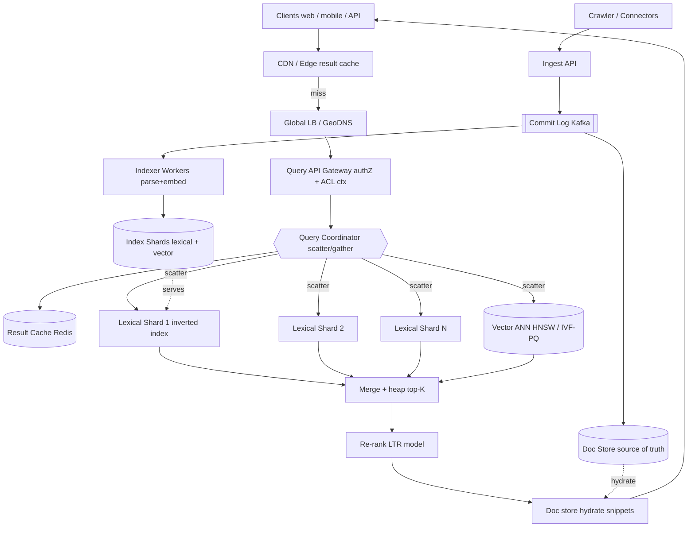

# B01 — Design a large-scale search / indexing system

This is the single highest-probability prompt for the Search Feature team, so it must be flawless. It tests whether you can take an unbounded corpus, build and shard an inverted index, fan a query out across thousands of shards, rank the merged results, and keep the index fresh — all under a strict p99 latency budget. Google asks it because every interesting product (Web, Drive, Photos, Code, Ads) is a search problem underneath, and a Staff engineer is expected to own the full ingest-index-serve-rank loop, not just one box.

## Lead with this — your résumé hook

I have built and operated hybrid search over a **1B+ document corpus** serving production traffic at **p99 ~200 ms**, combining a Solr/Elasticsearch lexical tier with a dense-vector tier for semantic recall. So when I design this, I am not reasoning from a textbook — I have personally tuned shard counts against tail latency, fought segment-merge storms during incremental indexing, and reconciled BM25 scores with cosine similarity in a single ranking pass. I will design from that lived experience and flag the traps I have actually hit in production.

## 1) Clarify — questions to ask the interviewer

- **Corpus & scope:** Web-scale open crawl, or a bounded enterprise corpus (Drive/email)? Roughly how many documents and what is the average document size? This sets shard count and storage.
- **Query type:** Keyword/boolean only, or do we need phrase, fuzzy, faceted, and **semantic (vector) recall**? Hybrid changes the whole serving tier.
- **Read/write mix:** What is query QPS vs. document ingest/update rate? Search is read-heavy (often 1000:1), but a news/social corpus inverts the freshness pressure.
- **Freshness SLA:** Must a newly created document be findable in seconds (news, email), minutes, or is hourly batch indexing acceptable? This is the single biggest architectural fork.
- **Latency target:** What is the p99 budget end-to-end? I will assume **200 ms p99** unless told otherwise, because that is where users perceive search as instant.
- **Ranking sophistication:** Lexical relevance only, or full multi-stage ranking with a learned model (LTR) and personalization signals?
- **Consistency:** Is eventual consistency on the index acceptable (it almost always is for search), or are there compliance cases (right-to-be-forgotten, ACL changes) that need bounded staleness?
- **Access control:** Is every document world-readable, or must results be filtered per-user by ACL at query time?

**What the interviewer is signaling:** Search has no single "correct" architecture — it is a chain of tradeoffs (freshness vs. throughput, recall vs. latency, ranking quality vs. cost). By asking these, you show you know the design *bifurcates* on freshness SLA and hybrid-vs-lexical. The freshness and ACL questions in particular separate L6 from L5 — they are the ones juniors forget and that blow up in production.

## 2) Functional Requirements (FR)

**In scope:**
- Ingest documents from crawlers/connectors and build a queryable index.
- Full-text query: keyword, phrase, boolean, with relevance ranking.
- Hybrid retrieval: lexical (inverted index) + semantic (vector ANN), merged.
- Pagination and top-K retrieval.
- Incremental/near-real-time indexing of new and updated documents; deletes/tombstones.
- Multi-stage ranking pipeline (cheap retrieval → expensive re-rank).
- Per-user ACL filtering (if corpus is access-controlled).

**Out of scope (defer):**
- The crawler's politeness/scheduling internals (we consume its output).
- Spell-correction, query autocomplete, and "did you mean" (separate services).
- Ads blending and monetization.
- Cross-lingual translation of queries.
- Full personalization model training (we consume features).

## 3) Non-Functional Requirements (NFR)

| Dimension | Target & rationale |
|---|---|
| Scale | 1B+ docs, ~50K query QPS peak, ~10K doc-update QPS. Read-heavy (~1000:1). |
| p99 latency | **200 ms** end-to-end query. Retrieval budget ~50–80 ms, rank ~50 ms, fan-out merge + network the rest. |
| Availability | 99.99% for query path (serving). Indexing can tolerate brief outages (queue absorbs). |
| Consistency | **Eventual** on the index — a doc becomes searchable seconds-to-minutes after ingest. Query reads are best-effort consistent across replicas. |
| Durability | 11 nines on the source-of-truth document store + commit log. The index is a *derived* artifact and is always rebuildable. |
| Freshness | New doc searchable in < 10 s for the NRT path; bulk re-index hourly. |
| Security | ACL filtering at query time; index encrypted at rest; per-tenant isolation. |

## 4) Back-of-envelope estimation

```
Corpus & index size
  Documents:                 1e9 docs
  Avg doc text:              ~10 KB  -> raw text ~ 10 TB
  Inverted index (postings): ~30-40% of text  -> ~3-4 TB
  Vector index: 1e9 * 768 dims * 1 byte (PQ/int8) ~ 768 GB
                (full fp32 would be 3 TB -> we quantize)

Sharding
  Target ~50 GB postings per shard  -> ~80 lexical shards
  Replicate x3 for availability+read throughput -> ~240 index servers
  Vector ANN (HNSW) wants RAM: 768 GB / ~64 GB usable per node -> ~12 vector shards x3

Query QPS
  Peak read:   50,000 QPS
  Each query fans out to ALL ~80 shards -> 50K * 80 = 4M shard-RPCs/sec
  -> each shard replica handles ~4M / 240 ~ 16K shard-queries/sec (cacheable)

Write/ingest QPS
  10,000 doc updates/sec -> commit log + segment build
  Segment flush every few seconds; merge in background

Cache
  Hot query result cache: assume 20% of queries are repeats in a 5-min window
  Top 1M cached query results * ~5 KB  ~ 5 GB  (fits in Redis cluster)
  Per-shard OS page cache holds hot postings in RAM

Bandwidth
  50K QPS * ~10 KB response (10 results + snippets) ~ 500 MB/s egress
```

## 5) API design

```
# Query
POST /v1/search
  body: {
    q: "query string",
    filters: { lang: "en", after: "2026-01-01" },
    top_k: 10,
    page_token: "<opaque>",
    mode: "hybrid" | "lexical" | "semantic",
    user_ctx: { uid, acl_groups[] }     # for ACL filtering + personalization
  }
  -> { results: [{doc_id, score, title, snippet, highlights[]}],
       next_page_token, total_estimate, latency_ms }

# Ingest (internal, from connectors/crawler)
POST /v1/documents:batchUpsert
  body: { docs: [{doc_id, content, metadata, acl[]}] }
  -> { accepted, indexing_offset }      # offset = position in commit log

DELETE /v1/documents/{doc_id}           # writes a tombstone

# Ops
GET /v1/index/health                    # per-shard freshness lag, segment count
```

## 6) Architecture — request & data flow

### (a) ASCII layered diagram

```
                 Clients (web / mobile / API)
                              |
                              v
                       [ CDN / Edge ]            cache popular {query -> results}, static assets
                              |  miss
                              v
                  [ Global LB / GeoDNS ]         anycast, health-checked, route to nearest region
                              |
                              v
                    [ Query API Gateway ]        authN/Z, rate-limit, parse, ACL context
                              |
                              v
            +========== Query Coordinator (root) ==========+   <-- scatter/gather brain
            |   1. parse/normalize  2. plan  3. fan-out     |
            |   4. merge top-K      5. re-rank  6. hydrate   |
            +===============================================+
                   |  (sync scatter)        |  (sync)
        +----------+-----------+             v
        v          v           v      [ Result Cache (Redis) ]  query->topK, 5-min TTL
  [Lexical    [Lexical    [Lexical          | miss -> compute
   Shard 1]    Shard 2] .. Shard N]
   (inverted   each: postings + BM25 +      [ Vector ANN shards (HNSW/IVF-PQ) ]
    index)     per-shard top-k              semantic recall, returns doc_ids+sim
        \          |          /                    |
         \         v         /                     v
          \  [ per-shard top-k ]            [ candidate union ]
           \_________ \ ______/                    |
                       v                           v
              [ Merge + heap top-K ] <----- combine lexical + vector candidates
                       |
                       v
              [ Re-rank service (LTR model) ]  features: BM25, sim, freshness, clicks
                       |
                       v
              [ Doc store hydrate ]  fetch title/snippet/highlight by doc_id
                       |
                       v
                   results -> client


WRITE / INDEXING PATH (async, decoupled)
   Crawler/Connectors --> [ Ingest API ] --> [ Commit Log (Kafka) ]  durable, ordered
                                                    |
                              +---------------------+--------------------+
                              v                                          v
                    [ Doc Store (source of truth) ]          [ Indexer Workers ]
                    (sharded KV / blob)                       parse, tokenize, embed
                              |                                          |
                              | (used for hydrate)        build inverted segments + vectors
                              v                                          v
                       replicas x3                         [ Index Shards (lexical+vector) ]
                                                           segment flush (NRT) + bg merge
```

**Read path (sync, latency-critical):** Client hits CDN; a popular `{query -> results}` may return from edge. On miss, GeoDNS routes to the nearest region, the gateway authenticates and attaches the user's ACL context, and the request lands on a **Query Coordinator**. The coordinator checks the Redis result cache; on miss it **scatters** the query to all lexical shards in parallel and, for hybrid mode, simultaneously to the vector ANN shards. Each lexical shard walks its postings lists, scores with BM25, and returns only its **per-shard top-k** (not all matches — this is the key fan-out trick). The coordinator **gathers**, merges via a bounded heap, unions in the vector candidates, runs the merged candidate set through the **LTR re-ranker** (which pulls features like freshness and click signals), hydrates the final top-10 with titles/snippets from the doc store, caches the result, and returns. Every fan-out call has a tight deadline; slow shards are dropped via **hedged requests** to a replica.

**Write path (async, throughput-oriented):** Connectors push documents into the **Ingest API**, which appends to a durable, ordered **commit log (Kafka)** and writes the canonical copy to the **doc store**. **Indexer workers** consume the log, tokenize and embed each doc, and append to in-memory segments on the owning shard. Segments flush to disk every few seconds (the NRT path that makes a doc searchable in < 10 s) and are compacted by background merges. Because the index is a *derived* artifact rebuildable from the log + doc store, indexing can fall behind or crash without data loss — the queue absorbs the backlog.

### (b) Mermaid flowchart



## 7) Data model & storage choices

- **Inverted index (per lexical shard):** the core structure — `term -> postings list` of `(doc_id, term_freq, positions)`. Stored as immutable, compressed segments (LSM-style: append new segments, merge in background, never mutate in place). Justification: search is read-dominated with append-heavy writes; immutable segments give lock-free reads and let the OS page-cache hot postings. Positions enable phrase queries. This is exactly the Lucene model and it is the right primitive — do not reinvent it.
- **Vector index:** `doc_id -> embedding`, served by an ANN structure. **HNSW** when RAM allows (best recall/latency, but memory-hungry); **IVF-PQ** when the corpus is too large to hold full vectors in RAM (quantize to int8/PQ codes, trade a little recall for 4–8× memory savings). At 1B docs we quantize.
- **Document store (source of truth):** sharded KV or blob store keyed by `doc_id`, holding canonical text + metadata + ACL. Justification: needed for hydration (snippets) and to *rebuild the index* after any corruption. Durability lives here, not in the index.
- **Commit log:** Kafka, partitioned by `doc_id` hash, retained long enough to replay a full re-index. This is the durability + ordering backbone.
- **Metadata/forward index:** `doc_id -> (length, freshness, static rank, ACL groups)` co-located on each shard for fast scoring and ACL filtering without a network hop.

## 8) Deep dive

**Query fan-out, merge, and the latency budget (the crux).** A single query must touch every shard because any shard can hold a matching doc. With N=80 shards, the coordinator issues 80 parallel RPCs and waits for the *slowest* — so p99 of the whole query is governed by the p99 of the **tail shard**, not the average. Three techniques tame this:

1. **Per-shard top-k truncation:** each shard returns only its local top-k (say k=100), not all matches. The coordinator merges 80×100 candidates into a global top-K with a heap. This bounds network and merge cost regardless of how many docs match.
2. **Hedged / backup requests:** if a shard hasn't responded by, say, the 95th-percentile latency, fire a duplicate to a replica and take whichever returns first. This is the single most effective tail-latency tool — it converts a slow replica from a p99 disaster into a non-event, at a few percent extra load.
3. **Deadline propagation:** the coordinator stamps a hard deadline; shards that can't finish return partial results rather than blowing the budget. Search degrades gracefully (slightly worse recall) instead of timing out.

**Freshness / incremental indexing.** The fork from the clarify step lands here. The NRT path keeps a small **in-memory segment** per shard that absorbs new docs and is queried alongside the on-disk segments — so a doc is searchable seconds after ingest, before it's ever flushed. Deletes are **tombstones** (a deleted-docs bitset) applied at query time and physically purged during the next merge; you never do an in-place delete in an immutable segment. The tension: frequent flushes give freshness but create many tiny segments that slow queries and trigger **merge storms** (I/O spikes that hurt query p99). The lever is the flush interval and a tiered merge policy — I tune flush to the freshness SLA and throttle merges to protect the read path. This is precisely the production trap I called out in the hook.

## 9) Key tradeoffs

| Decision | Choice & rationale |
|---|---|
| CAP | **AP** for the serving index — favor availability and low latency; accept that a just-ingested doc may be briefly missing. The source-of-truth store is CP. |
| Consistency model | Eventual on the index; bounded staleness via freshness lag SLA (< 10 s NRT). |
| Partitioning | **Document-partitioned (sharding by doc)** — each shard is a self-contained mini-index. Scales writes and storage; cost is every query fans out to all shards. (Term-partitioning avoids fan-out but creates brutal hot-term skew and hard multi-term joins — rejected.) |
| Replication | x3 per shard for availability + read throughput + hedged requests. Async replication of segments. |
| Caching | Multi-layer: edge/CDN for popular queries, Redis result cache (5-min TTL), per-shard OS page cache for hot postings. |
| Sync vs async | Query path fully **sync** (latency-critical). Indexing fully **async** via Kafka (throughput, decoupling, absorb spikes). |
| Lexical vs vector | **Hybrid.** Lexical for precision/exact-match and cheap recall; vector for semantic recall; merge then LTR re-rank. Pure-vector loses exact-match; pure-lexical loses synonyms. |

## 10) Bottlenecks & failure modes

- **Tail-latency shard (the #1 risk):** one slow shard dominates p99. *Mitigation:* hedged requests to replicas + deadline-based partial results.
- **Hot term / hot query:** a viral query or a term like "the" creates a huge postings scan or stampedes one path. *Mitigation:* result cache absorbs repeat queries; stop-word handling and term-frequency caps; per-shard top-k bounds the scan.
- **Merge storm / segment explosion:** aggressive NRT flushing → many small segments → query slowdown + I/O spike. *Mitigation:* tiered merge policy, merge throttling, separate I/O budget from the read path.
- **Thundering herd on cache expiry:** a popular query's cache entry expires and 1000s of requests recompute simultaneously. *Mitigation:* request coalescing (single-flight) + jittered TTLs + serve-stale-while-revalidate.
- **Indexer backlog:** ingest spike outpaces indexers, freshness lag grows. *Mitigation:* Kafka buffers; autoscale indexer workers on consumer lag; freshness is degraded, not lost.
- **Coordinator SPOF:** *Mitigation:* coordinators are stateless and horizontally scaled behind the LB; any one can serve any query.
- **Whole-shard loss:** *Mitigation:* replicas serve; lost replica rebuilt from commit log + doc store (index is derived, always rebuildable).

## 11) Scale 10x / evolution

- **What breaks first:** query fan-out. At 800 shards, scattering to all of them per query makes the tail-latency problem (slowest of 800) and the RPC fan-out cost untenable.
- **Fix 1 — two-level fan-out:** introduce a tree of coordinators (root → mid-tier → leaf shards) so each node fans out to a manageable degree (~tens), bounding the tail.
- **Fix 2 — tiered serving / partial index:** keep a hot tier of high-static-rank docs that answers most queries from a fraction of the shards; only fall through to the full tier when the hot tier is insufficient. Most queries never touch the long tail.
- **Fix 3 — query result cache hit-rate:** at 10× QPS the cheapest win is pushing more traffic to the edge/result cache; even 30% hit rate slashes shard load by 30%.
- **Storage 10×:** vectors dominate — move from HNSW to IVF-PQ aggressively, or to disk-backed ANN (DiskANN) to keep RAM bounded.
- **Ranking 10×:** re-ranking the merged set with a heavier model becomes the cost driver; cap candidate-set size and use a cheap model for the first pass, expensive model only on the top ~100.

## 12) Interviewer probes & follow-ups

- **"Why fan out to every shard — isn't that wasteful?"** Because the index is document-partitioned, any shard may hold a match; we *must* ask all of them. The alternative, term-partitioning, removes fan-out but introduces hot-term skew and expensive multi-term postings joins across nodes — a worse trade at this scale. We mitigate fan-out cost with per-shard top-k and a tiered hot index.
- **"How do you hit p99 200 ms with an 80-way scatter?"** The 200 ms is governed by tail-shard p99, so I attack the tail directly: hedged backup requests, deadline propagation with partial results, and keeping hot postings in page cache. The merge and re-rank are bounded by capping candidate count.
- **"How fresh can a document be?"** Under 10 s on the NRT path via in-memory segments queried alongside on-disk segments — the doc is searchable before its first flush. Deletes apply immediately via a tombstone bitset.
- **"How do you rank?"** Multi-stage: cheap per-shard BM25 retrieval → merge → LTR model combining BM25, vector similarity, freshness, and click/engagement features → hydrate. Cheap-then-expensive keeps cost and latency bounded.
- **"How do you enforce ACLs without leaking?"** Each shard stores ACL groups in its forward index and filters during retrieval (early), and the hydrate step double-checks against the source-of-truth ACL (late) so a stale index can never serve a doc the user lost access to.
- **"How do you evaluate ranking quality?"** Offline nDCG/MRR on judged query sets, plus online interleaving / A-B on click-through and dwell time. Never ship a ranker on offline metrics alone.
- **"What if the embedding model changes?"** Re-embed is a full re-index of the vector tier — replay the commit log through new embedders into a shadow index, then flip. The lexical index is untouched.

## 13) 60-minute flow cheat-sheet

| Time | Phase | What to do |
|---|---|---|
| 0–6 min | Clarify | Nail freshness SLA, hybrid-vs-lexical, scale, ACLs, p99 target. State the read-heavy ratio. |
| 6–10 min | FR/NFR | List in/out scope; put up the NFR table; commit to 200 ms p99 + eventual consistency. |
| 10–16 min | Estimation | Corpus → index size → shard count → fan-out RPC math → cache sizing. |
| 16–22 min | API | Search + ingest endpoints; call out ACL context + page tokens. |
| 22–38 min | Architecture | Draw the layered diagram; **walk read path then write path**; emphasize scatter/gather + commit log. |
| 38–50 min | Deep dive | Fan-out tail latency (hedging/deadlines) AND freshness (NRT segments/tombstones/merge). |
| 50–56 min | Tradeoffs + failures | Doc- vs term-partition, hot keys, merge storm, thundering herd — each with a mitigation. |
| 56–60 min | Scale 10× | Two-level fan-out + tiered hot index; what breaks first and why. |
