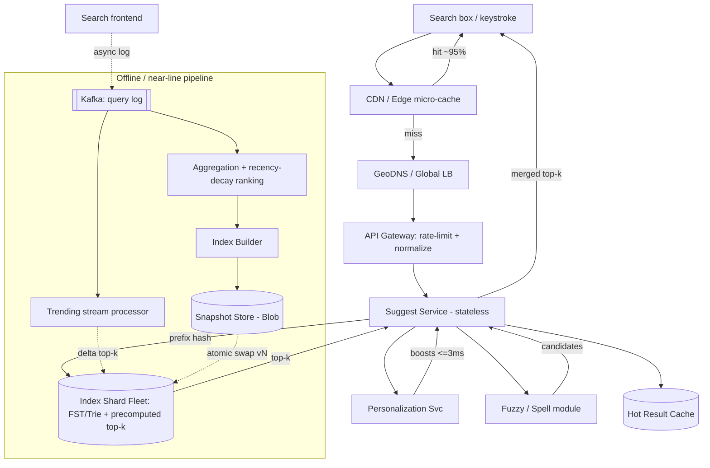

# B02 — Design autocomplete / typeahead at scale

Autocomplete (typeahead / search-as-you-type) returns the top-k most likely query completions for a partial prefix, on **every keystroke**, in **single-digit milliseconds**. It tests whether you can build a read-dominated, latency-critical service on top of a heavy offline pipeline: a Trie / inverted structure for prefix lookup, a ranking layer, aggressive precompute + caching, and incremental freshness. Google asks it because it is the front door of Search — the latency and relevance bar is brutal, and it forces you to reason about offline batch vs online serving, sharding, and personalization simultaneously.

## (Section B only) Lead with this — your résumé hook

"I've owned search relevance and latency tuning on the Search Feature side, so typeahead is squarely in my wheelhouse — it's the place where a 30 ms p99 regression is visible to every user and a bad ranking signal shows up as obvious junk suggestions. I'll design this as a read-optimized serving tier (a sharded prefix structure with precomputed top-k) fed by an offline ranking pipeline, and I'll spend my depth budget on the two things that actually move the needle in production: how completions are ranked and how I hold the p99 down while keeping suggestions fresh and personalized."

## 1) Clarify — questions to ask the interviewer

- **Scope of suggestions:** Are we completing *search queries* (head + tail), or also entities (people, places, products)? Search queries are the canonical version; entities change the ranking and freshness story.
- **Trigger model:** Suggest on every keystroke, or debounced (e.g. after a pause)? This directly sets QPS — keystroke-level is ~5-7x the search QPS.
- **k and prefix length:** How many suggestions per request (typically 5-10)? Do we serve completions for 1-character prefixes, or only from 2-3 chars (huge fan-out at 1 char)?
- **Latency target:** What is the p99 budget end-to-end? For typeahead the bar is brutal — I'll assume ~50 ms p99 *including* network, so the service itself gets ~10-20 ms.
- **Freshness:** How fresh must trending queries be? "Within minutes" (breaking news, live events) vs "within a day" (general corpus) changes whether I need a real-time path at all.
- **Personalization:** Global popularity only, or personalized by user history / location / language? Personalization is the difference between a static cache and a per-user merge.
- **Typo tolerance:** Must "fb" complete to "facebook" and "teh" to "the"? Fuzzy matching is expensive — I want to know if it's in scope or a stretch goal.
- **Locale / language:** How many languages and scripts? CJK, RTL, and transliteration (typing Hindi in Latin script) materially change tokenization and the index.
- **Read/write mix:** Reads massively dominate (it's a serving system); writes are the offline ingestion of the query log. I'll confirm we are not expected to update the index synchronously per query.
- **Safety:** Do we need to suppress offensive / unsafe / PII completions? This is a real requirement at Google scale and adds a filtering layer.

**What the interviewer is signaling:** They want to see you separate the *offline pipeline* (build the ranked structure from logs) from the *online serving tier* (microsecond Trie traversal), and that you instinctively reach for **precompute + cache** rather than computing top-k at request time. Asking about the trigger model and 1-char prefixes signals you understand the QPS and fan-out blow-up. Asking about freshness and personalization signals Staff-level breadth.

## 2) Functional Requirements (FR)

**In scope:**
- Given a prefix, return the **top-k completions** ranked by likelihood, on every keystroke.
- Rank by **popularity + recency + context** (and personalization signals where available).
- **Incremental freshness:** newly trending queries appear without a full rebuild.
- **Typo / fuzzy tolerance:** tolerate small edit-distance errors and common misspellings.
- **Personalization:** blend global suggestions with user/location/language-specific ones.
- **Safety filtering:** suppress offensive, unsafe, or sensitive completions.
- **Multi-locale:** correct tokenization and ranking per language/script.

**Out of scope (defer):**
- Full search result ranking (this is *only* the suggestion box).
- Spelling correction of the final submitted query (separate system).
- Voice / image query input.
- Rendering, highlighting, and client UI behavior beyond the API contract.
- Ads / sponsored suggestions.

## 3) Non-Functional Requirements (NFR)

| Dimension | Target & rationale |
|---|---|
| Scale | ~1B users; assume 100k searches/sec at peak; keystroke typeahead ~5x → **~500k QPS** read. Corpus of ~10B distinct historical queries, head-heavy. |
| p99 latency | **End-to-end ≤ 50 ms**; service-internal **≤ 10-20 ms**. Anything slower than the user's typing cadence is wasted. |
| Availability | **99.99%** for reads. Typeahead failing should *degrade* (fall back to cached/global) not error — it's an enhancement, not a blocker. |
| Consistency | **Eventual** is fine. Suggestions are best-effort; a query trending "a few minutes late" is acceptable. No cross-user consistency requirement. |
| Durability | The query log (source of truth) must be durable (it's also used for analytics/ranking). The serving index is **derived** and rebuildable, so it needs availability, not durability. |
| Freshness | Trending path: **minutes**. General corpus: **daily** rebuild is acceptable. |
| Security/Safety | Strip PII from logs; filter unsafe completions; per-locale policy; rate-limit per client to prevent scraping the suggestion graph. |

## 4) Back-of-envelope estimation

```
READ QPS
  Searches/sec (peak)        ~100,000
  Keystrokes per query        ~5 (debounced) ... up to ~15 (raw)
  Typeahead QPS               100k * 5  = ~500,000 QPS  (design target)
  Peak burst (x2)             ~1,000,000 QPS

WRITE / INGEST
  Distinct queries/day        ~5,000,000,000 search events/day
  ~ 5e9 / 86400               ~58,000 events/sec into the log
  These are batched offline, NOT applied per-request.

CORPUS / STORAGE (the serving structure)
  Distinct historical queries ~10,000,000,000 (10B), but head is tiny:
    - top ~10M prefixes cover the vast majority of traffic
  Per Trie node: char + children ptrs + top-k cache (k=10 * (8B id + 4B score))
                 ~ 120 bytes precomputed top-k per node
  Useful nodes (head + warm tail) ~ 1e9 nodes
    1e9 * 120B  = ~120 GB  precomputed top-k  -> shard across ~20-50 nodes
  Full cold index (all 10B queries) ~ multi-TB on disk, memory-mapped per shard.

CACHE (hot prefixes in RAM at the edge/service)
  Hot prefix set ~ 1,000,000 prefixes (1-3 chars + common words)
  Response size ~ 1 KB (10 suggestions + metadata)
  1e6 * 1KB    = ~1 GB hot result cache per region (trivially fits in RAM)
  Hit rate expected > 95% because prefix popularity is extremely skewed (Zipf).

BANDWIDTH
  500k QPS * 1 KB response = ~500 MB/s = ~4 Gbps egress (pre-compression)
  gzip ~3x -> ~1.3 Gbps actual.
```

Takeaways: the *hot* working set is tiny (1 GB) and Zipf-skewed, so **caching wins**. Storage is dominated by the cold tail, which lives memory-mapped on sharded serving nodes. The system is overwhelmingly read-bound; writes are an offline batch problem.

## 5) API design

```
# Online serving (read path)
GET /v1/suggest
    ?q=<prefix>                 # raw prefix, UTF-8
    &k=10                       # max suggestions
    &lang=en&country=IN         # locale context
    &session=<opaque>          # for personalization (optional)
    &ctx=<previous tokens>     # query context, optional
  -> 200 {
       suggestions: [
         { text, score, type: "query"|"entity", highlight: [start,end] }
       ],
       trace_id, cache: "edge"|"shard"|"miss"
     }
  Latency SLO header echoed; on internal timeout -> return cached/global subset.

# Offline / control plane (write path, not user-facing)
POST /internal/v1/index/build      # kick a full rebuild from query log
POST /internal/v1/index/delta      # apply incremental top-k updates (trending)
POST /internal/v1/suppress         { pattern, scope }   # safety kill-list
GET  /internal/v1/index/version    # which snapshot a shard is serving
```

Design notes: `/suggest` is idempotent and cacheable (cache key = normalized `q` + `lang` + `country` + coarse personalization bucket). Personalization is layered *after* the cache so the global hot path stays cacheable. The write path is entirely internal and asynchronous.

## 6) Architecture — request & data flow

### (a) ASCII layered diagram

```
                         Clients (web search box / mobile app / API)
                                          |  keystroke: GET /suggest?q=...
                                          v
                              [ CDN / Edge POP ]                  micro-cache of hottest
                              - TLS term, geo-route               1-3 char prefixes (TTL ~secs)
                              - edge result cache (95%+ hit)      serves WITHOUT origin hop
                                          |  cache MISS / personalized
                                          v
                           [ Global LB / GeoDNS (anycast) ]       health-checked, nearest region
                                          |
                                          v
                              [ API Gateway ]                     authN (light), per-client
                              - rate-limit / anti-scrape          rate-limit, route by lang
                              - request normalization             lowercase, strip accents
                                          |
                          +---------------+----------------+
                          |                                |
                          v                                v
              [ Suggest Service (stateless) ]    [ Personalization Svc ]
              - normalize prefix                 - reads user/session profile
              - route to correct INDEX SHARD     - returns user/loc boosts
              - merge global + personal + fuzzy  <--- (sync, p99-budgeted, ~3ms)
                          |        ^   |
            global lookup |        |   | fuzzy expansion (edit-distance)
                          v        |   v
   +----------------------------+  |  [ Fuzzy / Spell module ]   deletion-index or
   |   INDEX SHARD FLEET        |  |  - generate candidate prefixes (BK-tree / SymSpell)
   |   (consistent-hash by      |  |
   |    prefix hash)            |  |
   |  shard = memory-mapped     |  |   [ Hot Result Cache (Redis/in-proc) ]
   |  Trie/FST + precomputed    |  +-- 1GB per region, prefix -> top-k blob
   |  top-k per node            |
   +-------------+--------------+
                 ^  serves snapshot vN (read-only, atomic swap)
                 |
   = = = = = = = | = = = = = = = = OFFLINE / NEAR-LINE PIPELINE = = = = = = = = =
                 |
        [ Index Builder (batch, e.g. nightly) ]
        - read aggregated query counts
        - compute top-k per prefix node
        - build sharded FST/Trie snapshot vN  --> [ Snapshot Store (Blob) ]
                 ^                                          |
                 |                                          v
        [ Aggregation / Ranking ]                 shards pull + atomically swap
        - count queries, decay by recency
        - join CTR, locale, safety kill-list
                 ^
                 |  (batched, ~minutes for trending; daily for full)
        [ Stream processor (trending) ] --delta top-k--> shards (near-line freshness)
                 ^
                 |
        [ Query-log ingest (Kafka) ] <--- every executed search is logged here
                 ^
                 |  (async, fire-and-forget, off the hot path)
        [ Search frontend logs each submitted query ]
```

**Read path (sync, latency-critical).** A keystroke fires `GET /suggest?q=fac`. The **edge POP** checks its micro-cache; for hot 1-3 char prefixes this is a >95% hit and returns in a few ms with zero origin contact. On a miss, GeoDNS routes to the nearest region; the **API gateway** rate-limits and normalizes the prefix (lowercase, strip accents). The **Suggest Service** hashes the prefix to the owning **index shard**, which does an FST/Trie traversal to the prefix node and reads its **precomputed top-k** (no per-request ranking). In parallel it calls the **Personalization service** (hard-capped at ~3 ms; if it's slow, we proceed with global only) and, if the global result is thin, the **fuzzy module** for edit-distance candidates. The service **merges** global + personal + fuzzy, applies the safety kill-list, and returns top-k. Everything is read-only against an immutable snapshot, so there are no locks on the hot path.

**Write path (async, off the critical path).** Every submitted search is logged to **Kafka** fire-and-forget — it never blocks the user. A **stream processor** maintains rolling counts for the *trending* path and pushes **delta top-k** updates to shards within minutes. A heavier **aggregation/ranking** job periodically (e.g. nightly) recounts queries with recency decay, joins CTR / locale / safety signals, and the **index builder** produces a fresh **sharded snapshot vN** in blob storage. Shards pull the new snapshot and **atomically swap** it in (memory-map the new file, flip a pointer, drop the old) — readers never see a half-built index.

### (b) Mermaid flowchart



## 7) Data model & storage choices

**Serving structure — sharded FST / Trie with precomputed top-k (the core).**
Each shard owns a contiguous range of prefix-hashes and holds a compressed prefix automaton. The decisive choice: **store the top-k completions *at each node*, precomputed offline.** A naive Trie would, at query time, traverse to the prefix node and then DFS the whole subtree to find the most popular descendants — that subtree DFS is exactly what blows the latency budget for short prefixes ("a" has billions of descendants). Precomputing `top-k(node)` turns a request into "traverse to node, read 10 cached ids" — O(prefix length), no subtree walk.

I'd use a **Finite State Transducer (FST)** over a plain Trie for the cold/full corpus: an FST shares common *suffixes* as well as prefixes (a minimized DAG), shrinking a multi-TB Trie by ~5-10x, and it can map directly to a sorted output. It's immutable, which is perfect — we rebuild snapshots offline and never mutate in place.

```
Node (logical):
  prefix_id, edges[char -> child], is_terminal,
  topk: [ (query_id, score) x 10 ]   # PRECOMPUTED

Query metadata (KV, query_id -> doc):
  { text, global_count, last_seen_ts, ctr, lang, safety_flags }
```

**Storage choices and why:**
- **Trie/FST snapshot → memory-mapped immutable files on serving nodes.** Read-only, rebuildable, latency-critical → keep it in RAM/page-cache, never behind a network DB. Durability not required (it's derived).
- **Query log → append-only log (Kafka) + columnar warehouse.** Source of truth for ranking and analytics; needs durability and high write throughput, not random reads.
- **Hot result cache → in-process LRU + Redis** keyed by normalized prefix. Zipf skew makes this a >95% hit machine for ~1 GB.
- **Personalization profiles → low-latency KV (e.g. LSM-tree store)** keyed by user/session, holding recent queries and affinity vectors. Reads must fit the ~3 ms personalization budget.
- **Safety kill-list → small replicated KV / bloom-filtered set**, consulted on every merge.

Counts use **recency decay** (exponential half-life) so the ranking forgets stale spikes; that's a ranking-time weight, not a storage concern.

## 8) Deep dive

### Deep dive 1: Ranking — how completions are ordered

This is where typeahead lives or dies, and it's my résumé strength. The score for a candidate completion is a blend:

```
score(c | prefix, user, ctx) =
    w1 * popularity(c)              # decayed global frequency (log-scaled)
  + w2 * recency(c)                 # exponential half-life, captures trending
  + w3 * ctr(c)                     # did people who saw it click it?
  + w4 * context_match(c, ctx)      # prior tokens / current query session
  + w5 * personal_affinity(c, user) # user history, location, language
  - penalty(safety, dupes)
```

Key decisions:
- **Precompute the global part, personalize online.** `w1..w3` are stable per snapshot, so the offline builder bakes them into `top-k(node)`. `w4..w5` are request-specific and applied as a *re-rank* of a slightly larger candidate set (fetch top-30 global, re-score, return top-10). This keeps the hot path cache-friendly while still personalizing.
- **Recency decay** prevents a one-day spike from dominating forever; the trending stream path feeds fresh counts so "breaking news" surfaces in minutes.
- **Calibration / guardrails:** suppress near-duplicate suggestions, demote suggestions with no clicks (impression-without-click is a negative signal), and hard-filter the safety kill-list *after* ranking so a popular-but-unsafe query can never leak.
- **Learning to rank:** offline I'd train a lightweight gradient-boosted model on (impression, click) logs to learn `w*`, evaluated with NDCG / MRR on held-out sessions — and crucially A/B'd online, because offline NDCG and online engagement diverge. (This is exactly the relevance + latency tuning loop on my résumé.)

### Deep dive 2: Holding p99 down — caching, sharding, precompute

- **Layered cache:** edge micro-cache (hottest prefixes, TTL seconds) → in-region result cache (1 GB) → shard's in-memory FST. The Zipf distribution means a 1 GB cache absorbs >95% of traffic; only the long tail reaches a shard.
- **Prefix sharding by hash:** consistent-hash on the *prefix string* so every request for "fac" lands on one shard (good cache locality, even load). I deliberately do **not** shard the cold index by user — global suggestions must be shared. Replicate each shard ~3x for availability and read fan-out; replicas serve the same immutable snapshot.
- **Avoiding the subtree DFS:** precomputed per-node top-k (above) is the single biggest latency lever — it converts an O(subtree) request into O(prefix length).
- **Tail-latency tactics:** hedged requests to a second replica if the first is slow, hard timeouts on personalization/fuzzy with graceful fallback to global, and request collapsing (single-flight) so a thundering herd on a newly-hot prefix only triggers one shard lookup.

## 9) Key tradeoffs

| Decision | Option A | Option B | Choice & why |
|---|---|---|---|
| CAP posture | CP (strongly consistent suggestions) | **AP (eventual, always-available)** | **AP.** Typeahead is best-effort; serving a slightly stale suggestion beats erroring. Degrade to cache/global on partition. |
| Top-k computation | Compute at query time (DFS subtree) | **Precompute per node offline** | **Precompute.** Query-time DFS for short prefixes is unbounded; precompute makes reads O(prefix length). Cost: rebuild + freshness lag, fixed by the trending delta path. |
| Index structure | Plain Trie (mutable) | **Immutable FST snapshot** | **FST snapshot.** Shares suffixes (smaller), immutable enables atomic swap and lock-free reads. Cost: can't mutate in place → need rebuild/delta pipeline. |
| Sharding key | By user | **By prefix hash** | **By prefix.** Suggestions are global; prefix-sharding gives cache locality + even load. Personalization handled in a separate re-rank layer. |
| Personalization | Bake into index | **Online re-rank of candidate set** | **Online re-rank.** Per-user indexes don't scale; re-ranking top-30 global keeps the index shared and cacheable. Cost: extra ~3 ms hop, hard-capped. |
| Freshness | Daily full rebuild only | **Daily rebuild + minute-level trending deltas** | **Both.** Full rebuild for the corpus, near-line deltas for trending. Cost: two write paths to operate. |
| Fuzzy matching | Always fuzzy-expand | **Exact first, fuzzy on thin results** | **Exact-first.** Fuzzy expansion is expensive; only pay it when the exact result set is too small. |

## 10) Bottlenecks & failure modes

- **Hot prefix / thundering herd (e.g. a 1-char prefix or a breaking-news term).** A newly-hot prefix can stampede one shard. *Mitigation:* edge + region cache absorbs it; request collapsing (single-flight) ensures one origin lookup per prefix; hot shards get extra replicas; short-TTL negative caching.
- **Hot shard / skewed partition.** Consistent-hash on prefix mostly balances, but a viral prefix can overload its shard. *Mitigation:* replicate hot shards more aggressively, and split the offending prefix range; the immutable-snapshot model makes resharding a rebuild, not a live migration.
- **Personalization or fuzzy module slow → drags p99.** *Mitigation:* hard timeouts with graceful degradation to global suggestions; these are *additive* enhancements, never blockers.
- **Stale index after a failed build.** A bad nightly build could ship garbage. *Mitigation:* validate the snapshot (size deltas, canary queries) before shards swap; keep N previous snapshots and roll back atomically; serve old snapshot until the new one passes canary.
- **Safety leak.** A popular but offensive completion. *Mitigation:* kill-list filtering applied *after* ranking on every request, replicated and consulted in-process; deny-by-default for flagged patterns.
- **SPOF in the pipeline.** The builder/aggregator is offline, so its outage *delays freshness* but does not take down serving — serving runs entirely off the last good snapshot. That decoupling is the point.
- **Cache cold-start (region failover / deploy).** A cold region hammers shards. *Mitigation:* pre-warm caches with the top-N prefixes on startup; ramp traffic gradually.

## 11) Scale 10x / evolution

- **What breaks first: QPS on the serving tier (500k → 5M).** It's stateless and cache-fronted, so scale horizontally — more edge POPs and more shard replicas. The Zipf cache hit rate actually *improves* with traffic, so origin load grows sub-linearly. This is the easy axis.
- **Index size (10B → 100B queries).** The cold FST grows; split into finer prefix shards and push more of the rarely-touched tail to memory-mapped SSD instead of RAM. Most tail prefixes are cold, so page-cache handles it.
- **Freshness pressure (minutes → seconds for live events).** The nightly rebuild can't keep up with, say, an election night. Lean harder on the streaming delta path: maintain a small *real-time overlay* index (recent trending top-k) that the Suggest Service merges over the snapshot, refreshed every few seconds. Snapshot stays the slow base; overlay carries the velocity.
- **Personalization at 10x users.** The re-rank hop becomes the cost center. Precompute coarse per-cohort boosts offline (location × language × interest cluster) and only do fine per-user re-rank for logged-in power users; cache cohort results.
- **More locales / scripts.** Tokenization and the index become language-specific; shard by `(lang, prefix)` and run per-language ranking models. Transliteration (typing Hindi in Latin) becomes its own fuzzy-mapping layer.
- **Multi-region writes.** The log is per-region; aggregation rolls up globally for the corpus but each region can keep a local trending overlay so trends are geo-relevant without cross-region latency.

## 12) Interviewer probes & follow-ups

- **"How do you get top-k for a 1-character prefix fast?"** Don't DFS the subtree at request time — **precompute top-k at every node** offline and store it on the node. The request becomes traverse-to-node + read 10 ids, O(prefix length).
- **"Trie vs FST vs hash of all prefixes?"** Hashing every prefix→top-k is simplest and very fast but explodes storage (every prefix of every query). Trie is intuitive but large. **FST** shares prefixes *and* suffixes, is immutable (atomic swap, lock-free reads), and compresses best — my default for the cold corpus, with a hot prefix→top-k cache in front.
- **"How does a brand-new trending query show up in minutes?"** The streaming path keeps rolling counts and pushes **delta top-k** to shards / a real-time overlay, merged over the immutable snapshot. The full rebuild lags; the overlay carries freshness.
- **"How do you personalize without a per-user index?"** Fetch a larger global candidate set (top-30) and **re-rank online** with user/location/language boosts from a fast profile store, hard-capped at ~3 ms. Per-user indexes don't scale; re-ranking does.
- **"Typo tolerance — how, cheaply?"** Exact lookup first; if results are thin, expand with edit-distance-1/2 candidates via a **deletion index (SymSpell)** or BK-tree, plus a learned misspelling map ("teh"→"the"). Pay the fuzzy cost only when needed.
- **"What's your consistency model and why is it OK?"** Eventual. Suggestions are best-effort enhancements; cross-user/cross-region staleness of minutes is invisible to users and lets us run AP with graceful degradation.
- **"How do you keep p99 under 10-20 ms internally?"** Layered cache (Zipf → 95% hit), precomputed top-k (no subtree walk), immutable lock-free reads, hedged requests, and hard timeouts on optional enrichments.
- **"How do you prevent unsafe suggestions?"** A replicated kill-list applied *after* ranking, deny-by-default for flagged patterns, with locale-specific policy — a popular-but-unsafe query is filtered before it can ever be returned.
- **"How do you measure if ranking is good?"** Offline NDCG / MRR on held-out click logs to tune the model, then **online A/B** on engagement (suggestion CTR, query abandonment), because offline and online metrics diverge.

## 13) 60-minute flow cheat-sheet

| Time | Phase | What to cover |
|---|---|---|
| 0-5 min | Clarify | Suggestions vs entities, keystroke vs debounced, k, p99 budget, freshness, personalization, typo tolerance, safety. State the read-dominated assumption. |
| 5-8 min | FR / NFR | Top-k per prefix, ranking, freshness, fuzzy, personalization, safety. NFR table: 500k QPS, ≤50 ms p99, eventual consistency, AP/degrade. |
| 8-13 min | Estimation | QPS (100k×5), 1 GB hot cache (Zipf), ~120 GB precomputed top-k sharded, derived index = no durability needed. |
| 13-18 min | API + high-level | `/suggest` (cacheable), async query-log ingest. Separate offline pipeline from online serving out loud. |
| 18-32 min | Architecture (centerpiece) | Walk both diagrams: edge cache → gateway → suggest service → shard FST + precomputed top-k; offline log→aggregate→build→atomic-swap snapshot + trending delta path. Trace read AND write path. |
| 32-45 min | Deep dive | (1) Ranking blend + precompute-global/re-rank-online + LTR/A-B. (2) p99: layered cache, prefix sharding, precomputed top-k, hedging/timeouts. |
| 45-52 min | Tradeoffs + failures | AP vs CP, precompute vs query-time, FST vs Trie, prefix vs user sharding. Hot prefix/thundering herd, stale build rollback, safety leak. |
| 52-58 min | Scale 10x | QPS scales easily (cache improves with load); freshness via real-time overlay; cohort personalization; per-(lang,prefix) sharding. |
| 58-60 min | Wrap | Restate: read-optimized immutable serving tier + offline ranking pipeline + caching, with relevance and p99 as the two things you'd obsess over in prod. |
