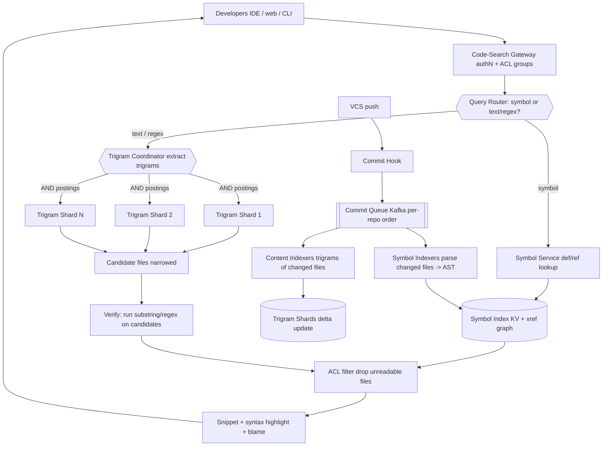

# B03 — Design a code search system (à la Google Code Search)

This sits exactly at the Search × Developer-Experience intersection — the role I am interviewing for. It tests whether I can build search over *source code* specifically: symbol-aware indexing, regex and substring matching via a trigram index, incremental re-index on every commit, ranking tuned for developers, and per-repo access control — all at cross-repo scale with low query latency. Google asks it because internal code search is one of the highest-leverage developer tools that exists, and a Staff engineer is expected to understand why code search is *not* just web search with a different corpus.

## Lead with this — your résumé hook

I bring both halves of this problem: I have run **search at scale** (1B+ doc hybrid index, p99 ~200 ms) *and* I have built developer-facing tooling that engineers use every day. Code search is precisely where those two strengths meet — it demands the indexing-and-fan-out machinery of a search system, but with the developer-specific twists of symbol resolution, regex/substring matching, and instant re-index on commit. I will design it the way a tools engineer who has lived with both sides would: optimize for the developer's actual workflow (jump-to-definition, find-all-callers, regex sweeps), not just keyword recall.

## 1) Clarify — questions to ask the interviewer

- **Query modes:** Do we need literal substring, **regex**, *and* semantic symbol search (go-to-definition, find-references)? These need fundamentally different indexes (trigram vs. symbol graph) — this is the central fork.
- **Corpus scale:** How many repos, total lines of code, and number of files? Monorepo (one giant tree) or polyrepo (millions of separate repos)? This drives sharding strategy.
- **Languages:** A fixed set we can write proper parsers for, or arbitrary/any language (where we fall back to lexical-only)? Symbol search quality depends on per-language parsing.
- **Freshness:** Must a just-pushed commit be searchable in seconds (this is table stakes for code search), minutes, or is hourly acceptable? Developers expect near-instant.
- **Read/write mix:** Query QPS vs. commit/push rate? Code search is read-heavy but the write path (re-index on commit) is the hard part.
- **Access control:** Is all code visible to all engineers (classic Google internal model), or strict per-repo/per-team ACLs where results must be filtered per user? ACL filtering changes the serving path significantly.
- **Latency target:** p99 for interactive search? I will assume **< 100 ms** for substring/symbol and a looser budget for full-corpus regex, since developers type queries live.
- **Result richness:** Just file+line matches, or full context (surrounding lines, syntax highlighting, blame, cross-references)?

**What the interviewer is signaling:** They want to see that you know **code is a different corpus**. The give-away that you "get it": you bring up the **trigram index for regex** (you cannot run a regex against a billion files; you use trigrams to *narrow* the candidate set, then verify), and you separate the **symbol graph** (for semantic queries) from the **content index** (for text/regex). Mentioning incremental re-index-on-commit and ACL-on-code unprompted is the L6 signal — those are the two things that make code search operationally hard.

## 2) Functional Requirements (FR)

**In scope:**
- Literal/substring search across all source files (file + line + context).
- **Regex search** over the corpus (anchored by a trigram index).
- **Symbol search:** go-to-definition, find-all-references/callers, by-symbol-name.
- Incremental re-index triggered on every commit/push (near-real-time).
- Filtering by repo, path, language, file type.
- Ranking tuned for code (exact symbol match > substring; definitions > usages).
- Per-repo / per-user ACL filtering of results.
- Syntax-highlighted result snippets with surrounding context.

**Out of scope (defer):**
- The version-control system itself (we consume commits/diffs from it).
- Code review, CI, and build (separate dev-infra services).
- AI/semantic "natural-language → code" search (a separate prompt; could bolt a vector tier on later).
- Full IDE integration UI.
- Authoring/refactoring tools.

## 3) Non-Functional Requirements (NFR)

| Dimension | Target & rationale |
|---|---|
| Scale | ~2B lines of code, ~100M files, 10K+ repos (or one monorepo). ~5K query QPS, ~1K commits/min. |
| p99 latency | **< 100 ms** for substring/symbol; **< 1–2 s** for full-corpus regex (acceptable since rarer and heavier). |
| Availability | 99.95% for query path. Indexing can lag briefly; queue absorbs. |
| Consistency | **Eventual** — a pushed commit becomes searchable within seconds (NRT), not transactionally. |
| Durability | Index is **derived** and fully rebuildable from the VCS (source of truth). No separate durability burden beyond the commit feed. |
| Freshness | Commit searchable in < 10 s on the hot path. |
| Security | ACL filtering at query time (never leak a file a user can't read); per-repo isolation; audit log of queries. |

## 4) Back-of-envelope estimation

```
Corpus
  Lines of code:      2e9 lines
  Files:              1e8 files
  Avg file:           ~5 KB  ->  raw source ~ 500 GB (compressed ~150 GB)

Trigram index (for regex/substring)
  ~ distinct trigrams per file small, but posting lists large.
  Rule of thumb: trigram index ~ 1-2x source size -> ~ 0.5-1 TB
  Sharded by repo/file -> target ~50 GB/shard -> ~20 shards x3 replicas

Symbol index (definitions + references)
  Say ~50 symbols/file * 1e8 files = 5e9 symbol occurrences
  ~ (symbol -> [def/ref locations]) ~ a few hundred GB
  Stored as KV + graph adjacency

Query QPS
  Peak 5,000 QPS interactive (substring/symbol)
  Each substring query fans out to all ~20 trigram shards -> 100K shard-RPCs/s
  Regex queries rarer (say 5% of traffic) but each scans more candidates

Commit / write path
  1,000 commits/min ~ 17 commits/s
  Each commit touches avg ~10 files -> ~170 file re-index ops/s
  Re-index = reparse changed files only (delta), not whole repo

Cache
  Hot query cache (popular symbol lookups, common substrings):
  Top 500K queries * ~4 KB ~ 2 GB Redis
  Per-shard page cache holds hot trigram postings
```

## 5) API design

```
# Text / regex search
POST /v1/code:search
  body: {
    q: "func ServeHTTP",          # literal or regex (flag)
    is_regex: false,
    filters: { repo: "core/*", lang: "go", path: "src/**" },
    top_k: 50,
    page_token: "<opaque>",
    user_ctx: { uid, acl_groups[] }
  }
  -> { matches: [{repo, path, line, col, snippet, highlights[], kind}],
       next_page_token, truncated: bool }

# Symbol / semantic
GET  /v1/symbols:resolve?name=ServeHTTP&kind=function   # definitions
GET  /v1/symbols/{symbol_id}/references                 # find-all-callers
GET  /v1/symbols:atCursor?repo=..&path=..&line=..&col=..# go-to-definition

# Ingest (internal, from VCS hook)
POST /v1/index:onCommit
  body: { repo, commit_sha, changed_files: [{path, action}] }
  -> { accepted, index_offset }
```

## 6) Architecture — request & data flow

### (a) ASCII layered diagram

```
                 Developers (IDE plugin / web UI / CLI)
                              |
                              v
                       [ CDN / Edge ]            static assets, NOT code results (ACL-sensitive)
                              |
                              v
                  [ Global LB / GeoDNS ]         route to nearest region
                              |
                              v
                  [ Code-Search Gateway ]        authN, attach user ACL groups, rate-limit
                              |
                              v
            +========= Query Router / Planner =========+   decides which index to hit
            |  symbol query? -> symbol service          |
            |  text/regex?   -> trigram fan-out          |
            +===========================================+
                 |                                |
        symbol   |                                |  text / regex
                 v                                v
        [ Symbol Service ]              +==== Trigram Coordinator ====+  scatter/gather
        def/ref graph lookup           |  1. extract trigrams from q  |
                 |                      |  2. AND postings -> candidates|
                 v                      |  3. fan-out to content shards |
        [ Symbol Index (KV+graph) ]     +=============================+
                 |                              |        |         |
                 |                              v        v         v
                 |                       [Trigram   [Trigram .. [Trigram
                 |                        Shard 1]   Shard 2]    Shard N]
                 |                        (file -> trigram postings)
                 |                              \       |       /
                 |                               v      v      v
                 |                        [ candidate files (narrowed) ]
                 |                               |
                 |                               v
                 |                     [ Verify pass: actually run
                 |                       substring/regex on candidates ]  <- exact match
                 |                               |
                 +---------------+---------------+
                                 v
                       [ ACL filter: drop files user can't read ]  <- per result
                                 v
                       [ Snippet + syntax highlight + blame ]
                                 v
                            results -> developer


WRITE / RE-INDEX PATH (on every commit, async)
   VCS push --> [ Commit Hook ] --> [ Commit Queue (Kafka) ]   ordered per repo
                                          |
                          +---------------+----------------+
                          v                                v
                 [ Content Indexers ]              [ Symbol Indexers (parsers) ]
                 compute trigrams of                language-aware parse of
                 CHANGED files only                 changed files -> AST -> symbols
                          |                                |
                          v                                v
                 [ Trigram Shards ]                 [ Symbol Index + xref graph ]
                 incremental segment update         upsert defs/refs for changed files
                          |
                          v
                 (old file's postings tombstoned, replaced)
```

**Read path (sync):** A developer query hits the gateway, which authenticates and attaches the user's ACL groups. The **Query Router** decides the index: a *symbol* query (go-to-def, find-references) goes straight to the **Symbol Service**, which is a graph/KV lookup — fast and exact, no fan-out needed because symbols are keyed. A *text or regex* query goes to the **Trigram Coordinator**: it decomposes the query into its constituent trigrams, intersects ("AND") the trigram postings lists across shards to produce a **narrowed candidate set** of files that *could* match, then runs the actual substring/regex **verify pass** only on those candidates (you never regex the whole corpus — trigrams cut 100M files down to thousands). Results pass through an **ACL filter** that drops any file the user can't read, then get syntax-highlighted snippets, and return. Notably, code results are *not* edge-cached because they're ACL-sensitive.

**Write path (async, on every commit):** A VCS push fires a **commit hook** that enqueues the changed-file list into a per-repo-ordered Kafka topic. **Content indexers** recompute trigrams for *only the changed files* (delta indexing — never reprocess the whole repo) and update the trigram shards, tombstoning the old file's postings. In parallel, **symbol indexers** run language-aware parsers on the changed files, extract the AST, and upsert definitions and cross-references into the symbol graph. Because indexing is per-file-delta, a commit touching 10 files costs ~10 file re-index ops, which is why we can stay under a 10 s freshness SLA even at thousands of commits per minute. The whole index is derived from the VCS, so it's always rebuildable.

### (b) Mermaid flowchart



## 7) Data model & storage choices

- **Trigram index:** `trigram -> sorted postings of file_ids` (e.g. the string `ServeHTTP` yields trigrams `Ser, erv, rve, veH, eHT, HTT, TTP`). A regex/substring query intersects the postings of its required trigrams to narrow candidates, then verifies. Justification: regex over a corpus is impossible to do directly; trigrams turn it into a set-intersection problem (the Russ Cox / Google Code Search insight). Stored as compressed, immutable segments per shard (LSM-style append + merge), so reads are lock-free and hot postings stay in page cache.
- **Symbol index:** two structures — `symbol_name -> [definition locations]` (KV) and an **adjacency graph** `definition -> [reference sites]` for find-callers / call hierarchy. Justification: semantic code navigation is a *graph* problem, not a text problem; keying by symbol gives O(1) jump-to-definition with no fan-out.
- **Forward/file metadata:** `file_id -> (repo, path, lang, commit_sha, acl_groups, size)` co-located on shards for ACL filtering and snippet retrieval without an extra hop.
- **Source-of-truth:** the **VCS itself** — we store no canonical copy; the index is derived. We do keep a **content-addressable blob cache** of file bodies for fast snippet rendering, keyed by content hash (dedupes identical files across repos).
- **Why no SQL for the core:** the workload is term/trigram-postings intersection and graph traversal — an inverted/graph layout beats relational joins by orders of magnitude here.

## 8) Deep dive

**Trigram index for regex (the crux that makes code search different).** The naive approach — grep across 100M files per query — is hopeless. The trick: index every file by its set of trigrams. For a *literal* substring query, decompose it into trigrams and intersect their postings lists; the result is the set of files that contain all those trigrams, which is a tiny superset of the actual matches. For a *regex*, you analyze the regex's syntax tree to derive a boolean trigram query — e.g. `ServeHTTP|HandleFunc` becomes `(Ser AND erv AND ...) OR (Han AND and AND ...)` — that is *guaranteed not to miss* any matching file (it over-approximates), then you run the real regex engine only on the candidate files to get exact matches and line positions. This is the single most important idea in the design: **trigrams reduce a corpus scan to a set intersection plus a small verification.** The cost knobs are: very common trigrams (e.g. from whitespace or `{ }`) have huge postings lists, so we cap or skip low-selectivity trigrams; and the verify pass is parallelized across candidate files. This is exactly the Google Code Search / `codesearch` approach and I would name it as prior art while explaining the mechanics from first principles.

**Incremental re-index on commit (the operational crux).** Code changes constantly; re-indexing a whole repo per commit would never keep up. The design re-indexes at **file granularity**: the commit hook sends only the changed paths, indexers recompute trigrams and re-parse symbols for just those files, and the old file's postings are tombstoned and replaced. Two subtleties make this Staff-level: (1) **symbol consistency** — when a function's definition moves, the *references* to it (in other files, possibly other repos) don't change, but a *rename* invalidates them, so the symbol graph must handle stale edges gracefully (resolve-on-read, tolerate dangling refs until the referrer is re-indexed); (2) **ordering** — commits to the same repo must be applied in order (per-repo Kafka partition) so the index never reflects a non-existent intermediate state. Freshness then comes down to indexer throughput vs. commit rate; we autoscale indexers on consumer lag and keep the hot delta in an in-memory segment so a file is searchable seconds after push.

## 9) Key tradeoffs

| Decision | Choice & rationale |
|---|---|
| CAP | **AP** for serving — availability + low latency; a just-pushed commit may be briefly unindexed. Source-of-truth (VCS) is authoritative. |
| Consistency | Eventual; bounded by freshness lag (< 10 s). Symbol graph tolerates transient dangling refs. |
| Partitioning | **Shard by repo (or repo-shard for the monorepo)** so a commit's re-index is local and ACLs align to shard boundaries. Text queries fan out across shards; symbol queries are keyed and don't. |
| Replication | x3 per shard for availability + read throughput + hedged requests on the text fan-out tail. |
| Index choice | **Two indexes, deliberately:** trigram (text/regex) + symbol graph (semantic). One size does not fit both query classes. |
| Caching | Redis result cache for hot symbol lookups and common substrings; per-shard page cache for hot postings. **No CDN/edge cache for results** (ACL-sensitive). |
| Sync vs async | Query path sync; re-index fully async via per-repo-ordered Kafka. |
| Regex strategy | Trigram over-approximation + exact verify pass — never scan the corpus directly. |

## 10) Bottlenecks & failure modes

- **Low-selectivity trigrams / pathological regex:** a regex whose trigrams are all common (e.g. matches `.*`) defeats narrowing and forces a near-full scan. *Mitigation:* detect low-selectivity queries, cap candidate-set size, return "too broad — refine" with partial results, and rate-limit expensive regex.
- **Tail shard on text fan-out:** slowest trigram shard dominates p99. *Mitigation:* hedged requests to replicas + deadline-based partial results.
- **Indexer backlog after a huge commit/merge:** a giant refactor touching 100K files floods the queue; freshness lag spikes. *Mitigation:* Kafka buffers; autoscale on lag; prioritize small interactive commits over bulk re-indexes via separate queues/lanes.
- **Stale symbol edges:** a rename leaves dangling references until referrers re-index. *Mitigation:* resolve-on-read, mark unresolved refs as "stale," background reconciliation sweep.
- **ACL leak risk:** serving a snippet from a file the user lost access to. *Mitigation:* ACL filter is a *hard* post-retrieval gate checked against current repo permissions, and snippet hydration re-verifies — never trust the index's cached ACL alone.
- **Hot repo (everyone searches core/):** *Mitigation:* extra replicas for hot shards, result cache for the common queries against it.
- **Coordinator/router SPOF:** *Mitigation:* stateless, horizontally scaled behind the LB.

## 11) Scale 10x / evolution

- **What breaks first:** the **commit re-index throughput** and the **text fan-out width**. At 10× commits, indexer lag threatens the freshness SLA; at 10× repos, fanning text queries across hundreds of shards revives the tail-latency problem.
- **Fix 1 — sharded indexer pools with priority lanes:** separate interactive-commit re-indexing (low latency) from bulk/backfill re-indexing (throughput), so a megacommit can't starve normal pushes.
- **Fix 2 — two-level fan-out / repo-routing:** route text queries by repo/path filter so most queries hit a subset of shards rather than all of them; add a mid-tier coordinator for the rare cross-everything regex.
- **Fix 3 — bloom/summary filters per shard:** keep a per-shard summary of which trigrams it holds so the coordinator skips shards that can't possibly match, cutting fan-out width.
- **Fix 4 — incremental symbol graph at scale:** partition the xref graph and use resolve-on-read so cross-repo reference lookups don't require a global join.
- **Future — semantic layer:** bolt on an embedding/vector tier for natural-language → code queries, reusing the same commit feed to embed changed files; merge with trigram results like the hybrid model in B01.

## 12) Interviewer probes & follow-ups

- **"How do you support regex over the whole corpus?"** Trigram index: derive a boolean trigram query from the regex syntax tree that's guaranteed to over-approximate matches, intersect postings to get candidate files, then run the real regex only on those. Corpus scan becomes set intersection + small verify.
- **"Why not just use the same index for text and symbols?"** Different query shapes. Text/regex is a postings-intersection problem (trigram inverted index); jump-to-definition and find-callers are a *graph* problem (keyed symbol + adjacency). Forcing both into one index makes both slow.
- **"How is a commit searchable within seconds?"** Per-file delta re-index off a per-repo-ordered Kafka feed; only changed files are reprocessed; the hot delta sits in an in-memory segment queried alongside on-disk segments.
- **"How do you handle a rename that breaks references?"** The symbol graph tolerates dangling edges; references resolve-on-read and are marked stale until the referrer re-indexes; a background sweep reconciles. We never block a commit on global reference fixup.
- **"How do you enforce code ACLs?"** Hard post-retrieval filter against *current* repo permissions, plus re-verification at snippet hydration. Sharding by repo aligns ACL boundaries to shards. We never edge-cache code results.
- **"A user types a regex that matches everything — what happens?"** We detect low-selectivity trigram queries, cap the candidate set, rate-limit, and return partial results with a "refine your query" hint rather than melting a shard.
- **"Monorepo vs polyrepo — does the design change?"** Monorepo → shard the single tree by path/subtree, ACLs by directory; polyrepo → shard by repo. The trigram + symbol machinery is identical; only the sharding key and ACL granularity differ.

## 13) 60-minute flow cheat-sheet

| Time | Phase | What to do |
|---|---|---|
| 0–6 min | Clarify | Establish query modes (substring/regex/symbol), monorepo-vs-poly, freshness SLA, ACL model. |
| 6–10 min | FR/NFR | In/out scope; NFR table; commit to < 100 ms substring, eventual consistency, derived index. |
| 10–16 min | Estimation | LOC/files → trigram index size → shard count → commit re-index ops/s → cache sizing. |
| 16–22 min | API | Text/regex search + symbol resolve/references + onCommit ingest. |
| 22–38 min | Architecture | Draw layered diagram; **walk text read path (trigram → candidates → verify → ACL)**, symbol path, then commit re-index path. |
| 38–50 min | Deep dive | Trigram-index-for-regex (the headline) AND incremental re-index-on-commit. |
| 50–56 min | Tradeoffs + failures | Two-index choice, low-selectivity regex, indexer backlog, ACL leak — each mitigated. |
| 56–60 min | Scale 10× | Priority indexer lanes + repo-routed fan-out + bloom shard filters. |
