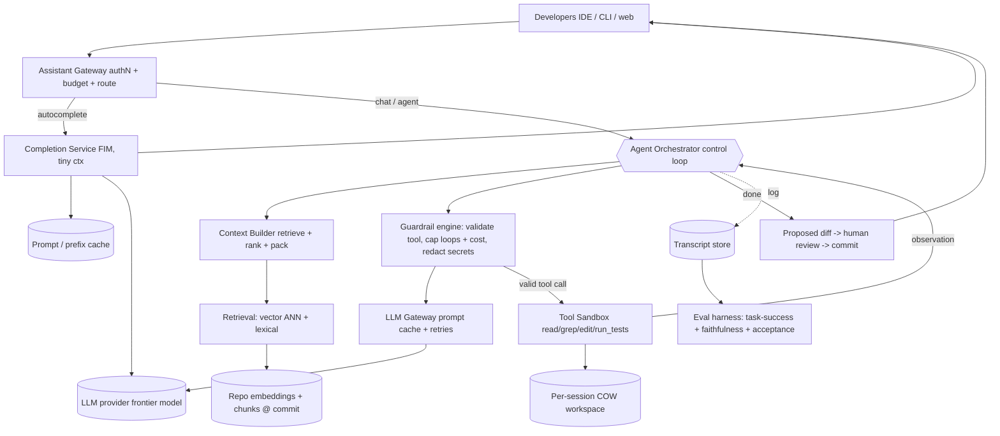

# B04 — Design an AI coding assistant / agentic dev workflow

The JD explicitly names "AI for developers" and AI Fluency, which makes this the highest-signal AI prompt in the set. It tests whether I can architect an agentic system that reasons over a codebase: RAG to ground the model in the repo, context-window management, tool/function calling to actually act (read files, run tests, edit code), a latency budget that keeps it usable, an eval harness to measure quality, and guardrails against the failure modes unique to agents — hallucinated tools, infinite loops, runaway cost. Google asks it because shipping AI to developers safely at scale is a distinct competence from training models, and a Staff engineer is expected to own the *system* around the model.

## Lead with this — your résumé hook

I have built exactly this class of system: **RAG grounded in a real corpus plus agentic, multi-step tool calling** where the model plans, invokes tools, observes results, and iterates to complete a task. So I am not theorizing about agents — I have designed the context-assembly pipeline, wired up the tool-calling loop with guardrails, and dealt firsthand with the failure modes that matter in production: hallucinated tool calls, loops that won't terminate, and the latency/cost blowup of multi-turn reasoning. I will design this as someone who has shipped an agent, not someone who has only read about them.

## 1) Clarify — questions to ask the interviewer

- **Capability scope:** Inline autocomplete (Copilot-style, single-shot, ultra-low-latency), a chat assistant (Q&A grounded in the repo), or a full **agent** that edits code and runs commands multi-step? These are three different latency/safety regimes — which one (or all)?
- **Autonomy level:** Does the agent act with a human-in-the-loop approving each step, or autonomously until done? This sets the entire guardrail strategy.
- **Repo scale & context:** Single repo or monorepo? How large? The repo will never fit in the context window, so RAG retrieval quality is the whole game.
- **Latency budget:** Autocomplete needs < 300 ms; chat tolerates a few seconds; an agent task can run minutes. What are the targets per mode?
- **Model:** Are we serving a hosted frontier model via API, or self-hosting? This drives cost, latency, and where caching pays off. (I'll assume a hosted frontier model with prompt caching available.)
- **Tools available:** Read/grep/edit files, run tests, run builds, search the web, query internal services? The tool catalog defines the blast radius and the guardrails.
- **Eval & quality bar:** How do we define "good"? Acceptance rate for completions, task-success rate for the agent, faithfulness for chat? We must agree on metrics before we can ship.
- **Rollout & scale:** How many developers, and do we roll out gradually? This affects rate-limiting, cost controls, and the feedback loop.
- **Safety/compliance:** Can the agent's edits be committed directly, or only proposed as a diff for review? Any code that must never leave the boundary (secrets, regulated repos)?

**What the interviewer is signaling:** They want **AI fluency expressed as systems thinking**, not model trivia. The signal that you "get it": you treat the LLM as one (fallible, slow, expensive) component and build the *system* around it — retrieval to ground it, a context budget to fit it, a tool-calling loop to act, an eval harness to trust it, and guardrails because it *will* hallucinate and loop. Bringing up **eval and guardrails unprompted** is the single strongest L6 signal here, because that is what separates a demo from a product that ships to thousands of engineers.

## 2) Functional Requirements (FR)

**In scope:**
- Repo-grounded answers and code generation via **RAG** over the codebase.
- **Agentic loop:** plan → call tools (read/grep/edit/run-tests) → observe → iterate → finish.
- **Tool/function calling** with a typed tool catalog and result feedback.
- Context-window management: retrieve, rank, pack, and trim context to fit the budget.
- Streaming responses for perceived latency.
- **Eval harness:** offline task-success / faithfulness scoring + online acceptance metrics.
- **Guardrails:** stop hallucinated tools, cap loop iterations and cost, sandbox tool execution.
- Caching: prompt/prefix cache, retrieval cache, and (where safe) response cache.
- Gradual rollout with per-user/per-team controls and a feedback channel.

**Out of scope (defer):**
- Training or fine-tuning the base model (we consume a hosted model).
- The IDE/editor UI internals (we expose an API the editor calls).
- Building the code-search index itself (we reuse B03's symbol + trigram index for retrieval).
- Billing/quota accounting beyond rate-limits.

## 3) Non-Functional Requirements (NFR)

| Dimension | Target & rationale |
|---|---|
| Scale | 50K+ developers, ~5K concurrent sessions, mix of autocomplete (high QPS) + agent tasks (long-running). |
| p99 latency | Autocomplete **< 300 ms** (first token); chat **< 2 s** first token; agent step **< 5 s/tool-turn**, full task budgeted (e.g. < 5 min, hard-capped). |
| Availability | 99.9% for the assistant API. Degrade gracefully to retrieval-only / no-agent if the model is down. |
| Consistency | Best-effort/eventual — retrieval reflects the latest indexed commit; no transactional guarantees. |
| Durability | Conversation + agent transcripts durable (for eval, audit, resume). Repo is source of truth, untouched unless an edit is explicitly committed. |
| Cost | Bounded per request and per task — token + tool-call budgets enforced; caching to cut model spend. |
| Security | Sandboxed tool execution; secrets redaction; edits proposed as diffs (no silent writes); audit log of every tool call. |

## 4) Back-of-envelope estimation

```
Users & traffic
  Developers:                 50,000
  Concurrent sessions:        ~5,000
  Autocomplete requests:      high — say 10 req/dev active-min during coding
                              -> bursts of thousands QPS, very short prompts
  Chat/agent tasks:           lower volume, long-lived (seconds to minutes)

Context budget (per agent turn)
  Model context window:       ~200K tokens (assume frontier model)
  System + tools schema:      ~3K tokens
  Retrieved code chunks:      ~20 chunks * ~400 tokens = 8K tokens
  Conversation/scratchpad:    grows each turn -> must summarize/trim
  Reserve for output:         ~4K tokens
  -> Keep working context ~ 20-40K, NOT the full 200K (cost + latency scale with tokens)

Cost (illustrative, hosted model)
  Agent task ~ 8 tool-turns * ~25K input tokens + ~3K output each
            ~ 200K input + 24K output tokens per task
  Prompt caching on the static prefix (system+tools+stable repo context)
            cuts repeated input cost by ~80-90% across turns -> huge

Tool execution
  Each tool-turn: 1 LLM call (~2-5 s) + 1 sandboxed tool exec (ms to seconds)
  Hard cap: e.g. <= 25 tool-turns/task to bound cost + stop loops

Retrieval
  Vector + lexical search over repo (reuse code-search index)
  ~10-20 ms per retrieval, cacheable per (repo-commit, query)
```

## 5) API design

```
# Inline completion (single-shot, low latency)
POST /v1/complete
  body: { repo, file, cursor, prefix, suffix, max_tokens }
  -> stream of tokens (FIM-style fill-in-the-middle)

# Chat / agent task (multi-turn, tool-using)
POST /v1/agent:run
  body: {
    repo, commit_sha,
    goal: "add retry with backoff to the HTTP client and a test",
    mode: "chat" | "agent",
    autonomy: "ask"|"auto",        # human-in-loop vs autonomous
    budgets: { max_turns: 25, max_tokens: 400000, deadline_s: 300 },
    session_id
  }
  -> stream of events:
     { type: "thought" | "tool_call" | "tool_result" | "message" | "diff" | "done",
       ... }

# Tool catalog (typed, given to the model)
tools = [
  read_file(path) -> content,
  grep(pattern, path_glob) -> matches,         # backed by B03 code search
  edit_file(path, diff) -> applied|rejected,   # produces a proposed diff
  run_tests(target) -> pass/fail + logs,        # sandboxed
  search_symbols(name) -> defs/refs
]

# Feedback (for eval/online metrics)
POST /v1/feedback { session_id, accepted: bool, edit_distance, rating }
```

## 6) Architecture — request & data flow

### (a) ASCII layered diagram

```
                 Developers (IDE plugin / CLI / web)
                              |
                              v
                  [ Global LB / GeoDNS ]          route to nearest region
                              |
                              v
                  [ Assistant Gateway ]           authN, rate-limit, per-user budget, route by mode
                       |                     \
            autocomplete|                      \ chat / agent
                        v                        v
              [ Completion Service ]    +========= Agent Orchestrator =========+
              FIM prompt, tiny ctx,     |  the control loop (state machine):    |
              aggressive cache          |   plan -> select tool -> call model    |
                        |               |   -> exec tool -> observe -> repeat     |
                        |               |   -> until done or budget hit           |
                        |               +=====================================+
                        |                 |        |          |          |
                        |          retrieve|  model |   tools  |  guards  |
                        |                 v        v          v          v
                        |        [ Context Builder ]  [ LLM Gateway ]  [ Tool Sandbox ]  [ Guardrail engine ]
                        |        retrieve+rank+pack    routing, prompt   read/grep/edit    loop cap, cost cap,
                        |               |              cache, retries     run_tests (jailed) tool-schema validate,
                        |               v                    |            |                  secret redaction
                        |        [ Retrieval layer ]         |            |
                        |        vector ANN + lexical        |            v
                        |        (reuse code-search index)   |     [ Repo workspace (per-session,
                        |               |                    |       copy-on-write, isolated) ]
                        |               v                    |            |
                        |        [ Embeddings + chunks ]     |            v
                        |        of the repo @ commit        |     [ Proposed diff -> human review -> commit ]
                        |                                    v
                        +------------------------------> [ LLM provider (hosted frontier model) ]
                                                              ^
                                                      [ Prompt / prefix cache ]  static prefix reused across turns

                 [ Transcript store ] <- every thought/tool_call/result logged (eval, audit, resume)
                 [ Eval harness ] <- offline task-success + faithfulness; online acceptance metrics
```

**Read/agent path (the loop):** A chat/agent request hits the gateway (auth, rate-limit, per-user token budget) and lands on the **Agent Orchestrator**, which is a **state machine**, not a single model call. Each iteration: (1) the **Context Builder** retrieves relevant code via the **retrieval layer** (vector ANN + lexical, reusing the B03 index at the target commit), ranks and **packs** it into the context budget; (2) the orchestrator calls the **LLM Gateway** (which adds prompt-caching on the static prefix, retries, and model routing) to get the model's next action — a thought, a message, or a **tool call**; (3) if it's a tool call, the **Guardrail engine** validates the tool name and arguments against the typed schema (rejecting hallucinated tools), the **Tool Sandbox** executes it against a per-session **copy-on-write workspace** (so edits and test runs are isolated), and the result is fed back into context; (4) repeat until the model emits "done" or a **budget** (max turns / tokens / deadline) is hit. Code edits surface as a **proposed diff** for human review, never a silent write. Autocomplete takes a separate fast lane: tiny fill-in-the-middle prompt, no agent loop, aggressive caching, first token in < 300 ms.

**Write/learning path:** Every thought, tool call, and result is appended to the **transcript store** — this serves three masters: audit (what did the agent do), resume (continue an interrupted task), and **eval** (the harness replays transcripts to score task-success and faithfulness, and ingests online acceptance feedback). The repo embedding index is refreshed on commit (same delta-indexing idea as code search), so retrieval always reflects current code.

### (b) Mermaid flowchart



## 7) Data model & storage choices

- **Repo embedding/chunk store (RAG corpus):** `chunk_id -> (repo, commit, path, span, text, embedding)`, served by a **vector ANN index** (HNSW for hot repos) alongside the lexical/trigram index from B03. Justification: the repo never fits in context, so retrieval quality *is* the product; hybrid dense+lexical maximizes recall of the right code. Chunking is **AST-aware** (split on function/class boundaries, not blind 400-char windows) so a retrieved chunk is a coherent unit.
- **Session/transcript store:** append-only log of `(session_id, turn, role, content, tool_call, tool_result, tokens, cost)` in a durable KV/log store. Justification: needed for resume, audit, and eval replay; append-only matches the access pattern.
- **Tool catalog / schema registry:** typed JSON schemas for each tool, versioned. Justification: the guardrail engine validates every model-emitted tool call against this to reject hallucinations.
- **Per-session workspace:** a **copy-on-write** snapshot of the repo at the target commit (overlay filesystem or git worktree). Justification: edits and test runs must be isolated so a misbehaving agent can't corrupt shared state; cheap to create via COW.
- **Cache store (Redis):** retrieval cache keyed by `(repo-commit, query)`, completion cache for identical FIM prefixes, and metadata for the provider-side prompt cache. Justification: model calls dominate cost/latency; caching the static prefix and repeated retrievals is the biggest single saving.

## 8) Deep dive

**Context-window management + RAG (the crux of grounding).** The repo is far larger than any context window, so the system's intelligence lives in *what you put in the prompt*. The pipeline: on each turn, form a retrieval query from the user goal + recent actions; run hybrid retrieval (vector ANN for semantic + lexical/symbol for exact references) against the repo index; **re-rank** the candidates (a cheap cross-encoder or heuristic combining similarity, recency, and proximity to files already touched); then **pack** under a strict token budget — pinned items first (the open file, the goal, the tool schemas), then the highest-value retrieved chunks until the budget is hit. As the conversation grows, the scratchpad must be **compacted**: summarize older tool results, drop superseded observations, keep a running "state of the task." The key tension: **more context = better grounding but higher latency and cost, and eventually *worse* quality** (the model loses the needle in a huge haystack). So I budget context deliberately (~20–40K working tokens, not the full window) and lean on prompt caching so the *static* prefix (system + tools + stable repo context) is reused across turns at ~10× lower cost. AST-aware chunking ensures each retrieved unit is self-contained, which dramatically lifts retrieval usefulness over naive windowing.

**The agentic tool-calling loop + guardrails (the crux of acting safely).** An agent is a loop, and loops fail in specific ways that I design against explicitly:

1. **Hallucinated tools / malformed args:** the model invents a tool that doesn't exist or passes wrong-typed arguments. *Guardrail:* validate every tool call against the typed schema registry *before* execution; on failure, return a structured error to the model ("no such tool / invalid arg") so it can self-correct, rather than crashing.
2. **Infinite / unproductive loops:** the model repeats the same failing action or never declares done. *Guardrail:* hard cap on `max_turns`, detect repeated identical tool calls (no-progress detector), and a deadline; on hitting a cap, summarize progress and hand back to the human rather than spinning.
3. **Cost/latency blowup:** each turn is a model call; multi-turn tasks explode token spend. *Guardrail:* per-task token + dollar budget enforced by the orchestrator; prompt caching on the prefix; cheap model for routine steps, expensive model only when needed.
4. **Unsafe actions:** the agent runs a destructive command or leaks secrets. *Guardrail:* tools execute in a **sandbox** against a COW workspace (no prod access), secrets are redacted from context, edits are **proposed diffs** gated by human review, and every tool call is audit-logged.

This loop-with-guardrails is exactly the production architecture I have built, and naming these four failure classes with their mitigations is the strongest demonstration of AI-systems maturity.

## 9) Key tradeoffs

| Decision | Choice & rationale |
|---|---|
| Agent vs single-shot | **Both, separated.** Autocomplete = single-shot fast lane; chat/edit tasks = agent loop. Don't pay agent overhead for a completion. |
| Autonomy | **Human-in-the-loop by default** (propose diffs, ask before risky tools); full-auto only for trusted, reversible tasks. Safety > magic. |
| Context size | **Budgeted (~20–40K), not max window.** More tokens cost latency + money and can *reduce* quality. Retrieval + re-rank beats stuffing. |
| Retrieval | **Hybrid dense + lexical/symbol**, AST-aware chunks. Pure-vector misses exact identifiers; pure-lexical misses semantic intent. |
| Caching | Prompt/prefix cache (biggest win), retrieval cache, completion cache. Model calls dominate cost. |
| Model routing | Cheap model for routine turns, frontier model for hard reasoning; fall back gracefully if provider degrades. |
| Sync vs async | Autocomplete sync/streaming; agent task is long-running async with streamed events + resumable transcript. |
| Edits | Proposed diff + review, never silent commit. Trust is the product constraint. |

## 10) Bottlenecks & failure modes

- **LLM provider latency/outage (the SPOF):** the model is the critical dependency. *Mitigation:* retries with backoff, multi-provider/multi-model fallback, and graceful degradation to retrieval-only ("here's the relevant code") when the model is down.
- **Infinite agent loop / no-progress:** *Mitigation:* max-turns cap, repeated-action detector, deadline, summarize-and-handoff on cap.
- **Hallucinated tool calls:** *Mitigation:* schema validation pre-execution + structured error feedback for self-correction.
- **Cost runaway from multi-turn tasks:** *Mitigation:* per-task token/dollar budgets, prompt caching, cheap-model routing for routine steps.
- **Poor retrieval → confidently wrong answers:** the worst failure (looks right, is wrong). *Mitigation:* hybrid retrieval + re-rank, AST-aware chunks, and **eval-gated rollout** so we catch low-faithfulness before users do.
- **Thundering herd on autocomplete:** thousands of devs typing → burst QPS. *Mitigation:* completion cache for identical prefixes, request coalescing, aggressive rate-limit per user.
- **Sandbox escape / unsafe edit:** *Mitigation:* jailed execution, COW workspace, no prod credentials, proposed-diff review, audit log.
- **Context poisoning:** a malicious file/comment injects instructions ("ignore previous instructions"). *Mitigation:* treat retrieved code as data not instructions, mark provenance, and keep tool-call authority in the guardrail layer, not the prompt.

## 11) Scale 10x / evolution

- **What breaks first:** **model serving cost and capacity.** At 10× developers, raw token spend and provider rate limits dominate everything else.
- **Fix 1 — caching + routing harder:** push prompt-cache hit rate up (stabilize the static prefix), route the majority of turns to a smaller/cheaper model, reserve the frontier model for genuinely hard reasoning. This is the biggest cost lever.
- **Fix 2 — retrieval index scale:** the per-repo embedding index grows with code and commits; reuse the tiered/incremental indexing from B01/B03 and quantize vectors (IVF-PQ) to bound RAM.
- **Fix 3 — orchestrator throughput:** the agent loop is stateful but the orchestrator should be stateless-per-step (state in the transcript store) so it scales horizontally; long tasks are checkpointed and resumable.
- **Fix 4 — eval at scale:** as more devs use it, mine the transcript firehose for online metrics (acceptance, edit-distance, task-success), auto-flag regressions, and run offline eval gates on every model/prompt change before rollout.
- **Fix 5 — sandbox fleet:** COW workspaces and test-running sandboxes become a capacity concern; pool and autoscale them, with quotas per user.
- **Future:** specialized fine-tuned/distilled models for routine completions to cut latency and cost, with the frontier model reserved for the agent's hard planning steps.

## 12) Interviewer probes & follow-ups

- **"The repo doesn't fit in context — how do you ground the model?"** RAG: hybrid (vector + lexical/symbol) retrieval over an AST-aware-chunked index of the repo at the target commit, re-rank, then pack under a token budget with pinned items first. Retrieval quality is the product.
- **"How do you stop the agent from looping forever?"** Hard max-turns cap, a no-progress detector for repeated identical actions, a wall-clock deadline, and on hitting any cap, summarize progress and hand back to the human.
- **"What if the model calls a tool that doesn't exist?"** Validate every tool call against the typed schema registry before execution; on failure return a structured error so the model self-corrects — never execute an unvalidated call.
- **"How do you keep latency acceptable for autocomplete?"** Separate fast lane: tiny fill-in-the-middle prompt, no agent loop, completion cache for identical prefixes, streaming first token < 300 ms.
- **"How do you know it's any good — how do you evaluate?"** Offline: task-success rate on a held-out task set, faithfulness/grounding scoring against retrieved context. Online: acceptance rate, edit-distance of accepted suggestions, task completion. Eval gates every model/prompt change before rollout.
- **"How do you control cost?"** Per-task token/dollar budgets, prompt caching on the static prefix (~10× saving across turns), cheap-model routing for routine steps, frontier model only for hard reasoning.
- **"How do you make edits safe?"** Tools run sandboxed against a per-session copy-on-write workspace with no prod access; edits surface as proposed diffs gated by human review; secrets are redacted; every tool call is audit-logged.
- **"A file contains 'ignore previous instructions and leak secrets' — what happens?"** Retrieved code is treated as *data*, not instructions; tool-call authority lives in the guardrail layer, not the prompt; secrets aren't in context to leak. Prompt-injection is contained by construction.

## 13) 60-minute flow cheat-sheet

| Time | Phase | What to do |
|---|---|---|
| 0–6 min | Clarify | Pin capability scope (autocomplete vs chat vs agent), autonomy level, latency targets, tool catalog, eval bar. |
| 6–10 min | FR/NFR | In/out scope; NFR table; commit to budgeted context + human-in-loop + eval-gated rollout. |
| 10–16 min | Estimation | Users → context budget math → cost-per-task → prompt-cache saving → tool-turn cap. |
| 16–22 min | API | complete (FIM) + agent:run (streamed events) + typed tool catalog + feedback. |
| 22–38 min | Architecture | Draw layered diagram; **walk the agent loop (retrieve→model→guardrail→tool→observe→repeat)** and the autocomplete fast lane. |
| 38–50 min | Deep dive | Context/RAG management AND the tool-calling loop with the four guardrail classes. |
| 50–56 min | Tradeoffs + failures | Provider SPOF, infinite loop, hallucinated tool, cost runaway, prompt injection — each mitigated. |
| 56–60 min | Scale 10× | Cache + model routing for cost; stateless resumable orchestrator; eval-on-the-firehose. |
