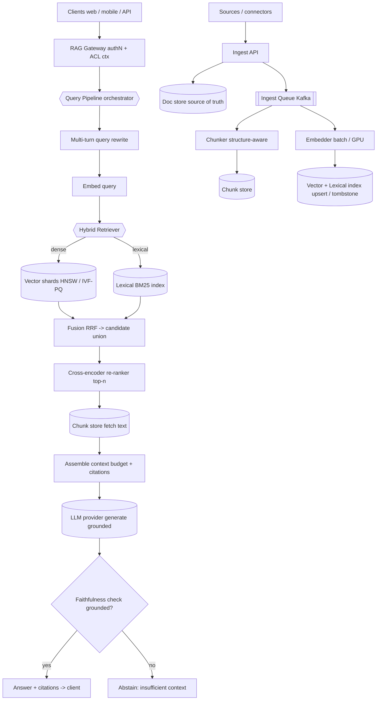

# B05 — Design a RAG system over a large corpus

This plays directly to a built-from-scratch strength and the AI-fluent search role. It tests whether I can build retrieval-augmented generation end to end: chunk a large corpus, embed it, index the vectors for approximate nearest-neighbor search, blend dense retrieval with lexical BM25, re-rank, keep it fresh, *evaluate* it rigorously (faithfulness, context-relevance, nDCG), and control hallucination through grounding. Google asks it because RAG is the dominant pattern for putting an LLM to work over private/large knowledge, and a Staff engineer is expected to own the full retrieve-then-generate pipeline and, crucially, to *prove* it works rather than vibe-check it.

## Lead with this — your résumé hook

I built a **RAG chatbot over a higher-education knowledge base** with an explicit, measured focus on **low hallucination** — answers grounded in retrieved sources with citations, not the model improvising. So I have lived the parts that separate a real RAG system from a toy: getting chunking right so retrieval returns coherent units, blending dense and lexical retrieval so we catch both semantic and exact matches, re-ranking to put the truly relevant context first, and — most importantly — building the **eval harness** (faithfulness, context-relevance) that let me actually drive the hallucination rate down. I will design this as someone who has shipped a grounded RAG product, not someone sketching a diagram.

## 1) Clarify — questions to ask the interviewer

- **Corpus:** Size (docs / total tokens), modality (text only, or PDFs/tables/code), and structure (long documents vs. short records)? This drives chunking and storage. I'll assume a large text corpus (tens of millions of docs).
- **Freshness:** How current must answers be? Static knowledge base (re-index nightly) or live data where a new doc must be retrievable in seconds? This is a major fork.
- **Query type:** Factual Q&A with citations, summarization, or conversational multi-turn? Multi-turn needs query rewriting against history.
- **Grounding strictness:** Must every claim cite a source (high-stakes, e.g. legal/medical/edu), or is best-effort acceptable? This sets how hard we lean on faithfulness checks and "I don't know" behavior.
- **Latency target:** End-to-end answer budget? Retrieval is fast (tens of ms); the generation call dominates. I'll assume **< 3 s** to first token.
- **Scale:** Query QPS and number of users? Read-heavy; embedding/indexing is the write side.
- **Eval & quality bar:** What's the acceptance metric — faithfulness, answer relevance, retrieval nDCG, human ratings? We must agree before building, because RAG quality is *measured*, not asserted.
- **Access control:** Is the corpus uniformly readable, or per-user/per-tenant ACLs that must filter retrieval? (e.g. a user must not retrieve a doc they can't see.)
- **Hallucination tolerance:** What's the cost of a wrong-but-confident answer? This decides whether we add abstention ("insufficient context") and citation enforcement.

**What the interviewer is signaling:** RAG is easy to demo and hard to make *good*. The signal that you operate at Staff level: you spend real time on **chunking** (most RAG failures are retrieval failures, and most retrieval failures are chunking failures), on **hybrid dense+lexical** (pure-vector misses exact terms/IDs), on **re-ranking**, and above all on **evaluation and grounding** — bringing up faithfulness/context-relevance metrics and an abstention policy *unprompted* is the differentiator. Anyone can pipe a vector DB into an LLM; the L6 candidate makes it measurably trustworthy.

## 2) Functional Requirements (FR)

**In scope:**
- Ingest a large corpus; **chunk** documents into retrievable units.
- **Embed** chunks and index them for ANN vector search.
- **Hybrid retrieval:** dense (vector) + lexical (BM25), fused.
- **Re-ranking** of retrieved candidates (cross-encoder).
- Context assembly under a token budget; prompt the LLM to answer **grounded with citations**.
- **Hallucination control:** grounding/faithfulness checks + abstention when context is insufficient.
- **Freshness:** incremental re-index of new/updated/deleted docs.
- **Eval harness:** offline (faithfulness, context-relevance, answer-relevance, nDCG/MRR) + online feedback.
- Caching of embeddings, retrieval results, and (where safe) answers.
- Per-user ACL filtering of retrieval (if corpus is access-controlled).

**Out of scope (defer):**
- Training/fine-tuning the base LLM or the embedding model (we consume hosted models).
- The chat UI internals.
- Agentic multi-step tool use (that's B04; this is single-shot retrieve-then-generate, optionally with query rewrite).
- Long-term user memory/personalization.

## 3) Non-Functional Requirements (NFR)

| Dimension | Target & rationale |
|---|---|
| Scale | ~50M docs → ~500M chunks; ~2K query QPS; read-heavy (generation is the cost). |
| p99 latency | **< 3 s** to first token. Retrieval < 80 ms, re-rank < 100 ms, generation dominates the rest. |
| Availability | 99.9% for the answer path. Degrade to "retrieved sources only" if the LLM is down. |
| Consistency | **Eventual** — a new/updated doc is retrievable within seconds-to-minutes; no transactional guarantee. |
| Durability | Source docs (source of truth) + chunk store durable. Vector index is **derived** and rebuildable by re-embedding. |
| Quality | Faithfulness and context-relevance tracked as first-class SLOs; abstain rather than hallucinate when unsupported. |
| Security | ACL-filtered retrieval; PII handling; citations auditable back to source. |

## 4) Back-of-envelope estimation

```
Corpus & chunks
  Documents:               5e7 docs
  Avg doc:                 ~4 KB text  -> ~ a few hundred GB raw
  Chunk size:              ~400 tokens (~10 chunks/doc)
  Chunks:                  ~5e8 chunks

Embeddings / vector index
  Dim:                     768 (or 1024)
  fp32:  5e8 * 768 * 4 B   ~ 1.5 TB  (too big for RAM at fp32)
  int8/PQ quantized:       ~ 4-8x smaller -> ~ 200-400 GB
  -> HNSW for hot shards (RAM), IVF-PQ for the long tail (memory-bounded)
  Shard target ~ 50-100 GB index -> ~ 4-8 vector shards x3 replicas

Query QPS
  Peak:                    2,000 QPS
  Each query: 1 embed(query) + ANN search (fan-out to vector shards)
              + BM25 search + re-rank + 1 LLM generation
  Retrieval RPCs:          2,000 * (shards) -> easily handled w/ replicas + cache

Cost (per query, illustrative)
  Embedding query:         tiny (~cents/1000)
  Generation:              ~4K input (system + ~8 chunks) + ~500 output tokens
                           -> generation dominates $ and latency
  Answer cache hit on repeated questions saves the whole generation cost

Indexing / write path
  New docs/day:            say 1e6 -> chunk + embed ~ 1e7 embeddings/day
  Embedding throughput:    batch on GPU; backfill via queue
  Incremental: re-embed only changed docs; tombstone deleted chunks

Cache
  Answer cache (popular Qs): top 200K Q->A * ~3 KB ~ 600 MB Redis
  Embedding cache for repeated/near-dup queries
```

## 5) API design

```
# Ask (retrieve-then-generate)
POST /v1/rag:answer
  body: {
    query: "what is the refund policy for dropped courses?",
    filters: { tenant, lang, source_type },
    top_k: 8,                         # chunks to ground on
    mode: "strict" | "best_effort",   # strict -> cite or abstain
    history: [...],                   # for multi-turn query rewrite
    user_ctx: { uid, acl_groups[] }
  }
  -> stream: { answer_tokens..., citations: [{doc_id, chunk_id, span, score}],
               grounded: bool, abstained: bool }

# Retrieve only (debug / power users)
POST /v1/rag:retrieve
  body: { query, top_k, mode }
  -> { candidates: [{chunk_id, text, dense_score, bm25_score, rerank_score}] }

# Ingest (internal)
POST /v1/corpus:upsert
  body: { docs: [{doc_id, content, metadata, acl[]}] }
  -> { accepted, chunks_created, index_offset }
DELETE /v1/corpus/{doc_id}            # tombstone -> remove chunks

# Eval
POST /v1/eval:run { dataset_id }      # faithfulness, context-relevance, nDCG, answer-relevance
```

## 6) Architecture — request & data flow

### (a) ASCII layered diagram

```
                 Clients (web / mobile / API)
                              |
                              v
                  [ Global LB / GeoDNS ]          route to nearest region
                              |
                              v
                  [ RAG Gateway ]                 authN, rate-limit, attach ACL ctx
                              |
                              v
            +============ Query Pipeline (orchestrator) ============+
            |  1. (multi-turn) rewrite query from history            |
            |  2. embed query     3. hybrid retrieve                 |
            |  4. re-rank         5. assemble context (budget)       |
            |  6. generate grounded answer   7. verify faithfulness  |
            +======================================================+
                 |              |                 |              |
          embed q |   retrieve  |        re-rank  |    generate  |  verify
                  v              v                 v              v
         [ Embedder ]   +== Hybrid Retriever ==+  [ Re-ranker ]  [ LLM Gateway ]  [ Faithfulness
         query vector   |  dense ANN  +  BM25   | cross-encoder   prompt cache,     checker / NLI ]
                        |  fusion (RRF)         | top-k -> top-n   citations         grounded? else
                        +======================+      |           generation         abstain
                          |              |            |              |
                          v              v            |              |
                  [ Vector shards ]  [ Lexical idx ]  |              |
                  (HNSW / IVF-PQ)    (BM25 postings)  |              |
                          |              |            |              |
                          +------ candidate union ----+              |
                                       |                             |
                                       v                             v
                              [ Chunk store: fetch text ]    [ LLM provider (hosted) ]
                                       |
                                       v
                              context -> prompt -> answer + citations -> client


WRITE / INDEXING PATH (async)
   Sources/connectors --> [ Ingest API ] --> [ Doc store (source of truth) ]
                                                   |
                                                   v
                                          [ Ingest Queue (Kafka) ]
                                                   |
                          +------------------------+------------------------+
                          v                                                 v
                 [ Chunker ]  split docs into                      [ Embedder (batch/GPU) ]
                 coherent units (semantic/structure-aware)         chunk -> vector
                          |                                                 |
                          v                                                 v
                 [ Chunk store (text + metadata) ]              [ Vector index + Lexical index ]
                                                                upsert; tombstone deleted chunks
```

**Read path (retrieve-then-generate):** A query hits the gateway (auth, ACL context) and enters the **Query Pipeline**. For multi-turn, it first **rewrites** the query against conversation history into a standalone question (so "what about refunds?" becomes "what is the refund policy for dropped courses?"). It then **embeds** the query and runs **hybrid retrieval** in parallel: dense **ANN** over the vector shards (semantic matches) and **BM25** over the lexical index (exact terms, IDs, names), fused with **Reciprocal Rank Fusion**. The candidate union goes to a **cross-encoder re-ranker** that scores each (query, chunk) pair precisely and keeps the top-n. The pipeline fetches chunk text from the **chunk store**, **assembles context** under a token budget (highest-ranked chunks first, with source IDs for citation), and calls the **LLM Gateway** to generate a **grounded answer with citations**. Finally a **faithfulness check** verifies the answer's claims are supported by the retrieved context; if not (or if retrieval was weak), the system **abstains** ("I don't have enough information") rather than hallucinate. ACL filtering happens during retrieval so a user can never be grounded on a doc they can't read.

**Write path (indexing, async):** Connectors push documents to the **Ingest API**, which writes the canonical copy to the **doc store** (source of truth) and enqueues to Kafka. A **Chunker** splits each doc into coherent, retrieval-sized units (structure/semantic-aware, not blind fixed windows), the **Embedder** batches them onto GPUs to produce vectors, and both the **vector index** and **lexical index** are upserted. Deletes write **tombstones** that remove the doc's chunks. Because the vector index is *derived*, a model change or corruption is recovered by replaying the queue through a new embedder into a shadow index, then flipping — no data loss.

### (b) Mermaid flowchart



## 7) Data model & storage choices

- **Vector index (ANN):** `chunk_id -> embedding`, served by an approximate-nearest-neighbor structure. **HNSW** (graph-based) for hot/recent chunks — best recall/latency but RAM-hungry; **IVF-PQ** (inverted-file + product quantization) for the long tail — quantize vectors to PQ codes to fit ~4–8× more per node, trading a little recall for memory. At 500M chunks we *must* quantize; fp32 in RAM is infeasible. Justification: ANN is the only way to do sub-100 ms similarity search over hundreds of millions of vectors; exact kNN is O(N) and hopeless.
- **Lexical/BM25 index:** standard inverted index `term -> postings` over the same chunks, for exact-term recall (identifiers, names, numbers that embeddings blur). Justification: dense retrieval is semantically strong but lexically weak; BM25 catches the exact-match cases — hybrid beats either alone.
- **Chunk store:** `chunk_id -> (doc_id, span, text, metadata, acl_groups)` in a KV store. Justification: the index returns IDs; we hydrate text for context assembly and citation, and store ACLs here for filtering.
- **Doc store (source of truth):** canonical documents in blob/KV, keyed by `doc_id`. Justification: needed to re-chunk/re-embed on model change and to anchor citations; durability lives here, not in the derived index.
- **Ingest queue:** Kafka, partitioned by `doc_id`, retained long enough to replay a full re-embed. The durability + ordering backbone for incremental indexing.
- **Eval store:** judged datasets + per-run metrics (faithfulness, context-relevance, nDCG) for regression-gating model/prompt/chunking changes.

## 8) Deep dive

**Chunking + retrieval quality (where RAG lives or dies).** The dominant failure mode of RAG is *the right answer was never retrieved*, and that usually traces to chunking. Blind fixed-size windows split a sentence or a table mid-row, so a chunk is incoherent and embeds to a meaningless point; or chunks are so large that one embedding can't represent their multiple topics. The fix is **structure/semantic-aware chunking**: split on natural boundaries (headings, paragraphs, list items, code/function boundaries, table rows), target ~200–500 tokens, and use **overlap** (a sliding window of shared tokens) so a fact spanning a boundary still lands wholly in some chunk. I also attach **context to each chunk** (parent doc title, section heading) so an isolated chunk is self-describing. Then retrieval is **hybrid**: dense ANN for semantic similarity *plus* BM25 for exact lexical matches, fused with **Reciprocal Rank Fusion** (rank-based, no score-scale calibration needed). Finally a **cross-encoder re-ranker** re-scores the top ~50 candidates by jointly encoding (query, chunk) — far more accurate than the bi-encoder similarity used for the first-stage ANN, but too expensive to run over the whole corpus, hence the two-stage retrieve-then-rerank design. This pipeline — good chunks → hybrid recall → precise re-rank → tight context — is exactly what moved the needle on my higher-ed chatbot.

**Grounding, faithfulness, and evaluation (proving it's trustworthy).** A RAG system's value is *grounded* answers, so I design both the control of hallucination and its measurement. **Control:** prompt the model to answer *only* from the provided context and to cite the chunk for each claim; if the retrieved context doesn't support an answer, **abstain** ("I don't have enough information") — a calibrated "I don't know" beats a confident fabrication in any high-stakes setting. Add a post-generation **faithfulness check**: a lightweight NLI/entailment pass (or LLM-as-judge) verifies each claim is entailed by the cited context; unsupported claims trigger a regenerate or an abstain. **Measurement** is non-negotiable and is what makes this Staff-level — I build an **eval harness** tracking four metrics: (1) **context-relevance / retrieval nDCG / MRR** — did we retrieve the right chunks (catches chunking/retrieval bugs); (2) **faithfulness / groundedness** — is every answer claim supported by retrieved context (catches hallucination); (3) **answer-relevance** — does the answer actually address the question; (4) **end-to-end correctness** on a judged QA set. Every change to chunking, embedding model, re-ranker, or prompt is **regression-gated** on these metrics before rollout, and online feedback (thumbs, citation-click, edits) feeds back. This is precisely how I drove hallucination down: you cannot improve what you don't measure, and RAG quality is invisible without an eval harness.

## 9) Key tradeoffs

| Decision | Choice & rationale |
|---|---|
| CAP | **AP** for serving — availability + low latency; a just-ingested doc may be briefly unretrievable. Doc store is the CP source of truth. |
| Consistency | Eventual; bounded by freshness lag (new doc retrievable in seconds-to-minutes). |
| Retrieval | **Hybrid dense + BM25**, fused with RRF. Pure-vector misses exact terms/IDs; pure-lexical misses semantics. |
| ANN index | HNSW (hot, RAM, best recall/latency) + IVF-PQ (long tail, memory-bounded). Quantize — fp32 in RAM is infeasible at 500M chunks. |
| Re-ranking | Two-stage: cheap bi-encoder ANN recall → expensive cross-encoder precision on top-50. Can't cross-encode the corpus. |
| Chunking | Structure/semantic-aware + overlap + parent context. Most retrieval failures are chunking failures. |
| Grounding | Cite-or-abstain; faithfulness check post-generation. Trust > coverage in high-stakes domains. |
| Caching | Answer cache (repeat questions), embedding cache, retrieval cache. Generation dominates cost. |
| Sync vs async | Answer path sync/streaming; ingest+embed fully async via Kafka. |
| Eval | First-class, regression-gating. RAG quality is measured, not asserted. |

## 10) Bottlenecks & failure modes

- **Retrieval miss → confidently wrong or empty answer (the core risk):** the right chunk wasn't retrieved. *Mitigation:* hybrid retrieval + re-rank + good chunking; abstain when top scores are weak; eval gate catches regressions before users.
- **Hallucination despite retrieval:** model adds unsupported claims. *Mitigation:* cite-or-abstain prompting + post-generation faithfulness/NLI check → regenerate or abstain.
- **Stale index / freshness lag:** a doc changed but old chunks still served. *Mitigation:* incremental re-embed off the queue; tombstone deleted chunks; bound freshness via consumer-lag autoscaling.
- **LLM provider latency/outage (SPOF):** *Mitigation:* retries, multi-provider fallback, and degrade to "here are the relevant sources" (retrieval-only) when generation is down.
- **Embedding-model change invalidates the whole index:** new model → all vectors stale. *Mitigation:* shadow-index re-embed via queue replay, then atomic flip; never re-embed in place on the live index.
- **Hot/duplicate queries (thundering herd):** popular question stampedes generation. *Mitigation:* answer cache + request coalescing + jittered TTL.
- **ANN recall cliff under heavy quantization:** too-aggressive PQ drops the right chunk. *Mitigation:* tune PQ/nprobe on the eval set; keep hot chunks in HNSW; re-rank recovers some precision.
- **ACL leak via retrieval:** grounding on a doc the user can't see. *Mitigation:* ACL filter applied *during* retrieval (pre-generation), re-checked at chunk hydration.
- **Context overflow / lost-in-the-middle:** too many chunks degrade the answer. *Mitigation:* strict context budget, re-rank to put best chunks first, cap top-k.

## 11) Scale 10x / evolution

- **What breaks first:** the **vector index memory footprint and ANN latency** at 5B chunks, and **generation cost/capacity** at 10× QPS.
- **Fix 1 — quantize + tier harder:** push more of the corpus from HNSW to IVF-PQ or disk-backed ANN (DiskANN) to keep RAM bounded; keep only hot/recent chunks in graph indexes.
- **Fix 2 — shard the vector index + two-level fan-out:** more shards revive tail latency on retrieval; add a coordinator tier and route by tenant/filter so most queries hit a subset of shards.
- **Fix 3 — answer + retrieval cache hit-rate:** at 10× QPS the cheapest win is caching repeated questions and retrievals; even modest hit rates slash generation cost (the dominant cost).
- **Fix 4 — embedding/re-embed throughput:** incremental indexing must keep up; batch on GPU, prioritize fresh docs, backfill the tail; re-embed-on-model-change via shadow index becomes a scheduled large job.
- **Fix 5 — eval at scale:** mine the query firehose for online metrics, auto-flag faithfulness/retrieval regressions, expand judged datasets so every change stays gated.
- **Future:** distilled/cheaper generation models for routine answers, reserving the frontier model for hard queries; adaptive retrieval (retrieve more chunks only when first-pass confidence is low).

## 12) Interviewer probes & follow-ups

- **"Why hybrid retrieval — isn't a vector DB enough?"** Dense retrieval is semantically strong but lexically weak — it blurs exact identifiers, names, and numbers. BM25 catches those. Fusing them (RRF) beats either alone; this directly lifts retrieval recall, which is the top driver of RAG quality.
- **"How do you control hallucination?"** Cite-or-abstain prompting (answer only from context, cite each claim, say "I don't know" when unsupported) plus a post-generation faithfulness/NLI check that regenerates or abstains on unsupported claims. And I *measure* it with a faithfulness metric in the eval harness.
- **"How do you evaluate the system?"** Four metrics: context-relevance/nDCG (retrieval), faithfulness (grounding), answer-relevance, and end-to-end correctness on a judged set. Every change to chunking/embedding/re-ranker/prompt is regression-gated before rollout; online feedback closes the loop.
- **"Why two-stage retrieval (ANN then re-rank)?"** The bi-encoder ANN is fast enough to scan the corpus but approximate; the cross-encoder is far more accurate but too expensive to run over everything. So recall cheaply with ANN, then precision-rank the top ~50 with the cross-encoder.
- **"How do you keep it fresh?"** Incremental re-chunk/re-embed off a Kafka queue for new/changed docs; tombstones for deletes; autoscale embedders on consumer lag. Freshness is bounded, not transactional.
- **"What happens when you change the embedding model?"** Every vector becomes stale, so I re-embed into a *shadow* index by replaying the queue, validate it on the eval set, then atomically flip — never re-embed in place on the live index.
- **"How do you pick chunk size?"** Empirically, on the eval set — structure-aware splits (~200–500 tokens) with overlap and parent context. Too small loses context; too large dilutes the embedding. I tune it as a hyperparameter against retrieval nDCG.
- **"500M vectors won't fit in RAM at fp32 — now what?"** Quantize: int8/PQ cuts memory 4–8×; HNSW for the hot set, IVF-PQ/DiskANN for the long tail. Tune nprobe/PQ on the eval set to stay above the recall cliff.

## 13) 60-minute flow cheat-sheet

| Time | Phase | What to do |
|---|---|---|
| 0–6 min | Clarify | Pin corpus size/modality, freshness, grounding strictness, latency, eval bar, ACLs. |
| 6–10 min | FR/NFR | In/out scope; NFR table; commit to hybrid retrieval + cite-or-abstain + eval-gated. |
| 10–16 min | Estimation | Docs → chunks → vector index size (quantize!) → QPS → generation cost → cache sizing. |
| 16–22 min | API | rag:answer (streamed, citations, abstain) + retrieve (debug) + upsert + eval:run. |
| 22–38 min | Architecture | Draw layered diagram; **walk retrieve→fuse→re-rank→assemble→generate→verify**, then the ingest/embed path. |
| 38–50 min | Deep dive | Chunking + hybrid retrieval + re-rank AND grounding/faithfulness + the eval harness. |
| 50–56 min | Tradeoffs + failures | Retrieval miss, hallucination, embedding-model change, ANN recall cliff, ACL leak — each mitigated. |
| 56–60 min | Scale 10× | Quantize+tier ANN, two-level fan-out, answer-cache hit-rate, eval-on-the-firehose. |
