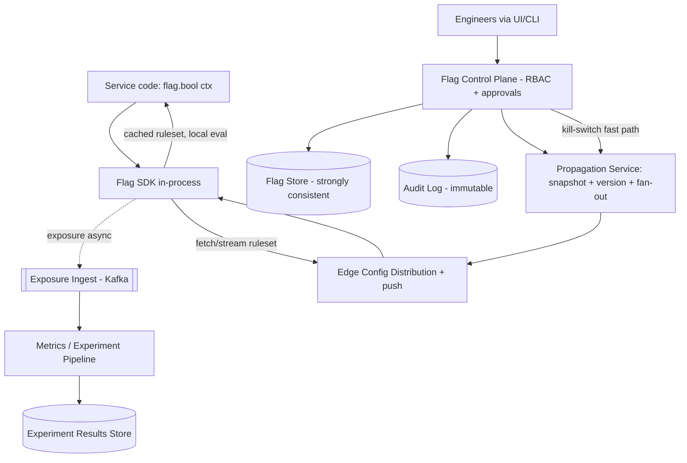

# B07 — Design a feature-flag / experimentation platform

Design the system that lets every service at the company gate behavior behind flags — turning features on/off, targeting cohorts, ramping rollouts by percentage, and running A/B experiments — all read on the **hot path of every request** with sub-millisecond overhead. It tests a core Developer-Experience primitive: a flag store, a targeting-rule engine, **gradual rollout / bucketing**, **ultra-low-latency edge reads**, an audit log, a global **kill-switch**, and consistent flag propagation. Google asks it because safe, incremental rollout and online experimentation are how large orgs ship without breaking things — it's a platform + infra-governance problem, exactly the Staff sweet spot.

## (Section B only) Lead with this — your résumé hook

"I've owned platform and infra-governance primitives, and a feature-flag/experimentation system is the highest-leverage one — it's how thousands of engineers ship safely without coordinating deploys, and it's read on literally every request, so the design constraint is brutal: targeting and rollout logic must add **near-zero latency** and **never take the request down**. I'll design it so flag evaluation happens **locally in the SDK against a cached ruleset** (no network call per flag), with a fast propagation path for changes, a hard kill-switch, and a full audit trail. I'll spend my depth budget on low-latency reads + safe propagation and on percentage bucketing for experiments, since those are where correctness and trust live."

## 1) Clarify — questions to ask the interviewer

- **Flag types:** Boolean kill-switches only, or also multivariate flags, config values, and full A/B experiments with metrics? Experiments add a metrics-analysis pipeline; pure flags don't.
- **Evaluation location:** Server-side SDKs, client-side (browser/mobile), or both? Client-side changes the trust/security model (can't ship targeting secrets to the browser) and the propagation latency.
- **Latency budget:** What overhead per flag check is acceptable? I'll assume it must be **effectively zero (local, in-memory)** — a network call per flag on every request is a non-starter.
- **Scale:** How many flags, services, evaluations/sec? Flag *evaluations* dwarf flag *changes* by many orders of magnitude (reads vs writes).
- **Targeting richness:** Just % rollout, or attribute-based rules (country, app version, user tier, custom attributes)? Drives the rule-engine complexity.
- **Propagation SLO:** When I flip a kill-switch, how fast must it take effect everywhere — seconds? This sets whether I need streaming/push vs polling.
- **Consistency needs:** Is it OK if different servers see a flag change a few seconds apart (eventual), or must a flip be globally atomic? Atomicity is expensive; usually eventual + fast is right, *except* for kill-switches.
- **Stickiness:** Must a user stay in the same bucket/variant across requests and devices (for clean experiments)? This forces deterministic hashing, not random assignment.
- **Audit / compliance:** Who can change what; do we need a full change history and approvals? This is the governance angle (and a real requirement at scale).
- **Failure behavior:** If the flag system is unreachable, what should a service do — fail open to last-known-good, or fail to a safe default? (Always last-known-good / default — flags must never block the request.)

**What the interviewer is signaling:** They want to hear that **flag evaluation is local and in-memory** (SDK-side against a cached ruleset), not a remote call per flag — that's the defining insight. The propagation/consistency question is the tell: you must articulate *eventual consistency with fast push, plus a hard kill-switch path*, and that the system **fails safe** (never takes down the caller). Asking about stickiness/deterministic bucketing signals you understand experimentation correctness, not just on/off toggles.

## 2) Functional Requirements (FR)

**In scope:**
- **Flag store:** create/read/update flags (boolean, multivariate, config values) with metadata.
- **Targeting rules:** evaluate attribute-based rules (country, version, user tier, custom attributes) to decide a flag's value per context.
- **Gradual rollout / % bucketing:** deterministically assign a stable percentage of users to a variant; ramp 1% → 5% → 50% → 100%.
- **Low-latency edge/SDK reads:** flag evaluation adds near-zero latency (local, in-memory ruleset).
- **Fast propagation:** flag changes reach all evaluators within seconds.
- **Kill-switch:** instantly disable a feature globally, with the highest-priority propagation.
- **Audit log:** immutable history of who changed which flag, when, and why; approvals/RBAC.
- **Experiment metrics:** record exposures (who saw what variant) and feed a metrics pipeline to measure impact with statistical rigor.
- **Consistency of propagation:** every evaluator converges to the same ruleset version.

**Out of scope (defer):**
- The full statistics engine for experiment significance (I'll define the exposure-logging contract and hand off to an analytics pipeline).
- Deploy/release orchestration (flags decouple *release* from *deploy*, but I'm not designing CD).
- Authn/identity provider internals (assume one exists for RBAC).
- Front-end UI design beyond the management API.
- Long-term experiment data warehousing internals.

## 3) Non-Functional Requirements (NFR)

| Dimension | Target & rationale |
|---|---|
| Scale | ~10,000 services/instances; ~100k flags; **flag evaluations on every request → tens of millions/sec org-wide** (but local). Flag *changes*: a few thousand/day (tiny). |
| p99 latency | **Evaluation ≤ ~1 ms (effectively in-memory, sub-microsecond)** — it's on every request. Ruleset *fetch* (background) ≤ 100 ms; propagation of a change ≤ a few seconds. |
| Availability | **99.99%+ for reads, and graceful-degrade beyond that.** If the control plane is down, evaluators serve last-known-good rulesets — flags must NEVER fail the caller's request. |
| Consistency | **Eventual** for normal flag changes (servers converge within seconds). **Kill-switch is fast-path / near-real-time.** Bucketing is **deterministic** (same user → same bucket, sticky). |
| Durability | Flag definitions + audit log: **durable + immutable** (config of record, compliance). Cached rulesets on evaluators: ephemeral (refetchable). |
| Read/write ratio | Extremely read-heavy at evaluation; changes are rare. Optimize the read path to the extreme; the write path can be heavier. |
| Security | RBAC + approvals on changes; never ship targeting *secrets* to client SDKs (use server-side evaluation or signed, sanitized rulesets); audit everything; per-flag change authorization to prevent unsafe rollouts. |

## 4) Back-of-envelope estimation

```
EVALUATIONS (reads) -- the dominant volume, but LOCAL
  Org request rate (peak)       ~5,000,000 req/sec across all services
  Flag checks per request       ~10  (services check many flags)
  Flag evaluations/sec          ~50,000,000 /sec
  => NONE of these hit a central service; they are in-memory SDK lookups.
     Central read load = only ruleset FETCHES (see below).

RULESET FETCHES (the actual network load on the control plane)
  Evaluator instances           ~10,000 - 100,000 SDK instances
  Poll interval (fallback)      ~30 s ; OR push on change (streaming)
  Polling load                  100,000 / 30s = ~3,300 fetches/sec  (trivial)
  Push model                    near-zero steady-state; spikes on change

FLAG CHANGES (writes) -- rare
  Changes/day                   ~5,000  (flips, ramps, new flags)
  ~ 5,000 / 86400               << 1 /sec average. Tiny.
  Each change fans out to       ~100,000 evaluators within seconds.

RULESET SIZE (what each evaluator caches in memory)
  Flags                         ~100,000 total, but a service uses a subset
  Per-flag ruleset              ~1 KB (rules + variants + rollout %)
  Per-service relevant flags    ~1,000 -> ~1 MB cached ruleset in memory
  Full org ruleset              100k * 1KB = ~100 MB (fits easily if needed)

PROPAGATION FAN-OUT (kill-switch)
  1 change -> push to ~100,000 evaluators
  Via pub/sub fanout + CDN-style edge config: sub-second to a few seconds.

EXPOSURE / METRICS (experiment logging)
  Exposures/sec                 ~ a fraction of evaluations that are experiments
                                 say ~1,000,000 exposures/sec logged async
  ~1M/sec * ~200 bytes          ~200 MB/sec -> Kafka -> warehouse (sampled/aggregated)
```

The defining number: **50M evaluations/sec but zero central read load**, because evaluation is in-memory in the SDK. The control plane only handles **~thousands of fetches/sec and <1 change/sec** — it's a small, highly-available config-distribution service, not a high-QPS data plane. Exposure logging is the one genuinely high-volume async stream.

## 5) API design

```
# Evaluation (in-process SDK call -- NO network on the hot path)
flag.bool("checkout_v2", ctx={ user_id, country, app_version, tier }) -> true
flag.variant("ranking_exp", ctx) -> "treatment_b"
flag.value("max_batch_size", ctx) -> 256
  # All resolved locally against the cached ruleset. Logs an EXPOSURE async.

# Ruleset distribution (SDK <-> control plane, background)
GET    /v1/ruleset?service=...&etag=...   # fetch latest ruleset (304 if unchanged)
WS/SSE /v1/ruleset/stream?service=...      # push changes (kill-switch fast path)

# Management plane (UI / API, RBAC-gated)
POST   /v1/flags { key, type, variants, default }          # create
PUT    /v1/flags/{key}/rules { targeting_rules }           # set targeting
PUT    /v1/flags/{key}/rollout { variant, percent }        # ramp %
POST   /v1/flags/{key}/kill                                # KILL-SWITCH (fast path)
GET    /v1/flags/{key}/audit                               # change history
POST   /v1/flags/{key}/approve { change_id }               # approval workflow

# Experiment metrics
POST   /v1/exposures (batch)   # async, fire-and-forget (usually inside SDK)
GET    /v1/experiments/{id}/results   # read from analytics pipeline
```

Design notes: the **evaluation API takes no network round-trip** — it's a local function call over the cached ruleset, which is *the* latency guarantee. Ruleset fetches use **ETags / version numbers** (return 304 when unchanged) and a **push channel** for fast propagation. The management plane is heavily RBAC- and audit-gated. Exposure logging is async and must never slow or fail the evaluation.

## 6) Architecture — request & data flow

### (a) ASCII layered diagram

```
   APPLICATION INSTANCES (every service, every request)
   +-------------------------------------------------+
   |  Service code: flag.bool("x", ctx)              |
   |        |                                        |
   |        v                                        |
   |  [ Flag SDK (in-process) ]                      |   <-- EVALUATION IS LOCAL
   |   - holds CACHED RULESET in memory              |       (sub-microsecond,
   |   - evaluates targeting rules + % bucket        |        no network call)
   |   - deterministic hash(user_id, flag) -> bucket |
   |   - emits EXPOSURE event (async, non-blocking)  |
   +-----|----------------------------^--------------+
         | ruleset fetch / stream     | exposures (fire-and-forget)
         | (background, ETag/version) |
         v                            v
   [ Edge Config Distribution ]   [ Exposure Ingest (Kafka) ]   async, high-volume
   - CDN / regional config cache       |
   - serves immutable ruleset          v
     snapshots by version          [ Metrics / Experiment Pipeline ]
   - PUSH channel for fast prop    - aggregate exposures + outcome metrics
         ^   |                     - significance, guardrail metrics
         |   | new snapshot            |
         |   v                         v
   [ Propagation Service ]         [ Experiment Results Store ]
   - on change: build new ruleset
     snapshot, bump version,
     fan-out push (kill-switch =
     highest priority)
         ^
         | validated change (versioned)
         |
   [ Flag Control Plane / API ]   <--- Engineers via UI/CLI (RBAC, approvals)
   - CRUD flags, targeting, rollout %
   - kill-switch endpoint (fast path)
   - writes change + emits to propagation
         |                 ^
   write |                 | read config of record
         v                 |
   [ Flag Store (strongly consistent) ]   source of truth: flags, rules, rollout
         |
         v
   [ Audit Log (append-only, immutable) ]  who/what/when/why for every change
```

**Read / evaluation path (the hot path — and it never leaves the process).** Service code calls `flag.bool("checkout_v2", ctx)`. The **in-process SDK** evaluates entirely against its **cached ruleset in memory**: it runs the targeting rules against `ctx` (country, version, tier), and for percentage rollouts computes a **deterministic hash(user_id, flag_salt) mod 100** to decide the bucket. No network call, no lock contention — sub-microsecond. The SDK fires an **exposure event** asynchronously (fire-and-forget) for experiment measurement, which must never block or fail the evaluation. The SDK refreshes its ruleset in the background (poll with ETag, or subscribe to a push stream); if the control plane is unreachable, it keeps serving the **last-known-good ruleset** — flags degrade gracefully and never take the request down.

**Write / change path (rare, governed, fast-propagating).** An engineer changes a flag via the **Control Plane** (UI/CLI), gated by RBAC and approvals. The change is written to the strongly-consistent **Flag Store** (source of truth) and recorded in the **immutable Audit Log**. The **Propagation Service** builds a new **immutable ruleset snapshot**, bumps the version, and fans it out through the **Edge Config Distribution** layer (CDN/regional caches) plus a **push channel** to all evaluators. For a **kill-switch**, this path is highest-priority — push directly to evaluators so the feature dies everywhere within seconds, not on the next poll.

**Why eventual consistency is acceptable (with a kill-switch exception).** Normal flag changes converge across evaluators within seconds; a few servers seeing a new ramp percentage slightly before others is harmless. The one case that needs near-real-time is the kill-switch, which gets its own fast push lane. This lets the whole system run AP and degrade gracefully — exactly right for something on every request.

### (b) Mermaid flowchart



## 7) Data model & storage choices

**Flag definition (source of truth).**
```
Flag {
  key, type: bool|multivariate|config,
  variants: [ {name, value, weight} ],
  default_value,                     # served if rules don't match / on error
  targeting_rules: [ { conditions:[{attr, op, values}], serve: variant } ],
  rollout: { variant, percent, salt },   # salt => stable, independent buckets
  state: active|killed,
  version, owner, updated_at
}
```
Stored in a **strongly-consistent relational/KV store**. There are only ~100k flags and changes are rare, so write throughput is trivial; the requirement is **strong consistency + integrity** of the config of record (you never want two conflicting "truths" for a flag). This is config, not high-QPS data.

**Ruleset snapshot (what's distributed).** An **immutable, versioned blob** per service (or global) compiled from all relevant flags. Stored in an **edge/CDN config cache** keyed by version. Immutability + versioning is what makes propagation safe and cacheable: evaluators atomically swap from version N to N+1, and rollback is just "serve version N again." Served from object storage / CDN, replicated globally for locality.

**Audit log.** **Append-only, immutable** store (e.g. an event log + queryable index) of every change: actor, before/after, timestamp, reason, approval. Durable and tamper-evident for compliance and incident forensics. This is the governance backbone — "who turned this on at 3am" must always be answerable.

**Exposure / experiment events.** High-volume async stream → **Kafka** → columnar **warehouse** (sampled/aggregated). Exposures record `(user, flag, variant, timestamp)`; the metrics pipeline joins them with outcome metrics. This is the only genuinely high-throughput data store in the system; it's write-heavy, append-only, analytics-read — a perfect log + warehouse fit, decoupled from the hot evaluation path.

**SDK in-memory ruleset.** A compact in-process structure (hash map flag_key → compiled rules) — ephemeral, refetchable, optimized for sub-microsecond lookup. No durability needed; it's a cache of the snapshot.

Justification theme: **separate the config of record (small, strongly consistent, durable) from the evaluation cache (in-memory, ephemeral, ultra-fast) from the exposure stream (high-volume, async, analytics)**. Three very different stores because they have three very different access patterns — collapsing them is the classic mistake.

## 8) Deep dive

### Deep dive 1: Low-latency reads + safe, consistent propagation (the crux)

This is the defining constraint: flags are read on every request, so evaluation must be free, yet a kill-switch must take effect everywhere in seconds.

- **Evaluation is local, period.** The SDK caches the ruleset in process and evaluates in memory — no network call, no shared lock on the hot path (rulesets are immutable; a refresh swaps the pointer atomically). This is what turns "50M evaluations/sec" into zero central read load. A network-per-flag design would add latency *and* a hard dependency that could take down every service — the anti-pattern to call out explicitly.
- **Background refresh with versioning.** SDKs fetch rulesets with an **ETag/version**; the edge returns 304 when nothing changed, so steady-state cost is near zero. A new version is an **immutable snapshot** — evaluators atomically move N → N+1, and there's never a partially-applied ruleset.
- **Fast propagation via push + fan-out.** For normal changes, polling (~30s) is fine. For a **kill-switch**, a **pub/sub push channel** notifies evaluators immediately so they pull the new snapshot within seconds. The fan-out (1 change → 100k evaluators) is handled CDN-style: tiered edge caches + pub/sub, not a thundering herd hitting the control plane.
- **Consistency model, stated crisply:** **eventual** across evaluators (converge in seconds — fine for ramps), with the **kill-switch on a fast lane**. Bucketing is **deterministic** so even mid-propagation, a given user's variant is stable. Different servers briefly disagreeing on a 10%-vs-15% ramp is invisible; that's the deliberate AP choice.
- **Fail-safe is non-negotiable.** If the control plane is unreachable, SDKs serve **last-known-good**; if a flag is unknown or evaluation errors, serve the **flag's default**. The flag system must be incapable of failing the caller's request — it's an *enhancement* to the request path, never a dependency that can break it.

### Deep dive 2: Percentage bucketing + experiment correctness

Gradual rollout and clean A/B experiments both depend on getting bucketing exactly right — this is where subtle bugs ruin experiments and erode trust.

- **Deterministic hashing for stickiness.** Bucket = `hash(user_id + flag_salt) mod 100`. Because it's a pure function of `user_id` and a per-flag **salt**, the *same user always lands in the same bucket* for a given flag — across requests, servers, and devices. That stickiness is mandatory: an experiment where users flip between control and treatment per request is statistically worthless and a terrible UX.
- **Per-flag salt → independent assignments.** The salt ensures a user in the "treatment" 10% of experiment A is *not* correlated with their bucket in experiment B — independent randomization across concurrent experiments, avoiding interaction bias. Without the salt, the same users would always be in the same bucket of every experiment.
- **Monotonic ramps.** Ramping 1% → 5% → 50% should keep already-included users included (the included set grows, never reshuffles). With consistent hashing on a `[0,100)` ring, "below the threshold" grows monotonically, so a user who was in at 5% stays in at 50% — no churn as you ramp.
- **Exposure logging = ground truth for analysis.** The SDK logs an exposure the moment a user is *actually assigned* a variant (not merely eligible). The metrics pipeline joins exposures with outcome metrics (conversion, latency, errors) to compute lift with statistical significance, and **guardrail metrics** (latency, error rate, crash rate) so a bad treatment auto-alarms. Logging on assignment (not eligibility) avoids dilution bias.
- **Safety integration:** ramps watch guardrail metrics; if a treatment regresses a guardrail, the platform can **auto-rollback** (drop to 0%) — the kill-switch and experiment system reinforce each other. This is the "ship safely" promise that makes the platform trustworthy.

## 9) Key tradeoffs

| Decision | Option A | Option B | Choice & why |
|---|---|---|---|
| Evaluation location | Central service (network call/flag) | **Local in-SDK over cached ruleset** | **Local.** Zero hot-path latency, no hard dependency that can take services down. Cost: propagation lag (mitigated by push). |
| Consistency | Strongly consistent global flips | **Eventual + kill-switch fast path** | **Eventual (+fast kill).** A few seconds of divergence on a ramp is harmless; strong global atomicity is expensive and unnecessary except for kill-switches. |
| Propagation | Poll only | **Poll baseline + push for urgent** | **Hybrid.** Polling (ETag) is cheap and robust; push gives sub-second kill-switch. Cost: maintain a streaming channel. |
| Bucketing | Random per request | **Deterministic hash(user+salt)** | **Deterministic.** Sticky assignment is mandatory for valid experiments and consistent UX. |
| Failure mode | Fail closed (block) | **Fail safe (last-known-good / default)** | **Fail safe.** Flags must never fail the caller's request; degrade to cached/default. |
| Client-side flags | Ship full rules to client | **Server-side eval, or signed sanitized ruleset** | **Server-side / sanitized.** Never leak targeting secrets to browsers; evaluate server-side or ship only what's safe. |
| Exposure logging | Synchronous | **Async, fire-and-forget** | **Async.** Must not slow or fail evaluation; lossy-but-sampled is fine for stats. |
| Config of record | One store for everything | **Strongly-consistent flag store + immutable snapshots + async exposure stream** | **Three stores.** Different access patterns; separating them is the whole point. |

## 10) Bottlenecks & failure modes

- **Control-plane outage taking down callers.** The scariest failure: if services *depend* on a live flag call, a control-plane blip blacks out the org. *Mitigation:* evaluation is local + SDKs serve **last-known-good**; the control plane is off the request path by construction. This is designed-out, not patched.
- **Propagation thundering herd on a change.** One change → 100k SDKs all refetch at once. *Mitigation:* serve immutable versioned snapshots from a **CDN/edge cache** (not the control plane), jittered poll intervals, and push-then-pull (notify, let SDKs pull the cached snapshot) so the origin sees one build, not 100k fetches.
- **Stale ruleset on a slow/failed refresh.** An SDK could serve an old ramp. *Mitigation:* short refresh interval + version monitoring; the kill-switch push path bypasses the poll cadence for urgent changes; alert on evaluators lagging the current version.
- **Bucketing skew / non-determinism bug.** A bad hash or missing salt silently corrupts every experiment. *Mitigation:* well-distributed hash, per-flag salt, and validation that bucket distributions match target percentages; treat bucketing as a tested, audited primitive.
- **Exposure pipeline overload / loss.** 1M exposures/sec can swamp ingest. *Mitigation:* async fire-and-forget, sampling, backpressure on Kafka — and crucially, exposure loss degrades *analysis precision*, never the user's request.
- **Unsafe change / bad rollout.** A wrong targeting rule ramps a broken feature to 100%. *Mitigation:* RBAC + approval workflow, guardrail-metric monitoring with **auto-rollback**, gradual ramps (so a bad change is caught at 1%), and a one-click kill-switch. This is the governance layer.
- **Audit gaps.** Untracked changes break incident response and compliance. *Mitigation:* every mutation goes through the control plane and writes the immutable audit log — no out-of-band edits to the flag store.
- **Hot flag / config bloat.** A few flags read on every request, or a 100k-flag ruleset bloating SDK memory. *Mitigation:* per-service ruleset scoping (only ship flags a service uses), compact compiled rules; reads are in-memory so "hot" flags cost nothing extra.

## 11) Scale 10x / evolution

- **What breaks first: propagation fan-out + exposure volume**, not evaluation (evaluation is local and scales with the app fleet for free). 10x evaluators → 10x snapshot fetches and 10x exposures.
- **Propagation at 10x:** push harder into a tiered CDN/edge config layer so the control plane never sees the fan-out; add regional propagation hubs so a change replicates region-to-region and SDKs pull from the nearest edge. Snapshots stay immutable + versioned, so caching is trivially correct.
- **Exposure pipeline at 10x:** sampling and pre-aggregation at the edge before Kafka; tier the warehouse; the analysis only needs statistically sufficient samples, not every event — so cost grows sub-linearly with smart sampling.
- **Targeting complexity growth:** as rules get richer (ML-driven targeting, segment membership computed offline), precompute segment membership into the ruleset rather than evaluating heavy predicates per request — keep the hot path a simple lookup.
- **Multi-region / global consistency:** keep the flag store as the global source of truth with regional read replicas and regional propagation; accept eventual cross-region convergence (seconds), with the kill-switch fast path replicated to every region so a global "off" is fast everywhere.
- **More experiments / interaction effects:** at thousands of concurrent experiments, add a layered/mutually-exclusive experiment framework (orthogonal layers via independent salts) so experiments don't contaminate each other, plus automated guardrail-based auto-rollback as standard.
- **Governance at 10x users of the platform:** self-serve flag creation with policy guardrails (mandatory owners, expiry dates on temporary flags to fight flag debt, required approvals for high-traffic flags) — the infra-governance Staff angle that keeps 100k flags from becoming an unmaintainable swamp.

## 12) Interviewer probes & follow-ups

- **"Where does flag evaluation actually happen, and why?"** In-process in the SDK, against a cached in-memory ruleset — zero network on the hot path. A remote call per flag would add latency and a hard dependency that could take every service down; local eval avoids both.
- **"How fast does a kill-switch take effect, and how?"** Seconds. It's on a high-priority **push** lane (pub/sub) that notifies all evaluators immediately to pull the new immutable snapshot, instead of waiting for the next poll.
- **"What's your consistency model — is it OK for servers to disagree?"** Eventual; evaluators converge within seconds. For a ramp, brief disagreement is invisible. The kill-switch gets a fast path. Bucketing is deterministic so a user's variant is stable even mid-propagation.
- **"How do you keep a user in the same A/B variant across requests and devices?"** Deterministic `hash(user_id + flag_salt) mod 100` — a pure function of the user, so the same user always buckets the same way regardless of which server handles the request.
- **"Why the per-flag salt?"** So bucket assignments are independent across concurrent experiments — a user in treatment for experiment A isn't correlated with their bucket in B, avoiding interaction bias. Without it, the same users sit in the same bucket of every experiment.
- **"What happens if the flag service is down?"** Nothing bad for the caller: SDKs serve last-known-good rulesets; unknown flags/eval errors fall back to the flag's default. The system fails safe and is never on the critical dependency path.
- **"How do you propagate to 100k evaluators without a thundering herd?"** Immutable versioned snapshots served from a CDN/edge cache (origin builds once), jittered polling, and push-then-pull so evaluators fetch the cached snapshot, not the control plane.
- **"How do you measure an experiment's impact?"** SDKs log an **exposure** on actual variant assignment (async); a metrics pipeline joins exposures with outcome + guardrail metrics to compute lift and significance, with auto-rollback if a guardrail regresses.
- **"How do you keep this safe and governed?"** RBAC + approvals on changes, immutable audit log of every mutation, gradual ramps that catch bad changes at 1%, guardrail-metric auto-rollback, and flag-expiry policies to fight flag debt.
- **"Client-side flags — what changes?"** You can't ship targeting secrets to a browser; evaluate server-side or distribute only a signed, sanitized ruleset, and treat propagation latency as higher for clients.

## 13) 60-minute flow cheat-sheet

| Time | Phase | What to cover |
|---|---|---|
| 0-5 min | Clarify | Flag types (bool vs experiments), eval location (server/client), latency budget (in-memory), propagation SLO, consistency, stickiness, failure behavior (fail safe). |
| 5-8 min | FR / NFR | Flag store, targeting, % rollout, low-latency reads, fast propagation, kill-switch, audit, exposure metrics. NFR: ≤1ms eval, eventual + fast kill, fail-safe, 99.99%. |
| 8-13 min | Estimation | 50M evaluations/sec but **zero central read load** (local SDK eval); control plane sees ~thousands of fetches/sec + <1 change/sec; exposures the only high-volume stream. |
| 13-18 min | API + model | Local evaluation API (no network), ETag ruleset fetch + push stream, RBAC management plane. Three stores: flag store / immutable snapshots / exposure stream. |
| 18-32 min | Architecture (centerpiece) | Walk both diagrams: in-process SDK eval over cached ruleset → background fetch/push from edge config → control plane → flag store + audit; exposures async to metrics pipeline. Read + write paths. |
| 32-45 min | Deep dive | (1) Low-latency local eval + immutable versioned snapshots + push kill-switch + fail-safe. (2) Deterministic bucketing, per-flag salt, monotonic ramps, exposure-on-assignment. |
| 45-52 min | Tradeoffs + failures | Local vs central eval, eventual vs strong, deterministic bucketing, fail-safe. Control-plane outage (designed-out), propagation herd, bucketing skew, unsafe rollout. |
| 52-58 min | Scale 10x | Propagation fan-out + exposure volume break first; tiered CDN config + regional hubs; exposure sampling; precomputed segments; flag-debt governance. |
| 58-60 min | Wrap | Restate: evaluation is local and free, changes propagate fast and safely via immutable snapshots + push, with a hard kill-switch and full audit — the safe-rollout platform primitive tying back to your infra-governance ownership. |
