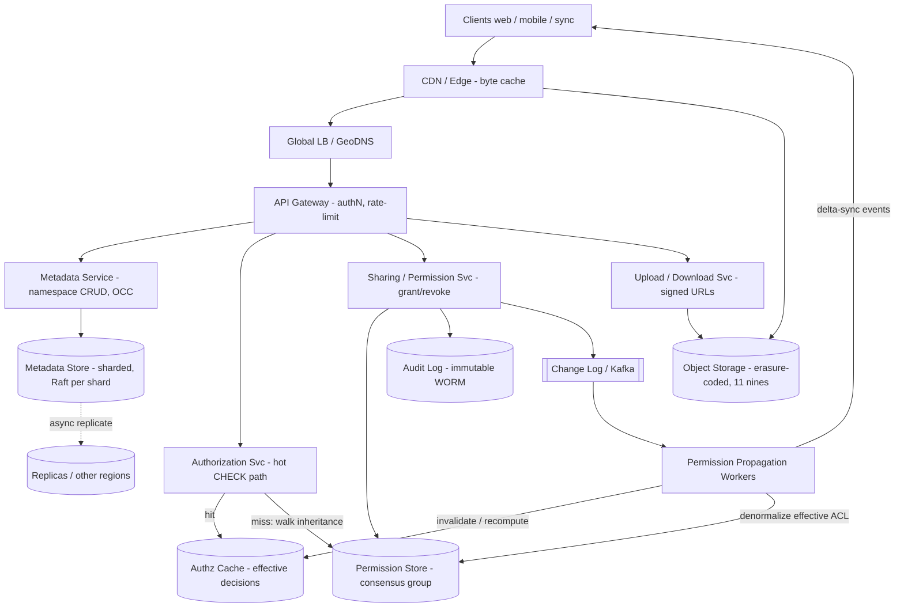

# B08 — Design a file storage + permission system (billions of files)

This question tests whether you can run a **stateful, consistency-critical** system at planetary scale: a metadata plane over a billions-of-objects namespace, a fine-grained authorization model, and the hard part — **propagating permission changes correctly and fast under heavy concurrent mutation**. Google asks it because Drive, Cloud Storage IAM, and internal blob stores all live or die on exactly this: getting durability, an explicit consistency model, and authorization-at-scale right at the same time. It is a "show me you've actually built this" problem, not a whiteboard toy.

## Lead with this — your résumé hook

"I've built almost exactly this. I owned a file-storage service backing **billions of files** with a separate metadata store over object storage, plus a **fine-grained permission engine** — per-user, per-group, per-resource ACLs with inherited permissions down a folder tree. The two things that made it Staff-hard were **permission propagation at scale** (a single share on a top-level folder can touch millions of descendants) and **concurrent mutation** — many writers racing on the same node — which I solved with **optimistic concurrency control and version vectors** rather than coarse locks. So I'll design from what I shipped, and call out where I'd change it for Google scale."

That framing earns the right to lead the round. I'll drive the design, not react to it.

## 1) Clarify — questions to ask the interviewer

- **Functional scope:** Are we designing the *storage* of bytes, the *metadata + permission* plane, or both? I'll assume both, but the crux and depth is the permission/metadata plane — bytes are "a solved blob store."
- **Permission granularity:** Per-file ACLs only, or **inherited** permissions down a folder hierarchy? Inheritance is the hard part — confirm it's in scope (I'll assume yes).
- **Permission model:** ACLs (subject -> resource -> rights) or **RBAC/ReBAC** (roles, relationship graph à la Google Zanzibar)? This drives the whole authz subsystem.
- **Sharing semantics:** Can you share with individual users, groups, "anyone with link," domain-wide? Do shares **propagate to existing descendants** or only future ones? (Propagation is the scale problem.)
- **Scale:** How many files (I'll assume **10^10 files**, ~**10^9 users**), avg files/user, files/folder fan-out, depth of tree?
- **Read/write mix:** I expect **read-heavy** — every file open is an authz check. What's the **authz-check QPS** vs the mutation rate? (Likely 100:1 or 1000:1 read:write.)
- **Latency target:** What p99 for an authz decision? Authz sits on the hot path of every read, so I'll target **single-digit ms p99**.
- **Consistency needs:** This is the key question. After I **revoke** access, how soon must it take effect everywhere — strongly consistent ("new ACL is the law immediately") or is bounded staleness OK? Security usually demands the revoke path be **strong/read-your-writes**; the grant path can tolerate slightly more.
- **Sync / offline:** Do clients cache files and sync (Drive-style)? That introduces conflict resolution and offline-edit reconciliation.
- **Durability / compliance:** Durability target (11 nines?), encryption-at-rest, audit log of every permission change, regional data-residency constraints?

**What the interviewer is signaling:** they want to see that you separate **bytes (object storage)** from **metadata/permissions (consistency-critical)**, that you have an opinion on the **consistency model of authorization** (the single most important design choice here), and that you understand **propagation cost** — a naive "rewrite ACL on every descendant" design melts at scale. Asking about revoke-latency vs grant-latency early signals you know where the bodies are buried.

## 2) Functional Requirements (FR)

**In-scope**

- Upload / download / delete files; create folders; move/rename (metadata ops).
- Hierarchical namespace (folders containing files/folders), billions of nodes.
- **Fine-grained permissions:** grant/revoke rights (read, write, comment, owner) to a user, a group, or a link, on any file or folder.
- **Inheritance:** a permission on a folder applies to all descendants unless overridden.
- **Effective-permission check:** `canAccess(user, file, right)` — the hot-path authz decision.
- **Concurrent mutation:** many clients editing metadata / sharing the same node simultaneously, resolved without lost updates.
- **Audit:** immutable log of every permission change (who granted what, when).

**Out-of-scope (defer)**

- Rich collaborative editing (OT/CRDT for live co-editing) — adjacent system.
- Full-text search over file *contents* (that's B14).
- Billing, quota enforcement specifics, virus scanning, DLP.
- Cross-org federation / external identity providers (mention, don't design).

## 3) Non-Functional Requirements (NFR)

| Dimension | Target & rationale |
|---|---|
| Scale | 10^10 files, 10^9 users; authz checks dominate at ~10^6 QPS peak; mutations far lower (~10^4 QPS). |
| p99 latency | Authz decision **< 5 ms** (it's on every read); metadata read **< 20 ms**; byte download bounded by object store + CDN. |
| Availability | **99.99%** for reads/authz (multi-region, active-active); writes can be slightly lower if we choose strong consistency. |
| Consistency | **Authorization is the special case:** revoke must be **read-your-writes / strong** (fail-closed); object metadata strongly consistent within a region via consensus; cross-region replication async with bounded staleness for the *grant* path. |
| Durability | **11 nines** for bytes (erasure-coded object store); metadata durable via replicated consensus log (e.g., Raft/Paxos group per shard). |
| Security | Encryption at rest + in transit; **fail-closed** authz (deny on uncertainty); full audit trail; least-privilege; defense against confused-deputy via capability tokens. |

## 4) Back-of-envelope estimation

```
Files:              1e10 files
Users:              1e9 users
Avg file metadata:  ~1 KB (id, parent, owner, name, blob ptr, ACL ref, version)
Metadata storage:   1e10 * 1 KB           = 1e13 B  = ~10 TB  (before replication)
   x3 replication + indexes               ≈ 30–50 TB  -> shard across ~100 nodes

ACL / share entries: assume avg 5 shares/shared file, 20% files shared
   shared files = 2e9 ; entries = 2e9 * 5 = 1e10 ACL rows  (~0.2 KB each) ≈ 2 TB

Authz QPS:  1e6 checks/s peak (every open + every list does checks)
   Target <5 ms p99  -> must be served from cache / denormalized "effective ACL",
   NOT a tree walk per request.

Mutation QPS: ~1e4 /s (uploads, renames, shares, revokes)
   Of which permission changes ~1e3 /s.

Propagation blast radius: a share on a top-level folder with 1e6 descendants
   = up to 1e6 nodes whose *effective* permission changes.
   At 1e3 share-ops/s, naive per-descendant rewrite = 1e9 writes/s -> impossible.
   => MUST NOT materialize permissions onto every descendant synchronously.

Bandwidth (bytes): avg object 1 MB, 1e5 downloads/s = 1e5 MB/s = 100 GB/s
   -> served from CDN/edge + object store, NOT the metadata plane.

Hot-set cache: cache effective-ACL for top 1% busiest nodes
   1e8 nodes * 0.3 KB = 30 GB -> fits in a distributed Redis tier.
```

The two numbers that decide the design: **10^6 authz QPS** (so checks must be O(1)-ish, served from a denormalized/cached form) and the **10^6 descendant blast radius** (so propagation must be lazy/asynchronous, never a synchronous fan-out write).

## 5) API design

```
# Object / metadata plane
PUT    /files                      {name, parentId, bytes|uploadUrl} -> {fileId, version}
GET    /files/{id}                 -> {metadata, downloadUrl}      # authz-checked
DELETE /files/{id}?ifVersion=V     -> 204 | 409 (version conflict)
POST   /files/{id}/move            {newParentId, ifVersion}        -> {version}
GET    /folders/{id}/children?cursor=...  -> paginated listing (authz-filtered)

# Permission plane
POST   /files/{id}/permissions     {subject, subjectType, right, inherit=true}
                                    Idempotency-Key: <uuid>        -> {aclId}
DELETE /files/{id}/permissions/{aclId}                            -> 204   # revoke
GET    /files/{id}/permissions     -> [{subject, right, inherited, source}]

# Hot-path authorization (internal, may be a sidecar / library call)
CHECK  authz.can(user, fileId, right) -> ALLOW | DENY            # <5ms, fail-closed
BATCHCHECK authz.canMany(user, [fileIds], right) -> {fileId: bool}  # for listings

# Sync (Drive-style clients)
GET    /changes?cursor=<token>     -> {changes[], newCursor}      # delta sync
```

Every mutating call carries either an **`ifVersion`** precondition (optimistic concurrency) or an **`Idempotency-Key`** (safe retries). Listings use `BATCHCHECK` so we filter visible children without N round-trips.

## 6) Architecture — request & data flow

THIS is the centerpiece. Two views follow: a detailed ASCII layered flow, then a tailored Mermaid flowchart.

### (a) ASCII layered block diagram

```
                     Clients (web / mobile / desktop-sync / API)
                                      |
                                      v
                          [ CDN / Edge ]  <— byte downloads served here (cached, signed URLs)
                                      |   (metadata/authz calls pass through)
                                      v
                        [ Global LB / GeoDNS ]   anycast, health-checked, routes to nearest region
                                      |
                                      v
                          [ API Gateway ]   authN (verify identity token), rate-limit, routing
                                      |
              +-----------------------+------------------------+----------------------+
              v                       v                        v                      v
     [ Metadata Service ]    [ Authorization Svc ]     [ Sharing/Perm Svc ]   [ Upload/Download Svc ]
       (namespace, CRUD)      (the hot CHECK path)       (grant/revoke)         (signs blob URLs)
        stateless, OCC         stateless, cache-first      stateless              stateless
              |                  |          |                 |                      |
              |  read/write      | hit      | miss            | write ACL            | put/get bytes
              v                  v          v                 v                      v
     [ Metadata Store ]   [ Authz Cache ]  |          [ Permission Store ]    [ Object Storage ]
      sharded by fileId    (Redis: effective|          (ACL rows + edges,      erasure-coded,
      consensus group       decisions, TTL  |           consensus group)        11 nines durable
      per shard (Raft)      + invalidation) |                 |                  (bytes only)
         |   |                              |                 |
         |   +--replicate--> [ read replicas / other regions ] (async, bounded staleness)
         |                                  |                 |
         |   on permission change:          |                 v
         |   emit invalidation + recompute  |        [ Change Log / Kafka ]  (append-only, durable)
         |          |                       |                 |
         |          +-----------------------+----> [ Permission Propagation Workers ]
         |                                                    |
         |                            lazily recompute/evict affected subtrees,
         |                            update denormalized effective-ACL & caches,
         |                            fan out delta-sync events to clients
         v
   [ Audit Log ]  (immutable, every grant/revoke, who/what/when — separate WORM store)
```

**Read path (open a file).** Client -> Edge/LB -> Gateway authenticates the identity token. Metadata Service loads the file's metadata (which shard via `hash(fileId)`). Before returning a download URL it calls **Authorization Svc: `can(user, fileId, READ)`**. Authz checks the **Authz Cache** first (effective decision keyed by `(user, fileId, right)`); on hit, < 1 ms. On miss it computes the effective permission — walk the **inheritance chain** (this node's ACL, then ancestors until an explicit grant/deny or the root), consulting the Permission Store / group-membership — caches the result with a TTL, and returns ALLOW/DENY. On ALLOW, Download Svc returns a **signed, short-TTL URL** and the bytes come from **CDN/Object Storage**, never through the metadata plane. **Fail-closed:** any uncertainty -> DENY.

**Write path (share / revoke).** Client -> Gateway -> **Sharing/Perm Svc**, which writes the ACL row to the **Permission Store** (a consensus group, so the write is durable + linearizable within the region) under an `ifVersion`/idempotency guard, and appends to the **Audit Log**. It then emits an event to the **Change Log (Kafka)**. **Permission Propagation Workers** consume it and do the expensive part *asynchronously*: invalidate cached effective-decisions for the affected subtree, recompute/denormalize where we keep a materialized form, and push **delta-sync** events so clients refresh. Crucially the *revoke* path **invalidates caches synchronously / fail-closed** (we'd rather wrongly deny than wrongly allow), while *grant* propagation may lag by seconds.

**Metadata write (rename/move/delete).** Optimistic: client sends `ifVersion=V`; Metadata Store does a **compare-and-set** on the version inside the shard's consensus group. If the stored version moved, return **409** and the client re-reads and retries. No locks held across the network.

### (b) Mermaid flowchart



## 7) Data model & storage choices

**Metadata Store — sharded KV with per-shard consensus (not a single SQL box).** Each file/folder is a node:

```
Node:  { fileId (PK), parentId, name, ownerId, type(file|folder),
         blobPtr, sizeBytes, version (monotonic), aclRef, createdAt, updatedAt }
Index: parentId -> [childIds]   (for listings; secondary index, same shard family)
```

Shard by `fileId` (hash) so writes to one node are local to one consensus group; reads are O(1) by id. *First-principles:* we need **strong consistency per object** (version CAS) but **horizontal scale to 10^10 nodes**, so a globally-coordinated SQL DB is wrong — instead, many independent **Raft/Paxos groups** (one per shard) give linearizable single-object ops with no global bottleneck. We accept that a cross-folder move spanning two shards needs a **2-phase commit / saga**, which is rare and acceptable.

**Permission Store — relationship/ACL store (Zanzibar-style).** Model permissions as **relation tuples**: `(object, relation, subject)`, e.g. `(file:42, viewer, user:7)` and `(folder:9, viewer, group:eng)`, plus **userset rewrites** for inheritance: a folder's `viewer` *implies* its children's `viewer`. This is exactly Google's **Zanzibar** model and the right first-principles answer: it turns "effective permission" into a **reachability query over a relationship graph** instead of copying ACLs onto every descendant. Tuples are stored in a sharded, consistency-versioned store; a **snapshot token ("zookie")** lets callers demand *"evaluate at least as fresh as my last write"* — that's how we get **read-your-writes on revoke** without globally synchronous reads.

**Object Storage — erasure-coded blob store** for the bytes (Reed-Solomon, e.g. 6+3), immutable content-addressed chunks, 11-nines durability, geo-replicated. The metadata plane only stores a **pointer**; the bytes never transit it.

**Audit Log — append-only WORM** (write-once) store, separate from the operational path, for compliance and forensic "who could access X on date D."

**Authz Cache — distributed in-memory (Redis-class)** holding **effective decisions** `(user,file,right)->ALLOW/DENY` and resolved group memberships, with TTL + **explicit invalidation** driven by the Change Log.

## 8) Deep dive

The crux is **(A) effective-permission evaluation + propagation at scale** and **(B) concurrent mutation safety.** These are the two things the question is really testing.

**A. Permissions: evaluate lazily, never materialize eagerly.** A naive design stores an ACL on every node and, on a folder share, rewrites all descendants — that's the 10^6-write blast radius that kills it. Instead:

- Store permissions as **relation tuples + inheritance rules** (Zanzibar). The *effective* permission for `(user, file, right)` is a **graph reachability** problem: starting at `file`, check its tuples and group memberships; if no explicit grant/deny, walk to `parentId` and repeat, honoring **closest-ancestor-wins** override semantics (an explicit deny on a sub-folder beats an inherited allow).
- **Bound the walk:** the tree is deep but not unbounded; cache the **effective decision** at each visited node so a hot subtree is answered from cache in O(1). We also keep a **materialized "leopard"-style index** (Zanzibar's term) of flattened group/parent reachability that's rebuilt asynchronously, so deep walks become a single lookup.
- **Propagation on change is lazy + async.** A share/revoke writes *one* tuple. Propagation Workers don't rewrite descendants — they **invalidate** the affected subtree's cached decisions and (optionally) refresh the materialized reachability index in the background. Cost is O(cache entries to evict), not O(descendants to rewrite).
- **Revoke is the dangerous direction.** We make revoke **fail-closed and fast-to-consistent**: the tuple delete is linearizable, and we *synchronously bump a version/zookie* so any subsequent check evaluated at the new snapshot can't see the stale grant. Grants can lag (a user waiting a few seconds for access is fine); revokes must not (a user retaining access after revoke is a security incident). This asymmetry is the Staff-level insight — **state it explicitly.**
- **Groups:** group membership is itself a relation (`group:eng member user:7`), so nested groups are the same reachability machinery. Membership changes propagate via the same invalidation path.

**B. Concurrent mutation: optimistic concurrency, not locks.** Many clients race on the same node (rename while sharing, two shares at once, move while deleting). Pessimistic locking across a distributed metadata plane would serialize and stall.

- **Optimistic Concurrency Control (OCC):** every node carries a monotonic **`version`**. A mutation is a **compare-and-set** inside the node's consensus group: `if stored.version == ifVersion: apply; version++ else: 409`. Linearizable per object, no held locks, no deadlocks.
- On **409**, the client re-reads, re-applies its intent, retries — standard read-modify-write loop. For sync clients (offline edits), conflicts surface as **conflict copies** (Drive-style "filename (conflicted copy)") rather than silent last-writer-wins, preserving user intent.
- **Version vectors for sync:** desktop clients maintain a vector to detect *concurrent* vs *causally-later* edits, so reconciliation distinguishes "stale client" (re-sync) from "genuine conflict" (surface to user).
- **Permission writes are idempotent:** `Idempotency-Key` makes a retried "share with Bob" a no-op rather than a duplicate tuple.
- **Cross-shard ops (move across folders on different shards):** use a **saga / 2-phase commit** — detach in source shard, attach in target, both guarded by versions; a coordinator with a durable intent log makes it crash-safe. Rare enough that the latency cost is acceptable.

## 9) Key tradeoffs

| Decision | Choice & why |
|---|---|
| CAP for metadata | **CP within a region** — we pick consistency (version CAS, linearizable authz) over availability for writes; reads stay available via replicas. A storage system that loses writes or leaks access is worse than one that 503s a rare write. |
| Consistency model | **Asymmetric:** revoke = read-your-writes/strong (fail-closed); grant + listing freshness = bounded staleness. Encoded via **snapshot tokens (zookies)**. |
| Permission representation | **Relation tuples + lazy evaluation (Zanzibar)** over materialized per-node ACLs — turns O(descendants) propagation into O(1) tuple write + async cache invalidation. |
| Partitioning | **Hash by fileId**, one consensus group per shard — scales to 10^10 nodes, no global bottleneck; cost is cross-shard ops need sagas. |
| Concurrency | **OCC (version CAS)** over distributed locks — no deadlocks, no held locks across the network; cost is retry on conflict. |
| Replication | **Sync within region (Raft quorum, R+W>N)** for durability+linearizability; **async cross-region** for availability + latency, with bounded staleness. |
| Caching | Cache **effective decisions**, not raw tuples — but now correctness depends on **invalidation**; we drive it off the Change Log and accept short grant-staleness, never revoke-staleness. |
| Sync vs async | Authz **CHECK is sync** (hot path); **propagation is async** (the expensive fan-out). The whole design hinges on keeping the blast radius off the request path. |

## 10) Bottlenecks & failure modes

- **Hot node / hot partition:** a viral shared folder gets millions of authz checks. *Mitigation:* the **Authz Cache** absorbs reads (effective decision is the same for many users only when the subject matches — so we also cache *negative* results and per-group decisions); replicate the hot shard's read path; consider request coalescing.
- **Propagation blast radius (the signature failure):** sharing a top-of-tree folder. *Mitigation:* never materialize — lazy evaluation + async invalidation; rate-limit/queue giant subtree invalidations and process them in priority order (revokes before grants).
- **Thundering herd on cache miss / cold start:** a hot key expires and 10^4 requests stampede the Permission Store. *Mitigation:* **request coalescing (single-flight)**, soft-TTL + async refresh, jittered expiry.
- **Stale-allow after revoke (security SPOF):** a cache somewhere still says ALLOW. *Mitigation:* **fail-closed**, snapshot-token (zookie) so checks evaluate at >= revoke version, short TTLs on positive decisions, synchronous invalidation on the revoke path.
- **Consensus group unavailable (shard down):** that slice of the namespace can't take writes. *Mitigation:* multi-region replicas can serve reads; writes fail fast (CP); auto-failover the Raft leader; keep shards small so blast radius of one group is bounded.
- **Cross-shard saga stuck mid-move:** node visible in two places or neither. *Mitigation:* durable intent log + idempotent compensation; reconciler sweeps and resolves; default to **fail-closed** visibility while ambiguous.
- **Object store unavailable:** bytes can't be fetched. *Mitigation:* CDN serves cached objects; multi-region erasure-coded replicas; metadata plane stays up so the namespace is browsable.

## 11) Scale 10x / evolution

- **First thing that breaks: the inheritance walk** as trees get deeper/wider and the authz QPS 10×'s. *Evolve:* invest harder in the **materialized reachability index** (Leopard-style), rebuilt incrementally off the Change Log, so deep walks collapse to a single lookup; push the Authz check into a **co-located sidecar/library** at the service so it's a local call, not a network hop.
- **Permission Store write throughput** (more shares/revokes). *Evolve:* finer sharding of the tuple store; batch invalidations; separate the *grant* and *revoke* pipelines so revoke latency stays flat under grant load.
- **Cross-region consistency cost** rises with more regions. *Evolve:* pin each object's "home region" (authoritative consensus group) and serve remote regions from bounded-stale replicas + zookie reads; only the home region accepts writes.
- **Metadata at 10^11 nodes:** add shards (consistent hashing keeps reshard cheap); the per-shard-consensus design scales horizontally by design — that was the point of avoiding one global DB.
- **Sync fan-out** (more desktop clients): move delta-sync to a pub/sub fan-out tier with per-user change cursors; coalesce bursts.

## 12) Interviewer probes & follow-ups

- **"How do you make a revoke take effect immediately everywhere?"** Tuple delete is linearizable; bump a snapshot token; subsequent checks demand evaluation at >= that token (zookie); positive caches have short TTL + are explicitly invalidated; everything is **fail-closed**. Grant can lag, revoke cannot — that asymmetry is deliberate.
- **"Why not store the ACL on every file and copy it down on share?"** The blast radius — a top-level share touches up to 10^6 descendants; at 10^3 shares/s that's 10^9 writes/s. Lazy evaluation over relation tuples makes a share **one write**.
- **"Two users rename the same file at once — what happens?"** OCC: both send `ifVersion=V`; the consensus group does compare-and-set; one wins (version++), the other gets **409**, re-reads, retries. No lock, no lost update.
- **"How do nested groups / 'anyone in domain' work?"** Group membership is itself a relation tuple; effective check is the same graph reachability; domain/link shares are special subjects. Membership changes flow through the same async invalidation.
- **"Consistency of the *byte* vs the *metadata*?"** Bytes are immutable, content-addressed, erasure-coded (durability problem). Metadata is mutable and linearizable per object (consistency problem). Splitting them lets each use the right model.
- **"What if the Authz Cache is down?"** Fall back to evaluating against the Permission Store directly (slower but correct); fail-closed if even that is unreachable. Never fail-open.
- **"How do you audit who *could* have accessed a file last Tuesday?"** Immutable audit log of tuple changes + versioned snapshots lets you reconstruct the effective ACL at any point in time.

## 13) 60-minute flow cheat-sheet

| Time | What to do |
|---|---|
| 0–2 min | Open with the **résumé hook** — "I built billions-of-files storage + a permission engine; here's how I'd design it for Google." |
| 2–8 min | **Clarify:** both planes? inheritance? revoke-latency vs grant-latency? scale (10^10 files, 10^9 users)? read:write mix? Lock the consistency requirement on authz. |
| 8–12 min | **FR + NFR + estimation:** surface the two killer numbers — 10^6 authz QPS and 10^6 descendant blast radius. |
| 12–18 min | **API + high-level architecture:** draw the ASCII layered flow; split bytes (object store) from metadata/permissions (consistency-critical). |
| 18–22 min | Walk the **read path** (authz on hot path, cache-first, fail-closed) and **write path** (share -> tuple write -> async propagation). |
| 22–40 min | **Deep dive (the crux):** (A) lazy permission evaluation over relation tuples + async invalidation — never materialize; (B) OCC/version CAS for concurrent mutation, conflict copies for sync. Spend the most time here. |
| 40–48 min | **Tradeoffs + consistency:** CP per region, asymmetric revoke/grant consistency, zookies, sharded consensus groups. |
| 48–54 min | **Bottlenecks/failure:** propagation blast radius, stale-allow-after-revoke (fail-closed), hot keys, thundering herd. |
| 54–60 min | **10× evolution + wrap:** materialized reachability index, home-region writes, finer sharding. Restate the one big idea: **bytes are a durability problem, permissions are a consistency problem — design them separately, and never put the propagation fan-out on the request path.** |
