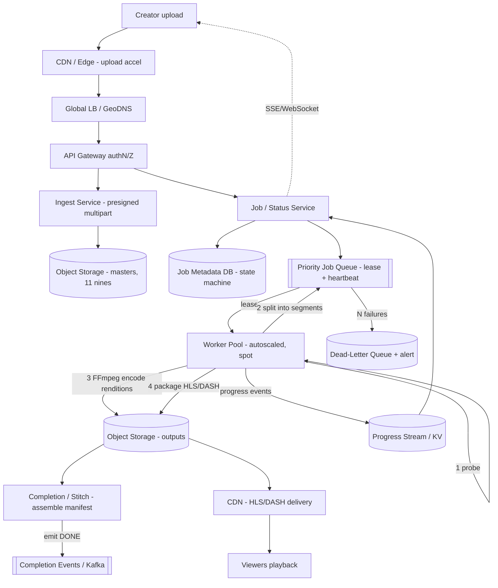

# B09 — Design a video / media transcoding pipeline

This tests whether you can own a **distributed, asynchronous, compute-heavy pipeline** end to end: ingest large media, fan it into a queue, run a horizontally-scaled worker pool that shells out to FFmpeg across multiple encoding ladders, and guarantee every job finishes **exactly-once-effectively** despite worker crashes, retries, and bursty load — with progress tracking and safe rolling deploys. Google asks it because it exercises queueing, idempotency, autoscaling, backpressure, and operational maturity (health checks, rolling deploys) all at once — the operational-excellence signal that separates Staff from L5.

## Lead with this — your résumé hook

"I built and owned exactly this — **Mango-Transcoder**, a distributed FFmpeg-based media transcoding pipeline running on **ECS Fargate**. I owned the whole thing: the **job queue**, an **autoscaling worker pool** that shells out to FFmpeg across multiple output renditions, **retries with idempotency** so a crashed worker never produces duplicate or corrupt output, **progress tracking**, and **rolling deploys with health checks** so I could ship the worker image without dropping in-flight jobs. So I'll design this from production scars, not theory, and point out exactly where the sharp edges were — idempotency on retry and draining workers during deploys."

That establishes first-hand ownership of a *distributed pipeline* — the exact Staff signal this question probes.

## 1) Clarify — questions to ask the interviewer

- **Input scope:** User-uploaded video only, or also audio/images? Source formats and max size/duration (a 4-hour 4K master is a very different job from a 30-second clip)?
- **Output ladder:** What renditions/codecs — an **adaptive bitrate (ABR) ladder** (e.g. 240p/480p/720p/1080p/4K in H.264 + maybe AV1) packaged as HLS/DASH? Thumbnails, captions, audio normalization? This defines the per-job fan-out.
- **Latency / SLA:** Is this **VOD** (upload now, watch later — minutes-to-hours is fine) or **near-real-time** (live/clip, seconds)? I'll assume VOD with a target like "720p ready in < N minutes, full ladder shortly after." Hugely changes the architecture.
- **Scale:** Uploads/day, average + peak (do creators all upload at 6pm?), average duration. I'll assume **~10^5–10^6 uploads/day**, bursty.
- **Prioritization:** Are some jobs more urgent (a paying creator, a "premiere" scheduled in 10 min) than others? Do we need **multiple priority classes** and fairness across tenants?
- **Cost sensitivity:** Transcoding is CPU/GPU-heavy and expensive. Is cost a first-class constraint (spot/preemptible instances, GPU vs CPU encode)? Usually yes.
- **Correctness bar:** Is a duplicate or partial output catastrophic (it is — a half-encoded video that plays then cuts out). Confirm we need **idempotent, exactly-once-effective** completion.
- **Durability:** Where do source masters and outputs live, retention, multi-region for playback?
- **Progress:** Do end-users see a live progress bar / status, or just "ready"? Drives whether we need fine-grained progress events.

**What the interviewer is signaling:** they want **queue + worker-pool + autoscaling** as the backbone, and they're really probing **idempotency + retries** (what happens when a worker dies at 90%?), **backpressure** (the 6pm upload spike), and **operational maturity** (rolling deploys without dropping jobs, health checks, draining). Asking "VOD vs near-real-time" and "is a partial output catastrophic" early signals you know the failure surface. The deep dive will be the **transcode stages + idempotent retry** and **autoscaling/backpressure**.

## 2) Functional Requirements (FR)

**In-scope**

- Accept a media upload (large files, resumable/multipart) and persist the **source master**.
- Enqueue a **transcode job** describing the target ladder/profile.
- A **worker pool** pulls jobs, runs FFmpeg through staged transcode (probe -> segment -> encode renditions -> package -> thumbnail), writes outputs to storage.
- **Retries with idempotency** — a failed/abandoned job is retried without producing duplicate or partial outputs.
- **Prioritization** — multiple priority classes; urgent jobs jump the line; fairness across tenants.
- **Progress tracking** — per-job status (queued / running / % complete / done / failed) queryable and event-driven.
- **Autoscaling** the worker pool to load; **rolling deploys** of the worker image with **health checks** and **draining** so in-flight jobs aren't killed.
- Publish a **completion event** (and a manifest: HLS/DASH playlist + rendition URLs).

**Out-of-scope (defer)**

- The video **player / CDN delivery** detail (mention packaging + CDN, don't design the player).
- DRM/encryption specifics, watermarking, content moderation/ML classification (adjacent).
- Live streaming with sub-second latency (different beast — call out the difference).
- Recommendation/search over the catalog.

## 3) Non-Functional Requirements (NFR)

| Dimension | Target & rationale |
|---|---|
| Throughput | ~10^5–10^6 jobs/day, **bursty** (evening peaks 5–10× average); pipeline must absorb spikes via queue, not drop. |
| Latency (VOD) | First playable rendition (e.g. 720p) in **minutes**; full ABR ladder shortly after. Encoding is inherently ~real-time-ish per minute of video per core, so we parallelize by **segment**. |
| Availability | **99.9%+** for ingest + status APIs; the pipeline itself is async, so a worker outage delays (doesn't fail) jobs — graceful degradation. |
| Consistency | **Exactly-once-effective completion** — at-least-once delivery from the queue + **idempotent writes** keyed by job/segment id. Job state strongly consistent. |
| Durability | **11 nines** for source masters and outputs (object storage, erasure-coded). Never lose the master — everything else is recomputable from it. |
| Cost | First-class: use **spot/preemptible** workers + autoscale-to-zero on idle classes; GPU for heavy codecs where cheaper-per-frame. |
| Operability | **Zero-job-loss rolling deploys**, health checks, drain on shutdown, full per-job observability + retry visibility. |

## 4) Back-of-envelope estimation

```
Uploads:        5e5 /day  avg  -> ~6 /s avg ; peak 10x -> ~60 /s
Avg duration:   10 min video
Avg source:     10 min * ~10 Mbps = ~750 MB master
Storage (masters):  5e5/day * 750 MB = ~375 TB/day ingest
   keep 1 yr -> ~137 PB masters  (object store, erasure-coded)

Outputs (ABR ladder ~5 renditions, total ~1.5x master after compression mix):
   ~1.1 GB outputs/job -> 5e5 * 1.1 GB = ~550 TB/day outputs

Compute: encoding ~ real-time per rendition per core for H.264 (1x),
   5 renditions * 10 min = ~50 core-min/job IF serial.
   Parallelize by SEGMENTING the video (e.g. 6s segments => 100 segments)
   and encoding segments concurrently -> wall-clock minutes, not ~50 min.

   Daily encode work = 5e5 jobs * 50 core-min = 2.5e7 core-min/day
                     = ~4.2e5 core-hours/day = ~17,000 cores running 24/7 avg
   Peak 10x burst -> need autoscale headroom to ~tens of thousands of cores,
   then scale back down (cost!). Use spot + scale-to-near-zero off-peak.

Queue depth at peak: if arrivals 60/s and we can start 60/s, depth stays bounded;
   if encode capacity lags, queue buffers the spike (that's its job) ->
   size queue retention for hours of backlog.

Progress events: ~100 segments/job, a few events each -> ~1e8 progress events/day
   -> lightweight, write to a fast KV / stream, not the primary DB hot path.
```

The decisive insight: **encoding is embarrassingly parallel *if you segment the video first*** — so the architecture parallelizes one job across many workers by chunk, turning ~50 core-minutes of work into a few minutes of wall-clock. And capacity is **bursty and expensive**, so autoscaling + spot + scale-down dominate the cost story.

## 5) API design

```
# Ingest
POST /uploads                 -> {uploadId, multipartUrls[]}     # resumable, presigned
POST /uploads/{id}/complete   {parts[]} -> {mediaId}             # finalizes master in object store

# Submit a transcode job
POST /jobs                    {mediaId, profile|ladderId, priority, Idempotency-Key}
                              -> {jobId, status:QUEUED}

# Status / progress
GET  /jobs/{id}               -> {status, percent, renditions[], error?, attempts}
GET  /jobs/{id}/events        -> SSE/WebSocket stream of progress updates
GET  /media/{id}/manifest     -> HLS/DASH master playlist (when DONE)

# Internal worker protocol (queue-driven, not REST-first)
LEASE  queue.poll(workerId, leaseSec)   -> {jobId|segmentTask, attempt}
RENEW  queue.heartbeat(taskId)          -> extend lease (long encodes)
ACK    queue.complete(taskId, outputManifest)   # idempotent
NACK   queue.fail(taskId, reason)               -> retry or dead-letter

# Ops
GET  /healthz   -> readiness (worker drains: stop leasing, finish current, then exit)
```

`Idempotency-Key` on submit makes a retried "transcode this media" a no-op. The **lease + heartbeat** protocol (not fire-and-forget) is what makes crashed workers safe — an unrenewed lease expires and the task is redelivered.

## 6) Architecture — request & data flow

THE centerpiece. ASCII layered flow first, then a tailored Mermaid flowchart.

### (a) ASCII layered block diagram

```
                    Clients (creator upload / API)            Viewers (playback)
                              |                                       |
                              v                                       v
                    [ CDN / Edge ]  <— resumable upload accel       [ CDN ]  <- serves HLS/DASH segments
                              |                                       ^
                              v                                       |
                    [ Global LB / GeoDNS ]                            |
                              |                                       |
                              v                                       |
                    [ API Gateway ]  authN/Z, rate-limit             |
                    /            \                                    |
                   v              v                                   |
        [ Ingest Service ]   [ Job/Status Service ]                  |
          presigned multipart   create job, query progress           |
                |                    |                               |
   put master   v                    v  write job row                |
        [ Object Storage ]     [ Job Metadata DB ]                   |
         (masters, 11 nines)     (state machine, strongly consistent)|
                |                    |                               |
                |   submit job ->    v                               |
                |              [ Priority Job Queue ]  (multi-class, durable, visibility-timeout/lease)
                |                    |   pulls (lease + heartbeat)    |
                |                    v                               |
                |        +-----------------------------+            |
                |        |   Worker Pool (autoscaled)  |  ECS Fargate-style, stateless, spot-friendly
                |        |   each worker:              |            |
                |        |   1. PROBE (ffprobe)        |            |
                |        |   2. SPLIT into segments    |  --fan-out segment tasks back to queue-->
                |        |   3. ENCODE rendition(s)    |     (per-segment parallelism)            |
                |        |      (FFmpeg, per ladder)   |            |
                |        |   4. PACKAGE (HLS/DASH)     |            |
                |        |   5. THUMBS / captions      |            |
                |        +--------------+--------------+            |
                |                       | write outputs (idempotent, keyed by job+segment)
                |                       v                           |
                +--------------> [ Object Storage: outputs ] -------+ (renditions, manifests)
                                        |
                  progress events ->    v
                            [ Progress Stream / KV ]  --> Job/Status Service --> client SSE
                                        |
                  on all segments done: v
                            [ Completion / Stitch step ] -> assemble manifest -> emit DONE event (Kafka)
                                        |
                            failed task -> retry (backoff) -> N tries -> [ Dead-Letter Queue ] + alert
```

**Write/submit path.** Creator gets **presigned multipart URLs** from Ingest Service and uploads the **master** straight to **Object Storage** (bytes never transit our services). On `complete`, Ingest finalizes the master; the client (or Ingest) calls Job Service which writes a **job row** (state `QUEUED`) to the **Job Metadata DB** and enqueues onto the **Priority Job Queue** (with `Idempotency-Key` so retries don't double-submit).

**Processing path.** A **worker** leases a job (visibility-timeout/lease + heartbeat). It **probes** (ffprobe -> duration, codecs), **splits** the source into fixed-duration **segments**, and **fans those segment-encode tasks back onto the queue** so the whole pool encodes one job's chunks in parallel. Each segment task runs **FFmpeg** for its rendition(s), then writes its output to Object Storage **idempotently** — keyed by `(jobId, segmentIdx, rendition)`, so a redelivered task just overwrites the same deterministic object (no duplicates). Progress events stream to the **Progress Stream/KV**. When all segments for all renditions are done, a **completion/stitch step** assembles the **HLS/DASH manifest**, flips the job to `DONE`, and emits a completion event. Viewers later pull segments from the **CDN**.

**Failure path.** If a worker dies mid-encode, its **lease expires** and the queue **redelivers** the task to another worker — safe because writes are idempotent. Repeated failures hit a **retry budget** with exponential backoff, then land in a **dead-letter queue** with an alert (poison input, e.g. corrupt master). The master is never deleted, so any job is fully recomputable.

### (b) Mermaid flowchart



## 7) Data model & storage choices

**Job Metadata DB — a state machine in a strongly-consistent store** (sharded SQL or a consistent KV). One row per job, plus child rows per segment task:

```
Job:     { jobId (PK), mediaId, profile/ladderId, priority, tenantId,
           state(QUEUED|RUNNING|PARTIAL|DONE|FAILED), percent,
           attempts, idempotencyKey, createdAt, updatedAt }
SegTask: { jobId, segmentIdx, rendition, state, attempt, outputPtr, updatedAt }
```

*First-principles:* job state needs **strong consistency** and **conditional transitions** (only `RUNNING -> DONE` if all segments done; CAS on state to avoid two workers both "finishing"), so a transactional store beats eventual KV here. It's modest in size (one row per job), so a single sharded SQL/consistent-KV is fine — this is *coordination* data, not the bulk data.

**Object Storage — erasure-coded blob store** for the heavyweight bytes: **masters** (immutable, 11 nines — the source of truth everything is recomputable from) and **outputs** (renditions + manifests). Outputs are written at **deterministic, idempotent keys** `s3://.../{jobId}/{rendition}/{segIdx}.ts` so a retried task is an overwrite, not a duplicate. Geo-replicated for playback locality.

**Priority Job Queue — durable, multi-class queue with visibility-timeout/lease semantics** (Kafka with priority partitions, or SQS-class with separate queues per priority, or a purpose-built scheduler). *Why a queue and not direct dispatch:* it's the **shock absorber** for bursty load (the 6pm spike buffers here instead of dropping) and the substrate for **at-least-once + lease-based redelivery**, which is the backbone of crash-safety.

**Progress Stream / KV — fast write-optimized store** (Redis or a log/stream) for high-frequency `percent` updates, decoupled from the Job DB so progress chatter doesn't hammer the transactional store; the Status Service reads it and pushes SSE/WebSocket to clients.

**Dead-Letter Queue** — durable holding pen for poison jobs (corrupt input, repeatedly-failing encode), with alerting and a manual/automated reprocess path.

## 8) Deep dive

The crux is **(A) transcode stages + idempotent retry** (correctness under crashes) and **(B) autoscaling + backpressure + prioritization** (throughput and cost under bursty load), plus **(C) rolling deploys without dropping jobs** (operational maturity). Spend the most time on A and B.

**A. Transcode stages + idempotent, exactly-once-effective retry.**

- **Stages per job:** `PROBE (ffprobe)` -> `SPLIT into ~6s segments` -> `ENCODE each segment x each rendition (FFmpeg)` -> `PACKAGE (HLS/DASH manifest)` -> `THUMBS/captions/audio-normalize`. Splitting first is the key move: it **parallelizes one job across the whole pool** by chunk and makes each unit of work small (a few seconds of video), so a crash loses seconds of redo, not the whole encode.
- **Why segment-level idempotency:** the queue is **at-least-once** (lease expiry redelivers). To get **exactly-once *effect***, each segment task writes its output to a **deterministic key** derived from `(jobId, segmentIdx, rendition)`. Re-running it produces the **same bytes at the same key** — overwrite, not duplicate. Completion is decided by *"all expected output keys exist,"* not *"every task ran exactly once."* That's how you make at-least-once delivery yield exactly-once output.
- **Lease + heartbeat:** long encodes renew their lease periodically. If a worker hangs or dies, the lease expires and the task is redelivered. A **fencing token / attempt number** prevents a zombie worker (that wakes up after its lease expired) from clobbering the work of the worker that took over — the stitch step accepts only outputs from the current attempt.
- **Atomic completion:** the stitch step does a **CAS** on job state (`PARTIAL -> DONE` only if every segment+rendition output exists); two workers can't both "finish" the job. The completion event is emitted **after** the manifest is durably written, so downstream never sees a DONE without a playable manifest.
- **Poison handling:** bounded retries with exponential backoff + jitter; after N, route to **dead-letter** with diagnostics, alert a human, never silently drop. Because the master is retained, reprocessing is always possible.

**B. Autoscaling, backpressure, prioritization (throughput + cost).**

- **Scale on queue depth + age, not CPU.** The right signal is **backlog**: target a bounded queue depth / oldest-message-age. When backlog grows, add workers; when it drains, scale down toward zero for idle classes. (CPU-based autoscaling lags because encoding pegs CPU regardless of backlog.)
- **Backpressure:** the queue *is* the backpressure mechanism — the 6pm spike accumulates as depth and is worked off as capacity ramps, instead of overwhelming downstream. Ingest stays available (just enqueues); we cap concurrent jobs per tenant to prevent one creator monopolizing the pool.
- **Prioritization + fairness:** multiple priority classes (separate queues or weighted partitions). Workers drain high-priority first, but **weighted fair queuing** prevents starvation of low-priority and enforces **per-tenant fairness** so one tenant's 10,000-video bulk import doesn't block everyone. A "first-playable-rendition" fast lane can encode 720p ahead of the full ladder so users get *something* watchable fast.
- **Cost levers:** **spot/preemptible** workers (the pipeline already tolerates worker loss, so spot reclamation is just another lease expiry — a perfect fit); **GPU encode** for heavy codecs (AV1) where cheaper-per-frame; **scale-to-near-zero** off-peak; right-size worker instance to the rendition.

**C. Rolling deploys + health checks without dropping jobs (the operational signal).**

- Workers are **stateless** and **drain gracefully**: on `SIGTERM`/deploy, a worker **stops leasing new tasks**, finishes (or checkpoints) the current segment, ACKs it, then exits. `/healthz` reports *not-ready* during drain so the orchestrator stops routing.
- Because work is **lease-based and segment-sized**, a killed-too-soon worker just lets its lease expire and the task redelivers — **zero job loss** by construction. Rolling the worker image is safe: new workers pick up new leases; old ones drain.
- **Health checks** distinguish *liveness* (process up) from *readiness* (willing to take work); a wedged FFmpeg fails liveness and gets replaced. Canary a new worker image on a small fraction of the pool before full rollout; watch failure-rate/encode-time regressions.

## 9) Key tradeoffs

| Decision | Choice & why |
|---|---|
| Sync vs async | **Fully async pipeline** — ingest returns immediately, transcoding happens behind a queue. Encoding is minutes-long; blocking a request on it is a non-starter. |
| Delivery semantics | **At-least-once queue + idempotent writes = exactly-once *effect*.** Cheaper and more robust than trying to build exactly-once *delivery*. |
| Unit of work | **Segment-level** parallelism over whole-file jobs — smaller blast radius on crash, parallelizes one job across the pool, faster wall-clock. Cost: a stitch/coordination step. |
| Autoscale signal | **Queue depth/age** over CPU — tracks actual backlog, scales ahead of the spike. |
| Worker instances | **Spot/preemptible** over on-demand — pipeline already tolerates worker loss; ~70% cheaper. Cost: must handle reclamation (already do, via leases). |
| Queue tech | **Durable priority queue** (Kafka/SQS-class) over a DB-as-queue — purpose-built for visibility timeouts, redelivery, throughput; DB-as-queue contends with job state. |
| Job state store | **Strongly-consistent transactional store** over eventual KV — completion/transition correctness needs CAS; data volume is small. |
| Progress data | **Separate fast stream/KV** over the Job DB — high-frequency progress shouldn't hammer the transactional store. |
| First-playable | **Fast-lane 720p before full ladder** — better UX; cost is slightly more orchestration. |

## 10) Bottlenecks & failure modes

- **Worker crash mid-encode (the signature case):** *Mitigation:* lease expiry + redelivery + idempotent segment writes -> the task just re-runs; only seconds of work lost. Fencing tokens stop zombie workers from clobbering.
- **Bursty upload spike (6pm thundering herd):** *Mitigation:* the queue absorbs it (backpressure); autoscale on depth; per-tenant concurrency caps; ingest stays available because it only enqueues.
- **Hot/huge job (a 4-hour 4K master):** would hog one worker for hours. *Mitigation:* segment-split distributes it across many workers; cap per-segment size; first-playable fast lane.
- **Poison input (corrupt/unsupported media):** infinite retry loop. *Mitigation:* bounded retries + exponential backoff -> dead-letter + alert; validate at probe stage and fail fast with a clear error.
- **Stitch/coordination SPOF:** the completion step decides DONE. *Mitigation:* make it stateless + idempotent (recomputes from "which output keys exist"), CAS the final transition, run multiple instances.
- **Queue/broker failure:** pipeline stalls. *Mitigation:* replicated, durable queue (quorum); masters retained so nothing is lost; jobs resume from persisted state when broker recovers.
- **Object-store throttling under burst writes:** many segments writing at once. *Mitigation:* key-prefix sharding to spread partitions, ret/backoff, batch small outputs.
- **Cost blowout from over-scaling:** *Mitigation:* scale-down policy + scale-to-near-zero off-peak; spot; cap max pool size.

## 11) Scale 10x / evolution

- **First thing that breaks: encode capacity + cost** at 10× uploads. *Evolve:* push **GPU/hardware encode** for the heavy renditions, smarter codec choice (AV1/SVT for bitrate savings), and **per-title encoding** (analyze content complexity, don't over-spend bits on simple scenes) to cut both compute and storage.
- **Queue throughput / fan-out** at 10× segment tasks. *Evolve:* partition queues per priority/tenant/region; shard the broker; consider a hierarchical scheduler.
- **Job DB write rate** (more state transitions/progress). *Evolve:* keep progress entirely off the transactional store (already do); shard job state by `jobId`; archive completed jobs.
- **Multi-region:** run pipelines per region near where content is uploaded/consumed; replicate masters async; viewers always hit nearest CDN edge.
- **Smarter scheduling:** bin-pack jobs to instance types, predictive autoscaling off historical upload curves (pre-warm before the evening spike), spot-diversification across instance pools to dodge mass reclamation.

## 12) Interviewer probes & follow-ups

- **"A worker dies at 90% of a 1-hour encode — what happens?"** Only the *current segment* is lost (work is segmented). Its lease expires, the segment task redelivers to another worker, which writes to the same deterministic key. The other 99 segments are already durably stored. Net: seconds of redo, exactly-once output.
- **"How do you guarantee no duplicate/partial output if the queue is at-least-once?"** Idempotent writes at deterministic keys + completion decided by "all expected output keys exist" + CAS on the final state transition. At-least-once *delivery* becomes exactly-once *effect*.
- **"6pm everyone uploads at once — how don't you fall over?"** The queue is the shock absorber (backpressure); ingest only enqueues so it stays up; autoscale on queue depth ramps workers; per-tenant caps keep it fair. The spike becomes latency, not failure.
- **"How do you deploy a new worker version without dropping in-flight jobs?"** Stateless workers drain on SIGTERM (stop leasing, finish current segment, ACK, exit); `/healthz` goes not-ready; lease-based work means anything killed too early just redelivers. Canary first.
- **"How do you keep urgent jobs ahead without starving the rest?"** Priority classes + **weighted fair queuing** + per-tenant fairness; a first-playable fast lane for the most-watched rendition.
- **"Why segment the video instead of encoding the whole file on one worker?"** Parallelism (one job across the pool -> minutes not ~50 min), smaller crash blast radius, and better load distribution for huge masters. Cost is a stitch step.
- **"Spot instances get reclaimed constantly — isn't that a problem?"** No — reclamation is just another lease expiry, which the pipeline already handles. That's *why* spot is a great fit and a big cost win.

## 13) 60-minute flow cheat-sheet

| Time | What to do |
|---|---|
| 0–2 min | Open with the **résumé hook** — "I built Mango-Transcoder, an FFmpeg pipeline on ECS Fargate; here's how I'd design it." |
| 2–8 min | **Clarify:** VOD vs near-real-time? output ladder? scale + burstiness? prioritization? is partial output catastrophic (yes -> idempotency)? cost a constraint? |
| 8–12 min | **FR + NFR + estimation:** surface the two insights — encoding is parallel *if you segment first*, and load is bursty + expensive (autoscale + spot). |
| 12–18 min | **API + high-level architecture:** draw the ASCII flow — ingest (presigned), queue, autoscaled worker pool, object storage, completion event. Bytes bypass services. |
| 18–22 min | Walk the **submit path** and **processing path** (probe -> split -> encode segments -> package), and the **failure path** (lease expiry -> redelivery). |
| 22–42 min | **Deep dive (the crux):** (A) transcode stages + idempotent exactly-once-effect retry (deterministic keys, lease+heartbeat, fencing, CAS completion); (B) autoscaling on queue-depth + backpressure + prioritization + spot. Most time here. |
| 42–48 min | **Operational maturity:** rolling deploys with drain + health checks, zero job loss by construction. (This is the Staff signal — don't skip it.) |
| 48–54 min | **Tradeoffs + bottlenecks:** at-least-once+idempotent, segment-level work, hot/huge jobs, poison inputs -> dead-letter, cost blowout. |
| 54–60 min | **10× evolution + wrap:** GPU/per-title encoding, partitioned queues, multi-region, predictive autoscaling. Restate the big idea: **segment the work, make every unit idempotent at a deterministic key, let the queue absorb bursts, and design workers to be killable so spot + rolling deploys are free.** |
