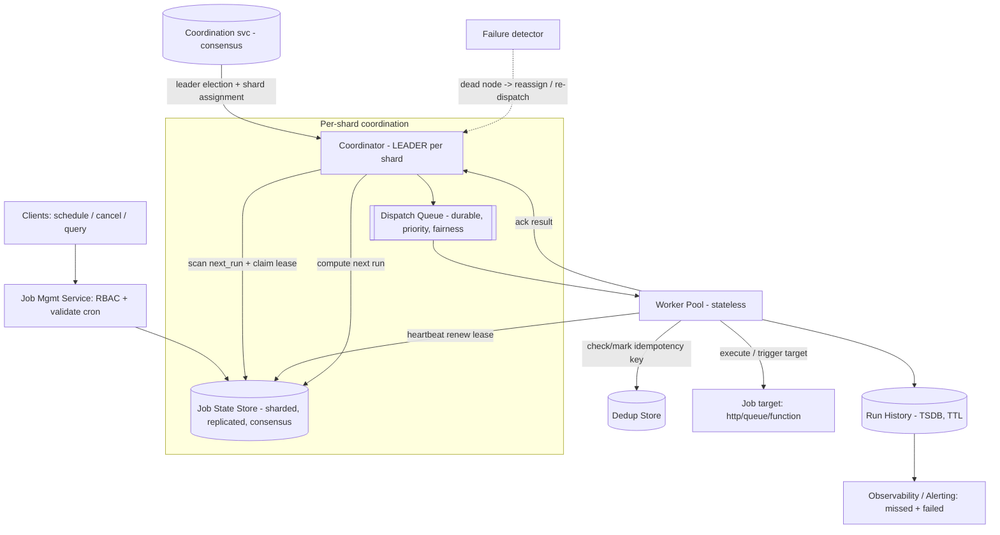

# B10 — Design a distributed job scheduler

Design the system that reliably runs jobs at the right time across a fleet — cron-style recurring jobs, one-shot delayed tasks, and triggered background work — at the scale of millions of jobs, with no missed or duplicated runs despite machine failures. It tests distributed-systems fundamentals head-on: **leader election**, **sharding of jobs**, **cron-at-scale**, **exactly-once vs at-least-once**, fault tolerance / re-assignment, backpressure, priority, and observability. Google asks it because scheduling underpins everything (builds, tests, batch pipelines, background work) and it forces you to confront the hardest distributed-systems tradeoffs explicitly — a canonical L6 prompt and a DevEx staple (build/test orchestration).

## (Section B only) Lead with this — your résumé hook

"I've built distributed systems and event-driven background processing, so a job scheduler is right in my lane — and I know the two questions that actually decide the design are 'how do we guarantee a job fires once and only once across machine failures?' and 'how do we scale to millions of timers without a single coordinator becoming the bottleneck?'. I'll design it around a **sharded, replicated, durable job store** with **leader-elected coordinators per shard** dispatching to a **stateless worker pool**, and I'll be explicit that the honest contract is **at-least-once delivery with idempotent execution** for effective exactly-once. I'll spend my depth budget on the timing-wheel + dispatch mechanism and on the exactly-once / fault-tolerance story, because that's where schedulers are won or lost."

## 1) Clarify — questions to ask the interviewer

- **Job types:** Recurring cron jobs, one-shot delayed tasks ("run in 30 min"), and/or event-triggered jobs? Each has a different timing mechanism. (I'll assume all three.)
- **Timing precision:** Must a job fire within seconds of its scheduled time, or is minute-level drift acceptable? Sub-second precision at scale is a very different (and harder) problem.
- **Scale:** How many scheduled jobs total, and peak dispatches/sec? Millions of jobs with bursty fire times (e.g. everyone schedules "midnight") drives the sharding and backpressure design.
- **Delivery semantics:** Is the requirement **at-least-once** (may double-run, handlers must be idempotent) or **exactly-once** (never double-run)? This is THE question — true exactly-once is impossible across failures; I'll push for at-least-once + idempotency.
- **Execution model:** Does the scheduler *run* the job (owns workers) or just *trigger* an external service/queue? Affects whether I design a worker pool or a dispatch-to-queue contract.
- **Job duration:** Milliseconds, or long-running (minutes/hours)? Long jobs need lease renewal / heartbeating, not fire-and-forget.
- **Priority / fairness:** Are some jobs higher priority? Must one tenant not starve another (multi-tenant fairness)? Drives priority queues and quotas.
- **Failure policy:** On a failed run — retry with backoff? Max attempts? Dead-letter? And on a missed window (system down through a scheduled time) — skip, or backfill/catch-up?
- **Consistency vs availability:** If we can't be sure a job ran (e.g. coordinator crashed mid-dispatch), do we prefer to **risk a duplicate** (at-least-once) or **risk a miss** (at-most-once)? Usually duplicate-with-idempotency.
- **Observability needs:** Do users need run history, audit, alerting on missed/failed jobs, and the ability to query "did job X run"? This is a hard requirement for a platform.

**What the interviewer is signaling:** The exactly-once question is the centerpiece — they want you to *know* that true exactly-once delivery is impossible in a distributed system and to land on **at-least-once + idempotent execution (dedup keys)** as the pragmatic contract. The "single coordinator" trap is the other tell: they want **sharded jobs with per-shard leader election**, not one global scheduler. Asking about missed-window backfill and lease renewal for long jobs signals you've operated such systems, not just read about them.

## 2) Functional Requirements (FR)

**In scope:**
- **Schedule jobs:** recurring cron expressions, one-shot delayed jobs, and event-triggered jobs.
- **Reliable dispatch at the scheduled time** (within the precision SLO), at scale (millions of jobs).
- **Exactly-once-effect execution:** at-least-once delivery + idempotency so a job's *effect* happens once.
- **Fault tolerance / re-assignment:** if a coordinator or worker dies, its jobs are reliably picked up — no lost schedules.
- **Leader election + sharding:** partition jobs across coordinators; each shard has a leader; no single global scheduler.
- **Retries + failure policy:** retry with backoff, max attempts, dead-letter; missed-window catch-up policy.
- **Backpressure:** absorb fire-time bursts without overrunning downstream/workers.
- **Priority + fairness:** higher-priority jobs first; per-tenant fairness/quotas.
- **Observability:** run history, status, audit, alerting on missed/failed jobs.

**Out of scope (defer):**
- The actual business logic of jobs (we dispatch/trigger; handlers are user code).
- A full workflow/DAG engine with inter-job dependencies (I'll note the extension; this is a *scheduler*, not an orchestrator).
- Resource scheduling / bin-packing of containers (assume a worker/compute pool exists).
- Long-term log warehousing internals.
- Authn/identity internals (assume RBAC exists).

## 3) Non-Functional Requirements (NFR)

| Dimension | Target & rationale |
|---|---|
| Scale | ~50M scheduled jobs; peak **~100k dispatches/sec** (bursty — midnight/top-of-hour spikes). Worker fleet sized to absorb bursts. |
| Timing precision | **Fire within ~1-5 s of scheduled time at p99.** Tight enough for orchestration; not a hard-real-time system. |
| Availability | **99.99%** for the scheduling control plane. A scheduler that's down means missed jobs across the org — Tier-1. Must survive node and zone failures. |
| Consistency | **Job state strongly consistent** (a job's "next run" / lease must not be ambiguous → use consensus/quorum). **Delivery: at-least-once**; execution effect: exactly-once via idempotency. |
| Durability | Job definitions + schedule state + run history: **durable + replicated** (a lost schedule = a silently missed job, unacceptable). |
| Throughput | Sustain burst dispatch without dropping jobs; degrade by *delaying* low-priority work, never by losing it. |
| Security | RBAC on job CRUD; tenant isolation; per-tenant quotas to prevent noisy-neighbor; audit of every run. |

## 4) Back-of-envelope estimation

```
JOBS & DISPATCH
  Total scheduled jobs          ~50,000,000
  Avg fire rate (uniform)       if each runs ~1/hour -> 50M/3600 ~ 14,000/sec
  BUT bursty: top-of-hour/midnight spikes
    say 30% fire within the same minute window -> 15M / 60s = 250,000/sec PEAK
  Design dispatch target        ~100,000 - 250,000 dispatches/sec (peak)

SHARDING
  Coordinators                  shard jobs across, say, ~256 shards
  Jobs per shard                50M / 256 ~ 195,000 jobs/shard
  Dispatches/shard at peak      250k / 256 ~ ~1,000/sec/shard  (very manageable)
  => sharding turns an impossible single-node problem into easy per-shard work.

JOB STATE STORE
  Per job record                ~1 KB (cron expr, next_run, payload ref, state)
  50M * 1KB                     ~50 GB job metadata (replicated 3x -> 150 GB)
  Time-indexed structure        next_run index for "what fires in the next minute"

RUN HISTORY (observability)
  Runs/day                      ~50M jobs * ~24 runs/day(avg) = ~1.2e9 runs/day
  ~1.2e9 / 86400                ~14,000 run records/sec (more at bursts)
  Per record ~500 bytes         ~7 MB/sec -> ~600 GB/day -> TSDB/warehouse, TTL'd

WORKER FLEET
  Peak dispatch 250k/sec, avg job ~5s wall
    in-flight = 250k * 5 = ~1.25M concurrent executions at peak
    at ~100 jobs/worker host -> ~12,500 workers at peak (autoscaled down off-peak)
  (If scheduler only TRIGGERS a queue, this fleet is the downstream's problem.)

QUEUE / BACKPRESSURE BUFFER
  Burst of 250k/sec into a durable queue smooths to worker drain rate.
  Buffer a few minutes of peak: 250k * 60 * ~1KB ~ 15 GB queue depth -> fine.
```

The key insight the math reveals: a **single coordinator can't dispatch 250k/sec of bursty timers**, but **sharded across 256 coordinators it's ~1k/sec each** — trivial. And the burst is absorbed by a **durable queue + backpressure**, so workers drain at their own pace without dropping jobs. Storage is modest (~150 GB job state); run history is the high-volume, TTL'd stream.

## 5) API design

```
# Job management (control plane, RBAC-gated)
POST /v1/jobs
  { type: "cron"|"once"|"event",
    schedule: "0 */1 * * *" | run_at_ts | event_key,
    target: { kind:"http"|"queue"|"function", endpoint, payload },
    idempotency_key_template,        # how to derive a dedup key per run
    retry: { max_attempts, backoff }, priority, tenant }
  -> { job_id, next_run }

PUT    /v1/jobs/{job_id}            # update schedule/target
DELETE /v1/jobs/{job_id}           # cancel
POST   /v1/jobs/{job_id}:pause
POST   /v1/jobs/{job_id}:trigger   # manual one-off run

# Execution callback (worker -> scheduler) -- closing the loop
POST /v1/runs/{run_id}:ack    { status: succeeded|failed, attempt }
POST /v1/runs/{run_id}:heartbeat   # long jobs: renew lease, prevent re-dispatch

# Observability
GET /v1/jobs/{job_id}/runs          # run history (status, timing, attempts)
GET /v1/jobs?state=overdue          # missed / overdue jobs (alerting)
GET /v1/runs/{run_id}               # single run detail
```

Design notes: each run carries a **deterministic idempotency key** (e.g. `job_id + scheduled_fire_time`) so a duplicate dispatch is detected and the *effect* happens once. Long jobs **heartbeat** to renew their lease so the scheduler doesn't re-dispatch them as failed. The `:ack` closes the loop so the scheduler knows a run finished (vs the worker dying mid-run).

## 6) Architecture — request & data flow

### (a) ASCII layered diagram

```
   Clients (services, CLI, UI)  --- schedule / cancel / query jobs
                  |  POST /v1/jobs
                  v
        [ API Gateway / Job Mgmt Service ]      authN, RBAC, validate cron,
        - CRUD jobs, compute next_run            tenant quotas
                  |  write job + next_run
                  v
        [ Job State Store (sharded + replicated, consensus) ]
        - source of truth: job def, next_run, lease, state
        - time-indexed: "jobs due in the next window"
        - sharded by job_id hash; each shard = a replicated consensus group (R+W>N)
                  ^                          ^
        per-shard | ownership               | durable run records
                  |                          |
   +--------------+-------------+            |
   |  COORDINATORS (per shard)  |            |
   |  - LEADER ELECTION per     |            |
   |    shard (only the leader  |            |
   |    dispatches that shard)  |            |
   |  - TIMING WHEEL / due-poll: |           |
   |    scan next_run index,    |            |
   |    claim due jobs (lease)  |            |
   |  - enqueue dispatch        |            |
   +-------------+--------------+            |
                 |  due jobs (with dedup key + lease)
                 v                           |
        [ Dispatch Queue (durable, partitioned) ]   <-- BACKPRESSURE buffer,
        - priority lanes (hi/med/lo)                     smooths fire-time bursts
        - per-tenant fairness                            into worker drain rate
                 |  pull
                 v
        [ Worker Pool (stateless, autoscaled) ]
        - claim run (idempotency key)               <-- runs OR triggers target
        - check dedup store -> skip if already done
        - execute job / call target
        - HEARTBEAT (renew lease for long jobs)
        - ACK result back to scheduler
            |          |               |
   ack/state|          | heartbeat     | dedup check/mark
            v          v               v
        [ Job State ]  [ Lease/Heartbeat ]   [ Dedup Store (idempotency keys) ]
                 |
                 v
        [ Run History Store (TSDB/warehouse, TTL) ] --> [ Observability / Alerting ]
                                                         missed/overdue/failed jobs

   Cross-cutting:
   [ Coordination service (consensus) ]  leader election + shard assignment
   [ Failure detector ]  dead coordinator/worker -> reassign shard / re-dispatch lease
```

**Schedule path (write).** A client calls `POST /v1/jobs`; the **Job Management Service** validates the cron expression, enforces tenant quotas/RBAC, computes the first `next_run`, and writes the job to the **sharded, replicated Job State Store**. The store is partitioned by `job_id` hash; each shard is a **consensus group (quorum R+W>N)** so the job definition, `next_run`, and lease are strongly consistent — there is never ambiguity about a job's next fire time or who owns it.

**Dispatch path (the hot loop).** Each shard has **leader-elected coordinators**; only the leader for a shard dispatches that shard's jobs (this is how we avoid a single global scheduler *and* avoid two coordinators firing the same job). The leader runs a **timing wheel / due-poll**: it scans the time-indexed `next_run` index for jobs due in the imminent window, **claims** each due job by writing a short **lease** (atomically, via the consensus store), and enqueues a dispatch carrying the job's **deterministic idempotency key** (`job_id + scheduled_fire_time`). Dispatches flow into a **durable, partitioned queue** with **priority lanes** and **per-tenant fairness** — this queue is the **backpressure buffer** that absorbs the midnight burst and lets workers drain at their own rate. **Stateless workers** pull a dispatch, check the **dedup store** for the idempotency key (skip if already executed), run or trigger the target, **heartbeat** to renew the lease for long jobs, and **ack** the result. After a successful run the coordinator computes the *next* `next_run` (for cron jobs) and updates the store; a run record lands in the **Run History Store**.

**Failure / re-assignment path.** A **failure detector** + the **consensus coordination service** watch coordinators and workers. If a coordinator dies, its shards are **reassigned** to a new leader, which resumes dispatching from the durable `next_run` index — nothing is lost because state lives in the replicated store, not in the coordinator. If a worker dies mid-run, its **lease expires** (no heartbeat) and the coordinator **re-dispatches** the job; the dedup store guarantees that if the dead worker *had* already completed the effect, the retry is a no-op. This is precisely the at-least-once + idempotency contract.

**Why at-least-once, not true exactly-once.** Consider: a worker finishes the job but crashes before its ack reaches the scheduler. The scheduler can't tell "done-but-unacked" from "never-ran," so to avoid a *miss* it must re-dispatch — risking a duplicate. True exactly-once delivery across such failures is impossible; we make the *effect* exactly-once with the dedup store + idempotent handlers. State that explicitly — it's the crux.

### (b) Mermaid flowchart



## 7) Data model & storage choices

**Job definition + schedule state (source of truth).**
```
Job {
  job_id, tenant, type: cron|once|event,
  schedule: cron_expr | run_at | event_key,
  target: { kind, endpoint, payload_ref },
  next_run_ts,                  # time-indexed for due-scan
  lease: { owner, expires_at } | null,
  state: scheduled|dispatched|running|paused,
  retry_policy, priority, idempotency_template, version
}
```
Stored in a **sharded, replicated, strongly-consistent store** (quorum / consensus, R+W>N). Why strong consistency: the `next_run` and `lease` must be unambiguous — if two coordinators disagreed on whether a job is leased, we'd double-fire or miss. The defining requirement is *correct, durable, contended state*, which is a consensus problem (Raft/Paxos-style), not an eventual KV. Sharded by `job_id` hash so no shard is a bottleneck; **time-indexed on `next_run_ts`** so the due-scan is a cheap range read ("jobs due in the next minute") rather than a full scan of 50M jobs.

**Dispatch queue.** A **durable, partitioned log/queue** (commit-log semantics) with priority lanes. It's the backpressure buffer and must not lose messages (a lost dispatch = a missed job), so durability + replication, with at-least-once delivery to workers. Partitioned for throughput and per-tenant fairness.

**Dedup / idempotency store.** A **fast KV** keyed by idempotency key (`job_id + scheduled_fire_time`), recording "this run's effect already happened." Reads/writes on the hot execution path → low-latency LSM-tree KV with TTL (keys expire after the run window). This is what converts at-least-once delivery into exactly-once *effect*.

**Lease / heartbeat state.** Lives with the job state (lease fields) in the consensus store so it's strongly consistent — lease ownership is exactly the thing that must never be ambiguous. Heartbeats extend `expires_at`.

**Run history.** High-volume, append-only, time-series → **TSDB / columnar warehouse** with TTL. Powers run history queries and the observability/alerting layer (overdue/failed jobs). Decoupled from the hot path; write-heavy, analytics-read.

**Coordination / membership.** A **consensus-backed coordination service** (Raft/Paxos, e.g. a ZooKeeper/etcd-shaped component) for leader election per shard and shard-to-coordinator assignment — the one piece that genuinely needs distributed consensus for membership.

Justification theme: **strong consistency exactly where contention lives (job state, leases, leadership) via consensus**, a **durable queue for backpressure**, an **idempotency KV for exactly-once effect**, and an **append-only TSDB for history** — each store matched to its access pattern, with consensus reserved for the small, contended, correctness-critical core.

## 8) Deep dive

### Deep dive 1: Exactly-once vs at-least-once + fault tolerance (the crux)

This is the heart of the problem and the thing the interviewer most wants to probe.

- **True exactly-once delivery is impossible** across machine failures. The unavoidable scenario: a worker completes the job's effect, then crashes before its ack is durably recorded. The scheduler cannot distinguish "completed-but-unacked" from "never-started." It must choose: re-dispatch (risk a **duplicate**) or not (risk a **miss**). Schedulers almost always choose **at-least-once** (re-dispatch) because a silent miss is worse than a handled duplicate.
- **The pragmatic contract: at-least-once delivery + idempotent execution = exactly-once *effect*.** Each run carries a **deterministic idempotency key** (`job_id + scheduled_fire_time`). Before executing, the worker checks the **dedup store**; if the key is present, the effect already happened and it skips. This makes a re-dispatch a safe no-op. The handler (user code) must be idempotent, or use the dedup store as a guard — I'd make idempotency keys a first-class part of the API so this is the default, not an afterthought.
- **Leases prevent concurrent double-execution.** When a coordinator claims a due job it writes a **lease** (owner + expiry) atomically in the consensus store. Only the lease holder may run it. If the worker dies, the lease **expires** (no heartbeat) and the job is re-dispatched — combined with the dedup key, this gives "runs again if and only if it didn't already complete."
- **Long jobs heartbeat.** A job running for minutes renews its lease via heartbeat; if heartbeats stop, the coordinator assumes the worker died and re-dispatches. This avoids both premature re-dispatch (lease too short) and stuck jobs (worker died holding a lease forever).
- **Fault tolerance via stateless coordinators over durable state.** Coordinators hold *no* authoritative state — everything (next_run, lease) lives in the replicated store. So a dead coordinator's shards are simply **reassigned** to a new leader that resumes from the durable index; no schedule is lost. The consensus group survives node and zone loss (quorum). This separation — durable state in consensus, ephemeral compute in coordinators/workers — is what makes the whole thing fault-tolerant.
- **Missed-window backfill:** if the whole shard was down through a scheduled time, on recovery the coordinator sees `next_run < now` and applies the configured policy: **skip** (fire once for the latest), **catch-up** (fire each missed occurrence), or **fire-once-now**. Making this an explicit per-job policy is a Staff-level detail interviewers love.

### Deep dive 2: Cron-at-scale — timing wheel + sharded dispatch + backpressure

Scheduling millions of timers efficiently, and surviving the burst when many fire at once, is the second crux.

- **Don't scan 50M jobs every tick.** Maintain a **time-indexed `next_run`** structure so the due-scan is a range query: "give me jobs due in [now, now+Δ)." Per shard (~195k jobs), the imminent window is tiny. A **hierarchical timing wheel** is the classic structure — O(1) insertion and tick advancement, bucketing timers by expiry — far better than a per-job thread or a global sorted scan.
- **Sharding makes it tractable.** 250k dispatches/sec is impossible for one node but ~1k/sec per shard across 256 shards. Each shard's leader independently runs its timing wheel and dispatches its own jobs — horizontal scale with no global coordinator. Shard by `job_id` hash for even distribution; rebalance shards across coordinators as the fleet grows.
- **Backpressure absorbs the burst.** The pathological case is "everyone scheduled midnight." The coordinator enqueues due jobs into a **durable queue**; workers drain at their sustainable rate. The queue is the shock absorber — we **delay** low-priority work under load, never **drop** it. Per-tenant fairness and priority lanes ensure a flood of one tenant's jobs doesn't starve others or block high-priority work.
- **Avoid the thundering herd on the store.** Coordinators claim due jobs in **batches** (range read + batched lease writes) rather than one round-trip per job, so a burst is a handful of large operations, not 250k small ones.
- **Clock correctness:** dispatch decisions key off the scheduled time recorded in the store (and idempotency key), not each worker's wall clock, so clock skew can't cause double or missed semantics — skew only affects *precision*, which the SLO already tolerates (~1-5 s).

## 9) Key tradeoffs

| Decision | Option A | Option B | Choice & why |
|---|---|---|---|
| Delivery semantics | Exactly-once delivery | **At-least-once + idempotent effect** | **At-least-once.** True exactly-once delivery is impossible across failures; dedup keys make the *effect* exactly-once. Prefer a handled duplicate over a silent miss. |
| Coordination | Single global scheduler | **Sharded jobs + per-shard leader election** | **Sharded + leaders.** One scheduler can't do 250k/sec and is a SPOF; sharding gives scale + isolation, leaders prevent double-dispatch. |
| Job-state store | Eventual KV | **Consensus / quorum (R+W>N)** | **Consensus.** Leases and next_run are contended and must be unambiguous; eventual consistency would double-fire or miss. Cost: consensus latency on the small core. |
| Burst handling | Dispatch directly to workers | **Durable queue + backpressure** | **Queue.** Absorbs fire-time bursts, smooths to worker drain rate, never drops jobs; delay low-priority instead. |
| Coordinator state | Stateful coordinators | **Stateless coordinators over durable state** | **Stateless.** Dead coordinator → reassign shard, resume from durable index; no schedule lost. |
| Missed window | Always skip | **Configurable: skip / catch-up / fire-once** | **Configurable per job.** Different jobs need different semantics; making it explicit is correct + Staff-level. |
| Long jobs | Fixed timeout | **Lease + heartbeat renewal** | **Heartbeat.** Distinguishes a slow-but-alive job from a dead worker, avoiding premature re-dispatch or stuck leases. |
| Scheduler role | Owns + runs workers | **Trigger external (queue/http) by default** | **Trigger (with optional pool).** Decouples scheduling from execution; reuses existing compute; cleaner contract. |

## 10) Bottlenecks & failure modes

- **Fire-time burst / thundering herd (everyone scheduled midnight).** A spike to 250k/sec. *Mitigation:* durable queue + backpressure (delay low-priority, never drop), batched due-claim against the store, per-tenant fairness, and optional schedule jitter on creation to spread synchronized crons.
- **Hot shard / skewed jobs.** One tenant or one time bucket overloads a shard. *Mitigation:* hash-shard by job_id for even spread, per-tenant quotas, and dynamic shard rebalancing; split a hot shard's range.
- **Coordinator crash mid-dispatch.** Could lose in-flight dispatch decisions. *Mitigation:* dispatch decisions are durably leased in the consensus store *before* enqueue, so a new leader re-derives state from the store; nothing authoritative lived in the dead coordinator.
- **Worker crash mid-run (the exactly-once problem).** Done-but-unacked vs never-ran. *Mitigation:* lease expiry → re-dispatch + dedup key → effect happens once. At-least-once + idempotency, by design.
- **Coordination-service / consensus outage (SPOF risk).** Leader election and shard assignment depend on it. *Mitigation:* run it as a replicated consensus quorum across zones (survives minority loss); coordinators keep dispatching their currently-owned shards from the durable store even during a brief membership blip — degrade, don't stop.
- **Duplicate amplification.** Aggressive retries could storm a flaky target. *Mitigation:* exponential backoff + jitter, max attempts → dead-letter, and circuit-breaking per target so a failing endpoint doesn't get hammered.
- **Run-history store overload.** 14k+ records/sec. *Mitigation:* async write off the hot path, TTL old runs, sample/aggregate; history loss degrades observability, never scheduling.
- **Clock skew across nodes.** Could shift fire times. *Mitigation:* decisions key off the stored scheduled time + idempotency key, not local wall clocks; skew only affects precision (within SLO), not correctness.
- **Cascading failure from a slow downstream.** A slow target backs up workers → queue grows → other jobs delayed. *Mitigation:* per-target concurrency limits / bulkheads, timeouts, and priority isolation so one slow target can't starve the whole fleet.

## 11) Scale 10x / evolution

- **What breaks first: dispatch throughput + the consensus store's write rate** under bursts (500M jobs, ~2.5M dispatches/sec peak). *Evolve:* increase shard count (256 → thousands); each shard stays ~1k/sec. The consensus store is the contended core — partition it further (per-shard consensus groups) so no single group sees global write load.
- **Timing-wheel memory at 10x.** 500M timers across coordinators. *Evolve:* keep only the imminent window's timers in the in-memory wheel and the rest in the time-indexed store; page the next window in as time advances — bounded memory regardless of total job count.
- **Burst severity grows.** 10x synchronized crons at midnight. *Evolve:* push harder on jitter/spreading at schedule time, deeper queue buffering, and autoscaling workers ahead of known peaks; the queue + backpressure model already absorbs this — it just needs more buffer and workers.
- **Multi-region / global scheduling.** *Evolve:* shard jobs by region (a job is owned by one region's coordinators) to keep consensus local and low-latency; a global control plane for CRUD/visibility, regional dispatch. Avoid cross-region consensus on the hot path.
- **From scheduler to orchestrator.** Users will want job *dependencies* (run B after A). *Evolve:* layer a DAG/workflow engine on top that uses this scheduler as the timer/dispatch substrate — keep the core a scheduler, add orchestration as a separate layer (clean separation of concerns).
- **Observability at 10x.** Run history explodes. *Evolve:* sample + pre-aggregate, tiered storage, and surface SLO dashboards (missed-rate, dispatch-latency p99, duplicate-rate) — the metrics that prove the scheduler is healthy. This is the platform-governance angle.
- **Exactly-once pressure.** More handlers that can't be idempotent. *Evolve:* offer a built-in transactional dedup/outbox helper so even non-idempotent targets get effective exactly-once via the platform, lowering the correctness burden on every team.

## 12) Interviewer probes & follow-ups

- **"Can you guarantee exactly-once execution?"** Not exactly-once *delivery* — that's impossible across failures (a worker can finish then die before acking). I guarantee exactly-once *effect* via at-least-once delivery + a deterministic idempotency key (`job_id + fire_time`) checked against a dedup store, with idempotent handlers. A handled duplicate beats a silent miss.
- **"Why not one central scheduler?"** It can't sustain 250k dispatches/sec and is a SPOF. I shard jobs across ~256 shards (~1k/sec each) with **per-shard leader election** so exactly one coordinator dispatches each shard — scale and no double-fire.
- **"How does leader election work and what does it buy?"** A consensus-backed coordination service (Raft/Paxos-style) elects a leader per shard and assigns shards. Only the leader dispatches its shard, preventing two coordinators from firing the same job; on leader death, a new one is elected and resumes from durable state.
- **"A coordinator dies mid-dispatch — what's lost?"** Nothing authoritative. Leases and next_run live in the replicated store *before* enqueue; the new leader re-derives state and continues. Coordinators are stateless over durable state.
- **"A worker dies mid-run — duplicate or miss?"** Lease expires (no heartbeat) → re-dispatch, so no miss. The dedup key ensures that if the dead worker already completed the effect, the retry is a no-op — so no harmful duplicate either.
- **"How do you schedule millions of timers efficiently?"** Time-indexed next_run + a hierarchical **timing wheel** per shard (O(1) insert/tick), scanning only the imminent window — never a full scan of all jobs. Sharding keeps per-node load tiny.
- **"Everyone scheduled a job for midnight — what happens?"** Backpressure: coordinators enqueue due jobs into a durable queue; workers drain at their rate; low-priority work is delayed, never dropped. Plus optional jitter at schedule time to spread synchronized crons.
- **"The system was down through a scheduled time — then what?"** Per-job missed-window policy: skip, catch-up (fire each missed occurrence), or fire-once-now. Explicit and configurable.
- **"How do you keep retries from hammering a flaky target?"** Exponential backoff + jitter, max attempts → dead-letter, and per-target circuit breaking / concurrency limits (bulkheads) so one bad endpoint can't starve the fleet.
- **"What needs strong consistency and what can be eventual?"** Strong (consensus): job state, leases, leader assignment — the contended correctness core. Eventual/async: run history, metrics. Delivery is at-least-once with idempotent effect.
- **"How do you ensure fairness across tenants?"** Per-tenant quotas + fair-scheduling in the dispatch queue + priority lanes, so a noisy tenant can't monopolize workers or delay others' high-priority jobs.

## 13) 60-minute flow cheat-sheet

| Time | Phase | What to cover |
|---|---|---|
| 0-5 min | Clarify | Job types (cron/once/event), precision SLO, scale + burstiness, **at-least-once vs exactly-once** (the key question), run-vs-trigger, long jobs, missed-window policy. |
| 5-8 min | FR / NFR | Schedule + reliable dispatch, exactly-once effect, fault tolerance/reassignment, leader election + sharding, retries, backpressure, priority, observability. NFR: 99.99%, strong job-state consistency, at-least-once. |
| 8-13 min | Estimation | Single node can't do 250k/sec bursty → shard 256 ways → ~1k/sec each. ~150 GB job state; durable queue absorbs burst; run history the high-volume TTL'd stream. |
| 13-18 min | API + model | Idempotency key per run, heartbeat for long jobs, ack to close the loop. Stores: consensus job state / durable queue / dedup KV / TSDB history. |
| 18-32 min | Architecture (centerpiece) | Walk both diagrams: schedule → consensus job store; per-shard leader runs timing wheel → claims lease → durable queue (backpressure/priority) → stateless workers (dedup, heartbeat, ack); failure detector reassigns. Explicitly walk the done-but-unacked case. |
| 32-45 min | Deep dive | (1) Exactly-once *effect* via at-least-once + dedup keys + leases + heartbeats; stateless coordinators over durable state; missed-window backfill. (2) Timing wheel + sharded dispatch + backpressure for cron-at-scale. |
| 45-52 min | Tradeoffs + failures | At-least-once vs exactly-once, sharded leaders vs central, consensus vs eventual, queue backpressure. Fire-time burst, coordinator/worker crash, consensus outage, retry storms, clock skew. |
| 52-58 min | Scale 10x | Dispatch throughput + consensus write rate break first → more shards + per-shard consensus; paged timing wheel; regional sharding; layer a DAG orchestrator on top. |
| 58-60 min | Wrap | Restate: sharded replicated job store with per-shard leaders dispatching to stateless workers, at-least-once + idempotent effect, durable-queue backpressure — distributed-systems fundamentals end-to-end, tied to your event-driven background-processing work. |
