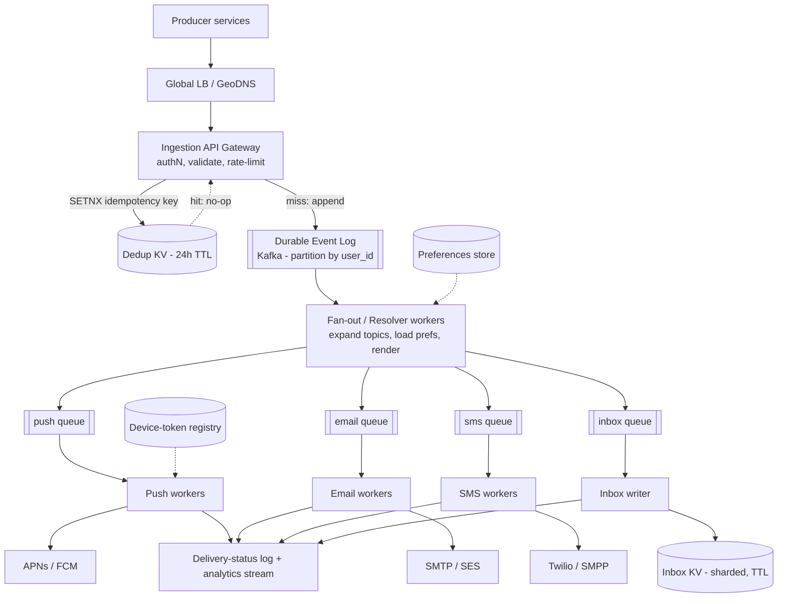

# B11 — Design a notification / pub-sub system

A notification platform accepts events from many producer services and fans them out to billions of recipients across push (APNs/FCM), email, SMS, and in-app channels, with strong delivery guarantees and per-user preferences. It tests whether you can reason about **fan-out at scale, at-least-once delivery with idempotency, backpressure, ordering, and rate limiting** — the messy operational realities that separate a toy "send an email" service from a real engine. Google asks it because notifications sit at the intersection of streaming, storage, third-party integration, and SLOs, so it surfaces both breadth and the depth of someone who has actually run one.

## Lead with this — your résumé hook

"I built a real-time notification engine, so I'll design from what actually broke in production. The hard parts were never 'call the push API' — they were the fan-out amplification when a single event targets millions of users, guaranteeing at-least-once delivery without spamming people via idempotency keys, and applying backpressure when a downstream provider like APNs throttles us. I'll anchor the design on a durable log, an idempotent delivery pipeline, and per-channel rate limiters, then scale each independently." Speak in the first person about the failure modes; that is the Staff signal here.

## 1) Clarify — questions to ask the interviewer

- **Scope of "notification":** transactional (password reset, order shipped) only, or also marketing/digest campaigns? They have very different latency and consistency needs.
- **Channels:** which of push (mobile/web), email, SMS, in-app inbox, webhooks? In-app inbox implies durable per-user storage + read/unread state; push/email/SMS are fire-and-forward to third parties.
- **Fan-out shape:** is the targeting "one event -> one user" (transactional) or "one event -> N million users" (broadcast/topic subscription)? This single answer dictates the whole architecture (write amplification).
- **Scale:** how many events/sec ingested, and what is the fan-out multiplier (avg recipients per event)? How many total registered devices/users?
- **Delivery guarantee:** at-least-once, at-most-once, or exactly-once-as-observed? Almost always at-least-once + idempotent dedupe; confirm.
- **Ordering:** must notifications for a single user arrive in order (e.g., "added to chat" before "you have a reply")? Global ordering is usually not required; per-user/per-topic often is.
- **Latency target:** p99 from event-accepted to handed-to-provider — seconds for transactional, minutes acceptable for digests?
- **Preferences & compliance:** user mute/quiet-hours, per-category opt-out, GDPR/CAN-SPAM unsubscribe, do-not-disturb. Where does preference enforcement live?
- **Dedup window:** if the same event is published twice, over what window must we collapse it (5 min? 24 h?)?
- **Multi-region:** are recipients global? Do we need region-local delivery to cut latency and survive a region loss?

**What the interviewer is signaling:** they want to see if you immediately separate the **two regimes** (low-volume transactional with tight latency vs. high-volume broadcast with write amplification) and whether you proactively raise **idempotency, backpressure, and preferences** without being prompted. Jumping straight to boxes is an L5 move; framing the problem space is the L6 move.

## 2) Functional Requirements (FR)

**In-scope**
- Producers publish an event via API; system resolves recipients and delivers across one or more channels.
- Multi-channel delivery: push, email, SMS, in-app inbox.
- Per-user, per-category preferences (opt-in/out, quiet hours, channel choice).
- Templating + localization (render notification from template + variables).
- At-least-once delivery with **idempotent dedupe** (no duplicate user-visible notifications).
- Retries with backoff for transient provider failures; dead-letter for permanent ones.
- Rate limiting per user (anti-spam) and per provider (respect APNs/FCM/SMTP quotas).
- Delivery status tracking (queued -> sent -> delivered -> opened where the channel supports receipts).
- Fan-out for topic/broadcast notifications (one event -> many subscribers).

**Out-of-scope (defer)**
- Rich marketing campaign scheduling/A-B testing UI.
- Analytics dashboards beyond raw delivery events (hand the event stream to a separate analytics pipeline).
- Two-way messaging / chat (this is one-way notification).
- ML-based send-time optimization (mention as an evolution).

## 3) Non-Functional Requirements (NFR)

| Dimension | Target & rationale |
|---|---|
| Scale | 50K ingested events/sec; broadcast fan-out up to 10M recipients/event; ~2B registered devices. Peak fan-out throughput ~1M deliveries/sec. |
| Latency (transactional) | p99 < 2 s from accept to handed-to-provider; the provider's own delivery time is outside our SLO but tracked. |
| Latency (broadcast) | p99 < 60 s for a 10M-recipient fan-out to be fully enqueued. |
| Availability | 99.95% for ingestion (must never drop an accepted event); delivery is degradable per-channel. |
| Consistency | Durable, ordered **per-(user,topic)**; no global ordering. Preferences read-your-writes for the owning user. |
| Durability | Accepted events durable before ack (replicated log, fsync/quorum). Zero accepted-event loss. |
| Delivery guarantee | At-least-once + idempotency key => effectively exactly-once as the user perceives it. |
| Security | AuthN/Z per producer (scoped API keys), PII encryption at rest, signed unsubscribe links, per-tenant isolation. |

## 4) Back-of-envelope estimation

```
Ingestion
  50,000 events/sec accepted
  Avg event payload ~1 KB  -> 50 MB/sec ingest bandwidth

Fan-out amplification
  Mix: 90% transactional (1 recipient), 10% broadcast (avg 100K recipients)
  Deliveries/sec = 0.9*50k*1  +  0.1*50k*100k... (broadcast is bursty, not steady)
  Steady transactional deliveries:        45,000/sec
  A single 10M broadcast, enqueued in 60s: 167,000/sec for that minute
  Design delivery pipeline for ~1,000,000 deliveries/sec headroom (bursty broadcasts)

Storage (in-app inbox + delivery log)
  Inbox: keep last 90 days, ~50 notifications/user retained
    2B users * 50 * 0.5 KB = 50 TB  (sharded KV, TTL'd)
  Delivery audit log: 45k/sec * 86,400 = ~3.9B rows/day
    ~300 bytes/row => ~1.2 TB/day -> tier to cold storage after 30d

Dedup store (idempotency keys)
  Keys live for dedup window (say 24h)
  45k/sec * 86,400 = ~3.9B keys/day, ~64 bytes each => ~250 GB hot set
  -> Redis/edge KV with 24h TTL, sized ~300 GB across the cluster

Device-token registry
  2B devices * ~256 bytes (token + platform + user_id) = ~512 GB -> sharded KV
```

## 5) API design

```
# Producer publishes (idempotent)
POST /v1/notifications
  Headers: Authorization: Bearer <producer-key>
           Idempotency-Key: <producer-supplied-uuid>   # dedupe handle
  Body: {
    "event_type": "order.shipped",
    "target": { "user_id": "u123" }          # or {"topic":"price-alerts:AAPL"}
    "channels": ["push","email","inbox"],     # null => use user prefs
    "template_id": "order_shipped_v3",
    "data": { "order_id": "...", "eta": "..." },
    "priority": "transactional",              # or "digest"
    "dedup_key": "order.shipped:o789"         # collapse duplicates of same logical event
  }
  -> 202 Accepted { "notification_id": "...", "status": "queued" }

# Topic subscription management
POST   /v1/topics/{topic}/subscribers   { "user_id": "u123" }
DELETE /v1/topics/{topic}/subscribers/{user_id}

# Preferences
PUT /v1/users/{user_id}/preferences
  { "order_updates": {"push": true, "email": false},
    "quiet_hours": {"tz":"Asia/Kolkata","start":"22:00","end":"07:00"} }

# Device registration (clients)
POST /v1/users/{user_id}/devices  { "platform":"ios", "token":"<apns-token>" }

# In-app inbox (clients)
GET  /v1/users/{user_id}/inbox?cursor=...&limit=20
POST /v1/users/{user_id}/inbox/{id}/read

# Delivery status (producers)
GET /v1/notifications/{notification_id}   -> {status, per_channel:[...]}
```

## 6) Architecture — request & data flow

**(a) ASCII layered flow**

```
        Producer services (web / mobile backends / cron jobs)
                       |  POST /v1/notifications (+Idempotency-Key)
                       v
            [ Global LB / GeoDNS ]            anycast, health-checked, region-local
                       |
                       v
            [ Ingestion API Gateway ]         authN/Z producer key, validate,
                       |                       rate-limit per producer, dedupe-at-edge
                       |  (1) write idempotency key (SETNX, 24h TTL)
                       v
            [ Idempotency / Dedup KV ]  -- hit --> return existing notification_id (202, no-op)
                       |  miss
                       v
            [ Durable Event Log (Kafka) ]      partitioned by user_id (per-user order)
                  |                |  <-- ack producer ONLY after durable replicate
                  |                |
          (transactional topic)  (broadcast topic)
                  |                |
                  v                v
        [ Fan-out / Resolver workers ]         resolve recipients, expand topics,
                  |                             load prefs, apply quiet-hours/opt-out,
                  |                             render template + localize
                  |   expands 1 broadcast event -> N per-user delivery tasks
                  v
            [ Per-channel delivery queues ]    push-q | email-q | sms-q | inbox-q
              (rate-limited, priority lanes)        |
                  |          |          |           |
                  v          v          v           v
          [Push wk]    [Email wk]  [SMS wk]   [Inbox writer]
            |  APNs/FCM    | SMTP/SES  | Twilio    | upsert inbox row
            v              v          v           v
        token-rotate   bounce-handle  DLR      [ Inbox KV (sharded, TTL) ]
            |              |          |
            +------- emit delivery events -------+
                            |
                            v
                 [ Delivery-status log + analytics stream ]
```

Arrows are **async after the log** — the only synchronous path is producer -> gateway -> dedup-KV -> log -> 202. Everything downstream is decoupled by Kafka so a slow provider never blocks ingestion.

**Write path (the critical one):** producer POSTs with an `Idempotency-Key`. The gateway authenticates, validates, then does a `SETNX key -> notification_id` against the dedup KV (24 h TTL). If the key exists, it returns the prior `notification_id` with no side effects (the producer retried). On miss, it appends the event to the partitioned Kafka log keyed by `user_id` (so a single user's events stay ordered) and only **acks 202 after the log confirms a quorum-durable write** — that is what makes the event "accepted = never lost." Fan-out workers consume the log: for a transactional event they resolve one recipient; for a broadcast they page through the topic's subscriber list and emit one per-user delivery task each. Each task is enriched with preferences (drop if opted-out or in quiet hours), localized, rendered, and pushed onto the matching per-channel queue. Channel workers pull at a rate the provider tolerates, call APNs/FCM/SMTP/Twilio, and emit a delivery-status event. The inbox writer additionally upserts a durable inbox row so the in-app channel is queryable.

**Read path:** clients `GET /inbox?cursor=...` hits the Inbox KV (sharded by user_id, paginated by a time-ordered cursor); marking read is an idempotent upsert. Producers poll `GET /notifications/{id}` which reads the delivery-status log/store.

**(b) Mermaid flowchart**



## 7) Data model & storage choices

- **Event log — Kafka (or equivalent partitioned, replicated log).** First-principles: we need durable, ordered, replayable ingestion that decouples bursty fan-out from steady ingest. Partition by `user_id` (transactional) / `topic` (broadcast) to get **per-key ordering for free**; replication factor 3 with `acks=all` gives the no-loss guarantee. A log (not a queue) lets us replay after a fan-out bug.
- **Dedup / idempotency — in-memory KV (Redis/edge KV) with TTL.** It is a high-churn, set-membership workload with a bounded window; a TTL'd KV is exactly the right shape. Key = `Idempotency-Key`; also a secondary `dedup_key` set to collapse logically-identical events (e.g., two services emitting "order shipped").
- **Device-token registry — sharded KV** keyed by `user_id -> [{platform, token, last_seen}]`. Point lookups by user; tokens rotate, so store last-validated timestamp and prune on APNs "unregistered" feedback.
- **Preferences — SQL or KV per user.** Small, read-heavy, needs read-your-writes for the owner; a per-user document in a KV (or a small relational table) works. Cache hot users.
- **In-app inbox — sharded wide-column / KV** keyed by `(user_id, notification_id)`, clustered by time descending for cursor pagination, with a 90-day TTL. Read/unread is a column upsert.
- **Delivery-status / audit — append-only log -> columnar warehouse.** Write-once, read-rarely, huge volume; stream to BigQuery-style storage and TTL the hot copy after 30 days.
- **Templates — versioned blob/object store** (immutable, referenced by `template_id@version`).

## 8) Deep dive

**Deep dive A — at-least-once + idempotency (the delivery-guarantee crux).** True exactly-once across third-party providers is impossible (the provider may deliver then the ack is lost), so we engineer **at-least-once delivery + idempotent effects**. Two dedupe layers: (1) **ingestion dedupe** via the producer's `Idempotency-Key` at the gateway, so retried POSTs don't create new notifications; (2) **delivery dedupe** via a per-(user, dedup_key, channel) marker checked by the channel worker before it calls the provider — so even if Kafka redelivers a task after a worker crash, we don't double-send. For the in-app inbox the upsert is naturally idempotent (same `notification_id` -> same row). For push/email/SMS we can't fully prevent a rare double-send (crash *after* provider call, *before* marker write), so we (a) write the marker first with a "pending" state and provider-side idempotency token where supported (SES/Twilio accept one), (b) keep the dedup window long enough (24 h) that retries collapse. The honest Staff answer: "exactly-once as the user observes it, achieved by at-least-once transport plus idempotency keys at ingest and delivery."

**Deep dive B — fan-out + backpressure + rate limiting (the scale crux).** A single broadcast event can target 10M users -> 10M delivery tasks; naively this floods both our workers and the provider. Fan-out workers **page** the subscriber list (cursor over the topic-subscriber store) and emit tasks in chunks, so memory stays bounded. **Backpressure:** the per-channel queues are bounded; when APNs starts returning 429/throttle, the push worker reduces its consume rate via a token-bucket whose refill is driven by observed provider acceptance — Kafka happily buffers the backlog because the log is the source of truth, so backpressure manifests as a growing-but-durable lag, not data loss or OOM. **Rate limiting two-dimensionally:** per-user (token bucket keyed by user_id, e.g., max 1 push/min per category) to prevent spam and protect our reputation; per-provider/per-app-key (global token bucket) to stay under APNs/FCM/SMTP quotas. Transactional traffic gets a **priority lane** so a 10M marketing broadcast can never starve a password-reset push (separate topics + weighted worker pools). When a region's providers degrade, we shed digest traffic first (priority-based load shedding) and keep transactional flowing.

## 9) Key tradeoffs

| Decision | Choice & why | Tradeoff accepted |
|---|---|---|
| Delivery guarantee | At-least-once + idempotency | Rare visible double-send on crash-after-send; accept and minimize, since at-most-once would drop transactional notifications |
| Fan-out timing | Async via durable log | Higher end-to-end latency than direct send; gain durability, backpressure, replay |
| Ordering | Per-(user/topic) only, via partition key | No global order; almost never needed and would kill throughput |
| Push fan-out for broadcast | Compute at send (resolve subscribers per event) | Heavy write amplification; alternative (per-user pull/inbox-only) trades freshness — we offer both: push for real-time, inbox always written |
| Dedup store | TTL'd in-memory KV | Loses keys on full cluster loss (window resets -> possible dup burst); acceptable vs. cost of durable dedupe at this QPS |
| Preferences enforcement | At fan-out (server-side), not at producer | Producer can't override user opt-out (correct), at cost of a prefs read per delivery — cached |
| Consistency vs availability (CAP) | AP for delivery, CP-ish for the durable log accept | During partition we keep accepting+buffering; delivery may lag — favor not losing events over instant delivery |

## 10) Bottlenecks & failure modes

- **Broadcast write amplification / thundering herd:** one 10M event swamps queues. *Mitigation:* chunked paging, priority lanes, per-provider rate limit, and bounded queues that backpressure into durable Kafka lag rather than failing.
- **Hot topic / hot user:** a celebrity topic or a user targeted by a retry storm. *Mitigation:* sub-partition hot topics across multiple Kafka partitions; per-user token bucket caps spam; detect and isolate hot keys.
- **Provider throttling / outage (APNs down):** *Mitigation:* per-provider token bucket auto-throttles; retries with exponential backoff + jitter; dead-letter after N attempts; the inbox channel still succeeds, so the user isn't fully cut off; failover to secondary provider where one exists (SES <-> alternate SMTP).
- **Duplicate storm from producer retries:** *Mitigation:* gateway idempotency key + delivery-marker dedup collapse them.
- **Dedup KV loss (SPOF on dedupe):** replicate it; on loss, accept a bounded duplicate burst (window resets) — never block ingestion on the dedup store.
- **Poison/oversized event:** *Mitigation:* validate at gateway; route un-renderable tasks to DLQ for inspection, don't crash the worker pool.
- **Cascading failure from synchronous coupling:** *Mitigation:* the log is the only hard dependency on the write path; everything else is async and independently degradable.

## 11) Scale 10x / evolution

- **First thing to break: fan-out worker throughput** under bigger broadcasts. Evolve to a hierarchical fan-out (a coordinator splits a 100M topic into sub-fan-out jobs run in parallel across worker shards), and move subscriber lists to a store optimized for range scans.
- **Dedup KV gets expensive** at 10x keys. Shorten the window per channel, or move to a probabilistic structure (per-shard cuckoo/Bloom filter) accepting a tiny false-collapse rate for non-critical channels.
- **Multi-region:** run the full pipeline per region; route producers and recipients to the nearest region; replicate device-token + preferences globally (eventually consistent, read-your-writes via primary region for the owner). A region loss drains its Kafka lag in a sibling region (mirror the log). This directly leverages multi-region ownership: region-local delivery cuts last-mile latency and survives a regional provider outage.
- **Send-time optimization / batching:** add an ML layer to choose per-user optimal send time and to batch digests, reducing provider load and improving open rates.
- **Exactly-once-er:** push provider-side idempotency tokens everywhere providers support them, shrinking the double-send window further.

## 12) Interviewer probes & follow-ups

- **"How do you guarantee you never send the same push twice?"** You can't perfectly, across a third party — so I do at-least-once + a delivery marker keyed by (user, dedup_key, channel) checked before the provider call, plus provider-side idempotency tokens where available. The residual window is crash-after-send-before-marker; I shrink it and rely on a long dedup window. I'd state this honestly rather than claim exactly-once.
- **"A broadcast targets 50M users — walk me through it."** Event hits the log on the broadcast topic; fan-out workers page the subscriber list in chunks, emitting per-user tasks onto rate-limited per-channel queues; provider throttling shows up as durable Kafka lag (backpressure), not loss; transactional traffic stays on a separate priority lane so it isn't starved; full enqueue completes within the broadcast SLO.
- **"How do you apply backpressure without dropping events?"** Bounded per-channel queues + token buckets driven by observed provider acceptance; overflow becomes consumer lag on the durable log, which is bounded by retention, not by memory. We shed digest priority before transactional.
- **"User says they got a notification they opted out of."** Preferences are enforced server-side at fan-out, not trusted from the producer; I'd check the prefs-read cache freshness and whether the event predated the opt-out (read-your-writes on prefs prevents that for the owner).
- **"Ordering: 'reply' arrived before 'message'."** Partition the log by user_id so a single user's events are ordered; channel workers preserve order per partition. Cross-channel ordering (push vs email) isn't guaranteed — call that out.
- **"How do you handle invalid/expired device tokens?"** APNs/FCM return "unregistered"; the push worker emits a token-invalidation event that prunes the registry, so we stop wasting sends.
- **"Why a log and not just a queue?"** Replayability (reprocess after a fan-out bug), per-key ordering via partitions, and durable buffering for backpressure — a plain queue gives none of those cleanly.

## 13) 60-minute flow cheat-sheet

| Time | Phase | What to do |
|---|---|---|
| 0–6 min | Clarify | Split transactional vs broadcast; pin channels, scale, delivery guarantee, ordering, latency, prefs/compliance |
| 6–9 min | FR/NFR | Lock at-least-once + idempotency, per-(user/topic) order, no-loss ingestion |
| 9–14 min | Estimation | Fan-out amplification math, deliveries/sec headroom, inbox + dedup storage |
| 14–20 min | API + high-level arch | Idempotency-Key on POST; durable log; per-channel queues; draw both diagrams |
| 20–25 min | Walk read & write paths | Emphasize "ack only after durable log write" |
| 25–40 min | Deep dive | (A) at-least-once + idempotency layers; (B) fan-out + backpressure + rate limiting |
| 40–48 min | Tradeoffs + failure modes | CAP stance, hot keys, provider outage, dedup-store loss |
| 48–55 min | Scale 10x | Hierarchical fan-out, multi-region delivery, dedup at 10x |
| 55–60 min | Probes | Duplicate-send honesty, broadcast walk-through, ordering caveats |
