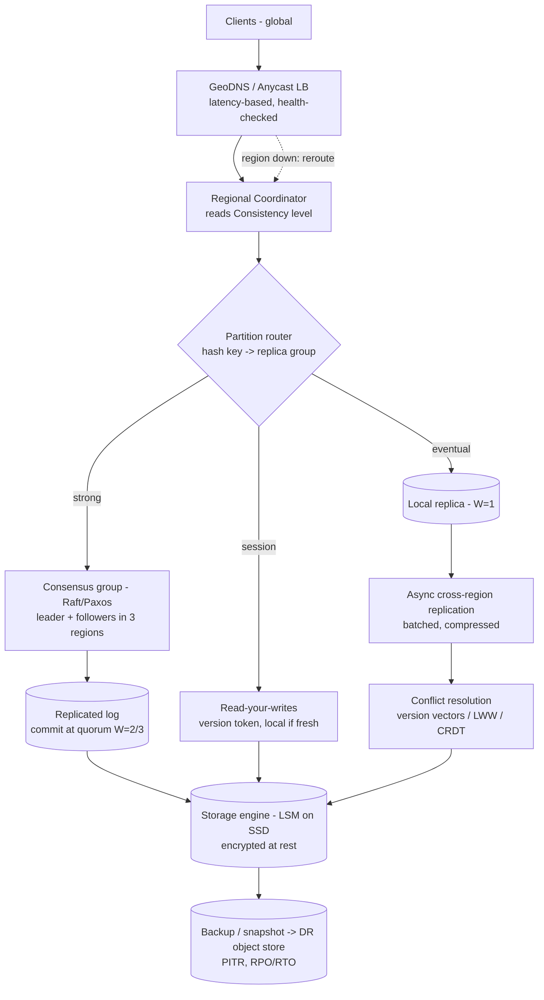

# B13 — Design a multi-region, globally-distributed storage system

Design a globally-distributed key/value (or object) storage system that places, replicates, and serves data across multiple geographic regions with an **explicit, tunable consistency model**, automatic failover, conflict resolution, and disaster recovery. This is the question where Google weights **consistency depth** most heavily at L6 — it wants to hear quorum math (R + W > N), Paxos/Raft intuition, read-your-writes vs eventual, geo-routing, and the cross-region latency tax — articulated from first principles, not as "use Spanner." It is the canonical test of whether you understand CAP as an engineering dial rather than a slogan.

## Lead with this — your résumé hook

"I've owned multi-cloud infrastructure spanning AWS and GCP, so a globally-distributed store is exactly the terrain I operate in — the unavoidable truth is the speed of light: a cross-region round trip is ~100–150 ms, so every consistency decision is really a latency decision. I'll design a partitioned, multi-region replicated store with a **tunable consistency dial** (per-key choice of strong vs eventual), quorum-based replication, leader-based consensus for the strong path, and explicit failover + DR. I'll make the CAP tradeoff a deliberate, documented choice rather than an accident." Lead with the multi-cloud ownership — it earns you the right to make strong-vs-eventual calls credibly.

## 1) Clarify — questions to ask the interviewer

- **Data model:** opaque KV, document, or large objects/blobs? Object storage (immutable, large) has a very different replication and consistency story than mutable small records.
- **Consistency requirement, per use case:** do we need strong/linearizable writes (e.g., account balance, inventory), or is eventual consistency acceptable (e.g., user profile, social graph)? Can it be **tunable per key/namespace**? This is the central question.
- **Read-your-writes:** must a user always see their own last write even when routed to another region? (Almost always yes for UX — but it's weaker than full linearizability.)
- **Geography of users and writes:** are writes single-homed (one region owns a key) or can the same key be written from multiple regions concurrently (multi-master)? Multi-master forces conflict resolution.
- **Scale:** total data volume (TB/PB), QPS read/write, object/record size, number of regions, and how data is partitioned by user/geo.
- **Latency budget:** p99 read and write targets — strong writes will pay the cross-region quorum cost; is that acceptable, or do writes need to be local-region fast?
- **Durability & DR:** required durability (e.g., 11 nines), RPO (how much data may we lose on a region loss?) and RTO (how fast must we recover?).
- **Failure model:** must we survive a full region outage with no data loss and continued writes? That determines replica count and placement.
- **Data residency / compliance:** must certain data stay in certain regions (GDPR, data sovereignty)? This constrains placement.

**What the interviewer is signaling:** they are probing **consistency depth**. The strong signal is to (1) refuse a one-size-fits-all answer and propose a **per-key tunable consistency dial**, (2) immediately ground every choice in the ~100 ms cross-region RTT, and (3) raise read-your-writes, conflict resolution, and quorum math unprompted. Saying "eventually consistent, we'll use vector clocks" or "strongly consistent, we'll use Paxos" without acknowledging the latency/availability cost is an L5 answer; framing it as a deliberate CAP/PACELC dial is L6.

## 2) Functional Requirements (FR)

**In-scope**
- `get(key)` / `put(key, value)` / `delete(key)` with a per-operation or per-namespace **consistency level** (strong / read-your-writes / eventual).
- Multi-region replication with a defined topology (replicas in ≥3 regions).
- Quorum-tunable reads and writes (R, W against N replicas).
- Strong-consistency path via leader-based consensus (Raft/Paxos) per partition.
- Conflict detection + resolution for the eventual/multi-master path.
- Geo-routing: clients reach the nearest healthy region.
- Automatic failover on node/region loss; leader re-election.
- Disaster recovery: backups, point-in-time restore, defined RPO/RTO.
- Data residency constraints on placement.

**Out-of-scope (defer)**
- Rich query/secondary indexes and transactions across many keys (mention distributed txn as an evolution; multi-key cross-region transactions are very expensive).
- A full SQL surface — start as KV/object; layer query later.
- Client-side caching/CDN (orthogonal; can sit in front).

## 3) Non-Functional Requirements (NFR)

| Dimension | Target & rationale |
|---|---|
| Scale | 1 PB+ data; 1M reads/sec, 100K writes/sec globally; 3–5 regions; billions of keys, partitioned. |
| Latency | Eventual read p99 < 10 ms (region-local). Strong write p99 ~ 1 cross-region RTT (~100–300 ms) — explicitly the cost of strong. Read-your-writes < 50 ms. |
| Availability | 99.99%+; survive a full region loss with continued service (eventual path stays up; strong path may pause writes for an unreachable quorum). |
| Consistency | Tunable per key: linearizable (strong), read-your-writes (session), or eventual. Default per namespace. |
| Durability | 11 nines; data replicated to ≥3 regions; RPO near-zero for strong, bounded (async lag) for eventual; RTO minutes. |
| Partition behavior | Explicit CAP/PACELC: strong keys choose CP (refuse writes without quorum); eventual keys choose AP (accept, reconcile later). |
| Security | Encryption in transit + at rest, per-tenant isolation, region residency enforcement, audited access. |

## 4) Back-of-envelope estimation

```
Latency budget (the governing constraint)
  Same-region RTT      ~ 0.5–2 ms
  Cross-region RTT     ~ 100–150 ms (e.g., us-east <-> eu-west)
  Strong write needs a quorum ACK across regions:
     W=2 of N=3 with replicas in 2+ regions -> ~1 cross-region RTT ~ 100–150 ms
  => Strong writes are ~100x slower than local. This drives the tunable dial.

Quorum config
  N = 3 replicas (across 3 regions) for strong path; R + W > N for linearizable-ish:
     W=2, R=2  -> R+W=4 > 3  => overlapping quorum, read sees latest committed write
  Eventual path: W=1 (local), R=1 (local) -> fast, reconciled async

Storage
  1 PB logical * replication factor 3 = 3 PB raw across regions
  + per-key metadata (version vector / Raft index, ~100 B) for billions of keys
     5e9 keys * 100 B = 500 GB metadata (small vs data)

Throughput / bandwidth
  Writes 100K/sec * avg 4 KB = 400 MB/sec ingest
  Cross-region replication for strong path replicates each write to 2 other regions:
     400 MB/sec * 2 = 800 MB/sec inter-region WAN -> sizeable, motivates batching/compression
  Reads 1M/sec served region-locally (eventual) -> ~4 GB/sec read, no WAN cost

DR
  RPO: strong path ~0 (committed = replicated); eventual path = async lag (seconds)
  RTO: leader re-election ~seconds; region failover via geo-DNS ~tens of seconds
```

## 5) API design

```
# Core, with explicit consistency level
PUT  /v1/{ns}/{key}
  Headers: Consistency: strong | session | eventual
           If-Match: <version>          # optimistic concurrency (CAS)
  Body: <value>
  -> 200 {version, region_committed:[...]}   # which regions acked

GET  /v1/{ns}/{key}
  Headers: Consistency: strong | session | eventual
           X-Session-Token: <last-seen-version>   # for read-your-writes
  -> 200 {value, version} | 404

DELETE /v1/{ns}/{key}  (tombstone, replicated)

# Compare-and-swap (linearizable conditional write)
POST /v1/{ns}/{key}/cas  { expected_version, new_value } -> 200 | 409 conflict

# Admin / topology
GET  /v1/regions                 # health, leadership per partition
POST /v1/namespaces  { name, default_consistency, residency:["eu"], replication:3 }
```

## 6) Architecture — request & data flow

**(a) ASCII layered flow**

```
        Clients (global)                     each routed to nearest healthy region
              |
              v
     [ GeoDNS / Anycast Global LB ]          latency-based routing, health-checked
              |                                fails a region out -> next nearest
              v
     [ Regional API / Coordinator ]          parses Consistency level, finds the
              |                                partition + replica set for the key
              |   hash(key) -> partition -> replica group (3 regions)
              v
     [ Partition router (per region) ]
        /                |                 \
       v                 v                  v
  STRONG path        SESSION path        EVENTUAL path
  (linearizable)     (read-your-writes)  (local + async)
       |                 |                  |
       v                 |                  v
  [ Consensus group ]    |          [ Local replica ]  W=1 local ack
  Raft/Paxos per         |                  |
  partition: leader      |                  v
  + followers across     |          [ Async cross-region replication ]
  3 regions; W=2 of 3    |                  |  ship via WAN (batched/compressed)
       |                 |                  v
       v                 v          [ Conflict detection ]
  [ Replicated log ] -> commit when  version vectors / last-writer-wins /
  quorum acks; read at  quorum (R=2)  CRDT merge -> reconcile divergent copies
       |
       v
  [ Storage engine per replica ]  LSM-tree on local SSD, encrypted at rest
       |
       v
  [ Backup / snapshot -> DR object store ]  PITR, RPO/RTO targets
```

**Write path (strong):** client `PUT` with `Consistency: strong` lands at the nearest regional coordinator, which finds the key's partition and its **Raft/Paxos leader** (one leader per partition, replicas in 3 regions). The leader appends to its replicated log and waits for a **write quorum (W=2 of N=3)** to ack — this costs ~1 cross-region RTT (~100–150 ms), the unavoidable price of linearizability. Once committed, the value is durable in ≥2 regions (RPO ≈ 0). With `Consistency: eventual`, the coordinator writes the **local replica only (W=1)**, acks immediately (~ms), and **asynchronously replicates** to other regions; conflicting concurrent writes are reconciled later.

**Read path:** `Consistency: strong` reads through the leader (or a read quorum R=2 with R+W>N) so it observes the latest committed write. `Consistency: session` (read-your-writes) carries the client's last-seen version token; the local region serves it if its replica is at least that fresh, else it waits/forwards — giving each user a monotonic view without paying full linearizable cost. `Consistency: eventual` reads the **nearest local replica** (sub-10 ms), possibly slightly stale.

**Failover & DR:** GeoDNS health-checks regions and routes around a failed one. Within a partition, losing the leader triggers **Raft re-election** among surviving followers (seconds); the strong path keeps serving as long as a quorum survives, and **refuses writes if a quorum is unreachable** (CP choice — no split-brain). Snapshots stream to a DR object store for point-in-time restore.

**(b) Mermaid flowchart**



## 7) Data model & storage choices

- **KV / object as the base abstraction.** First-principles: a narrow key->value interface is what makes global partitioning and per-key consistency tractable; rich queries fight against partitioning, so we defer them.
- **Partitioning by key-range or hash.** Hash partitioning (consistent hashing) spreads load evenly and avoids hotspots; range partitioning enables ordered scans but risks hot ranges. Default to hash with vnodes; each partition is an independent replication/consensus unit so the system scales by adding partitions.
- **Per-partition storage engine: LSM-tree on local SSD.** LSM gives high write throughput (sequential writes, background compaction) which matches a write-replicated system; reads use bloom filters + block cache. Each replica owns a full copy of its partition's data.
- **Strong path: replicated log via Raft/Paxos.** First-principles: linearizability requires a single agreed order of operations; a consensus-backed replicated log provides exactly that, with a leader to serialize writes and followers to provide durability and failover. One consensus group **per partition** (not one global group) so consensus throughput scales horizontally.
- **Eventual path: versioned values with conflict metadata.** Each value carries a **version vector** (or dotted version vector) to detect concurrent writes across regions. Resolution: **last-writer-wins** (simple, may lose a write — fine for profiles) or **CRDT merge** (for counters/sets/registers where automatic merge is well-defined) or surface both versions to the app (siblings) for semantic merge.
- **DR store: cheap, durable object storage** for snapshots + WAL archives enabling point-in-time restore; cross-region and ideally cross-cloud (AWS S3 + GCS) for the multi-cloud durability story.

## 8) Deep dive

**Deep dive A — the consistency dial: quorums, consensus, and read-your-writes (the crux Google weights).** The core insight is that consistency is a **per-key dial**, and each setting buys a different point on the latency/availability curve (PACELC: even with no partition, you trade latency for consistency).

- **Strong / linearizable:** route writes through a **single Raft leader per partition**; the leader appends to the replicated log and commits when a **majority quorum** acks. Reads either go through the leader or use a **read quorum** satisfying **R + W > N** (e.g., N=3, W=2, R=2 -> 4 > 3) so any read quorum overlaps any write quorum by at least one replica and therefore observes the latest committed value. Cost: a write pays ~1 cross-region RTT for the quorum, so ~100–150 ms. This is the right choice for inventory, balances, unique-username — anything where a stale read is a correctness bug.
- **Read-your-writes (session):** weaker and far cheaper. The client holds its **last-written version**; reads in any region are served locally if that replica has caught up to the version, otherwise the read waits or forwards to a fresher replica. This guarantees a user never sees their own write disappear, without forcing a global order on all operations — the sweet spot for most user-facing data.
- **Eventual:** write the local replica (**W=1**), ack in milliseconds, replicate asynchronously. Concurrent cross-region writes to the same key **will** conflict; **version vectors** detect it and a resolution policy (LWW / CRDT / siblings) converges all replicas. This is AP: during a partition both sides keep accepting writes and reconcile on heal.

The Staff move is to *map use cases onto the dial* and quantify: "balances -> strong, ~120 ms writes; profiles -> read-your-writes, ~20 ms; activity feed -> eventual, ~5 ms, LWW." That demonstrates you treat CAP/PACELC as an engineering control, not a label.

**Deep dive B — failover, conflict resolution, and disaster recovery.** **Leader/region failover:** each partition's Raft group detects leader loss via missed heartbeats and **re-elects** among survivors; as long as a majority of replicas survive (e.g., 2 of 3 with replicas in 3 regions, one region down), the strong path keeps committing. If a **quorum is unreachable** (2 regions down), the strong path **refuses writes** rather than risk split-brain — the explicit CP choice; the eventual path stays available. **Geo-failover:** GeoDNS/anycast health-checks reroute client traffic away from a dead region within tens of seconds. **Conflict resolution** on the eventual/multi-master path: version vectors identify whether two writes are causally ordered (keep the later) or concurrent (conflict); concurrent conflicts resolve by LWW (timestamp, accepting possible lost update), by CRDT merge (deterministic, no loss, for supported types), or by returning siblings for app-level merge. **DR:** continuous WAL archiving + periodic snapshots to a cross-region (and cross-cloud) object store enable **point-in-time restore**; RPO is ~0 for the strong path (committed implies replicated) and bounded by async lag for eventual; RTO is minutes (re-election + reroute + optional restore). Regularly game-day a full region loss to validate RPO/RTO.

## 9) Key tradeoffs

| Decision | Choice & why | Tradeoff accepted |
|---|---|---|
| Consistency | Per-key dial (strong / session / eventual) | More complex API + ops; gain right latency for each use case |
| Strong write path | Raft/Paxos leader + majority quorum | ~1 cross-region RTT per write (~100–150 ms) |
| CAP during partition | CP for strong keys, AP for eventual | Strong writes pause without quorum; eventual may diverge then reconcile |
| Quorum config | N=3, R=2, W=2 (R+W>N) | Writes need 2 regions to ack; survives 1 region loss |
| Multi-master | Allowed only on eventual path | Requires conflict resolution; single-homed for strong avoids it |
| Conflict resolution | Version vectors + LWW/CRDT/siblings | LWW can lose a write; CRDT limits data types; siblings push work to app |
| Partitioning | Hash + vnodes, per-partition consensus group | No global scans cheaply; gain horizontal consensus throughput |
| Replication for eventual | Async cross-region | Bounded staleness / non-zero RPO; gain local write latency |
| DR | Cross-region + cross-cloud snapshots | Storage + WAN cost; gain region/cloud-failure survivability |

## 10) Bottlenecks & failure modes

- **Cross-region latency dominates strong writes:** the speed of light is the bottleneck. *Mitigation:* single-home strong keys near their writers; batch/pipeline log entries; place quorum replicas in nearby regions; offer session/eventual where strong isn't required.
- **Hot partition / hot key:** one partition's leader saturates. *Mitigation:* finer partitioning (split the range), more vnodes, and for read-hot keys serve from followers (eventual) or a cache; for the strong path, shard the key if semantically possible.
- **Split-brain on partition:** two regions both think they're leader. *Mitigation:* majority-quorum consensus mathematically prevents two leaders committing; minority side steps down and refuses writes.
- **Leader election storm / thundering herd on failover:** *Mitigation:* randomized election timeouts (Raft), pre-vote, and leader leases to avoid flapping.
- **Async replication lag -> stale reads / RPO risk:** *Mitigation:* monitor and alert on replication lag; cap acceptable lag; for keys that can't tolerate it, use the strong path.
- **Conflict storms (multi-master same key):** *Mitigation:* steer such keys to single-home strong, or use CRDTs so merges are automatic and bounded.
- **Region loss / cascading failover:** rerouting all traffic to one surviving region can overload it. *Mitigation:* capacity headroom per region, load shedding, and degrade strong->session under pressure.
- **Clock skew breaking LWW:** *Mitigation:* prefer logical clocks/version vectors over wall-clock; if using timestamps, bound skew (TrueTime-style uncertainty) or fall back to vector comparison.

## 11) Scale 10x / evolution

- **First to break: cross-region WAN bandwidth and strong-write throughput** as writes 10x. Evolve by batching + compressing replication, adding more partitions (more independent Raft groups = more parallel consensus), and moving cold data to cheaper tiers.
- **More regions:** adding regions increases quorum RTT options; pin each key's replica set to the geographically tightest regions that still satisfy residency + survive a loss, rather than spreading across all regions.
- **Distributed transactions:** if multi-key atomicity is later required, layer **two-phase commit over the per-partition consensus groups** (Spanner-style: 2PC across Paxos groups) — but flag the latency cost and keep it opt-in.
- **Stronger global ordering:** if linearizable global snapshots are needed, introduce a TrueTime-like bounded-uncertainty clock to commit-wait, trading a few ms of latency for external consistency — the multi-cloud angle: GCP exposes TrueTime-class clocks, AWS requires bounding NTP skew, so the implementation differs by cloud.
- **Adaptive consistency:** auto-tune a key's consistency level from observed conflict rate and access locality, so hot single-region keys stay fast and contended keys get strong protection.
- **Tiered/archival storage + erasure coding:** reduce the 3x replication cost for cold data via cross-region erasure coding, keeping the durability story at lower storage cost.

## 12) Interviewer probes & follow-ups

- **"How do you get read-your-writes without full linearizability?"** Carry the client's last-written version token; serve a read locally only if that replica has caught up to the token, else forward to a fresher replica. Each user gets a monotonic view at near-local latency, without forcing a global order on all operations.
- **"Explain your quorum math."** With N=3, choosing W=2 and R=2 gives R+W=4>3, so every read quorum overlaps every write quorum by ≥1 replica and therefore returns the latest committed write — linearizable-ish reads. W=2 also means a committed write survives one region loss (RPO≈0).
- **"Two regions write the same key at the same time — what happens?"** On the strong path that key is single-homed through one leader, so writes are serialized — no conflict. On the eventual path version vectors detect the concurrency; we resolve by LWW, CRDT merge, or surfacing siblings for app merge, and all replicas converge on heal.
- **"A region goes down mid-write — do I lose data?"** If the write had committed (quorum acked, ≥2 regions), no — it's durable elsewhere; Raft re-elects a leader from survivors and continues. If the write hadn't reached quorum, it's not acknowledged as committed; the client retries. Strong path = RPO≈0.
- **"What if two regions are down?"** A 3-replica strong partition loses its majority and **refuses writes** to avoid split-brain (CP choice); reads may serve stale from the survivor or also refuse depending on the level. The eventual path keeps accepting and reconciles later (AP).
- **"Why not just make everything strongly consistent?"** Every strong write pays ~1 cross-region RTT (~100–150 ms) and loses availability without a quorum. Most data (profiles, feeds) doesn't need it, so forcing strong everywhere would needlessly 100x write latency and reduce availability — hence the per-key dial.
- **"Paxos or Raft — and why per-partition?"** Either provides a consensus-ordered replicated log; Raft is simpler to reason about/operate. Per-partition (not one global group) so consensus throughput scales horizontally and a hot partition doesn't bottleneck the whole system.
- **"How do you do disaster recovery and verify it?"** Continuous WAL archive + snapshots to cross-region, cross-cloud object storage for point-in-time restore; defined RPO/RTO; and scheduled game-days that actually kill a region to validate the numbers rather than assume them.
- **"How does multi-cloud (AWS+GCP) change this?"** Inter-cloud RTT and egress cost are higher, clock guarantees differ (GCP TrueTime vs bounding NTP on AWS), and residency/failover spans providers — so I'd place quorum replicas thoughtfully across clouds and lean on logical clocks for portability.

## 13) 60-minute flow cheat-sheet

| Time | Phase | What to do |
|---|---|---|
| 0–7 min | Clarify | Nail per-use-case consistency, single vs multi-master writes, residency, RPO/RTO, scale |
| 7–10 min | FR/NFR | Establish the tunable consistency dial + CAP/PACELC stance up front |
| 10–16 min | Estimation | Cross-region RTT as the governing constraint; quorum config; WAN bandwidth; RPO/RTO |
| 16–22 min | API + high-level arch | Consistency header, per-partition consensus, geo-routing; draw both diagrams |
| 22–28 min | Walk read & write paths | Strong (quorum, ~RTT), session (version token), eventual (local + async) |
| 28–44 min | Deep dive | (A) consistency dial: quorum + Raft + read-your-writes; (B) failover + conflict resolution + DR |
| 44–50 min | Tradeoffs + failures | CP vs AP per key, split-brain prevention, replication lag, clock skew |
| 50–56 min | Scale 10x | More partitions, 2PC-over-Paxos for txns, TrueTime, multi-cloud placement |
| 56–60 min | Probes | Quorum math, read-your-writes, two-region-down behavior |
