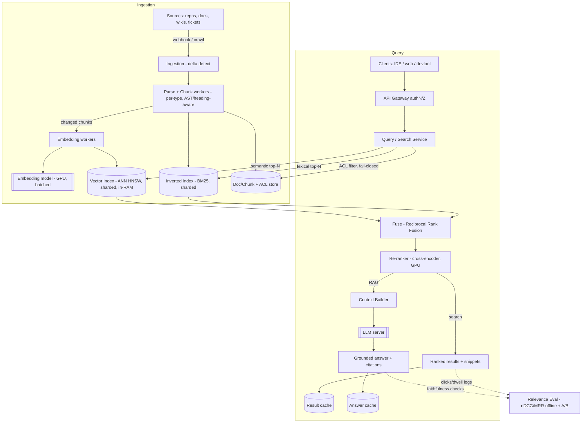

# B14 — Design a developer documentation / knowledge search system

This is where **Search, Developer Experience, and RAG converge** — the exact intersection of the role. It tests whether you can build an ingestion + indexing + retrieval system over heterogeneous developer content (docs, code, wikis, tickets), do **hybrid retrieval** (lexical + semantic) with good **ranking**, keep results **fresh** as docs change, respect **access control**, measure **relevance**, and serve at **interactive latency** — optionally fronting an LLM for RAG answers. Google asks it because it forces first-principles on inverted indexes, embeddings/ANN, ranking, and the under-discussed-but-Staff-critical concerns: **freshness, ACL-aware retrieval, and relevance evaluation**.

## Lead with this — your résumé hook

"I've built this — **RAG over an institutional knowledge base**: I ingested internal docs and code, chunked and embedded them, indexed for **hybrid retrieval** (semantic + keyword), and served grounded answers with citations to developers. The parts that made it real (not a demo) were the ones people skip: **freshness** — re-embedding only what changed when docs update; **access control** — never retrieving a chunk the asking user can't see; and **relevance evaluation** — an offline eval harness so I could prove a ranking change actually helped. So I'll design from that, and I'll be opinionated about where naive RAG falls down."

That signals the Search + DevEx + RAG trifecta with hands-on depth — precisely what this question probes.

## 1) Clarify — questions to ask the interviewer

- **Corpus scope:** What sources — markdown/HTML docs, source **code**, design docs, wikis, issue trackers, Slack, runbooks? Each needs a different parser/chunker. I'll assume docs + code + wikis primarily.
- **Output:** Are we returning **ranked search results** (links + snippets), or **RAG answers** (LLM-synthesized response with citations), or both? This decides whether an LLM + grounding sits on the serving path. I'll assume both, with search as the substrate.
- **Scale:** How many documents/chunks (I'll assume **10^7–10^8 chunks**), how many developers (**10^4–10^6**), query QPS (**~10^2–10^3**)? Corpus size drives index sharding; QPS drives serving.
- **Freshness SLA:** When a doc changes, how fast must search reflect it — seconds, minutes, hours? Code that changes constantly vs docs that rarely change. This drives the incremental ingestion design.
- **Access control:** Is content **access-controlled** (per-team, per-repo, confidential)? Almost certainly yes — so retrieval must be **ACL-aware** (filter to what the asker can see) *before* ranking, and the LLM must never ground on forbidden content. This is a hard, high-signal requirement.
- **Latency target:** Interactive — what p99 for search (I'll target **< 200–300 ms**) and for a RAG answer (dominated by LLM, target **first token < 1 s**)?
- **Query types:** Natural-language questions ("how do I rotate a service credential?"), keyword/symbol lookups (`HttpClient.retry`), navigational ("the deploy runbook")? Mix drives **hybrid** retrieval and ranking features.
- **Relevance bar + eval:** Is there ground-truth (click logs, curated Q->doc pairs)? How do we **measure** quality (nDCG, MRR, answer faithfulness) and guard against regressions? Staff-level: you must have an eval story.
- **Constraints:** On-prem vs cloud, data-residency, can content leave the building (affects whether we can call an external LLM), cost ceiling on embeddings/LLM calls.

**What the interviewer is signaling:** they want to see you don't reach for "just embed everything and do vector search." The signal is in (1) **hybrid retrieval** (lexical recall + semantic recall — neither alone is enough, especially for code/symbols), (2) **freshness** (incremental re-index/re-embed on doc change, not nightly full rebuilds), (3) **ACL-aware retrieval** (security can't be an afterthought bolted onto results), and (4) **relevance evaluation** (how do you *know* it got better?). Asking about access control and the freshness SLA early is a strong Staff signal.

## 2) Functional Requirements (FR)

**In-scope**

- **Ingest** heterogeneous sources (docs, code, wikis) — crawl/webhook, parse, **chunk** sensibly (semantic/structural boundaries, not fixed bytes).
- **Index** each chunk into both an **inverted (lexical) index** and a **vector (embedding) index**.
- **Hybrid retrieval:** combine lexical (BM25) and semantic (ANN) candidates for a query.
- **Rank** the merged candidates (fusion + a learned re-ranker) to a final ordered list.
- **ACL-aware:** retrieve only chunks the asking user is authorized to see.
- **Freshness:** when a source changes, incrementally re-parse / re-embed / re-index just the affected chunks within the SLA.
- **Serve** search results (snippets, links, highlights) at interactive latency; optionally **RAG**: feed top chunks to an LLM, return a grounded answer **with citations**.
- **Relevance eval:** offline harness (golden set, nDCG/MRR, answer faithfulness) + online metrics (clicks, dwell) to compare ranking variants.

**Out-of-scope (defer)**

- Authoring/editing the docs themselves (we consume them).
- Fine-tuning/training the embedding or LLM models (we use them; mention swap-ability).
- Real-time collaborative features; full identity/SSO build-out (assume it exists).
- Cross-lingual / translation (mention, defer).

## 3) Non-Functional Requirements (NFR)

| Dimension | Target & rationale |
|---|---|
| Scale | 10^7–10^8 chunks; 10^4–10^6 developers; ~10^2–10^3 query QPS. Index sharded across nodes; corpus dominates memory for ANN. |
| Latency | Search **p99 < 250 ms** (retrieve + rank); RAG answer **first token < 1 s**, full answer a few seconds (LLM-bound). |
| Availability | **99.9%+** for query path (read-heavy, replicable). Ingestion can lag without taking search down. |
| Consistency / freshness | **Read-mostly; eventual freshness with a tight SLA** — a changed doc is searchable within **minutes** (seconds for hot sources). Not transactional; bounded staleness is fine. |
| Security | **ACL-aware retrieval is mandatory** — never return or ground on content the asker can't access; fail-closed. Audit who-searched-what for sensitive corpora. |
| Quality | Measurable: nDCG@10 / MRR on a golden set, answer **faithfulness** (no hallucination beyond cited chunks); regression-gated deploys. |
| Cost | Embedding + LLM calls are the cost drivers — embed incrementally (only changed chunks), cache, batch. |

## 4) Back-of-envelope estimation

```
Corpus:        1e8 chunks  (after chunking docs+code; ~1e6 source files, ~100 chunks/file avg)
Chunk size:    ~500 tokens  (~2 KB text)
Raw text:      1e8 * 2 KB = ~200 GB text  (cheap; lives in a doc store + inverted index)

Embeddings:    dim ~768 (or 1024) float -> compress to int8 -> ~768 B/vector
   Vector index size: 1e8 * 768 B = ~77 GB  (+ ANN graph overhead ~2-3x) -> ~200 GB
   -> shard ANN across ~tens of nodes, keep in RAM for low-latency search.

Inverted index: postings for ~1e8 chunks, terms -> compressed postings,
   typ. comparable to raw text order -> ~100s of GB sharded -> fits a search cluster.

Query QPS:     ~1e3 peak.  Per query:
   - lexical retrieve top ~200 (BM25)  : few ms across shards
   - vector retrieve top ~200 (ANN)    : ~10-30 ms across shards
   - fuse -> ~100 candidates
   - cross-encoder re-rank top ~100    : the latency hog (~50-150 ms on GPU, batched)
   total search p99 target < 250 ms.

RAG path: top ~5-10 chunks (~5k tokens) -> LLM
   LLM cost/answer ~ thousands of tokens; cache popular Q&A; this dominates $$.

Freshness / embedding cost: if 1% of corpus changes/day = 1e6 chunks re-embedded/day
   -> ~12/s steady embed rate -> trivial vs a full 1e8 re-embed (which we NEVER do).
   This is exactly why incremental re-embedding matters.

ANN recall vs latency: tune efSearch / nprobe so recall@200 stays high (>0.95)
   while p99 stays < ~30 ms.
```

The decisive numbers: **incremental re-embedding** turns a 10^8-chunk corpus into ~10^6 chunks/day of work (12/s) instead of a nightly multi-hour rebuild; and the **cross-encoder re-ranker** is the latency hog, so we only re-rank ~100 fused candidates, never the whole corpus.

## 5) API design

```
# Search (ranked results)
GET  /search?q=<text>&k=10&filter=<repo|team|lang>   (user identity from auth token)
     -> {results:[{chunkId, docId, title, snippet, highlights, score, source}], traceId}

# RAG answer (grounded, cited)
POST /answer   {query, k, contextBudgetTokens}      (user identity from auth token)
     -> stream {answerTokens..., citations:[{chunkId, docId, url, span}]}

# Ingestion (push from sources, or pulled by crawlers)
POST /ingest   {sourceId, docId, uri, content|delta, acl, version, lang}
     -> {accepted, chunkIds[]}            # triggers chunk -> embed -> index
DELETE /ingest/{docId}                    # tombstone; remove from both indexes

# Eval / ops
POST /eval/run {goldenSetId, rankerVariant} -> {nDCG, MRR, faithfulness, diff vs baseline}
GET  /healthz
```

Identity is always carried (ACL filtering is non-negotiable). Ingestion is **delta-aware** (`version` + `content|delta`) so we only re-process what changed. The `/answer` endpoint streams tokens with **citations** so answers are verifiable.

## 6) Architecture — request & data flow

THE centerpiece. ASCII layered flow first, then a tailored Mermaid flowchart.

### (a) ASCII layered block diagram

```
   SOURCES (Git repos, doc sites, wikis, tickets, runbooks)
        |  webhook on change  /  scheduled crawl
        v
   [ Ingestion / Crawl Service ]   detect deltas (version/hash), fetch changed docs
        |
        v
   [ Parse + Chunk Workers ]       per-type parsers (markdown/HTML/code-AST);
        |                          chunk on semantic/structural boundaries; attach ACL+metadata
        |  enqueue changed chunks (async)
        v
   [ Embedding Workers ]  --call--> [ Embedding Model server (GPU, batched) ]
        |   only changed chunks ->  vectors
        +-------------------+-------------------------+
        v                   v                         v
 [ Inverted Index ]  [ Vector Index (ANN) ]    [ Doc/Chunk Store + ACL Store ]
  (BM25, sharded)     (HNSW/IVF, sharded,        (raw chunk text, metadata,
        |              in-RAM, replicated)         per-chunk ACL tags)
        |                   |                         |
        |   ===================  QUERY PATH  =====================
        |                   |                         |
   Clients (devtool / IDE / web) -> [ API Gateway authN/Z ] -> [ Query/Search Service ]
                                                                    |
                       +--------------------------------------------+----------------------+
                       v (lexical)                                  v (semantic)           v
              [ Inverted Index ]  top-N (BM25)            [ Vector Index ] top-N (ANN)   [ ACL filter ]
                       \                                           /                        |
                        \---------- merge / fuse (RRF) -----------/   <-- ACL-pruned here   |
                                          |                                                 |
                                          v                                                 |
                            [ Re-ranker (cross-encoder, GPU) ]  re-score top ~100           |
                                          |                                                 |
                          +---------------+----------------+                                |
                          v (search)                       v (RAG)                          |
                  ranked results + snippets        [ Context Builder ] -> [ LLM server ] -> grounded answer
                          |                                 |                  + citations
                          v                                 v
                  [ Result Cache ]                  [ Answer Cache ]   (popular Q&A)
                          |
                  observability: query logs, clicks/dwell -> [ Relevance Eval pipeline ]
                                                              (golden set nDCG/MRR offline;
                                                               A/B + online metrics)
```

**Ingestion (write) path.** A source change fires a **webhook** (or a scheduled crawl). The **Ingestion Service** detects the **delta** (content hash/version) so we touch only what changed. **Parse+Chunk workers** apply a per-type parser — markdown/HTML by headings, **code by AST/symbol boundaries** — and split into chunks on **semantic/structural boundaries** (not fixed byte windows; fixed windows shred code and split sentences). Each chunk carries its **ACL tags** and metadata (source, path, version, lang). Changed chunks go to **Embedding workers**, which batch-call the **embedding model** and write vectors. Each chunk is then indexed into **both** the **inverted index** (lexical) and the **vector index** (ANN), and its text+metadata+ACL into the **Doc/Chunk store**. Deletes write a **tombstone** to purge from both indexes. All of this is **async** — search keeps serving the previous version until the new chunk is indexed (bounded staleness).

**Query (read) path.** Client (web, IDE plugin, devtool) -> Gateway authenticates -> **Query Service**. It fans out **in parallel**: **lexical** retrieval (BM25 top-N from the inverted index) and **semantic** retrieval (ANN top-N from the vector index). **ACL filtering** prunes candidates the asker can't see — applied as a filter on retrieval / immediately after, *before ranking*, so forbidden content never reaches the ranker or the LLM (**fail-closed**). The two candidate sets are **fused** (Reciprocal Rank Fusion) into ~100 candidates, then a **cross-encoder re-ranker** (query+chunk scored jointly, on GPU, batched) produces the final order. For **search**, we return ranked snippets with highlights. For **RAG**, a **Context Builder** packs the top few authorized chunks into the prompt budget and the **LLM** streams a grounded **answer with citations** back to the chunks. Hot results and popular Q&A are cached.

**Eval loop.** Query logs + click/dwell signals feed the **Relevance Eval pipeline**: an **offline golden set** (curated query->relevant-doc pairs) scored by **nDCG@10 / MRR**, plus **answer faithfulness** checks for RAG, plus **online A/B** — so any ranking/embedding change is proven before rollout.

### (b) Mermaid flowchart



## 7) Data model & storage choices

**Inverted index — lexical / BM25 (sharded).** Term -> compressed postings of `chunkId`s with positions, plus per-chunk fields (title, path, lang, ACL tag) for filtered + fielded queries. *First-principles:* exact-term, symbol, and rare-keyword recall (`HttpClient.retry`, an error code, a flag name) is where embeddings are *weakest* — semantic models blur exact tokens. Lexical search nails it and is cheap. Sharded by document for horizontal scale; replicated for read availability.

**Vector index — ANN (HNSW or IVF-PQ), sharded, in-RAM.** Chunk embedding -> nearest-neighbor over cosine/dot. *First-principles:* semantic recall — a question phrased differently from the doc ("rotate a credential" vs doc says "key rotation") only matches via embeddings. **HNSW** gives great recall/latency at the cost of RAM (graph in memory); **IVF-PQ** trades a little recall for big memory savings at huge scale. We compress vectors (e.g. int8/PQ) to fit ~10^8 in RAM across shards. ANN is **approximate** — we accept slightly-imperfect recall for sub-30ms latency and recover precision in the re-ranker.

**Doc/Chunk store + ACL store — KV/document store.** Raw chunk text, metadata (source, version, path, lang), and **per-chunk ACL tags** (which teams/repos/users may see it). *First-principles:* ranking and snippet generation need the raw text fast, and ACL filtering needs the authorization tags co-located. Keep this strongly-consistent enough that a tombstone reliably hides deleted content (security).

**Embedding model server** (GPU, batched) — produces vectors for chunks (ingest) and queries (serve). **Versioned**: when we upgrade the embedding model, we must **re-embed the corpus** under the new model (a migration, double-indexed during cutover) — query and index embeddings must come from the *same* model version.

**Re-ranker (cross-encoder) + LLM server** — GPU-served, batched. The re-ranker scores (query, chunk) jointly for precision on the top ~100; the LLM synthesizes grounded answers. Both are **swap-able** behind an interface (model independence).

**Caches** — result cache (query -> ranked ids, short TTL, invalidated on relevant index change) and answer cache (popular Q&A) to cut LLM cost and latency.

## 8) Deep dive

The crux is **(A) hybrid retrieval + ranking**, **(B) freshness via incremental ingestion**, and **(C) ACL-aware retrieval** — with **(D) relevance evaluation** as the thing that makes it improvable. Spend the most time on A, B, C.

**A. Hybrid retrieval + ranking (why neither lexical nor semantic alone suffices).**

- **Lexical (BM25)** wins on exact terms, symbols, identifiers, error codes, rare keywords — exactly the developer queries embeddings blur. **Semantic (ANN)** wins on paraphrase and intent ("how do I retry a failed HTTP call" -> doc titled "exponential backoff"). Running **both** and **fusing** captures recall neither has alone — this is the single most important retrieval decision.
- **Fusion:** **Reciprocal Rank Fusion (RRF)** combines the two ranked lists without needing comparable score scales (BM25 scores and cosine sims aren't on the same axis) — robust and tuning-light.
- **Re-rank for precision:** fusion gives recall; a **cross-encoder** (jointly encodes query+chunk, far more accurate than the bi-encoder used for ANN) re-scores the top ~100 to fix the order. We only re-rank ~100 (not the corpus) because the cross-encoder is expensive — this is the latency/precision sweet spot.
- **Ranking features beyond text:** recency/freshness, source authority (official docs > random wiki), popularity (click-through), structural signals (title match, code-symbol match). For code, add symbol/AST-aware features. A learned ranker (e.g. LambdaMART/learned-to-rank or a small cross-encoder) blends these.
- **Chunking matters more than the model:** good **semantic/structural chunks** (a function + its docstring; a doc section under one heading) make every downstream stage better; fixed-byte windows that split a function or a sentence poison retrieval and grounding. Overlap chunks slightly so boundary context isn't lost.

**B. Freshness via incremental ingestion (the part naive RAG skips).**

- **Never full-rebuild.** On a doc/code change, a **webhook** triggers delta detection (content hash per chunk). We re-parse the changed file, diff chunks, and **re-embed + re-index only the chunks that actually changed** — ~1% of corpus/day instead of 10^8 nightly. That's the difference between a multi-hour rebuild and ~12 embeddings/second.
- **Tight SLA via priority:** hot/fast-moving sources (active repos, runbooks) get a high-priority ingestion lane so changes are searchable within seconds-to-minutes; cold archival docs can lag. The freshness SLA is configurable per source.
- **Tombstones for deletes:** a deleted/moved doc writes a tombstone that purges it from both indexes promptly — critical so search never returns dead links or (worse) content that was deliberately removed.
- **Index consistency across the two stores:** a chunk must land in the inverted index, the vector index, and the doc store before it's "live." Use a per-chunk version and only flip a chunk visible when all three are updated (or serve atomically via a version gate), so a query never sees a chunk in one index but not the other.

**C. ACL-aware retrieval (security as a first-class retrieval concern).**

- **Filter at retrieval, not on results.** Each chunk carries ACL tags; the query carries the user's identity/groups. We push an **ACL filter into both the inverted-index query and the ANN search** (or apply it immediately on candidates) so forbidden chunks are excluded **before fusion, ranking, and especially before the LLM**. Post-filtering results is wrong: it leaks via ranking signals, snippet caches, and — fatally — the LLM could ground an answer on content the user can't see and quote it back.
- **Fail-closed:** if ACL evaluation is uncertain, exclude the chunk. The LLM is only ever given chunks the asker is authorized for, so a RAG answer **cannot** reveal forbidden content.
- **ACL freshness:** when permissions change (someone leaves a team), retrieval must respect it quickly — ACL tags are evaluated against current group membership at query time (or invalidated promptly), not baked statically into the index.
- **Caching with ACLs:** result/answer caches must be **keyed by (query, ACL scope)** or scoped per-authorization-group, so a cached result for one user is never served to a less-privileged user.

**D. Relevance evaluation (how you prove it got better).**

- **Offline golden set:** curated `query -> relevant chunk(s)` pairs (from click logs, SME labeling). Score retrieval/ranking with **nDCG@10 and MRR**; gate deploys on no-regression.
- **RAG faithfulness:** for generated answers, evaluate **groundedness** — does every claim trace to a cited chunk? Use automated checks (and LLM-as-judge with care) plus spot human review to catch hallucination.
- **Online:** A/B test ranking/embedding variants on **click-through, dwell time, reformulation rate** (a user re-querying = we failed). Interleaving for sensitive comparisons.
- This eval harness is *why* the system improves — without it, "we changed the ranker" is a vibe, not an engineering claim. Staff-level: lead with this when asked "how do you know it's good?"

## 9) Key tradeoffs

| Decision | Choice & why |
|---|---|
| Retrieval | **Hybrid (lexical + semantic) fused** over either alone — lexical nails symbols/exact terms, semantic nails intent; developers need both. |
| Fusion vs single score | **RRF** over score-normalization — BM25 and cosine aren't on the same scale; rank fusion is robust and tuning-light. |
| Ranking | **Retrieve broad (recall) then cross-encoder re-rank top-100 (precision)** — the only affordable way to get cross-encoder accuracy at interactive latency. |
| Freshness | **Incremental re-embed/re-index on change (delta)** over nightly full rebuild — 10^6/day vs 10^8; enables minutes-fresh search. |
| ANN index | **HNSW (recall/latency, more RAM)** at our scale; **IVF-PQ** if memory-bound at 10×. Approximate recall recovered by the re-ranker. |
| Consistency | **Bounded-staleness / eventual freshness** over strong consistency — search is read-mostly; a few minutes' lag is fine, transactional indexing isn't worth it. |
| ACL | **Filter at retrieval, fail-closed**, never post-filter — security can't leak through ranking, caches, or the LLM. |
| Caching | **ACL-scoped caches** — correctness (no cross-user leak) over a simpler global cache. |
| RAG vs search-only | **Search is the substrate; RAG is a layer** — return citations always; never let the LLM answer ungrounded. |
| Embedding model | **Versioned + swap-able**, re-embed on upgrade — query and index embeddings must match versions. |

## 10) Bottlenecks & failure modes

- **Re-ranker latency (the hot path):** cross-encoder on top-100 is the p99 driver. *Mitigation:* GPU + batching, cap candidates re-ranked, distill a smaller re-ranker, cache results; degrade gracefully to fusion-only order under load.
- **ANN recall cliff:** tuning ANN too aggressively for latency drops recall, relevant docs never reach the ranker. *Mitigation:* monitor recall@k against the golden set; keep efSearch/nprobe in a safe band; the lexical arm backstops recall for exact terms.
- **Stale results after a doc changes:** *Mitigation:* webhook-driven incremental ingestion with a priority lane for hot sources; tombstones for deletes; freshness SLA monitoring.
- **ACL leak (the catastrophic failure):** returning or grounding on unauthorized content. *Mitigation:* filter at retrieval, fail-closed, ACL-scoped caches, evaluate ACLs against current membership; treat any leak as a sev-1.
- **LLM hallucination / ungrounded answer:** *Mitigation:* RAG always cites; faithfulness eval; constrain the model to the provided context; show "not enough info" rather than invent.
- **Hot query / thundering herd on popular searches:** *Mitigation:* result + answer caches (ACL-scoped), request coalescing, CDN for static doc snippets.
- **Embedding model upgrade migration:** mixing old/new vectors corrupts similarity. *Mitigation:* re-embed the corpus under the new version, double-index during cutover, switch query embeddings atomically with the index version.
- **Ingestion backlog spike (mass doc import):** *Mitigation:* queue + autoscale embed/parse workers; prioritize hot sources; search keeps serving the old version meanwhile.

## 11) Scale 10x / evolution

- **First thing that breaks: the vector index memory + re-ranker compute** at 10^9 chunks / 10× QPS. *Evolve:* move to **IVF-PQ / disk-backed ANN** with a RAM hot-tier; distill/quantize the re-ranker; add more ANN shards; two-stage ANN (coarse then fine).
- **Embedding cost** at 10× change rate. *Evolve:* dedup near-identical chunks, embed at coarser granularity for cold content, cache embeddings by content hash so unchanged text never re-embeds.
- **Freshness at higher write rates:** *Evolve:* stream-based ingestion (Kafka) with per-source priority; near-real-time index updates for the hottest repos.
- **Multi-region / multi-tenant:** shard indexes per region/tenant near the developers; replicate read paths; keep ACL evaluation local.
- **Better ranking:** richer learned-to-rank with personalization (this dev's repos/teams), query understanding (classify symbol-lookup vs how-to and route retrieval accordingly), and feedback-trained re-rankers off click logs.
- **Agentic RAG:** multi-hop retrieval (the LLM issues follow-up queries), query rewriting, and tool-use over the index — but only once the eval harness can measure the quality delta.

## 12) Interviewer probes & follow-ups

- **"Why not just embed everything and do pure vector search?"** Embeddings blur exact tokens — a dev searching `Retry-After` or a specific error code or a flag name gets garbage from pure semantic search. Lexical BM25 nails those. Hybrid + fusion gives recall neither has alone; that's the whole point.
- **"A doc just changed — when does search reflect it, and how?"** Webhook -> delta detect -> re-parse/re-chunk -> re-embed *only changed chunks* -> update both indexes; hot sources via a priority lane, searchable in seconds-to-minutes. Never a full rebuild. Deletes use tombstones.
- **"How do you make sure a user never sees content they're not allowed to?"** ACL tags per chunk + filter pushed into retrieval (both indexes), applied before fusion/ranking/LLM, fail-closed, ACL-scoped caches, ACLs evaluated against current membership. Post-filtering leaks via ranking signals and the LLM — so we never do it.
- **"How do you know your ranking is actually good / didn't regress?"** Offline golden set scored by nDCG@10 / MRR, gated on deploy; RAG answer faithfulness checks; online A/B on click-through, dwell, reformulation rate. "We changed the ranker" must come with a measured delta.
- **"How do you stop the LLM from hallucinating?"** Ground strictly on retrieved authorized chunks, always emit citations, constrain to provided context, and prefer "insufficient info" over invention; measure faithfulness.
- **"You upgrade the embedding model — what breaks?"** Old and new vectors aren't comparable. You must re-embed the corpus under the new model, double-index during cutover, and switch query embeddings atomically with the index version.
- **"What's your chunking strategy and why does it matter?"** Semantic/structural boundaries (heading sections; function+docstring via code AST) with slight overlap — not fixed byte windows, which split sentences/functions and wreck both retrieval and grounding. Chunking quality often beats model quality.

## 13) 60-minute flow cheat-sheet

| Time | What to do |
|---|---|
| 0–2 min | Open with the **résumé hook** — "I built RAG over an institutional knowledge base; here's how I'd design it." Name Search + DevEx + RAG convergence. |
| 2–8 min | **Clarify:** sources? results vs RAG answers? freshness SLA? **access control** (yes)? scale + QPS? eval/ground-truth? latency target? |
| 8–12 min | **FR + NFR + estimation:** surface the killers — hybrid retrieval, incremental re-embedding (10^6/day not 10^8), ACL-aware, eval. |
| 12–18 min | **API + high-level architecture:** draw the ASCII flow — ingestion (delta -> chunk -> embed -> dual index) and query (lexical + semantic -> ACL filter -> fuse -> re-rank -> [RAG LLM]). |
| 18–22 min | Walk the **ingestion path** (delta, semantic chunking, re-embed only changed) and **query path** (parallel retrieve, ACL prune, RRF, cross-encoder, cite). |
| 22–42 min | **Deep dive (the crux):** (A) hybrid retrieval + cross-encoder re-rank + chunking; (B) freshness via incremental ingestion + tombstones; (C) ACL-aware retrieval fail-closed + the LLM never grounds on forbidden content. Most time here. |
| 42–48 min | **Relevance evaluation:** golden set nDCG/MRR, faithfulness, online A/B — "how I know it got better." (High Staff signal.) |
| 48–54 min | **Tradeoffs + failure modes:** re-ranker latency, ANN recall cliff, ACL leak (sev-1), hallucination, embedding-model migration. |
| 54–60 min | **10× evolution + wrap:** IVF-PQ/disk ANN, distilled re-ranker, query understanding, agentic RAG. Restate the big idea: **hybrid retrieval + cross-encoder ranking, freshness by re-embedding only deltas, and ACL-aware retrieval that protects even the LLM — proven by an offline+online eval harness.** |
