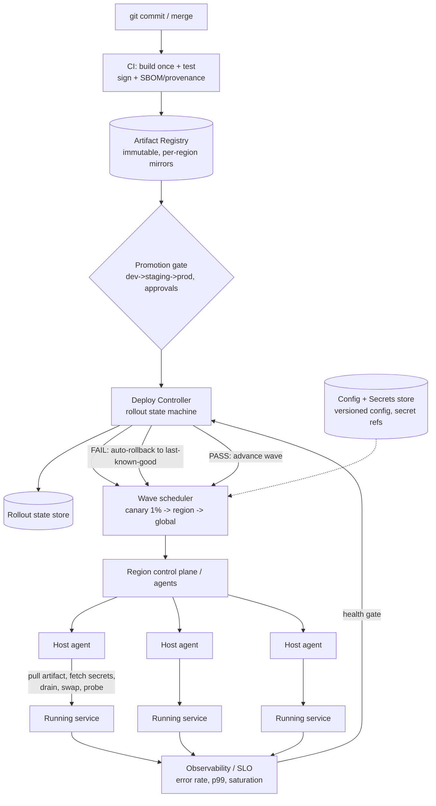

# B15 — Design a code deployment / release system (commit to fleet)

Design the system that takes a single git commit and safely lands it on thousands of production servers across multiple regions — building an artifact, promoting it through environments, rolling it out progressively with health checks, and **automatically rolling back** when it misbehaves. It tests core **developer-experience and release-engineering** judgment: artifact promotion, rollout strategies (blue-green, canary, rolling), progressive delivery, config/secrets handling, observability, and the failure containment that keeps one bad commit from taking down the fleet. Google asks it because safe, fast deployment is the backbone of DevEx, and getting "a commit onto thousands of machines without an outage" right requires reasoning about blast radius, not just plumbing.

## Lead with this — your résumé hook

"I built CI/CD with automated rollback, so I'll design for the thing that actually matters in production: a bad commit must never reach the whole fleet. The unit of safety is **blast radius** — I promote an immutable artifact through environments, roll it out in waves (canary -> region -> global) gated by health checks against SLO baselines, and **automatically roll back** the moment error rate or latency regresses. I'll treat config and secrets as versioned, separately-promotable artifacts, and make every release observable and reversible." Lead with the automated-rollback experience — it signals you've felt the pain of a bad deploy and designed the guardrails.

## 1) Clarify — questions to ask the interviewer

- **What are we deploying:** a single service binary/container, or heterogeneous services with different runtimes? Containers + an orchestrator simplify the substrate; bare-metal binaries change the agent design.
- **Fleet shape & scale:** how many servers/instances, how many distinct services, how many regions/zones? Thousands of servers across N regions sets the wave structure.
- **Deploy frequency & lead time:** are we optimizing for many deploys/day (DevEx) or rare, heavily-gated releases? This drives how much automation vs manual approval.
- **Rollout strategy expectation:** is zero-downtime required (then blue-green or rolling, never stop-the-world)? Is canary/progressive delivery in scope?
- **Health signal:** what defines "healthy" — process up, readiness probe, or SLO metrics (error rate, latency, saturation)? Automated rollback needs a real signal, not just "process started."
- **Rollback semantics:** is the previous artifact always kept warm for instant rollback? Are DB schema changes involved (which are not trivially reversible)?
- **Config & secrets:** are config and secrets deployed with the binary or separately? Can a config change alone trigger a rollout? Where do secrets come from?
- **Stateful vs stateless services:** stateless rolls easily; stateful (databases, leader-elected services) need careful ordering and draining.
- **Approval & compliance:** required manual approvals, change windows, audit trail, multi-party sign-off for sensitive services?
- **Consistency of version across fleet:** is a brief mixed-version state acceptable during rollout (almost always yes), and must old/new versions be wire-compatible?

**What the interviewer is signaling:** they want to see that you optimize for **safety and blast-radius containment**, not just "copy the binary and restart." The strong signals are: proposing **progressive delivery with automated, metric-driven rollback** unprompted; treating the artifact as **immutable and promoted** (build once, deploy many) rather than rebuilt per environment; and raising the hard cases (schema migrations, secrets, mixed-version compatibility) yourself. "SSH and restart" is an L5 answer; "canary gated on SLOs with auto-rollback and bounded blast radius" is L6.

## 2) Functional Requirements (FR)

**In-scope**
- CI: on commit, build once -> immutable, versioned artifact (container image / package) with provenance.
- Artifact registry with content-addressed, immutable versions.
- Promotion through environments (dev -> staging -> prod) with the **same artifact** (no rebuild).
- Rollout strategies: rolling, blue-green, and canary / progressive delivery.
- Health checks (readiness + SLO metric gates) driving rollout progression.
- Automatic rollback on health regression; one-click manual rollback.
- Config + secrets as versioned, separately-promotable inputs.
- Multi-region, multi-wave rollout with bounded blast radius.
- Observability: per-release dashboards, deploy events, audit log, who/what/when.

**Out-of-scope (defer)**
- The CI build internals (compilers, test runners) beyond producing an artifact + signal.
- Database migration *execution* engine details (we cover ordering/strategy, not a migration tool).
- Full infra provisioning / IaC (assume the fleet exists; we deploy onto it).
- Feature-flag platform internals (complementary; mention decoupling deploy from release).

## 3) Non-Functional Requirements (NFR)

| Dimension | Target & rationale |
|---|---|
| Scale | 10K+ servers, hundreds of services, 3–5 regions; hundreds of deploys/day. |
| Rollout speed | Canary to full-global in < 60 min for a normal change; emergency rollback in < 5 min. |
| Availability | Zero-downtime deploys (always-rolling, never stop-the-world); deploy system itself 99.9%+. |
| Safety | Bad change must be contained to ≤ canary blast radius before auto-rollback (e.g., ≤1% then ≤1 region). |
| Consistency | Eventually-consistent fleet version during rollout; old/new must be wire-compatible (mixed-version safe). |
| Durability | Immutable artifacts retained for rollback (keep N prior versions); audit log durable + tamper-evident. |
| Observability | Every deploy emits structured events; health gates read live SLO metrics. |
| Security | Signed artifacts (provenance/SBOM), least-privilege deploy agents, secrets never baked into images, full audit. |

## 4) Back-of-envelope estimation

```
Fleet & rollout math
  10,000 servers, rolling in waves.
  Wave plan (blast-radius bounded):
    canary  = 1%   = 100 servers
    region1 = ~20% = 2,000 servers
    ... 5 regions ~2,000 each -> full fleet
  If each wave bakes ~10 min to gather a stable SLO signal:
    canary(10) + 5 regions(10 each) ~ 60 min to global  (matches target)

  Concurrency / agent fan-out
    Updating 2,000 servers/region; if 200 in-flight at a time, 10 batches/region.
    Health gate between batches -> contained blast radius per batch.

Artifact storage
  Avg image ~500 MB; 200 services * 10 retained versions = 2,000 artifacts
    2,000 * 500 MB = 1 TB registry (small) ; replicate per region for pull locality
  Pull bandwidth: 10K servers * 500 MB on a fleet-wide deploy = 5 TB transferred
    -> use per-region registry mirrors + P2P/lazy pull to avoid WAN saturation

Deploy event volume
  Hundreds of deploys/day * 10K servers * a few events each
    ~ low millions of events/day -> structured event store + dashboards (cheap)

Rollback warmth
  Keep previous artifact pre-pulled on hosts (or blue-green idle color) so rollback
  is "flip pointer + restart", not "re-download" -> rollback < 5 min.
```

## 5) API design

```
# Trigger / pipeline
POST /v1/deploy
  { "service":"search-fe", "artifact":"sha256:...", "from_env":"staging",
    "to_env":"prod", "strategy":"canary",
    "rollout":{ "waves":["1%","region:us","region:eu","global"],
                "bake_minutes":10 },
    "health_gate":{ "error_rate_max":0.5, "p99_ms_max":250, "baseline":"prev" } }
  -> { "rollout_id":"...", "status":"running", "current_wave":"1%" }

# Promotion (same artifact, no rebuild)
POST /v1/promote { service, artifact, from_env, to_env }   # gated by approvals

# Control
POST /v1/rollouts/{id}/pause
POST /v1/rollouts/{id}/resume
POST /v1/rollouts/{id}/rollback   # to last-known-good artifact, fleet-wide or per wave
GET  /v1/rollouts/{id}            # wave status, health per wave, per-server state

# Artifact registry
PUT  /v1/artifacts   { service, content_hash, sbom, signature }   # immutable
GET  /v1/artifacts/{service}?env=prod   # current desired version per env

# Config / secrets (versioned, separate)
PUT  /v1/config/{service}   { version, values }            # promotable like artifacts
POST /v1/secrets/grant      { service, secret_ref }        # ref, never the value

# Agent (host -> control plane), pull-based
GET  /v1/agent/desired-state?host=...   -> { artifact, config_version, secret_refs }
POST /v1/agent/report     { host, version, health, phase }
```

## 6) Architecture — request & data flow

**(a) ASCII layered flow**

```
        Developer git commit / merge
                 |
                 v
        [ CI: build + test ]  build ONCE -> immutable artifact
                 |             attach provenance/SBOM + sign
                 v
        [ Artifact Registry ]  content-addressed, immutable, per-region mirrors
                 |
                 v
        [ Promotion gate ]  dev->staging->prod, approvals, same artifact (no rebuild)
                 |
                 v
        [ Deploy Controller (control plane) ]   the brain: owns rollout state machine
            |        |              |
            |   reads desired   writes plan
            |   health gate     (waves, blast radius)
            v        v              v
   [ Observability / SLO ]   [ Rollout state store ]   [ Config + Secrets store ]
   error rate, p99,                |  current wave        versioned config; secret REFS
   saturation (live)              v                       (values fetched at runtime)
            ^               WAVE SCHEDULER
            |        canary 1% -> region -> global, bake + gate between waves
            |               |
            |               v   (pull-based desired-state)
            |        [ Region control plane / agents ]
            |          /        |          \
            |         v         v           v
            |    [ Host agent ][ Host agent ][ Host agent ]  thousands; each:
            |       pull artifact (region mirror), fetch secrets, drain,
            |       swap (rolling/blue-green), readiness probe, report health
            |               |
            +------ health signal feeds gate -> PASS advance / FAIL auto-rollback
```

**Deploy (write) path:** a merge triggers **CI**, which builds the artifact **exactly once**, attaches provenance/SBOM, **signs** it, and pushes it to the immutable **registry** (mirrored per region for pull locality). Promotion moves that *same* artifact through environments behind approval gates — never a rebuild, so what was tested is what ships. A `deploy` request hands the **Deploy Controller** an artifact + a **rollout plan** (waves + bake time + health gate). The controller's **wave scheduler** advances blast-radius-bounded waves: **canary 1% -> one region -> remaining regions -> global**. For each wave it sets the **desired state** in the rollout store; **host agents pull** their desired state (artifact version, config version, secret refs), download the artifact from the region mirror, **drain** in-flight traffic, **swap** the running version (rolling batch or blue-green color flip), run a **readiness probe**, and **report health** back. Between waves the controller **bakes** for a few minutes and evaluates the **health gate** against an SLO baseline (error rate, p99, saturation vs the prior version). **Pass -> advance** to the next wave; **fail -> automatic rollback** of the affected scope to the last-known-good artifact (instant because the prior version is pre-pulled / the old blue-green color is still warm).

**Read / steady-state path:** agents continuously reconcile actual vs desired state (like a control loop), so a host that crashes and restarts converges to the correct version. Operators read per-rollout dashboards (wave status, per-region health, per-host version) and can `pause`/`resume`/`rollback` at any time. Secrets are **referenced**, not baked: the agent fetches secret *values* at runtime from the secrets store via short-lived, least-privilege credentials, so images and config never contain plaintext secrets.

**(b) Mermaid flowchart**



## 7) Data model & storage choices

- **Artifact registry: content-addressed, immutable object store.** First-principles: immutability + content addressing (hash = identity) guarantees that what you tested is byte-for-byte what you deploy and makes rollback trivial (an older hash is always retrievable). Mirror per region for pull locality; retain the last N versions per service for instant rollback.
- **Rollout state: a small strongly-consistent store** (the control plane's database) holding the rollout state machine — desired version per (service, env, wave), current wave, per-host reported version/health. This must be consistent (it's the source of truth for "what should be running where"), but it's low-volume, so a replicated SQL/consensus-backed KV fits.
- **Config: versioned key/value per service+env**, promotable on the same gates as artifacts, so a config change is a first-class, auditable, rollback-able deploy. Decouple from the binary so a config-only change doesn't require a rebuild.
- **Secrets: a dedicated secrets manager holding values; the deploy system stores only references.** First-principles: blast radius and least privilege — secrets must never be baked into images or config, and agents fetch them at runtime with short-lived, scoped credentials. Rotation happens without redeploying the binary.
- **Deploy/audit events: append-only event log -> dashboards + tamper-evident audit store.** Every state transition (build, promote, wave advance, rollback, who approved) is an immutable event for observability and compliance.
- **Health/SLO metrics: time-series store** (the existing monitoring system) queried by the health gate — error rate, latency percentiles, saturation, compared against a baseline window.

## 8) Deep dive

**Deep dive A — progressive delivery + automated, metric-driven rollback (the safety crux).** The whole point is to **bound blast radius and detect badness before it's everywhere**. The rollout is a **state machine over waves** of increasing scope: `canary (1%) -> single region -> remaining regions -> global`. Within each wave, hosts update in **batches** (e.g., 200 at a time) so even a wave is sub-divided. After each wave (and ideally each batch) the controller **bakes** for a few minutes to gather a statistically meaningful sample, then evaluates a **health gate**: compare the new version's **error rate, p99 latency, and saturation** against a **baseline** — either the previous version running side-by-side (true canary analysis: same traffic, A/B the metrics) or a historical baseline. If any metric regresses beyond threshold, the controller **automatically rolls back** the affected scope to the **last-known-good** artifact. Rollback is fast because the prior version is **pre-pulled on hosts** (or, with blue-green, the old color is still running idle — rollback is just flipping the traffic pointer). The two strategies trade off: **canary analysis** catches subtle regressions (latency, error-rate creep) that a binary readiness probe misses, which is exactly why "process is up" is an insufficient health signal. The decisive design choice is making rollback **automatic and metric-driven**, not a human noticing a graph at 3am.

**Deep dive B — rollout strategies, mixed-version safety, and the hard cases (correctness crux).** The strategies:

| Strategy | How | When |
|---|---|---|
| **Rolling** | Replace instances in batches in place; drain then swap | Default; zero-downtime, cheap, but a brief mixed-version window |
| **Blue-green** | Stand up full new "green" fleet, flip traffic, keep "blue" warm | Instant rollback, no mixed version at flip; costs 2x capacity briefly |
| **Canary / progressive** | Send a small % of traffic/hosts to new version, analyze, expand | Best regression detection; the recommended default with auto-rollback |

**Mixed-version safety:** during any rolling/canary deploy the fleet runs **two versions simultaneously**, so old and new must be **wire-compatible** — this forces **backward/forward-compatible API and data changes** and the **expand/contract (parallel-change) pattern** for anything schema-related. **Database migrations** are the genuinely hard case because they're not trivially reversible: never ship a destructive schema change coupled to a binary rollout. Instead: (1) **expand** — add the new column/table, deploy code that writes both old+new but reads old; (2) **migrate** data; (3) flip reads to new; (4) **contract** — remove old after the new version is fully baked and irreversible-rollback risk has passed. This keeps every intermediate state both forward- and backward-compatible so a rollback is always safe. **Decouple deploy from release** via feature flags: ship the binary dark, then turn the feature on as a separate, instantly-reversible action — so a rollout never forces a risky feature live, and a bad feature doesn't require a full redeploy to disable.

## 9) Key tradeoffs

| Decision | Choice & why | Tradeoff accepted |
|---|---|---|
| Artifact handling | Build once, promote immutable artifact | Slightly more registry storage; gain test==prod fidelity + trivial rollback |
| Default strategy | Canary / progressive with auto-rollback | More orchestration + a baseline signal; gain smallest blast radius |
| Health signal | SLO metrics (not just process-up) | Needs bake time + statistical care; catches subtle regressions |
| Blue-green vs rolling | Blue-green for instant rollback on risky changes; rolling otherwise | Blue-green needs ~2x capacity briefly; rolling has a mixed-version window |
| Agent model | Pull-based reconcile loop | Slightly higher steady-state load; gain self-healing + no push fan-out SPOF |
| Schema changes | Expand/contract, decoupled from binary rollout | Multi-step, slower; gain always-safe rollback |
| Deploy vs release | Decouple via feature flags | Extra flag plumbing; gain instant, redeploy-free feature kill switch |
| Secrets | References + runtime fetch | Runtime dependency on secrets store; gain no plaintext in images, easy rotation |
| Fleet consistency | Eventually consistent during rollout | Brief mixed versions; required for zero-downtime |

## 10) Bottlenecks & failure modes

- **Bad commit reaching the whole fleet:** the cardinal failure. *Mitigation:* blast-radius-bounded waves + automated metric-driven rollback contain it to ≤ canary scope.
- **Registry / pull thundering herd:** 10K hosts pulling a 500 MB image at once saturates the network. *Mitigation:* per-region registry mirrors, P2P/lazy layer pull, and staggered batches so pulls are spread, not simultaneous.
- **Health gate false-negative (bad version looks healthy):** readiness passes but the service is subtly broken. *Mitigation:* gate on real SLO canary analysis (compare against baseline), not just process-up; longer bake for risky services.
- **Health gate false-positive (good version rolled back on noise):** flapping rollbacks. *Mitigation:* require statistically significant sample, hysteresis/thresholds, and a "hold" before rollback to avoid reacting to a transient blip.
- **Control plane SPOF:** if the deploy controller dies mid-rollout, deploys stall. *Mitigation:* make it HA/replicated with persisted rollout state so it resumes; agents keep reconciling to last desired state meanwhile (fail-safe, not fail-open).
- **Non-reversible schema migration coupled to rollout:** rollback corrupts data. *Mitigation:* expand/contract, decouple migrations from binary, never ship destructive change with the deploy that depends on it.
- **Stuck/partial rollout (some hosts won't converge):** *Mitigation:* per-host timeout + retry, quarantine unhealthy hosts, alert; don't let a stuck minority block or silently skew the health signal.
- **Secrets store unavailable at deploy:** agents can't fetch secrets. *Mitigation:* cache last-good secret leases with TTL, degrade gracefully, and treat secrets-store availability as a deploy dependency to monitor.
- **Cascading failure from a config-only change:** config rolls out faster than code review catches. *Mitigation:* treat config as a deploy with the same waves + health gates + rollback, not an unguarded push.

## 11) Scale 10x / evolution

- **First to break: registry pull bandwidth and the control plane's per-host bookkeeping** at 100K+ hosts. Evolve to hierarchical region/zone control planes (the global controller commands region controllers, which command hosts) and P2P artifact distribution so the WAN isn't the bottleneck.
- **More services / more deploys/day:** move from per-service manual orchestration to a fully declarative, GitOps-style desired-state model where the fleet continuously reconciles to a versioned spec, and the controller just advances waves.
- **Smarter rollback:** add automated canary analysis with anomaly detection / statistical tests (not fixed thresholds), and per-service learned baselines, so gates adapt to each service's normal variance.
- **Multi-region nuance:** order waves by region risk/traffic (lowest-traffic region first), respect data-residency and change-window constraints per region, and never deploy to all regions simultaneously (correlated-failure avoidance).
- **Cell-based / blast-radius architecture:** partition the fleet into independent cells and deploy cell-by-cell so even a global rollout is a sequence of fully isolated blast radii.
- **Policy as code:** encode approval, change-freeze, and compliance rules declaratively so the pipeline enforces them automatically as deploy volume grows.

## 12) Interviewer probes & follow-ups

- **"How do you make sure one bad commit doesn't take down everything?"** Blast-radius-bounded progressive rollout (canary 1% -> region -> global) with a bake + SLO health gate between waves, and automatic rollback to last-known-good the moment a metric regresses — so badness is contained to the canary before it spreads.
- **"What's your health signal — how do you know a deploy is bad?"** Not just process-up. I run canary analysis comparing the new version's error rate, p99 latency, and saturation against a baseline (ideally the prior version taking the same traffic side-by-side); statistically significant regression triggers rollback.
- **"How is rollback so fast?"** The prior artifact is pre-pulled on hosts (or with blue-green the old color is still warm), so rollback is a pointer flip + restart, not a re-download — under 5 minutes fleet-wide.
- **"Two versions run at once during a rollout — how do you not break?"** I require old/new wire compatibility and use expand/contract for any data change, so every intermediate mixed-version state is forward- and backward-compatible and a rollback is always safe.
- **"A deploy includes a DB schema change — walk me through it."** I decouple it from the binary rollout: expand (add new schema, code writes both), migrate data, flip reads, then contract (drop old) only after the new version is fully baked. Never ship a destructive change with the deploy that depends on it, because that makes rollback unsafe.
- **"Blue-green vs canary vs rolling — when each?"** Rolling is the cheap zero-downtime default; blue-green when I want instant rollback and no mixed-version window (at ~2x capacity cost); canary/progressive when I need to catch subtle regressions — which is my default for risky/high-traffic services, paired with auto-rollback.
- **"Where do secrets live?"** In a dedicated secrets manager; the deploy system stores only references. Agents fetch values at runtime with short-lived, least-privilege credentials, so nothing plaintext is ever baked into an image or config and rotation needs no redeploy.
- **"What if the deploy controller crashes mid-rollout?"** It's HA with persisted rollout state, so it resumes where it left off; meanwhile agents keep reconciling to the last desired state (fail-safe). A crash pauses progress, it doesn't push a half-baked global change.
- **"Config change vs code change — handled differently?"** No — a config change is a first-class deploy with the same waves, health gates, and rollback. Unguarded config pushes are a classic cause of outages, so I refuse to treat them as a special fast path.

## 13) 60-minute flow cheat-sheet

| Time | Phase | What to do |
|---|---|---|
| 0–6 min | Clarify | Fleet size/regions, container vs binary, health signal, schema changes, deploy frequency |
| 6–9 min | FR/NFR | Lock zero-downtime, bounded blast radius, immutable artifacts, auto-rollback |
| 9–14 min | Estimation | Wave math (canary->region->global ~60 min), registry/pull bandwidth, rollback warmth |
| 14–20 min | API + high-level arch | Build-once/promote, deploy controller + wave scheduler, pull agents; draw both diagrams |
| 20–26 min | Walk deploy & steady-state paths | Promotion (no rebuild), wave gate, agent drain/swap/probe/report, reconcile loop |
| 26–42 min | Deep dive | (A) progressive delivery + metric-driven auto-rollback; (B) strategies + mixed-version + schema |
| 42–49 min | Tradeoffs + failures | Blue-green vs canary, gate false +/-, registry herd, schema rollback, control-plane HA |
| 49–55 min | Scale 10x | Hierarchical control planes, P2P distribution, GitOps, cell-based blast radius |
| 55–60 min | Probes | Bad-commit containment, health signal, fast rollback, schema-change walk-through |
