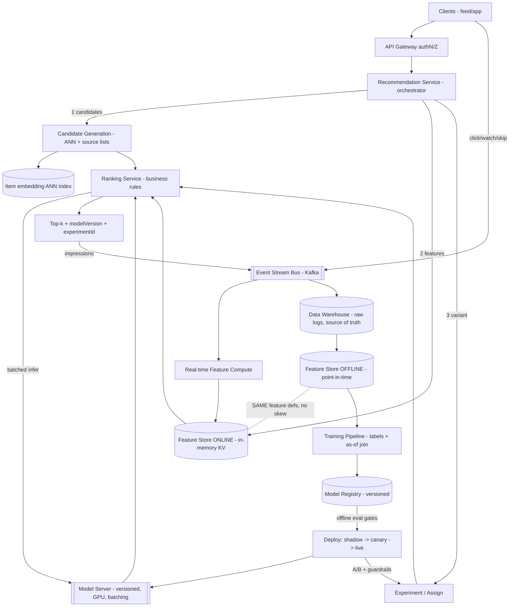

# B16 — Design an ML recommendation / model-serving system

This tests whether you can design the full **ML production stack**: a **feature store** bridging offline training and online serving, a **versioned model server** doing **low-latency inference**, the canonical **candidate-generation -> ranking** two-stage recommender, **A/B testing + offline eval**, request **batching**, and a **feedback loop** that closes data back into training. Google asks it because 2026 loops weave AI/ML system design into the bar and the role's **AI Fluency** expectation is explicit — they want to see you reason about training/serving skew, online vs offline, and model lifecycle, not just CRUD services.

## Lead with this — your résumé hook

"I work hands-on at the intersection of ML systems and product — **RAG and AI-assisted developer workflows** — so I think in terms of the full lifecycle: features computed consistently across offline training and online serving, **versioned models** rolled out behind experiments, **low-latency inference** with request batching, and a **feedback loop** that turns user interactions back into training data. So I'll design this as a production ML system with the failure modes I actually care about — training/serving skew, stale features, and safe model rollout — not just a model behind an endpoint."

That projects AI Fluency and lifecycle thinking — exactly the Staff/AI signal this question is built to elicit.

## 1) Clarify — questions to ask the interviewer

- **What are we recommending, to whom?** Feed items / videos / products / "people you may know"? Catalog size (candidate pool of **10^6–10^9**?) and user base (**10^8–10^9**)? This sets the candidate-generation problem.
- **Surface + latency budget:** Is this a synchronous feed load where the **end-to-end budget is ~100–200 ms** (so ranking has tens of ms), or can we precompute recs offline? I'll assume online serving with a tight budget. Critical constraint.
- **Objective:** What are we optimizing — clicks, watch-time, conversions, long-term engagement, diversity? Single objective or **multi-objective** (and do business rules/constraints apply, e.g. freshness, no-repeats, policy)?
- **Scale / QPS:** Recommendation requests/sec (**10^4–10^6**?), and how many candidates scored per request? Drives the batching + serving fleet.
- **Freshness needs:** Must recs reflect **just-happened** behavior (you watched X 10s ago)? That dictates **real-time features** and possibly online candidate sources, not just nightly batch.
- **Cold start:** New users and new items with no history — how important? Drives fallback/exploration strategy.
- **Feature types:** User features, item features, **real-time context** (session, time, device)? Where do they come from and how fresh must each be? This sizes the **feature store**.
- **Eval + experimentation:** How do we measure a model is better **before** shipping (offline) and **after** (online A/B)? Is there an existing experiment platform? What guardrail metrics?
- **Consistency / correctness:** Is **training/serving skew** a known concern (it always is)? Same feature definitions both sides? Acceptable to occasionally serve a slightly stale feature?
- **Constraints:** Cost ceiling on inference (GPU expensive), model size, on-device vs server, fairness/policy constraints on what can be recommended.

**What the interviewer is signaling:** they want the **two-stage architecture** (cheap candidate generation narrowing 10^9 -> ~hundreds, then expensive ranking), a real **feature store** with the **offline/online duality** (and the **training/serving skew** problem named and solved), **model versioning + safe rollout (A/B/shadow/canary)**, **request batching** for inference throughput, and the **feedback loop** (logged interactions -> labels -> retrain) — closing the ML system. Naming training/serving skew and the candidate-gen vs ranking split unprompted is the strongest signal here.

## 2) Functional Requirements (FR)

**In-scope**

- Serve a **ranked list of recommendations** for a user+context within a tight latency budget.
- **Candidate generation:** narrow a huge item pool (10^9) to a few hundred plausible candidates (multiple sources: collaborative-filtering/embedding ANN, recently-trending, follow-graph, etc.).
- **Ranking:** score candidates with a heavier model using rich features; apply business rules (dedup, diversity, freshness, policy filters).
- **Feature store:** serve features **online** (low-latency lookup) and produce them **offline** (for training) from the **same definitions** (no skew).
- **Model serving:** host **versioned** models; low-latency inference with **request batching**; hot-swap/rollback.
- **Experimentation:** **A/B test** models/rankers; **offline eval** before shipping; guardrail metrics.
- **Feedback loop:** log served recs + user interactions (clicks/watch/skip) -> labels -> feature/label tables -> retraining.

**Out-of-scope (defer)**

- Training the models themselves at the algorithm level (we design the *system*; mention training pipeline, don't derive the loss).
- The downstream UI/feed rendering.
- Full data-platform build-out (assume a stream bus + warehouse exist).
- Ads auction / pricing (adjacent; mention if recs are monetized).

## 3) Non-Functional Requirements (NFR)

| Dimension | Target & rationale |
|---|---|
| Scale | 10^8–10^9 users; item pool 10^6–10^9; **10^4–10^6 rec QPS**; hundreds of candidates scored/request -> millions of inferences/sec at the ranker. |
| Latency | End-to-end rec **p99 < 150–200 ms**; within it, **candidate gen ~10–30 ms**, **feature fetch < 10 ms**, **ranking inference ~20–50 ms** (batched on GPU). |
| Availability | **99.9%+** for the serving path; **graceful degradation** — if the ranker is down, fall back to a cheaper model or cached/popular recs, never a blank feed. |
| Consistency | **Online features eventually consistent / bounded-stale**; the hard requirement is **no training/serving skew** — identical feature logic offline and online. |
| Freshness | Real-time features (session/just-now behavior) within **seconds**; batch features (long-term affinities) within **hours**. |
| Durability | Interaction logs durable (they're the training-data source of truth) — 11 nines in the warehouse / log store. |
| Cost | Inference (GPU) is the cost driver — **batching**, candidate pruning, model distillation, and caching keep it bounded. |
| Eval/Safety | Every model change gated by offline metrics + online A/B with guardrails; instant rollback. |

## 4) Back-of-envelope estimation

```
Users:        5e8 ; item pool: 1e8 candidates
Rec QPS:      1e5 peak (feed loads, refreshes)

Two-stage funnel per request:
   Candidate generation: 1e8 -> ~500 candidates
     (NOT scoring 1e8 per request -> that's the whole reason for stage 1;
      use ANN over embeddings + precomputed source lists)
   Ranking: score ~500 candidates with the heavy model
     -> inferences/sec at ranker = 1e5 req/s * 500 = 5e7 inferences/s
     -> MUST batch: group candidates per request (and across requests) into
        GPU batches; a single forward pass scores a batch of 500 in a few ms.

Feature fetch: per request, fetch user features (1) + context (1) + item features (500)
   -> ~500 item-feature lookups/request -> 1e5 * 500 = 5e7 feature reads/s
   -> served from an in-memory online feature store (KV), pre-joined where possible.
   Cache user/item feature vectors; item features are shared across requests (hot).

Online feature store size:
   item features: 1e8 items * ~1 KB = ~100 GB
   user features: 5e8 users * ~1 KB = ~500 GB
   -> sharded in-memory KV (hundreds of GB across the fleet), TTL'd.

Embeddings for ANN candidate gen:
   1e8 items * 256-dim int8 = ~25 GB vector index (+graph) -> sharded ANN, in-RAM.

Logging (feedback loop): every served rec + impression + interaction
   1e5 req/s * (1 list + interactions) -> ~1e6+ events/s into the stream bus
   -> durable log -> warehouse -> training tables. This is the data flywheel.

Latency budget (p99 ~150 ms):
   cand-gen ~20 ms + feature fetch ~10 ms + rank (batched) ~40 ms + glue/overhead.
```

The decisive insight: **you cannot score 10^8 items per request** — hence the **two-stage funnel** (cheap ANN/precomputed candidate gen -> heavy ranking on ~500), and the ranker only survives because of **request batching** (turning 5e7 inferences/s into batched GPU forward passes) plus heavy **feature caching** (item features are shared across users).

## 5) API design

```
# Serving
GET  /recommend?userId=&context=&k=20      (context: session, device, time, surface)
     -> {items:[{itemId, score, reason}], modelVersion, experimentId, traceId}

# Feature store
GET  feature_store.online_get(entityIds, featureSet) -> {entity: {feature: value}}   # <10ms
PUT  feature_store.write(entity, features, eventTime)                                 # streaming ingest
     feature_store.offline_get(entityIds, featureSet, asOfTime) -> training dataframe # point-in-time correct

# Model serving (internal)
POST infer(modelName, version, batch[features]) -> batch[scores]    # batched
GET  /models -> [{name, version, status: shadow|canary|live|rollback}]
POST /models/{name}/rollout {version, trafficPct}                   # progressive

# Experiment + feedback
GET  experiment.assign(userId, surface) -> {experimentId, variant, modelVersion}
POST log.interaction {userId, itemId, action(click|watch|skip), servedRecId, ts}  # feedback loop
```

`offline_get` is **point-in-time correct** (as-of the label's timestamp) — the single most important API for avoiding label leakage and training/serving skew. Serving responses echo `modelVersion` + `experimentId` so logs can attribute outcomes to the exact model/variant that produced them.

## 6) Architecture — request & data flow

THE centerpiece. ASCII layered flow first, then a tailored Mermaid flowchart.

### (a) ASCII layered block diagram

```
   ===================  ONLINE SERVING PATH  ===================
   Clients (feed / app / API)
        |
        v
   [ CDN / Edge ] (only for cacheable surfaces)        [ Global LB / GeoDNS ]
        |                                                     |
        +-----------------------------------------------------+
                                  v
                        [ API Gateway ]  authN/Z, rate-limit
                                  v
                     [ Recommendation Service ]  (orchestrator, owns the budget)
                                  |
        +-------------------------+------------------------------+
        v (1)                     v (2)                          v (3)
 [ Candidate Generation ]   [ Feature Store (ONLINE) ]    [ Experiment / Assign ]
  1e8 -> ~500 via:           in-memory KV: user/item/        userId -> variant,
  - ANN over item embeds      context features (<10ms);       modelVersion
  - precomputed source lists  shared item features cached
  - trending / follow-graph        |
        \                          | features for the ~500 candidates
         \                         v
          \------------> [ Ranking Service ] ---infer batch---> [ Model Server (versioned, GPU) ]
                              |  apply business rules            request batching, hot-swap,
                              |  (dedup, diversity, policy)      shadow/canary/live
                              v
                     ranked top-k  ----> response (items + modelVersion + experimentId)
                              |
                              +--> log served list (impressions) ---------------+
                                                                                |
   ===================  FEEDBACK + OFFLINE PATH  ===================            |
   user interactions (click/watch/skip) -> [ Event Stream Bus (Kafka) ] <-------+
                                  |
              +-------------------+--------------------+
              v                                        v
   [ Real-time Feature Compute ]              [ Data Warehouse / Lake ]
    (streaming: session, counts)               (durable raw logs, source of truth)
              |  write online features                |
              v                                        v
   [ Feature Store (ONLINE)  ]  <==SAME DEFS==>  [ Feature Store (OFFLINE) ]
    (serving)                   (no skew!)        (point-in-time correct tables)
                                                       |
                                                       v
                                            [ Training Pipeline ]  (build labels from logs,
                                                       |            join features as-of time,
                                                       |            train candidate-gen + ranker)
                                                       v
                                            [ Model Registry ]  (versioned artifacts, metadata)
                                                       |
                                       offline eval (replay/held-out) gates promotion
                                                       v
                                       deploy -> [ Model Server ] (shadow -> canary -> live)
                                                       |
                                            online A/B + guardrails -> promote or rollback
```

**Online serving path.** Client -> Gateway -> **Recommendation Service** (the orchestrator that owns the latency budget). It does three things, mostly in parallel: (1) **Candidate Generation** narrows the 10^8 pool to ~500 — via **ANN over item embeddings** (user embedding -> nearest item embeddings), plus **precomputed source lists** (trending, follow-graph, recently-engaged), unioned and deduped; (2) it fetches **features** for the user, context, and the ~500 candidate items from the **online feature store** (in-memory KV, <10 ms, item features cached/shared across requests); (3) it asks the **Experiment service** which model **variant/version** this user is on. It then calls the **Ranking Service**, which **batches** the ~500 candidates into a single inference call to the **versioned Model Server** (GPU), gets scores, applies **business rules** (dedup, diversity, freshness, policy), and returns the **top-k** — echoing `modelVersion` + `experimentId`. If anything in the heavy path fails, it **degrades gracefully** (cheaper model, or cached/popular recs).

**Feedback + offline path (the flywheel).** Every served list (impressions) and every **interaction** (click/watch/skip) is logged to the **Event Stream Bus**. Two consumers: **Real-time Feature Compute** turns the stream into fresh **online features** (session activity, rolling counts) written back to the online store within seconds; and the **Data Warehouse** durably stores raw logs as the **source of truth**. The **Training Pipeline** builds **labels** from interactions, joins features **point-in-time-correctly** from the **offline feature store**, and trains the candidate-gen + ranking models. Artifacts land in the **Model Registry** (versioned). **Offline eval** (replay on held-out logs, nDCG/AUC) **gates promotion**; the model is then deployed **shadow -> canary -> live**, watched under **online A/B with guardrails**, and **promoted or rolled back**. The two feature stores share **identical feature definitions** — that's the explicit defense against **training/serving skew**.

### (b) Mermaid flowchart



## 7) Data model & storage choices

**Online feature store — in-memory KV (low-latency lookup).** `entityId (user|item) -> {feature: value}`, TTL'd, sharded across the fleet; item features heavily cached (shared across users). *First-principles:* the serving path needs **<10 ms** to fetch features for ~500 candidates per request at 10^5 QPS; a disk DB can't, and recomputing features per request would blow the budget and risk skew. So features are **precomputed/streamed** and just **looked up**.

**Offline feature store — columnar warehouse tables, point-in-time correct.** Same feature definitions materialized historically with event timestamps so training joins features **as-of** each label's time (no leakage of future data). *First-principles:* training and serving must use the **same feature logic**; the offline/online split with shared definitions is exactly how you kill **training/serving skew** — the system's most insidious bug.

**Item embedding index — ANN (sharded, in-RAM)** for candidate generation: user/context embedding -> nearest item embeddings over 10^8 items. *First-principles:* candidate generation must be **sub-linear** in catalog size; brute-force over 10^8 per request is impossible, so approximate nearest neighbor over learned embeddings turns it into a ~10–30 ms lookup.

**Model Registry + artifact store** — versioned model binaries + metadata (training data range, metrics, feature schema, lineage). *First-principles:* **versioning is mandatory** for safe rollout/rollback, reproducibility, and attributing online outcomes to the exact model that produced them.

**Event log / stream bus (Kafka) + Data Warehouse** — durable append-only interaction logs are the **source of truth for labels**; the warehouse is the analytical store the training pipeline reads. *First-principles:* the model is only as good as its data flywheel; losing interaction logs means losing the ability to improve, so these are 11-nines durable.

**Model Server** — GPU-served, **request-batching**, holds multiple **versions** simultaneously (for shadow/canary), hot-swappable. Ranker and candidate-gen models are independent deployables.

## 8) Deep dive

The crux is **(A) the two-stage funnel (candidate generation -> ranking)**, **(B) the feature store + training/serving skew**, **(C) low-latency inference via batching + versioning/rollout**, and **(D) the feedback loop + A/B/eval**. Spend the most time on A, B, C.

**A. Two-stage funnel: candidate generation then ranking.**

- **Why two stages:** you cannot run a heavy model over 10^8 items per request (5e7 inferences just for one user). **Stage 1 (candidate generation)** is cheap and high-recall: narrow 10^8 -> ~500 using **ANN over embeddings** (two-tower model: user-tower embedding retrieves item-tower embeddings) plus **precomputed source lists** (trending, follow-graph, recently-engaged, co-visitation). Union + dedup. Optimized for *recall* (don't miss good items) and speed, not precision.
- **Stage 2 (ranking)** is expensive and high-precision: score the ~500 candidates with a heavy model using **rich features** (user x item interactions, real-time context). Optimized for ordering quality. Often **multi-objective** (predict click *and* watch-time *and* a long-term-value proxy) blended into one score, then **business rules** (dedup, diversity to avoid filter bubbles, freshness, policy/safety filters) re-shape the final list.
- **Sometimes a stage 1.5 (lightweight pre-ranker)** trims ~500 -> ~100 with a cheap model so the heavy ranker scores fewer items — a latency/quality knob.
- **Cold start:** new users -> popularity/context-based candidates + exploration; new items -> content-based features + an **exploration budget** (epsilon-greedy / bandit) so they get impressions to gather signal, balancing exploit vs explore.

**B. Feature store + training/serving skew (the signature ML-systems concern).**

- **The skew problem:** if training computes a feature one way (batch SQL over the warehouse) and serving computes it another way (online code path), the model sees **different feature distributions** in production than it trained on, and silently underperforms. This is the most common, most insidious ML production bug.
- **The fix — one definition, two materializations:** define each feature **once**; materialize it **offline** (historical, point-in-time correct, for training) and **online** (fresh, low-latency, for serving) from the **same logic**. The feature store guarantees parity. Serving *looks up* features; it doesn't recompute them ad hoc.
- **Point-in-time correctness:** training joins must use features **as they were at the label's event time**, never later values (which would leak the future and inflate offline metrics). The offline store enforces as-of joins.
- **Freshness tiers:** real-time features (session, last-N actions, rolling counts) are computed by **streaming** off the event bus and written to the online store within **seconds**; batch features (long-term affinities) refresh **hourly/daily**. The serving path reads whichever tier each feature lives in.
- **Feature monitoring:** watch online vs offline feature distributions for drift; alert when a feature's serving distribution diverges from training — early warning of skew or upstream breakage.

**C. Low-latency inference: batching + versioning + safe rollout.**

- **Request batching is what makes the ranker affordable:** group the ~500 candidates of a request (and, with a few-ms window, candidates across concurrent requests) into a **single GPU forward pass**. GPUs are throughput devices — batching turns 5e7 inferences/s into a tractable number of batched passes. Tune batch size vs the latency budget (bigger batch = better throughput but more queueing delay).
- **Model versioning:** the server holds multiple versions at once. **Rollout is progressive: shadow (run new model on live traffic, log but don't serve, compare) -> canary (small % of real traffic) -> ramp -> live**, with **instant rollback**. Versioned artifacts in the registry make this reproducible and auditable.
- **Serving optimizations:** model **distillation/quantization** to shrink the ranker; **caching** of user/item embeddings and shared item features; co-locate feature fetch with ranking to cut hops; **early-exit / cheaper fallback model** under load (graceful degradation).
- **Why not precompute all recs offline?** Stale — can't reflect just-happened behavior or real-time context, and 10^8 users x fresh context is too much to precompute. Online serving with real-time features is required for quality; precomputation is only a fallback.

**D. Feedback loop + A/B + offline eval (closing the system).**

- **The flywheel:** served lists + interactions -> stream bus -> labels (click=positive, skip=negative, with care around position bias) -> feature/label tables -> retrain -> deploy -> better recs -> more/better data. Logging the **exact modelVersion + experimentId** that served each list is essential to attribute outcomes correctly.
- **Offline eval gates promotion:** replay the new model on held-out logged data; compute ranking metrics (AUC, nDCG, calibration). A model that doesn't beat the incumbent offline never reaches live traffic. Beware **offline/online gap** — offline wins don't always translate, which is why online A/B is the final arbiter.
- **Online A/B:** randomized variant assignment, measure the **real objective** (engagement, watch-time) plus **guardrail metrics** (latency, diversity, policy violations, long-term retention proxies). Promote on a real, significant win; **roll back** instantly on guardrail regressions.
- **Position/exposure bias + feedback loops:** users only interact with what we *showed* them, so naive training reinforces itself. Mitigate with **exploration** (bandits), inverse-propensity weighting, and logging exposures so the model learns from non-clicks too.

## 9) Key tradeoffs

| Decision | Choice & why |
|---|---|
| Architecture | **Two-stage candidate-gen -> ranking** over single-stage scoring — can't run a heavy model on 10^8 items/request; cheap recall stage then expensive precision stage. |
| Serving | **Online inference with real-time features** over fully precomputed recs — precompute is stale and can't use just-happened context; precompute is only a degradation fallback. |
| Features | **Feature store: one definition, offline+online materializations** — the only robust defense against training/serving skew. Cost: infra + discipline. |
| Inference throughput | **Request batching on GPU** over per-request inference — turns 5e7 inferences/s into batched passes; cost is a few ms of batching delay. |
| Consistency | **Bounded-stale online features** over strong consistency — a feature seconds-old is fine; the hard guarantee is *parity with training*, not freshness. |
| Rollout | **Shadow -> canary -> A/B -> live with instant rollback** over big-bang deploy — models can regress in ways offline eval misses; de-risk progressively. |
| Eval | **Offline gate + online A/B** — offline is cheap and catches regressions early; online is the truth (offline/online gap is real). |
| Cold start / bias | **Exploration (bandit) budget** over pure exploitation — avoids self-reinforcing feedback loops and starves-new-items; cost is some short-term engagement. |
| Multi-objective | **Blend predicted click/watch/value + business rules** over single metric — optimizing clicks alone degrades long-term value and diversity. |

## 10) Bottlenecks & failure modes

- **Ranking inference cost/latency (the hot path):** scoring ~500 candidates at 10^5 QPS. *Mitigation:* request batching, a lightweight pre-ranker to trim candidates, distillation/quantization, GPU autoscaling, early-exit fallback under load.
- **Training/serving skew (the silent killer):** model quietly underperforms in prod. *Mitigation:* shared feature definitions via the feature store, point-in-time-correct training joins, feature-distribution monitoring (online vs offline), shadow-mode comparison before promotion.
- **Stale / missing features at serving:** a feature pipeline lags or a lookup misses. *Mitigation:* TTLs + defaults/imputation, monitor feature freshness, degrade to a model variant that doesn't need the missing feature.
- **Feedback loop / position bias:** model reinforces what it already shows; new items starve. *Mitigation:* exploration (bandits/epsilon-greedy), inverse-propensity weighting, log exposures (learn from non-clicks), diversity rules.
- **Model regression reaching live traffic:** *Mitigation:* offline eval gate + shadow + canary + guardrail-monitored A/B + instant rollback; never big-bang.
- **Hot item / hot user feature contention:** *Mitigation:* cache shared item features (read-mostly), shard the online store, replicate hot keys.
- **Candidate-gen ANN recall collapse:** over-tuned for latency -> good items never reach the ranker. *Mitigation:* monitor candidate recall, keep multiple candidate sources (ANN + lists) so no single source is a SPOF.
- **Cascading failure if ranker fleet saturates:** *Mitigation:* load-shedding, cheaper fallback model, cached/popular recs — degrade, never blank-feed.

## 11) Scale 10x / evolution

- **First thing that breaks: ranking inference cost** at 10× QPS/candidates. *Evolve:* heavier investment in pre-ranking (trim candidates earlier), model distillation, hardware (newer accelerators), smarter batching, and per-surface model specialization.
- **Feature store throughput** at 10× lookups. *Evolve:* more aggressive caching of shared item features, finer sharding, co-locate feature compute with serving, pre-join candidate features.
- **Candidate pool growth (10^9 items):** *Evolve:* hierarchical/quantized ANN (IVF-PQ), more candidate sources, multi-stage retrieval (coarse -> fine ANN).
- **Real-time freshness at higher event rates:** *Evolve:* scale streaming feature compute, push truly-real-time features (last few seconds) into a fast online tier.
- **Multi-region:** serve recs from region-local fleets + feature-store replicas near users; train centrally, replicate models to regional servers; keep the latency budget local.
- **Model sophistication:** multi-task/multi-objective models, sequence models for session intent, online/continual learning for faster adaptation, and (given the role) **LLM-assisted ranking or generative recommendation** — gated, as always, by rigorous offline+online eval.

## 12) Interviewer probes & follow-ups

- **"Why two stages instead of one ranking model?"** You can't score 10^8 items per request (5e7 inferences for one user). Stage 1 (ANN + source lists) cheaply gets ~500 high-recall candidates; stage 2 ranks those with a heavy precise model. Cost scales with candidates, not catalog.
- **"What is training/serving skew and how do you prevent it?"** When training and serving compute features differently, the model sees a different distribution in prod and underperforms silently. Prevent it with a feature store: one feature definition, offline + online materializations from the same logic, point-in-time-correct training joins, and distribution monitoring.
- **"How do you serve a heavy ranker within ~40 ms at 10^5 QPS?"** Request batching (group candidates per request and across requests into GPU forward passes), a lightweight pre-ranker, distillation/quantization, feature caching, and graceful degradation under load.
- **"How do you ship a new model safely?"** Offline eval gate (replay on held-out logs) -> shadow (log, don't serve, compare) -> canary (small %) -> ramp under A/B with guardrails -> live, with instant rollback. Versioned artifacts in a registry.
- **"How do you know a model is actually better?"** Offline metrics (AUC/nDCG/calibration) to gate, then online A/B on the real objective (engagement/watch-time) plus guardrails (latency, diversity, policy). Online is the arbiter because of the offline/online gap.
- **"How do real-time features work — e.g. 'I just watched X'?"** Interactions flow through the stream bus; streaming feature compute updates session/rolling-count features in the online store within seconds; the next request reads them. Same definitions are materialized offline for training.
- **"What about new users/items (cold start) and feedback-loop bias?"** Popularity/content fallbacks + an exploration budget (bandits) so new items get impressions; inverse-propensity weighting and exposure logging so the model isn't trapped reinforcing what it already shows.
- **"Why not precompute all recommendations nightly?"** Stale — can't reflect just-happened behavior or live context, and 10^8 users x fresh context is too much to precompute. Online serving with real-time features is required for quality; precompute is a fallback only.

## 13) 60-minute flow cheat-sheet

| Time | What to do |
|---|---|
| 0–2 min | Open with the **résumé hook** — "I work at the ML-systems x product intersection (RAG, AI-assisted dev); here's the full production ML stack." Signal AI Fluency. |
| 2–8 min | **Clarify:** what/who are we recommending? catalog + user scale? latency budget? objective (multi-objective?)? freshness/real-time? cold start? eval/experiment platform? |
| 8–12 min | **FR + NFR + estimation:** surface the killers — can't score 10^8/request (two-stage), 5e7 inferences/s (batching), training/serving skew. |
| 12–18 min | **API + high-level architecture:** draw the ASCII flow — serving path (candidate gen -> features -> rank) + feedback/offline path (logs -> features/labels -> train -> registry -> rollout). |
| 18–22 min | Walk the **serving path** (orchestrator owns budget; parallel cand-gen + feature fetch + experiment assign; batched ranking; business rules) and the **feedback loop**. |
| 22–44 min | **Deep dive (the crux):** (A) two-stage funnel; (B) feature store + training/serving skew + point-in-time correctness + freshness tiers; (C) batching + versioning + shadow/canary rollout. Most time here. |
| 44–50 min | **Feedback loop + A/B + offline eval:** the flywheel, offline gate, online A/B with guardrails, exploration vs position bias. |
| 50–56 min | **Tradeoffs + failure modes:** ranker cost, skew, stale features, feedback-loop bias, model regression, graceful degradation (never blank-feed). |
| 56–60 min | **10× evolution + wrap:** pre-ranking, distillation, hierarchical ANN, multi-region, generative/LLM-assisted ranking. Restate the big idea: **two-stage funnel to make scoring tractable, a feature store that kills training/serving skew, batched versioned inference for low latency, and a logged feedback loop closed by offline+online eval.** |
